# PACS Integration (Orthanc)

<cite>
**Referenced Files in This Document**
- [orthanc.json](file://docker/orthanc/orthanc.json)
- [orthanc.json](file://services/orthanc.json)
- [docker-compose.yml](file://docker-compose.yml)
- [route.ts](file://src/app/api/orthanc/dicom-web/[...path]/route.ts)
- [route.ts](file://src/app/api/orthanc/studies/route.ts)
- [route.ts](file://src/app/api/orthanc/studies/[id]/route.ts)
- [route.ts](file://src/app/api/orthanc/series/[id]/route.ts)
- [route.ts](file://src/app/api/orthanc/patients/[id]/route.ts)
- [route.ts](file://src/app/api/orthanc/upload/route.ts)
- [route.ts](file://src/app/api/orthanc/storage-commitment/route.ts)
- [route.ts](file://src/app/api/orthanc/routing/route.ts)
- [route.ts](file://src/app/api/orthanc/worklist/route.ts)
- [route.ts](file://src/app/api/orthanc/proxy/route.ts)
- [route.ts](file://src/app/api/orthanc/plugins/route.ts)
- [route.ts](file://src/app/api/orthanc/health/route.ts)
- [app-config.js](file://ohif-config/app-config.js)
- [integrations.py](file://backend/app/core/integrations.py)
- [config.py](file://backend/app/core/config.py)
- [main.py](file://backend/app/main.py)
</cite>

## Table of Contents
1. Introduction
2. Project Structure
3. Core Components
4. Architecture Overview
5. Detailed Component Analysis
6. Dependency Analysis
7. Performance Considerations
8. Troubleshooting Guide
9. Conclusion
10. Appendices

## Introduction
This document explains how GeraldOS integrates with Orthanc as a PACS and DICOMweb provider. It covers:
- DICOM and DICOMweb protocol usage for study management, worklist synchronization, and image storage/retrieval
- The Orthanc REST API endpoints used by GeraldOS
- Authentication, error handling, and retry strategies for network failures
- Concrete examples of metadata extraction, image streaming via WADO-RS, and worklist item processing
- Common PACS scenarios: modality registration, study routing, and real-time availability notifications
- Health checks, connection pooling considerations, and performance optimization techniques for large datasets

## Project Structure
GeraldOS exposes a Next.js API layer that proxies and orchestrates calls to Orthanc. Key areas:
- DICOMweb proxy for OHIF (QIDO-RS/WADO-RS/STOW-RS)
- REST endpoints for studies, series, patients, upload, routing, worklist, plugins, health
- Configuration for Orthanc deployment and plugin enablement
- Backend services coordinating FHIR sync and automation triggers

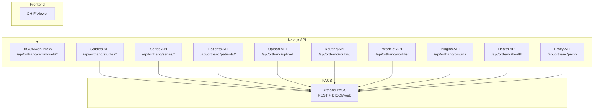

**Diagram sources**
- [route.ts:1-36](file://src/app/api/orthanc/dicom-web/[...path]/route.ts#L1-L36)
- [route.ts:1-85](file://src/app/api/orthanc/studies/route.ts#L1-L85)
- [route.ts:1-92](file://src/app/api/orthanc/studies/[id]/route.ts#L1-L92)
- [route.ts:1-46](file://src/app/api/orthanc/series/[id]/route.ts#L1-L46)
- [route.ts:1-38](file://src/app/api/orthanc/patients/[id]/route.ts#L1-L38)
- [route.ts:1-34](file://src/app/api/orthanc/upload/route.ts#L1-L34)
- [route.ts:1-69](file://src/app/api/orthanc/routing/route.ts#L1-L69)
- [route.ts:1-80](file://src/app/api/orthanc/worklist/route.ts#L1-L80)
- [route.ts:1-56](file://src/app/api/orthanc/plugins/route.ts#L1-L56)
- [route.ts:1-30](file://src/app/api/orthanc/health/route.ts#L1-L30)
- [route.ts:1-34](file://src/app/api/orthanc/proxy/route.ts#L1-L34)

**Section sources**
- [docker-compose.yml:41-55](file://docker-compose.yml#L41-L55)
- [orthanc.json:1-21](file://docker/orthanc/orthanc.json#L1-L21)
- [orthanc.json:1-16](file://services/orthanc.json#L1-L16)

## Core Components
- DICOMweb Proxy: Transparently forwards QIDO-RS/WADO-RS/STOW-RS requests from OHIF to Orthanc while keeping credentials server-side.
- Study/Series/Patient APIs: Enriched views over Orthanc resources with expanded metadata and stable indicators.
- Upload API: Accepts multipart DICOM files and forwards them to Orthanc’s DICOMweb STOW-RS or DICOM endpoint.
- Routing API: Sends C-STORE requests to target modalities or peers via Orthanc’s modalities/peers store endpoints.
- Worklist API: Returns MWL entries from Orthanc when available; falls back to local appointments if not configured.
- Plugins API: Lists installed plugins and active jobs to monitor runtime state.
- Health API: Aggregates system, jobs, metrics, plugins, modalities, and peers snapshots.
- Proxy API: Sanitized pass-through for arbitrary Orthanc REST paths.

**Section sources**
- [route.ts:1-36](file://src/app/api/orthanc/dicom-web/[...path]/route.ts#L1-L36)
- [route.ts:1-85](file://src/app/api/orthanc/studies/route.ts#L1-L85)
- [route.ts:1-92](file://src/app/api/orthanc/studies/[id]/route.ts#L1-L92)
- [route.ts:1-46](file://src/app/api/orthanc/series/[id]/route.ts#L1-L46)
- [route.ts:1-38](file://src/app/api/orthanc/patients/[id]/route.ts#L1-L38)
- [route.ts:1-34](file://src/app/api/orthanc/upload/route.ts#L1-L34)
- [route.ts:1-69](file://src/app/api/orthanc/routing/route.ts#L1-L69)
- [route.ts:1-80](file://src/app/api/orthanc/worklist/route.ts#L1-L80)
- [route.ts:1-56](file://src/app/api/orthanc/plugins/route.ts#L1-L56)
- [route.ts:1-30](file://src/app/api/orthanc/health/route.ts#L1-L30)
- [route.ts:1-34](file://src/app/api/orthanc/proxy/route.ts#L1-L34)

## Architecture Overview
The integration uses a layered approach:
- Frontend (OHIF) communicates only with the Next.js origin using DICOMweb roots.
- Next.js enforces authentication and sanitizes paths before forwarding to Orthanc.
- Orthanc provides DICOM storage, indexing, and DICOMweb services (QIDO/WADO/STOW).
- Optional backend services coordinate FHIR updates and automation workflows.

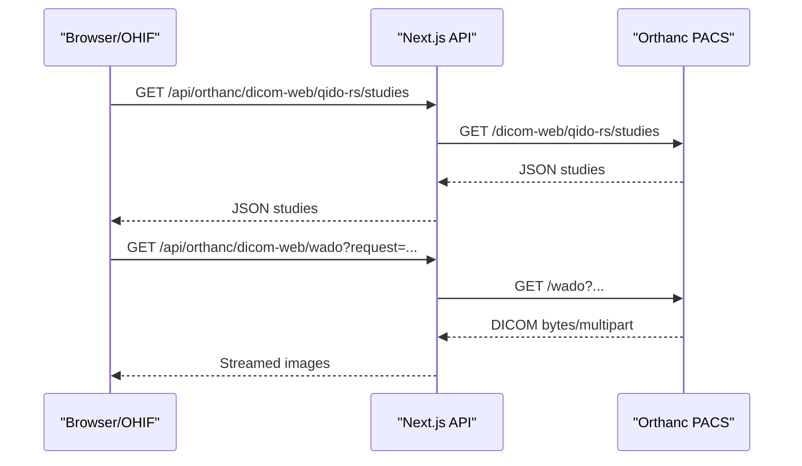

**Diagram sources**
- [route.ts:1-36](file://src/app/api/orthanc/dicom-web/[...path]/route.ts#L1-L36)
- [app-config.js:34-48](file://ohif-config/app-config.js#L34-L48)

## Detailed Component Analysis

### DICOMweb Proxy (QIDO-RS/WADO-RS/STOW-RS)
- Purpose: Provide same-origin access for OHIF without exposing Orthanc credentials to the browser.
- Security: Rejects path traversal and invalid segments; forwards only safe DICOMweb paths.
- Behavior: Forwards query parameters and preserves content types; returns upstream status codes.

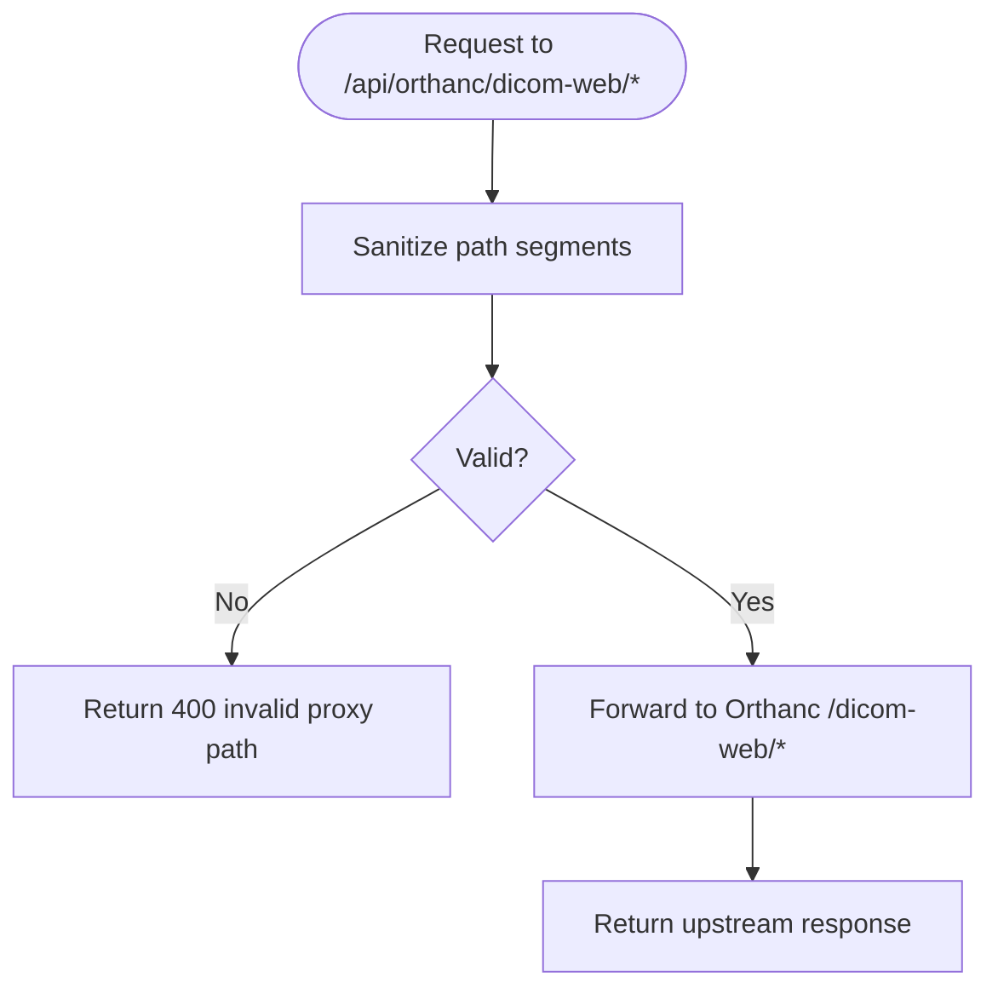

**Diagram sources**
- [route.ts:1-36](file://src/app/api/orthanc/dicom-web/[...path]/route.ts#L1-L36)

**Section sources**
- [route.ts:1-36](file://src/app/api/orthanc/dicom-web/[...path]/route.ts#L1-L36)
- [app-config.js:34-48](file://ohif-config/app-config.js#L34-L48)

### Studies Listing and Metadata Extraction
- Lists recent studies with pagination and expansion flags.
- Derives modalities per study from series when missing at study level.
- Filters out unknown patients for worklist visibility.

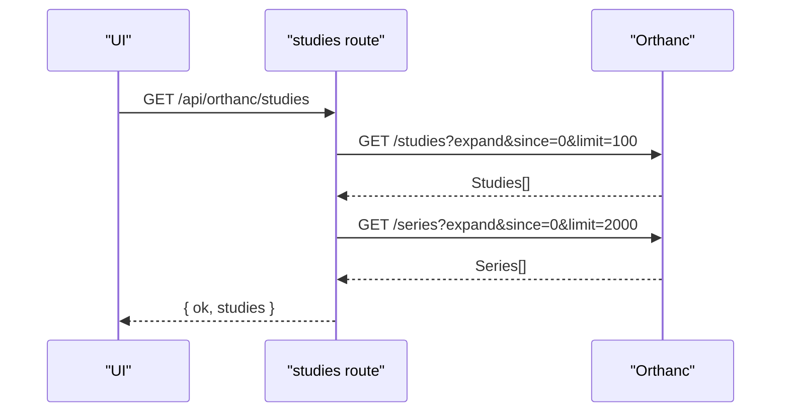

**Diagram sources**
- [route.ts:1-85](file://src/app/api/orthanc/studies/route.ts#L1-L85)

**Section sources**
- [route.ts:1-85](file://src/app/api/orthanc/studies/route.ts#L1-L85)

### Study Detail and Series Retrieval
- Retrieves full study detail including patient tags, accession, dates, and series list.
- Extracts instance counts and series-level metadata for viewer consumption.

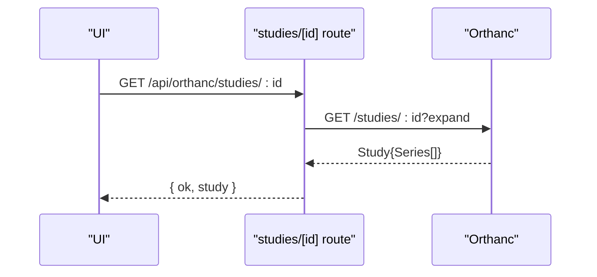

**Diagram sources**
- [route.ts:1-92](file://src/app/api/orthanc/studies/[id]/route.ts#L1-L92)

**Section sources**
- [route.ts:1-92](file://src/app/api/orthanc/studies/[id]/route.ts#L1-L92)

### Series Detail with Instances
- Expands a series to include its instances and expected counts.
- Provides series-level metadata such as modality, description, and body part.

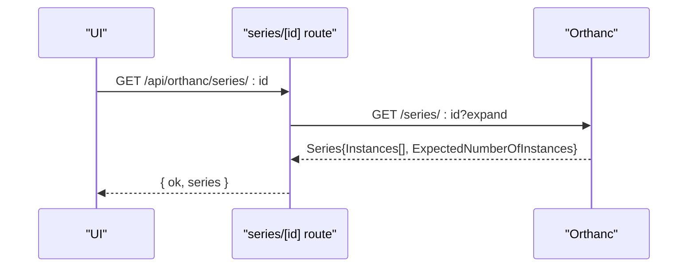

**Diagram sources**
- [route.ts:1-46](file://src/app/api/orthanc/series/[id]/route.ts#L1-L46)

**Section sources**
- [route.ts:1-46](file://src/app/api/orthanc/series/[id]/route.ts#L1-L46)

### Patient Summary
- Fetches patient metadata and associated studies concurrently.
- Includes stability and last update timestamps for caching decisions.

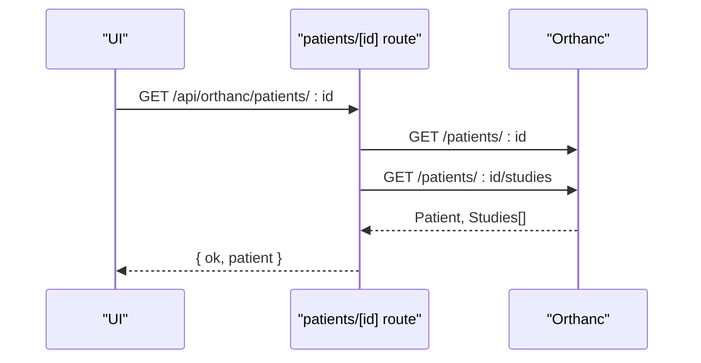

**Diagram sources**
- [route.ts:1-38](file://src/app/api/orthanc/patients/[id]/route.ts#L1-L38)

**Section sources**
- [route.ts:1-38](file://src/app/api/orthanc/patients/[id]/route.ts#L1-L38)

### Image Upload (STOW-RS/DICOM)
- Accepts multipart form data with DICOM files.
- Forwards each file to Orthanc’s DICOMweb STOW-RS or DICOM endpoint.
- Returns stored instance IDs for tracking.

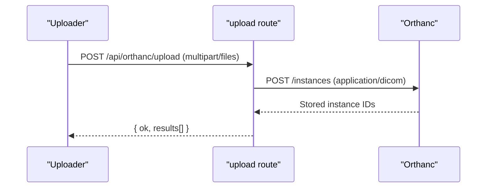

**Diagram sources**
- [route.ts:1-34](file://src/app/api/orthanc/upload/route.ts#L1-L34)

**Section sources**
- [route.ts:1-34](file://src/app/api/orthanc/upload/route.ts#L1-L34)

### Storage Commitment
- Triggers DICOM Storage Commitment (N-ACTION) to verify safe storage of instances.
- Enumerates instances under a study and initiates commitment workflow.

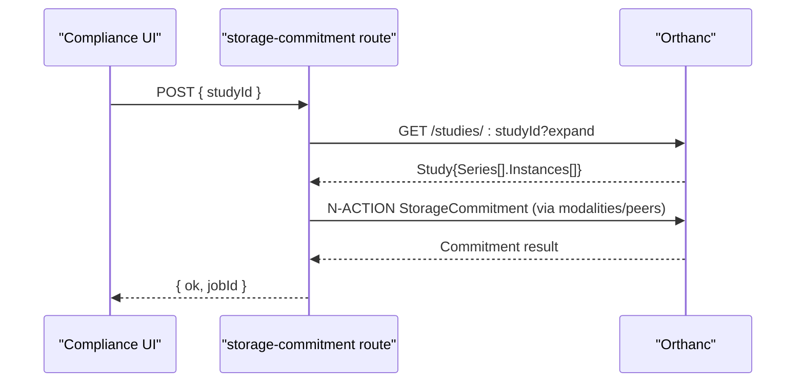

**Diagram sources**
- [route.ts:1-39](file://src/app/api/orthanc/storage-commitment/route.ts#L1-L39)

**Section sources**
- [route.ts:1-39](file://src/app/api/orthanc/storage-commitment/route.ts#L1-L39)

### Study Routing (C-STORE)
- Routes a study to a target modality or peer using Orthanc’s modalities/peers store endpoints.
- Audits actions and publishes events for downstream automation.

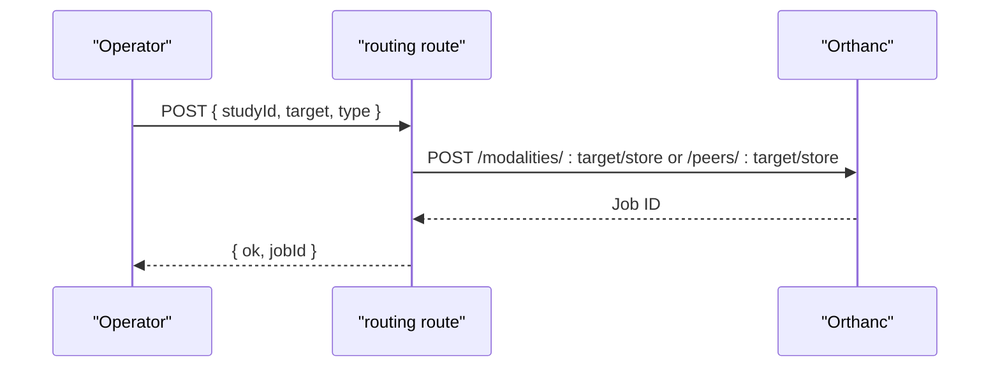

**Diagram sources**
- [route.ts:1-69](file://src/app/api/orthanc/routing/route.ts#L1-L69)

**Section sources**
- [route.ts:1-69](file://src/app/api/orthanc/routing/route.ts#L1-L69)

### Worklist Synchronization (MWL)
- Queries Orthanc’s Modality Worklist Server when configured.
- Falls back to local appointment schedule if Orthanc is unavailable.

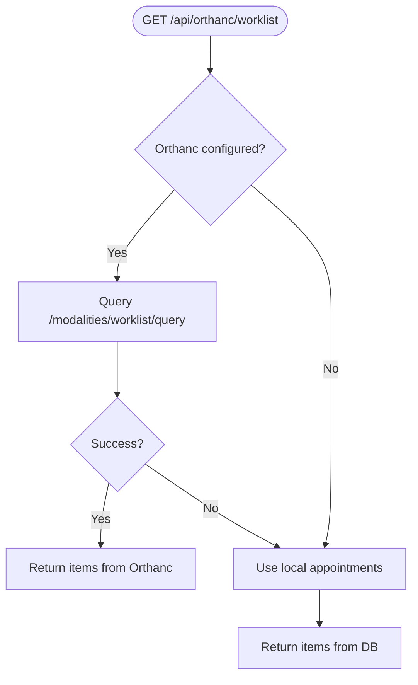

**Diagram sources**
- [route.ts:1-80](file://src/app/api/orthanc/worklist/route.ts#L1-L80)

**Section sources**
- [route.ts:1-80](file://src/app/api/orthanc/worklist/route.ts#L1-L80)

### Plugins and Jobs Monitoring
- Lists installed plugins and aggregates active job counts by plugin.
- Helps diagnose background tasks triggered by routing, commit, or other operations.

**Section sources**
- [route.ts:1-56](file://src/app/api/orthanc/plugins/route.ts#L1-L56)

### Health Checks
- Aggregates Orthanc system info, jobs, metrics, plugins, modalities, and peers into a single snapshot.
- Useful for readiness probes and dashboards.

**Section sources**
- [route.ts:1-30](file://src/app/api/orthanc/health/route.ts#L1-L30)

### Generic Proxy
- Sanitized pass-through for arbitrary Orthanc REST endpoints.
- Validates input to prevent path traversal and injection.

**Section sources**
- [route.ts:1-34](file://src/app/api/orthanc/proxy/route.ts#L1-L34)

## Dependency Analysis
- Next.js routes depend on environment configuration for Orthanc URL and credentials.
- OHIF config points to Next.js DICOMweb proxy to avoid CORS and credential exposure.
- Backend services read Orthanc URL from settings and can trigger FHIR sync and automation.

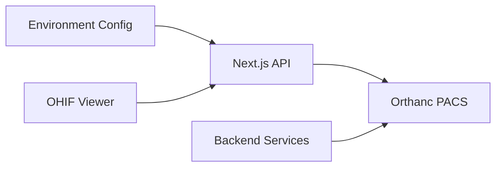

**Diagram sources**
- [config.py:1-20](file://backend/app/core/config.py#L1-L20)
- [integrations.py:1-119](file://backend/app/core/integrations.py#L1-L119)
- [app-config.js:34-48](file://ohif-config/app-config.js#L34-L48)

**Section sources**
- [config.py:1-20](file://backend/app/core/config.py#L1-L20)
- [integrations.py:1-119](file://backend/app/core/integrations.py#L1-L119)
- [app-config.js:34-48](file://ohif-config/app-config.js#L34-L48)

## Performance Considerations
- Timeouts: Each upstream call uses a timeout wrapper to fail fast and avoid hanging requests.
- Concurrency: Parallel fetching of related resources (e.g., patient + studies) reduces latency.
- Pagination: Studies listing uses limit and since parameters to control payload size.
- Expansion Flags: Use expand selectively to avoid heavy payloads when not needed.
- Streaming: WADO-RS responses are streamed through the proxy to minimize memory pressure.
- Connection Pooling: Node.js HTTP client reuse is handled by the runtime; ensure keep-alive defaults are appropriate for high-throughput environments.
- Large Datasets: Prefer series-level queries and frame-specific WADO-RS requests to reduce bandwidth.

[No sources needed since this section provides general guidance]

## Troubleshooting Guide
- Not configured: If Orthanc URL is missing, endpoints return a 503 with reason “not_configured”.
- Upstream errors: HTTP status codes from Orthanc are proxied with prefixed reasons (e.g., “upstream_http_404”).
- Unreachable: Network or DNS failures surface as “unreachable” with 502 status.
- Invalid proxy path: Path traversal attempts are rejected with 400.
- Worklist fallback: When Orthanc is down, the worklist endpoint serves local appointments to keep the UI functional.
- Storage commitment failures: Inspect returned job IDs and check Orthanc jobs/plugins for errors.
- Routing failures: Review target modality/peer configuration and connectivity; audit logs capture outcomes.

**Section sources**
- [route.ts:1-36](file://src/app/api/orthanc/dicom-web/[...path]/route.ts#L1-L36)
- [route.ts:1-85](file://src/app/api/orthanc/studies/route.ts#L1-L85)
- [route.ts:1-92](file://src/app/api/orthanc/studies/[id]/route.ts#L1-L92)
- [route.ts:1-46](file://src/app/api/orthanc/series/[id]/route.ts#L1-L46)
- [route.ts:1-38](file://src/app/api/orthanc/patients/[id]/route.ts#L1-L38)
- [route.ts:1-34](file://src/app/api/orthanc/upload/route.ts#L1-L34)
- [route.ts:1-69](file://src/app/api/orthanc/routing/route.ts#L1-L69)
- [route.ts:1-80](file://src/app/api/orthanc/worklist/route.ts#L1-L80)
- [route.ts:1-56](file://src/app/api/orthanc/plugins/route.ts#L1-L56)
- [route.ts:1-30](file://src/app/api/orthanc/health/route.ts#L1-L30)
- [route.ts:1-34](file://src/app/api/orthanc/proxy/route.ts#L1-L34)

## Conclusion
GeraldOS integrates with Orthanc through a secure, robust Next.js API layer that abstracts DICOM and DICOMweb protocols behind familiar REST endpoints. It supports comprehensive study management, worklist synchronization, image upload and retrieval, routing, and operational monitoring. With timeouts, parallelism, and selective expansion, it balances responsiveness and reliability for large imaging datasets.

[No sources needed since this section summarizes without analyzing specific files]

## Appendices

### Orthanc Deployment and Plugins
- Docker Compose provisions Orthanc with DICOMweb enabled and basic authentication.
- Service configurations enable PostgreSQL index/storage plugins and DICOMweb roots.

**Section sources**
- [docker-compose.yml:41-55](file://docker-compose.yml#L41-L55)
- [orthanc.json:1-21](file://docker/orthanc/orthanc.json#L1-L21)
- [orthanc.json:1-16](file://services/orthanc.json#L1-L16)

### Backend Integration Hooks
- Backend reads Orthanc URL from settings and can synchronize imaging data to FHIR and trigger automation workflows.

**Section sources**
- [config.py:1-20](file://backend/app/core/config.py#L1-L20)
- [integrations.py:60-83](file://backend/app/core/integrations.py#L60-L83)
- [integrations.py:85-101](file://backend/app/core/integrations.py#L85-L101)
- [main.py:185-197](file://backend/app/main.py#L185-L197)