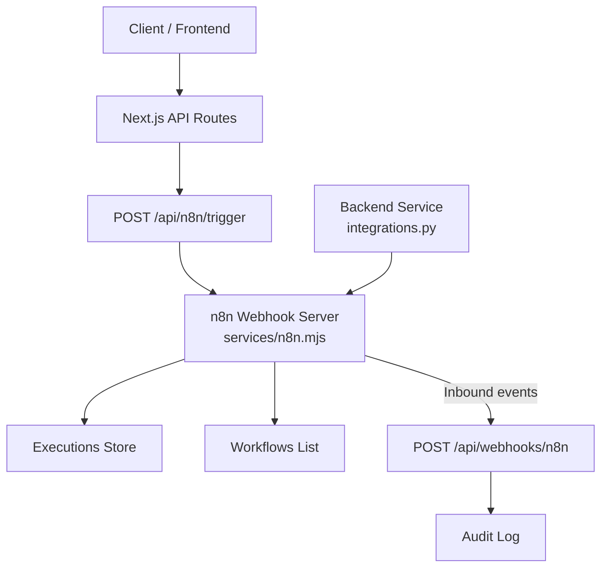
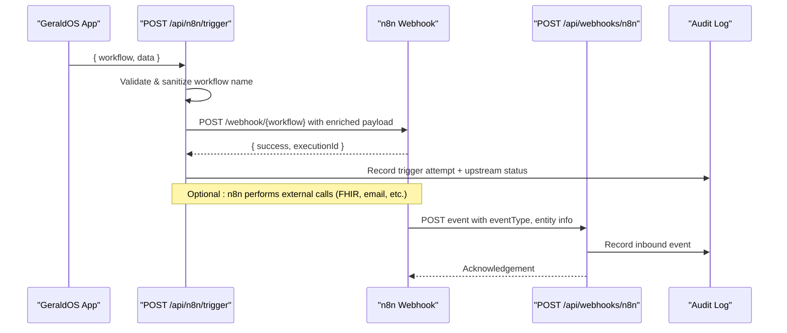
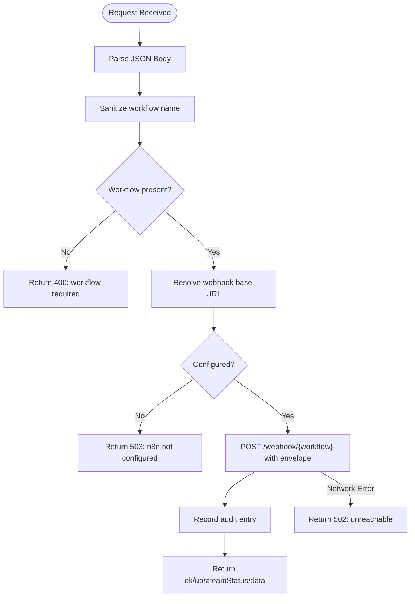
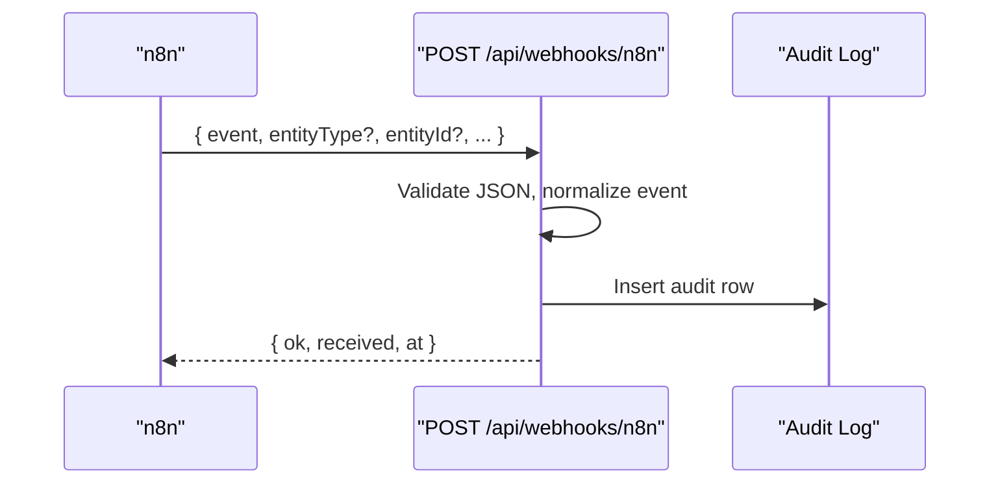
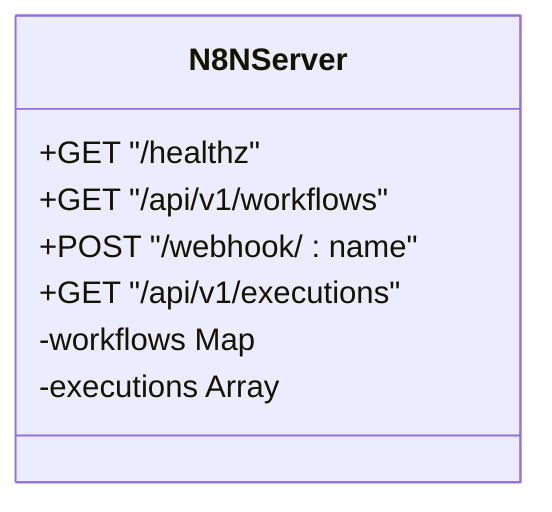
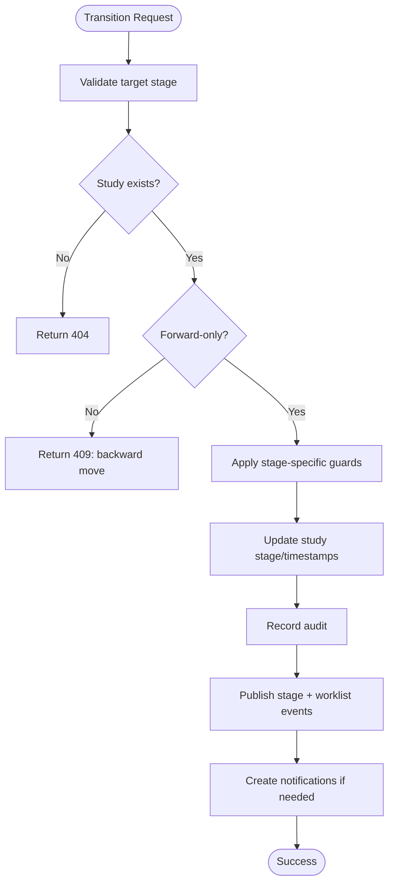
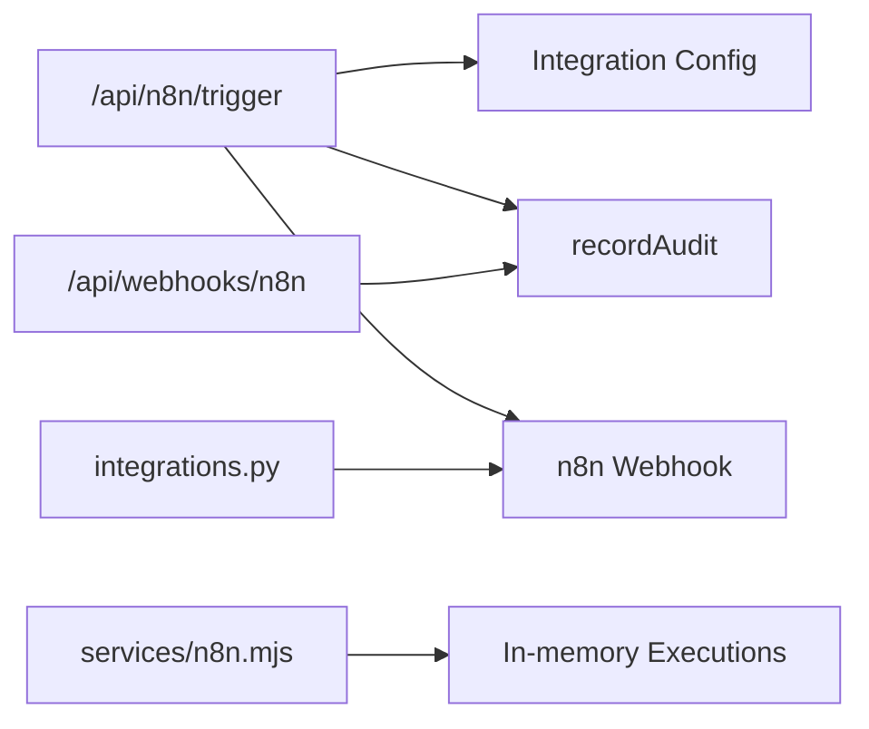

# Workflow Automation (n8n)

<cite>
**Referenced Files in This Document**
- [services/n8n.mjs](file://services/n8n.mjs)
- [src/app/api/n8n/trigger/route.ts](file://src/app/api/n8n/trigger/route.ts)
- [src/app/api/webhooks/n8n/route.ts](file://src/app/api/webhooks/n8n/route.ts)
- [src/lib/workflow.ts](file://src/lib/workflow.ts)
- [backend/app/core/integrations.py](file://backend/app/core/integrations.py)
- [src/app/api/claims/route.ts](file://src/app/api/claims/route.ts)
- [README.md](file://README.md)
</cite>

## Table of Contents
1. Introduction
2. Project Structure
3. Core Components
4. Architecture Overview
5. Detailed Component Analysis
6. Dependency Analysis
7. Performance Considerations
8. Troubleshooting Guide
9. Conclusion

## Introduction
This document explains how GeraldOS integrates with n8n to automate clinical and operational workflows. It covers webhook-based event triggering, workflow execution patterns, data transformation between GeraldOS and external systems, and the API endpoints used for workflow management and execution monitoring. It also provides examples for patient registration, appointment reminders, and report distribution pipelines, along with guidance on error handling, retry logic, dead letter queue strategies, webhook security, idempotency, debugging, performance monitoring, and scaling for high-volume scenarios.

## Project Structure
GeraldOS exposes Next.js API routes that trigger n8n workflows and receive inbound events from n8n. A lightweight local n8n mock server is provided for development and testing. The backend Python service also demonstrates integration points to n8n for notifications.

**Diagram sources**
- [src/app/api/n8n/trigger/route.ts:7-46](file://src/app/api/n8n/trigger/route.ts#L7-L46)
- [services/n8n.mjs:20-41](file://services/n8n.mjs#L20-L41)
- [src/app/api/webhooks/n8n/route.ts:6-27](file://src/app/api/webhooks/n8n/route.ts#L6-L27)
- [backend/app/core/integrations.py:85-101](file://backend/app/core/integrations.py#L85-L101)

**Section sources**
- [src/app/api/n8n/trigger/route.ts:7-46](file://src/app/api/n8n/trigger/route.ts#L7-L46)
- [services/n8n.mjs:20-41](file://services/n8n.mjs#L20-L41)
- [src/app/api/webhooks/n8n/route.ts:6-27](file://src/app/api/webhooks/n8n/route.ts#L6-L27)
- [backend/app/core/integrations.py:85-101](file://backend/app/core/integrations.py#L85-L101)

## Core Components
- Outbound trigger endpoint: POST /api/n8n/trigger accepts a workflow name and payload, validates inputs, builds a canonical webhook URL, forwards the event to n8n, audits the attempt, and returns upstream status and response.
- Inbound webhook handler: POST /api/webhooks/n8n receives events from n8n back into GeraldOS, validates JSON, normalizes the event type, and records an audit entry.
- Local n8n mock server: Provides health, workflow listing, webhook ingestion, and execution history for development and testing.
- Clinical workflow state machine: Ensures studies advance through validated stages, publishes events, updates worklists, and emits notifications at key transitions.
- Backend integration helper: Demonstrates how the Python backend can call n8n webhooks for notifications.

**Section sources**
- [src/app/api/n8n/trigger/route.ts:7-46](file://src/app/api/n8n/trigger/route.ts#L7-L46)
- [src/app/api/webhooks/n8n/route.ts:6-27](file://src/app/api/webhooks/n8n/route.ts#L6-L27)
- [services/n8n.mjs:10-41](file://services/n8n.mjs#L10-L41)
- [src/lib/workflow.ts:37-51](file://src/lib/workflow.ts#L37-L51)
- [backend/app/core/integrations.py:85-101](file://backend/app/core/integrations.py#L85-L101)

## Architecture Overview
The automation architecture centers on two-way communication:
- GeraldOS triggers n8n workflows via a secure, audited outbound endpoint.
- n8n executes automations and may send results or acknowledgments back to GeraldOS via a webhook endpoint that writes to the audit log.

**Diagram sources**
- [src/app/api/n8n/trigger/route.ts:7-46](file://src/app/api/n8n/trigger/route.ts#L7-L46)
- [src/app/api/webhooks/n8n/route.ts:6-27](file://src/app/api/webhooks/n8n/route.ts#L6-L27)

## Detailed Component Analysis

### Outbound Trigger Endpoint: POST /api/n8n/trigger
- Purpose: Expose a controlled surface for GeraldOS to trigger n8n workflows by name with arbitrary payloads.
- Behavior:
  - Reads request body and sanitizes the workflow name to a safe identifier.
  - Resolves the webhook base URL from configuration; returns 503 if not configured.
  - Forwards a POST to n8n with a standardized envelope including source and timestamp.
  - Audits the trigger attempt with upstream status.
  - Returns a normalized response indicating success/failure and upstream status.
  - On network errors, returns 502 with details.

**Diagram sources**
- [src/app/api/n8n/trigger/route.ts:7-46](file://src/app/api/n8n/trigger/route.ts#L7-L46)

**Section sources**
- [src/app/api/n8n/trigger/route.ts:7-46](file://src/app/api/n8n/trigger/route.ts#L7-L46)

### Inbound Webhook Handler: POST /api/webhooks/n8n
- Purpose: Receive events from n8n back into GeraldOS for auditing and downstream processing.
- Behavior:
  - Accepts JSON only; returns 400 on invalid JSON.
  - Normalizes event type from payload or defaults to a generic event.
  - Records an audit entry with module, entity type/id, and full details.
  - Returns a simple acknowledgement with received event and timestamp.

**Diagram sources**
- [src/app/api/webhooks/n8n/route.ts:6-27](file://src/app/api/webhooks/n8n/route.ts#L6-L27)

**Section sources**
- [src/app/api/webhooks/n8n/route.ts:6-27](file://src/app/api/webhooks/n8n/route.ts#L6-L27)

### Local n8n Mock Server
- Purpose: Provide a minimal HTTP server implementing core n8n-like endpoints for development and testing.
- Endpoints:
  - GET /healthz: Health check returning version.
  - GET /api/v1/workflows: Lists pre-seeded workflows.
  - POST /webhook/{name}: Accepts payloads, stores executions, returns executionId.
  - GET /api/v1/executions: Returns recent executions.

**Diagram sources**
- [services/n8n.mjs:10-41](file://services/n8n.mjs#L10-L41)

**Section sources**
- [services/n8n.mjs:10-41](file://services/n8n.mjs#L10-L41)

### Clinical Workflow State Machine Integration
- Purpose: Ensure studies move through validated stages with strong guards, audit trails, and event publishing.
- Key behaviors:
  - Forward-only transitions with explicit stage validation.
  - Guards for clinically meaningful stages (e.g., requires radiologist assignment before opening).
  - Emits events and updates worklist upon successful transitions.
  - Creates notifications for significant handoffs.

**Diagram sources**
- [src/lib/workflow.ts:93-233](file://src/lib/workflow.ts#L93-L233)

**Section sources**
- [src/lib/workflow.ts:37-51](file://src/lib/workflow.ts#L37-L51)
- [src/lib/workflow.ts:93-233](file://src/lib/workflow.ts#L93-L233)

### Backend Integration Example
- Purpose: Demonstrate how the Python backend can trigger n8n workflows for notifications.
- Behavior:
  - Builds a payload with run context and message.
  - Posts to a configured n8n webhook URL.
  - Returns success based on HTTP status.

**Section sources**
- [backend/app/core/integrations.py:85-101](file://backend/app/core/integrations.py#L85-L101)

### Claims Submission Automation
- Purpose: Show an example of firing an n8n workflow after creating an insurance claim.
- Behavior:
  - Creates a claim record and audits it.
  - Best-effort POST to n8n webhook for automation (timeout applied).
  - Failure does not block claim creation.

**Section sources**
- [src/app/api/claims/route.ts:38-82](file://src/app/api/claims/route.ts#L38-L82)

## Dependency Analysis
- Next.js API routes depend on:
  - Configuration for integration endpoints (n8n base URL).
  - Audit logging utility for compliance and observability.
  - Timed fetch utilities for timeouts and resilience.
- The n8n mock server depends on Node’s http module and maintains in-memory state for workflows and executions.
- The Python backend depends on environment variables for service URLs and uses async HTTP client to call n8n.

**Diagram sources**
- [src/app/api/n8n/trigger/route.ts:7-46](file://src/app/api/n8n/trigger/route.ts#L7-L46)
- [src/app/api/webhooks/n8n/route.ts:6-27](file://src/app/api/webhooks/n8n/route.ts#L6-L27)
- [services/n8n.mjs:20-41](file://services/n8n.mjs#L20-L41)
- [backend/app/core/integrations.py:85-101](file://backend/app/core/integrations.py#L85-L101)

**Section sources**
- [src/app/api/n8n/trigger/route.ts:7-46](file://src/app/api/n8n/trigger/route.ts#L7-L46)
- [src/app/api/webhooks/n8n/route.ts:6-27](file://src/app/api/webhooks/n8n/route.ts#L6-L27)
- [services/n8n.mjs:20-41](file://services/n8n.mjs#L20-L41)
- [backend/app/core/integrations.py:85-101](file://backend/app/core/integrations.py#L85-L101)

## Performance Considerations
- Timeouts: Use timeouts when calling n8n to prevent blocking requests. The trigger endpoint enforces a timeout on outbound calls; claims submission uses a short timeout for best-effort automation.
- Asynchronous design: Keep automation triggers fire-and-forget where possible to avoid impacting user-facing latency.
- Batching: For high-volume events (e.g., many study transitions), consider batching events before sending to n8n to reduce overhead.
- Idempotency: Design n8n workflows to be idempotent using stable IDs so retries do not cause duplicate side effects.
- Observability: Rely on audit logs and execution history to monitor throughput and latency.

[No sources needed since this section provides general guidance]

## Troubleshooting Guide
- Common issues:
  - n8n not configured: The trigger endpoint returns 503 if no webhook base URL is available. Verify environment configuration.
  - Network failures: Unreachable n8n returns 502 with details. Check connectivity and firewall rules.
  - Invalid payloads: Inbound webhook handler returns 400 for invalid JSON. Ensure content-type and schema are correct.
  - Missing workflow name: Outbound trigger returns 400 if workflow name is absent or empty.
- Debugging steps:
  - Inspect audit logs for both outbound triggers and inbound events.
  - Use the local n8n mock server to validate end-to-end flows without external dependencies.
  - Review upstream status codes returned by n8n to diagnose failures.
- Retries and dead letter queues:
  - Implement retry with exponential backoff at the caller level for transient failures.
  - Persist failed executions to a dead letter store for later inspection and replay.
  - Use idempotency keys in payloads to safely reprocess duplicates.

**Section sources**
- [src/app/api/n8n/trigger/route.ts:7-46](file://src/app/api/n8n/trigger/route.ts#L7-L46)
- [src/app/api/webhooks/n8n/route.ts:6-27](file://src/app/api/webhooks/n8n/route.ts#L6-L27)
- [services/n8n.mjs:20-41](file://services/n8n.mjs#L20-L41)

## Conclusion
GeraldOS integrates with n8n through well-defined, audited endpoints that support robust automation across clinical and operational domains. The system enforces secure, validated interactions, provides clear failure modes, and offers mechanisms for monitoring and scaling. By following the patterns outlined here—timeouts, idempotency, audit logging, and structured eventing—you can build reliable, high-volume automation pipelines that integrate seamlessly with GeraldOS workflows.

[No sources needed since this section summarizes without analyzing specific files]