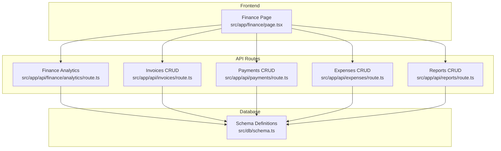
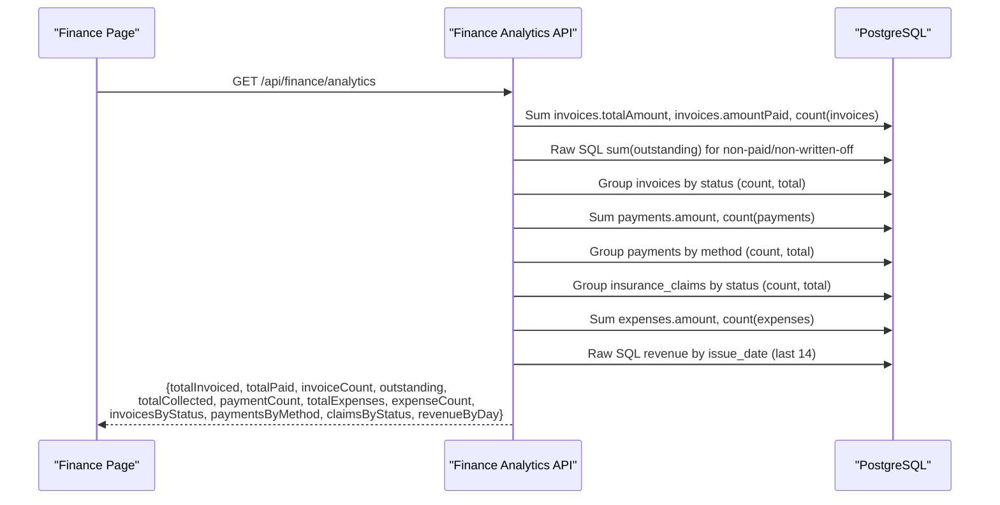
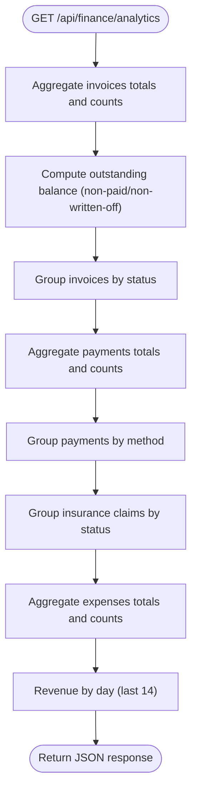
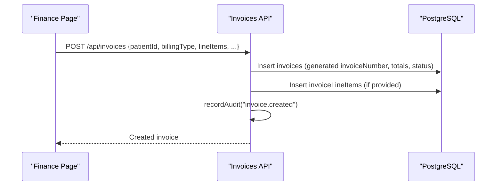
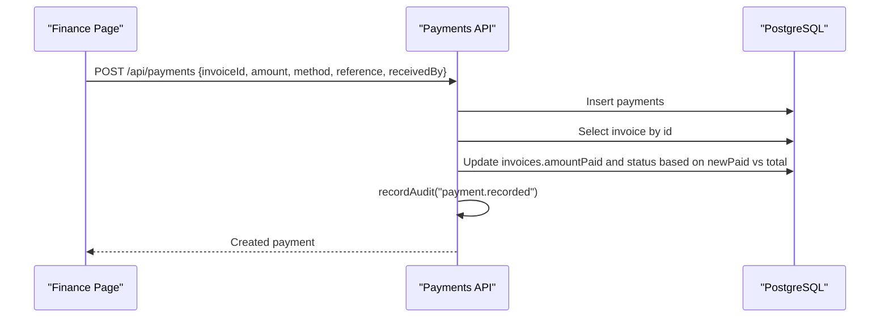
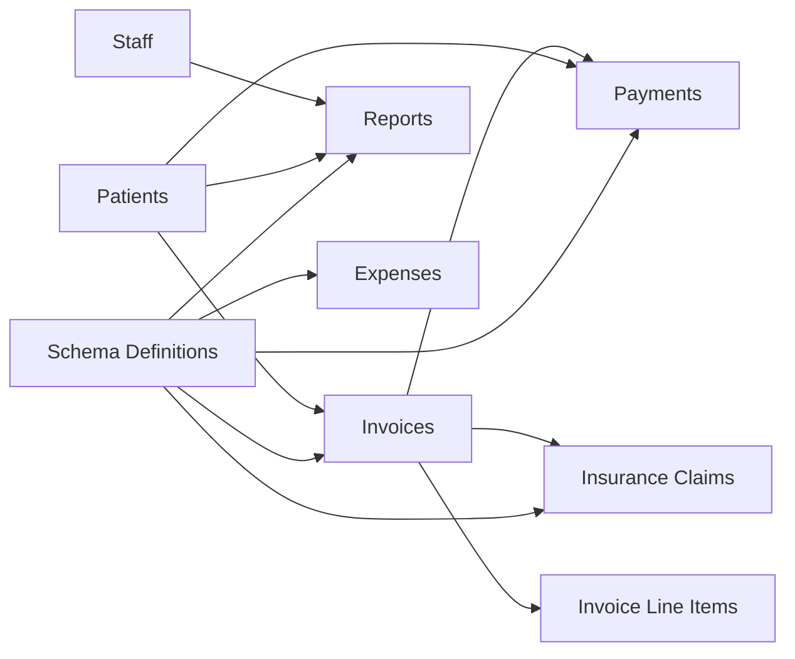
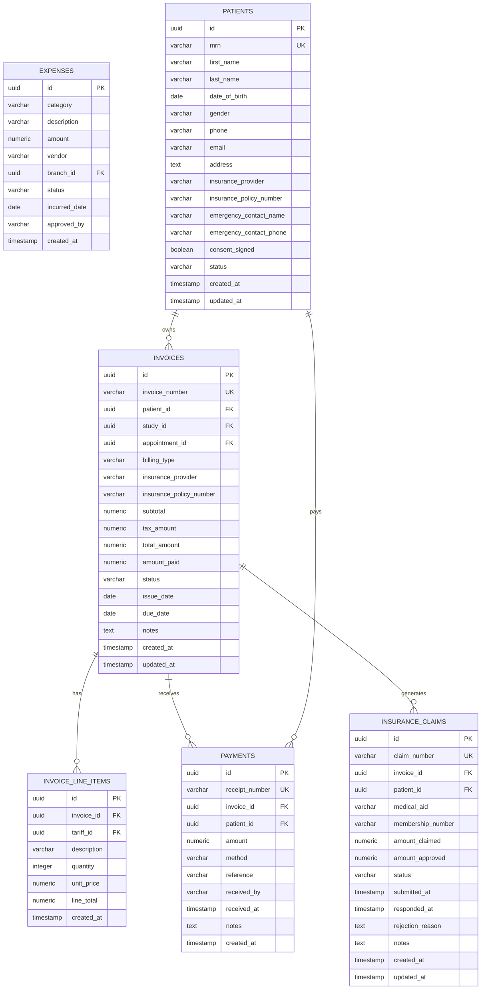

# Financial Analytics & Reporting

<cite>
**Referenced Files in This Document**
- [route.ts](file://src/app/api/finance/analytics/route.ts)
- [schema.ts](file://src/db/schema.ts)
- [route.ts](file://src/app/api/invoices/route.ts)
- [route.ts](file://src/app/api/payments/route.ts)
- [route.ts](file://src/app/api/expenses/route.ts)
- [page.tsx](file://src/app/finance/page.tsx)
- [finance.ts](file://src/lib/finance.ts)
- [reporting.ts](file://src/lib/reporting.ts)
- [route.ts](file://src/app/api/reports/route.ts)
</cite>

## Table of Contents
1. Introduction
2. Project Structure
3. Core Components
4. Architecture Overview
5. Detailed Component Analysis
6. Dependency Analysis
7. Performance Considerations
8. Troubleshooting Guide
9. Conclusion
10. Appendices

## Introduction
This document explains the financial analytics and reporting capabilities implemented in the platform. It covers key performance indicators (KPIs) such as total invoiced amounts, collections, outstanding balances, and expense tracking; describes how analytics data is aggregated and presented; and documents the available API endpoints for finance analytics, invoices, payments, expenses, and reports. It also provides examples of revenue cycle analysis, collection efficiency metrics, and financial trend reporting, along with guidance on data visualization components and custom report generation.

## Project Structure
The financial analytics feature is built around a set of Next.js API routes that aggregate data from the database schema and serve it to the Finance dashboard. The Finance page consumes these APIs to render KPI cards, tables, and charts.

**Diagram sources**
- [route.ts:1-71](file://src/app/api/finance/analytics/route.ts#L1-L71)
- [route.ts:1-100](file://src/app/api/invoices/route.ts#L1-L100)
- [route.ts:1-79](file://src/app/api/payments/route.ts#L1-L79)
- [route.ts:1-35](file://src/app/api/expenses/route.ts#L1-L35)
- [route.ts:1-46](file://src/app/api/reports/route.ts#L1-L46)
- [schema.ts:195-284](file://src/db/schema.ts#L195-L284)

**Section sources**
- [route.ts:1-71](file://src/app/api/finance/analytics/route.ts#L1-L71)
- [page.tsx:111-131](file://src/app/finance/page.tsx#L111-L131)
- [schema.ts:195-284](file://src/db/schema.ts#L195-L284)

## Core Components
- Finance Analytics API: Aggregates totals for invoiced, paid, collected, expenses, outstanding balances, and time-series revenue by day. Also groups invoices, payments, and claims by status/method.
- Invoices API: Lists invoices with patient details and supports creating invoices with line items and audit logging.
- Payments API: Lists payments with invoice and patient context; records payments and updates invoice payment status automatically.
- Expenses API: Lists and creates expense records with category, vendor, date, and approval fields.
- Reports API: Lists and creates clinical reports (separate domain but integrated into the same platform).
- Finance Utilities: Generates unique identifiers for invoices, receipts, claims, and employees; defines billing types, payment methods, statuses, categories, and employment types.

Key KPIs exposed by the Finance Analytics endpoint include:
- Total invoiced amount
- Total paid amount
- Invoice count
- Outstanding balance (excluding paid/written-off)
- Total collected amount
- Payment count
- Total expenses and expense count
- Invoices grouped by status (count and total)
- Payments grouped by method (count and total)
- Claims grouped by status (count and total)
- Revenue by day (last 14 days)

**Section sources**
- [route.ts:8-66](file://src/app/api/finance/analytics/route.ts#L8-L66)
- [route.ts:8-37](file://src/app/api/invoices/route.ts#L8-L37)
- [route.ts:46-99](file://src/app/api/invoices/route.ts#L46-L99)
- [route.ts:8-33](file://src/app/api/payments/route.ts#L8-L33)
- [route.ts:35-78](file://src/app/api/payments/route.ts#L35-L78)
- [route.ts:6-13](file://src/app/api/expenses/route.ts#L6-L13)
- [route.ts:15-34](file://src/app/api/expenses/route.ts#L15-L34)
- [finance.ts:1-35](file://src/lib/finance.ts#L1-L35)

## Architecture Overview
The system follows a straightforward server-side aggregation pattern:
- Frontend requests analytics via GET /api/finance/analytics.
- The route queries multiple tables (invoices, payments, insurance_claims, expenses) using Drizzle ORM and raw SQL where needed.
- Results are returned as JSON for the Finance dashboard to render KPIs and charts.

**Diagram sources**
- [route.ts:8-66](file://src/app/api/finance/analytics/route.ts#L8-L66)

**Section sources**
- [route.ts:1-71](file://src/app/api/finance/analytics/route.ts#L1-L71)

## Detailed Component Analysis

### Finance Analytics Endpoint
- Purpose: Provide consolidated financial metrics and groupings for dashboards.
- Data sources: invoices, payments, insurance_claims, expenses.
- Aggregation logic:
  - Totals: sum of invoice totals, invoice paid amounts, payment amounts, expense amounts.
  - Counts: number of invoices, payments, expenses.
  - Outstanding: sum of (total_amount - amount_paid) for invoices not paid or written off.
  - Groupings: invoices by status, payments by method, claims by status.
  - Time series: last 14 days of revenue by issue_date.
- Error handling: Returns a 500 JSON error with detail on failure.

**Diagram sources**
- [route.ts:8-66](file://src/app/api/finance/analytics/route.ts#L8-L66)

**Section sources**
- [route.ts:8-66](file://src/app/api/finance/analytics/route.ts#L8-L66)

### Invoices API
- GET: Returns invoices joined with patients for display in the Finance dashboard.
- POST: Creates an invoice with generated invoice number, optional study/appointment linkage, billing type, insurance provider/policy, line items, and audit log entry. Status defaults to sent; tax amount is zero for medical imaging.

**Diagram sources**
- [route.ts:46-99](file://src/app/api/invoices/route.ts#L46-L99)

**Section sources**
- [route.ts:8-37](file://src/app/api/invoices/route.ts#L8-L37)
- [route.ts:46-99](file://src/app/api/invoices/route.ts#L46-L99)

### Payments API
- GET: Lists payments with invoice and patient context.
- POST: Records a payment against an invoice, updates invoice amountPaid and recalculates status (paid/partial), and logs an audit event.

**Diagram sources**
- [route.ts:35-78](file://src/app/api/payments/route.ts#L35-L78)

**Section sources**
- [route.ts:8-33](file://src/app/api/payments/route.ts#L8-L33)
- [route.ts:35-78](file://src/app/api/payments/route.ts#L35-L78)

### Expenses API
- GET: Lists expenses ordered by incurred date.
- POST: Creates an expense with category, description, amount, vendor, incurred date, approved by, and status.

**Section sources**
- [route.ts:6-13](file://src/app/api/expenses/route.ts#L6-L13)
- [route.ts:15-34](file://src/app/api/expenses/route.ts#L15-L34)

### Reports API
- GET: Lists reports with patient and radiologist context.
- POST: Creates a report draft.

**Section sources**
- [route.ts:6-35](file://src/app/api/reports/route.ts#L6-L35)
- [route.ts:37-46](file://src/app/api/reports/route.ts#L37-L46)

### Finance Utilities
- ID generators: invoice, receipt, claim, employee numbers.
- Constants: billing types, payment methods, invoice statuses, claim statuses, expense categories, employment types.

**Section sources**
- [finance.ts:1-35](file://src/lib/finance.ts#L1-L35)

## Dependency Analysis
The Finance dashboard depends on several API routes and the shared database schema. The analytics endpoint aggregates across multiple entities, while invoices and payments maintain referential integrity through foreign keys.

**Diagram sources**
- [schema.ts:195-284](file://src/db/schema.ts#L195-L284)

**Section sources**
- [schema.ts:195-284](file://src/db/schema.ts#L195-L284)

## Performance Considerations
- Aggregation queries: The analytics endpoint performs multiple aggregations and raw SQL calls per request. For large datasets, consider:
  - Adding indexes on frequently filtered columns (e.g., invoices.status, invoices.issue_date, payments.received_at).
  - Precomputing daily revenue snapshots if real-time precision is not required.
- Pagination: Current list endpoints return all rows. Implement pagination for invoices, payments, and expenses to reduce payload size.
- Caching: Introduce short-lived caching for analytics responses if dashboard refreshes are frequent.
- Transactional updates: Payment recording updates invoice totals atomically; ensure similar transactional patterns are used for other write paths.

[No sources needed since this section provides general guidance]

## Troubleshooting Guide
Common issues and resolutions:
- Analytics endpoint returns 500: Check database connectivity and permissions; inspect error detail in the JSON response.
- Outstanding balance incorrect: Ensure invoice statuses are correctly maintained; only unpaid and non-written-off invoices contribute to outstanding.
- Payment does not update invoice status: Verify invoice exists and that amount calculations are correct; check that amountPaid is updated and status transitions to partial or paid.
- Missing patient/invoice context in lists: Confirm joins are successful and foreign keys are valid.

**Section sources**
- [route.ts:67-70](file://src/app/api/finance/analytics/route.ts#L67-L70)
- [route.ts:34-37](file://src/app/api/invoices/route.ts#L34-L37)
- [route.ts:30-33](file://src/app/api/payments/route.ts#L30-L33)
- [route.ts:10-13](file://src/app/api/expenses/route.ts#L10-L13)

## Conclusion
The platform provides a robust foundation for financial analytics and reporting:
- Centralized analytics endpoint delivers KPIs and groupings for dashboards.
- Invoices, payments, and expenses are fully tracked with audit logging and automatic status updates.
- The Finance dashboard visualizes KPIs, enables operational workflows (create invoices, record payments, submit claims), and surfaces trends via revenue-by-day data.
- Extensibility points exist for adding filters, export capabilities, and advanced reporting features.

[No sources needed since this section summarizes without analyzing specific files]

## Appendices

### API Documentation Summary

- GET /api/finance/analytics
  - Response includes: totalInvoiced, totalPaid, invoiceCount, outstanding, totalCollected, paymentCount, totalExpenses, expenseCount, invoicesByStatus, paymentsByMethod, claimsByStatus, revenueByDay.
  - Notes: revenueByDay contains last 14 days grouped by issue_date.

- GET /api/invoices
  - Response: array of invoices with patient details.

- POST /api/invoices
  - Request body fields: patientId, studyId (optional), appointmentId (optional), billingType, insuranceProvider (optional), insurancePolicyNumber (optional), lineItems (array of description, quantity, unitPrice, tariffId), issueDate (optional), dueDate (optional), notes (optional).
  - Behavior: generates invoiceNumber, computes subtotal/tax/total, sets status to sent, inserts line items, audits creation.

- GET /api/payments
  - Response: array of payments with invoice and patient context.

- POST /api/payments
  - Request body fields: invoiceId, patientId, amount, method, reference (optional), receivedBy (optional), notes (optional).
  - Behavior: inserts payment, updates invoice amountPaid and status, audits recording.

- GET /api/expenses
  - Response: array of expenses ordered by incurred date.

- POST /api/expenses
  - Request body fields: category, description, amount, vendor (optional), incurredDate (optional), approvedBy (optional), status (optional).
  - Behavior: inserts expense with defaults.

- GET /api/reports
  - Response: array of reports with patient and radiologist context.

- POST /api/reports
  - Request body fields: patientId, studyId (optional), templateName (optional), findings (optional), impression (optional), recommendation (optional), status (optional).
  - Behavior: creates report draft.

**Section sources**
- [route.ts:6-66](file://src/app/api/finance/analytics/route.ts#L6-L66)
- [route.ts:8-37](file://src/app/api/invoices/route.ts#L8-L37)
- [route.ts:46-99](file://src/app/api/invoices/route.ts#L46-L99)
- [route.ts:8-33](file://src/app/api/payments/route.ts#L8-L33)
- [route.ts:35-78](file://src/app/api/payments/route.ts#L35-L78)
- [route.ts:6-13](file://src/app/api/expenses/route.ts#L6-L13)
- [route.ts:15-34](file://src/app/api/expenses/route.ts#L15-L34)
- [route.ts:6-35](file://src/app/api/reports/route.ts#L6-L35)
- [route.ts:37-46](file://src/app/api/reports/route.ts#L37-L46)

### Data Models Diagram

**Diagram sources**
- [schema.ts:195-284](file://src/db/schema.ts#L195-L284)

### Examples and Use Cases

- Revenue Cycle Analysis
  - Use invoicesByStatus to analyze aging and pipeline health.
  - Track outstanding balance over time using revenueByDay and invoice totals minus payments.
  - Monitor claim statuses to understand reimbursement cycles.

- Collection Efficiency Metrics
  - Compare totalCollected to totalInvoiced to compute collection rate.
  - Analyze paymentsByMethod to optimize payment processing channels.
  - Review invoice status distribution to identify bottlenecks (e.g., overdue).

- Financial Trend Reporting
  - Visualize revenueByDay as a time-series chart to detect seasonal patterns.
  - Combine expense totals with revenue to calculate net income trends.
  - Segment invoices by billingType for cash vs. medical aid revenue mix.

- Data Visualization Components
  - KPI cards: totalInvoiced, totalCollected, outstanding, totalExpenses.
  - Tables: invoices, payments, claims, tariffs.
  - Charts: revenue by day, invoices by status, payments by method, claims by status.

- Custom Report Generation
  - Extend the Finance page to add filters (date range, billing type, status).
  - Add export functionality (CSV/Excel) for invoices, payments, and expenses.
  - Create saved views for recurring reports (monthly P&L, AR aging).

**Section sources**
- [page.tsx:218-263](file://src/app/finance/page.tsx#L218-L263)
- [page.tsx:265-586](file://src/app/finance/page.tsx#L265-L586)
- [route.ts:8-66](file://src/app/api/finance/analytics/route.ts#L8-L66)