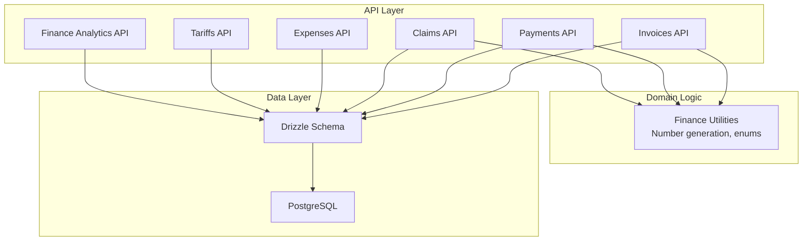
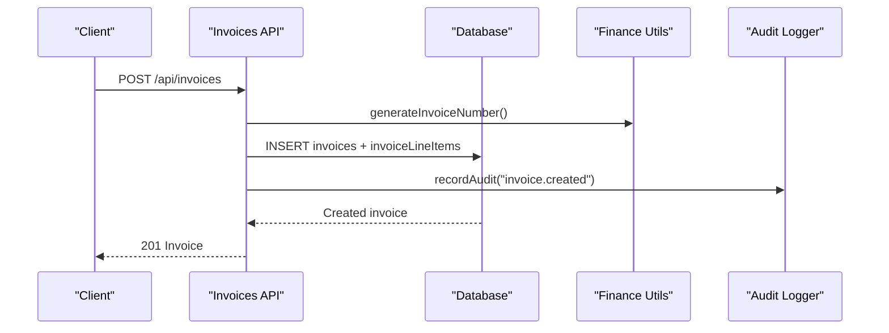
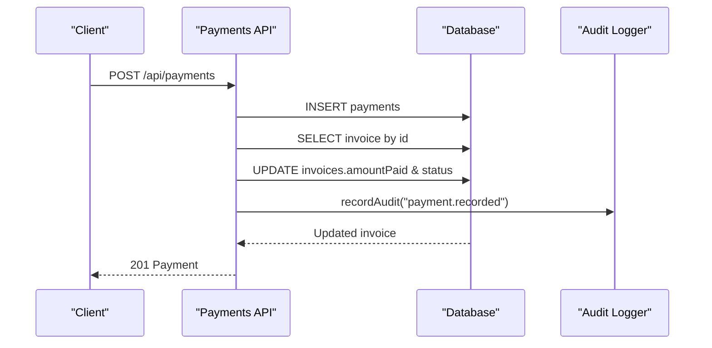
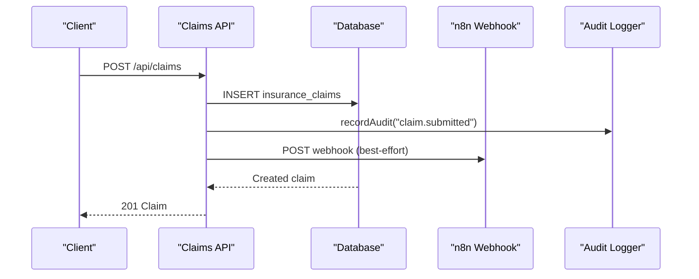
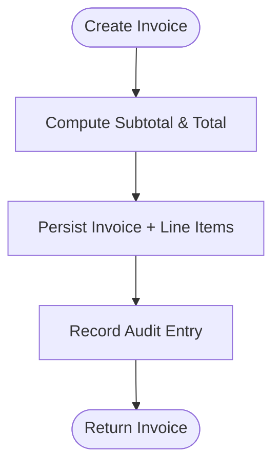
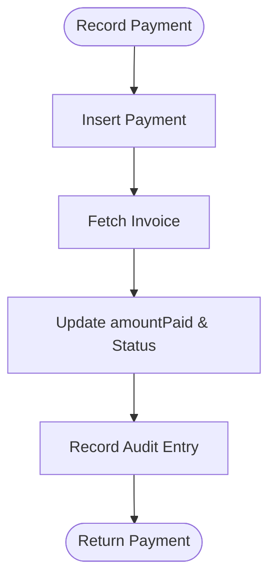
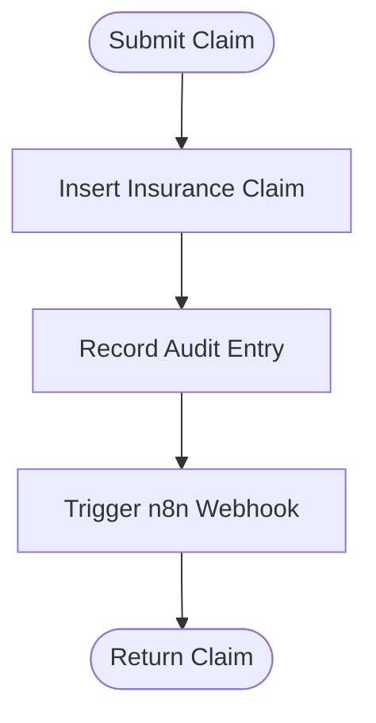
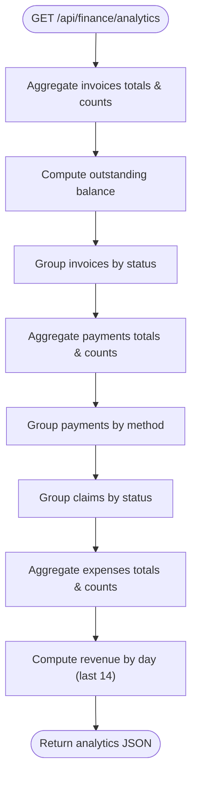
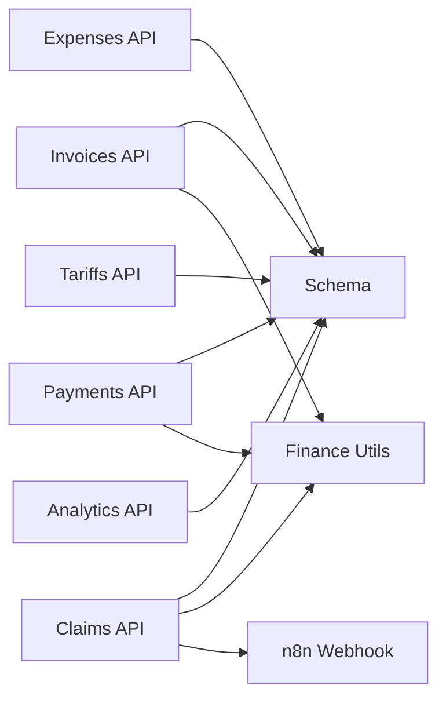
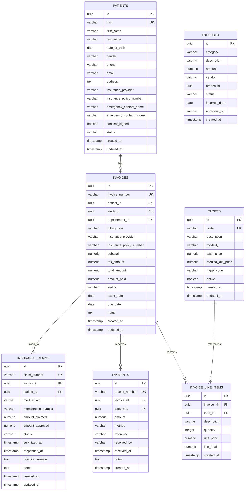

# Financial Management

<cite>
**Referenced Files in This Document**
- [route.ts](file://src/app/api/invoices/route.ts)
- [route.ts](file://src/app/api/payments/route.ts)
- [route.ts](file://src/app/api/claims/route.ts)
- [route.ts](file://src/app/api/expenses/route.ts)
- [route.ts](file://src/app/api/tariffs/route.ts)
- [route.ts](file://src/app/api/finance/analytics/route.ts)
- [schema.ts](file://src/db/schema.ts)
- [finance.ts](file://src/lib/finance.ts)
- [init-schemas.sql](file://docker/postgres/init-schemas.sql)
</cite>

## Table of Contents
1. [Introduction](#introduction)
2. [Project Structure](#project-structure)
3. [Core Components](#core-components)
4. [Architecture Overview](#architecture-overview)
5. [Detailed Component Analysis](#detailed-component-analysis)
6. [Dependency Analysis](#dependency-analysis)
7. [Performance Considerations](#performance-considerations)
8. [Troubleshooting Guide](#troubleshooting-guide)
9. [Conclusion](#conclusion)
10. [Appendices](#appendices)

## Introduction
This document explains the financial management functionality implemented in the platform, focusing on invoicing, payment processing, insurance claims, and expense tracking. It covers the data model, API endpoints, workflows (including automated billing triggers and claim submission automation), and financial reporting capabilities. The goal is to provide both a high-level understanding and detailed technical guidance for developers and operators managing revenue cycle processes.

## Project Structure
Financial operations are exposed as Next.js API routes under src/app/api, with shared domain logic in src/lib and persistent storage via Drizzle ORM against PostgreSQL. The database schema defines core financial entities such as invoices, payments, insurance claims, expenses, and tariffs.

**Diagram sources**
- [route.ts:1-100](file://src/app/api/invoices/route.ts#L1-L100)
- [route.ts:1-79](file://src/app/api/payments/route.ts#L1-L79)
- [route.ts:1-83](file://src/app/api/claims/route.ts#L1-L83)
- [route.ts:1-35](file://src/app/api/expenses/route.ts#L1-L35)
- [route.ts:1-24](file://src/app/api/tariffs/route.ts#L1-L24)
- [route.ts:1-71](file://src/app/api/finance/analytics/route.ts#L1-L71)
- [schema.ts:195-284](file://src/db/schema.ts#L195-L284)
- [finance.ts:1-35](file://src/lib/finance.ts#L1-L35)

**Section sources**
- [route.ts:1-100](file://src/app/api/invoices/route.ts#L1-L100)
- [route.ts:1-79](file://src/app/api/payments/route.ts#L1-L79)
- [route.ts:1-83](file://src/app/api/claims/route.ts#L1-L83)
- [route.ts:1-35](file://src/app/api/expenses/route.ts#L1-L35)
- [route.ts:1-24](file://src/app/api/tariffs/route.ts#L1-L24)
- [route.ts:1-71](file://src/app/api/finance/analytics/route.ts#L1-L71)
- [schema.ts:195-284](file://src/db/schema.ts#L195-L284)
- [finance.ts:1-35](file://src/lib/finance.ts#L1-L35)

## Core Components
- Invoicing: Create and list invoices; compute line totals; set status based on payments; support cash, medical aid, and corporate billing types.
- Payments: Record payments against invoices; update invoice balances and statuses; generate receipt numbers; audit all actions.
- Insurance Claims: Submit claims linked to invoices; integrate with external workflow engine for automation; track approval and rejection states.
- Expenses: Record operational expenses with categories, vendors, dates, and approvals.
- Tariffs: Reference pricing for procedures across modalities and billing types.
- Analytics: Aggregate KPIs for invoiced amounts, collected payments, outstanding balances, claims by status, expenses, and daily revenue trends.

Key data model highlights:
- Invoices include subtotal, tax amount, total amount, amount paid, status, issue/due dates, and optional study/appointment links.
- Payments link to invoices and patients, capture method and reference, and record received timestamps.
- Insurance claims link to invoices and patients, track claimed vs approved amounts, and lifecycle statuses.
- Expenses capture category, description, amount, vendor, incurred date, approver, and status.

**Section sources**
- [schema.ts:195-284](file://src/db/schema.ts#L195-L284)
- [finance.ts:1-35](file://src/lib/finance.ts#L1-L35)

## Architecture Overview
The financial module follows a layered architecture:
- API layer exposes REST endpoints for each financial entity.
- Domain utilities handle number generation and enumerations.
- Data access uses Drizzle ORM to interact with PostgreSQL tables defined in the schema.
- External integrations (e.g., n8n) are triggered asynchronously for automation tasks like claim submission.

**Diagram sources**
- [route.ts:46-99](file://src/app/api/invoices/route.ts#L46-L99)
- [finance.ts:1-7](file://src/lib/finance.ts#L1-L7)

**Diagram sources**
- [route.ts:35-78](file://src/app/api/payments/route.ts#L35-L78)

**Diagram sources**
- [route.ts:38-82](file://src/app/api/claims/route.ts#L38-L82)

## Detailed Component Analysis

### Invoicing System
Responsibilities:
- Generate unique invoice numbers.
- Compute line item totals and invoice totals.
- Support multiple billing types and optional insurance fields.
- Persist invoices and line items.
- Audit creation events.

Lifecycle:
- Draft/Sent/Partial/Paid/Overdue/Written-off statuses are supported by constants.
- Status transitions occur automatically when payments are recorded.

Example workflow:
- Create an invoice with line items and billing type.
- Record one or more payments until the invoice reaches full payment.
- Query invoices with patient details and totals.

**Diagram sources**
- [route.ts:46-99](file://src/app/api/invoices/route.ts#L46-L99)

**Section sources**
- [route.ts:1-100](file://src/app/api/invoices/route.ts#L1-L100)
- [schema.ts:195-239](file://src/db/schema.ts#L195-L239)
- [finance.ts:1-7](file://src/lib/finance.ts#L1-L7)

### Payment Processing
Responsibilities:
- Record payments with method, reference, and recipient.
- Update associated invoice balance and status.
- Generate unique receipt numbers.
- Audit payment recording.

Reconciliation:
- After each payment, the system recalculates amountPaid and sets status to partial or paid based on thresholds.

**Diagram sources**
- [route.ts:35-78](file://src/app/api/payments/route.ts#L35-L78)

**Section sources**
- [route.ts:1-79](file://src/app/api/payments/route.ts#L1-L79)
- [schema.ts:241-253](file://src/db/schema.ts#L241-L253)
- [finance.ts:9-15](file://src/lib/finance.ts#L9-L15)

### Insurance Claims
Responsibilities:
- Submit claims linked to invoices and patients.
- Track claim lifecycle from submitted to approved/partially approved/rejected/paid.
- Integrate with external automation (n8n) for downstream processing.

Claim submission process:
- Create claim with medical aid and membership details.
- Fire best-effort webhook to trigger automation.
- Audit submission event.

**Diagram sources**
- [route.ts:38-82](file://src/app/api/claims/route.ts#L38-L82)

**Section sources**
- [route.ts:1-83](file://src/app/api/claims/route.ts#L1-L83)
- [schema.ts:255-271](file://src/db/schema.ts#L255-L271)
- [finance.ts:17-22](file://src/lib/finance.ts#L17-L22)

### Expense Tracking
Responsibilities:
- Record operational expenses with category, description, amount, vendor, incurred date, approver, and status.
- Retrieve expenses ordered by most recent.

Use cases:
- Capture maintenance costs, supplies, utilities, salaries, rent, marketing, and other expenses.
- Track approval workflows via status and approver fields.

**Section sources**
- [route.ts:1-35](file://src/app/api/expenses/route.ts#L1-L35)
- [schema.ts:273-284](file://src/db/schema.ts#L273-L284)

### Tariffs and Pricing
Responsibilities:
- Manage procedure tariffs with modality-specific pricing for cash and medical aid.
- Provide reference data for invoice line items.

Usage:
- Link tariff IDs to invoice line items to standardize pricing and descriptions.

**Section sources**
- [route.ts:1-24](file://src/app/api/tariffs/route.ts#L1-L24)
- [schema.ts:196-207](file://src/db/schema.ts#L196-L207)

### Financial Reporting and Analytics
Capabilities:
- Summarize total invoiced, total paid, invoice counts.
- Calculate outstanding balances excluding paid/written-off invoices.
- Group invoices by status with totals.
- Summarize payments by method with totals.
- Group insurance claims by status with totals.
- Summarize expenses totals and counts.
- Provide last 14 days of daily revenue totals.

**Diagram sources**
- [route.ts:6-70](file://src/app/api/finance/analytics/route.ts#L6-L70)

**Section sources**
- [route.ts:1-71](file://src/app/api/finance/analytics/route.ts#L1-L71)

## Dependency Analysis
Coupling and cohesion:
- API routes depend on Drizzle schema definitions for consistent data access.
- Finance utilities centralize number generation and enumerations used across modules.
- Claims API integrates with external automation via environment-configured webhooks.

External dependencies:
- PostgreSQL database accessed through Drizzle ORM.
- Optional n8n webhook for claim automation (best-effort).

Potential circular dependencies:
- None observed; APIs call schema and utilities without reciprocal imports.

Integration points:
- Audit logging for key financial actions.
- Environment variables for n8n integration base URL.

**Diagram sources**
- [route.ts:1-100](file://src/app/api/invoices/route.ts#L1-L100)
- [route.ts:1-79](file://src/app/api/payments/route.ts#L1-L79)
- [route.ts:1-83](file://src/app/api/claims/route.ts#L1-L83)
- [route.ts:1-35](file://src/app/api/expenses/route.ts#L1-L35)
- [route.ts:1-24](file://src/app/api/tariffs/route.ts#L1-L24)
- [route.ts:1-71](file://src/app/api/finance/analytics/route.ts#L1-L71)
- [finance.ts:1-35](file://src/lib/finance.ts#L1-L35)

**Section sources**
- [route.ts:1-100](file://src/app/api/invoices/route.ts#L1-L100)
- [route.ts:1-79](file://src/app/api/payments/route.ts#L1-L79)
- [route.ts:1-83](file://src/app/api/claims/route.ts#L1-L83)
- [route.ts:1-35](file://src/app/api/expenses/route.ts#L1-L35)
- [route.ts:1-24](file://src/app/api/tariffs/route.ts#L1-L24)
- [route.ts:1-71](file://src/app/api/finance/analytics/route.ts#L1-L71)
- [finance.ts:1-35](file://src/lib/finance.ts#L1-L35)

## Performance Considerations
- Use indexed columns for frequent queries (e.g., invoice_number, receipt_number, status, received_at).
- Batch insert line items to reduce round trips during invoice creation.
- Cache analytics results if dashboards are frequently refreshed.
- Ensure numeric precision is maintained using appropriate numeric types.
- Avoid heavy computations in request paths; offload to background jobs where possible.

[No sources needed since this section provides general guidance]

## Troubleshooting Guide
Common issues and resolutions:
- Failed to fetch invoices/payments/expenses: Check database connectivity and query errors returned by the API.
- Failed to create invoice: Validate line items and required fields; ensure tariff references exist if used.
- Failed to record payment: Confirm invoice exists and that amounts are valid; verify constraints on payments table.
- Failed to submit claim: Verify environment configuration for n8n webhook; check network timeouts and error handling.
- Analytics failures: Inspect SQL aggregation errors and ensure tables have expected data.

Operational tips:
- Review audit logs for actions like invoice created and payment recorded to trace state changes.
- Monitor webhook delivery for claim submissions; implement retries or dead-letter queues if needed.
- Validate enum values for statuses and methods to prevent invalid states.

**Section sources**
- [route.ts:34-36](file://src/app/api/invoices/route.ts#L34-L36)
- [route.ts:75-78](file://src/app/api/payments/route.ts#L75-L78)
- [route.ts:79-82](file://src/app/api/claims/route.ts#L79-L82)
- [route.ts:10-12](file://src/app/api/expenses/route.ts#L10-L12)
- [route.ts:67-70](file://src/app/api/finance/analytics/route.ts#L67-L70)

## Conclusion
The financial management module provides a robust foundation for invoicing, payments, insurance claims, and expense tracking within a healthcare imaging context. It supports multi-billing types, automated status reconciliation, external automation triggers, and comprehensive analytics. The design emphasizes clear separation of concerns, auditable transactions, and extensibility for future enhancements such as advanced revenue cycle management features.

[No sources needed since this section summarizes without analyzing specific files]

## Appendices

### API Endpoints Summary
- Invoices
  - GET /api/invoices: List invoices with patient details.
  - POST /api/invoices: Create invoice with line items.
- Payments
  - GET /api/payments: List payments with invoice and patient details.
  - POST /api/payments: Record payment and reconcile invoice balance/status.
- Claims
  - GET /api/claims: List insurance claims with invoice and patient details.
  - POST /api/claims: Submit claim and trigger automation webhook.
- Expenses
  - GET /api/expenses: List expenses.
  - POST /api/expenses: Create expense entry.
- Tariffs
  - GET /api/tariffs: List tariffs.
  - POST /api/tariffs: Create tariff.
- Analytics
  - GET /api/finance/analytics: Retrieve aggregated financial metrics.

**Section sources**
- [route.ts:1-100](file://src/app/api/invoices/route.ts#L1-L100)
- [route.ts:1-79](file://src/app/api/payments/route.ts#L1-L79)
- [route.ts:1-83](file://src/app/api/claims/route.ts#L1-L83)
- [route.ts:1-35](file://src/app/api/expenses/route.ts#L1-L35)
- [route.ts:1-24](file://src/app/api/tariffs/route.ts#L1-L24)
- [route.ts:1-71](file://src/app/api/finance/analytics/route.ts#L1-L71)

### Data Model Overview
Entities and relationships:
- Patients: Core patient demographics and insurance info.
- Invoices: Billing records linked to patients, studies, appointments; includes totals and status.
- Invoice Line Items: Detail entries referencing tariffs and describing services.
- Payments: Records of money received against invoices.
- Insurance Claims: Requests to medical aids linked to invoices and patients.
- Expenses: Operational cost records with categories and approvals.
- Tariffs: Procedure pricing by modality and billing type.

**Diagram sources**
- [schema.ts:18-36](file://src/db/schema.ts#L18-L36)
- [schema.ts:195-284](file://src/db/schema.ts#L195-L284)

**Section sources**
- [schema.ts:18-36](file://src/db/schema.ts#L18-L36)
- [schema.ts:195-284](file://src/db/schema.ts#L195-L284)

### Common Financial Scenarios
- Automated billing:
  - Create invoices post-procedure with line items derived from tariffs.
  - Set billing type and insurance details; send invoices to patients or insurers.
- Claim adjudication:
  - Submit claims via API; external automation handles adjudication steps.
  - Update claim status based on insurer responses; reconcile payments accordingly.
- Revenue cycle management:
  - Monitor outstanding balances and overdue invoices.
  - Reconcile payments to invoices; track collection rates and aging.
  - Use analytics to assess daily revenue trends and payment method distribution.

[No sources needed since this section provides conceptual guidance]