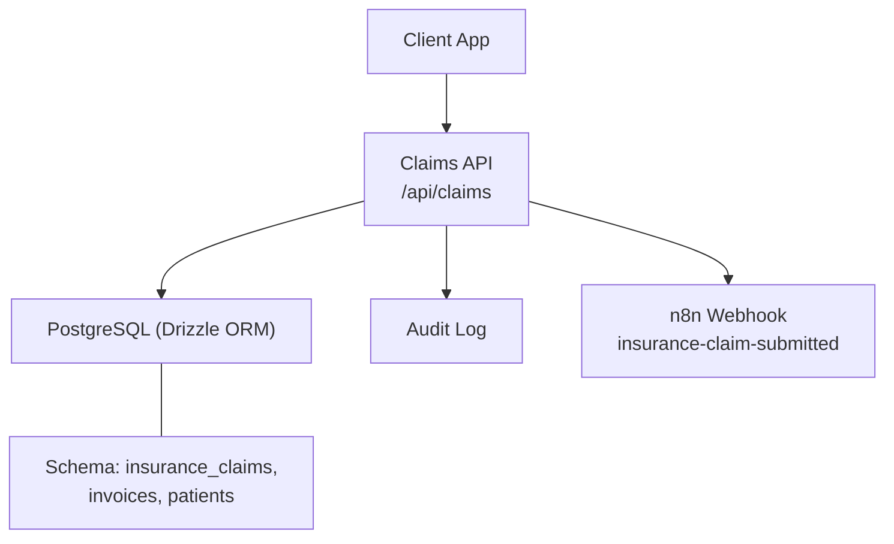
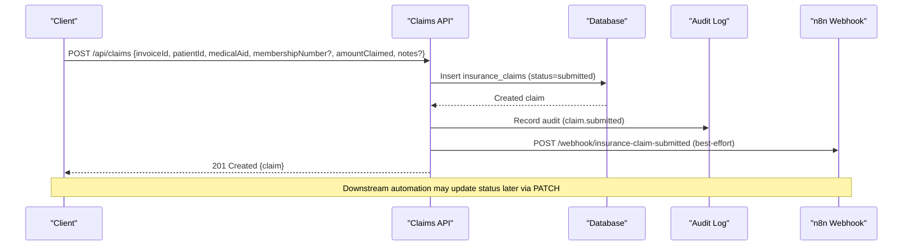
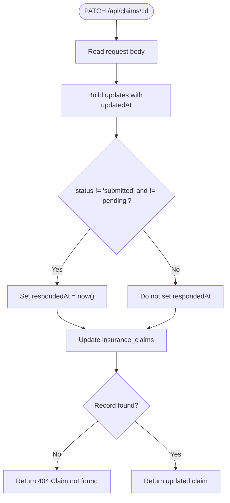
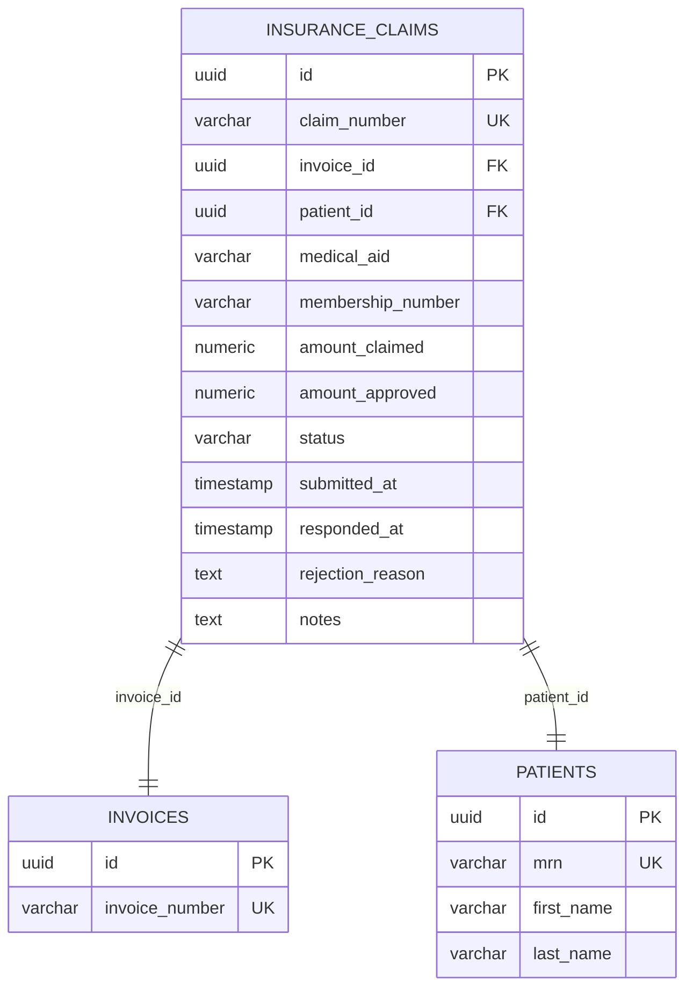
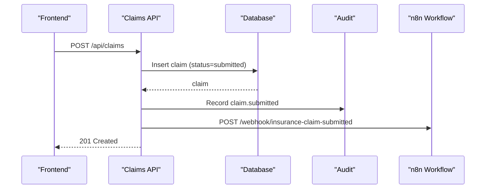
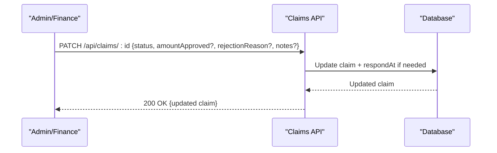
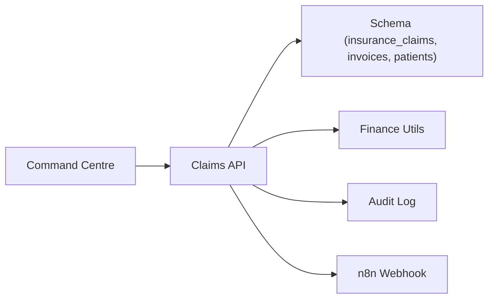

# Insurance Claims Management

<cite>
**Referenced Files in This Document**
- [route.ts](file://src/app/api/claims/route.ts)
- [route.ts](file://src/app/api/claims/[id]/route.ts)
- [schema.ts](file://src/db/schema.ts)
- [finance.ts](file://src/lib/finance.ts)
- [audit.ts](file://src/lib/audit.ts)
- [command-centre.ts](file://src/lib/command-centre.ts)
- [seed route.ts](file://src/app/api/seed/route.ts)
</cite>

## Table of Contents
1. [Introduction](#introduction)
2. [Project Structure](#project-structure)
3. [Core Components](#core-components)
4. [Architecture Overview](#architecture-overview)
5. [Detailed Component Analysis](#detailed-component-analysis)
6. [Dependency Analysis](#dependency-analysis)
7. [Performance Considerations](#performance-considerations)
8. [Troubleshooting Guide](#troubleshooting-guide)
9. [Conclusion](#conclusion)

## Introduction
This document explains the insurance claims management functionality implemented in the platform. It covers the end-to-end lifecycle from claim creation through adjudication, including status tracking, rejection handling, and integration points for automation. It also documents the available API endpoints for submitting claims, updating their status, and retrieving claim history, along with examples of typical workflows and how external automation is triggered.

## Project Structure
The claims feature is implemented as a Next.js API module under the app directory, backed by a PostgreSQL schema defined via Drizzle ORM. The core files involved are:
- Claims API routes for listing, creating, and updating claims
- Database schema defining the insurance_claims table and related entities
- Finance utilities for generating unique identifiers and enumerating statuses
- Audit logging to record claim events
- Command centre logic that surfaces operational risks based on pending claims
- Seed data demonstrating sample claims across different statuses

**Diagram sources**
- [route.ts:8-82](file://src/app/api/claims/route.ts#L8-L82)
- [route.ts:6-23](file://src/app/api/claims/[id]/route.ts#L6-L23)
- [schema.ts:255-271](file://src/db/schema.ts#L255-L271)
- [audit.ts:4-24](file://src/lib/audit.ts#L4-L24)

**Section sources**
- [route.ts:8-82](file://src/app/api/claims/route.ts#L8-L82)
- [route.ts:6-23](file://src/app/api/claims/[id]/route.ts#L6-L23)
- [schema.ts:255-271](file://src/db/schema.ts#L255-L271)
- [finance.ts:17-32](file://src/lib/finance.ts#L17-L32)
- [audit.ts:4-24](file://src/lib/audit.ts#L4-L24)
- [command-centre.ts:162-163](file://src/lib/command-centre.ts#L162-L163)
- [seed route.ts:338-344](file://src/app/api/seed/route.ts#L338-L344)

## Core Components
- Claims API:
  - GET /api/claims: Lists all claims with joined invoice and patient details, ordered by submission time.
  - POST /api/claims: Creates a new claim, sets initial status to submitted, records audit, and triggers an n8n webhook.
  - PATCH /api/claims/:id: Updates a claim’s fields; automatically sets respondedAt when moving out of submitted/pending states.
- Data model:
  - insurance_claims table stores claim number, invoice and patient references, medical aid name, optional membership number, amounts claimed and approved, status, timestamps, rejection reason, and notes.
- Statuses:
  - Enumerated statuses include submitted, pending, approved, partially_approved, rejected, paid.
- Automation:
  - On claim submission, a best-effort HTTP call is made to an n8n webhook endpoint to start downstream processing.
- Auditing:
  - Every claim submission is recorded in the audit log with action, module, entity type, id, and details.
- Operational visibility:
  - The command centre aggregates counts of claims in submitted or pending states to highlight revenue-at-risk items.

**Section sources**
- [route.ts:8-82](file://src/app/api/claims/route.ts#L8-L82)
- [route.ts:6-23](file://src/app/api/claims/[id]/route.ts#L6-L23)
- [schema.ts:255-271](file://src/db/schema.ts#L255-L271)
- [finance.ts:17-32](file://src/lib/finance.ts#L17-L32)
- [audit.ts:4-24](file://src/lib/audit.ts#L4-L24)
- [command-centre.ts:162-163](file://src/lib/command-centre.ts#L162-L163)

## Architecture Overview
The claims system follows a simple event-driven pattern:
- Submission creates a claim record and emits an audit event.
- A webhook is fired to an external automation service (n8n) to handle further processing such as eligibility checks or integrations.
- Adjudication updates the claim status and may set amountApproved and respondedAt.
- Rejections capture a reason and timestamp.

**Diagram sources**
- [route.ts:38-82](file://src/app/api/claims/route.ts#L38-L82)
- [audit.ts:4-24](file://src/lib/audit.ts#L4-L24)

## Detailed Component Analysis

### Claims API: List, Create, Update
- GET /api/claims
  - Returns a list of claims with associated invoice number and patient details.
  - Ordered by most recently submitted.
- POST /api/claims
  - Accepts invoiceId, patientId, medicalAid, optional membershipNumber, amountClaimed, and optional notes.
  - Generates a unique claimNumber and sets status to submitted.
  - Records an audit entry for claim.submitted.
  - Fires an n8n webhook asynchronously with claimNumber and medicalAid.
- PATCH /api/claims/:id
  - Accepts partial updates; if status changes away from submitted or pending, respondsAt is set to now.
  - Returns updated claim or 404 if not found.

**Diagram sources**
- [route.ts:6-23](file://src/app/api/claims/[id]/route.ts#L6-L23)

**Section sources**
- [route.ts:8-82](file://src/app/api/claims/route.ts#L8-L82)
- [route.ts:6-23](file://src/app/api/claims/[id]/route.ts#L6-L23)

### Data Model and Relationships
- insurance_claims
  - Links to invoices and patients via foreign keys.
  - Tracks financial amounts (amountClaimed, amountApproved), status, timestamps (submittedAt, respondedAt), and optional rejectionReason and notes.
- Related tables used in queries
  - invoices: provides invoiceNumber for display.
  - patients: provides firstName, lastName, mrn for display.

**Diagram sources**
- [schema.ts:209-228](file://src/db/schema.ts#L209-L228)
- [schema.ts:255-271](file://src/db/schema.ts#L255-L271)

**Section sources**
- [schema.ts:209-228](file://src/db/schema.ts#L209-L228)
- [schema.ts:255-271](file://src/db/schema.ts#L255-L271)

### Status Tracking and Lifecycle
- Initial state: submitted upon creation.
- Pending: typically set during adjudication before final decision.
- Approved/partially_approved: indicate final decisions; amountApproved may be set accordingly.
- Rejected: includes rejectionReason and respondedAt.
- Paid: indicates settlement completion.

Operational dashboards surface counts of claims in submitted or pending states to highlight backlogs.

**Section sources**
- [finance.ts:32](file://src/lib/finance.ts#L32)
- [command-centre.ts:162-163](file://src/lib/command-centre.ts#L162-L163)
- [seed route.ts:338-344](file://src/app/api/seed/route.ts#L338-L344)

### Medical Aid Integration and Membership Number Handling
- Medical aid name is stored per claim and used to trigger downstream automation.
- Membership number is optional at submission but can be present for member identification.
- The system fires an n8n webhook on submission to allow external validation or routing. Actual membership validation and eligibility checks are expected to occur in the automation layer rather than the API itself.

Integration behavior:
- On POST /api/claims, the system sends claimNumber and medicalAid to the configured n8n webhook URL.
- If the webhook is unavailable, the call fails silently to avoid blocking claim creation.

**Section sources**
- [route.ts:63-76](file://src/app/api/claims/route.ts#L63-L76)
- [seed route.ts:338-344](file://src/app/api/seed/route.ts#L338-L344)

### Claim Amount Calculations
- amountClaimed is derived from the invoice total at submission time and stored as a numeric value rounded to two decimals.
- amountApproved is set during adjudication to reflect the insurer’s decision; it can be zero for rejections or less than amountClaimed for partial approvals.

Note: There is no built-in tariff-based calculation in the claims API; amounts originate from invoices.

**Section sources**
- [route.ts:41-53](file://src/app/api/claims/route.ts#L41-L53)
- [schema.ts:255-271](file://src/db/schema.ts#L255-L271)

### API Endpoints Summary
- GET /api/claims
  - Purpose: Retrieve all claims with invoice and patient context.
  - Response: Array of claim objects including status, amounts, timestamps, and optional rejectionReason.
- POST /api/claims
  - Purpose: Submit a new claim.
  - Request body: invoiceId, patientId, medicalAid, membershipNumber (optional), amountClaimed, notes (optional).
  - Response: Created claim object with generated claimNumber and status=submitted.
  - Side effects: Audit logged; n8n webhook triggered.
- PATCH /api/claims/:id
  - Purpose: Update claim fields (e.g., status, amountApproved, rejectionReason, notes).
  - Behavior: Automatically sets respondedAt when transitioning out of submitted/pending.
  - Response: Updated claim or 404 if not found.

**Section sources**
- [route.ts:8-82](file://src/app/api/claims/route.ts#L8-L82)
- [route.ts:6-23](file://src/app/api/claims/[id]/route.ts#L6-L23)

### Example Workflows

#### Claim Submission and Automation Trigger

**Diagram sources**
- [route.ts:38-82](file://src/app/api/claims/route.ts#L38-L82)
- [audit.ts:4-24](file://src/lib/audit.ts#L4-L24)

#### Adjudication and Status Updates

**Diagram sources**
- [route.ts:6-23](file://src/app/api/claims/[id]/route.ts#L6-L23)

#### Rejection and Resubmission/Appeals
- Rejection:
  - Set status to rejected and populate rejectionReason; respondedAt is automatically set.
- Resubmission/Appeals:
  - Create a new claim linked to the same invoice or a corrected invoice, or update the existing claim if allowed by business rules.
  - Use PATCH to adjust status and notes to reflect appeal actions.

**Section sources**
- [route.ts:6-23](file://src/app/api/claims/[id]/route.ts#L6-L23)
- [seed route.ts:338-344](file://src/app/api/seed/route.ts#L338-L344)

### External Integrations
- n8n webhook:
  - Triggered on claim submission with claimNumber and medicalAid.
  - Used for downstream tasks such as eligibility checks, formatting submissions to insurers, or notifications.
- Configuration:
  - Webhook base URL is read from environment variables; if absent, no webhook is sent.

**Section sources**
- [route.ts:63-76](file://src/app/api/claims/route.ts#L63-L76)

## Dependency Analysis
- Claims API depends on:
  - Database schema for insurance_claims, invoices, and patients.
  - Finance utilities for generating claim numbers and status enums.
  - Audit logging for compliance and traceability.
  - Environment configuration for n8n webhook integration.
- Operational dashboards depend on:
  - Querying claims by status to compute risk metrics.

**Diagram sources**
- [route.ts:8-82](file://src/app/api/claims/route.ts#L8-L82)
- [schema.ts:255-271](file://src/db/schema.ts#L255-L271)
- [finance.ts:17-32](file://src/lib/finance.ts#L17-L32)
- [audit.ts:4-24](file://src/lib/audit.ts#L4-L24)
- [command-centre.ts:162-163](file://src/lib/command-centre.ts#L162-L163)

**Section sources**
- [route.ts:8-82](file://src/app/api/claims/route.ts#L8-L82)
- [schema.ts:255-271](file://src/db/schema.ts#L255-L271)
- [finance.ts:17-32](file://src/lib/finance.ts#L17-L32)
- [audit.ts:4-24](file://src/lib/audit.ts#L4-L24)
- [command-centre.ts:162-163](file://src/lib/command-centre.ts#L162-L163)

## Performance Considerations
- Best-effort webhook calls:
  - The n8n webhook call uses a timeout to prevent blocking claim creation.
- Database joins:
  - Listing claims performs left joins on invoices and patients; ensure appropriate indexing on referenced columns for performance at scale.
- Audit writes:
  - Audit logging is isolated and should not block primary operations.

[No sources needed since this section provides general guidance]

## Troubleshooting Guide
- Claim not found on update:
  - PATCH returns 404 if the specified claim ID does not exist.
- Failed to submit claim:
  - POST returns 500 with error details if database insertion fails.
- Failed to fetch claims:
  - GET returns 500 with a generic error message if query fails.
- Webhook failures:
  - n8n webhook errors are caught and ignored to avoid impacting claim submission.

**Section sources**
- [route.ts:33-35](file://src/app/api/claims/route.ts#L33-L35)
- [route.ts:79-81](file://src/app/api/claims/route.ts#L79-L81)
- [route.ts:20-22](file://src/app/api/claims/[id]/route.ts#L20-L22)

## Conclusion
The claims management implementation provides a robust foundation for submitting, tracking, and adjudicating insurance claims. It integrates with external automation via webhooks, maintains comprehensive audit trails, and exposes clear APIs for lifecycle management. Status transitions, rejection handling, and operational visibility support efficient claims processing and reconciliation with medical aids.

[No sources needed since this section summarizes without analyzing specific files]