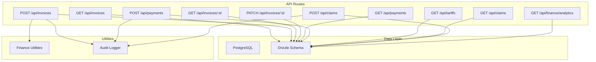
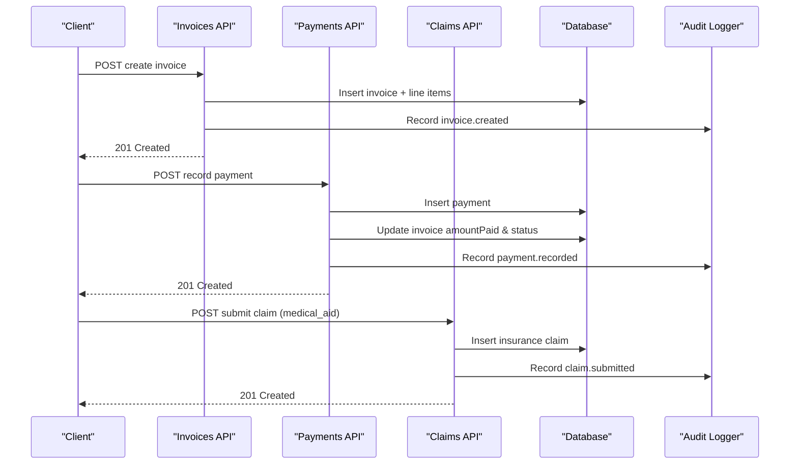
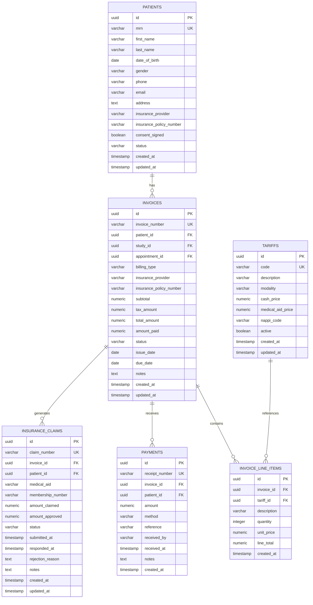
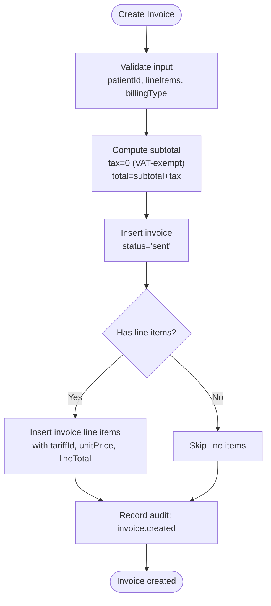
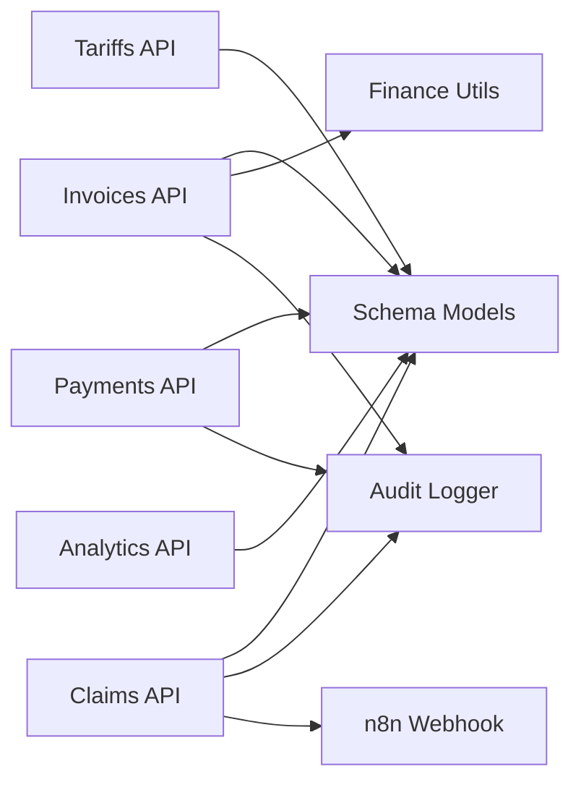

# Invoicing System

<cite>
**Referenced Files in This Document**
- [route.ts](file://src/app/api/invoices/route.ts)
- [route.ts](file://src/app/api/invoices/[id]/route.ts)
- [route.ts](file://src/app/api/payments/route.ts)
- [route.ts](file://src/app/api/tariffs/route.ts)
- [route.ts](file://src/app/api/claims/route.ts)
- [route.ts](file://src/app/api/finance/analytics/route.ts)
- [schema.ts](file://src/db/schema.ts)
- [finance.ts](file://src/lib/finance.ts)
- [audit.ts](file://src/lib/audit.ts)
</cite>

## Table of Contents
1. [Introduction](#introduction)
2. [Project Structure](#project-structure)
3. [Core Components](#core-components)
4. [Architecture Overview](#architecture-overview)
5. [Detailed Component Analysis](#detailed-component-analysis)
6. [Dependency Analysis](#dependency-analysis)
7. [Performance Considerations](#performance-considerations)
8. [Troubleshooting Guide](#troubleshooting-guide)
9. [Conclusion](#conclusion)
10. [Appendices](#appendices)

## Introduction
This document explains the invoicing system that supports end-to-end billing for medical imaging services. It covers invoice creation, status management (draft, sent, partial, paid, overdue, written_off), and billing types (cash vs medical aid). It also documents the API endpoints for creating invoices, retrieving invoice data, recording payments, managing insurance claims, and integrating with tariff pricing. The relationships between invoices, patients, tariffs, and payments are explained, along with common scenarios such as partial payments, invoice adjustments, and automated workflows.

## Project Structure
The invoicing functionality is implemented as Next.js API routes backed by a PostgreSQL schema defined via Drizzle ORM. Key modules:
- API routes for invoices, payments, tariffs, claims, and finance analytics
- Database schema for invoices, line items, payments, tariffs, and related entities
- Finance utilities for generating unique identifiers and enumerations
- Audit logging to record financial actions

**Diagram sources**
- [route.ts](file://src/app/api/invoices/route.ts)
- [route.ts](file://src/app/api/invoices/[id]/route.ts)
- [route.ts](file://src/app/api/payments/route.ts)
- [route.ts](file://src/app/api/tariffs/route.ts)
- [route.ts](file://src/app/api/claims/route.ts)
- [route.ts](file://src/app/api/finance/analytics/route.ts)
- [schema.ts](file://src/db/schema.ts)
- [finance.ts](file://src/lib/finance.ts)
- [audit.ts](file://src/lib/audit.ts)

**Section sources**
- [route.ts](file://src/app/api/invoices/route.ts)
- [route.ts](file://src/app/api/invoices/[id]/route.ts)
- [route.ts](file://src/app/api/payments/route.ts)
- [route.ts](file://src/app/api/tariffs/route.ts)
- [route.ts](file://src/app/api/claims/route.ts)
- [route.ts](file://src/app/api/finance/analytics/route.ts)
- [schema.ts](file://src/db/schema.ts)
- [finance.ts](file://src/lib/finance.ts)
- [audit.ts](file://src/lib/audit.ts)

## Core Components
- Invoices: Represent billable transactions linked to patients, optional studies/appointments, and line items. Support multiple statuses and billing types.
- Invoice Line Items: Detail each service or procedure on an invoice, optionally referencing a tariff code.
- Payments: Record receipts against invoices; automatically update invoice totals and status.
- Tariffs: Reference pricing for procedures, including cash and medical aid prices.
- Insurance Claims: Track submissions to medical aids, with lifecycle states and outcomes.
- Finance Analytics: Aggregates invoiced, paid, outstanding, and payment method breakdowns.
- Audit Logging: Records key financial actions for compliance and traceability.

Key behaviors:
- Creating an invoice computes subtotal from line items, sets tax to zero for VAT-exempt imaging, and defaults status to “sent”.
- Recording a payment updates amountPaid and transitions invoice status based on totalAmount.
- Claims can be submitted for medical_aid billing and trigger automation via webhook.

**Section sources**
- [schema.ts](file://src/db/schema.ts)
- [route.ts](file://src/app/api/invoices/route.ts)
- [route.ts](file://src/app/api/payments/route.ts)
- [route.ts](file://src/app/api/claims/route.ts)
- [finance.ts](file://src/lib/finance.ts)
- [audit.ts](file://src/lib/audit.ts)

## Architecture Overview
The invoicing system follows a straightforward request/response architecture with database persistence and audit trails.

**Diagram sources**
- [route.ts](file://src/app/api/invoices/route.ts)
- [route.ts](file://src/app/api/payments/route.ts)
- [route.ts](file://src/app/api/claims/route.ts)
- [schema.ts](file://src/db/schema.ts)
- [audit.ts](file://src/lib/audit.ts)

## Detailed Component Analysis

### Invoices API
- GET /api/invoices
  - Lists all invoices joined with patient details, ordered by creation date.
  - Returns fields like invoice number, billing type, amounts, status, dates, and patient info.
- POST /api/invoices
  - Creates an invoice with generated invoice number, computed subtotal, zero tax (VAT-exempt imaging), and default status “sent”.
  - Optionally creates line items with tariff references.
  - Audits the creation event.
- GET /api/invoices/:id
  - Retrieves a single invoice with its line items.
- PATCH /api/invoices/:id
  - Updates invoice fields (e.g., status, due date, notes). Use this to manage state transitions such as marking overdue or writing off.

Status management:
- Allowed statuses include draft, sent, partial, paid, overdue, written_off.
- Status transitions commonly occur when recording payments or manually updating invoice state.

Billing types:
- cash: Patient pays directly; no medical aid involvement.
- medical_aid: Claim submission to medical aid; may involve pre-authorization and approvals.

Integration points:
- Tariffs provide reference pricing for line items.
- Payments update invoice totals and status automatically.
- Claims support medical_aid workflows.

**Section sources**
- [route.ts](file://src/app/api/invoices/route.ts)
- [route.ts](file://src/app/api/invoices/[id]/route.ts)
- [finance.ts](file://src/lib/finance.ts)

### Payments API
- GET /api/payments
  - Lists payments with invoice and patient context, ordered by receipt date.
- POST /api/payments
  - Records a payment against an invoice and patient.
  - Updates invoice amountPaid and recalculates status:
    - If newPaid >= totalAmount → “paid”
    - Else if newPaid > 0 → “partial”
    - Otherwise retains previous status
  - Audits the payment recording.

Partial payments:
- Multiple payments can be recorded against a single invoice until it reaches “paid”.

Payment methods:
- Supported methods include cash, card, eft, medical_aid.

**Section sources**
- [route.ts](file://src/app/api/payments/route.ts)
- [finance.ts](file://src/lib/finance.ts)

### Tariffs API
- GET /api/tariffs
  - Retrieves available tariffs sorted by modality and code.
- POST /api/tariffs
  - Creates a new tariff entry with cash and medical aid pricing.

Tariff integration:
- Line items can reference tariffs to ensure consistent pricing across invoices.
- Billing type influences which price is used (cash vs medical_aid).

**Section sources**
- [route.ts](file://src/app/api/tariffs/route.ts)
- [schema.ts](file://src/db/schema.ts)

### Claims API
- GET /api/claims
  - Lists insurance claims with invoice and patient context.
- POST /api/claims
  - Submits a claim for an invoice and patient, setting initial status to “submitted”.
  - Audits the submission and triggers an n8n webhook for automation (best-effort).

Medical aid workflow:
- Claims track amountClaimed, amountApproved, status transitions, and rejection reasons.
- Automation can integrate with external systems for claim processing.

**Section sources**
- [route.ts](file://src/app/api/claims/route.ts)
- [schema.ts](file://src/db/schema.ts)
- [finance.ts](file://src/lib/finance.ts)

### Finance Analytics
- GET /api/finance/analytics
  - Provides aggregated metrics: total invoiced, total paid, outstanding balance, invoice counts by status, payment totals by method, claim statuses, expenses, and recent revenue by day.

Use cases:
- Dashboards for finance teams to monitor collections and outstanding balances.
- Reporting for audits and reconciliation.

**Section sources**
- [route.ts](file://src/app/api/finance/analytics/route.ts)
- [schema.ts](file://src/db/schema.ts)

### Data Model Relationships

**Diagram sources**
- [schema.ts](file://src/db/schema.ts)

**Section sources**
- [schema.ts](file://src/db/schema.ts)

### Workflow Examples

#### Invoice Creation Workflow

**Diagram sources**
- [route.ts](file://src/app/api/invoices/route.ts)
- [finance.ts](file://src/lib/finance.ts)
- [audit.ts](file://src/lib/audit.ts)

**Section sources**
- [route.ts](file://src/app/api/invoices/route.ts)

#### Patient Billing Process (Cash vs Medical Aid)
- Cash billing:
  - Create invoice with billingType “cash”.
  - Record payments using methods like cash, card, eft.
  - Invoice transitions to “partial” then “paid” as payments accumulate.
- Medical aid billing:
  - Create invoice with billingType “medical_aid”, include insurance provider and policy number.
  - Submit a claim via claims API; claim status progresses through submitted, pending, approved/partially approved/rejected.
  - Payments may reflect medical_aid method upon approval.

**Section sources**
- [route.ts](file://src/app/api/invoices/route.ts)
- [route.ts](file://src/app/api/payments/route.ts)
- [route.ts](file://src/app/api/claims/route.ts)
- [finance.ts](file://src/lib/finance.ts)

#### Integration with Tariff Pricing
- Tariffs define cash and medical aid prices per procedure/modality.
- When creating invoice line items, reference tariffId to ensure accurate pricing.
- Billing type determines which price is applied in downstream processes.

**Section sources**
- [route.ts](file://src/app/api/tariffs/route.ts)
- [schema.ts](file://src/db/schema.ts)

### Common Scenarios

#### Partial Payments
- Record one or more payments against an invoice.
- Each payment updates amountPaid and recalculates status:
  - If cumulative payments reach totalAmount → “paid”
  - If any payments but not full → “partial”
- Useful for split payments or staged collections.

**Section sources**
- [route.ts](file://src/app/api/payments/route.ts)
- [finance.ts](file://src/lib/finance.ts)

#### Invoice Adjustments
- Use PATCH /api/invoices/:id to adjust fields such as status, dueDate, or notes.
- For monetary adjustments, consider adding credit/debit line items or recording negative payments depending on business rules.
- Always audit changes to maintain compliance.

**Section sources**
- [route.ts](file://src/app/api/invoices/[id]/route.ts)
- [audit.ts](file://src/lib/audit.ts)

#### Automated Billing Workflows
- Claims submission triggers an n8n webhook for automation (best-effort).
- Can integrate with external systems for claim routing, approvals, and notifications.
- Ensure error handling and retries for robust automation.

**Section sources**
- [route.ts](file://src/app/api/claims/route.ts)

## Dependency Analysis
- API routes depend on Drizzle ORM models defined in the schema.
- Finance utilities generate IDs and define enumerations for statuses and methods.
- Audit logger records events for compliance and traceability.
- Claims API integrates with external automation via webhooks.

**Diagram sources**
- [route.ts](file://src/app/api/invoices/route.ts)
- [route.ts](file://src/app/api/payments/route.ts)
- [route.ts](file://src/app/api/claims/route.ts)
- [route.ts](file://src/app/api/tariffs/route.ts)
- [route.ts](file://src/app/api/finance/analytics/route.ts)
- [schema.ts](file://src/db/schema.ts)
- [finance.ts](file://src/lib/finance.ts)
- [audit.ts](file://src/lib/audit.ts)

**Section sources**
- [route.ts](file://src/app/api/invoices/route.ts)
- [route.ts](file://src/app/api/payments/route.ts)
- [route.ts](file://src/app/api/claims/route.ts)
- [route.ts](file://src/app/api/tariffs/route.ts)
- [route.ts](file://src/app/api/finance/analytics/route.ts)
- [schema.ts](file://src/db/schema.ts)
- [finance.ts](file://src/lib/finance.ts)
- [audit.ts](file://src/lib/audit.ts)

## Performance Considerations
- Queries join invoices with patients and line items; ensure indexes on foreign keys (patientId, invoiceId, tariffId) for performance.
- Pagination and filtering should be added to list endpoints for large datasets.
- Avoid heavy computations in hot paths; precompute totals where possible.
- Use database transactions for multi-step operations (e.g., creating invoice and line items) to maintain consistency.

[No sources needed since this section provides general guidance]

## Troubleshooting Guide
- Invoice not found:
  - Verify the ID exists before retrieval or update.
  - Check error responses from GET/PATCH endpoints.
- Payment recording failures:
  - Ensure invoiceId and patientId are valid.
  - Confirm amount is positive and formatted correctly.
  - Review audit logs for failed writes.
- Claims submission issues:
  - Validate medicalAid and membershipNumber.
  - Check webhook configuration and network connectivity for automation.
- Status inconsistencies:
  - Reconcile amountPaid vs totalAmount after payments.
  - Manually adjust status via PATCH if necessary, ensuring audit trail.

**Section sources**
- [route.ts](file://src/app/api/invoices/[id]/route.ts)
- [route.ts](file://src/app/api/payments/route.ts)
- [route.ts](file://src/app/api/claims/route.ts)
- [audit.ts](file://src/lib/audit.ts)

## Conclusion
The invoicing system provides a robust foundation for managing billing in a medical imaging environment. It supports both cash and medical aid billing, tracks invoice lifecycles, records payments with automatic status updates, and integrates with tariff pricing and insurance claims. Audit logging ensures compliance and traceability, while analytics enable visibility into financial performance. Extending the system with pagination, validation, and transactional safeguards will further enhance reliability and scalability.

[No sources needed since this section summarizes without analyzing specific files]

## Appendices

### API Endpoints Summary
- Invoices
  - GET /api/invoices: List invoices with patient details
  - POST /api/invoices: Create invoice and line items
  - GET /api/invoices/:id: Retrieve invoice with line items
  - PATCH /api/invoices/:id: Update invoice fields (e.g., status)
- Payments
  - GET /api/payments: List payments with invoice and patient context
  - POST /api/payments: Record payment and update invoice status
- Tariffs
  - GET /api/tariffs: List tariffs
  - POST /api/tariffs: Create tariff
- Claims
  - GET /api/claims: List claims with invoice and patient context
  - POST /api/claims: Submit claim and trigger automation
- Analytics
  - GET /api/finance/analytics: Financial metrics and breakdowns

**Section sources**
- [route.ts](file://src/app/api/invoices/route.ts)
- [route.ts](file://src/app/api/invoices/[id]/route.ts)
- [route.ts](file://src/app/api/payments/route.ts)
- [route.ts](file://src/app/api/tariffs/route.ts)
- [route.ts](file://src/app/api/claims/route.ts)
- [route.ts](file://src/app/api/finance/analytics/route.ts)