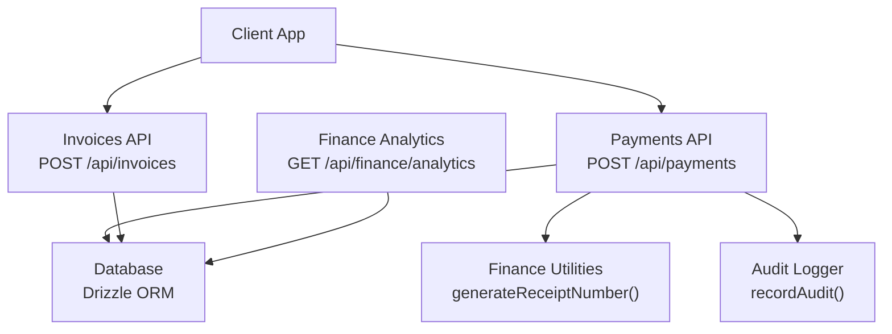
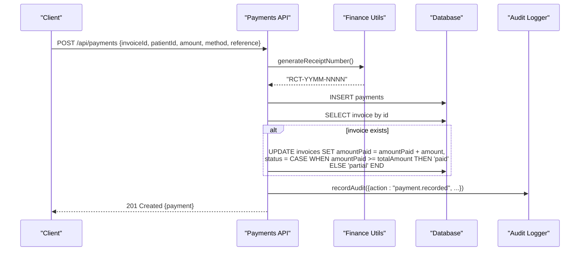
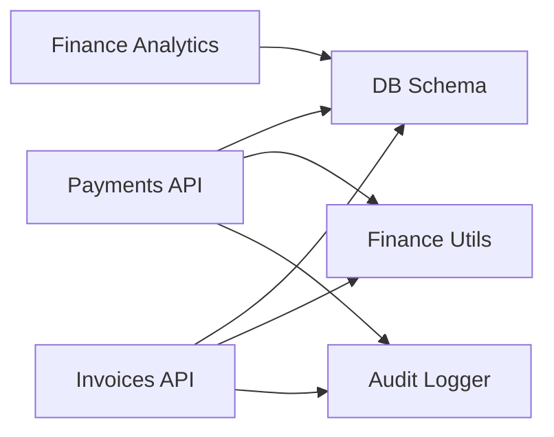
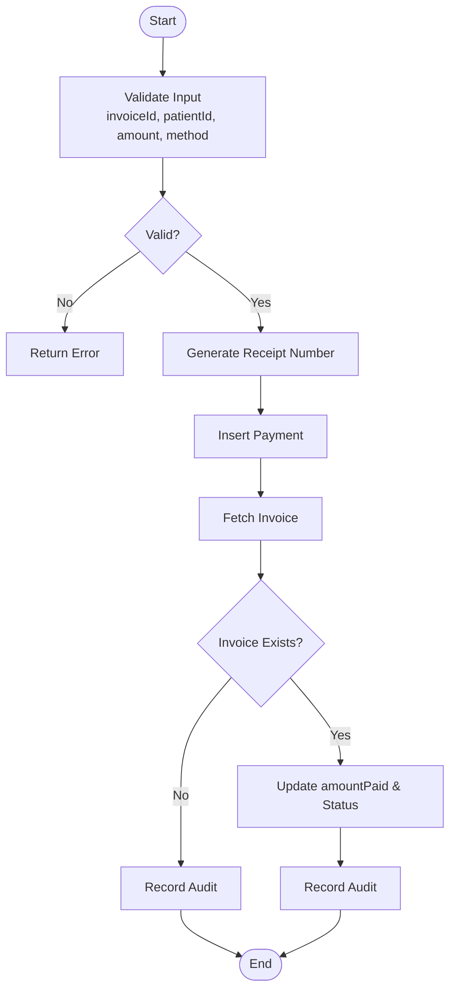
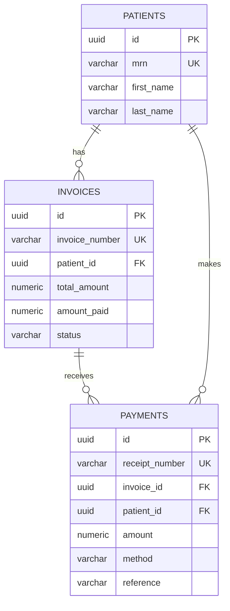

# Payment Processing

<cite>
**Referenced Files in This Document**
- [payments route](file://src/app/api/payments/route.ts)
- [invoices route](file://src/app/api/invoices/route.ts)
- [invoice detail route](file://src/app/api/invoices/[id]/route.ts)
- [finance utilities](file://src/lib/finance.ts)
- [database schema](file://src/db/schema.ts)
- [audit logger](file://src/lib/audit.ts)
- [finance analytics](file://src/app/api/finance/analytics/route.ts)
</cite>

## Table of Contents
1. Introduction
2. Project Structure
3. Core Components
4. Architecture Overview
5. Detailed Component Analysis
6. Dependency Analysis
7. Performance Considerations
8. Troubleshooting Guide
9. Conclusion
10. Appendices

## Introduction
This document explains the payment processing functionality in the platform, focusing on how payments are recorded, receipts are generated, and invoices are reconciled. It covers supported payment methods, reference tracking, audit trails, API endpoints for creating and retrieving payments, workflows including partial payments and application to invoices, validation and duplicate prevention considerations, financial reporting integration, and the relationships between payments, invoices, and receipts.

## Project Structure
The payment system is implemented as a set of Next.js API routes backed by a PostgreSQL database via Drizzle ORM. Key modules:
- Payments API: create and list payments; update invoice totals and status upon payment recording.
- Invoices API: create invoices with line items; retrieve invoice details and update invoice metadata.
- Finance utilities: generate unique identifiers (invoice numbers, receipt numbers).
- Database schema: defines entities for invoices, payments, patients, tariffs, and related tables.
- Audit logging: records actions for compliance and traceability.
- Finance analytics: aggregates invoicing, payments, claims, and expenses for reporting.

**Diagram sources**
- [payments route:1-79](file://src/app/api/payments/route.ts#L1-L79)
- [invoices route:1-100](file://src/app/api/invoices/route.ts#L1-L100)
- [finance utilities:1-35](file://src/lib/finance.ts#L1-L35)
- [audit logger:1-25](file://src/lib/audit.ts#L1-L25)
- [finance analytics:1-71](file://src/app/api/finance/analytics/route.ts#L1-L71)

**Section sources**
- [payments route:1-79](file://src/app/api/payments/route.ts#L1-L79)
- [invoices route:1-100](file://src/app/api/invoices/route.ts#L1-L100)
- [finance utilities:1-35](file://src/lib/finance.ts#L1-L35)
- [audit logger:1-25](file://src/lib/audit.ts#L1-L25)
- [finance analytics:1-71](file://src/app/api/finance/analytics/route.ts#L1-L71)

## Core Components
- Payments API: Records payments, generates receipt numbers, updates invoice totals and statuses, and writes audit entries.
- Invoices API: Creates invoices with line items, computes totals, and supports retrieval and updates.
- Finance Utilities: Provide deterministic, unique numbering for invoices and receipts.
- Database Schema: Defines core finance entities and their relationships.
- Audit Logger: Persists action logs for compliance and traceability.
- Finance Analytics: Aggregates metrics for revenue, collections, outstanding balances, and breakdowns by method/status.

**Section sources**
- [payments route:1-79](file://src/app/api/payments/route.ts#L1-L79)
- [invoices route:1-100](file://src/app/api/invoices/route.ts#L1-L100)
- [finance utilities:1-35](file://src/lib/finance.ts#L1-L35)
- [database schema:195-271](file://src/db/schema.ts#L195-L271)
- [audit logger:1-25](file://src/lib/audit.ts#L1-L25)
- [finance analytics:1-71](file://src/app/api/finance/analytics/route.ts#L1-L71)

## Architecture Overview
The payment flow integrates three primary entities:
- Invoice: Represents billed amounts, status, and cumulative payments.
- Payment: A discrete receipt of funds applied to an invoice.
- Receipt Number: Unique identifier for each payment record.

When a payment is created, the system:
1. Generates a unique receipt number.
2. Persists the payment record.
3. Updates the associated invoice’s amountPaid and recalculates its status (partial or paid).
4. Writes an audit log entry for traceability.

**Diagram sources**
- [payments route:35-78](file://src/app/api/payments/route.ts#L35-L78)
- [finance utilities:9-15](file://src/lib/finance.ts#L9-L15)
- [audit logger:4-24](file://src/lib/audit.ts#L4-L24)

## Detailed Component Analysis

### Payments API
Responsibilities:
- List all payments with joined invoice and patient details.
- Create a new payment with a generated receipt number.
- Update the linked invoice’s amountPaid and status based on cumulative payments.
- Record an audit event for every payment creation.

Key behaviors:
- Amount precision: Ensures two-decimal precision when persisting amounts.
- Status logic: Sets invoice status to “partial” if any payment has been made but not fully settled; sets to “paid” when cumulative payments meet or exceed totalAmount.
- Reference tracking: Stores optional external references (e.g., bank transaction IDs) for reconciliation.

Validation and error handling:
- Basic input parsing and numeric conversion occur before persistence.
- Errors return standardized JSON responses with descriptive messages.

Duplicate prevention:
- The payments table enforces uniqueness on receiptNumber at the database level, preventing duplicate receipt numbers.
- No explicit duplicate payment check per invoice is present in this endpoint; consider adding business-level validation to prevent overpayment beyond totalAmount if required.

**Section sources**
- [payments route:8-33](file://src/app/api/payments/route.ts#L8-L33)
- [payments route:35-78](file://src/app/api/payments/route.ts#L35-L78)
- [database schema:241-253](file://src/db/schema.ts#L241-L253)

### Invoices API
Responsibilities:
- Create invoices with line items, computing subtotal, tax, and total.
- Retrieve invoice lists with patient details.
- Retrieve individual invoice details including line items.
- Update invoice fields via PATCH.

Key behaviors:
- Line items are stored separately for detailed billing breakdowns.
- Tax amount defaults to zero for medical imaging contexts in this implementation.
- Initial invoice status is “sent”; subsequent updates may reflect payment-driven changes.

**Section sources**
- [invoices route:8-37](file://src/app/api/invoices/route.ts#L8-L37)
- [invoices route:46-99](file://src/app/api/invoices/route.ts#L46-L99)
- [invoice detail route:6-19](file://src/app/api/invoices/[id]/route.ts#L6-L19)
- [invoice detail route:21-38](file://src/app/api/invoices/[id]/route.ts#L21-L38)
- [database schema:209-239](file://src/db/schema.ts#L209-L239)

### Finance Utilities
Responsibilities:
- Generate unique invoice numbers and receipt numbers using date-based prefixes and random sequences.
- Define enumerations for billing types, payment methods, invoice statuses, claim statuses, expense categories, and employment types.

Supported payment methods:
- cash, card, eft, medical_aid

Invoice statuses:
- draft, sent, partial, paid, overdue, written_off

**Section sources**
- [finance utilities:1-35](file://src/lib/finance.ts#L1-L35)

### Database Schema (Finance Entities)
Entities involved:
- invoices: Tracks billing totals, amounts paid, and status.
- invoiceLineItems: Details services rendered per invoice.
- payments: Records individual receipts with method and reference.
- insuranceClaims: Tracks claims against invoices for medical aid reimbursements.
- tariffs: Reference pricing for procedures across different billing types.

Relationships:
- payments.invoiceId -> invoices.id
- payments.patientId -> patients.id
- invoices.patientId -> patients.id
- invoiceLineItems.invoiceId -> invoices.id
- insuranceClaims.invoiceId -> invoices.id

**Section sources**
- [database schema:195-271](file://src/db/schema.ts#L195-L271)

### Audit Logging
Responsibilities:
- Persist audit entries for key actions such as payment recording and invoice creation.
- Capture user context, module, entity type, entity ID, and additional details.

Usage:
- Payments API records “payment.recorded” events with receipt number, amount, and method.
- Invoices API records “invoice.created” events with invoice number and total amount.

**Section sources**
- [audit logger:1-25](file://src/lib/audit.ts#L1-L25)
- [payments route:66-72](file://src/app/api/payments/route.ts#L66-L72)
- [invoices route:87-93](file://src/app/api/invoices/route.ts#L87-L93)

### Finance Analytics
Responsibilities:
- Aggregate totals for invoiced amounts, paid amounts, and counts.
- Compute outstanding balances excluding paid/written-off invoices.
- Break down payments by method and invoices by status.
- Summarize expenses and provide daily revenue trends.

Integration points:
- Uses invoices, payments, insuranceClaims, and expenses tables to produce consolidated financial insights.

**Section sources**
- [finance analytics:1-71](file://src/app/api/finance/analytics/route.ts#L1-L71)

## Dependency Analysis
Core dependencies and interactions:
- Payments API depends on:
  - Database schema for payments, invoices, and patients.
  - Finance utilities for receipt number generation.
  - Audit logger for compliance events.
- Invoices API depends on:
  - Database schema for invoices and invoiceLineItems.
  - Finance utilities for invoice number generation.
  - Audit logger for creation events.
- Finance analytics depends on:
  - Database schema for invoices, payments, insuranceClaims, and expenses.

**Diagram sources**
- [payments route:1-79](file://src/app/api/payments/route.ts#L1-L79)
- [invoices route:1-100](file://src/app/api/invoices/route.ts#L1-L100)
- [finance utilities:1-35](file://src/lib/finance.ts#L1-L35)
- [audit logger:1-25](file://src/lib/audit.ts#L1-L25)
- [finance analytics:1-71](file://src/app/api/finance/analytics/route.ts#L1-L71)

**Section sources**
- [payments route:1-79](file://src/app/api/payments/route.ts#L1-L79)
- [invoices route:1-100](file://src/app/api/invoices/route.ts#L1-L100)
- [finance analytics:1-71](file://src/app/api/finance/analytics/route.ts#L1-L71)

## Performance Considerations
- Numeric precision: All monetary values are stored with fixed precision and scale to avoid floating-point drift. Ensure client-side rounding matches server-side behavior.
- Query efficiency: Listing payments joins invoices and patients; ensure appropriate indexes exist on foreign keys (invoiceId, patientId) for performance.
- Batch operations: Creating multiple line items or payments should be batched where possible to reduce round trips.
- Analytics queries: Aggregations use SQL functions; consider materialized views or scheduled jobs for large datasets.

[No sources needed since this section provides general guidance]

## Troubleshooting Guide
Common issues and resolutions:
- Failed to fetch payments: Check database connectivity and query permissions. Verify that payments, invoices, and patients tables are accessible.
- Failed to record payment: Validate request payload (invoiceId, patientId, amount, method). Ensure invoice exists and amount is numeric. Confirm receipt number generation succeeds.
- Invoice status not updating: Confirm that the invoice exists and that the payment amount is correctly added to amountPaid. Review status logic to ensure thresholds are met.
- Duplicate receipt numbers: The database enforces uniqueness on receiptNumber; if conflicts occur, verify that receipt number generation is collision-free and that concurrent inserts are handled safely.

Operational checks:
- Audit logs: Confirm that audit entries are being written for payment and invoice actions.
- Financial reports: Use finance analytics to validate totals and outstanding balances.

**Section sources**
- [payments route:30-32](file://src/app/api/payments/route.ts#L30-L32)
- [payments route:75-77](file://src/app/api/payments/route.ts#L75-L77)
- [audit logger:12-23](file://src/lib/audit.ts#L12-L23)

## Conclusion
The payment processing system provides a robust foundation for recording payments, generating receipts, and reconciling invoices. It supports multiple payment methods, tracks references for reconciliation, and maintains comprehensive audit trails. Financial analytics enable visibility into collections, outstanding balances, and revenue trends. For enhanced reliability, consider adding explicit validation to prevent overpayments and implementing idempotency controls for payment creation.

[No sources needed since this section summarizes without analyzing specific files]

## Appendices

### API Documentation

#### Create Payment
- Endpoint: POST /api/payments
- Request body fields:
  - invoiceId: string (UUID)
  - patientId: string (UUID)
  - amount: number (two decimals)
  - method: one of ["cash", "card", "eft", "medical_aid"]
  - reference: string (optional, e.g., bank transaction ID)
  - receivedBy: string (optional, defaults to "system")
  - notes: string (optional)
- Response:
  - 201 Created: payment object
  - 500 Error: JSON with error message and detail

Behavior:
- Generates a unique receipt number.
- Persists payment and updates invoice amountPaid and status.
- Records an audit event.

**Section sources**
- [payments route:35-78](file://src/app/api/payments/route.ts#L35-L78)
- [finance utilities:9-15](file://src/lib/finance.ts#L9-L15)
- [audit logger:4-24](file://src/lib/audit.ts#L4-L24)

#### List Payments
- Endpoint: GET /api/payments
- Response: Array of payment objects with joined invoice and patient details, ordered by most recent receivedAt.

**Section sources**
- [payments route:8-33](file://src/app/api/payments/route.ts#L8-L33)

#### Create Invoice
- Endpoint: POST /api/invoices
- Request body fields:
  - patientId: string (UUID)
  - studyId: string (optional)
  - appointmentId: string (optional)
  - billingType: one of ["cash", "medical_aid", "corporate"]
  - insuranceProvider: string (optional)
  - insurancePolicyNumber: string (optional)
  - issueDate: string (date)
  - dueDate: string (date, optional)
  - notes: string (optional)
  - lineItems: array of { description, quantity, unitPrice, tariffId? }
- Response:
  - 201 Created: invoice object
  - 500 Error: JSON with error message and detail

Behavior:
- Computes subtotal, tax (zero default), and totalAmount.
- Persists invoice and line items.
- Records an audit event.

**Section sources**
- [invoices route:46-99](file://src/app/api/invoices/route.ts#L46-L99)
- [finance utilities:1-7](file://src/lib/finance.ts#L1-L7)
- [audit logger:4-24](file://src/lib/audit.ts#L4-L24)

#### Get Invoice Detail
- Endpoint: GET /api/invoices/:id
- Response:
  - 200 OK: invoice object with lineItems
  - 404 Not Found: invoice does not exist
  - 500 Error: JSON with error message

**Section sources**
- [invoice detail route:6-19](file://src/app/api/invoices/[id]/route.ts#L6-L19)

#### Update Invoice
- Endpoint: PATCH /api/invoices/:id
- Request body: fields to update (e.g., status, notes)
- Response:
  - 200 OK: updated invoice
  - 404 Not Found: invoice does not exist
  - 500 Error: JSON with error message

**Section sources**
- [invoice detail route:21-38](file://src/app/api/invoices/[id]/route.ts#L21-L38)

### Workflows

#### Payment Workflow

**Diagram sources**
- [payments route:35-78](file://src/app/api/payments/route.ts#L35-L78)
- [finance utilities:9-15](file://src/lib/finance.ts#L9-L15)
- [audit logger:4-24](file://src/lib/audit.ts#L4-L24)

#### Partial Payment Handling
- When a payment is recorded, the invoice’s amountPaid increases by the payment amount.
- If cumulative payments are less than totalAmount, invoice status becomes “partial”.
- Once cumulative payments meet or exceed totalAmount, invoice status becomes “paid”.

**Section sources**
- [payments route:54-64](file://src/app/api/payments/route.ts#L54-L64)

#### Payment Application to Invoices
- Each payment is linked to an invoice via invoiceId.
- The system automatically applies the payment to the invoice’s amountPaid field.
- Reference tracking allows linking to external transactions for reconciliation.

**Section sources**
- [payments route:40-64](file://src/app/api/payments/route.ts#L40-L64)
- [database schema:241-253](file://src/db/schema.ts#L241-L253)

### Validation, Duplicate Prevention, and Reconciliation
- Validation:
  - Amount is converted to a number and formatted to two decimal places before storage.
  - Method must be one of the supported values defined in finance utilities.
- Duplicate prevention:
  - receiptNumber is unique at the database level, preventing duplicate receipts.
  - Consider adding business rules to prevent overpayment beyond totalAmount if necessary.
- Reconciliation:
  - Store external references (e.g., bank transaction IDs) in the payment.reference field.
  - Use finance analytics to compare totalCollected vs totalPaid and investigate discrepancies.

**Section sources**
- [payments route:40-72](file://src/app/api/payments/route.ts#L40-L72)
- [finance utilities:29-32](file://src/lib/finance.ts#L29-L32)
- [finance analytics:27-34](file://src/app/api/finance/analytics/route.ts#L27-L34)

### Financial Reporting Integration
- Finance analytics aggregates:
  - Total invoiced and paid amounts.
  - Outstanding balances excluding paid/written-off invoices.
  - Payment counts and totals by method.
  - Expense totals and counts.
  - Daily revenue trends for the last 14 days.

Use these metrics to reconcile collections, monitor outstanding receivables, and report on financial performance.

**Section sources**
- [finance analytics:6-66](file://src/app/api/finance/analytics/route.ts#L6-L66)

### Relationships Between Payments, Invoices, and Receipts
- Invoice: Represents the billed amount and cumulative payments.
- Payment: A discrete receipt of funds applied to an invoice.
- Receipt Number: Unique identifier for each payment record, used for auditing and reconciliation.

**Diagram sources**
- [database schema:209-253](file://src/db/schema.ts#L209-L253)