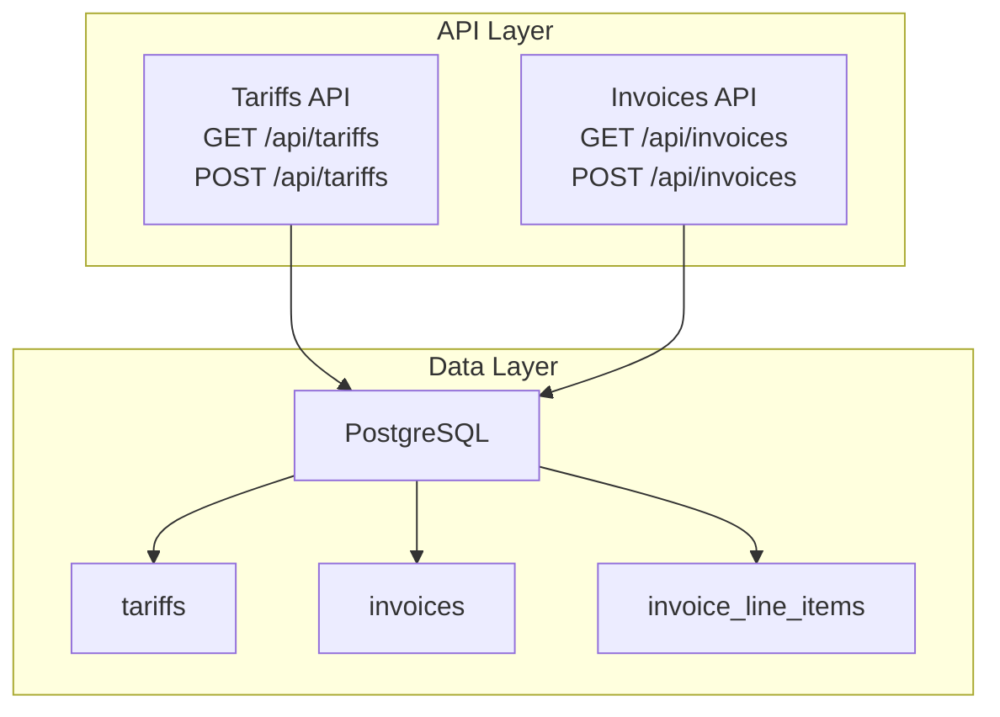
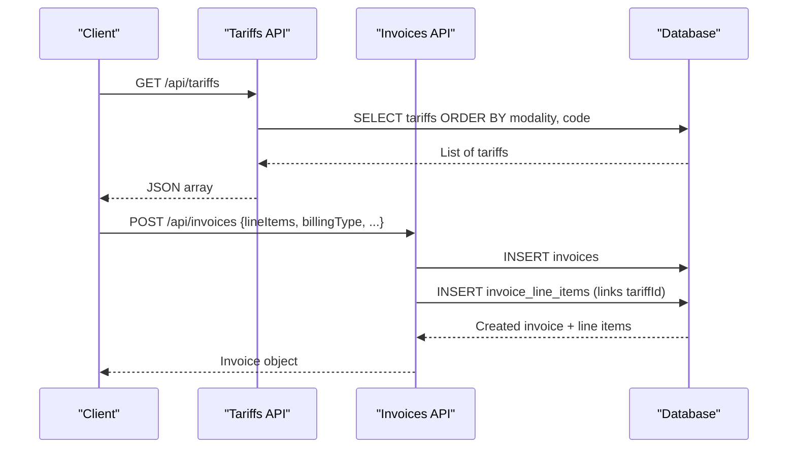
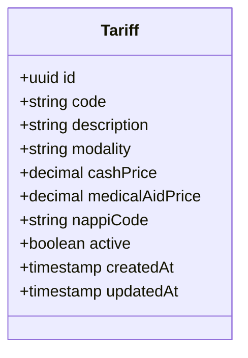
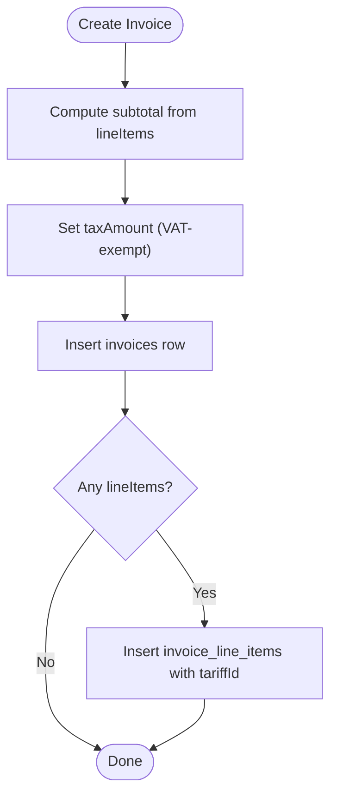
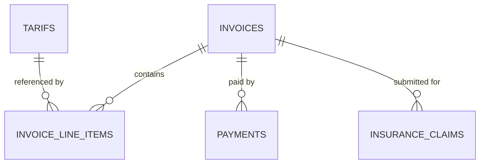
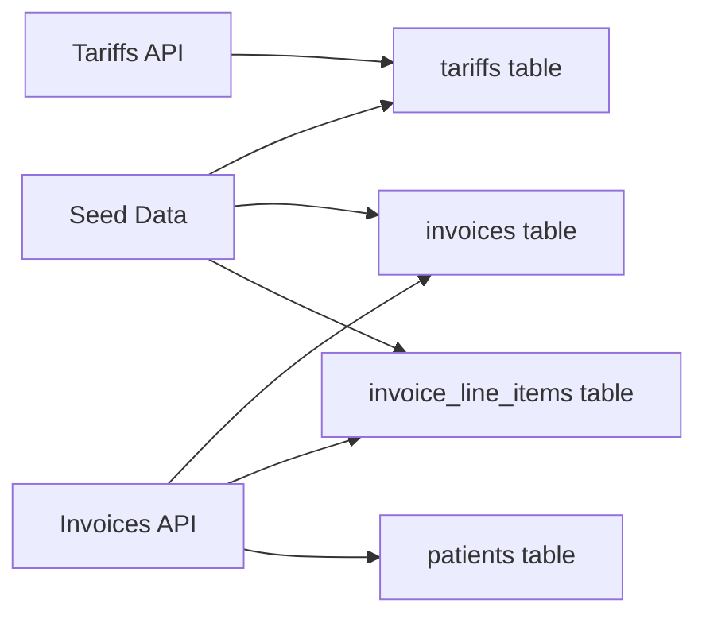

# Tariff & Price Management

<cite>
**Referenced Files in This Document**
- [schema.ts](file://src/db/schema.ts)
- [route.ts (Tariffs API)](file://src/app/api/tariffs/route.ts)
- [route.ts (Invoices API)](file://src/app/api/invoices/route.ts)
- [finance.ts](file://src/lib/finance.ts)
- [seed route.ts](file://src/app/api/seed/route.ts)
- [0000_redundant_the_twelve.sql](file://drizzle/0000_redundant_the_twelve.sql)
</cite>

## Table of Contents
1. Introduction
2. Project Structure
3. Core Components
4. Architecture Overview
5. Detailed Component Analysis
6. Dependency Analysis
7. Performance Considerations
8. Troubleshooting Guide
9. Conclusion

## Introduction
This document explains the tariff and price management system for medical imaging services. It covers the tariff structure, dual pricing (cash vs medical aid), CRUD operations, active/inactive status handling, price validation rules, invoicing integration, relationships between tariffs, procedures, and billing types, versioning considerations, historical pricing, and compliance aspects relevant to medical imaging billing.

## Project Structure
The tariff and pricing functionality spans database schema definitions, API endpoints, and seed data that demonstrate real-world usage:
- Database schema defines tariffs, invoices, invoice line items, payments, and insurance claims with foreign key relationships.
- The Tariffs API exposes read and create operations for tariffs.
- The Invoices API creates invoices with line items linked to tariffs and calculates totals.
- Seed data populates sample tariffs and invoices demonstrating cash and medical aid billing flows.

**Diagram sources**
- [route.ts (Tariffs API):6-23](file://src/app/api/tariffs/route.ts#L6-L23)
- [route.ts (Invoices API):8-99](file://src/app/api/invoices/route.ts#L8-L99)
- [schema.ts:196-239](file://src/db/schema.ts#L196-L239)

**Section sources**
- [schema.ts:196-239](file://src/db/schema.ts#L196-L239)
- [route.ts (Tariffs API):6-23](file://src/app/api/tariffs/route.ts#L6-L23)
- [route.ts (Invoices API):8-99](file://src/app/api/invoices/route.ts#L8-L99)

## Core Components
- Tariffs table stores procedure codes, descriptions, modalities, dual prices (cash and medical aid), optional NAPPi codes, and an active flag.
- Invoices capture billing type (cash or medical aid), insurance details, subtotal, tax amount, total, and payment status.
- Invoice line items link each billed service to a specific tariff and record unit price and quantity.
- Payments and insurance claims support downstream settlement workflows.

Key fields and constraints:
- Tariffs: unique code, modality, numeric prices, active boolean, timestamps.
- Invoices: unique invoice number, patient linkage, billing type, amounts, dates, status.
- Line items: reference to invoice and tariff, description, quantity, unit price, line total.

**Section sources**
- [schema.ts:196-239](file://src/db/schema.ts#L196-L239)
- [0000_redundant_the_twelve.sql:203-223](file://drizzle/0000_redundant_the_twelve.sql#L203-L223)
- [0000_redundant_the_twelve.sql:192-201](file://drizzle/0000_redundant_the_twelve.sql#L192-L201)
- [0000_redundant_the_twelve.sql:410-422](file://drizzle/0000_redundant_the_twelve.sql#L410-L422)

## Architecture Overview
The system uses a simple REST API backed by PostgreSQL via Drizzle ORM. Tariffs are managed through a dedicated endpoint; invoices are created with line items referencing tariffs. Seed data demonstrates realistic pricing and billing scenarios across modalities and billing types.

**Diagram sources**
- [route.ts (Tariffs API):6-23](file://src/app/api/tariffs/route.ts#L6-L23)
- [route.ts (Invoices API):8-99](file://src/app/api/invoices/route.ts#L8-L99)
- [schema.ts:196-239](file://src/db/schema.ts#L196-L239)

## Detailed Component Analysis

### Tariff Data Model
- Fields include a unique procedure code, human-readable description, modality grouping, dual pricing (cashPrice and medicalAidPrice), optional regulatory code (nappiCode), active status, and audit timestamps.
- The model supports filtering and ordering by modality and code for UI presentation and reporting.

**Diagram sources**
- [schema.ts:196-207](file://src/db/schema.ts#L196-L207)
- [0000_redundant_the_twelve.sql:410-422](file://drizzle/0000_redundant_the_twelve.sql#L410-L422)

**Section sources**
- [schema.ts:196-207](file://src/db/schema.ts#L196-L207)

### Tariffs API
- GET returns all tariffs ordered by modality and code.
- POST inserts a new tariff from request body and returns the created record.
- Error responses return a generic error message with HTTP 500 on failure.

Operational notes:
- No server-side validation is applied beyond database constraints; clients should validate required fields and numeric ranges before submission.
- Active/inactive toggling can be implemented by updating the active field on existing records.

**Section sources**
- [route.ts (Tariffs API):6-23](file://src/app/api/tariffs/route.ts#L6-L23)

### Invoices and Line Items Integration
- Creating an invoice computes subtotal from line items and sets tax to zero (medical imaging often VAT-exempt).
- Each line item may reference a tariff via tariffId and includes description, quantity, unit price, and computed line total.
- Billing type determines which price source to use when generating line items from tariffs.

**Diagram sources**
- [route.ts (Invoices API):46-99](file://src/app/api/invoices/route.ts#L46-L99)

**Section sources**
- [route.ts (Invoices API):8-99](file://src/app/api/invoices/route.ts#L8-L99)
- [schema.ts:209-239](file://src/db/schema.ts#L209-L239)

### Seed Data Examples
- Sample tariffs cover multiple modalities (CT, MRI, X-Ray, Ultrasound, Mammography) with distinct cash and medical aid prices and NAPPi codes.
- Sample invoices demonstrate both cash and medical aid billing, linking to tariffs and recording insurance provider/policy numbers where applicable.
- Payments and insurance claims illustrate downstream settlement states.

Examples included:
- CT Brain, CT Chest, CT Abdomen & Pelvis
- MRI Knee, MRI Brain, MRI Lumbar Spine
- Chest X-Ray, Abdominal Ultrasound, Mammography Screening

These entries show how billing type selects the appropriate price and how line items persist the chosen unit price at time of billing.

**Section sources**
- [seed route.ts:272-344](file://src/app/api/seed/route.ts#L272-L344)

### Relationships Between Tariffs, Procedures, and Billing Types
- Tariffs represent billable procedures/services grouped by modality.
- Procedures are represented by tariff codes and descriptions; modalities align with equipment/workflow categories.
- Billing type (cash vs medical aid) determines which price is used for invoicing and claim submissions.

**Diagram sources**
- [schema.ts:196-271](file://src/db/schema.ts#L196-L271)
- [0000_redundant_the_twelve.sql:192-223](file://drizzle/0000_redundant_the_twelve.sql#L192-L223)

**Section sources**
- [schema.ts:196-271](file://src/db/schema.ts#L196-L271)

### Price Validation Rules
Current implementation relies on database constraints and client-provided values:
- Numeric precision enforced by numeric types (e.g., prices stored with two decimal places).
- Unique constraints ensure no duplicate tariff codes or invoice numbers.
- Required fields enforced by notNull constraints.

Recommended validations to implement at the API layer:
- Ensure tariff exists and is active before creating line items.
- Validate that unitPrice matches the selected tariff’s price based on billing type.
- Enforce non-negative quantities and prices.
- For medical aid billing, require insuranceProvider and insurancePolicyNumber.

[No sources needed since this section provides general guidance]

### Tariff Versioning and Historical Pricing
- Current design captures the unit price at invoice creation time within invoice_line_items.unitPrice, preserving historical pricing even if tariffs change later.
- To enhance versioning and auditability, consider adding explicit version fields to tariffs and capturing tariff snapshots at billing time.

[No sources needed since this section provides general guidance]

### Compliance Considerations for Medical Imaging Services
- Regulatory codes: Tariffs include an optional nappiCode field suitable for mapping to national/provincial coding schemes.
- Tax treatment: Invoices set taxAmount to zero, reflecting common VAT exemptions for medical imaging in many jurisdictions.
- Audit trail: Invoice creation logs actions via an audit mechanism to support traceability.

**Section sources**
- [schema.ts:196-239](file://src/db/schema.ts#L196-L239)
- [route.ts (Invoices API):87-93](file://src/app/api/invoices/route.ts#L87-L93)

## Dependency Analysis
- Tariffs API depends on the tariffs table and Drizzle ORM for querying and inserting records.
- Invoices API depends on invoices, invoice_line_items, patients tables and generates unique identifiers for invoices.
- Seed data demonstrates realistic relationships among tariffs, invoices, payments, and insurance claims.

**Diagram sources**
- [route.ts (Tariffs API):6-23](file://src/app/api/tariffs/route.ts#L6-L23)
- [route.ts (Invoices API):8-99](file://src/app/api/invoices/route.ts#L8-L99)
- [seed route.ts:272-344](file://src/app/api/seed/route.ts#L272-L344)

**Section sources**
- [route.ts (Tariffs API):6-23](file://src/app/api/tariffs/route.ts#L6-L23)
- [route.ts (Invoices API):8-99](file://src/app/api/invoices/route.ts#L8-L99)
- [seed route.ts:272-344](file://src/app/api/seed/route.ts#L272-L344)

## Performance Considerations
- Tariff listing orders by modality and code; ensure indexes on these columns for large datasets.
- Invoice creation performs two writes (header + line items); batch operations or transactions can improve consistency.
- Avoid unnecessary recalculations by caching tariff prices in the frontend when appropriate.

[No sources needed since this section provides general guidance]

## Troubleshooting Guide
Common issues and resolutions:
- Duplicate tariff code: Occurs when inserting a tariff with an existing code. Resolve by using a unique code or updating the existing record.
- Missing required fields: Database constraints enforce notNull fields; ensure all required fields are provided.
- Invalid billing type: Use supported values defined in finance constants.
- Invoice creation failures: Check network errors and database constraints; review error responses from the API.

**Section sources**
- [finance.ts:29-32](file://src/lib/finance.ts#L29-L32)
- [route.ts (Invoices API):96-99](file://src/app/api/invoices/route.ts#L96-L99)
- [route.ts (Tariffs API):10-22](file://src/app/api/tariffs/route.ts#L10-L22)

## Conclusion
The tariff and price management system provides a clear foundation for managing medical imaging services with dual pricing, structured billing, and integrations for payments and insurance claims. By leveraging the tariff model, enforcing validation rules, and capturing historical prices at billing time, the platform supports accurate, compliant, and auditable financial operations. Future enhancements can include stronger server-side validation, explicit tariff versioning, and richer reporting capabilities.