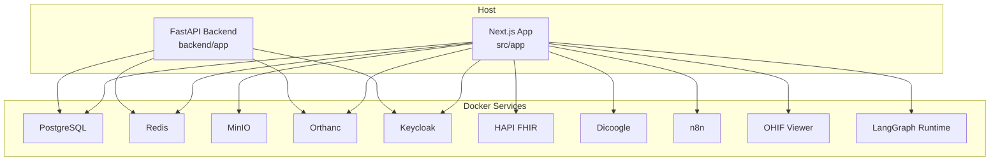
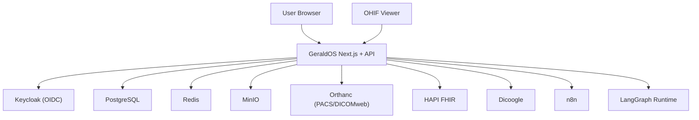
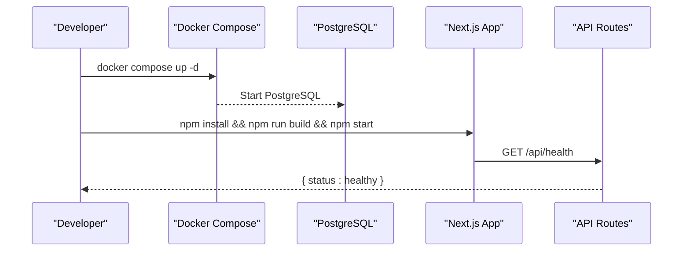
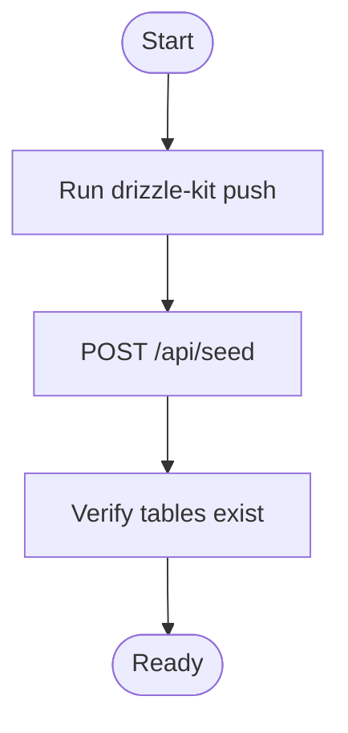
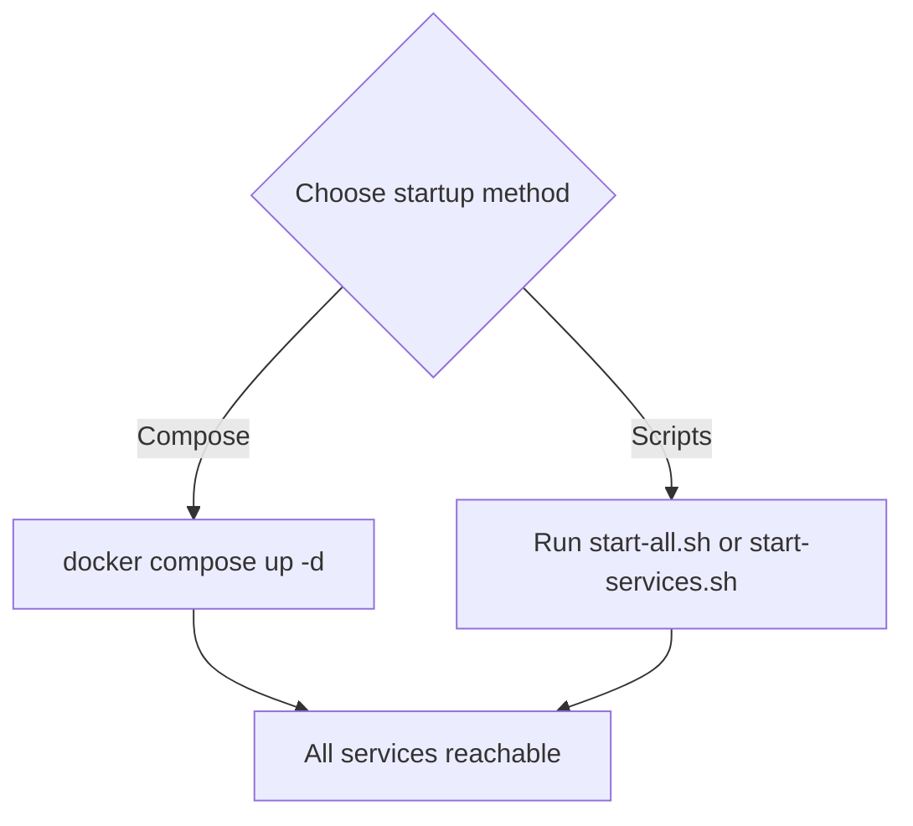
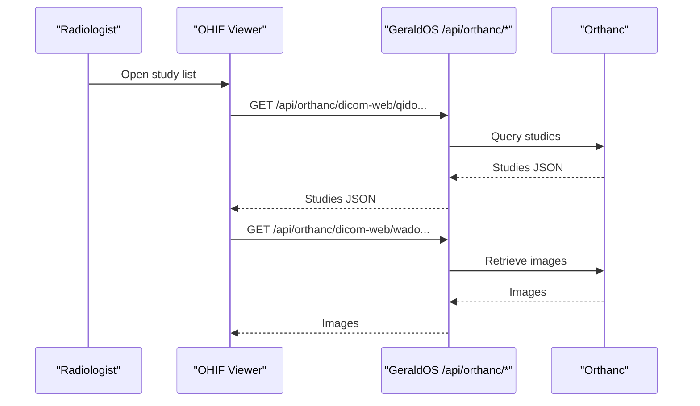
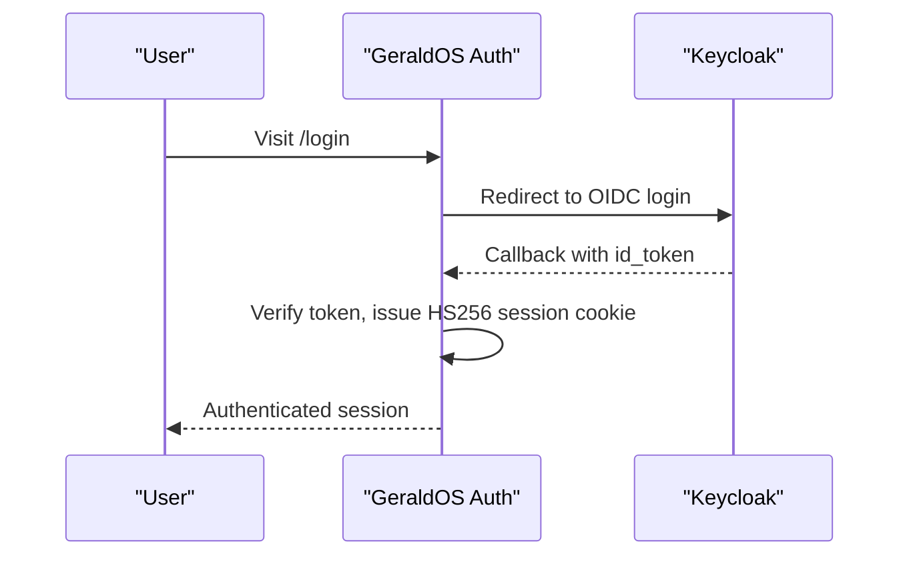
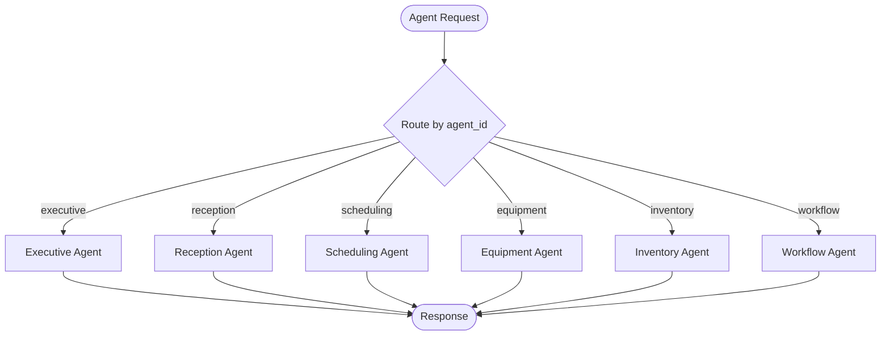
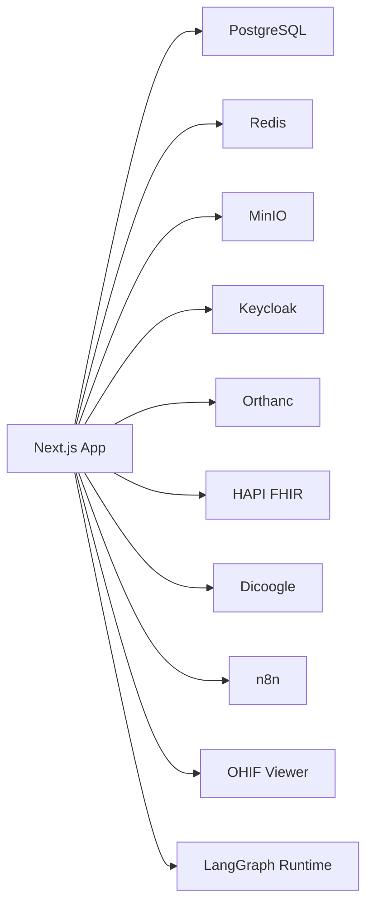

# Getting Started

<cite>
**Referenced Files in This Document**
- [README.md](file://README.md)
- [docker-compose.yml](file://docker-compose.yml)
- [.env.example](file://.env.example)
- [package.json](file://package.json)
- [drizzle.config.json](file://drizzle.config.json)
- [src/db/schema.ts](file://src/db/schema.ts)
- [ohif-config/app-config.js](file://ohif-config/app-config.js)
- [services/start-all.sh](file://services/start-all.sh)
- [scripts/start-services.sh](file://scripts/start-services.sh)
- [backend/app/main.py](file://backend/app/main.py)
- [backend/app/core/config.py](file://backend/app/core/config.py)
- [services/langgraph_agent.py](file://services/langgraph_agent.py)
</cite>

## Table of Contents
1. Introduction
2. Project Structure
3. Core Components
4. Architecture Overview
5. Detailed Component Analysis
6. Dependency Analysis
7. Performance Considerations
8. Troubleshooting Guide
9. Conclusion

## Introduction
GeraldOS is an AI-native diagnostic imaging operations platform that orchestrates patients, scheduling, clinical workflow, equipment, inventory, reporting, and AI agents while delegating specialized tasks to best-in-class services: DICOM storage to Orthanc, image display to OHIF/Weasis, identity to Keycloak, automation to n8n, and agent reasoning to LangGraph. It provides a unified Next.js application with server-side API routes for secure integration with each service, keeping secrets off the browser and exposing only safe configuration.

This guide helps you run GeraldOS locally end-to-end using Docker Compose, configure environment variables, initialize the database schema, seed demo data, and start the platform.

**Section sources**
- [README.md:1-8](file://README.md#L1-L8)
- [README.md:47-64](file://README.md#L47-L64)

## Project Structure
At a high level, the repository contains:
- A Next.js frontend and API layer (routes under src/app/api)
- A FastAPI backend module (backend/app)
- Docker Compose orchestration for all runtime services
- Environment templates and Drizzle ORM configuration for PostgreSQL
- Configuration for OHIF viewer proxying through GeraldOS
- Scripts to start local integrations when not using Docker Compose



**Diagram sources**
- [docker-compose.yml:4-110](file://docker-compose.yml#L4-L110)
- [package.json:4-12](file://package.json#L4-L12)
- [drizzle.config.json:1-8](file://drizzle.config.json#L1-L8)

**Section sources**
- [docker-compose.yml:1-118](file://docker-compose.yml#L1-L118)
- [package.json:1-62](file://package.json#L1-L62)
- [drizzle.config.json:1-8](file://drizzle.config.json#L1-L8)

## Core Components
- Platform app (Next.js): UI and server-side API routes for patient management, scheduling, workflow, imaging, reporting, knowledge, finance, and integrations.
- FastAPI backend module: Additional endpoints for reception, scheduling, workflow transitions, equipment/inventory, reporting, and analytics.
- Data layer: PostgreSQL via Drizzle ORM; Redis for events/caching; MinIO for object storage.
- Integrations:
  - Identity: Keycloak (OIDC/JWT).
  - PACS/DICOMweb: Orthanc (proxied by GeraldOS).
  - Viewer: OHIF configured to call GeraldOS proxy endpoints.
  - Interoperability: HAPI FHIR proxy.
  - Search: Dicoogle index proxy.
  - Automation: n8n webhooks and triggers.
  - Agents: LangGraph runtime for multi-agent workflows.

**Section sources**
- [README.md:9-89](file://README.md#L9-L89)
- [src/lib/integrations/index.ts:1-52](file://src/lib/integrations/index.ts#L1-L52)
- [backend/app/main.py:25-325](file://backend/app/main.py#L25-L325)

## Architecture Overview
GeraldOS sits above the imaging stack and coordinates cross-functional operations while delegating domain-specific responsibilities:
- Patients, scheduling, workflow, equipment, inventory, reporting, and AI agents are orchestrated within GeraldOS.
- DICOM storage and DICOMweb queries are handled by Orthanc and proxied securely from the browser.
- Image viewing is delegated to OHIF/Weasis, which calls GeraldOS endpoints for DICOMweb traffic.
- Identity and access control use Keycloak OIDC flows.
- Automation uses n8n webhooks and triggers.
- Agent reasoning uses LangGraph graphs and threads.



**Diagram sources**
- [README.md:9-23](file://README.md#L9-L23)
- [docker-compose.yml:4-110](file://docker-compose.yml#L4-L110)
- [ohif-config/app-config.js:1-49](file://ohif-config/app-config.js#L1-L49)

## Detailed Component Analysis

### Prerequisites and System Requirements
- Docker and Docker Compose installed on your machine.
- Node.js and npm available to build and run the Next.js app.
- Ports free on your host: 5432 (PostgreSQL), 6379 (Redis), 9000/9001 (MinIO), 8042 (Orthanc), 8180 (Keycloak), 8090 (FHIR), 8095 (Dicoogle), 5678 (n8n), 3001 (OHIF), 8123 (LangGraph), and 3000 (Next.js dev or start).

**Section sources**
- [docker-compose.yml:4-110](file://docker-compose.yml#L4-L110)
- [package.json:4-12](file://package.json#L4-L12)

### Installation and First Run
1. Start the approved stack with Docker Compose.
2. Copy and edit environment variables from the example file to set endpoints and secrets.
3. Push the database schema and seed demo data.
4. Build and start the Next.js application.
5. Verify health endpoints.



**Diagram sources**
- [README.md:47-64](file://README.md#L47-L64)
- [package.json:4-12](file://package.json#L4-L12)

**Section sources**
- [README.md:47-64](file://README.md#L47-L64)
- [package.json:4-12](file://package.json#L4-L12)

### Environment Configuration
- Use .env.example as the template for all required variables:
  - Database URL, authentication secret, and development auth flag.
  - Keycloak URL, realm, client ID, and optional client secret.
  - Orthanc URL and credentials.
  - OHIF URL.
  - Dicoogle URL.
  - HAPI FHIR URL.
  - n8n URL, webhook base, and optional API key.
  - LangGraph URL, API key, and assistant ID.
  - MinIO endpoint, access keys, bucket, and region.
  - Redis URL.

- The Drizzle configuration points at PostgreSQL for schema migrations.

- The FastAPI backend reads its own settings from environment variables (database, Redis, MinIO, Keycloak, Orthanc, FHIR).

**Section sources**
- [.env.example:1-45](file://.env.example#L1-L45)
- [drizzle.config.json:1-8](file://drizzle.config.json#L1-L8)
- [backend/app/core/config.py:1-20](file://backend/app/core/config.py#L1-L20)

### Database Initialization
- Push the schema defined in Drizzle to PostgreSQL.
- Seed demo data via the provided API route.



**Diagram sources**
- [package.json:4-12](file://package.json#L4-L12)
- [README.md:56-58](file://README.md#L56-L58)
- [src/db/schema.ts:17-468](file://src/db/schema.ts#L17-L468)

**Section sources**
- [package.json:4-12](file://package.json#L4-L12)
- [README.md:56-58](file://README.md#L56-L58)
- [src/db/schema.ts:17-468](file://src/db/schema.ts#L17-L468)

### Service Startup Options
- Docker Compose approach: recommended for consistent environments.
- Local script approach: scripts can start Redis, Orthanc, MinIO, Keycloak, FHIR, Dicoogle, n8n, OHIF, and LangGraph if you prefer running them directly on the host.



**Diagram sources**
- [docker-compose.yml:1-118](file://docker-compose.yml#L1-L118)
- [services/start-all.sh:1-100](file://services/start-all.sh#L1-L100)
- [scripts/start-services.sh:1-93](file://scripts/start-services.sh#L1-L93)

**Section sources**
- [docker-compose.yml:1-118](file://docker-compose.yml#L1-L118)
- [services/start-all.sh:1-100](file://services/start-all.sh#L1-L100)
- [scripts/start-services.sh:1-93](file://scripts/start-services.sh#L1-L93)

### Imaging Workflow and Viewer Integration
- All DICOMweb traffic goes through GeraldOS proxies so the browser never contacts Orthanc directly.
- OHIF is configured to call GeraldOS endpoints for QIDO/WADO/STOW.



**Diagram sources**
- [ohif-config/app-config.js:1-49](file://ohif-config/app-config.js#L1-L49)
- [README.md:73-77](file://README.md#L73-L77)

**Section sources**
- [ohif-config/app-config.js:1-49](file://ohif-config/app-config.js#L1-L49)
- [README.md:73-77](file://README.md#L73-L77)

### Authentication and Identity
- Keycloak handles OIDC Authorization Code flow.
- When Keycloak is unavailable, the app supports a degraded mode with a local dev session endpoint.



**Diagram sources**
- [README.md:68-72](file://README.md#L68-L72)

**Section sources**
- [README.md:68-72](file://README.md#L68-L72)

### AI Agents and Reasoning
- Multi-agent graph defines routing to specialized agents (executive, reception, scheduling, equipment, inventory, workflow).
- The LangGraph runtime exposes threads and runs; unreachable runtime falls back to live-data simulation reading PostgreSQL state.



**Diagram sources**
- [services/langgraph_agent.py:7-35](file://services/langgraph_agent.py#L7-L35)
- [README.md:81-83](file://README.md#L81-L83)

**Section sources**
- [services/langgraph_agent.py:1-35](file://services/langgraph_agent.py#L1-L35)
- [README.md:81-83](file://README.md#L81-L83)

### Backend API Modules
The FastAPI module demonstrates core operational endpoints:
- Reception and patients
- Scheduling and appointments
- Clinical workflow state transitions
- Equipment and inventory
- Reporting
- Analytics summary

```mermaid
classDiagram
class FastAPIApp {
+GET "/health"
+POST "/api/patients"
+GET "/api/patients"
+POST "/api/appointments"
+GET "/api/appointments"
+POST "/api/workflow/runs"
+PUT "/api/workflow/runs/{run_id}/transition"
+GET "/api/orthanc/studies"
+POST "/api/equipment"
+GET "/api/equipment"
+GET "/api/inventory"
+PUT "/api/inventory/{item_id}/adjust"
+POST "/api/reports"
+GET "/api/reports"
+GET "/api/analytics/summary"
}
```

**Diagram sources**
- [backend/app/main.py:25-325](file://backend/app/main.py#L25-L325)

**Section sources**
- [backend/app/main.py:25-325](file://backend/app/main.py#L25-L325)

## Dependency Analysis
- The Next.js app depends on PostgreSQL, Redis, MinIO, Keycloak, Orthanc, HAPI FHIR, Dicoogle, n8n, OHIF, and LangGraph.
- Docker Compose defines these services and their ports, volumes, and health checks.
- Drizzle config binds the app’s schema to PostgreSQL.
- OHIF viewer is configured to call GeraldOS endpoints for DICOMweb.



**Diagram sources**
- [docker-compose.yml:4-110](file://docker-compose.yml#L4-L110)
- [drizzle.config.json:1-8](file://drizzle.config.json#L1-L8)
- [ohif-config/app-config.js:1-49](file://ohif-config/app-config.js#L1-L49)

**Section sources**
- [docker-compose.yml:4-110](file://docker-compose.yml#L4-L110)
- [drizzle.config.json:1-8](file://drizzle.config.json#L1-L8)
- [ohif-config/app-config.js:1-49](file://ohif-config/app-config.js#L1-L49)

## Performance Considerations
- Keep DICOMweb traffic proxied through GeraldOS to avoid CORS issues and protect credentials.
- Use Redis for event streaming and caching where applicable to reduce database load.
- Ensure health checks pass before relying on integrations; the platform reports connected/unreachable/not_configured states.
- Scale services independently via Docker Compose or container orchestration as needed.

[No sources needed since this section provides general guidance]

## Troubleshooting Guide
Common setup issues and resolutions:
- Port conflicts: If any default port is already in use, stop the conflicting process or change the service mapping in docker-compose.yml.
- Database connectivity: Verify DATABASE_URL matches your PostgreSQL instance and credentials; ensure Drizzle config points to the correct database.
- Keycloak not ready: Wait for Keycloak to expose its realms; confirm KEYCLOAK_URL and realm match your configuration.
- Orthanc not responding: Confirm ORTHANC_URL and credentials; check Orthanc logs and health endpoint.
- OHIF cannot load studies: Ensure OHIF_URL points to the running viewer and that GeraldOS DICOMweb proxy endpoints are reachable.
- n8n/LangGraph not reachable: Check respective URLs and health endpoints; ensure dependencies (Redis/PostgreSQL) are running.
- Health checks: Use /api/health and /api/integrations/status to verify service availability and latency.

**Section sources**
- [README.md:64-89](file://README.md#L64-L89)
- [docker-compose.yml:12-110](file://docker-compose.yml#L12-L110)

## Conclusion
You now have the context to install, configure, and run GeraldOS locally with its full approved stack. Use Docker Compose for consistency, configure environment variables, initialize the database, seed data, and start the platform. Explore the modules—patients, scheduling, workflow, imaging, reporting, knowledge, finance, and AI agents—and integrate with Orthanc, OHIF, Keycloak, n8n, and LangGraph as described.

[No sources needed since this section summarizes without analyzing specific files]