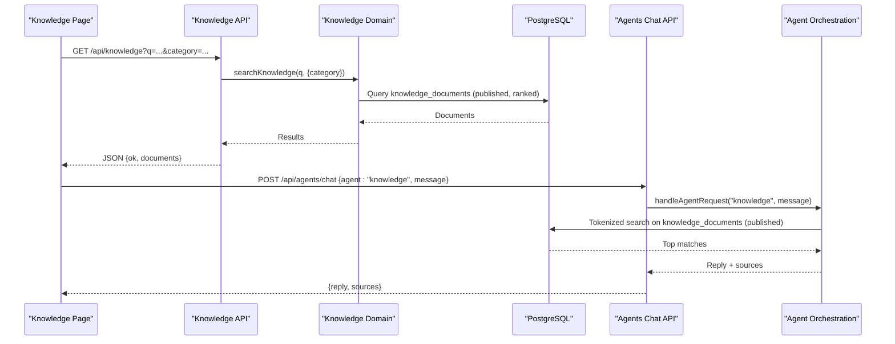
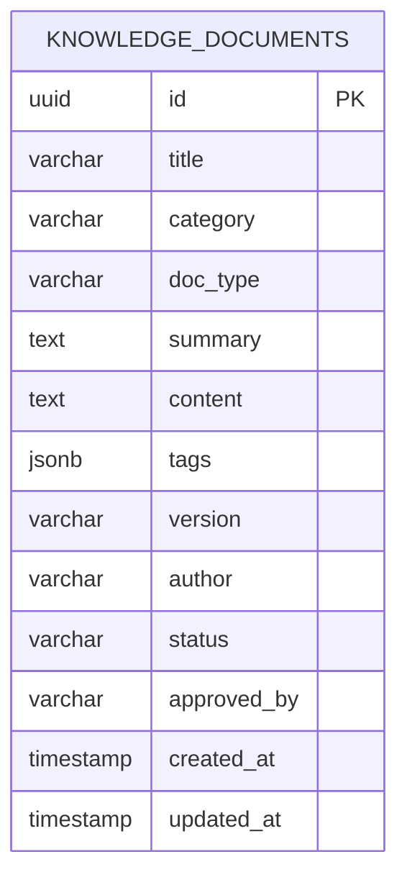
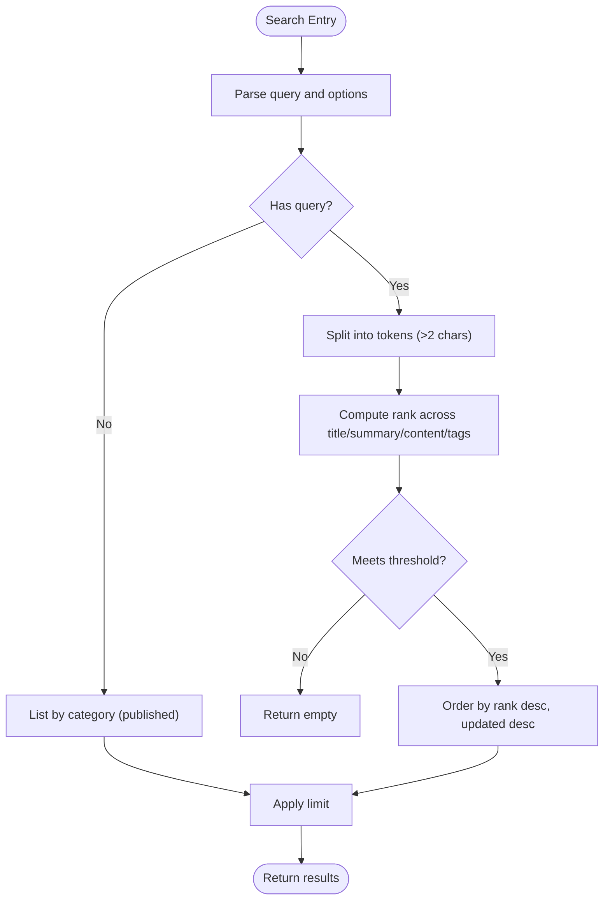
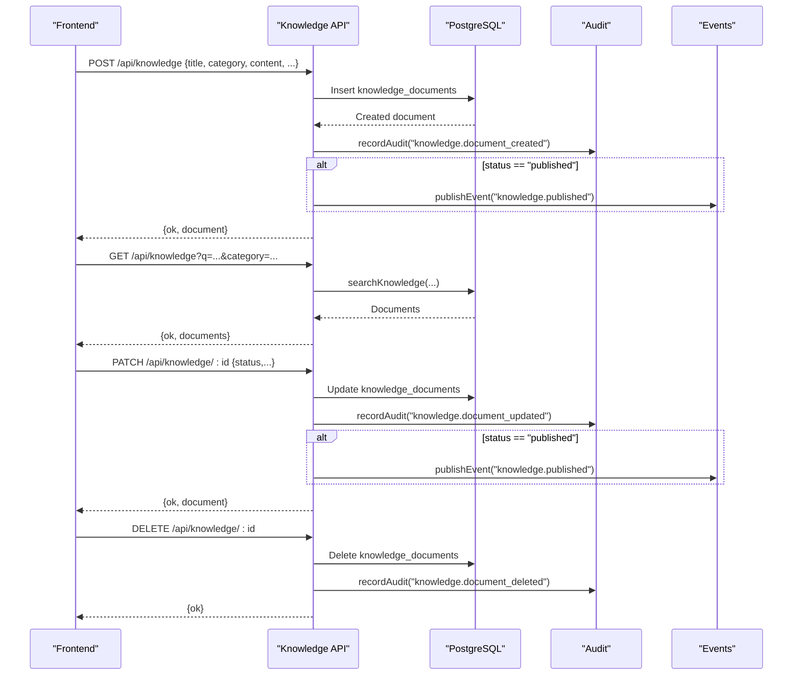
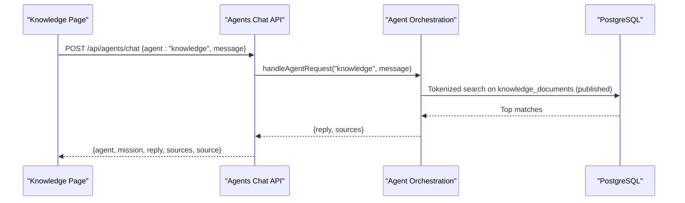
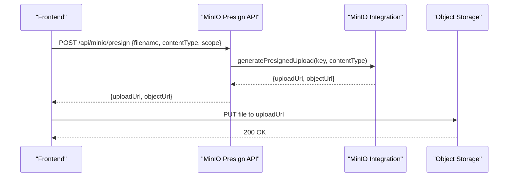
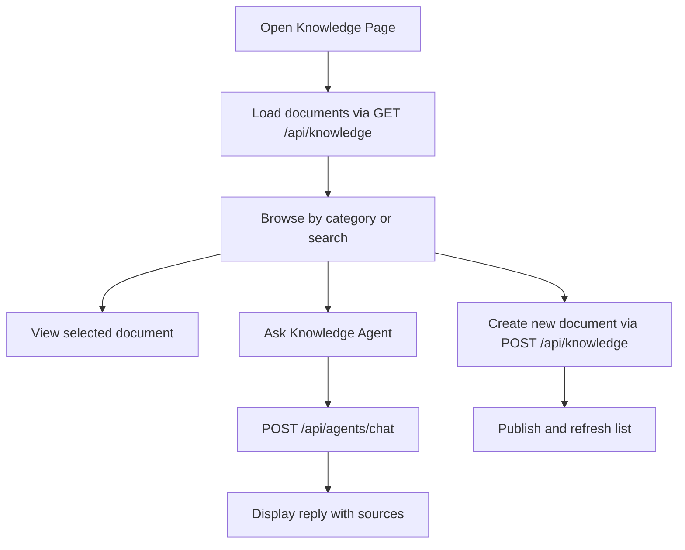
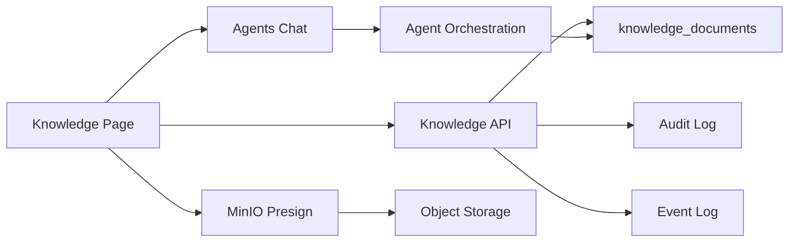

# Knowledge Platform

<cite>
**Referenced Files in This Document**
- [route.ts](file://src/app/api/knowledge/route.ts)
- [route.ts](file://src/app/api/knowledge/[id]/route.ts)
- [knowledge.ts](file://src/lib/knowledge.ts)
- [knowledge-categories.ts](file://src/lib/knowledge-categories.ts)
- [schema.ts](file://src/db/schema.ts)
- [page.tsx](file://src/app/knowledge/page.tsx)
- [agents.ts](file://src/lib/agents.ts)
- [route.ts](file://src/app/api/agents/chat/route.ts)
- [route.ts](file://src/app/api/minio/presign/route.ts)
- [minio.ts](file://src/lib/integrations/minio.ts)
</cite>

## Table of Contents
1. Introduction
2. Project Structure
3. Core Components
4. Architecture Overview
5. Detailed Component Analysis
6. Dependency Analysis
7. Performance Considerations
8. Troubleshooting Guide
9. Conclusion
10. Appendices

## Introduction
This document explains the Knowledge Platform: a centralized system for managing institutional knowledge such as SOPs, radiology protocols, machine manuals, vendor guides, quality procedures, accreditation standards, radiation safety documents, policies, training materials, reporting templates, and preparation guides. It covers document management (creation, retrieval, update, deletion), search and categorization, version control, and integration with the Knowledge Agent that answers questions exclusively from approved documentation.

The platform provides:
- A structured knowledge base with categories and document types
- Tokenized full-text search across title, summary, content, and tags
- Versioning and approval status to ensure only published documents are used by the Knowledge Agent
- An API surface for CRUD operations and search
- A chat-based interface to ask the Knowledge Agent for protocol guidance and policy references
- Optional object storage integration for attachments via presigned uploads

## Project Structure
The Knowledge Platform is implemented as part of a Next.js application with server routes under src/app/api, domain logic in src/lib, and data models in src/db/schema. The user interface lives in src/app/knowledge.

```mermaid
graph TB
subgraph "Frontend"
KPage["Knowledge Page<br/>src/app/knowledge/page.tsx"]
end
subgraph "API Routes"
KR["Knowledge GET/POST<br/>src/app/api/knowledge/route.ts"]
KRID["Knowledge CRUD by ID<br/>src/app/api/knowledge/[id]/route.ts"]
AC["Agents Chat<br/>src/app/api/agents/chat/route.ts"]
MP["MinIO Presign Upload<br/>src/app/api/minio/presign/route.ts"]
end
subgraph "Domain Logic"
KL["Knowledge Search & List<br/>src/lib/knowledge.ts"]
KC["Categories & Types<br/>src/lib/knowledge-categories.ts"]
AG["Agent Orchestration<br/>src/lib/agents.ts"]
MI["MinIO Integration<br/>src/lib/integrations/minio.ts"]
end
subgraph "Data"
DB["PostgreSQL Schema<br/>src/db/schema.ts"]
end
KPage --> KR
KPage --> AC
KR --> KL
KRDB["DB Access"]:::hidden
KR --> DB
KRID --> DB
AC --> AG
AG --> DB
MP --> MI
MI --> DB
classDef hidden { display: none; }
```

**Diagram sources**
- [page.tsx:90-153](file://src/app/knowledge/page.tsx#L90-L153)
- [route.ts:10-65](file://src/app/api/knowledge/route.ts#L10-L65)
- [route.ts:10-54](file://src/app/api/knowledge/[id]/route.ts#L10-L54)
- [knowledge.ts:31-71](file://src/lib/knowledge.ts#L31-L71)
- [agents.ts:321-363](file://src/lib/agents.ts#L321-L363)
- [route.ts:8-28](file://src/app/api/minio/presign/route.ts#L8-L28)
- [minio.ts:29-47](file://src/lib/integrations/minio.ts#L29-L47)
- [schema.ts:407-421](file://src/db/schema.ts#L407-L421)

**Section sources**
- [page.tsx:77-153](file://src/app/knowledge/page.tsx#L77-L153)
- [route.ts:10-65](file://src/app/api/knowledge/route.ts#L10-L65)
- [route.ts:10-54](file://src/app/api/knowledge/[id]/route.ts#L10-L54)
- [knowledge.ts:31-71](file://src/lib/knowledge.ts#L31-L71)
- [agents.ts:321-363](file://src/lib/agents.ts#L321-L363)
- [route.ts:8-28](file://src/app/api/minio/presign/route.ts#L8-L28)
- [minio.ts:29-47](file://src/lib/integrations/minio.ts#L29-L47)
- [schema.ts:407-421](file://src/db/schema.ts#L407-L421)

## Core Components
- Knowledge document model: stores metadata, content, tags, version, author, and approval status. Only published documents are returned by search and used by the Knowledge Agent.
- Categories and document types: predefined categories (e.g., clinical SOPs, radiology protocols, policies) and doc types (e.g., sop, guide, protocol, manual).
- Search engine: tokenized matching across title, summary, content, and tags with ranking and minimum match thresholds.
- API endpoints: create/list/search/update/delete knowledge documents; agent chat endpoint for Knowledge Agent queries; presigned upload endpoint for attaching files.
- Frontend UI: category browsing, search, document viewer, new document creation dialog, and integrated Knowledge Agent chat.

**Section sources**
- [schema.ts:407-421](file://src/db/schema.ts#L407-L421)
- [knowledge-categories.ts:6-22](file://src/lib/knowledge-categories.ts#L6-L22)
- [knowledge.ts:31-71](file://src/lib/knowledge.ts#L31-L71)
- [route.ts:10-65](file://src/app/api/knowledge/route.ts#L10-L65)
- [route.ts:10-54](file://src/app/api/knowledge/[id]/route.ts#L10-L54)
- [page.tsx:90-153](file://src/app/knowledge/page.tsx#L90-L153)

## Architecture Overview
The Knowledge Platform follows a layered architecture:
- Presentation layer: Next.js pages and components render the knowledge library, search results, and agent chat.
- API layer: Route handlers validate inputs, perform database operations, audit actions, publish events, and return JSON responses.
- Domain layer: Reusable functions implement search, listing, and agent orchestration logic.
- Data layer: Drizzle ORM models map to PostgreSQL tables.



**Diagram sources**
- [route.ts:10-25](file://src/app/api/knowledge/route.ts#L10-L25)
- [knowledge.ts:31-58](file://src/lib/knowledge.ts#L31-L58)
- [route.ts:39-83](file://src/app/api/agents/chat/route.ts#L39-L83)
- [agents.ts:321-363](file://src/lib/agents.ts#L321-L363)
- [schema.ts:407-421](file://src/db/schema.ts#L407-L421)

## Detailed Component Analysis

### Knowledge Document Model and Categories
- The knowledge_documents table stores:
  - Identification and classification: id, title, category, docType
  - Content and metadata: summary, content, tags (JSONB), version, author
  - Governance: status (draft/published/archived), approvedBy
  - Timestamps: createdAt, updatedAt
- Categories include clinical SOPs, radiology protocols, machine manuals, vendor guides, quality procedures, accreditation standards, radiation safety, policies, training material, reporting templates, and preparation guides.
- Document types include sop, guide, protocol, manual, policy, checklist, template, standard.



**Diagram sources**
- [schema.ts:407-421](file://src/db/schema.ts#L407-L421)

**Section sources**
- [schema.ts:407-421](file://src/db/schema.ts#L407-L421)
- [knowledge-categories.ts:6-22](file://src/lib/knowledge-categories.ts#L6-L22)

### Search Functionality
- Tokenized search splits the query into tokens longer than two characters and ranks documents based on matches in title, summary, content, and tags.
- Minimum threshold ensures at least two tokens must match or one token if fewer than two are present.
- Results are filtered to published documents and ordered by relevance score then recency.
- Category filtering is supported when no free-text query is provided.



**Diagram sources**
- [knowledge.ts:31-58](file://src/lib/knowledge.ts#L31-L58)

**Section sources**
- [knowledge.ts:31-58](file://src/lib/knowledge.ts#L31-L58)

### Knowledge API Endpoints
- GET /api/knowledge
  - Supports query parameters: q (search), category (filter), includeAll (admin/editor view including drafts/archived)
  - Returns list of documents or all documents depending on includeAll
- POST /api/knowledge
  - Creates a new knowledge document with required fields: title, category, content
  - Accepts optional fields: docType, summary, tags, version, author, status, approvedBy
  - Audits creation and publishes an event when status is published
- GET /api/knowledge/:id
  - Retrieves a single document by id
- PATCH /api/knowledge/:id
  - Updates document fields and sets updatedAt
  - Audits updates and publishes an event when status becomes published
- DELETE /api/knowledge/:id
  - Deletes a document and audits the action



**Diagram sources**
- [route.ts:10-65](file://src/app/api/knowledge/route.ts#L10-L65)
- [route.ts:10-54](file://src/app/api/knowledge/[id]/route.ts#L10-L54)

**Section sources**
- [route.ts:10-65](file://src/app/api/knowledge/route.ts#L10-L65)
- [route.ts:10-54](file://src/app/api/knowledge/[id]/route.ts#L10-L54)

### Knowledge Agent Integration
- The Knowledge Agent responds exclusively from approved internal documentation.
- The agents chat endpoint dispatches requests to the Knowledge Agent, which performs tokenized search against published documents and returns a reply with source citations.
- If LangGraph is configured, the request attempts a remote run; otherwise, it falls back to the local simulation using the same search logic.



**Diagram sources**
- [route.ts:39-83](file://src/app/api/agents/chat/route.ts#L39-L83)
- [agents.ts:321-363](file://src/lib/agents.ts#L321-L363)

**Section sources**
- [route.ts:39-83](file://src/app/api/agents/chat/route.ts#L39-L83)
- [agents.ts:321-363](file://src/lib/agents.ts#L321-L363)

### Document Upload and Attachments
- The platform supports presigned uploads to MinIO for attaching files to knowledge documents.
- The frontend can request a presigned URL, then upload directly to object storage.
- The backend validates configuration and generates secure upload URLs scoped to a folder structure with date partitioning and UUID-based filenames.



**Diagram sources**
- [route.ts:8-28](file://src/app/api/minio/presign/route.ts#L8-L28)
- [minio.ts:29-47](file://src/lib/integrations/minio.ts#L29-L47)

**Section sources**
- [route.ts:8-28](file://src/app/api/minio/presign/route.ts#L8-L28)
- [minio.ts:29-47](file://src/lib/integrations/minio.ts#L29-L47)

### Frontend Knowledge Interface
- The Knowledge page provides:
  - Category sidebar with counts
  - Search input with live filtering
  - Document list showing title, version, category, author, tags, and approval status
  - Document viewer rendering markdown-like headings and bullets
  - New document dialog to create and publish documents
  - Integrated Knowledge Agent chat panel



**Diagram sources**
- [page.tsx:90-153](file://src/app/knowledge/page.tsx#L90-L153)
- [page.tsx:135-153](file://src/app/knowledge/page.tsx#L135-L153)
- [route.ts:10-65](file://src/app/api/knowledge/route.ts#L10-L65)
- [route.ts:39-83](file://src/app/api/agents/chat/route.ts#L39-L83)

**Section sources**
- [page.tsx:77-153](file://src/app/knowledge/page.tsx#L77-L153)

## Dependency Analysis
- The Knowledge API depends on:
  - Database schema for knowledge_documents
  - Domain logic for search and listing
  - Audit logging and event publishing for governance
- The Knowledge Agent depends on:
  - Same search logic to ensure consistency between UI search and agent answers
  - Optional LangGraph integration for advanced orchestration
- Object storage integration is decoupled via presigned uploads, allowing direct client-to-storage transfers while maintaining security and auditability.



**Diagram sources**
- [route.ts:10-65](file://src/app/api/knowledge/route.ts#L10-L65)
- [route.ts:10-54](file://src/app/api/knowledge/[id]/route.ts#L10-L54)
- [agents.ts:321-363](file://src/lib/agents.ts#L321-L363)
- [route.ts:8-28](file://src/app/api/minio/presign/route.ts#L8-L28)

**Section sources**
- [route.ts:10-65](file://src/app/api/knowledge/route.ts#L10-L65)
- [route.ts:10-54](file://src/app/api/knowledge/[id]/route.ts#L10-L54)
- [agents.ts:321-363](file://src/lib/agents.ts#L321-L363)
- [route.ts:8-28](file://src/app/api/minio/presign/route.ts#L8-L28)

## Performance Considerations
- Search uses tokenized matching and limits results to reduce load. Ensure appropriate indexing on frequently queried columns (e.g., category, status, updatedAt) and consider full-text indexes for large datasets.
- Ranking computation scans multiple fields; keep summaries concise and use tags strategically to improve relevance without excessive content duplication.
- Event publishing and audit logging should be asynchronous where possible to avoid blocking API responses.
- MinIO presigned uploads offload large file transfers directly to object storage, reducing server memory usage and improving scalability.

[No sources needed since this section provides general guidance]

## Troubleshooting Guide
- Search returns no results:
  - Verify documents are marked as published; only published documents are included in search and agent responses.
  - Check that query tokens are longer than two characters; short tokens are ignored.
  - Confirm category filters are correct.
- Knowledge Agent cannot answer:
  - Ensure there are published documents matching the query.
  - Validate LangGraph configuration if enabled; otherwise, rely on local fallback.
- MinIO upload failures:
  - Confirm MINIO_ENDPOINT and credentials are configured.
  - Check bucket existence and permissions; the integration can auto-create buckets if missing.
- Audit and events:
  - Review audit logs for creation, update, and deletion actions.
  - Inspect event logs for knowledge.published events triggered on status changes.

**Section sources**
- [knowledge.ts:31-58](file://src/lib/knowledge.ts#L31-L58)
- [agents.ts:321-363](file://src/lib/agents.ts#L321-L363)
- [route.ts:8-28](file://src/app/api/minio/presign/route.ts#L8-L28)
- [minio.ts:29-47](file://src/lib/integrations/minio.ts#L29-L47)

## Conclusion
The Knowledge Platform provides a robust foundation for managing institutional knowledge with strong governance through versioning and approval workflows. Its tokenized search and Knowledge Agent integration ensure staff receive accurate, sourced answers from approved documentation. The modular design allows for future enhancements such as advanced full-text search, richer metadata, and expanded integrations.

[No sources needed since this section summarizes without analyzing specific files]

## Appendices

### API Reference Summary
- GET /api/knowledge
  - Query params: q (search), category (filter), includeAll (include drafts/archived)
  - Response: { ok, documents }
- POST /api/knowledge
  - Body: title, category, content (required); docType, summary, tags, version, author, status, approvedBy (optional)
  - Response: { ok, document }
- GET /api/knowledge/:id
  - Response: { ok, document } or error 404
- PATCH /api/knowledge/:id
  - Body: fields to update (updatedAt set automatically)
  - Response: { ok, document } or error 404
- DELETE /api/knowledge/:id
  - Response: { ok } or error 404
- POST /api/agents/chat
  - Body: agent ("knowledge"), message
  - Response: { agent, mission, reply, sources, source }
- POST /api/minio/presign
  - Body: filename, contentType, scope
  - Response: { uploadUrl, objectUrl }

**Section sources**
- [route.ts:10-65](file://src/app/api/knowledge/route.ts#L10-L65)
- [route.ts:10-54](file://src/app/api/knowledge/[id]/route.ts#L10-L54)
- [route.ts:39-83](file://src/app/api/agents/chat/route.ts#L39-L83)
- [route.ts:8-28](file://src/app/api/minio/presign/route.ts#L8-L28)

### Use Cases
- Clinical protocol management:
  - Create and publish radiology protocols under the protocol category.
  - Use the Knowledge Agent to retrieve the latest version and cite sources during training or procedure planning.
- Policy documentation:
  - Author policies with clear summaries and tags for discoverability.
  - Enforce approval workflow by setting status to published and recording approvedBy.
- Evidence-based practice support:
  - Search for evidence-backed SOPs and standards.
  - Leverage the Knowledge Agent to quickly find relevant documents and versions for clinical decisions.

**Section sources**
- [knowledge-categories.ts:6-22](file://src/lib/knowledge-categories.ts#L6-L22)
- [knowledge.ts:31-58](file://src/lib/knowledge.ts#L31-L58)
- [agents.ts:321-363](file://src/lib/agents.ts#L321-L363)