# Consent Tracking

<cite>
**Referenced Files in This Document**
- [schema.ts](file://src/db/schema.ts)
- [init-schemas.sql](file://docker/postgres/init-schemas.sql)
- [route.ts (patients)](file://src/app/api/patients/route.ts)
- [route.ts (workstation context)](file://src/app/api/workstation/context/route.ts)
- [audit.ts](file://src/lib/audit.ts)
- [agents.ts](file://src/lib/agents.ts)
- [main.py (backend patients)](file://backend/app/main.py)
- [route.ts (decisions)](file://src/app/api/decisions/[id]/route.ts)
- [decision-engine.ts](file://src/lib/decision-engine.ts)
</cite>

## Table of Contents
1. [Introduction](#introduction)
2. [Project Structure](#project-structure)
3. [Core Components](#core-components)
4. [Architecture Overview](#architecture-overview)
5. [Detailed Component Analysis](#detailed-component-analysis)
6. [Dependency Analysis](#dependency-analysis)
7. [Performance Considerations](#performance-considerations)
8. [Troubleshooting Guide](#troubleshooting-guide)
9. [Conclusion](#conclusion)

## Introduction
This document explains the patient consent tracking system as implemented in the platform. It covers consent types, status management, expiration handling, end-to-end workflow from collection to verification and renewal, API endpoints for consent operations, state transitions, legal compliance integration points, audit trail generation, emergency override scenarios, and revocation procedures. The goal is to make consent management clear for both technical and non-technical stakeholders while remaining grounded in the actual codebase.

## Project Structure
Consent data is stored at the patient level and surfaced across multiple modules:
- Patient record stores a boolean consent flag and a timestamp for when consent was recorded.
- Workstation context surfaces consent status to clinicians during imaging workflows.
- Audit logging records consent-related actions for compliance.
- Agents reference consent tracking as part of reception and registration responsibilities.
- Backend and frontend routes provide APIs to create and read patient records that include consent fields.

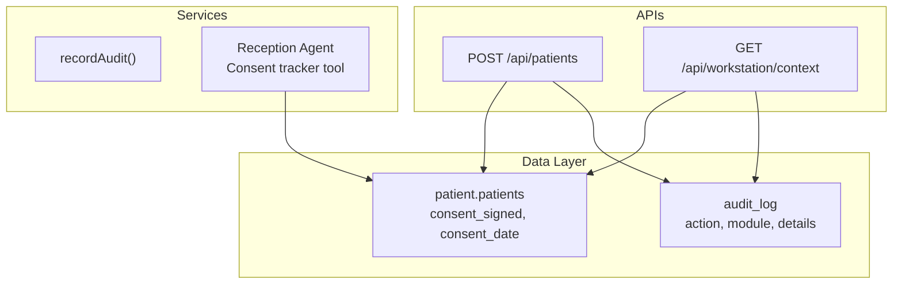

**Diagram sources**
- [init-schemas.sql:22-37](file://docker/postgres/init-schemas.sql#L22-L37)
- [schema.ts:18-36](file://src/db/schema.ts#L18-L36)
- [route.ts (patients):1-37](file://src/app/api/patients/route.ts#L1-L37)
- [route.ts (workstation context):100-131](file://src/app/api/workstation/context/route.ts#L100-L131)
- [audit.ts:1-25](file://src/lib/audit.ts#L1-L25)
- [agents.ts:46-51](file://src/lib/agents.ts#L46-L51)

**Section sources**
- [init-schemas.sql:22-37](file://docker/postgres/init-schemas.sql#L22-L37)
- [schema.ts:18-36](file://src/db/schema.ts#L18-L36)
- [route.ts (patients):1-37](file://src/app/api/patients/route.ts#L1-L37)
- [route.ts (workstation context):100-131](file://src/app/api/workstation/context/route.ts#L100-L131)
- [audit.ts:1-25](file://src/lib/audit.ts#L1-L25)
- [agents.ts:46-51](file://src/lib/agents.ts#L46-L51)

## Core Components
- Patient consent model:
  - Boolean field indicating whether consent has been signed.
  - Timestamp field recording when consent was captured.
  - These are defined in both the Drizzle schema and the PostgreSQL initialization script.
- Consent visibility:
  - The workstation context endpoint includes a concise consent status line in the patient history panel.
- Audit trail:
  - A generic audit logger writes structured entries with user, action, module, entity type/id, and details.
- Reception agent:
  - Declares “Consent tracker” as one of its tools and mentions managing consent forms and capturing patient history.

**Section sources**
- [schema.ts:18-36](file://src/db/schema.ts#L18-L36)
- [init-schemas.sql:22-37](file://docker/postgres/init-schemas.sql#L22-L37)
- [route.ts (workstation context):100-131](file://src/app/api/workstation/context/route.ts#L100-L131)
- [audit.ts:1-25](file://src/lib/audit.ts#L1-L25)
- [agents.ts:46-51](file://src/lib/agents.ts#L46-L51)

## Architecture Overview
The consent lifecycle spans registration, storage, display, and auditing:
- Registration creates or updates a patient record with consent flags.
- Display surfaces consent status in the radiology workstation context.
- Auditing captures consent-related actions for compliance.
- Agents coordinate consent tasks alongside identity and eligibility checks.

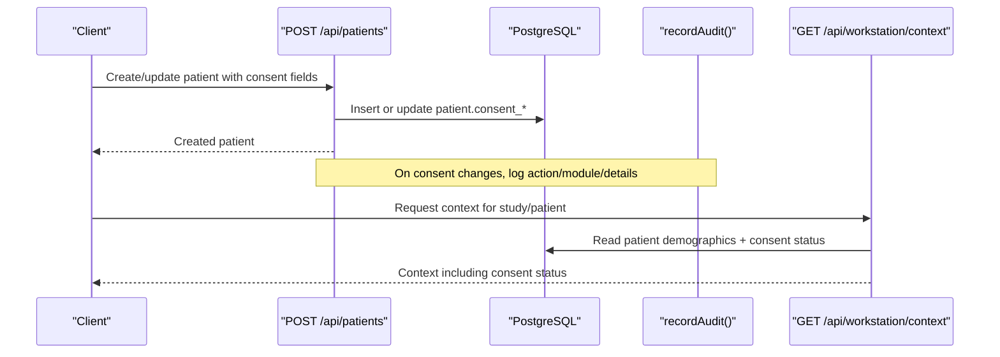

**Diagram sources**
- [route.ts (patients):28-36](file://src/app/api/patients/route.ts#L28-L36)
- [schema.ts:18-36](file://src/db/schema.ts#L18-L36)
- [route.ts (workstation context):100-131](file://src/app/api/workstation/context/route.ts#L100-L131)
- [audit.ts:1-25](file://src/lib/audit.ts#L1-L25)

## Detailed Component Analysis

### Consent Data Model
- Fields:
  - consent_signed: boolean defaulting to false.
  - consent_date: timestamp for when consent was recorded.
- Storage:
  - Defined in Drizzle ORM schema and initialized in PostgreSQL via migration script.
- Implications:
  - Simple binary consent state; timestamps enable expiry logic at query time or via scheduled jobs.

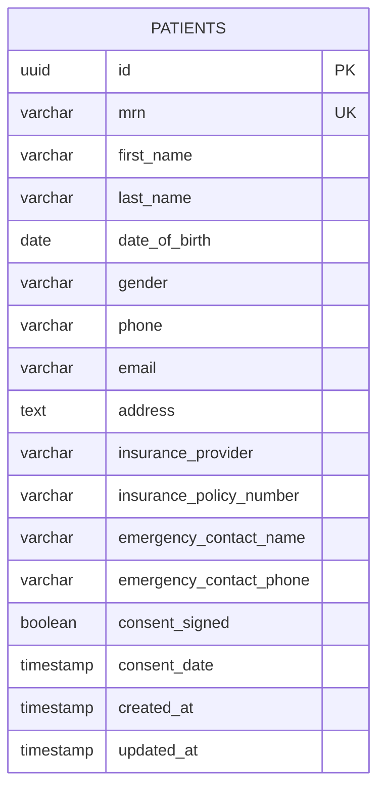

**Diagram sources**
- [schema.ts:18-36](file://src/db/schema.ts#L18-L36)
- [init-schemas.sql:22-37](file://docker/postgres/init-schemas.sql#L22-L37)

**Section sources**
- [schema.ts:18-36](file://src/db/schema.ts#L18-L36)
- [init-schemas.sql:22-37](file://docker/postgres/init-schemas.sql#L22-L37)

### Consent Collection and Update
- Endpoints:
  - POST /api/patients accepts patient payloads including consent fields.
  - Backend also exposes a Python route for patient registration that persists consent fields.
- Behavior:
  - Creates a new patient record with consent_signed and optional consent_date.
  - Returns created resource on success.

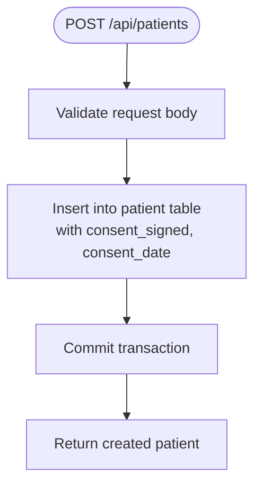

**Diagram sources**
- [route.ts (patients):28-36](file://src/app/api/patients/route.ts#L28-L36)
- [main.py (backend patients):32-60](file://backend/app/main.py#L32-L60)

**Section sources**
- [route.ts (patients):28-36](file://src/app/api/patients/route.ts#L28-L36)
- [main.py (backend patients):32-60](file://backend/app/main.py#L32-L60)

### Consent Verification in Workstation
- The workstation context endpoint reads the patient’s consent status and includes it in the history panel shown to clinicians.
- This ensures radiographers and radiologists can verify consent before proceeding with imaging.

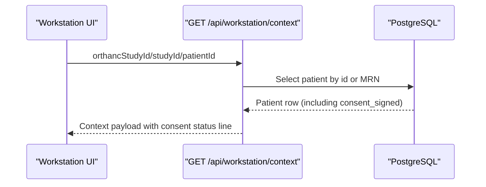

**Diagram sources**
- [route.ts (workstation context):100-131](file://src/app/api/workstation/context/route.ts#L100-L131)

**Section sources**
- [route.ts (workstation context):100-131](file://src/app/api/workstation/context/route.ts#L100-L131)

### Audit Trail for Consent Actions
- The audit utility provides a consistent way to record consent-related actions with user, module, entity identifiers, and details.
- Recommended usage:
  - Log consent capture, updates, revocations, and overrides with appropriate module tags and details.

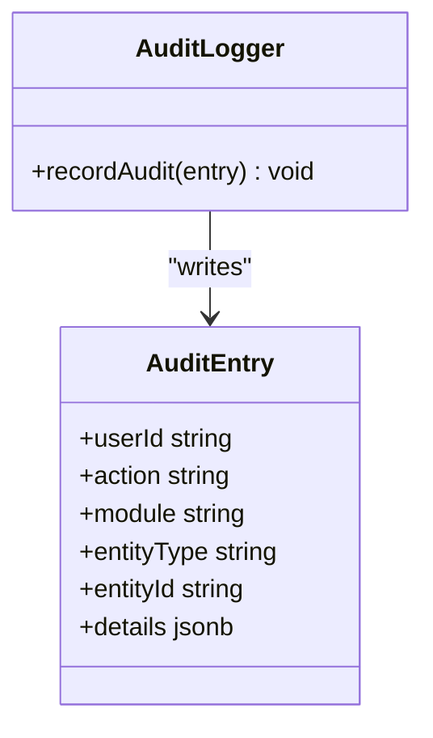

**Diagram sources**
- [audit.ts:1-25](file://src/lib/audit.ts#L1-L25)

**Section sources**
- [audit.ts:1-25](file://src/lib/audit.ts#L1-L25)

### Consent Workflow: From Collection to Renewal
- Collection:
  - Capture consent during patient registration or reception check-in.
  - Persist consent_signed and consent_date via patient creation/update.
- Verification:
  - Workstation context displays consent status to ensure compliance before imaging.
- Renewal:
  - When consent expires (based on policy), prompt renewal during scheduling or check-in.
  - Update consent fields and log the renewal event.

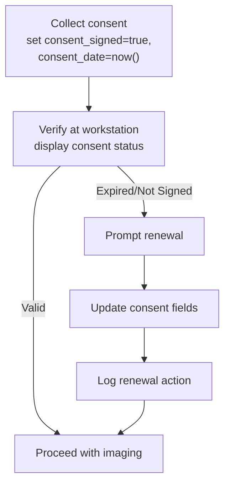

[No sources needed since this diagram shows conceptual workflow, not actual code structure]

### Consent Expiration Handling
- Current model:
  - Stores consent_date but no explicit expiration field.
- Recommended approach:
  - Implement an expiration policy (e.g., per procedure or regulatory requirement).
  - Add a computed view or service function to determine if consent is valid based on consent_date and policy.
  - Surface expiry warnings in scheduling and workstation context.

[No sources needed since this section provides general guidance]

### Consent Types
- The current implementation uses a single boolean flag for consent.
- To support multiple consent types (e.g., general treatment, imaging-specific, contrast administration), extend the model:
  - Add a dedicated consent records table with fields for consent_type, scope, effective_date, expiry_date, and status.
  - Link consent records to patients and studies.
  - Enforce required consents per procedure at scheduling and workstation context.

[No sources needed since this section proposes enhancements beyond current code]

### State Transitions and Decision Engine Integration
- While consent itself is a simple flag, broader operational decisions flow through the decision engine with states such as proposed, validated, approved, rejected, executed, failed.
- This pattern can be extended to govern consent lifecycle events where human approval is required (e.g., overriding consent requirements in emergencies).

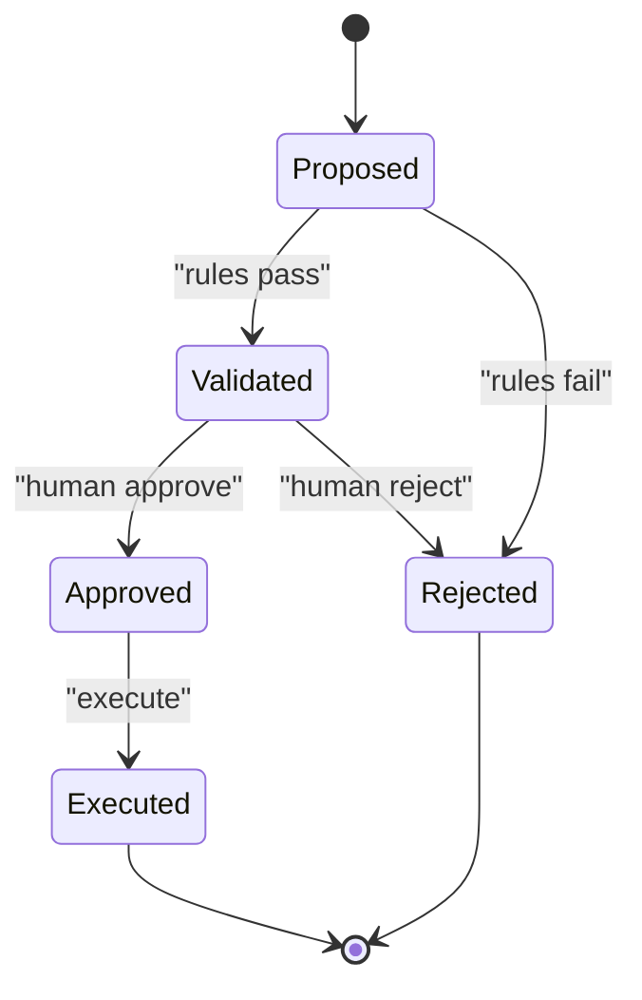

**Diagram sources**
- [decision-engine.ts:86-112](file://src/lib/decision-engine.ts#L86-L112)
- [route.ts (decisions):1-44](file://src/app/api/decisions/[id]/route.ts#L1-L44)

**Section sources**
- [decision-engine.ts:86-112](file://src/lib/decision-engine.ts#L86-L112)
- [route.ts (decisions):1-44](file://src/app/api/decisions/[id]/route.ts#L1-L44)

### Emergency Consent Override
- Scenario:
  - Life-threatening situation requires immediate imaging without prior consent.
- Implementation guidance:
  - Use the decision engine to propose an emergency override with strict rules (e.g., only allowed in specific contexts).
  - Require human approval and detailed rationale.
  - Record comprehensive audit entries with user, reason, and references.
  - After stabilization, obtain retroactive consent and update records accordingly.

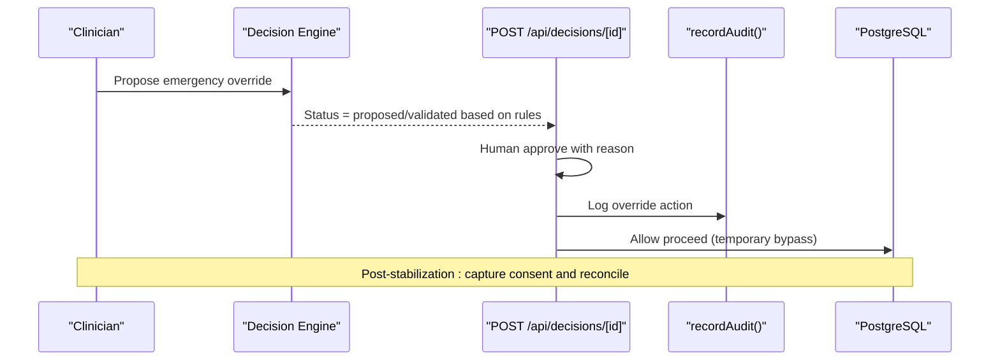

**Diagram sources**
- [route.ts (decisions):1-44](file://src/app/api/decisions/[id]/route.ts#L1-L44)
- [decision-engine.ts:86-112](file://src/lib/decision-engine.ts#L86-L112)
- [audit.ts:1-25](file://src/lib/audit.ts#L1-L25)

**Section sources**
- [route.ts (decisions):1-44](file://src/app/api/decisions/[id]/route.ts#L1-L44)
- [decision-engine.ts:86-112](file://src/lib/decision-engine.ts#L86-L112)
- [audit.ts:1-25](file://src/lib/audit.ts#L1-L25)

### Consent Revocation Procedures
- Scenario:
  - Patient revokes consent after initial agreement.
- Implementation guidance:
  - Provide an API to update consent_signed=false and record revocation details.
  - Immediately block subsequent imaging until renewed consent is obtained.
  - Log revocation with full details for audit and compliance.
  - Notify relevant teams (reception, scheduling, radiology) via events or notifications.

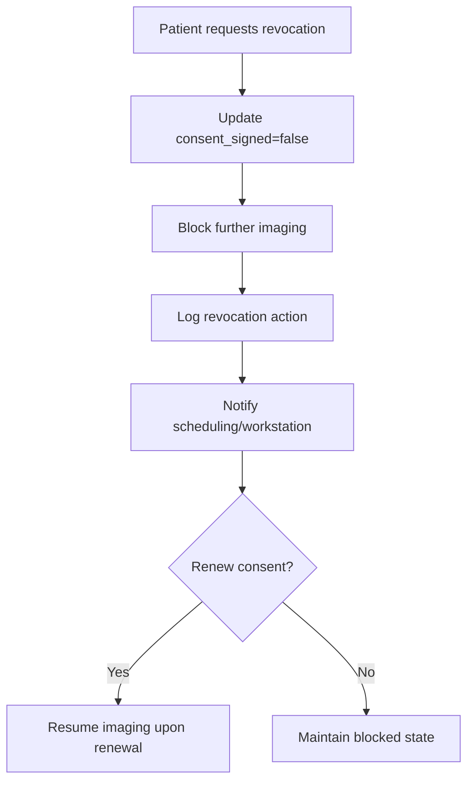

[No sources needed since this diagram shows conceptual workflow, not actual code structure]

## Dependency Analysis
- Patient consent depends on:
  - Database schema for storing consent fields.
  - API routes for creating/updating patient records.
  - Workstation context for displaying consent status.
  - Audit logging for compliance.
  - Agents for coordinating consent tasks during reception.

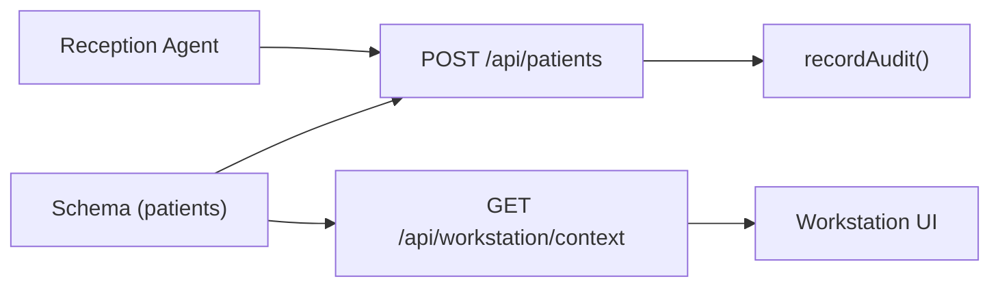

**Diagram sources**
- [schema.ts:18-36](file://src/db/schema.ts#L18-L36)
- [route.ts (patients):28-36](file://src/app/api/patients/route.ts#L28-L36)
- [route.ts (workstation context):100-131](file://src/app/api/workstation/context/route.ts#L100-L131)
- [audit.ts:1-25](file://src/lib/audit.ts#L1-L25)
- [agents.ts:46-51](file://src/lib/agents.ts#L46-L51)

**Section sources**
- [schema.ts:18-36](file://src/db/schema.ts#L18-L36)
- [route.ts (patients):28-36](file://src/app/api/patients/route.ts#L28-L36)
- [route.ts (workstation context):100-131](file://src/app/api/workstation/context/route.ts#L100-L131)
- [audit.ts:1-25](file://src/lib/audit.ts#L1-L25)
- [agents.ts:46-51](file://src/lib/agents.ts#L46-L51)

## Performance Considerations
- Keep consent queries lightweight:
  - Index patient.mrn and patient.id for fast lookups in workstation context.
- Avoid blocking UI:
  - Fetch consent status asynchronously in the workstation context.
- Audit writes:
  - Ensure audit logging does not delay critical paths; consider async writes if necessary.

[No sources needed since this section provides general guidance]

## Troubleshooting Guide
- Consent not visible in workstation:
  - Verify patient record exists and consent fields are populated.
  - Check workstation context endpoint response for consent status line.
- Audit logs missing:
  - Confirm audit logger is invoked for consent actions.
  - Inspect database for audit_log entries with matching module/action.
- Unexpected behavior in decision flows:
  - Review decision engine rule results and statuses.
  - Validate approvals and executions via the decisions API.

**Section sources**
- [route.ts (workstation context):100-131](file://src/app/api/workstation/context/route.ts#L100-L131)
- [audit.ts:1-25](file://src/lib/audit.ts#L1-L25)
- [decision-engine.ts:86-112](file://src/lib/decision-engine.ts#L86-L112)
- [route.ts (decisions):1-44](file://src/app/api/decisions/[id]/route.ts#L1-L44)

## Conclusion
The platform currently implements a straightforward consent model tied to the patient record, with visibility in the workstation context and audit logging for compliance. Extending the model to support multiple consent types, explicit expiration policies, and robust revocation workflows will strengthen legal compliance and operational safety. Leveraging the decision engine for high-risk actions like emergency overrides ensures governance and traceability.