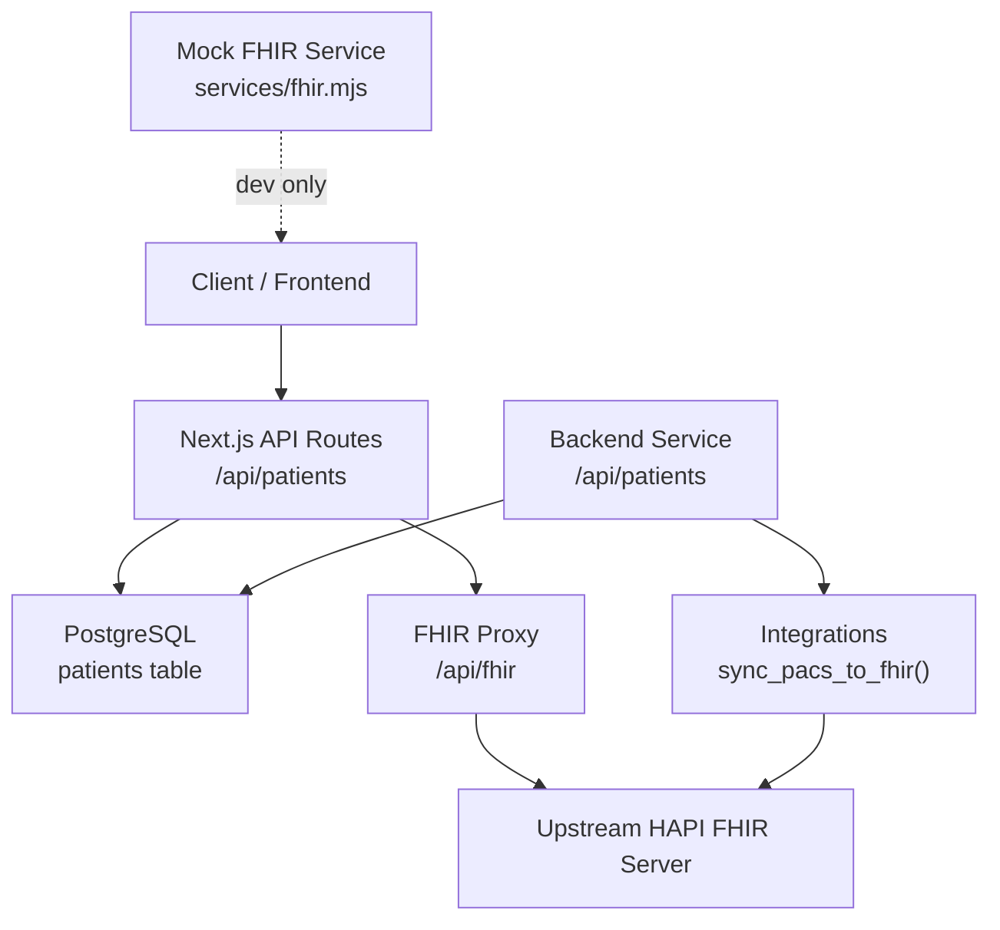
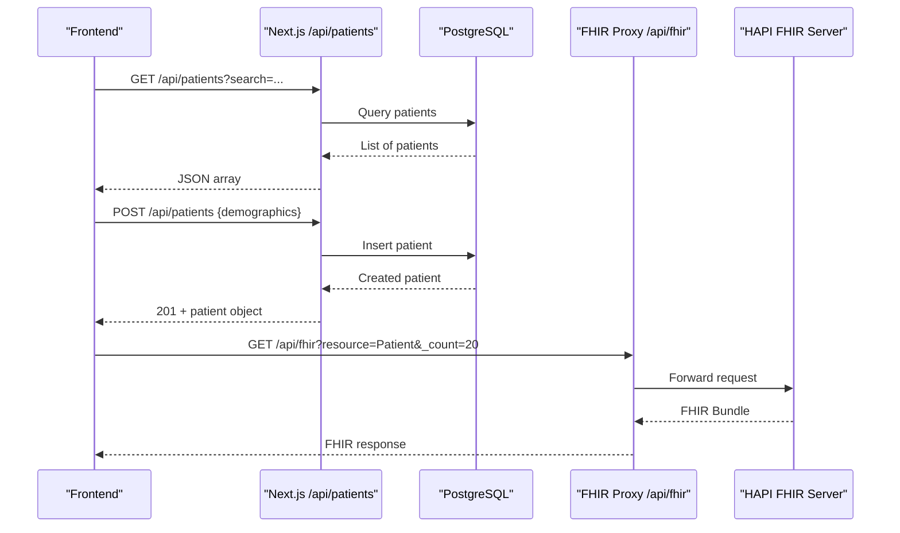
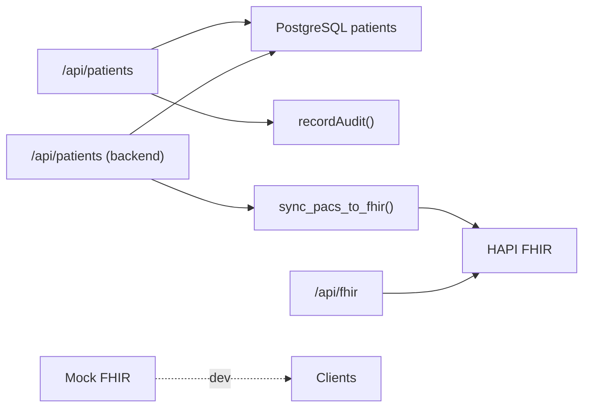

# Demographics Management

<cite>
**Referenced Files in This Document**
- [src/app/api/patients/route.ts](file://src/app/api/patients/route.ts)
- [src/db/schema.ts](file://src/db/schema.ts)
- [drizzle/0000_redundant_the_twelve.sql](file://drizzle/0000_redundant_the_twelve.sql)
- [docker/postgres/init-schemas.sql](file://docker/postgres/init-schemas.sql)
- [backend/app/main.py](file://backend/app/main.py)
- [backend/app/core/integrations.py](file://backend/app/core/integrations.py)
- [src/app/api/fhir/route.ts](file://src/app/api/fhir/route.ts)
- [services/fhir.mjs](file://services/fhir.mjs)
- [src/lib/audit.ts](file://src/lib/audit.ts)
- [README.md](file://README.md)
</cite>

## Table of Contents
1. Introduction
2. Project Structure
3. Core Components
4. Architecture Overview
5. Detailed Component Analysis
6. Dependency Analysis
7. Performance Considerations
8. Troubleshooting Guide
9. Conclusion

## Introduction
This document explains how patient demographics are managed in the platform, including data fields, validation rules, business logic for updates, API usage examples, FHIR integration for synchronization, privacy considerations, and audit logging. It is intended for developers and administrators who need to understand or extend demographic management capabilities.

## Project Structure
Demographic data is persisted in PostgreSQL with a dedicated patients table and accessed via Next.js API routes. A backend service also exposes endpoints for registration and integrates with external systems (e.g., PACS/FHIR). The platform proxies FHIR requests to an upstream server and includes a local mock FHIR service for development. Audit logging captures system events and changes.

**Diagram sources**
- [src/app/api/patients/route.ts:1-37](file://src/app/api/patients/route.ts#L1-L37)
- [src/app/api/fhir/route.ts:1-38](file://src/app/api/fhir/route.ts#L1-L38)
- [backend/app/main.py:29-60](file://backend/app/main.py#L29-L60)
- [backend/app/core/integrations.py:60-83](file://backend/app/core/integrations.py#L60-L83)
- [services/fhir.mjs:1-55](file://services/fhir.mjs#L1-L55)

**Section sources**
- [src/app/api/patients/route.ts:1-37](file://src/app/api/patients/route.ts#L1-L37)
- [src/db/schema.ts:17-36](file://src/db/schema.ts#L17-L36)
- [drizzle/0000_redundant_the_twelve.sql:267-286](file://drizzle/0000_redundant_the_twelve.sql#L267-L286)
- [docker/postgres/init-schemas.sql:22-37](file://docker/postgres/init-schemas.sql#L22-L37)
- [backend/app/main.py:29-60](file://backend/app/main.py#L29-L60)
- [src/app/api/fhir/route.ts:1-38](file://src/app/api/fhir/route.ts#L1-L38)
- [services/fhir.mjs:1-55](file://services/fhir.mjs#L1-L55)

## Core Components
- Patient demographics schema defines all demographic fields and constraints.
- Next.js API route provides GET (list/search) and POST (create) operations for patients.
- Backend service provides a registration endpoint that writes to the database.
- FHIR proxy forwards read/search/create operations to an upstream FHIR server; a mock FHIR service is available locally for development.
- Audit logging utility records actions for compliance and traceability.

Key responsibilities:
- Data persistence and integrity enforced by schema and database constraints.
- Search and retrieval via API with optional filtering.
- Creation flows through API routes and/or backend service.
- External synchronization via FHIR proxy and integrations module.
- Auditing of significant actions.

**Section sources**
- [src/db/schema.ts:17-36](file://src/db/schema.ts#L17-L36)
- [src/app/api/patients/route.ts:1-37](file://src/app/api/patients/route.ts#L1-L37)
- [backend/app/main.py:29-60](file://backend/app/main.py#L29-L60)
- [src/app/api/fhir/route.ts:1-38](file://src/app/api/fhir/route.ts#L1-L38)
- [services/fhir.mjs:1-55](file://services/fhir.mjs#L1-L55)
- [src/lib/audit.ts:1-25](file://src/lib/audit.ts#L1-L25)

## Architecture Overview
The platform supports two primary entry points for demographic management:
- Next.js API at /api/patients for list and create operations.
- Backend service at /api/patients for registration.

External synchronization uses:
- FHIR proxy at /api/fhir to forward requests to an upstream HAPI FHIR server.
- A local mock FHIR service for development scenarios.
- Backend integration code that can create/update FHIR resources when imaging studies are processed.

**Diagram sources**
- [src/app/api/patients/route.ts:6-36](file://src/app/api/patients/route.ts#L6-L36)
- [src/app/api/fhir/route.ts:6-38](file://src/app/api/fhir/route.ts#L6-L38)

## Detailed Component Analysis

### Demographics Data Model
The patients table stores core demographic information and related attributes. Fields include identifiers, name components, date of birth, gender, contact details, address, insurance information, emergency contacts, consent status, lifecycle status, and timestamps. Constraints enforce uniqueness for MRN and required fields such as name components, DOB, and gender.

Recommended field formats and validation rules:
- MRN: unique identifier string, up to 20 characters.
- First name / Last name: required strings, up to 100 characters each.
- Date of birth: date type, required.
- Gender: short text, required; ensure consistent values from client-side selection.
- Phone: optional, up to 30 characters; consider normalization on input.
- Email: optional, up to 255 characters; validate format before submission.
- Address: optional free-form text; consider structured fields if needed later.
- Insurance provider / policy number: optional, bounded lengths.
- Emergency contact name / phone: optional, bounded lengths.
- Consent signed: boolean flag indicating consent capture.
- Status: default active; used for record lifecycle.
- Timestamps: created_at and updated_at managed by defaults.

These constraints and types are defined in the schema and SQL migrations.

**Section sources**
- [src/db/schema.ts:17-36](file://src/db/schema.ts#L17-L36)
- [drizzle/0000_redundant_the_twelve.sql:267-286](file://drizzle/0000_redundant_the_twelve.sql#L267-L286)
- [docker/postgres/init-schemas.sql:22-37](file://docker/postgres/init-schemas.sql#L22-L37)

### API Endpoints for Demographics

- GET /api/patients
  - Purpose: Retrieve patients with optional search across first name, last name, and MRN.
  - Behavior: Builds dynamic conditions using case-insensitive matching; returns ordered results by creation time.
  - Error handling: Returns a 500 error JSON payload on failure.

- POST /api/patients
  - Purpose: Create a new patient record.
  - Behavior: Accepts a JSON body mapping to the patients schema; inserts and returns the created record.
  - Error handling: Returns a 500 error JSON payload on failure.

Example usage patterns:
- List all patients: GET /api/patients
- Search by name or MRN: GET /api/patients?search=John%20Doe
- Create a patient: POST /api/patients with a JSON body containing required fields (e.g., mrn, firstName, lastName, dateOfBirth, gender).

Note: Update and delete operations are not implemented in this route; they can be added following the same pattern.

**Section sources**
- [src/app/api/patients/route.ts:6-36](file://src/app/api/patients/route.ts#L6-L36)

### Backend Registration Endpoint
- POST /api/patients (backend service)
  - Purpose: Register a new patient into the database.
  - Behavior: Generates a UUID, inserts demographic fields, commits transaction, and returns success message with ID.
  - Error handling: Rolls back on exception and returns a 400 error with details.

This endpoint complements the Next.js route and may be used by other services or integrations.

**Section sources**
- [backend/app/main.py:29-60](file://backend/app/main.py#L29-L60)

### FHIR Integration for Demographic Synchronization
- FHIR Proxy: GET /api/fhir
  - Purpose: Proxies FHIR R4 requests to an upstream HAPI FHIR server configured via environment variables.
  - Behavior: Forwards query parameters except resource; validates resource path; sets appropriate headers; returns upstream response or errors.
  - Configuration: Requires FHIR_URL; otherwise returns 503.

- Mock FHIR Service: services/fhir.mjs
  - Purpose: Local development FHIR server supporting metadata, read, search-type, and create interactions for Patient and other resources.
  - Behavior: In-memory storage with versioning metadata; serves Bundles for searches.

Integration notes:
- Use the proxy to interact with production FHIR servers.
- During development, start the mock service to test FHIR workflows without external dependencies.
- Backend integration code demonstrates creating FHIR resources (e.g., ImagingStudy) tied to a patient reference.

**Section sources**
- [src/app/api/fhir/route.ts:1-38](file://src/app/api/fhir/route.ts#L1-L38)
- [services/fhir.mjs:1-55](file://services/fhir.mjs#L1-L55)
- [backend/app/core/integrations.py:60-83](file://backend/app/core/integrations.py#L60-L83)
- [README.md:66-89](file://README.md#L66-L89)

### Business Logic for Demographic Updates
Current implementation focuses on listing and creating patients. Recommended enhancements:
- Add PATCH/PUT endpoints to update demographic fields with validation and conflict resolution.
- Enforce business rules such as:
  - Require consent_signed to be true before enabling certain workflows.
  - Prevent duplicate MRNs beyond the existing unique constraint.
  - Validate email format and phone number format on the server side.
- Integrate audit logging for all write operations to track who changed what and when.

**Section sources**
- [src/db/schema.ts:17-36](file://src/db/schema.ts#L17-L36)
- [src/app/api/patients/route.ts:28-36](file://src/app/api/patients/route.ts#L28-L36)

### Data Privacy Considerations
- Access control: Ensure only authorized roles can view or modify demographic data. Implement middleware to enforce role-based access on API routes.
- Data minimization: Only expose necessary fields in responses.
- Encryption: Use TLS for all API traffic; encrypt sensitive fields at rest if required by policy.
- Consent tracking: Respect consent flags and restrict processing accordingly.
- Audit trail: Log access and modifications to support compliance and investigations.

[No sources needed since this section provides general guidance]

### Audit Logging for Demographic Changes
- Audit utility: recordAudit writes entries to the audit_log table with user, action, module, entity type, entity id, and details.
- Usage: Call recordAudit after successful demographic operations (create, update, delete) to maintain a complete change history.
- Schema: audit_log includes fields for user_id, action, module, entity_type, entity_id, details, ip_address, and created_at.

Example actions to log:
- patient.create
- patient.update
- patient.delete
- patient.view (for sensitive reads)

**Section sources**
- [src/lib/audit.ts:1-25](file://src/lib/audit.ts#L1-L25)
- [src/db/schema.ts:182-193](file://src/db/schema.ts#L182-L193)
- [drizzle/0000_redundant_the_twelve.sql:63-73](file://drizzle/0000_redundant_the_twelve.sql#L63-L73)

## Dependency Analysis
The demographic management flow depends on:
- Database schema definitions for patients and audit_log.
- Next.js API routes for HTTP endpoints.
- Backend service for additional registration capability.
- FHIR proxy and optional mock service for interoperability.
- Audit utility for compliance logging.

**Diagram sources**
- [src/app/api/patients/route.ts:1-37](file://src/app/api/patients/route.ts#L1-L37)
- [backend/app/main.py:29-60](file://backend/app/main.py#L29-L60)
- [backend/app/core/integrations.py:60-83](file://backend/app/core/integrations.py#L60-L83)
- [src/app/api/fhir/route.ts:1-38](file://src/app/api/fhir/route.ts#L1-L38)
- [services/fhir.mjs:1-55](file://services/fhir.mjs#L1-L55)

**Section sources**
- [src/db/schema.ts:17-36](file://src/db/schema.ts#L17-L36)
- [src/db/schema.ts:182-193](file://src/db/schema.ts#L182-L193)
- [src/app/api/patients/route.ts:1-37](file://src/app/api/patients/route.ts#L1-L37)
- [backend/app/main.py:29-60](file://backend/app/main.py#L29-L60)
- [src/app/api/fhir/route.ts:1-38](file://src/app/api/fhir/route.ts#L1-L38)

## Performance Considerations
- Indexing: Ensure indexes on frequently searched columns like mrn, first_name, last_name to optimize queries.
- Pagination: Implement pagination for large patient lists to reduce payload size and improve responsiveness.
- Caching: Consider caching read-heavy endpoints if appropriate and safe for sensitive data.
- Connection pooling: Use efficient database connections and avoid N+1 queries.
- Timeouts: Configure timeouts for FHIR proxy calls to prevent hanging requests.

[No sources needed since this section provides general guidance]

## Troubleshooting Guide
Common issues and resolutions:
- FHIR proxy unreachable: Check FHIR_URL configuration; verify upstream server health; inspect error messages returned by the proxy.
- Duplicate MRN: Ensure unique MRN generation and validation before insertion.
- Validation failures: Validate email and phone formats on the client and server; return clear error messages.
- Audit logs missing: Confirm recordAudit is called for write operations; check database connectivity and permissions.

Operational checks:
- Health endpoints: Use /api/health or integration status endpoints to verify service connectivity.
- Logs: Review application logs for errors during API calls and database operations.

**Section sources**
- [src/app/api/fhir/route.ts:10-38](file://src/app/api/fhir/route.ts#L10-L38)
- [src/lib/audit.ts:12-24](file://src/lib/audit.ts#L12-L24)
- [README.md:66-89](file://README.md#L66-L89)

## Conclusion
The platform provides robust foundations for managing patient demographics through a well-defined schema, API endpoints for listing and creating patients, and integration pathways for FHIR synchronization. To fully support demographic updates, implement PATCH/DELETE endpoints with validation and audit logging. Adopt privacy best practices and performance optimizations to ensure secure, scalable operations. The provided diagrams and references map directly to the codebase, enabling precise implementation and extension.