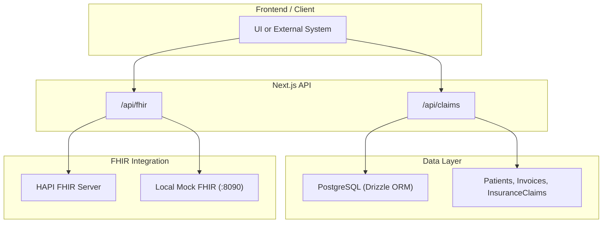
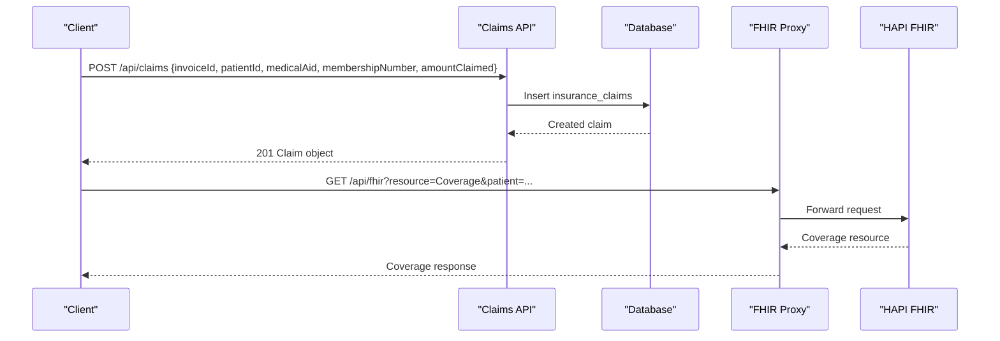
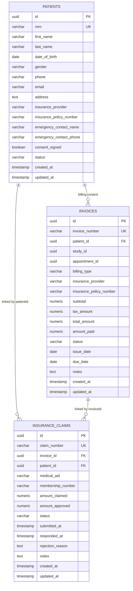
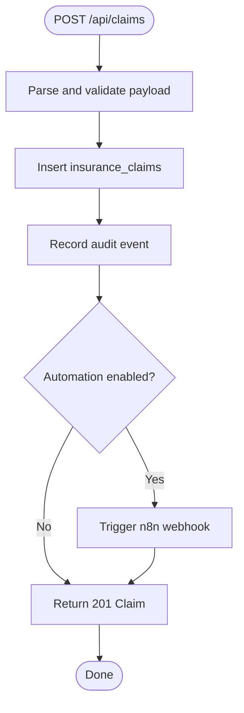
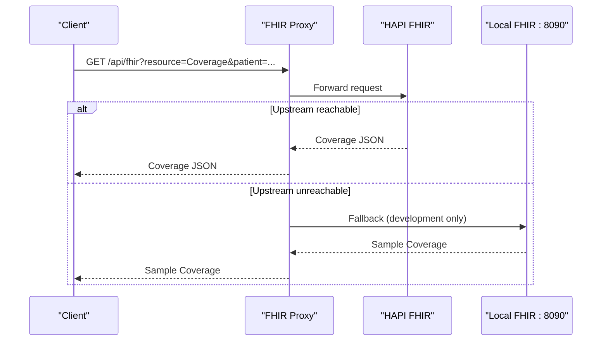
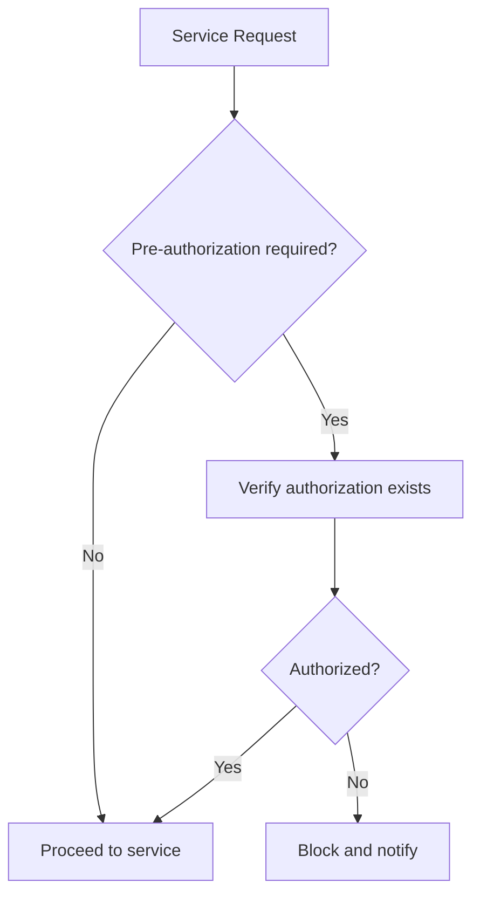
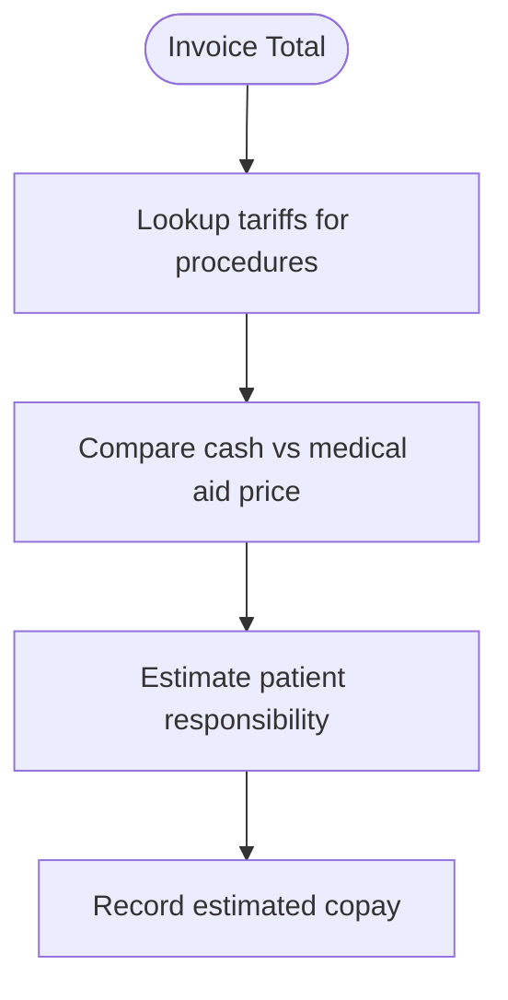
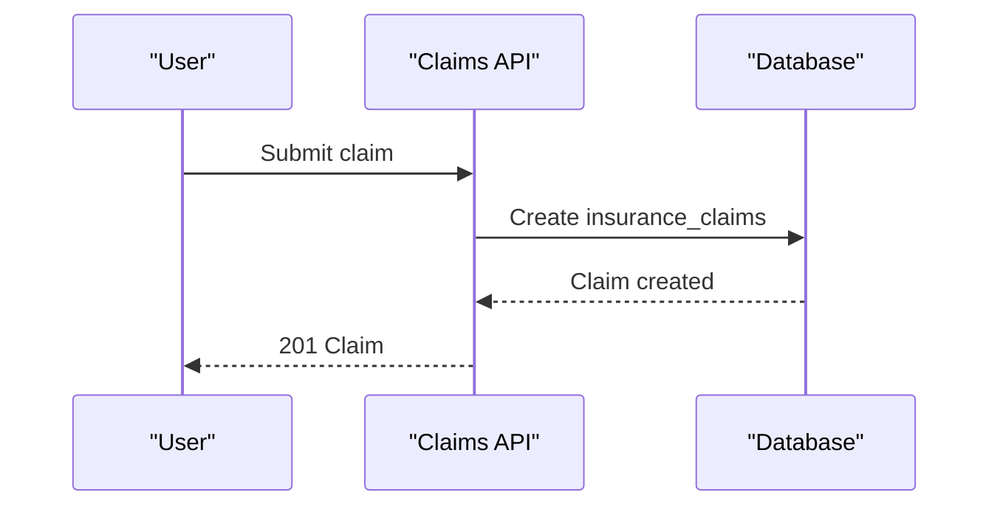
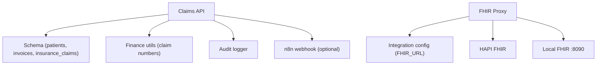

# Insurance Verification

<cite>
**Referenced Files in This Document**
- [schema.ts](file://src/db/schema.ts)
- [route.ts (claims)](file://src/app/api/claims/route.ts)
- [route.ts (fhir proxy)](file://src/app/api/fhir/route.ts)
- [fhir.mjs (local FHIR server)](file://services/fhir.mjs)
- [agents.ts](file://src/lib/agents.ts)
- [finance.ts](file://src/lib/finance.ts)
- [seed route.ts](file://src/app/api/seed/route.ts)
</cite>

## Table of Contents
1. [Introduction](#introduction)
2. [Project Structure](#project-structure)
3. [Core Components](#core-components)
4. [Architecture Overview](#architecture-overview)
5. [Detailed Component Analysis](#detailed-component-analysis)
6. [Dependency Analysis](#dependency-analysis)
7. [Performance Considerations](#performance-considerations)
8. [Troubleshooting Guide](#troubleshooting-guide)
9. [Conclusion](#conclusion)
10. [Appendices](#appendices)

## Introduction
This document explains the insurance verification functionality implemented in the platform. It covers how insurance provider data is stored, how claims are created and tracked, and how eligibility checks integrate with FHIR for real-time coverage validation. It also outlines common insurance scenarios such as pre-authorization handling, copay estimation via tariff pricing, and claim preparation workflows.

## Project Structure
Insurance-related logic spans database schemas, API routes, and integration points:
- Data model: patient and invoice fields store provider and policy identifiers; a dedicated claims table tracks submissions and outcomes.
- Claims API: endpoints to list and submit insurance claims, with audit logging and optional automation triggers.
- FHIR integration: a Next.js route proxies queries to an external HAPI FHIR server; a local mock FHIR server is included for development.
- Agent orchestration: the Reception agent references eligibility checks via HAPI FHIR Coverage when connected.

**Diagram sources**
- [route.ts (claims):1-83](file://src/app/api/claims/route.ts#L1-L83)
- [route.ts (fhir proxy):1-39](file://src/app/api/fhir/route.ts#L1-L39)
- [fhir.mjs (local FHIR server):1-55](file://services/fhir.mjs#L1-L55)
- [schema.ts:18-36](file://src/db/schema.ts#L18-L36)
- [schema.ts:209-271](file://src/db/schema.ts#L209-L271)

**Section sources**
- [schema.ts:18-36](file://src/db/schema.ts#L18-L36)
- [schema.ts:209-271](file://src/db/schema.ts#L209-L271)
- [route.ts (claims):1-83](file://src/app/api/claims/route.ts#L1-L83)
- [route.ts (fhir proxy):1-39](file://src/app/api/fhir/route.ts#L1-L39)
- [fhir.mjs (local FHIR server):1-55](file://services/fhir.mjs#L1-L55)

## Core Components
- Insurance data model:
  - Patient record includes insurance provider and policy number fields.
  - Invoice records include insurance provider and policy number fields for billing context.
  - Insurance claims table stores claim lifecycle, amounts, and responses.
- Claims API:
  - GET lists claims with joined invoice and patient details.
  - POST creates a new claim, assigns a generated claim number, sets initial status, and emits audit events.
- FHIR proxy:
  - Forwards resource requests to configured HAPI FHIR endpoint.
  - Returns capability statement and supports read/search/create on supported resources.
- Local FHIR server:
  - Provides sample resources including Coverage for development testing.
- Agent guidance:
  - Reception agent indicates eligibility checks via HAPI FHIR Coverage when connected.

**Section sources**
- [schema.ts:18-36](file://src/db/schema.ts#L18-L36)
- [schema.ts:209-271](file://src/db/schema.ts#L209-L271)
- [route.ts (claims):1-83](file://src/app/api/claims/route.ts#L1-L83)
- [route.ts (fhir proxy):1-39](file://src/app/api/fhir/route.ts#L1-L39)
- [fhir.mjs (local FHIR server):1-55](file://services/fhir.mjs#L1-L55)
- [agents.ts:41-56](file://src/lib/agents.ts#L41-L56)

## Architecture Overview
The system integrates insurance verification through two primary paths:
- Internal claims processing: create and track claims against invoices and patients.
- Real-time eligibility via FHIR: proxy requests to HAPI FHIR to retrieve Coverage and related resources.

**Diagram sources**
- [route.ts (claims):38-83](file://src/app/api/claims/route.ts#L38-L83)
- [route.ts (fhir proxy):10-38](file://src/app/api/fhir/route.ts#L10-L38)
- [fhir.mjs (local FHIR server):23-54](file://services/fhir.mjs#L23-L54)

## Detailed Component Analysis

### Insurance Data Model
- Patient entity:
  - Stores insuranceProvider and insurancePolicyNumber for identity and plan linkage.
- Invoice entity:
  - Stores insuranceProvider and insurancePolicyNumber at billing time; links to patient and study/appointment.
- InsuranceClaims entity:
  - Tracks claimNumber, invoiceId, patientId, medicalAid, membershipNumber, amounts claimed and approved, status, timestamps, and rejection reasons.

**Diagram sources**
- [schema.ts:18-36](file://src/db/schema.ts#L18-L36)
- [schema.ts:209-271](file://src/db/schema.ts#L209-L271)

**Section sources**
- [schema.ts:18-36](file://src/db/schema.ts#L18-L36)
- [schema.ts:209-271](file://src/db/schema.ts#L209-L271)

### Claims Submission Workflow
- The POST endpoint accepts claim inputs, generates a unique claim number, persists the claim, logs an audit event, and optionally triggers an automation webhook.
- The GET endpoint returns claims with enriched invoice and patient information.

**Diagram sources**
- [route.ts (claims):38-83](file://src/app/api/claims/route.ts#L38-L83)
- [finance.ts:17-22](file://src/lib/finance.ts#L17-L22)

**Section sources**
- [route.ts (claims):1-83](file://src/app/api/claims/route.ts#L1-L83)
- [finance.ts:17-22](file://src/lib/finance.ts#L17-L22)

### FHIR Eligibility Check Flow
- The FHIR proxy forwards requests to a configured HAPI FHIR server.
- A local mock FHIR server provides sample resources including Coverage for development.

**Diagram sources**
- [route.ts (fhir proxy):10-38](file://src/app/api/fhir/route.ts#L10-L38)
- [fhir.mjs (local FHIR server):23-54](file://services/fhir.mjs#L23-L54)

**Section sources**
- [route.ts (fhir proxy):1-39](file://src/app/api/fhir/route.ts#L1-L39)
- [fhir.mjs (local FHIR server):1-55](file://services/fhir.mjs#L1-L55)

### Pre-Authorization Handling
- Seed data demonstrates a rejected claim scenario where pre-authorization was not obtained.
- The claims workflow can be extended to enforce pre-authorization checks before submission based on policy rules.

[No sources needed since this diagram shows conceptual workflow, not actual code structure]

### Copay Calculation Approach
- Tariff records define cash and medical aid prices per procedure/modality.
- While explicit copay calculation logic is not present in the analyzed files, the presence of both cash and medical aid pricing enables deriving patient responsibility by comparing invoice totals with approved claim amounts.

[No sources needed since this diagram shows conceptual workflow, not actual code structure]

### Claim Preparation and Submission
- Claims are prepared by linking invoices and patients, setting medical aid and membership numbers, and recording amounts claimed.
- Status transitions and responses are captured for analytics and reporting.

**Diagram sources**
- [route.ts (claims):38-83](file://src/app/api/claims/route.ts#L38-L83)

**Section sources**
- [route.ts (claims):1-83](file://src/app/api/claims/route.ts#L1-L83)
- [seed route.ts:338-344](file://src/app/api/seed/route.ts#L338-L344)

## Dependency Analysis
- Claims API depends on:
  - Database schema for patients, invoices, and insurance claims.
  - Finance utilities for generating claim numbers.
  - Audit logging for compliance.
  - Optional automation via n8n webhook.
- FHIR proxy depends on:
  - Integration configuration for HAPI FHIR URL.
  - Timed fetch utility for timeouts and error handling.
  - Local mock FHIR server for development.

**Diagram sources**
- [route.ts (claims):1-83](file://src/app/api/claims/route.ts#L1-L83)
- [route.ts (fhir proxy):1-39](file://src/app/api/fhir/route.ts#L1-L39)
- [fhir.mjs (local FHIR server):1-55](file://services/fhir.mjs#L1-L55)
- [finance.ts:17-22](file://src/lib/finance.ts#L17-L22)

**Section sources**
- [route.ts (claims):1-83](file://src/app/api/claims/route.ts#L1-L83)
- [route.ts (fhir proxy):1-39](file://src/app/api/fhir/route.ts#L1-L39)
- [finance.ts:17-22](file://src/lib/finance.ts#L17-L22)
- [fhir.mjs (local FHIR server):1-55](file://services/fhir.mjs#L1-L55)

## Performance Considerations
- Use pagination and filtering on FHIR queries to reduce payload sizes.
- Implement caching for frequently accessed Coverage resources if latency is critical.
- Ensure timeouts and retries are tuned for upstream FHIR responsiveness.
- Batch claim submissions where possible to reduce database load.

[No sources needed since this section provides general guidance]

## Troubleshooting Guide
- FHIR connectivity issues:
  - If HAPI FHIR is not configured, the proxy returns a 503 with a descriptive error.
  - Unreachable upstream results in a 502 with error details.
- Claims submission errors:
  - Validation failures or database errors return 500 with error messages.
  - Automation webhook failures are best-effort and do not block claim creation.
- Common scenarios:
  - Rejected claims may include rejectionReason indicating missing pre-authorization.

**Section sources**
- [route.ts (fhir proxy):10-38](file://src/app/api/fhir/route.ts#L10-L38)
- [route.ts (claims):38-83](file://src/app/api/claims/route.ts#L38-L83)
- [seed route.ts:338-344](file://src/app/api/seed/route.ts#L338-L344)

## Conclusion
The platform implements a robust foundation for insurance verification and claims management:
- Clear data models for provider and policy information.
- Claims lifecycle tracking with auditability.
- FHIR-based eligibility checks via a configurable proxy and a local mock server for development.
- Extensible workflows for pre-authorization and copay estimation using existing tariff structures.

[No sources needed since this section summarizes without analyzing specific files]

## Appendices

### Example API Calls
- Submit a claim:
  - Method: POST
  - Endpoint: /api/claims
  - Body fields: invoiceId, patientId, medicalAid, membershipNumber, amountClaimed, notes
  - Response: 201 with created claim object
- List claims:
  - Method: GET
  - Endpoint: /api/claims
  - Response: Array of claims with invoice and patient details
- FHIR eligibility check:
  - Method: GET
  - Endpoint: /api/fhir?resource=Coverage&patient=<patientId>
  - Response: Coverage resource from HAPI FHIR or local mock

[No sources needed since this section provides usage examples without quoting code]