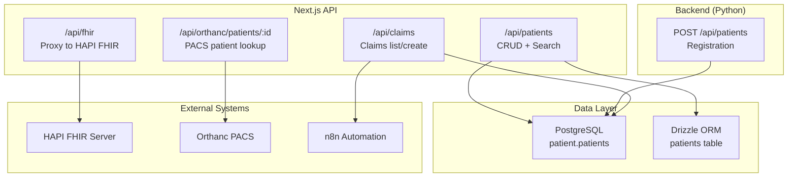
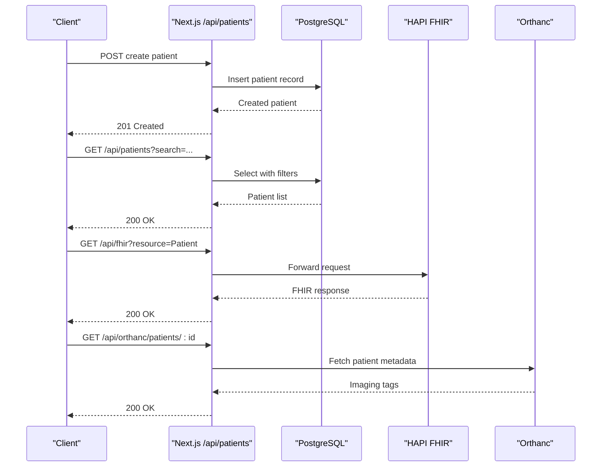
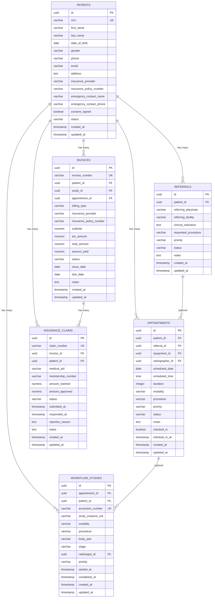
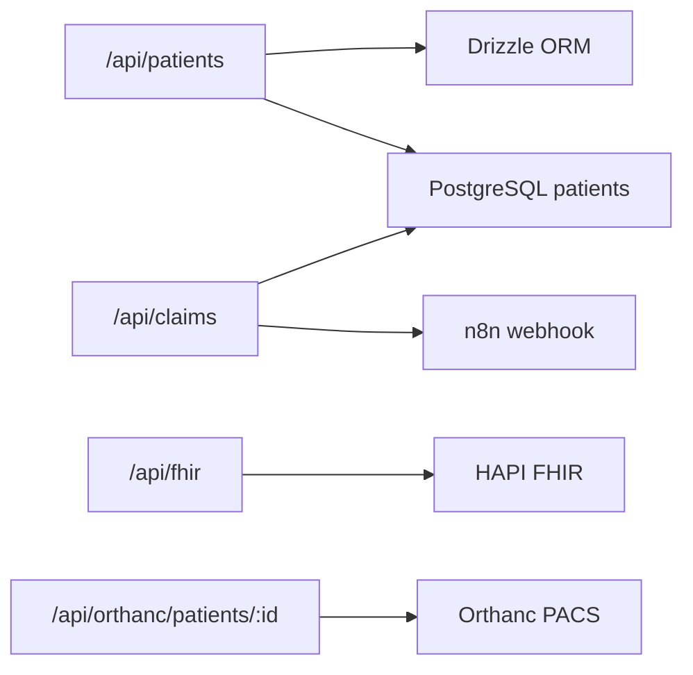

# Patient Management

<cite>
**Referenced Files in This Document**
- [schema.ts](file://src/db/schema.ts)
- [route.ts (patients)](file://src/app/api/patients/route.ts)
- [init-schemas.sql](file://docker/postgres/init-schemas.sql)
- [main.py (backend patients)](file://backend/app/main.py)
- [integrations.py](file://backend/app/core/integrations.py)
- [route.ts (FHIR proxy)](file://src/app/api/fhir/route.ts)
- [route.ts (Orthanc patient by id)](file://src/app/api/orthanc/patients/[id]/route.ts)
- [route.ts (claims)](file://src/app/api/claims/route.ts)
- [agents.ts](file://src/lib/agents.ts)
</cite>

## Table of Contents
1. Introduction
2. Project Structure
3. Core Components
4. Architecture Overview
5. Detailed Component Analysis
6. Dependency Analysis
7. Performance Considerations
8. Troubleshooting Guide
9. Conclusion
10. Appendices

## Introduction
This document explains the patient management functionality in the platform, covering patient registration, demographics management, consent tracking, and insurance verification processes. It documents the patient data model, entity relationships, validation rules, API endpoints for CRUD and search, and integration points with external systems such as FHIR and PACS. Practical examples from the codebase illustrate the patient lifecycle, including emergency registration patterns, duplicate detection strategies, and privacy compliance considerations.

## Project Structure
Patient-related capabilities are implemented across:
- Database schema definitions and migrations
- Next.js API routes for patient CRUD and search
- A Python backend route for patient registration
- Integration modules for FHIR proxy and PACS (Orthanc)
- Claims and finance endpoints that reference patients
- Agent orchestration describing reception workflows and responsibilities

**Diagram sources**
- [route.ts (patients):1-37](file://src/app/api/patients/route.ts#L1-L37)
- [main.py (backend patients):29-60](file://backend/app/main.py#L29-L60)
- [route.ts (FHIR proxy):1-38](file://src/app/api/fhir/route.ts#L1-L38)
- [route.ts (Orthanc patient by id):40-63](file://src/app/api/orthanc/patients/[id]/route.ts#L40-L63)
- [route.ts (claims):1-83](file://src/app/api/claims/route.ts#L1-L83)
- [schema.ts:17-36](file://src/db/schema.ts#L17-L36)
- [init-schemas.sql:22-37](file://docker/postgres/init-schemas.sql#L22-L37)

**Section sources**
- [route.ts (patients):1-37](file://src/app/api/patients/route.ts#L1-L37)
- [schema.ts:17-36](file://src/db/schema.ts#L17-L36)
- [init-schemas.sql:22-37](file://docker/postgres/init-schemas.sql#L22-L37)

## Core Components
- Patient registry: Drizzle ORM model and PostgreSQL table define core fields, constraints, and timestamps.
- Registration APIs:
  - Next.js POST /api/patients creates a patient record via Drizzle.
  - Python POST /api/patients inserts into the patient schema using raw SQL.
- Search: GET /api/patients supports filtering by first name, last name, and MRN with case-insensitive matching.
- Consent tracking: Boolean flag indicates signed consent; additional timestamped consent field exists in the legacy schema.
- Insurance verification: Fields store provider and policy number; claims module references these for billing and automation.
- External integrations:
  - FHIR proxy forwards resource queries to HAPI FHIR for interoperability.
  - Orthanc patient lookup returns imaging metadata for a patient.
  - n8n webhooks triggered on claim submission for automation.

**Section sources**
- [schema.ts:17-36](file://src/db/schema.ts#L17-L36)
- [route.ts (patients):1-37](file://src/app/api/patients/route.ts#L1-L37)
- [main.py (backend patients):29-60](file://backend/app/main.py#L29-L60)
- [route.ts (claims):1-83](file://src/app/api/claims/route.ts#L1-L83)
- [route.ts (FHIR proxy):1-38](file://src/app/api/fhir/route.ts#L1-L38)
- [route.ts (Orthanc patient by id):40-63](file://src/app/api/orthanc/patients/[id]/route.ts#L40-L63)

## Architecture Overview
The system exposes REST endpoints for patient operations and integrates with external clinical systems:
- Patient CRUD/search is handled by Next.js API routes backed by Drizzle ORM and PostgreSQL.
- A Python service provides an alternative registration endpoint writing directly to the patient schema.
- FHIR proxy enables standard FHIR queries through the application boundary.
- PACS integration allows retrieving imaging-related patient attributes.
- Finance and claims subsystems link to patients for billing and insurance processing.

**Diagram sources**
- [route.ts (patients):1-37](file://src/app/api/patients/route.ts#L1-L37)
- [route.ts (FHIR proxy):1-38](file://src/app/api/fhir/route.ts#L1-L38)
- [route.ts (Orthanc patient by id):40-63](file://src/app/api/orthanc/patients/[id]/route.ts#L40-L63)

## Detailed Component Analysis

### Patient Data Model and Relationships
The patient entity includes identifiers, demographics, contact details, insurance information, consent status, and lifecycle timestamps. Related entities include referrals, appointments, workflow studies, invoices, payments, and insurance claims.

**Diagram sources**
- [schema.ts:17-36](file://src/db/schema.ts#L17-L36)
- [schema.ts:38-50](file://src/db/schema.ts#L38-L50)
- [schema.ts:82-100](file://src/db/schema.ts#L82-L100)
- [schema.ts:102-119](file://src/db/schema.ts#L102-L119)
- [schema.ts:209-228](file://src/db/schema.ts#L209-L228)
- [schema.ts:255-271](file://src/db/schema.ts#L255-L271)

**Section sources**
- [schema.ts:17-36](file://src/db/schema.ts#L17-L36)
- [schema.ts:38-50](file://src/db/schema.ts#L38-L50)
- [schema.ts:82-100](file://src/db/schema.ts#L82-L100)
- [schema.ts:102-119](file://src/db/schema.ts#L102-L119)
- [schema.ts:209-228](file://src/db/schema.ts#L209-L228)
- [schema.ts:255-271](file://src/db/schema.ts#L255-L271)

### Patient Registration and Demographics Management
- Next.js POST /api/patients accepts a JSON payload and inserts a new patient record, returning the created entity.
- Python POST /api/patients performs a direct insert into the patient schema with explicit field mapping and error handling.
- Demographics fields include names, date of birth, gender, phone, email, and address. Status defaults to active with audit timestamps.

Validation and constraints:
- Unique MRN ensures identity uniqueness at the database level.
- Required fields enforced by notNull constraints.
- Optional insurance and emergency contact fields allow flexible intake.

Example usage paths:
- Create patient via Next.js: [route.ts (patients):28-36](file://src/app/api/patients/route.ts#L28-L36)
- Create patient via Python: [main.py (backend patients):32-60](file://backend/app/main.py#L32-L60)

**Section sources**
- [route.ts (patients):28-36](file://src/app/api/patients/route.ts#L28-L36)
- [main.py (backend patients):32-60](file://backend/app/main.py#L32-L60)
- [schema.ts:17-36](file://src/db/schema.ts#L17-L36)

### Consent Tracking
- Boolean consent_signed indicates whether consent has been recorded.
- Legacy schema includes consent_date for timestamping consent events.
- Reception agent responsibilities include managing consent forms and capturing patient history.

Operational guidance:
- Ensure consent is captured before scheduling or performing procedures.
- Track consent changes via updates to the consent flag and optional timestamp.

**Section sources**
- [schema.ts:17-36](file://src/db/schema.ts#L17-L36)
- [init-schemas.sql:22-37](file://docker/postgres/init-schemas.sql#L22-L37)
- [agents.ts:41-56](file://src/lib/agents.ts#L41-L56)

### Insurance Verification and Claims Processing
- Patient records store insurance provider and policy number for eligibility checks and billing.
- Claims module lists and creates insurance claims, linking invoices and patients, and triggers automation via n8n.
- Finance analytics aggregate claim statuses and amounts.

Workflow highlights:
- Submitting a claim generates a unique claim number, persists the record, audits the action, and fires an n8n webhook.
- Claim listing joins invoices and patients to provide context.

**Section sources**
- [schema.ts:255-271](file://src/db/schema.ts#L255-L271)
- [route.ts (claims):1-83](file://src/app/api/claims/route.ts#L1-L83)

### FHIR Integration
- The FHIR proxy forwards resource queries to HAPI FHIR, preserving query parameters and content types.
- Backend integration utilities can create/update FHIR resources (e.g., ImagingStudy) when imaging data is ingested.

Usage:
- GET /api/fhir?resource=Patient retrieves patient resources from HAPI FHIR.
- Backend sync function posts ImagingStudy payloads to FHIR upon successful DICOM retrieval.

**Section sources**
- [route.ts (FHIR proxy):1-38](file://src/app/api/fhir/route.ts#L1-L38)
- [integrations.py:60-83](file://backend/app/core/integrations.py#L60-L83)

### PACS Integration (Orthanc)
- Endpoint retrieves patient metadata from Orthanc, including DICOM tags like name, ID, birth date, sex, age, and study count.
- Useful for cross-referencing imaging records with patient demographics.

**Section sources**
- [route.ts (Orthanc patient by id):40-63](file://src/app/api/orthanc/patients/[id]/route.ts#L40-L63)

### Patient Lifecycle Examples
- Emergency registration: Accept minimal required fields (names, DOB, gender), set consent_signed appropriately, and proceed to triage/scheduling. Use unique MRN generation to avoid duplicates.
- Duplicate detection: Enforce unique MRN at the database level; implement pre-insert checks against existing names/DOB if needed.
- Scheduling and workflow: After registration, create referrals and appointments linked to the patient; track studies and reports associated with the patient.

Concrete code references:
- Registration endpoints: [route.ts (patients):28-36](file://src/app/api/patients/route.ts#L28-L36), [main.py (backend patients):32-60](file://backend/app/main.py#L32-L60)
- Referrals and appointments seeding demonstrate linkage: [seed route:116-138](file://src/app/api/seed/route.ts#L116-L138)

**Section sources**
- [route.ts (patients):28-36](file://src/app/api/patients/route.ts#L28-L36)
- [main.py (backend patients):32-60](file://backend/app/main.py#L32-L60)
- [schema.ts:17-36](file://src/db/schema.ts#L17-L36)

## Dependency Analysis
Key dependencies and coupling:
- Next.js patient routes depend on Drizzle ORM and the patients table.
- Claims route depends on insurance claims, invoices, and patients tables, plus audit logging and n8n webhook.
- FHIR proxy depends on environment configuration for HAPI FHIR URL.
- Orthanc patient lookup depends on PACS availability.

**Diagram sources**
- [route.ts (patients):1-37](file://src/app/api/patients/route.ts#L1-L37)
- [route.ts (claims):1-83](file://src/app/api/claims/route.ts#L1-L83)
- [route.ts (FHIR proxy):1-38](file://src/app/api/fhir/route.ts#L1-L38)
- [route.ts (Orthanc patient by id):40-63](file://src/app/api/orthanc/patients/[id]/route.ts#L40-L63)

**Section sources**
- [route.ts (patients):1-37](file://src/app/api/patients/route.ts#L1-L37)
- [route.ts (claims):1-83](file://src/app/api/claims/route.ts#L1-L83)
- [route.ts (FHIR proxy):1-38](file://src/app/api/fhir/route.ts#L1-L38)
- [route.ts (Orthanc patient by id):40-63](file://src/app/api/orthanc/patients/[id]/route.ts#L40-L63)

## Performance Considerations
- Indexing: Ensure indexes on frequently searched fields (e.g., firstName, lastName, mrn) to optimize search performance.
- Pagination: Implement pagination for large patient lists to reduce payload size and improve responsiveness.
- Connection pooling: Configure database connection pools appropriately for concurrent requests.
- External calls: Add timeouts and retries for FHIR and PACS calls to prevent blocking.

[No sources needed since this section provides general guidance]

## Troubleshooting Guide
Common issues and resolutions:
- Registration failures: Check database constraints (unique MRN, notNull fields) and transaction rollback behavior.
- Search errors: Validate query parameters and ensure proper escaping for case-insensitive searches.
- FHIR unavailability: Verify FHIR_URL configuration and network connectivity; handle 503/502 responses gracefully.
- PACS unreachable: Confirm Orthanc URL and health; return appropriate error codes when upstream is down.
- Claims submission: Ensure required fields (invoiceId, patientId, medicalAid, amountClaimed) are present; check n8n webhook reachability.

**Section sources**
- [route.ts (patients):23-35](file://src/app/api/patients/route.ts#L23-L35)
- [route.ts (FHIR proxy):10-38](file://src/app/api/fhir/route.ts#L10-L38)
- [route.ts (Orthanc patient by id):40-63](file://src/app/api/orthanc/patients/[id]/route.ts#L40-L63)
- [route.ts (claims):38-83](file://src/app/api/claims/route.ts#L38-L83)

## Conclusion
The patient management subsystem provides robust registration, search, and integration capabilities aligned with clinical workflows. The data model enforces integrity through constraints and relationships, while APIs expose clear interfaces for CRUD and search. Integrations with FHIR and PACS enable interoperability and richer patient context. Claims processing links patient data to finance and automation pipelines. Following best practices for validation, indexing, and error handling will enhance reliability and performance.

[No sources needed since this section summarizes without analyzing specific files]

## Appendices

### API Endpoints Summary
- POST /api/patients: Create a new patient record.
- GET /api/patients?search=:term: List patients with optional filtering by name or MRN.
- GET /api/fhir?resource=Patient: Proxy to HAPI FHIR for patient resources.
- GET /api/orthanc/patients/:id: Retrieve patient metadata from PACS.
- GET /api/claims: List insurance claims with patient and invoice context.
- POST /api/claims: Submit a new insurance claim and trigger automation.

**Section sources**
- [route.ts (patients):1-37](file://src/app/api/patients/route.ts#L1-L37)
- [route.ts (FHIR proxy):1-38](file://src/app/api/fhir/route.ts#L1-L38)
- [route.ts (Orthanc patient by id):40-63](file://src/app/api/orthanc/patients/[id]/route.ts#L40-L63)
- [route.ts (claims):1-83](file://src/app/api/claims/route.ts#L1-L83)

### Privacy and Compliance Notes
- Audit logging: Actions such as claim submission are audited for traceability.
- Data minimization: Collect only necessary fields during registration; use optional fields for non-essential data.
- Access control: Integrate with authentication (e.g., Keycloak) to restrict sensitive operations.

**Section sources**
- [route.ts (claims):55-61](file://src/app/api/claims/route.ts#L55-L61)
- [integrations.py:37-58](file://backend/app/core/integrations.py#L37-L58)