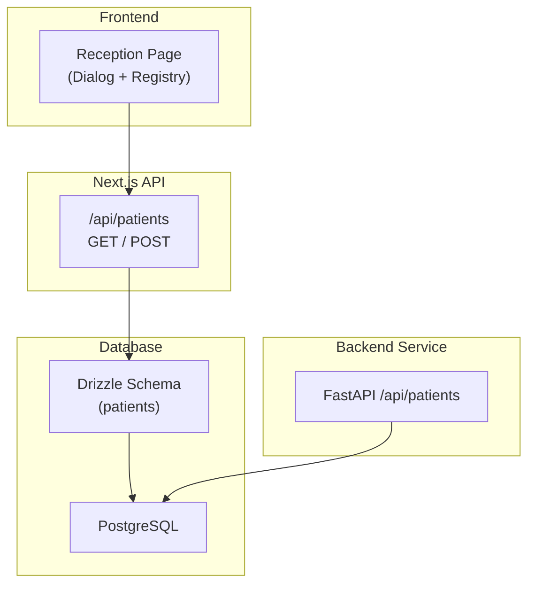
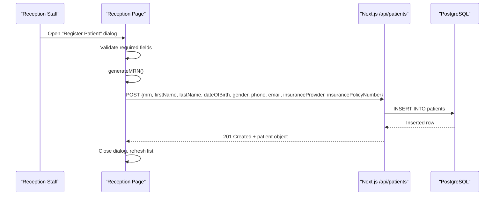
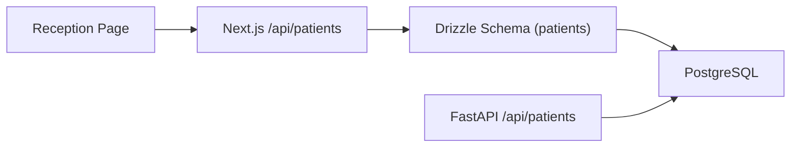

# Patient Registration

<cite>
**Referenced Files in This Document**
- [src/app/api/patients/route.ts](file://src/app/api/patients/route.ts)
- [src/app/reception/page.tsx](file://src/app/reception/page.tsx)
- [src/db/schema.ts](file://src/db/schema.ts)
- [src/lib/utils.ts](file://src/lib/utils.ts)
- [docker/postgres/init-schemas.sql](file://docker/postgres/init-schemas.sql)
- [backend/app/main.py](file://backend/app/main.py)
- [src/app/api/auth/login/route.ts](file://src/app/api/auth/login/route.ts)
</cite>

## Table of Contents
1. [Introduction](#introduction)
2. [Project Structure](#project-structure)
3. [Core Components](#core-components)
4. [Architecture Overview](#architecture-overview)
5. [Detailed Component Analysis](#detailed-component-analysis)
6. [Dependency Analysis](#dependency-analysis)
7. [Performance Considerations](#performance-considerations)
8. [Troubleshooting Guide](#troubleshooting-guide)
9. [Conclusion](#conclusion)
10. [Appendices](#appendices)

## Introduction
This document explains the patient registration functionality across the reception interface, API endpoints, and data model. It covers:
- The end-to-end workflow from form capture to persistence
- Validation rules enforced by the UI and database schema
- MRN generation logic
- Data model fields for demographics, contact, insurance, and consent
- Example API calls for creating patients
- Error handling behavior
- Duplicate detection mechanisms (current state)
- Emergency registration considerations
- Data privacy and compliance notes based on authentication and audit capabilities

## Project Structure
The patient registration feature spans:
- Frontend reception page with a registration dialog and patient registry view
- Next.js API route for listing and creating patients
- Drizzle ORM schema defining the patients table and constraints
- Utility functions for MRN generation
- Database initialization scripts that define an alternative patient schema
- A separate backend service exposing a FastAPI endpoint for patient registration

**Diagram sources**
- [src/app/reception/page.tsx:79-100](file://src/app/reception/page.tsx#L79-L100)
- [src/app/api/patients/route.ts:6-36](file://src/app/api/patients/route.ts#L6-L36)
- [src/db/schema.ts:17-36](file://src/db/schema.ts#L17-L36)
- [backend/app/main.py:32-70](file://backend/app/main.py#L32-L70)

**Section sources**
- [src/app/reception/page.tsx:1-344](file://src/app/reception/page.tsx#L1-L344)
- [src/app/api/patients/route.ts:1-37](file://src/app/api/patients/route.ts#L1-L37)
- [src/db/schema.ts:17-36](file://src/db/schema.ts#L17-L36)
- [backend/app/main.py:32-70](file://backend/app/main.py#L32-L70)

## Core Components
- Reception UI: Provides a modal form to capture patient details and triggers registration via the Next.js API.
- Next.js Patients API: Accepts GET (search/list) and POST (create) requests; inserts into the patients table using Drizzle.
- Drizzle Schema: Defines the patients table with required fields, unique MRN, timestamps, and status.
- Utilities: Generates MRNs and other helpers used by the UI.
- Backend FastAPI: Offers an alternate registration endpoint writing to a different patient schema.

Key responsibilities:
- Capture and validate input at the UI level
- Generate a unique MRN per new patient
- Persist data to the database
- Return appropriate success or error responses

**Section sources**
- [src/app/reception/page.tsx:79-100](file://src/app/reception/page.tsx#L79-L100)
- [src/app/api/patients/route.ts:28-36](file://src/app/api/patients/route.ts#L28-L36)
- [src/db/schema.ts:17-36](file://src/db/schema.ts#L17-L36)
- [src/lib/utils.ts:38-41](file://src/lib/utils.ts#L38-L41)
- [backend/app/main.py:32-70](file://backend/app/main.py#L32-L70)

## Architecture Overview
The registration flow integrates UI, API, and database layers. The reception dialog collects required fields, generates an MRN, and posts to the Next.js API which persists the record. A secondary backend service also exposes a registration endpoint for integration scenarios.

**Diagram sources**
- [src/app/reception/page.tsx:79-100](file://src/app/reception/page.tsx#L79-L100)
- [src/app/api/patients/route.ts:28-36](file://src/app/api/patients/route.ts#L28-L36)
- [src/lib/utils.ts:38-41](file://src/lib/utils.ts#L38-L41)

## Detailed Component Analysis

### Reception Interface and Form Handling
- Dialog-based registration form captures:
  - Required: first name, last name, date of birth, gender
  - Optional: phone, email, insurance provider, policy number
- On submit:
  - Builds a JSON payload including a generated MRN
  - Posts to /api/patients
  - Closes dialog and refreshes the patient list

Validation rules:
- HTML5 required attributes enforce presence of core fields
- Date picker enforces date format
- Select dropdown constrains gender values

Error handling:
- Network errors are caught silently in the UI fetch; no user-facing error toast is shown in this implementation
- Server-side errors return generic messages

Duplicate detection:
- No explicit duplicate check is performed before insert; uniqueness is enforced at the database level by the unique constraint on MRN

Emergency scenario support:
- The current form does not include emergency-specific fields or flags
- For emergencies, staff can register minimal required data and update later

Privacy and access:
- Authentication is configured via OIDC; login redirects to Keycloak when configured
- Authorization checks around the registration endpoint are not visible in the provided files

**Section sources**
- [src/app/reception/page.tsx:79-100](file://src/app/reception/page.tsx#L79-L100)
- [src/app/reception/page.tsx:131-173](file://src/app/reception/page.tsx#L131-L173)
- [src/app/api/auth/login/route.ts:7-30](file://src/app/api/auth/login/route.ts#L7-L30)

### Next.js Patients API
Capabilities:
- GET /api/patients: Lists patients with optional search by first name, last name, or MRN
- POST /api/patients: Creates a new patient record

Behavior:
- Uses Drizzle ORM to insert into the patients table
- Returns created patient on success (201)
- Returns a generic error response on failure (500)

Duplicate detection:
- Relies on database-level unique constraint on MRN to prevent duplicates
- If a duplicate MRN is submitted, the database will reject the insert and the API returns a server error

Example call:
- Method: POST
- Endpoint: /api/patients
- Body includes: mrn, firstName, lastName, dateOfBirth, gender, phone, email, insuranceProvider, insurancePolicyNumber

**Section sources**
- [src/app/api/patients/route.ts:6-36](file://src/app/api/patients/route.ts#L6-L36)

### Data Model: Patients
Fields captured and stored:
- Demographics:
  - id (UUID primary key)
  - mrn (unique identifier)
  - firstName, lastName
  - dateOfBirth
  - gender
- Contact:
  - phone
  - email
  - address
- Insurance:
  - insuranceProvider
  - insurancePolicyNumber
- Consent and status:
  - consentSigned (boolean)
  - status (default active)
- Timestamps:
  - createdAt
  - updatedAt

Constraints:
- mrn is unique and not null
- Core demographic fields are not null
- Status defaults to active
- Timestamps default to now

Alternative schema note:
- The Docker init script defines a separate patient.patients table with slightly different field names and types (e.g., dob vs date_of_birth, national_id). Ensure your deployment uses the intended schema consistently.

**Section sources**
- [src/db/schema.ts:17-36](file://src/db/schema.ts#L17-L36)
- [docker/postgres/init-schemas.sql:22-37](file://docker/postgres/init-schemas.sql#L22-L37)

### MRN Generation
- MRN is generated client-side using a utility function that creates a random numeric suffix and prefixes it with a fixed code
- The generated MRN is included in the registration payload sent to the API
- Uniqueness is enforced by the database unique constraint on mrn

Complexity:
- O(1) generation time
- Collision probability depends on the random range; database constraint prevents duplicates

**Section sources**
- [src/lib/utils.ts:38-41](file://src/lib/utils.ts#L38-L41)
- [src/db/schema.ts:17-36](file://src/db/schema.ts#L17-L36)

### Alternate Backend Registration Endpoint
A FastAPI service provides a registration endpoint that writes to a different patient schema:
- Endpoint: POST /api/patients
- Inserts into patient.patients with fields such as first_name, last_name, dob, gender, national_id, phone, email, insurance_provider, insurance_policy_number, consent_signed
- Returns a success message with the generated UUID on success
- Returns a 400 error with details on failure

Use cases:
- Integration with external systems that prefer the backend service over the Next.js API
- Separate environment deployments where the backend service is the source of truth

**Section sources**
- [backend/app/main.py:32-70](file://backend/app/main.py#L32-L70)
- [docker/postgres/init-schemas.sql:22-37](file://docker/postgres/init-schemas.sql#L22-L37)

## Dependency Analysis
- Reception Page depends on:
  - UI components (Card, Button, Input, Select, Tabs, Dialog)
  - Utility functions (generateMRN, formatDate)
  - Next.js API (/api/patients)
- Next.js Patients API depends on:
  - Drizzle ORM and the patients schema
  - PostgreSQL database
- Backend FastAPI depends on:
  - SQLAlchemy session and the patient.patients table

**Diagram sources**
- [src/app/reception/page.tsx:79-100](file://src/app/reception/page.tsx#L79-L100)
- [src/app/api/patients/route.ts:28-36](file://src/app/api/patients/route.ts#L28-L36)
- [src/db/schema.ts:17-36](file://src/db/schema.ts#L17-L36)
- [backend/app/main.py:32-70](file://backend/app/main.py#L32-L70)

**Section sources**
- [src/app/reception/page.tsx:1-344](file://src/app/reception/page.tsx#L1-L344)
- [src/app/api/patients/route.ts:1-37](file://src/app/api/patients/route.ts#L1-L37)
- [src/db/schema.ts:17-36](file://src/db/schema.ts#L17-L36)
- [backend/app/main.py:32-70](file://backend/app/main.py#L32-L70)

## Performance Considerations
- Client-side MRN generation avoids an extra round-trip but relies on DB uniqueness to prevent collisions
- Search queries use ILIKE patterns; consider indexing frequently searched columns (e.g., first_name, last_name, mrn) if datasets grow large
- Avoid unnecessary re-renders by memoizing fetch callbacks (already present)
- Batch operations are not implemented; keep payloads minimal

[No sources needed since this section provides general guidance]

## Troubleshooting Guide
Common issues and resolutions:
- Duplicate MRN error:
  - Cause: Attempting to create a patient with an existing MRN
  - Resolution: Allow the UI to detect the error response and prompt the user to retry or manually enter a different MRN
- Missing required fields:
  - Cause: Form validation prevents submission unless required fields are filled
  - Resolution: Ensure all required fields are completed before submitting
- Network failures:
  - Cause: API unreachable or server error
  - Resolution: Check network connectivity and server logs; the UI currently catches errors without showing feedback
- Schema mismatch between services:
  - Cause: Using Next.js API vs FastAPI endpoint with different schemas
  - Resolution: Align field names and ensure consistent database schema usage

**Section sources**
- [src/app/api/patients/route.ts:28-36](file://src/app/api/patients/route.ts#L28-L36)
- [backend/app/main.py:32-70](file://backend/app/main.py#L32-L70)
- [docker/postgres/init-schemas.sql:22-37](file://docker/postgres/init-schemas.sql#L22-L37)

## Conclusion
The patient registration system provides a straightforward reception workflow with client-side validation, MRN generation, and database-backed persistence. While basic duplication prevention exists via unique constraints, additional features like explicit duplicate checks, emergency registration fields, and robust error messaging can enhance usability and safety. Authentication is configured via OIDC, and audit logging exists in the broader platform, supporting compliance needs.

[No sources needed since this section summarizes without analyzing specific files]

## Appendices

### Example API Calls
- Create patient (Next.js):
  - Method: POST
  - Endpoint: /api/patients
  - Body fields: mrn, firstName, lastName, dateOfBirth, gender, phone, email, insuranceProvider, insurancePolicyNumber
  - Success: 201 with created patient object
  - Error: 500 with generic error message

- Create patient (FastAPI):
  - Method: POST
  - Endpoint: /api/patients
  - Body fields: first_name, last_name, dob, gender, national_id, phone, email, insurance_provider, insurance_policy_number, consent_signed
  - Success: 201 with id and message
  - Error: 400 with detail

**Section sources**
- [src/app/api/patients/route.ts:28-36](file://src/app/api/patients/route.ts#L28-L36)
- [backend/app/main.py:32-70](file://backend/app/main.py#L32-L70)

### Emergency Patient Registration Scenarios
- Current limitations:
  - No dedicated emergency flag or fields in the reception form
  - Minimal data capture may be necessary in urgent cases
- Recommended enhancements:
  - Add an emergency flag to prioritize scheduling and workflow
  - Include emergency contact fields already defined in the schema
  - Provide a streamlined “emergency” mode in the UI to capture only essential fields

**Section sources**
- [src/db/schema.ts:17-36](file://src/db/schema.ts#L17-L36)
- [src/app/reception/page.tsx:131-173](file://src/app/reception/page.tsx#L131-L173)

### Data Privacy and Compliance Notes
- Authentication:
  - OIDC-based login is configured; redirects to Keycloak when available
- Auditability:
  - Platform includes audit log tables and event logging capabilities
- Recommendations:
  - Enforce role-based access control on registration endpoints
  - Log all registration attempts with user context and IP addresses
  - Ensure encryption in transit and at rest for sensitive fields

**Section sources**
- [src/app/api/auth/login/route.ts:7-30](file://src/app/api/auth/login/route.ts#L7-L30)
- [docker/postgres/init-schemas.sql:11-20](file://docker/postgres/init-schemas.sql#L11-L20)