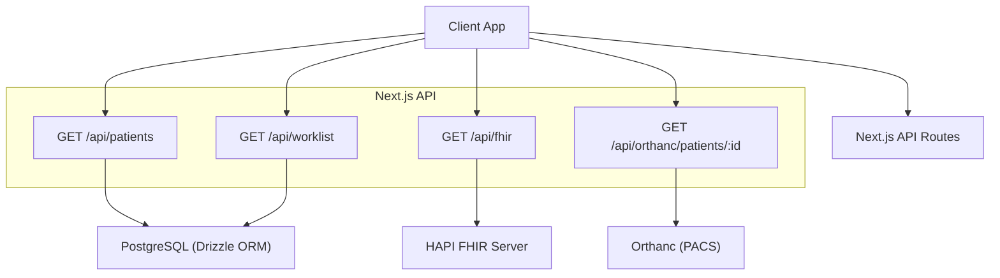
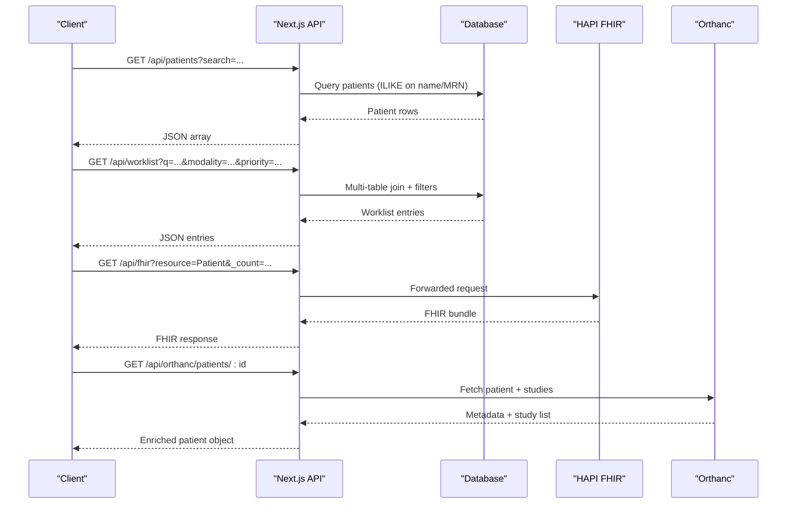
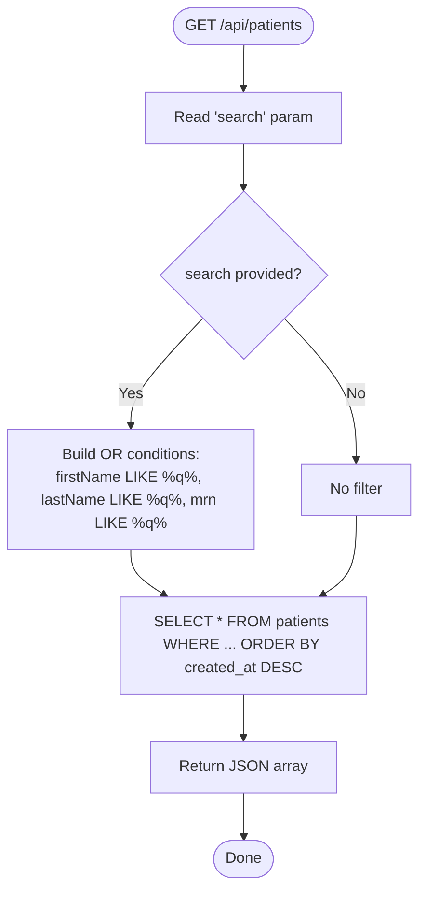
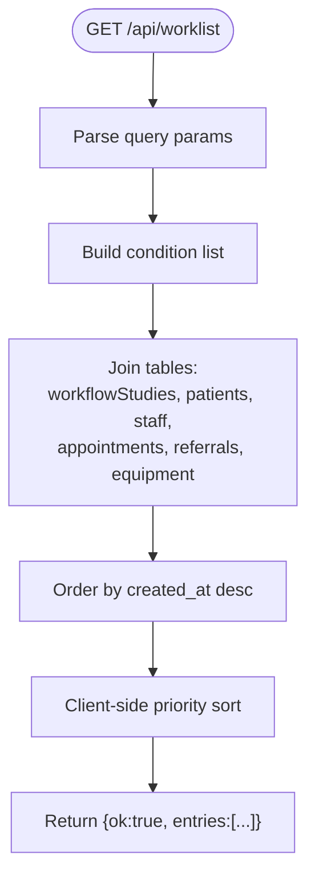
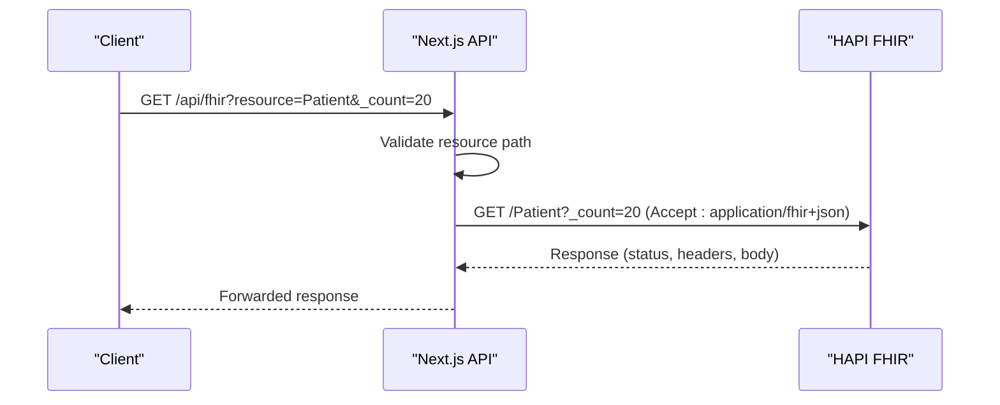
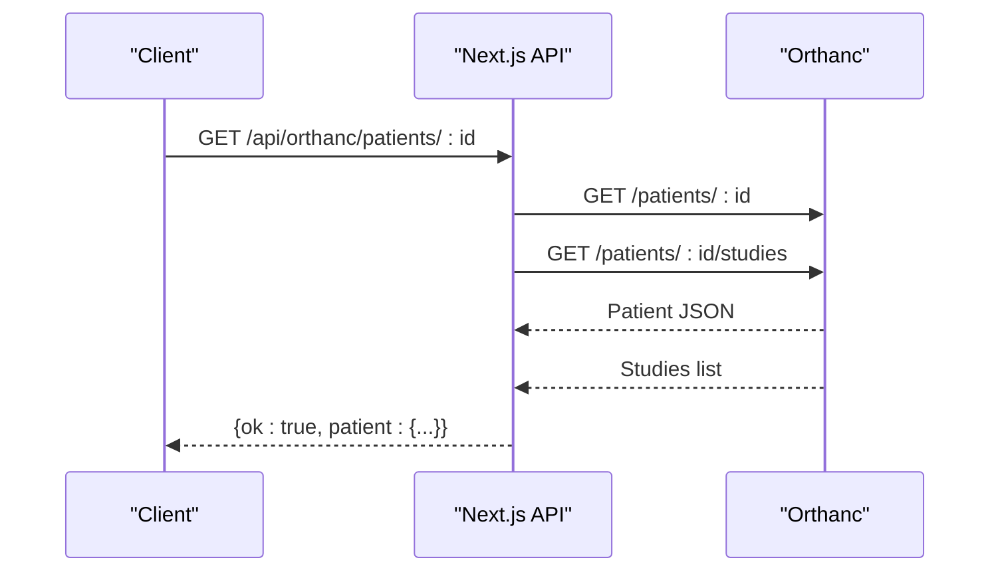
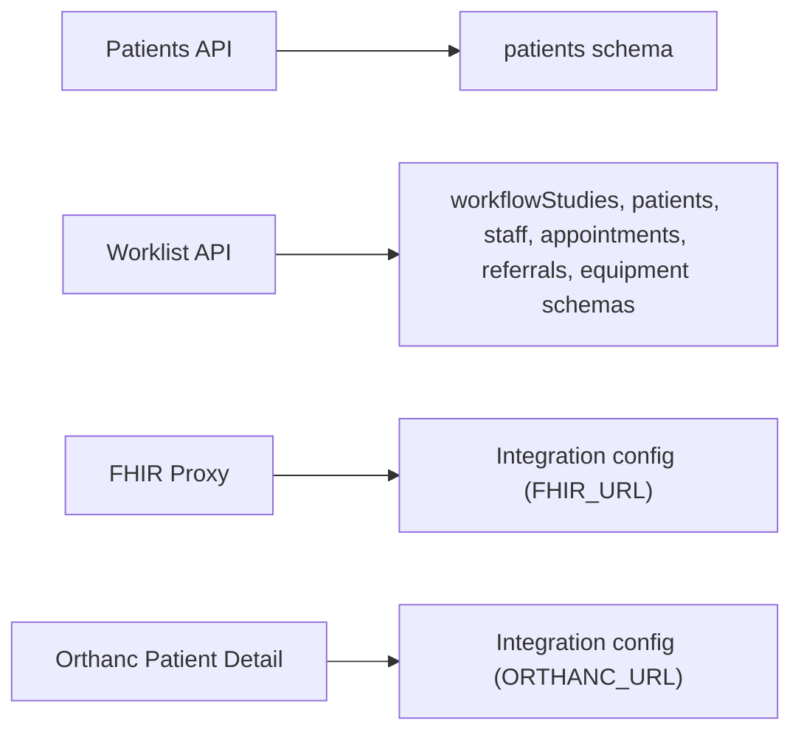

# Patient Search

<cite>
**Referenced Files in This Document**
- [route.ts](file://src/app/api/patients/route.ts)
- [schema.ts](file://src/db/schema.ts)
- [route.ts](file://src/app/api/worklist/route.ts)
- [route.ts](file://src/app/api/fhir/route.ts)
- [route.ts](file://src/app/api/orthanc/patients/[id]/route.ts)
</cite>

## Table of Contents
1. Introduction
2. Project Structure
3. Core Components
4. Architecture Overview
5. Detailed Component Analysis
6. Dependency Analysis
7. Performance Considerations
8. Troubleshooting Guide
9. Conclusion

## Introduction
This document explains the patient search and lookup functionality implemented in the platform. It covers supported search criteria (name, MRN, date of birth, and other identifiers), search algorithms and indexing strategies, performance optimization techniques, API endpoints with query parameters and result formats, advanced search features (fuzzy matching via partial name searches, multi-criteria filtering), pagination and sorting options, and export capabilities.

## Project Structure
Patient search spans multiple layers:
- Local database search for patients and worklist entries
- FHIR proxy to an upstream HAPI FHIR server
- Orthanc integration for imaging-related patient metadata

**Diagram sources**
- [route.ts](file://src/app/api/patients/route.ts)
- [route.ts](file://src/app/api/worklist/route.ts)
- [route.ts](file://src/app/api/fhir/route.ts)
- [route.ts](file://src/app/api/orthanc/patients/[id]/route.ts)

**Section sources**
- [route.ts](file://src/app/api/patients/route.ts)
- [route.ts](file://src/app/api/worklist/route.ts)
- [route.ts](file://src/app/api/fhir/route.ts)
- [route.ts](file://src/app/api/orthanc/patients/[id]/route.ts)

## Core Components
- Patients API: supports free-text search across first name, last name, and MRN; returns results sorted by creation time.
- Worklist API: supports rich multi-criteria filtering including modality, priority, stage, radiologist, machine, physician, location, and a combined free-text search across patient names, MRN, and accession number.
- FHIR Proxy: forwards resource queries (e.g., Patient) to HAPI FHIR with standard FHIR parameters.
- Orthanc Patient Detail: retrieves patient metadata and study summary from Orthanc.

Key data model fields used for search are defined in the schema.

**Section sources**
- [route.ts](file://src/app/api/patients/route.ts)
- [route.ts](file://src/app/api/worklist/route.ts)
- [route.ts](file://src/app/api/fhir/route.ts)
- [route.ts](file://src/app/api/orthanc/patients/[id]/route.ts)
- [schema.ts](file://src/db/schema.ts)

## Architecture Overview
The system provides three complementary search paths:
- Direct database search for local patient records and worklist items
- FHIR-based search through a proxied endpoint to HAPI FHIR
- Imaging-centric patient details via Orthanc

**Diagram sources**
- [route.ts](file://src/app/api/patients/route.ts)
- [route.ts](file://src/app/api/worklist/route.ts)
- [route.ts](file://src/app/api/fhir/route.ts)
- [route.ts](file://src/app/api/orthanc/patients/[id]/route.ts)

## Detailed Component Analysis

### Patients API (/api/patients)
- Purpose: List or search local patients.
- Search criteria:
  - Free-text parameter search matches first name, last name, and MRN using case-insensitive partial matching.
- Sorting: Results are ordered by creation time descending.
- Result format: JSON array of patient objects.
- Error handling: Returns a 500 error JSON when database operations fail.

**Diagram sources**
- [route.ts](file://src/app/api/patients/route.ts)

**Section sources**
- [route.ts](file://src/app/api/patients/route.ts)

### Worklist API (/api/worklist)
- Purpose: Enterprise radiology worklist with comprehensive filtering and context enrichment.
- Supported query parameters:
  - view: today | unread | stat | emergency | assigned | completed | all
  - q: free-text search across patient first name, last name, MRN, and accession number
  - modality: exact match (case-insensitive)
  - radiologist: partial match on staff first/last name
  - machine: partial match on equipment name
  - physician: partial match on referring physician
  - location: partial match on equipment location
  - priority: exact match (stat | urgent | routine)
  - stage: exact match (referral | scheduled | started | review | completed | released | archived)
- Data model joins: workflowStudies joined with patients, staff, appointments, referrals, and equipment to provide full clinical context.
- Sorting: Default order by creation time; additional client-side sort by priority (emergency > stat > urgent > routine).
- Result format: JSON object with ok flag and entries array containing enriched fields.

**Diagram sources**
- [route.ts](file://src/app/api/worklist/route.ts)

**Section sources**
- [route.ts](file://src/app/api/worklist/route.ts)

### FHIR Proxy (/api/fhir)
- Purpose: Proxy requests to HAPI FHIR with strict validation.
- Behavior:
  - Extracts resource type from query parameter resource (defaults to metadata).
  - Forwards all other query parameters unchanged.
  - Validates resource path to prevent traversal attacks.
  - Sets Accept header to application/fhir+json.
  - Returns upstream status and content-type.
- Error handling:
  - 503 if HAPI FHIR is not configured.
  - 400 for invalid resource path.
  - 502 if upstream is unreachable.

**Diagram sources**
- [route.ts](file://src/app/api/fhir/route.ts)

**Section sources**
- [route.ts](file://src/app/api/fhir/route.ts)

### Orthanc Patient Detail (/api/orthanc/patients/:id)
- Purpose: Retrieve patient metadata and study summary from Orthanc.
- Behavior:
  - Fetches patient info and studies concurrently.
  - Normalizes DICOM tags into a structured object.
  - Returns study count and stability flags.
- Error handling:
  - 503 if Orthanc is not configured.
  - Upstream HTTP status forwarded when patient fetch fails.
  - 502 on network errors.

**Diagram sources**
- [route.ts](file://src/app/api/orthanc/patients/[id]/route.ts)

**Section sources**
- [route.ts](file://src/app/api/orthanc/patients/[id]/route.ts)

## Dependency Analysis
- The Patients API depends on the patients table schema and Drizzle ORM for querying.
- The Worklist API depends on multiple related tables (workflowStudies, patients, staff, appointments, referrals, equipment) and uses joins to assemble contextual data.
- The FHIR Proxy depends on external configuration for HAPI FHIR URL and performs outbound HTTP calls.
- The Orthanc Patient Detail depends on external configuration for Orthanc URL and performs outbound HTTP calls.

**Diagram sources**
- [route.ts](file://src/app/api/patients/route.ts)
- [route.ts](file://src/app/api/worklist/route.ts)
- [route.ts](file://src/app/api/fhir/route.ts)
- [route.ts](file://src/app/api/orthanc/patients/[id]/route.ts)
- [schema.ts](file://src/db/schema.ts)

**Section sources**
- [schema.ts](file://src/db/schema.ts)

## Performance Considerations
- Indexing strategy recommendations:
  - Add indexes on frequently searched columns:
    - patients.first_name, patients.last_name, patients.mrn
    - workflowStudies.modality, workflowStudies.priority, workflowStudies.stage
    - appointments.scheduled_date
    - referrals.referring_physician
    - equipment.name, equipment.location
  - Consider composite indexes for common filter combinations (e.g., modality + priority + stage).
- Query patterns:
  - Use case-insensitive partial matching (ILIKE) judiciously; consider trigram indexes if PostgreSQL is used.
  - Prefer exact matches where possible (e.g., modality, priority, stage) to leverage indexes.
- Pagination:
  - Current implementations do not include server-side pagination. For large datasets, implement offset/limit or cursor-based pagination at the API layer.
- Sorting:
  - Worklist applies a client-side priority sort after fetching; move this to server-side ordering for efficiency.
- Caching:
  - Cache frequent read-only queries (e.g., worklist facets) with short TTLs.
  - Cache upstream responses (FHIR, Orthanc) with appropriate invalidation policies.
- Timeouts and retries:
  - External calls already use timeouts; ensure retry logic with exponential backoff for transient failures.

[No sources needed since this section provides general guidance]

## Troubleshooting Guide
- Patients API errors:
  - Database connectivity or query errors return a 500 JSON with an error message.
- Worklist API errors:
  - Errors return a structured JSON with ok:false and detail containing the error message.
- FHIR Proxy errors:
  - 503 if HAPI FHIR is not configured.
  - 400 for invalid resource path.
  - 502 if upstream is unreachable; includes detail with error message.
- Orthanc Patient Detail errors:
  - 503 if Orthanc is not configured.
  - Upstream HTTP status codes are forwarded when patient retrieval fails.
  - 502 on network errors with reason field.

**Section sources**
- [route.ts](file://src/app/api/patients/route.ts)
- [route.ts](file://src/app/api/worklist/route.ts)
- [route.ts](file://src/app/api/fhir/route.ts)
- [route.ts](file://src/app/api/orthanc/patients/[id]/route.ts)

## Conclusion
The platform provides robust patient search across local databases, FHIR-enabled systems, and imaging archives. The current implementation supports flexible multi-criteria filtering and partial text matching. To scale further, add server-side pagination, move priority sorting to the server, and introduce targeted database indexes and caching strategies. Advanced fuzzy matching can be introduced via trigram indexes or dedicated search services if required.

[No sources needed since this section summarizes without analyzing specific files]