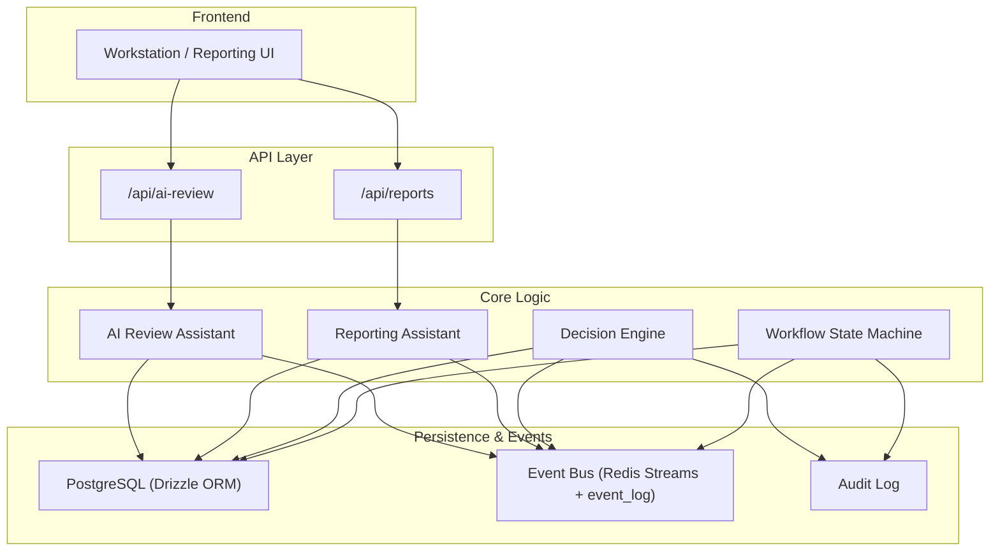
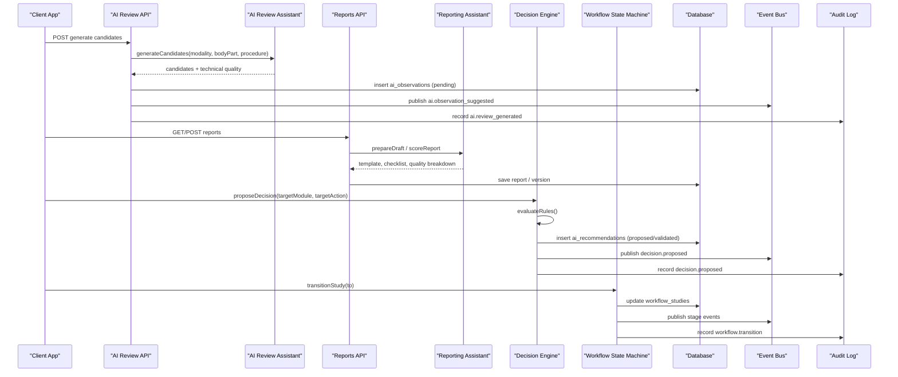
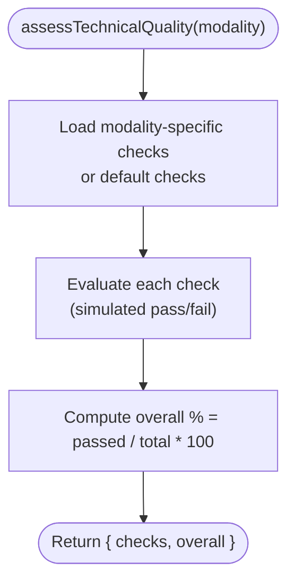
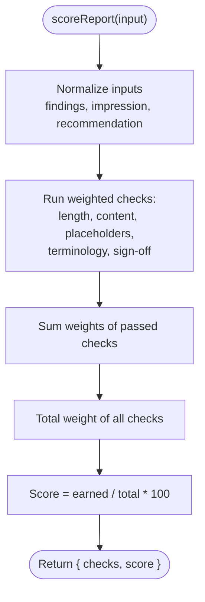
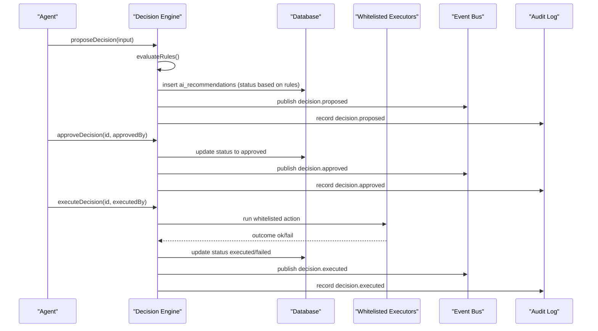
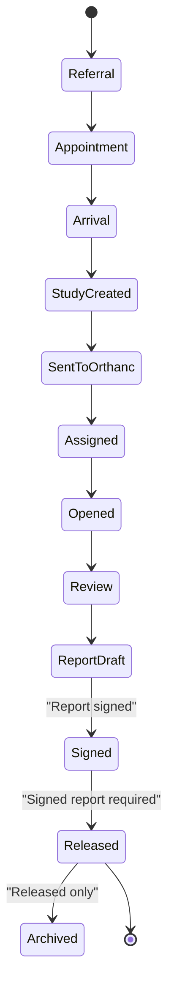
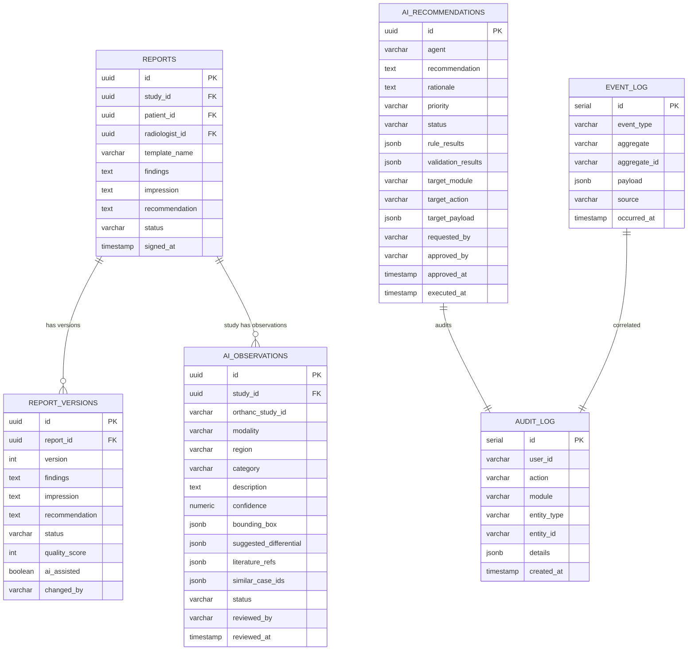
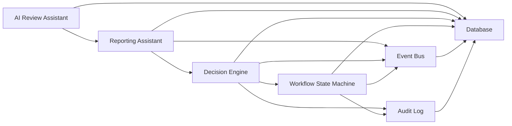

# Quality Scoring & Assessment

<cite>
**Referenced Files in This Document**
- [ai-review.ts](file://src/lib/ai-review.ts)
- [reporting.ts](file://src/lib/reporting.ts)
- [decision-engine.ts](file://src/lib/decision-engine.ts)
- [workflow.ts](file://src/lib/workflow.ts)
- [events.ts](file://src/lib/events.ts)
- [audit.ts](file://src/lib/audit.ts)
- [schema.ts](file://src/db/schema.ts)
- [route.ts (AI Review API)](file://src/app/api/ai-review/route.ts)
- [route.ts (Reports API)](file://src/app/api/reports/route.ts)
- [ai-review.test.ts](file://__tests__/lib/ai-review.test.ts)
- [reporting.test.ts](file://__tests__/lib/reporting.test.ts)
- [decision-engine.test.ts](file://__tests__/lib/decision-engine.test.ts)
</cite>

## Table of Contents
1. [Introduction](#introduction)
2. [Project Structure](#project-structure)
3. [Core Components](#core-components)
4. [Architecture Overview](#architecture-overview)
5. [Detailed Component Analysis](#detailed-component-analysis)
6. [Dependency Analysis](#dependency-analysis)
7. [Performance Considerations](#performance-considerations)
8. [Troubleshooting Guide](#troubleshooting-guide)
9. [Conclusion](#conclusion)
10. [Appendices](#appendices)

## Introduction
This document explains the automated quality scoring and assessment system for radiology reporting and AI-assisted review. It covers multi-dimensional quality metrics, including terminology consistency, measurement completeness, critical finding flags, and structural compliance. It documents scoring algorithms, threshold configurations, feedback mechanisms, examples of score calculations, improvement recommendations, and compliance reporting. It also describes integration with clinical guidelines, regulatory standards, and continuous quality improvement workflows.

The system is designed to be decision-support only: it never auto-signs reports or makes diagnoses. All AI suggestions are advisory and require human confirmation.

## Project Structure
Quality scoring spans several modules:
- AI Review Assistant: generates candidate observations and technical quality checks per modality.
- Reporting Assistant: provides structured templates, terminology normalization, critical finding detection, and report quality scoring.
- Decision Engine: enforces business rules and gates any automated actions behind approval.
- Workflow State Machine: orchestrates study lifecycle transitions and integrates quality gates into the pipeline.
- Event Bus and Audit: persist events and audit trails for traceability and compliance.
- Database Schema: defines entities for reports, versions, AI observations, decisions, and audit logs.

**Diagram sources**
- [route.ts (AI Review API):1-109](file://src/app/api/ai-review/route.ts#L1-L109)
- [route.ts (Reports API):1-46](file://src/app/api/reports/route.ts#L1-L46)
- [ai-review.ts:1-221](file://src/lib/ai-review.ts#L1-L221)
- [reporting.ts:1-326](file://src/lib/reporting.ts#L1-L326)
- [decision-engine.ts:1-245](file://src/lib/decision-engine.ts#L1-L245)
- [workflow.ts:1-246](file://src/lib/workflow.ts#L1-L246)
- [events.ts:1-158](file://src/lib/events.ts#L1-L158)
- [audit.ts:1-25](file://src/lib/audit.ts#L1-L25)
- [schema.ts:1-468](file://src/db/schema.ts#L1-L468)

**Section sources**
- [ai-review.ts:1-221](file://src/lib/ai-review.ts#L1-L221)
- [reporting.ts:1-326](file://src/lib/reporting.ts#L1-L326)
- [decision-engine.ts:1-245](file://src/lib/decision-engine.ts#L1-L245)
- [workflow.ts:1-246](file://src/lib/workflow.ts#L1-L246)
- [events.ts:1-158](file://src/lib/events.ts#L1-L158)
- [audit.ts:1-25](file://src/lib/audit.ts#L1-L25)
- [schema.ts:1-468](file://src/db/schema.ts#L1-L468)

## Core Components
- AI Review Assistant: Modality-specific technical quality checklists and candidate observation generation. Provides confidence scores, suggested differentials, literature references, and similar case IDs. Includes a technical quality pass/fail per checklist item and an overall percentage.
- Reporting Assistant: Structured templates per modality, terminology normalization, critical finding detection, measurement extraction, and weighted quality scoring for findings, impression, recommendation, placeholders, terminology, and sign-off state.
- Decision Engine: Business rule evaluation, proposal, approval, rejection, and execution through a whitelisted executor map. Every action is audited and published as an event.
- Workflow State Machine: Enforces forward-only transitions, hard handoff guards (e.g., signed before release), and emits events and notifications at key milestones.
- Event Bus and Audit: Centralized event publishing with durable persistence and comprehensive audit logging for all quality-related actions.

**Section sources**
- [ai-review.ts:34-103](file://src/lib/ai-review.ts#L34-L103)
- [reporting.ts:24-173](file://src/lib/reporting.ts#L24-L173)
- [reporting.ts:258-326](file://src/lib/reporting.ts#L258-L326)
- [decision-engine.ts:45-130](file://src/lib/decision-engine.ts#L45-L130)
- [workflow.ts:37-51](file://src/lib/workflow.ts#L37-L51)
- [events.ts:18-60](file://src/lib/events.ts#L18-L60)
- [audit.ts:4-24](file://src/lib/audit.ts#L4-L24)

## Architecture Overview
Quality scoring integrates across the AI review and reporting layers, enforced by the decision engine and workflow state machine, with full audit and event traceability.

**Diagram sources**
- [route.ts (AI Review API):1-109](file://src/app/api/ai-review/route.ts#L1-L109)
- [route.ts (Reports API):1-46](file://src/app/api/reports/route.ts#L1-L46)
- [ai-review.ts:168-221](file://src/lib/ai-review.ts#L168-L221)
- [reporting.ts:232-290](file://src/lib/reporting.ts#L232-L290)
- [decision-engine.ts:91-130](file://src/lib/decision-engine.ts#L91-L130)
- [workflow.ts:102-180](file://src/lib/workflow.ts#L102-L180)
- [events.ts:101-131](file://src/lib/events.ts#L101-L131)
- [audit.ts:4-24](file://src/lib/audit.ts#L4-L24)

## Detailed Component Analysis

### AI Review Assistant: Technical Quality and Candidate Generation
- Modality-specific technical checklists define weighted criteria (e.g., coverage, artefacts, exposure). The function returns per-check pass/fail and an overall percentage.
- Candidate generation produces advisory observations with categories (finding, normal, technical, critical), confidence scores, suggested differentials, literature references, and similar case IDs. Critical category may be assigned when confidence is high; however, no diagnosis is made.
- Default checks apply for unknown modalities.

**Diagram sources**
- [ai-review.ts:34-103](file://src/lib/ai-review.ts#L34-L103)

**Section sources**
- [ai-review.ts:34-103](file://src/lib/ai-review.ts#L34-L103)
- [ai-review.ts:168-221](file://src/lib/ai-review.ts#L168-L221)
- [ai-review.test.ts:25-63](file://__tests__/lib/ai-review.test.ts#L25-L63)
- [ai-review.test.ts:65-120](file://__tests__/lib/ai-review.test.ts#L65-L120)

### Reporting Assistant: Terminology, Measurements, Critical Findings, and Quality Score
- Templates provide structured sections and checklists per modality.
- Terminology normalization maps non-standard terms to canonical British English equivalents and flags drift.
- Measurement extraction identifies sizes and units from free text.
- Critical finding detection highlights urgent conditions using a curated term list.
- Quality scoring uses weighted checks:
  - Findings substantive length
  - Impression present and non-generic
  - Impression not identical to findings
  - Recommendation recorded when required by template
  - No placeholder text
  - Terminology consistent
  - Report not signed prematurely
- Incomplete report detection lists failed checks.

**Diagram sources**
- [reporting.ts:258-290](file://src/lib/reporting.ts#L258-L290)

**Section sources**
- [reporting.ts:24-173](file://src/lib/reporting.ts#L24-L173)
- [reporting.ts:177-213](file://src/lib/reporting.ts#L177-L213)
- [reporting.ts:232-290](file://src/lib/reporting.ts#L232-L290)
- [reporting.ts:292-326](file://src/lib/reporting.ts#L292-L326)
- [reporting.test.ts:60-93](file://__tests__/lib/reporting.test.ts#L60-L93)
- [reporting.test.ts:95-156](file://__tests__/lib/reporting.test.ts#L95-L156)

### Decision Engine: Rules, Approval, and Execution
- Business rules enforce safety boundaries:
  - No automatic report signing/finalisation by agents
  - No autonomous diagnosis setting
  - STAT priority restricted to scheduling/workflow contexts
  - Slot reallocation requires equipment context
- Propose decision evaluates rules and persists status (proposed or validated).
- Human approval required before execution.
- Whitelisted executors perform safe actions (workflow transitions, equipment status updates, staff notifications).
- Every step records audit and publishes events.

**Diagram sources**
- [decision-engine.ts:45-130](file://src/lib/decision-engine.ts#L45-L130)
- [decision-engine.ts:142-235](file://src/lib/decision-engine.ts#L142-L235)

**Section sources**
- [decision-engine.ts:45-130](file://src/lib/decision-engine.ts#L45-L130)
- [decision-engine.ts:142-235](file://src/lib/decision-engine.ts#L142-L235)
- [decision-engine.test.ts:58-152](file://__tests__/lib/decision-engine.test.ts#L58-L152)

### Workflow Integration: Quality Gates and Handoffs
- Forward-only transitions ensure studies progress through defined stages.
- Hard handoff guards include requiring a signed report before release and allowing archive only after release.
- Transitions emit events and notifications, enabling continuous quality visibility.

**Diagram sources**
- [workflow.ts:37-51](file://src/lib/workflow.ts#L37-L51)
- [workflow.ts:148-165](file://src/lib/workflow.ts#L148-L165)

**Section sources**
- [workflow.ts:37-51](file://src/lib/workflow.ts#L37-L51)
- [workflow.ts:102-180](file://src/lib/workflow.ts#L102-L180)

### Data Model: Entities Supporting Quality Scoring
Key entities include:
- Reports and report versions: store findings, impressions, recommendations, status, quality scores, and AI assistance flags.
- AI observations: capture AI-generated candidates with category, confidence, and metadata.
- AI recommendations: track proposed decisions, rule results, approvals, and executions.
- Audit log and event log: provide immutable records for compliance and continuous improvement.

**Diagram sources**
- [schema.ts:166-180](file://src/db/schema.ts#L166-L180)
- [schema.ts:330-404](file://src/db/schema.ts#L330-L404)
- [schema.ts:446-468](file://src/db/schema.ts#L446-L468)

**Section sources**
- [schema.ts:166-180](file://src/db/schema.ts#L166-L180)
- [schema.ts:330-404](file://src/db/schema.ts#L330-L404)
- [schema.ts:446-468](file://src/db/schema.ts#L446-L468)

## Dependency Analysis
Quality scoring depends on:
- AI Review Assistant for technical quality and candidate generation.
- Reporting Assistant for templates, terminology, measurements, critical findings, and scoring.
- Decision Engine for enforcing safety rules and gating automation.
- Workflow State Machine for lifecycle enforcement and handoff quality gates.
- Event Bus and Audit for traceability and continuous monitoring.

**Diagram sources**
- [ai-review.ts:1-221](file://src/lib/ai-review.ts#L1-L221)
- [reporting.ts:1-326](file://src/lib/reporting.ts#L1-L326)
- [decision-engine.ts:1-245](file://src/lib/decision-engine.ts#L1-L245)
- [workflow.ts:1-246](file://src/lib/workflow.ts#L1-L246)
- [events.ts:1-158](file://src/lib/events.ts#L1-L158)
- [audit.ts:1-25](file://src/lib/audit.ts#L1-L25)
- [schema.ts:1-468](file://src/db/schema.ts#L1-L468)

**Section sources**
- [ai-review.ts:1-221](file://src/lib/ai-review.ts#L1-L221)
- [reporting.ts:1-326](file://src/lib/reporting.ts#L1-L326)
- [decision-engine.ts:1-245](file://src/lib/decision-engine.ts#L1-L245)
- [workflow.ts:1-246](file://src/lib/workflow.ts#L1-L246)
- [events.ts:1-158](file://src/lib/events.ts#L1-L158)
- [audit.ts:1-25](file://src/lib/audit.ts#L1-L25)
- [schema.ts:1-468](file://src/db/schema.ts#L1-L468)

## Performance Considerations
- Scoring functions operate on small datasets (single report fields or checklist arrays) and are O(n) over checks; performance impact is minimal.
- Candidate generation is lightweight and deterministic for simulation; production integration should replace simulated checks with model-backed evaluations.
- Event publishing is best-effort to Redis with fallback to durable event_log; this ensures availability without blocking core flows.
- Audit writes are wrapped in try/catch to avoid impacting primary operations; failures are logged but do not block workflows.

[No sources needed since this section provides general guidance]

## Troubleshooting Guide
Common issues and resolutions:
- Low quality score:
  - Ensure findings meet minimum length and substance.
  - Provide a distinct, non-generic impression.
  - Include recommendations where templates require them.
  - Remove placeholder text and normalize terminology.
- Critical findings not flagged:
  - Verify terminology matches critical term list; use canonical terms.
  - Confirm text includes exact phrases recognized by detection logic.
- Incomplete reports blocked:
  - Use isIncomplete to identify missing sections or checks.
  - Address each flagged issue before finalizing.
- Decision execution fails:
  - Check rule results; ensure target module/action is allowed.
  - Confirm human approval before execution.
  - Validate payload fields required by specific executors.
- Workflow transitions rejected:
  - Ensure forward-only movement and required prerequisites (e.g., signed report before release).
  - Provide required radiologist ID and DICOM studyInstanceUid where applicable.

**Section sources**
- [reporting.ts:258-326](file://src/lib/reporting.ts#L258-L326)
- [decision-engine.ts:45-130](file://src/lib/decision-engine.ts#L45-L130)
- [workflow.ts:102-180](file://src/lib/workflow.ts#L102-L180)
- [events.ts:101-131](file://src/lib/events.ts#L101-L131)
- [audit.ts:4-24](file://src/lib/audit.ts#L4-L24)

## Conclusion
The automated quality scoring and assessment system provides robust, multi-dimensional quality metrics grounded in modality-specific checklists, structured templates, terminology normalization, measurement extraction, and critical finding detection. Scoring is transparent, auditable, and integrated into the workflow with strict governance via the decision engine and state machine. Continuous quality improvement is enabled through event-driven observability and comprehensive audit trails, supporting compliance with clinical guidelines and regulatory standards while preserving human oversight.

[No sources needed since this section summarizes without analyzing specific files]

## Appendices

### Examples of Quality Score Calculations
- Empty report:
  - Findings length < threshold → fail
  - Impression generic or missing → fail
  - Placeholder text present → fail
  - Terminology inconsistent → fail
  - Result: low overall score due to multiple failed checks.
- Complete report:
  - Findings substantive → pass
  - Distinct impression → pass
  - Recommendation present → pass
  - No placeholders → pass
  - Terminology normalized → pass
  - Sign-off state appropriate → pass
  - Result: higher overall score reflecting strong compliance.

**Section sources**
- [reporting.ts:258-290](file://src/lib/reporting.ts#L258-L290)
- [reporting.test.ts:60-93](file://__tests__/lib/reporting.test.ts#L60-L93)

### Improvement Recommendations
- Standardize terminology to canonical terms to improve consistency and reduce drift.
- Expand measurement extraction to capture additional units and formats.
- Enhance critical finding detection with broader phrase matching and context awareness.
- Integrate modality-specific templates from knowledge base to align with clinical guidelines.
- Use decision engine rules to enforce policy changes (e.g., mandatory recommendations for oncology studies).

**Section sources**
- [reporting.ts:177-213](file://src/lib/reporting.ts#L177-L213)
- [reporting.ts:232-290](file://src/lib/reporting.ts#L232-L290)
- [decision-engine.ts:45-89](file://src/lib/decision-engine.ts#L45-L89)

### Compliance Reporting
- Audit entries capture every quality-related action, including AI review generation, decision proposals/approvals/executions, and workflow transitions.
- Event logs provide a chronological activity feed for dashboards and audits.
- Report versions store quality scores and AI assistance flags for historical tracking and trend analysis.

**Section sources**
- [audit.ts:4-24](file://src/lib/audit.ts#L4-L24)
- [events.ts:101-131](file://src/lib/events.ts#L101-L131)
- [schema.ts:330-404](file://src/db/schema.ts#L330-L404)

### Integration with Clinical Guidelines and Regulatory Standards
- Templates and checklists can be extended to reflect guideline-based requirements (e.g., BI-RADS for mammography, LI-RADS for liver lesions).
- Decision engine rules can enforce regulatory constraints (e.g., no autonomous diagnosis, mandatory human approval for sensitive actions).
- Workflow handoff guards ensure that releases occur only after signed reports, aligning with regulatory expectations for finalized outputs.

**Section sources**
- [reporting.ts:24-173](file://src/lib/reporting.ts#L24-L173)
- [decision-engine.ts:45-89](file://src/lib/decision-engine.ts#L45-L89)
- [workflow.ts:148-165](file://src/lib/workflow.ts#L148-L165)

### Continuous Quality Improvement Workflows
- Monitor quality scores over time to identify trends and areas for training or process improvement.
- Use event logs to correlate quality issues with workflow stages and interventions.
- Leverage decision engine to automate corrective actions (e.g., notifications for incomplete reports) under human oversight.

**Section sources**
- [events.ts:18-60](file://src/lib/events.ts#L18-L60)
- [events.ts:101-131](file://src/lib/events.ts#L101-L131)
- [decision-engine.ts:142-235](file://src/lib/decision-engine.ts#L142-L235)