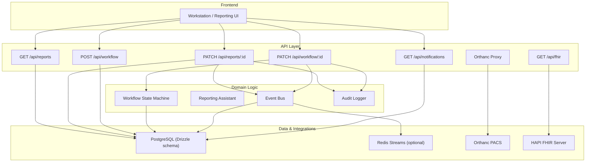
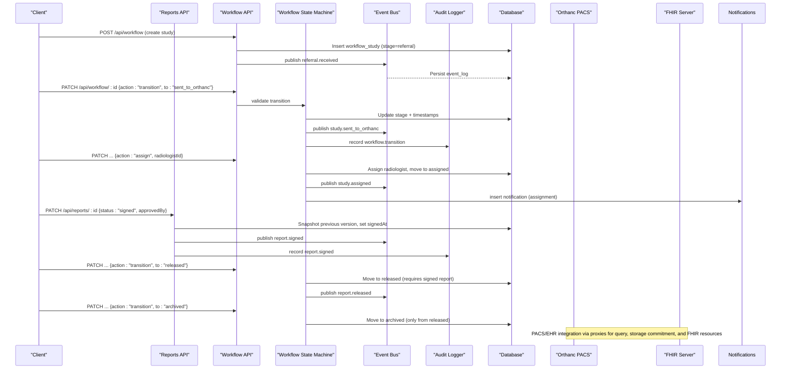
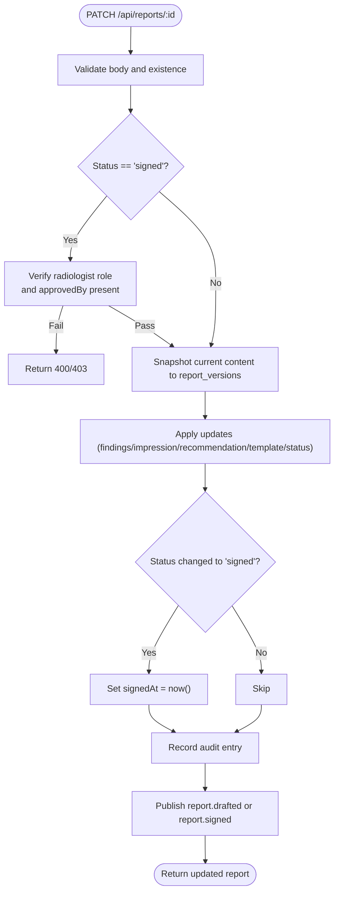
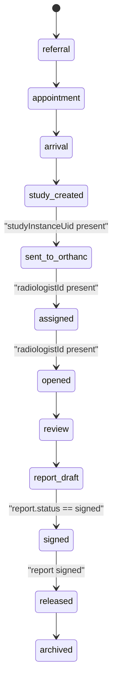
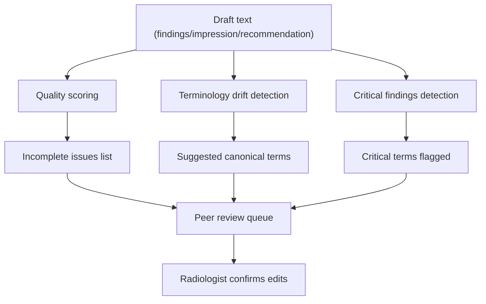
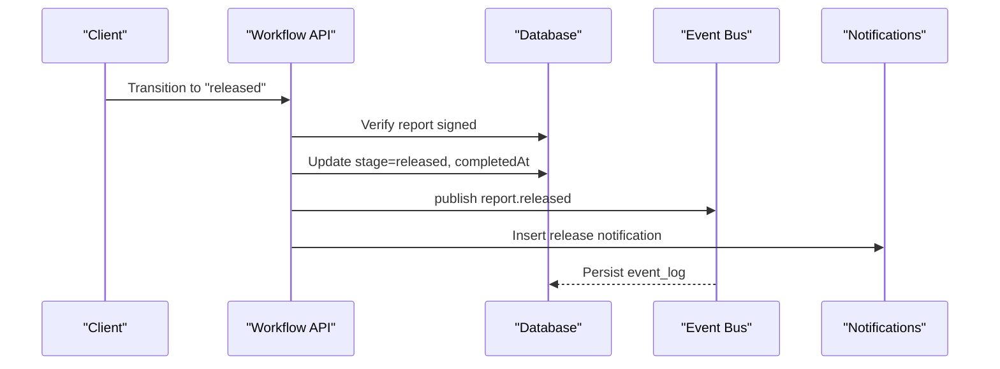
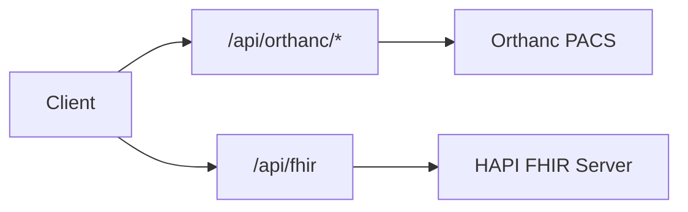
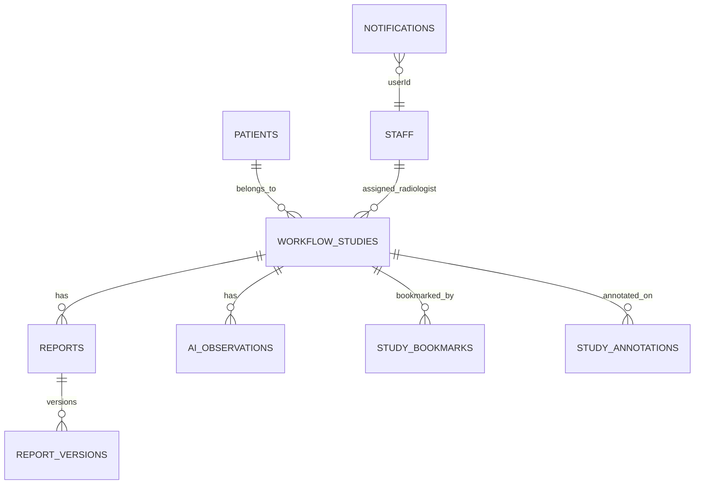
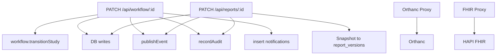

# Report Lifecycle Management

<cite>
**Referenced Files in This Document**
- [src/app/api/reports/route.ts](file://src/app/api/reports/route.ts)
- [src/app/api/reports/[id]/route.ts](file://src/app/api/reports/[id]/route.ts)
- [src/lib/reporting.ts](file://src/lib/reporting.ts)
- [src/lib/workflow.ts](file://src/lib/workflow.ts)
- [src/app/api/workflow/route.ts](file://src/app/api/workflow/route.ts)
- [src/app/api/workflow/[id]/route.ts](file://src/app/api/workflow/[id]/route.ts)
- [src/db/schema.ts](file://src/db/schema.ts)
- [src/lib/events.ts](file://src/lib/events.ts)
- [src/lib/audit.ts](file://src/lib/audit.ts)
- [src/app/api/notifications/route.ts](file://src/app/api/notifications/route.ts)
- [src/app/api/fhir/route.ts](file://src/app/api/fhir/route.ts)
- [src/app/api/orthanc/storage-commitment/route.ts](file://src/app/api/orthanc/storage-commitment/route.ts)
- [src/app/api/orthanc/studies/route.ts](file://src/app/api/orthanc/studies/route.ts)
- [services/langgraph_agent.py](file://services/langgraph_agent.py)
</cite>

## Table of Contents
1. [Introduction](#introduction)
2. [Project Structure](#project-structure)
3. [Core Components](#core-components)
4. [Architecture Overview](#architecture-overview)
5. [Detailed Component Analysis](#detailed-component-analysis)
6. [Dependency Analysis](#dependency-analysis)
7. [Performance Considerations](#performance-considerations)
8. [Troubleshooting Guide](#troubleshooting-guide)
9. [Conclusion](#conclusion)
10. [Appendices](#appendices)

## Introduction
This document describes the end-to-end report lifecycle from draft creation through finalization and archiving. It explains workflow stages, state transitions, approval processes, distribution mechanisms, critical finding escalation, peer review workflows, sign-off procedures, automated notifications, deadline tracking, bottleneck identification, and integrations with PACS (Orthanc), EHR platforms (FHIR), and regulatory submission requirements.

## Project Structure
The platform implements an event-driven architecture with a strict server-side state machine for studies and reports. Key areas:
- Reporting APIs for listing and updating reports, including versioning and sign-off controls.
- Workflow APIs to create studies and advance them through a 12-stage pipeline.
- A reporting assistant module providing templates, quality scoring, terminology checks, and critical finding detection.
- An event bus that persists events and optionally streams them via Redis for real-time reactions.
- Audit logging for every significant action.
- Integrations with Orthanc (PACS) and FHIR (EHR).

**Diagram sources**
- [src/app/api/reports/route.ts:6-45](file://src/app/api/reports/route.ts#L6-L45)
- [src/app/api/reports/[id]/route.ts:10-124](file://src/app/api/reports/[id]/route.ts#L10-L124)
- [src/app/api/workflow/route.ts:12-106](file://src/app/api/workflow/route.ts#L12-L106)
- [src/app/api/workflow/[id]/route.ts:20-108](file://src/app/api/workflow/[id]/route.ts#L20-L108)
- [src/lib/workflow.ts:38-233](file://src/lib/workflow.ts#L38-L233)
- [src/lib/events.ts:101-131](file://src/lib/events.ts#L101-L131)
- [src/lib/audit.ts:4-24](file://src/lib/audit.ts#L4-L24)
- [src/app/api/notifications/route.ts:9-56](file://src/app/api/notifications/route.ts#L9-L56)
- [src/app/api/fhir/route.ts:10-38](file://src/app/api/fhir/route.ts#L10-L38)
- [src/app/api/orthanc/studies/route.ts:20-35](file://src/app/api/orthanc/studies/route.ts#L20-L35)

**Section sources**
- [src/app/api/reports/route.ts:6-45](file://src/app/api/reports/route.ts#L6-L45)
- [src/app/api/reports/[id]/route.ts:10-124](file://src/app/api/reports/[id]/route.ts#L10-L124)
- [src/app/api/workflow/route.ts:12-106](file://src/app/api/workflow/route.ts#L12-L106)
- [src/app/api/workflow/[id]/route.ts:20-108](file://src/app/api/workflow/[id]/route.ts#L20-L108)
- [src/lib/workflow.ts:38-233](file://src/lib/workflow.ts#L38-L233)
- [src/lib/events.ts:101-131](file://src/lib/events.ts#L101-L131)
- [src/lib/audit.ts:4-24](file://src/lib/audit.ts#L4-L24)
- [src/app/api/notifications/route.ts:9-56](file://src/app/api/notifications/route.ts#L9-L56)
- [src/app/api/fhir/route.ts:10-38](file://src/app/api/fhir/route.ts#L10-L38)
- [src/app/api/orthanc/studies/route.ts:20-35](file://src/app/api/orthanc/studies/route.ts#L20-L35)

## Core Components
- Reporting API: Create and list reports; update with versioning and controlled sign-off requiring explicit radiologist confirmation.
- Workflow API: Create studies at referral stage; transition through a validated forward-only pipeline with guards for assignments, DICOM linkage, release, and archive.
- Reporting Assistant: Structured templates per modality, quality scoring, terminology normalization, and critical finding detection to support peer review and escalation.
- Event Bus: Publishes domain events to Redis Streams (optional) and persists to an event log table for auditability and downstream reactions.
- Audit Logger: Immutable record of actions across modules.
- Notifications: In-app notifications for assignments, releases, and system events.
- Integrations: Orthanc (PACS) proxy endpoints and Storage Commitment; FHIR proxy for EHR interoperability.

**Section sources**
- [src/app/api/reports/route.ts:6-45](file://src/app/api/reports/route.ts#L6-L45)
- [src/app/api/reports/[id]/route.ts:40-124](file://src/app/api/reports/[id]/route.ts#L40-L124)
- [src/lib/reporting.ts:233-325](file://src/lib/reporting.ts#L233-L325)
- [src/lib/workflow.ts:93-233](file://src/lib/workflow.ts#L93-L233)
- [src/lib/events.ts:101-131](file://src/lib/events.ts#L101-L131)
- [src/lib/audit.ts:4-24](file://src/lib/audit.ts#L4-L24)
- [src/app/api/notifications/route.ts:9-56](file://src/app/api/notifications/route.ts#L9-L56)
- [src/app/api/fhir/route.ts:10-38](file://src/app/api/fhir/route.ts#L10-L38)
- [src/app/api/orthanc/storage-commitment/route.ts:6-39](file://src/app/api/orthanc/storage-commitment/route.ts#L6-L39)

## Architecture Overview
The system enforces a strict, forward-only study pipeline and a controlled report signing process. Every meaningful change is audited and emitted as an event. Reports are never auto-signed; radiologists must explicitly approve sign-off.

**Diagram sources**
- [src/app/api/workflow/route.ts:55-101](file://src/app/api/workflow/route.ts#L55-L101)
- [src/app/api/workflow/[id]/route.ts:20-108](file://src/app/api/workflow/[id]/route.ts#L20-L108)
- [src/lib/workflow.ts:102-233](file://src/lib/workflow.ts#L102-L233)
- [src/app/api/reports/[id]/route.ts:40-124](file://src/app/api/reports/[id]/route.ts#L40-L124)
- [src/lib/events.ts:101-131](file://src/lib/events.ts#L101-L131)
- [src/lib/audit.ts:4-24](file://src/lib/audit.ts#L4-L24)
- [src/app/api/orthanc/storage-commitment/route.ts:6-39](file://src/app/api/orthanc/storage-commitment/route.ts#L6-L39)
- [src/app/api/fhir/route.ts:10-38](file://src/app/api/fhir/route.ts#L10-L38)

## Detailed Component Analysis

### Report Draft Creation and Editing
- Draft creation: Reports can be created via the reports API with fields such as findings, impression, recommendation, templateName, and status defaulting to draft.
- Versioning: On each update, if content exists, the current version is snapshotted into report_versions before mutation. The next version number is computed from existing versions.
- Sign-off control: Moving to signed requires an explicit approvedBy field and role validation (radiologist role required). SignedAt is set on sign-off.
- Audit and events: Each update records an audit entry; status changes emit report.drafted or report.signed events.

**Diagram sources**
- [src/app/api/reports/[id]/route.ts:40-124](file://src/app/api/reports/[id]/route.ts#L40-L124)

**Section sources**
- [src/app/api/reports/route.ts:6-45](file://src/app/api/reports/route.ts#L6-L45)
- [src/app/api/reports/[id]/route.ts:40-124](file://src/app/api/reports/[id]/route.ts#L40-L124)

### Workflow Stages and Transitions
- Pipeline stages: Referral → Appointment → Patient Arrival → Study Created → Sent to Orthanc → Radiologist Assigned → Study Opened → AI Review → Report Draft → Report Signed → Report Released → Archive.
- Forward-only transitions: Backward moves are rejected with 409. Certain stages require prerequisites (e.g., sent_to_orthanc requires a DICOM studyInstanceUid; assigned/opened require radiologistId; released requires signed report; archived only from released).
- Assignment and reassignment: Assignment moves to assigned; reassignment after assignment updates radiologist without rolling back.
- Notifications: Automatic notifications for assignment and release.

**Diagram sources**
- [src/lib/workflow.ts:38-51](file://src/lib/workflow.ts#L38-L51)
- [src/lib/workflow.ts:134-165](file://src/lib/workflow.ts#L134-L165)

**Section sources**
- [src/app/api/workflow/route.ts:55-101](file://src/app/api/workflow/route.ts#L55-L101)
- [src/app/api/workflow/[id]/route.ts:20-108](file://src/app/api/workflow/[id]/route.ts#L20-L108)
- [src/lib/workflow.ts:93-233](file://src/lib/workflow.ts#L93-L233)

### Peer Review and Critical Finding Escalation
- Templates and checklists: Built-in structured templates per modality guide consistent reporting and ensure completeness.
- Quality scoring: Automated checks evaluate content length, non-generic impressions, presence of recommendations when required, absence of placeholders, terminology consistency, and premature signing prevention.
- Terminology drift: Detects non-standard terms and suggests canonical equivalents.
- Critical findings: Scans draft text for critical terms to highlight urgent items for escalation during peer review.

**Diagram sources**
- [src/lib/reporting.ts:233-325](file://src/lib/reporting.ts#L233-L325)

**Section sources**
- [src/lib/reporting.ts:233-325](file://src/lib/reporting.ts#L233-L325)

### Distribution Mechanisms and Archival
- Release gating: Studies can only be released when their associated report is signed.
- Archival gating: Only released studies can be archived.
- Distribution triggers: Releasing emits events and notifications; downstream systems can consume these events to distribute reports to EHR/PACS viewers or external systems.

**Diagram sources**
- [src/lib/workflow.ts:156-172](file://src/lib/workflow.ts#L156-L172)
- [src/lib/workflow.ts:199-233](file://src/lib/workflow.ts#L199-L233)

**Section sources**
- [src/lib/workflow.ts:156-233](file://src/lib/workflow.ts#L156-L233)

### Integration with PACS (Orthanc) and EHR (FHIR)
- Orthanc proxy: Lists studies, retrieves series details, and supports Storage Commitment to verify safe storage for compliance.
- FHIR proxy: Forwards queries to HAPI FHIR with appropriate headers and error handling.

**Diagram sources**
- [src/app/api/orthanc/studies/route.ts:20-35](file://src/app/api/orthanc/studies/route.ts#L20-L35)
- [src/app/api/orthanc/storage-commitment/route.ts:6-39](file://src/app/api/orthanc/storage-commitment/route.ts#L6-L39)
- [src/app/api/fhir/route.ts:10-38](file://src/app/api/fhir/route.ts#L10-L38)

**Section sources**
- [src/app/api/orthanc/studies/route.ts:20-35](file://src/app/api/orthanc/studies/route.ts#L20-L35)
- [src/app/api/orthanc/storage-commitment/route.ts:6-39](file://src/app/api/orthanc/storage-commitment/route.ts#L6-L39)
- [src/app/api/fhir/route.ts:10-38](file://src/app/api/fhir/route.ts#L10-L38)

### Data Model Relationships
Key entities involved in the report lifecycle:
- workflow_studies: Tracks study stage, assignment, timestamps, and identifiers.
- reports: Stores report content, status, and sign-off metadata.
- report_versions: Snapshots of report content changes for auditability.
- ai_observations: Candidate observations surfaced by AI review for acceptance/rejection.
- notifications: In-app notifications for assignments, releases, and other events.
- event_log: Durable persistence of all domain events.

**Diagram sources**
- [src/db/schema.ts:103-119](file://src/db/schema.ts#L103-L119)
- [src/db/schema.ts:167-180](file://src/db/schema.ts#L167-L180)
- [src/db/schema.ts:344-356](file://src/db/schema.ts#L344-L356)
- [src/db/schema.ts:361-380](file://src/db/schema.ts#L361-L380)
- [src/db/schema.ts:424-444](file://src/db/schema.ts#L424-L444)
- [src/db/schema.ts:457-467](file://src/db/schema.ts#L457-L467)

**Section sources**
- [src/db/schema.ts:103-119](file://src/db/schema.ts#L103-L119)
- [src/db/schema.ts:167-180](file://src/db/schema.ts#L167-L180)
- [src/db/schema.ts:344-356](file://src/db/schema.ts#L344-L356)
- [src/db/schema.ts:361-380](file://src/db/schema.ts#L361-L380)
- [src/db/schema.ts:424-444](file://src/db/schema.ts#L424-L444)
- [src/db/schema.ts:457-467](file://src/db/schema.ts#L457-L467)

## Dependency Analysis
- Workflow transitions depend on:
  - Database reads/writes for study state and timestamps.
  - Report status checks to gate release/archive.
  - Event publishing for downstream consumers.
  - Audit logging for compliance.
  - Notification insertion for user awareness.
- Reporting updates depend on:
  - Version snapshotting logic.
  - Role verification for sign-off.
  - Event publishing for status changes.
  - Audit logging.
- Integrations depend on:
  - Configuration for upstream URLs.
  - Timed fetch utilities for timeouts.
  - Authentication headers for PACS access.

**Diagram sources**
- [src/app/api/workflow/[id]/route.ts:20-108](file://src/app/api/workflow/[id]/route.ts#L20-L108)
- [src/lib/workflow.ts:102-233](file://src/lib/workflow.ts#L102-L233)
- [src/app/api/reports/[id]/route.ts:40-124](file://src/app/api/reports/[id]/route.ts#L40-L124)
- [src/app/api/orthanc/studies/route.ts:20-35](file://src/app/api/orthanc/studies/route.ts#L20-L35)
- [src/app/api/fhir/route.ts:10-38](file://src/app/api/fhir/route.ts#L10-L38)

**Section sources**
- [src/app/api/workflow/[id]/route.ts:20-108](file://src/app/api/workflow/[id]/route.ts#L20-L108)
- [src/lib/workflow.ts:102-233](file://src/lib/workflow.ts#L102-L233)
- [src/app/api/reports/[id]/route.ts:40-124](file://src/app/api/reports/[id]/route.ts#L40-L124)
- [src/app/api/orthanc/studies/route.ts:20-35](file://src/app/api/orthanc/studies/route.ts#L20-L35)
- [src/app/api/fhir/route.ts:10-38](file://src/app/api/fhir/route.ts#L10-L38)

## Performance Considerations
- Event bus uses Redis Streams with a capped size for high-throughput messaging while persisting to the database for durability. If Redis is unavailable, events still persist to the event log.
- TimedFetch wrappers enforce timeouts for upstream calls (e.g., FHIR, Orthanc) to prevent long-running requests.
- Minimal coupling: Modules react to events asynchronously, avoiding synchronous bottlenecks.
- Version snapshots occur only when content exists, reducing unnecessary writes.

[No sources needed since this section provides general guidance]

## Troubleshooting Guide
- Invalid stage transitions:
  - Ensure target stage is valid and forward-only; backward moves return 409.
  - Check prerequisites: studyInstanceUid for sent_to_orthanc; radiologistId for assigned/opened; signed report for released; released for archived.
- Report sign-off failures:
  - Confirm approvedBy is provided and the user has the radiologist role; otherwise returns 400/403.
- Orthanc integration errors:
  - Verify configuration URL and authentication headers; handle upstream HTTP errors gracefully.
- FHIR integration errors:
  - Ensure FHIR_URL is configured; handle unreachable upstream with appropriate status codes.
- Event persistence:
  - If Redis is down, events still persist to event_log; use event counts and listings to investigate.

**Section sources**
- [src/lib/workflow.ts:111-165](file://src/lib/workflow.ts#L111-L165)
- [src/app/api/reports/[id]/route.ts:55-72](file://src/app/api/reports/[id]/route.ts#L55-L72)
- [src/app/api/orthanc/studies/route.ts:20-35](file://src/app/api/orthanc/studies/route.ts#L20-L35)
- [src/app/api/fhir/route.ts:10-38](file://src/app/api/fhir/route.ts#L10-L38)
- [src/lib/events.ts:101-131](file://src/lib/events.ts#L101-L131)

## Conclusion
The platform enforces a robust, auditable report lifecycle with strict state transitions, controlled sign-off, and comprehensive eventing. It integrates seamlessly with PACS and EHR systems, supports peer review and critical finding escalation, and provides tools for bottleneck identification and automated notifications. The design ensures compliance, traceability, and operational reliability.

[No sources needed since this section summarizes without analyzing specific files]

## Appendices

### Automated Notifications and Deadline Tracking
- Notifications:
  - Assignment notifications inserted automatically when a study is assigned.
  - Release notifications inserted when a study is released.
  - Notifications can be queried and displayed in the client.
- Deadline tracking:
  - Use startedAt and completedAt timestamps on workflow_studies to compute turnaround times.
  - Monitor event_counts and event_log entries to identify delays between stages.
  - Leverage worklist.updated events to refresh dashboards and flag overdue items.

**Section sources**
- [src/lib/workflow.ts:206-231](file://src/lib/workflow.ts#L206-L231)
- [src/app/api/notifications/route.ts:9-56](file://src/app/api/notifications/route.ts#L9-L56)
- [src/lib/events.ts:133-157](file://src/lib/events.ts#L133-L157)

### Regulatory Submission Requirements
- Storage Commitment:
  - Use the Orthanc Storage Commitment endpoint to verify safe storage of instances for compliance.
- FHIR Interoperability:
  - Use the FHIR proxy to exchange patient and encounter data with EHR systems.
- Auditability:
  - All transitions and report updates are recorded in audit_log and event_log for regulatory review.

**Section sources**
- [src/app/api/orthanc/storage-commitment/route.ts:6-39](file://src/app/api/orthanc/storage-commitment/route.ts#L6-L39)
- [src/app/api/fhir/route.ts:10-38](file://src/app/api/fhir/route.ts#L10-L38)
- [src/lib/audit.ts:4-24](file://src/lib/audit.ts#L4-L24)
- [src/lib/events.ts:101-131](file://src/lib/events.ts#L101-L131)