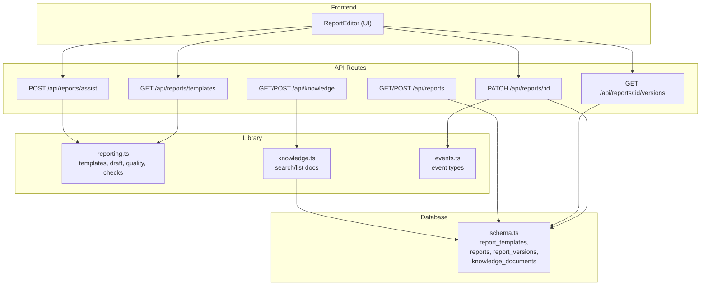
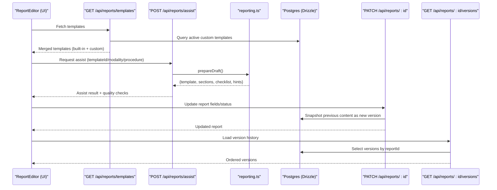
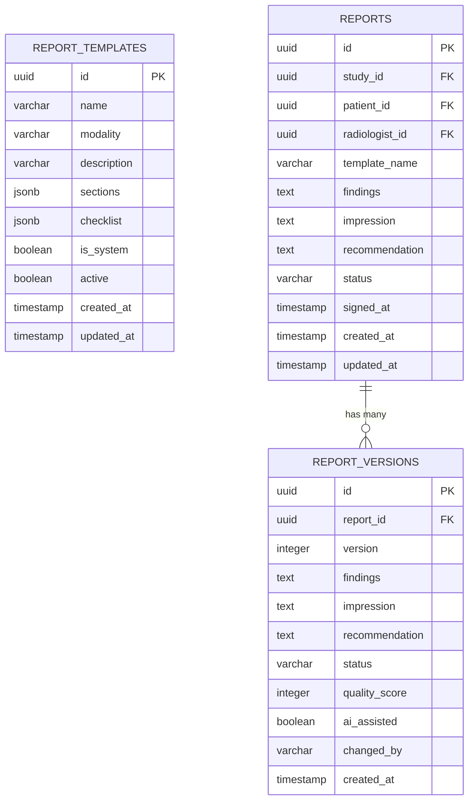
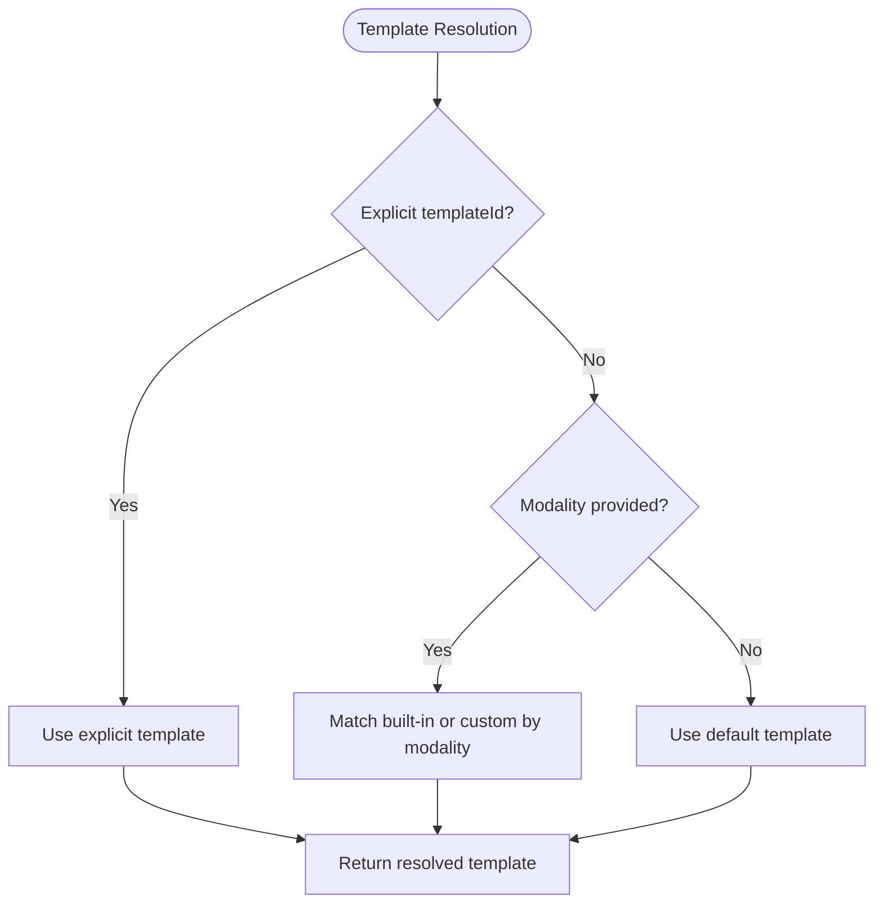
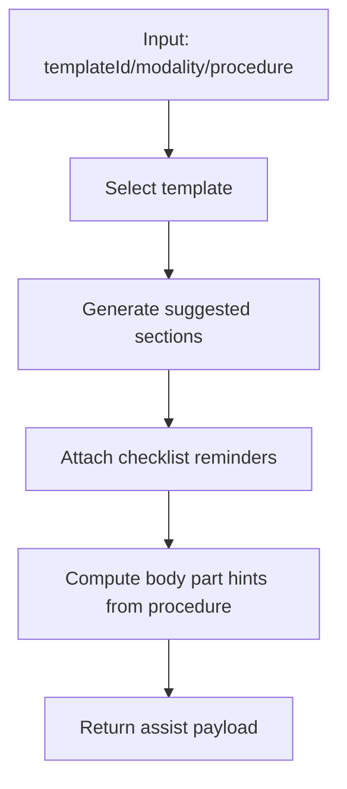
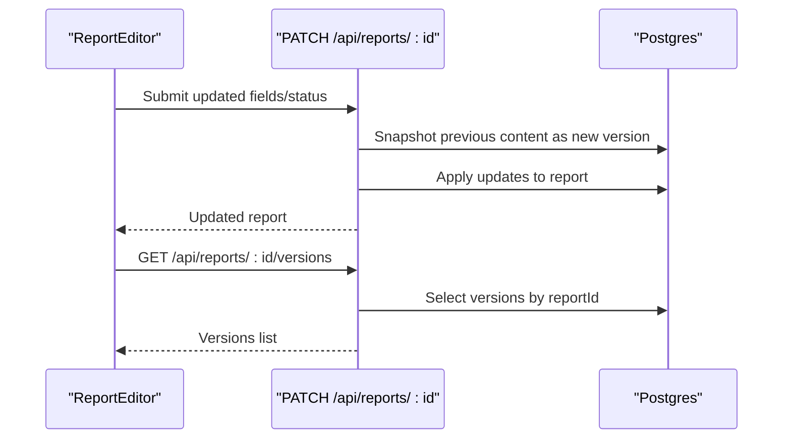
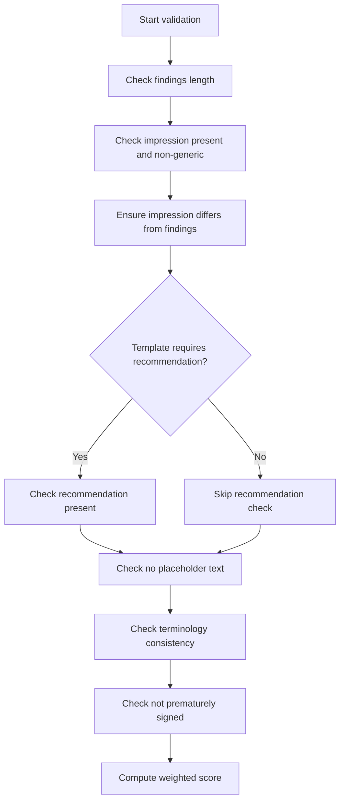
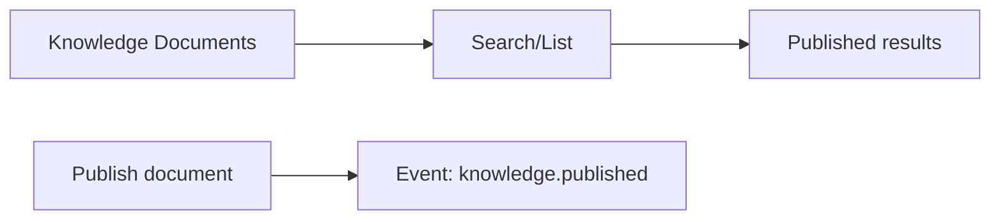
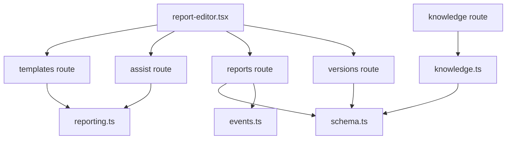

# Report Templates

<cite>
**Referenced Files in This Document**
- [reporting.ts](file://src/lib/reporting.ts)
- [route.ts (templates)](file://src/app/api/reports/templates/route.ts)
- [schema.ts](file://src/db/schema.ts)
- [route.ts (reports)](file://src/app/api/reports/route.ts)
- [route.ts (report by id)](file://src/app/api/reports/[id]/route.ts)
- [route.ts (versions)](file://src/app/api/reports/[id]/versions/route.ts)
- [route.ts (assist)](file://src/app/api/reports/assist/route.ts)
- [report-editor.tsx](file://src/components/workstation/report-editor.tsx)
- [knowledge.ts](file://src/lib/knowledge.ts)
- [knowledge route.ts](file://src/app/api/knowledge/route.ts)
- [knowledge-categories.ts](file://src/lib/knowledge-categories.ts)
- [events.ts](file://src/lib/events.ts)
</cite>

## Table of Contents
1. [Introduction](#introduction)
2. [Project Structure](#project-structure)
3. [Core Components](#core-components)
4. [Architecture Overview](#architecture-overview)
5. [Detailed Component Analysis](#detailed-component-analysis)
6. [Dependency Analysis](#dependency-analysis)
7. [Performance Considerations](#performance-considerations)
8. [Troubleshooting Guide](#troubleshooting-guide)
9. [Conclusion](#conclusion)
10. [Appendices](#appendices)

## Introduction
This document explains the report template management system for medical imaging reporting. It covers how templates are defined, selected, and used to structure reports; how versions are tracked; and how quality, terminology, and critical findings support radiologists during drafting. It also documents integration with the knowledge platform and outlines best practices for creating effective, consistent reports.

The system provides:
- Built-in structured templates per modality
- Custom, database-stored templates that merge with built-ins
- AI-assisted drafting guidance, quality scoring, and checks
- Versioned report history with restore capability
- Integration with a knowledge platform for policies, protocols, and template documentation

## Project Structure
The template system spans server routes, a shared library, database schema, and the workstation UI.

**Diagram sources**
- [report-editor.tsx:112-122](file://src/components/workstation/report-editor.tsx#L112-L122)
- [route.ts (templates):9-25](file://src/app/api/reports/templates/route.ts#L9-L25)
- [route.ts (assist):33-76](file://src/app/api/reports/assist/route.ts#L33-L76)
- [route.ts (reports):6-45](file://src/app/api/reports/route.ts#L6-L45)
- [route.ts (report by id):47-123](file://src/app/api/reports/[id]/route.ts#L47-L123)
- [route.ts (versions):8-20](file://src/app/api/reports/[id]/versions/route.ts#L8-L20)
- [knowledge route.ts:10-65](file://src/app/api/knowledge/route.ts#L10-L65)
- [reporting.ts:24-175](file://src/lib/reporting.ts#L24-L175)
- [knowledge.ts:31-71](file://src/lib/knowledge.ts#L31-L71)
- [schema.ts:166-421](file://src/db/schema.ts#L166-L421)

**Section sources**
- [report-editor.tsx:112-122](file://src/components/workstation/report-editor.tsx#L112-L122)
- [route.ts (templates):9-25](file://src/app/api/reports/templates/route.ts#L9-L25)
- [route.ts (assist):33-76](file://src/app/api/reports/assist/route.ts#L33-L76)
- [reporting.ts:24-175](file://src/lib/reporting.ts#L24-L175)
- [schema.ts:166-421](file://src/db/schema.ts#L166-L421)

## Core Components
- Template definitions and selection:
  - Built-in templates are defined in the reporting library and merged with active custom templates from the database when listing templates.
  - The assist endpoint resolves a template by explicit ID, then by modality, then falls back to defaults.
- Draft assistance and quality:
  - The assistant returns suggested sections, checklist reminders, body part hints, and a reminder that all suggestions require radiologist confirmation.
  - Quality scoring evaluates content length, non-generic impression, recommendation presence, placeholder text, terminology consistency, and sign-off state.
- Versioning:
  - On updates, the previous content is snapshot into version history before changes are applied. Versions include status, quality score, AI assistance flag, and change author.
- Knowledge platform integration:
  - Documents can be searched or listed by category; publishing emits an event. Reporting templates can be documented as knowledge items under a dedicated category.

**Section sources**
- [route.ts (templates):9-25](file://src/app/api/reports/templates/route.ts#L9-L25)
- [route.ts (assist):33-76](file://src/app/api/reports/assist/route.ts#L33-L76)
- [reporting.ts:232-256](file://src/lib/reporting.ts#L232-L256)
- [reporting.ts:273-300](file://src/lib/reporting.ts#L273-L300)
- [route.ts (report by id):76-96](file://src/app/api/reports/[id]/route.ts#L76-L96)
- [knowledge route.ts:10-65](file://src/app/api/knowledge/route.ts#L10-L65)

## Architecture Overview
The template system combines static built-in templates with dynamic custom templates, surfaces them via API, and uses them to drive drafting assistance and quality checks. Reports are versioned on update, and the knowledge platform supports template documentation and policy references.

**Diagram sources**
- [route.ts (templates):9-25](file://src/app/api/reports/templates/route.ts#L9-L25)
- [route.ts (assist):33-76](file://src/app/api/reports/assist/route.ts#L33-L76)
- [reporting.ts:232-256](file://src/lib/reporting.ts#L232-L256)
- [route.ts (report by id):76-123](file://src/app/api/reports/[id]/route.ts#L76-L123)
- [route.ts (versions):8-20](file://src/app/api/reports/[id]/versions/route.ts#L8-L20)

## Detailed Component Analysis

### Template Data Model and Storage
- Custom templates are stored in a dedicated table with fields for name, modality, description, sections, checklist, system flag, and active status.
- Reports store the chosen template name alongside findings, impression, recommendation, status, and timestamps.
- Version history captures snapshots of report content at each update, including quality scores and flags.

**Diagram sources**
- [schema.ts:331-356](file://src/db/schema.ts#L331-L356)

**Section sources**
- [schema.ts:166-180](file://src/db/schema.ts#L166-L180)
- [schema.ts:331-356](file://src/db/schema.ts#L331-L356)

### Template Selection and Merging
- The templates endpoint returns built-in templates augmented with a system flag, merged with active custom templates from the database.
- The assist endpoint resolves a template by explicit ID first, then by modality, then falls back to defaults.

**Diagram sources**
- [route.ts (templates):9-25](file://src/app/api/reports/templates/route.ts#L9-L25)
- [route.ts (assist):45-64](file://src/app/api/reports/assist/route.ts#L45-L64)
- [reporting.ts:232-256](file://src/lib/reporting.ts#L232-L256)

**Section sources**
- [route.ts (templates):9-25](file://src/app/api/reports/templates/route.ts#L9-L25)
- [route.ts (assist):45-64](file://src/app/api/reports/assist/route.ts#L45-L64)

### Draft Assistance, Variable Substitution, Conditional Logic, and Formatting
- Variable substitution:
  - The assist flow enriches drafts using context such as procedure and modality to generate body-part-specific hints.
- Conditional logic:
  - Quality scoring adapts based on whether a template includes a recommendation section.
  - Terminology drift detection applies British English normalization rules.
- Formatting options:
  - Structured sections are derived from the selected template’s sections array and displayed in the editor.
  - Checklist items are surfaced to guide completeness.

**Diagram sources**
- [reporting.ts:232-256](file://src/lib/reporting.ts#L232-L256)
- [reporting.ts:273-300](file://src/lib/reporting.ts#L273-L300)
- [reporting.ts:308-325](file://src/lib/reporting.ts#L308-L325)

**Section sources**
- [reporting.ts:232-256](file://src/lib/reporting.ts#L232-L256)
- [reporting.ts:273-300](file://src/lib/reporting.ts#L273-L300)
- [reporting.ts:308-325](file://src/lib/reporting.ts#L308-L325)

### Versioning Workflow
- When updating a report, the current content is snapshotted into the version table before applying changes.
- Versions are ordered and retrievable; the UI supports restoring a previous version and comparing it with the current draft.

**Diagram sources**
- [route.ts (report by id):76-123](file://src/app/api/reports/[id]/route.ts#L76-L123)
- [route.ts (versions):8-20](file://src/app/api/reports/[id]/versions/route.ts#L8-L20)

**Section sources**
- [route.ts (report by id):76-123](file://src/app/api/reports/[id]/route.ts#L76-L123)
- [route.ts (versions):8-20](file://src/app/api/reports/[id]/versions/route.ts#L8-L20)
- [report-editor.tsx:124-173](file://src/components/workstation/report-editor.tsx#L124-L173)

### Template Validation and Quality Checks
- Validation occurs through quality scoring and incomplete-report detection:
  - Ensures substantive findings and non-generic impressions
  - Flags placeholder text and inconsistent terminology
  - Enforces recommendation presence when required by template
  - Tracks sign-off state
- Critical findings detection highlights urgent terms for attention.

**Diagram sources**
- [reporting.ts:273-300](file://src/lib/reporting.ts#L273-L300)

**Section sources**
- [reporting.ts:273-300](file://src/lib/reporting.ts#L273-L300)

### Knowledge Platform Integration
- Reporting templates can be documented as knowledge items under a dedicated category.
- Knowledge search supports filtering by category and tokenized matching across title, summary, content, and tags.
- Publishing a knowledge document emits an event for downstream consumers.

**Diagram sources**
- [knowledge route.ts:10-65](file://src/app/api/knowledge/route.ts#L10-L65)
- [knowledge.ts:31-71](file://src/lib/knowledge.ts#L31-L71)
- [events.ts:58-60](file://src/lib/events.ts#L58-L60)

**Section sources**
- [knowledge route.ts:10-65](file://src/app/api/knowledge/route.ts#L10-L65)
- [knowledge.ts:31-71](file://src/lib/knowledge.ts#L31-L71)
- [knowledge-categories.ts:6-18](file://src/lib/knowledge-categories.ts#L6-L18)
- [events.ts:58-60](file://src/lib/events.ts#L58-L60)

### Predefined Templates and Custom Development
- Predefined templates cover major modalities (X-Ray, CT, MRI, Ultrasound, Mammography) with structured sections and checklists.
- Custom templates can be added to the database and will merge with built-ins for selection and assistance.

Examples of predefined templates:
- Chest X-Ray Standard
- CT Brain Standard
- CT Chest/Abdomen/Pelvis
- MRI Brain Standard
- MRI Knee Standard
- Ultrasound Abdomen
- Mammography Screening

Custom development steps:
- Create a template record with name, modality, description, sections, checklist, and set active to true.
- The templates endpoint will include it alongside built-ins.
- Use the assist endpoint to obtain suggested sections and checklist reminders aligned with your custom template.

**Section sources**
- [reporting.ts:24-175](file://src/lib/reporting.ts#L24-L175)
- [route.ts (templates):9-25](file://src/app/api/reports/templates/route.ts#L9-L25)

### Template Inheritance and Localization Support
- Inheritance:
  - There is no explicit template inheritance mechanism in the codebase. Custom templates are independent records that merge with built-ins at query time.
- Localization:
  - No localization layer is implemented for templates. Texts are stored directly in template fields and rendered as-is.

[No sources needed since this section summarizes capabilities without analyzing specific files]

## Dependency Analysis
Key dependencies and relationships:
- Frontend depends on API endpoints for templates, assist, report CRUD, and version history.
- APIs depend on the reporting library for template resolution, draft generation, and quality checks.
- Database schema defines entities for templates, reports, versions, and knowledge documents.
- Events module defines event types used by reporting and knowledge flows.

**Diagram sources**
- [report-editor.tsx:112-173](file://src/components/workstation/report-editor.tsx#L112-L173)
- [route.ts (templates):9-25](file://src/app/api/reports/templates/route.ts#L9-L25)
- [route.ts (assist):33-76](file://src/app/api/reports/assist/route.ts#L33-L76)
- [route.ts (reports):6-45](file://src/app/api/reports/route.ts#L6-L45)
- [route.ts (report by id):76-123](file://src/app/api/reports/[id]/route.ts#L76-L123)
- [route.ts (versions):8-20](file://src/app/api/reports/[id]/versions/route.ts#L8-L20)
- [knowledge route.ts:10-65](file://src/app/api/knowledge/route.ts#L10-L65)
- [knowledge.ts:31-71](file://src/lib/knowledge.ts#L31-L71)
- [events.ts:58-60](file://src/lib/events.ts#L58-L60)

**Section sources**
- [report-editor.tsx:112-173](file://src/components/workstation/report-editor.tsx#L112-L173)
- [route.ts (templates):9-25](file://src/app/api/reports/templates/route.ts#L9-L25)
- [route.ts (assist):33-76](file://src/app/api/reports/assist/route.ts#L33-L76)
- [route.ts (reports):6-45](file://src/app/api/reports/route.ts#L6-L45)
- [route.ts (report by id):76-123](file://src/app/api/reports/[id]/route.ts#L76-L123)
- [route.ts (versions):8-20](file://src/app/api/reports/[id]/versions/route.ts#L8-L20)
- [knowledge route.ts:10-65](file://src/app/api/knowledge/route.ts#L10-L65)
- [knowledge.ts:31-71](file://src/lib/knowledge.ts#L31-L71)
- [events.ts:58-60](file://src/lib/events.ts#L58-L60)

## Performance Considerations
- Template merging is lightweight: built-in templates are in-memory arrays; custom templates are queried once per request.
- Version snapshots occur on every update; ensure efficient indexing on reportId for version queries.
- Quality scoring runs on each assist call; consider caching repeated inputs if high volume.
- Knowledge search uses tokenized matching; keep document sizes reasonable and leverage categories for filtering.

[No sources needed since this section provides general guidance]

## Troubleshooting Guide
Common issues and resolutions:
- Missing templates in UI:
  - Ensure custom templates are marked active and exist in the database.
  - Verify the templates endpoint returns merged results.
- Assist not selecting expected template:
  - Confirm templateId or modality matches exactly.
  - Check fallback behavior when neither is provided.
- Version history empty:
  - Versions are created only when there is existing content to snapshot; ensure prior content exists before updating.
- Signing errors:
  - Signing requires explicit radiologist confirmation; ensure approvedBy is provided and user has appropriate role.
- Knowledge search returning no results:
  - Ensure documents are published and contain searchable tokens; use category filters to narrow scope.

**Section sources**
- [route.ts (templates):9-25](file://src/app/api/reports/templates/route.ts#L9-L25)
- [route.ts (assist):45-64](file://src/app/api/reports/assist/route.ts#L45-L64)
- [route.ts (report by id):55-72](file://src/app/api/reports/[id]/route.ts#L55-L72)
- [route.ts (versions):8-20](file://src/app/api/reports/[id]/versions/route.ts#L8-L20)
- [knowledge route.ts:10-25](file://src/app/api/knowledge/route.ts#L10-L25)

## Conclusion
The report template management system provides a robust foundation for structured, consistent, and auditable medical imaging reporting. It combines built-in and custom templates with AI-assisted drafting, quality checks, and versioning. Integration with the knowledge platform enables centralized documentation and policy alignment. For optimal outcomes, define clear templates, leverage assist features, maintain terminology consistency, and use version history to track evolution.

[No sources needed since this section summarizes without analyzing specific files]

## Appendices

### API Reference Summary
- GET /api/reports/templates: Returns merged built-in and custom templates.
- POST /api/reports/assist: Resolves template and returns draft assistance, quality checks, and insights.
- GET /api/reports: Lists reports with patient and radiologist context.
- POST /api/reports: Creates a new report.
- PATCH /api/reports/:id: Updates report fields and status; snapshots previous content as a new version.
- GET /api/reports/:id/versions: Retrieves version history for a report.
- GET /api/knowledge: Searches or lists knowledge documents; supports category filtering and publish events.

**Section sources**
- [route.ts (templates):9-25](file://src/app/api/reports/templates/route.ts#L9-L25)
- [route.ts (assist):33-76](file://src/app/api/reports/assist/route.ts#L33-L76)
- [route.ts (reports):6-45](file://src/app/api/reports/route.ts#L6-L45)
- [route.ts (report by id):47-123](file://src/app/api/reports/[id]/route.ts#L47-L123)
- [route.ts (versions):8-20](file://src/app/api/reports/[id]/versions/route.ts#L8-L20)
- [knowledge route.ts:10-65](file://src/app/api/knowledge/route.ts#L10-L65)