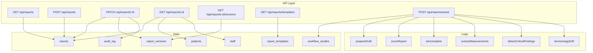
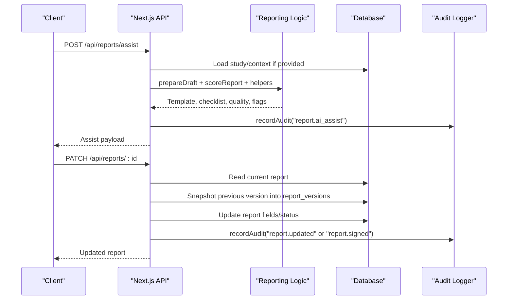
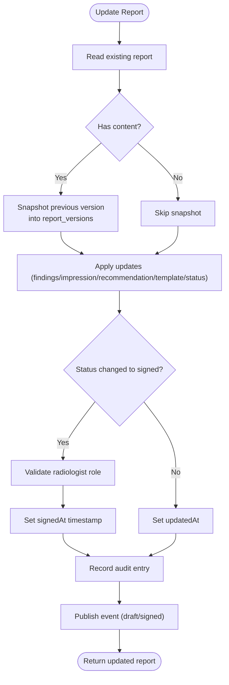
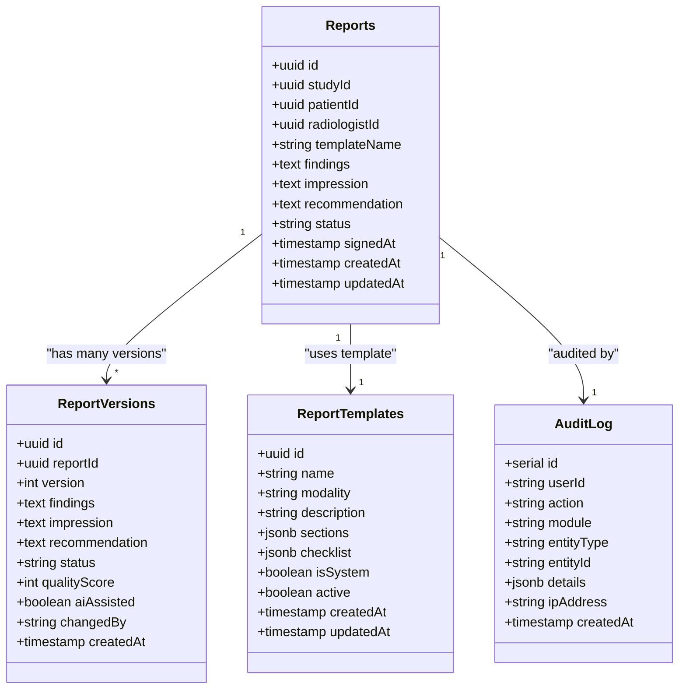

# Reporting System

<cite>
**Referenced Files in This Document**
- [reporting.ts](file://src/lib/reporting.ts)
- [reports route](file://src/app/api/reports/route.ts)
- [templates route](file://src/app/api/reports/templates/route.ts)
- [report detail route](file://src/app/api/reports/[id]/route.ts)
- [versions route](file://src/app/api/reports/[id]/versions/route.ts)
- [assist route](file://src/app/api/reports/assist/route.ts)
- [schema](file://src/db/schema.ts)
- [audit library](file://src/lib/audit.ts)
- [reporting tests](file://__tests__/lib/reporting.test.ts)
</cite>

## Table of Contents
1. Introduction
2. Project Structure
3. Core Components
4. Architecture Overview
5. Detailed Component Analysis
6. Dependency Analysis
7. Performance Considerations
8. Troubleshooting Guide
9. Conclusion
10. Appendices

## Introduction
This document explains the reporting assistant system that supports radiologists with structured, template-driven report authoring, quality scoring, terminology consistency, critical finding detection, measurement extraction, version control, and audit trails. The system provides:
- Template-based report generation (built-in and custom templates)
- Draft assistance with checklists and body-part hints
- Quality assessment and gating
- Versioned history for every change
- Audit logging and event publishing for compliance
- API endpoints for full lifecycle management from draft to signed

The assistant never auto-finalizes a report; signing requires explicit radiologist confirmation.

## Project Structure
The reporting system spans Next.js API routes, a shared logic module, and database schemas:
- API routes under src/app/api/reports handle CRUD, assist, templates, versions
- Shared logic under src/lib/reporting defines templates, quality scoring, terminology checks, and helpers
- Database schema under src/db/schema defines reports, report_templates, report_versions, audit_log, and related entities
- Audit logging via src/lib/audit records actions for compliance

**Diagram sources**
- [reports route:6-45](file://src/app/api/reports/route.ts#L6-L45)
- [report detail route:10-124](file://src/app/api/reports/[id]/route.ts#L10-L124)
- [versions route:8-21](file://src/app/api/reports/[id]/versions/route.ts#L8-L21)
- [templates route:9-29](file://src/app/api/reports/templates/route.ts#L9-L29)
- [assist route:18-116](file://src/app/api/reports/assist/route.ts#L18-L116)
- [schema:166-356](file://src/db/schema.ts#L166-L356)

**Section sources**
- [reports route:6-45](file://src/app/api/reports/route.ts#L6-L45)
- [report detail route:10-124](file://src/app/api/reports/[id]/route.ts#L10-L124)
- [versions route:8-21](file://src/app/api/reports/[id]/versions/route.ts#L8-L21)
- [templates route:9-29](file://src/app/api/reports/templates/route.ts#L9-L29)
- [assist route:18-116](file://src/app/api/reports/assist/route.ts#L18-L116)
- [schema:166-356](file://src/db/schema.ts#L166-L356)

## Core Components
- Template engine: Built-in templates per modality plus custom templates stored in the database. Templates define sections, checklists, and descriptions.
- Draft assistance: Resolves study context, selects appropriate template, and returns suggested sections, checklist, and body-part hints.
- Quality scoring: Evaluates completeness, terminology consistency, placeholder presence, and recommendation requirement based on template.
- Terminology normalization: Detects non-standard terms and suggests canonical British English equivalents.
- Critical findings detection: Scans text for high-priority conditions to highlight urgent items.
- Measurement extraction: Pulls numeric measurements with units from free-text fields.
- Version control: Snapshots previous content before updates; tracks version numbers, status, quality score, AI assistance flag, and changer identity.
- Audit trail: Records user actions, entity changes, and status transitions for compliance.

**Section sources**
- [reporting.ts:9-175](file://src/lib/reporting.ts#L9-L175)
- [reporting.ts:215-325](file://src/lib/reporting.ts#L215-L325)
- [schema:331-356](file://src/db/schema.ts#L331-L356)
- [audit library:1-25](file://src/lib/audit.ts#L1-L25)

## Architecture Overview
The reporting system follows an event-augmented, API-first architecture with clear separation between UI-facing routes and reusable logic.

**Diagram sources**
- [assist route:18-116](file://src/app/api/reports/assist/route.ts#L18-L116)
- [report detail route:40-124](file://src/app/api/reports/[id]/route.ts#L40-L124)
- [schema:166-356](file://src/db/schema.ts#L166-L356)
- [audit library:1-25](file://src/lib/audit.ts#L1-L25)

## Detailed Component Analysis

### Template Management
- Built-in templates are defined in code and cover major modalities (X-Ray, CT, MRI, Ultrasound, Mammography). Each includes sections, checklists, and descriptions.
- Custom templates are stored in the database and merged with built-ins when listing templates.
- The templates endpoint returns both system and custom templates, marking system templates accordingly.

Key behaviors:
- GET /api/reports/templates returns merged list of active custom templates and built-in templates.
- Assist endpoint resolves template by ID or modality and enriches with body-part hints based on procedure keywords.

**Section sources**
- [reporting.ts:24-175](file://src/lib/reporting.ts#L24-L175)
- [templates route:9-29](file://src/app/api/reports/templates/route.ts#L9-L29)
- [assist route:45-64](file://src/app/api/reports/assist/route.ts#L45-L64)

### Draft Creation and Assistance
- The assist endpoint accepts optional studyId to infer modality/procedure, then calls prepareDraft to return a structured shell, checklist, and hints.
- It also computes quality metrics, incomplete sections, critical findings, terminology drift, and extracted measurements for immediate feedback.

Operational flow:
- Resolve study context (if provided)
- Select template (explicit ID > modality match > default)
- Compute quality and flags
- Return comprehensive assist payload without persisting changes

**Section sources**
- [assist route:18-116](file://src/app/api/reports/assist/route.ts#L18-L116)
- [reporting.ts:215-256](file://src/lib/reporting.ts#L215-L256)

### Quality Scoring and Incompleteness Checks
- Quality scoring evaluates multiple weighted checks:
  - Findings length threshold
  - Impression presence and non-generic content
  - Impression not duplicating findings
  - Recommendation presence when required by template
  - No placeholder text
  - Terminology consistency (British English)
  - Report not signed prematurely
- Incomplete report detection lists all failed checks for remediation.

Complexity:
- Linear scan over checks; O(n) where n is number of checks (constant set).

**Section sources**
- [reporting.ts:258-300](file://src/lib/reporting.ts#L258-L300)
- [reporting tests:60-93](file://__tests__/lib/reporting.test.ts#L60-L93)

### Terminology Consistency and Critical Findings
- Terminology drift detection maps non-canonical terms to preferred British English equivalents using word-boundary matching.
- Critical findings detection scans combined text against a curated list of urgent conditions to highlight potential emergencies.

Edge cases:
- Word-boundary matching avoids false positives (e.g., “oedema” vs “edema”).
- Case-insensitive scanning ensures robust detection.

**Section sources**
- [reporting.ts:177-213](file://src/lib/reporting.ts#L177-L213)
- [reporting.ts:308-325](file://src/lib/reporting.ts#L308-L325)
- [reporting tests:118-156](file://__tests__/lib/reporting.test.ts#L118-L156)

### Measurement Extraction
- Extracts numeric measurements with units (mm, cm, mL) and normalizes duplicates.
- Returns up to a capped number of matches to avoid overwhelming UI.

Use cases:
- Populate structured measurement fields in reports
- Support historical comparisons by extracting consistent units

**Section sources**
- [reporting.ts:302-306](file://src/lib/reporting.ts#L302-L306)
- [reporting tests:95-116](file://__tests__/lib/reporting.test.ts#L95-L116)

### Version Control and Report Lifecycle
- Every update to a report snapshots the prior state into report_versions before applying changes.
- Version numbering increments sequentially per report.
- Status transitions are guarded:
  - Signing requires explicit approvedBy field
  - Role validation enforces radiologist role for signing
- Events are published for drafting and signing transitions.
- Audit entries capture action type, entity details, and status changes.

Lifecycle highlights:
- Draft creation via POST /api/reports
- Editing via PATCH /api/reports/:id with version snapshotting
- Finalization via PATCH with status=signed and approvedBy
- History retrieval via GET /api/reports/:id/versions

**Diagram sources**
- [report detail route:40-124](file://src/app/api/reports/[id]/route.ts#L40-L124)
- [schema:166-356](file://src/db/schema.ts#L166-L356)

**Section sources**
- [report detail route:40-124](file://src/app/api/reports/[id]/route.ts#L40-L124)
- [versions route:8-21](file://src/app/api/reports/[id]/versions/route.ts#L8-L21)
- [schema:166-356](file://src/db/schema.ts#L166-L356)

### API Endpoints Summary
- GET /api/reports
  - Lists reports with patient and radiologist context
  - Response includes id, studyId, patientId, templateName, findings, impression, recommendation, status, signedAt, createdAt, and joined patient/staff names
- POST /api/reports
  - Creates a new report row
  - Returns created report
- GET /api/reports/:id
  - Retrieves full report with patient and radiologist context
  - 404 if not found
- PATCH /api/reports/:id
  - Updates draft fields and status
  - Snapshots previous version before mutation
  - Requires approvedBy when setting status to signed
  - Validates radiologist role for signing
  - Records audit and publishes events
- GET /api/reports/:id/versions
  - Returns ordered version history for a report
- GET /api/reports/templates
  - Returns merged list of built-in and active custom templates
- POST /api/reports/assist
  - Provides decision support: template selection, suggested sections, checklist, quality score, incomplete issues, critical findings, terminology drift, measurements, and prior studies

Error handling:
- Invalid bodies return 400
- Not found returns 404
- Unauthorized signing attempts return 403
- Server errors return 500 with error messages

**Section sources**
- [reports route:6-45](file://src/app/api/reports/route.ts#L6-L45)
- [report detail route:10-124](file://src/app/api/reports/[id]/route.ts#L10-L124)
- [versions route:8-21](file://src/app/api/reports/[id]/versions/route.ts#L8-L21)
- [templates route:9-29](file://src/app/api/reports/templates/route.ts#L9-L29)
- [assist route:18-116](file://src/app/api/reports/assist/route.ts#L18-L116)

## Dependency Analysis
- API routes depend on:
  - Database schema for data access
  - Reporting logic for template resolution, quality scoring, and analysis
  - Audit library for compliance logging
  - Event publishing for workflow notifications
- Data relationships:
  - reports links to patients and staff
  - report_versions link to reports
  - report_templates store custom structures
  - audit_log captures actions across modules

**Diagram sources**
- [schema:166-356](file://src/db/schema.ts#L166-L356)

**Section sources**
- [schema:166-356](file://src/db/schema.ts#L166-L356)

## Performance Considerations
- Quality scoring and terminology checks operate over small fixed sets; complexity is linear and negligible for typical report sizes.
- Measurement extraction uses regex scanning; results are capped to prevent large payloads.
- Version snapshots occur only when content exists; this adds minimal overhead during updates.
- Template merging combines built-in and custom templates once per request; caching could be considered for high-throughput scenarios.

[No sources needed since this section provides general guidance]

## Troubleshooting Guide
Common issues and resolutions:
- Invalid request body: Ensure JSON structure matches expected fields; assist expects optional studyId, reportId, findings, impression, recommendation, templateId, modality, procedure, clinicalIndication.
- Report not found: Verify report id exists before attempting updates or version retrieval.
- Signing failures:
  - Missing approvedBy: Include approvedBy when setting status to signed.
  - Role validation: Ensure the session has radiologist role; otherwise signing will be rejected.
- Quality score low:
  - Expand findings and impression beyond minimum lengths
  - Avoid placeholder text like “[TBD]” or “xxx”
  - Use consistent terminology (British English)
  - Add recommendation if template requires it
- Version history empty:
  - Versions are created only when there is existing content; ensure at least one of findings, impression, or recommendation is present before updating.

**Section sources**
- [report detail route:47-72](file://src/app/api/reports/[id]/route.ts#L47-L72)
- [reporting.ts:273-300](file://src/lib/reporting.ts#L273-L300)
- [reporting tests:60-93](file://__tests__/lib/reporting.test.ts#L60-L93)

## Conclusion
The reporting assistant delivers a robust, compliant framework for radiologists to author structured reports with strong safeguards:
- Template-driven standardization across modalities
- Real-time quality scoring and terminology normalization
- Critical finding detection and measurement extraction
- Immutable version history and comprehensive audit trails
- Explicit sign-off requiring radiologist confirmation

These capabilities support standardized reporting, regulatory compliance, and historical comparison workflows while maintaining safety and clarity.

[No sources needed since this section summarizes without analyzing specific files]

## Appendices

### Example Workflows

#### Standardized Report Generation
- Use POST /api/reports/assist with modality or templateId to obtain a structured shell and checklist.
- Edit findings, impression, and recommendation; re-run assist to see updated quality score and flags.
- Save via PATCH /api/reports/:id; versions are automatically captured.

#### Regulatory Compliance
- Signing requires approvedBy and radiologist role validation.
- All changes are audited; retrieve version history for any report to demonstrate traceability.

#### Historical Report Comparison
- Retrieve versions via GET /api/reports/:id/versions to compare past states.
- Use measurement extraction to track changes in lesion sizes or organ dimensions over time.

**Section sources**
- [assist route:18-116](file://src/app/api/reports/assist/route.ts#L18-L116)
- [report detail route:40-124](file://src/app/api/reports/[id]/route.ts#L40-L124)
- [versions route:8-21](file://src/app/api/reports/[id]/versions/route.ts#L8-L21)