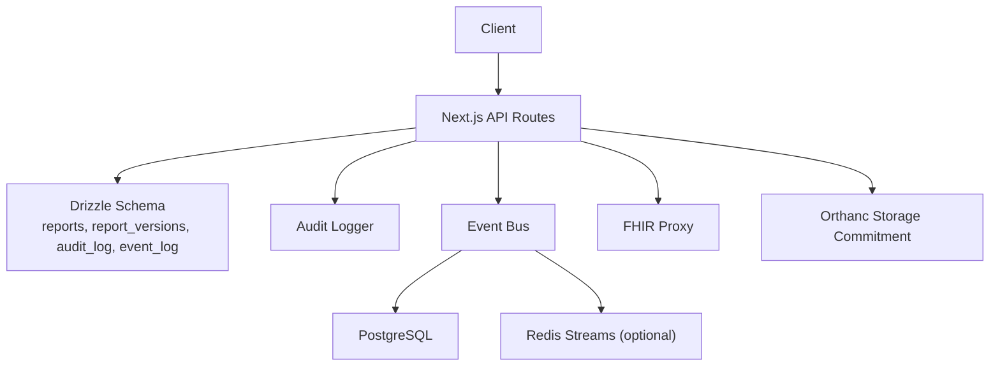
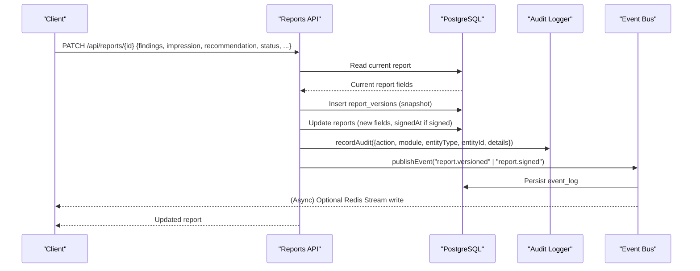
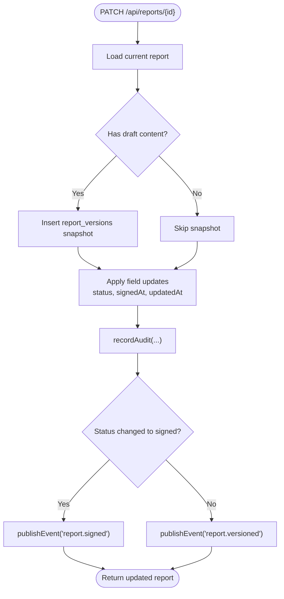
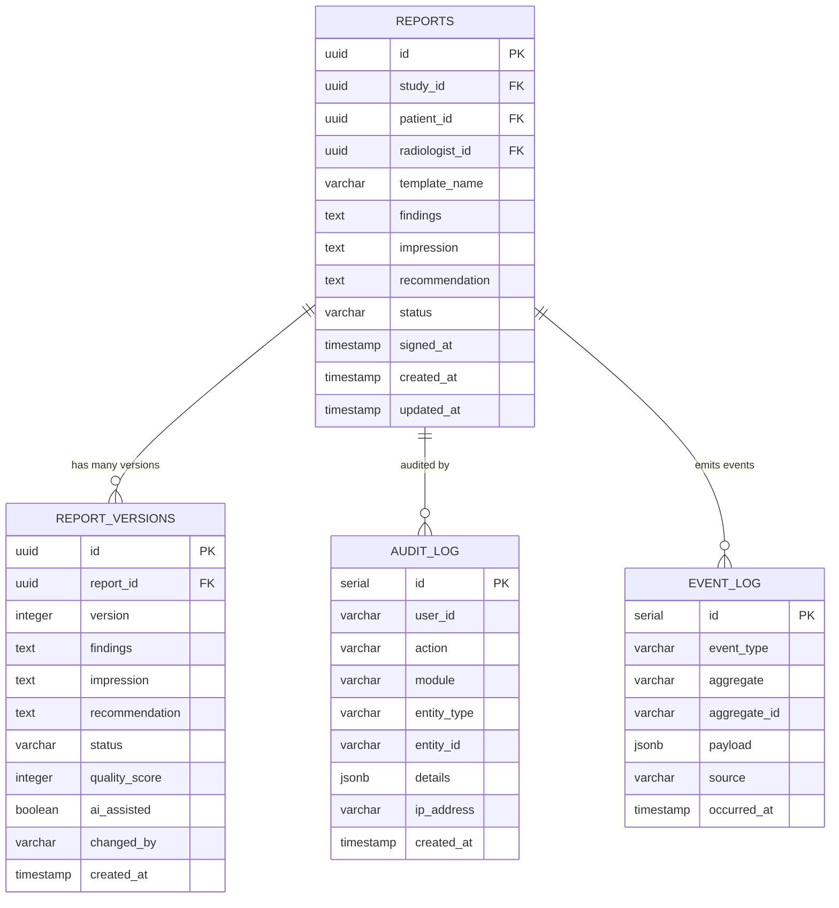
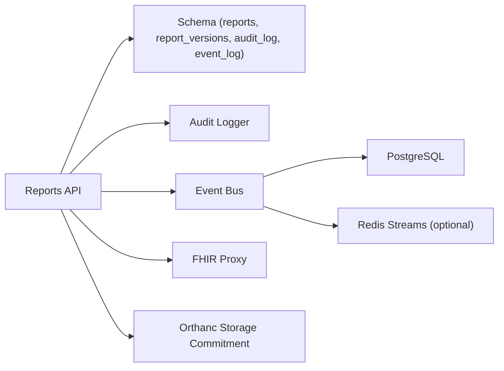

# Version Control & Audit Trail

<cite>
**Referenced Files in This Document**
- [schema.ts](file://src/db/schema.ts)
- [route.ts](file://src/app/api/reports/[id]/route.ts)
- [versions route.ts](file://src/app/api/reports/[id]/versions/route.ts)
- [audit.ts](file://src/lib/audit.ts)
- [events.ts](file://src/lib/events.ts)
- [reporting.ts](file://src/lib/reporting.ts)
- [fhir route.ts](file://src/app/api/fhir/route.ts)
- [storage-commitment route.ts](file://src/app/api/orthanc/storage-commitment/route.ts)
- [integrations index.ts](file://src/lib/integrations/index.ts)
- [events.test.ts](file://__tests__\lib\events.test.ts)
</cite>

## Table of Contents
1. Introduction
2. Project Structure
3. Core Components
4. Architecture Overview
5. Detailed Component Analysis
6. Dependency Analysis
7. Performance Considerations
8. Troubleshooting Guide
9. Conclusion
10. Appendices

## Introduction
This document explains the report version control and audit trail capabilities implemented in the platform. It covers how versions are created, retrieved, compared, and used to support rollback workflows; how changes are tracked with user attribution and timestamps; and how the system supports compliance reporting and integration with electronic health record systems (FHIR) and PACS (Orthanc). It also outlines data retention considerations and archival strategies grounded in the existing event log and storage commitment features.

## Project Structure
The version control and audit trail functionality spans:
- API endpoints for reports and their version history
- Database schema definitions for reports, report versions, audit logs, and events
- A centralized audit logger
- An event bus that persists domain events and can publish to Redis Streams
- Reporting assistant utilities that influence quality scoring and change metadata
- Integrations with FHIR and Orthanc for EHR/PACS interoperability

**Diagram sources**
- [route.ts:47-124](file://src/app/api/reports/[id]/route.ts#L47-L124)
- [versions route.ts:9-21](file://src/app/api/reports/[id]/versions/route.ts#L9-L21)
- [schema.ts:167-193](file://src/db/schema.ts#L167-L193)
- [schema.ts:344-356](file://src/db/schema.ts#L344-L356)
- [events.ts:101-131](file://src/lib/events.ts#L101-L131)
- [fhir route.ts:10-38](file://src/app/api/fhir/route.ts#L10-L38)
- [storage-commitment route.ts:13-39](file://src/app/api/orthanc/storage-commitment/route.ts#L13-L39)

**Section sources**
- [route.ts:47-124](file://src/app/api/reports/[id]/route.ts#L47-L124)
- [versions route.ts:9-21](file://src/app/api/reports/[id]/versions/route.ts#L9-L21)
- [schema.ts:167-193](file://src/db/schema.ts#L167-L193)
- [schema.ts:344-356](file://src/db/schema.ts#L344-L356)
- [events.ts:101-131](file://src/lib/events.ts#L101-L131)
- [fhir route.ts:10-38](file://src/app/api/fhir/route.ts#L10-L38)
- [storage-commitment route.ts:13-39](file://src/app/api/orthanc/storage-commitment/route.ts#L13-L39)

## Core Components
- Report versioning on update: When a report is updated via PATCH, the current content is snapshotted into report_versions before mutation. The next version number is computed from the latest stored version.
- Version retrieval: A dedicated endpoint returns the full ordered version history for a given report.
- Audit logging: Every significant action writes an audit_log entry with user attribution, module, entity type/id, and details.
- Event persistence: Domain events such as report.versioned and report.signed are persisted to event_log and optionally published to Redis Streams.
- Quality and AI metadata: Updates may include qualityScore and aiAssisted flags, which are captured in the version snapshot.
- Compliance integrations: FHIR proxy enables EHR interoperability; Orthanc storage commitment supports regulatory assurance of image storage.

**Section sources**
- [route.ts:76-121](file://src/app/api/reports/[id]/route.ts#L76-L121)
- [versions route.ts:9-21](file://src/app/api/reports/[id]/versions/route.ts#L9-L21)
- [audit.ts:4-24](file://src/lib/audit.ts#L4-L24)
- [events.ts:101-131](file://src/lib/events.ts#L101-L131)
- [schema.ts:167-193](file://src/db/schema.ts#L167-L193)
- [schema.ts:344-356](file://src/db/schema.ts#L344-L356)

## Architecture Overview
The version control flow ensures immutability of prior states by snapshotting before mutation. Audit trails and events provide a durable, queryable record of who did what and when.

**Diagram sources**
- [route.ts:47-124](file://src/app/api/reports/[id]/route.ts#L47-L124)
- [audit.ts:4-24](file://src/lib/audit.ts#L4-L24)
- [events.ts:101-131](file://src/lib/events.ts#L101-L131)
- [schema.ts:167-193](file://src/db/schema.ts#L167-L193)
- [schema.ts:344-356](file://src/db/schema.ts#L344-L356)

## Detailed Component Analysis

### Report Version Creation and Retrieval
- Version creation occurs during report updates. Before applying changes, the current findings, impression, recommendation, status, and optional quality/AI metadata are inserted into report_versions with an incremented version number.
- Version retrieval lists all versions for a report, ordered by version number.

**Diagram sources**
- [route.ts:47-124](file://src/app/api/reports/[id]/route.ts#L47-L124)

**Section sources**
- [route.ts:47-124](file://src/app/api/reports/[id]/route.ts#L47-L124)
- [versions route.ts:9-21](file://src/app/api/reports/[id]/versions/route.ts#L9-L21)

### Data Model and Relationships
Key entities involved in versioning and auditing:
- reports: current mutable state of a report
- report_versions: immutable snapshots of report content per version
- audit_log: immutable log of actions with user attribution and details
- event_log: durable event stream for domain events

**Diagram sources**
- [schema.ts:167-193](file://src/db/schema.ts#L167-L193)
- [schema.ts:344-356](file://src/db/schema.ts#L344-L356)

**Section sources**
- [schema.ts:167-193](file://src/db/schema.ts#L167-L193)
- [schema.ts:344-356](file://src/db/schema.ts#L344-L356)

### Audit Log Structure and User Attribution
- Each audit entry records:
  - userId: defaults to "system" when not provided
  - action: descriptive action string (e.g., report.updated, report.signed)
  - module: subsystem name (e.g., reporting)
  - entityType/entityId: target entity identity
  - details: structured JSON with context (e.g., new status, approvedBy)
  - createdAt: automatic timestamp
- The audit logger is resilient: failures are logged but do not break the caller.

**Section sources**
- [audit.ts:4-24](file://src/lib/audit.ts#L4-L24)
- [schema.ts:182-193](file://src/db/schema.ts#L182-L193)

### Event-Driven Tracking and Compliance Signals
- Domain events emitted include report.versioned and report.signed, persisted to event_log and optionally streamed to Redis.
- These events enable activity feeds, compliance dashboards, and downstream processing without tight coupling.

**Section sources**
- [events.ts:101-131](file://src/lib/events.ts#L101-L131)
- [events.test.ts:54-75](file://__tests__\lib\events.test.ts#L54-L75)

### Version Diff Visualization
- Clients can retrieve the full version history via GET /api/reports/{id}/versions and compute diffs between consecutive versions to visualize changes in findings, impression, recommendation, status, qualityScore, and aiAssisted flags.
- Suggested client-side diff approach:
  - Compare text fields using line-based or token-based diff libraries
  - Highlight additions/removals in UI
  - Show side-by-side view with version selector

[No sources needed since this section describes a client-side visualization pattern]

### Rollback Capabilities
- While no explicit “rollback” endpoint exists, rollback can be achieved by:
  - Reading a previous version from report_versions
  - Applying its content back to the current report via PATCH
  - The system will create a new version snapshot of the pre-rollback state, preserving history
- This preserves an auditable chain of changes and maintains integrity.

**Section sources**
- [versions route.ts:9-21](file://src/app/api/reports/[id]/versions/route.ts#L9-L21)
- [route.ts:47-124](file://src/app/api/reports/[id]/route.ts#L47-L124)

### Change Tracking and Quality Metadata
- Versions capture:
  - Content fields (findings, impression, recommendation)
  - Status at time of snapshot
  - qualityScore and aiAssisted flags when present
- This supports quality gates and traceability of AI-assisted contributions.

**Section sources**
- [schema.ts:344-356](file://src/db/schema.ts#L344-L356)
- [route.ts:76-95](file://src/app/api/reports/[id]/route.ts#L76-L95)

### Regulatory Compliance Reporting
- Audit trail:
  - Use audit_log to reconstruct who modified what and when
  - Filter by module, entity type, or entity id for targeted audits
- Event log:
  - Use event_log to build timelines of key milestones (drafted, versioned, signed)
- Storage commitment:
  - Orthanc storage commitment endpoint verifies safe storage of imaging instances, supporting regulatory requirements for evidence retention.

**Section sources**
- [schema.ts:182-193](file://src/db/schema.ts#L182-L193)
- [schema.ts:446-455](file://src/db/schema.ts#L446-L455)
- [storage-commitment route.ts:13-39](file://src/app/api/orthanc/storage-commitment/route.ts#L13-L39)

### Integration with Electronic Health Record Systems (FHIR)
- FHIR proxy forwards queries to HAPI FHIR, enabling interoperability with EHR systems.
- Useful for linking reports to FHIR DiagnosticReport or ImagingStudy resources where supported by upstream services.

**Section sources**
- [fhir route.ts:10-38](file://src/app/api/fhir/route.ts#L10-L38)

### Data Retention Policies and Archival Strategies
- Event log:
  - Uses PostgreSQL for durability; consider periodic archival or partitioning by date for long-term retention
  - Redis Streams (when configured) are capped, ensuring bounded memory usage
- Report versions:
  - Grows with each update; consider lifecycle policies to archive older versions based on retention rules
- Audit log:
  - Append-only; implement retention windows and secure archival for compliance
- Storage commitment:
  - Confirms persistent storage in PACS; combine with institutional retention policies for images and reports

[No sources needed since this section provides general guidance grounded in existing components]

## Dependency Analysis
The following diagram shows runtime dependencies among core components:

**Diagram sources**
- [route.ts:47-124](file://src/app/api/reports/[id]/route.ts#L47-L124)
- [audit.ts:4-24](file://src/lib/audit.ts#L4-L24)
- [events.ts:101-131](file://src/lib/events.ts#L101-L131)
- [fhir route.ts:10-38](file://src/app/api/fhir/route.ts#L10-L38)
- [storage-commitment route.ts:13-39](file://src/app/api/orthanc/storage-commitment/route.ts#L13-L39)

**Section sources**
- [route.ts:47-124](file://src/app/api/reports/[id]/route.ts#L47-L124)
- [events.ts:101-131](file://src/lib/events.ts#L101-L131)

## Performance Considerations
- Version snapshots are created only when the report has existing draft content, minimizing unnecessary writes.
- Event publishing attempts Redis first (best-effort) then falls back to durable PostgreSQL writes, ensuring resilience under load.
- Version listing queries filter by reportId and order by version, which should be indexed for performance.
- Consider database indexing strategies for:
  - report_versions(reportId, version)
  - audit_log(entityType, entityId, createdAt)
  - event_log(eventType, occurredAt)

[No sources needed since this section provides general guidance]

## Troubleshooting Guide
- Audit write failures:
  - The audit logger catches errors and logs them; verify database connectivity and permissions if audit entries are missing.
- Event persistence failures:
  - If event_log writes fail, check database availability; Redis unavailability is tolerated and does not block operations.
- Version retrieval errors:
  - Ensure the report exists and that the versions endpoint is called with the correct reportId.
- Signing restrictions:
  - Signing requires explicit approval and appropriate role; ensure session/role checks are satisfied.

**Section sources**
- [audit.ts:21-24](file://src/lib/audit.ts#L21-L24)
- [events.ts:115-130](file://src/lib/events.ts#L115-L130)
- [versions route.ts:18-20](file://src/app/api/reports/[id]/versions/route.ts#L18-L20)
- [route.ts:55-72](file://src/app/api/reports/[id]/route.ts#L55-L72)

## Conclusion
The platform implements robust report version control with immutable snapshots, comprehensive audit logging, and an event-driven architecture that supports compliance and interoperability. Version histories enable comparison and rollback workflows while preserving a complete audit trail. Integrations with FHIR and Orthanc facilitate EHR/PACS interoperability and regulatory assurance. Operational safeguards ensure reliability even when external services are unavailable.

## Appendices

### Example Workflows

- Version diff visualization:
  - Retrieve versions via GET /api/reports/{id}/versions
  - Compute diffs between consecutive versions on the client
  - Render changes in a side-by-side or unified diff view

- Audit report generation:
  - Query audit_log filtered by module, entity type, and date range
  - Aggregate counts and export for compliance review

- Regulatory compliance reporting:
  - Combine audit_log and event_log to produce timelines of critical actions
  - Use Orthanc storage commitment to confirm image retention

[No sources needed since these are example workflows derived from existing APIs]