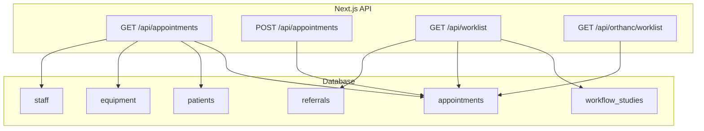
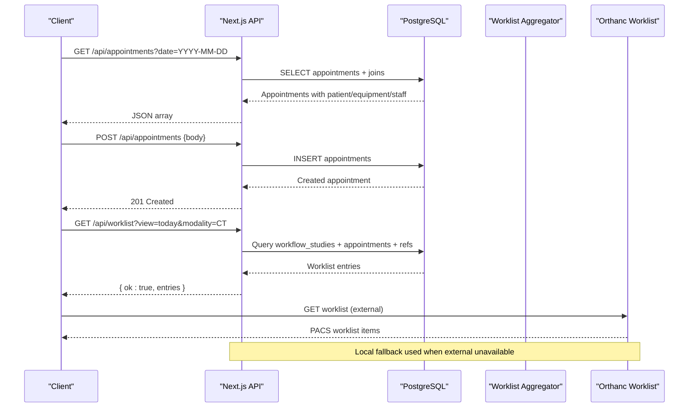
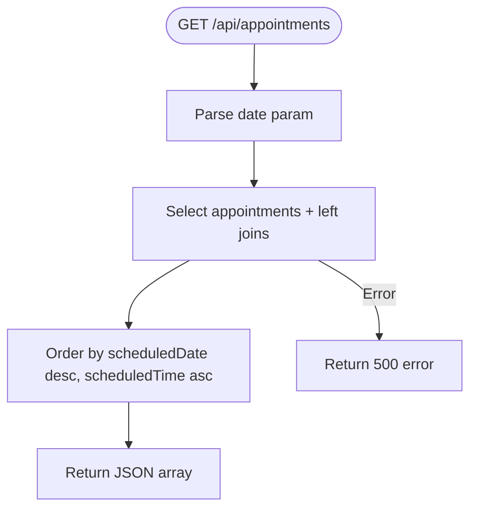
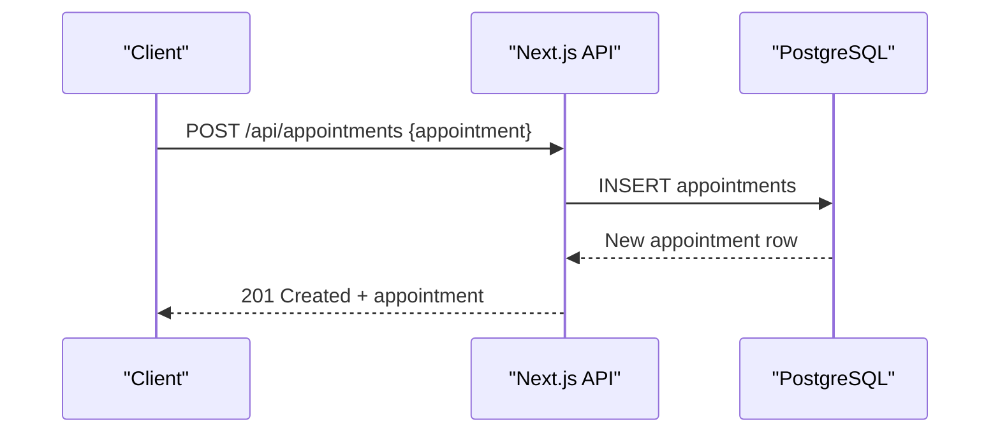
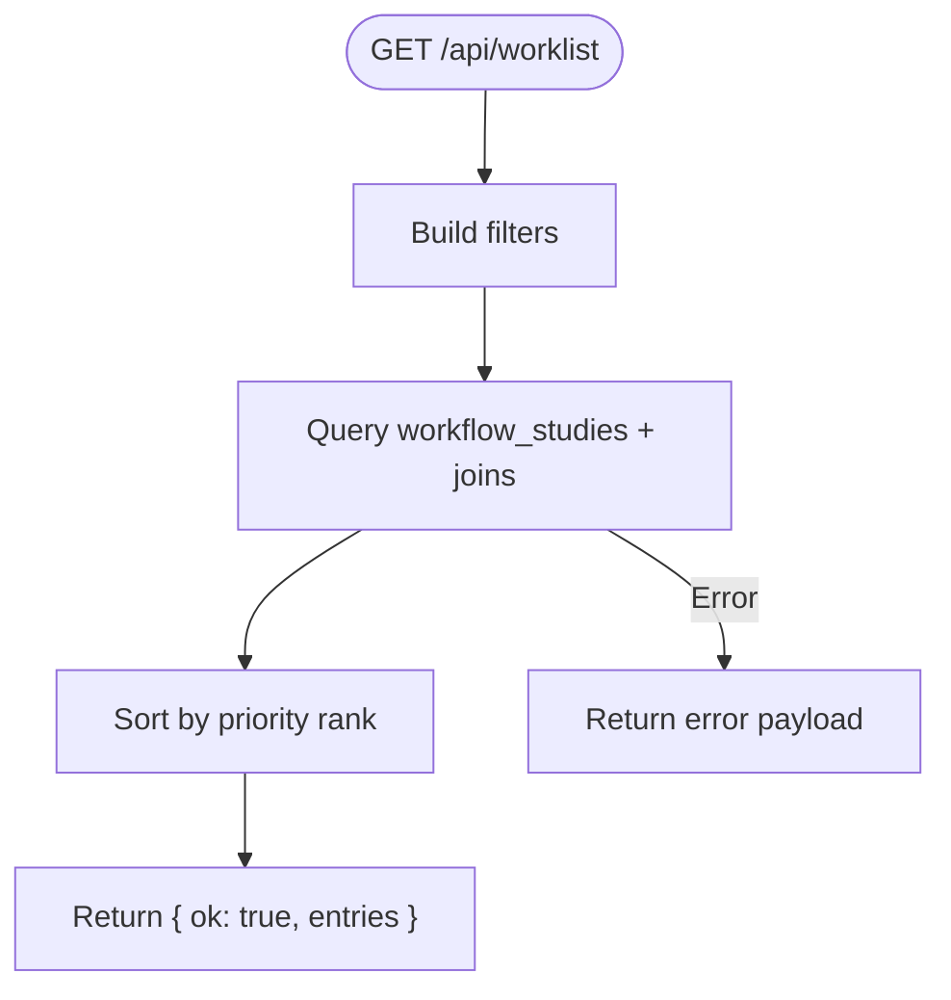
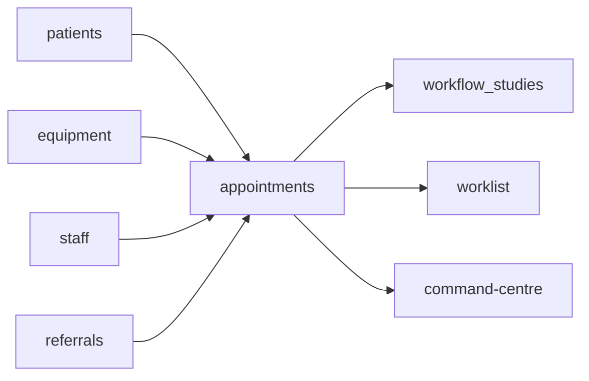

# Appointment Management

<cite>
**Referenced Files in This Document**
- [route.ts](file://src/app/api/appointments/route.ts)
- [schema.ts](file://src/db/schema.ts)
- [worklist route.ts](file://src/app/api/worklist/route.ts)
- [orthanc worklist route.ts](file://src/app/api/orthanc/worklist/route.ts)
- [command-centre.ts](file://src/lib/command-centre.ts)
- [seed route.ts](file://src/app/api/seed/route.ts)
- [main.py](file://backend/app/main.py)
- [orchestration.py](file://backend/app/agents/orchestration.py)
</cite>

## Table of Contents
1. [Introduction](#introduction)
2. [Project Structure](#project-structure)
3. [Core Components](#core-components)
4. [Architecture Overview](#architecture-overview)
5. [Detailed Component Analysis](#detailed-component-analysis)
6. [Dependency Analysis](#dependency-analysis)
7. [Performance Considerations](#performance-considerations)
8. [Troubleshooting Guide](#troubleshooting-guide)
9. [Conclusion](#conclusion)
10. [Appendices](#appendices)

## Introduction
This document describes the appointment management functionality in the platform, covering the complete lifecycle from creation to completion and cancellation. It explains the data model for appointments, API endpoints for reading and creating appointments, query filtering by date, response schemas, validation rules, business logic, conflict detection, time slot management, and integration with patients, equipment, and staff systems.

## Project Structure
Appointment-related functionality spans several modules:
- Next.js API routes for listing and creating appointments
- Database schema defining the appointments entity and related tables (patients, equipment, staff)
- Worklist endpoints that surface scheduled appointments for radiology workflows
- Command centre utilities that compute operational metrics including appointment delays and queues
- Seed scripts that populate sample appointments and workflow studies
- A Python backend module exposing scheduling endpoints and agent-based scheduling logic

**Diagram sources**
- [route.ts:6-50](file://src/app/api/appointments/route.ts#L6-L50)
- [worklist route.ts:26-118](file://src/app/api/worklist/route.ts#L26-L118)
- [orthanc worklist route.ts:44-79](file://src/app/api/orthanc/worklist/route.ts#L44-L79)
- [schema.ts:17-119](file://src/db/schema.ts#L17-L119)

**Section sources**
- [route.ts:6-50](file://src/app/api/appointments/route.ts#L6-L50)
- [schema.ts:17-119](file://src/db/schema.ts#L17-L119)
- [worklist route.ts:26-118](file://src/app/api/worklist/route.ts#L26-L118)
- [orthanc worklist route.ts:44-79](file://src/app/api/orthanc/worklist/route.ts#L44-L79)

## Core Components
- Appointments table defines the core fields used across scheduling and workflow:
  - Identifier and relationships: id, patientId, referralId, equipmentId, radiographerId
  - Scheduling fields: scheduledDate, scheduledTime, duration
  - Clinical fields: modality, procedure, priority
  - Lifecycle fields: status, notes, checkedIn, checkedInAt
  - Audit timestamps: createdAt, updatedAt
- Related entities:
  - Patients: identity and demographics
  - Equipment: imaging devices and modalities
  - Staff: radiographers and clinicians
  - Workflow studies: link between appointments and imaging workflow stages
  - Referrals: clinical context and indication

**Section sources**
- [schema.ts:17-119](file://src/db/schema.ts#L17-L119)

## Architecture Overview
The appointment system integrates multiple layers:
- API layer exposes GET and POST endpoints for appointments and worklist queries
- Data layer uses Drizzle ORM to read/write relational data
- Operational layer aggregates KPIs, queues, and delays using command centre utilities
- External integrations include Orthanc worklist fallback and a Python backend scheduling service

**Diagram sources**
- [route.ts:6-50](file://src/app/api/appointments/route.ts#L6-L50)
- [worklist route.ts:26-118](file://src/app/api/worklist/route.ts#L26-L118)
- [orthanc worklist route.ts:44-79](file://src/app/api/orthanc/worklist/route.ts#L44-L79)

## Detailed Component Analysis

### Appointments Data Model
- Fields:
  - scheduledDate: Date of the appointment
  - scheduledTime: Time of day
  - duration: Minutes allocated
  - modality: Imaging type (e.g., CT, MRI, X-Ray, Ultrasound)
  - procedure: Specific exam or test
  - priority: Routine, urgent, stat, emergency
  - status: Scheduled, checked_in, in_progress, completed, cancelled
  - checkedIn: Boolean flag indicating check-in
  - checkedInAt: Timestamp of check-in
  - Notes and audit timestamps for traceability
- Relationships:
  - patientId links to patients
  - equipmentId links to equipment
  - radiographerId links to staff
  - referralId links to referrals for clinical context

**Section sources**
- [schema.ts:17-119](file://src/db/schema.ts#L17-L119)

### API Endpoints

#### GET /api/appointments
- Purpose: Retrieve appointments with enriched patient, equipment, and staff details
- Query parameters:
  - date: Optional filter by scheduledDate (parsed but not applied in current implementation)
- Response schema: Array of objects containing appointment fields plus joined names and identifiers
- Error handling: Returns 500 with error message on failure

**Diagram sources**
- [route.ts:6-40](file://src/app/api/appointments/route.ts#L6-L40)

**Section sources**
- [route.ts:6-40](file://src/app/api/appointments/route.ts#L6-L40)

#### POST /api/appointments
- Purpose: Create a new appointment
- Request body: Appointment fields matching the schema (patientId, equipmentId, radiographerId, scheduledDate, scheduledTime, duration, modality, procedure, priority, status, notes)
- Response: Created appointment object with 201 status
- Error handling: Returns 500 with error message on failure

**Diagram sources**
- [route.ts:42-50](file://src/app/api/appointments/route.ts#L42-L50)

**Section sources**
- [route.ts:42-50](file://src/app/api/appointments/route.ts#L42-L50)

### Worklist Integration
- The worklist endpoint aggregates workflow studies and associated appointments to present a comprehensive view for radiology operations
- Supports filters such as view modes (today, unread, stat, emergency, assigned, completed), modality, priority, stage, and free-text search
- Excludes completed or cancelled appointments when generating local worklist fallback

**Diagram sources**
- [worklist route.ts:26-118](file://src/app/api/worklist/route.ts#L26-L118)

**Section sources**
- [worklist route.ts:26-118](file://src/app/api/worklist/route.ts#L26-L118)

### Orthanc Worklist Fallback
- Provides a local fallback by querying scheduled appointments for a given date and excluding completed/cancelled statuses
- Optionally filters by modality and returns source metadata indicating local origin

**Section sources**
- [orthanc worklist route.ts:44-79](file://src/app/api/orthanc/worklist/route.ts#L44-L79)

### Command Centre Metrics
- Computes operational snapshots including:
  - Today’s appointments count and check-ins
  - Queue per equipment (waiting vs in-progress)
  - Appointment delays for today’s scheduled appointments past their scheduled time
  - Equipment utilization and maintenance alerts
- Uses appointments status values to determine waiting and in-progress counts

**Section sources**
- [command-centre.ts:54-206](file://src/lib/command-centre.ts#L54-L206)

### Backend Scheduling Service
- Python backend exposes endpoints for creating and listing appointments
- Creates appointments with default status and supports scheduling start/end times
- Agent orchestration includes scheduling agent logic for machine allocation and conflict detection

**Section sources**
- [main.py:72-109](file://backend/app/main.py#L72-L109)
- [orchestration.py:41-67](file://backend/app/agents/orchestration.py#L41-L67)

### Seed Data Examples
- Demonstrates realistic appointment records with varied modalities, priorities, statuses, and durations
- Links appointments to patients, referrals, equipment, and staff for testing and demos

**Section sources**
- [seed route.ts:128-140](file://src/app/api/seed/route.ts#L128-L140)

## Dependency Analysis
- Appointments depend on:
  - Patients for identity and demographics
  - Equipment for resource allocation and modality constraints
  - Staff for radiographer assignment
  - Referrals for clinical indication
  - Workflow studies for downstream imaging workflow linkage
- Worklist depends on appointments and referrals to provide clinical context
- Command centre depends on appointments, equipment, staff, and maintenance records for operational insights

**Diagram sources**
- [schema.ts:17-119](file://src/db/schema.ts#L17-L119)
- [worklist route.ts:26-118](file://src/app/api/worklist/route.ts#L26-L118)
- [command-centre.ts:54-206](file://src/lib/command-centre.ts#L54-L206)

**Section sources**
- [schema.ts:17-119](file://src/db/schema.ts#L17-L119)
- [worklist route.ts:26-118](file://src/app/api/worklist/route.ts#L26-L118)
- [command-centre.ts:54-206](file://src/lib/command-centre.ts#L54-L206)

## Performance Considerations
- Use indexed columns for frequent filters:
  - scheduledDate and scheduledTime for daily queries
  - equipmentId and status for queue calculations
  - patientId and referralId for joins
- Avoid unnecessary joins in high-volume endpoints; consider materialized views for worklist if needed
- Batch operations for seeding and bulk updates
- Leverage pagination for large appointment lists

[No sources needed since this section provides general guidance]

## Troubleshooting Guide
- GET /api/appointments errors:
  - Check database connectivity and permissions
  - Validate join keys (patientId, equipmentId, radiographerId) exist
  - Inspect error responses for SQL or ORM issues
- POST /api/appointments errors:
  - Ensure required fields are present and valid types
  - Verify foreign key references exist in patients, equipment, staff
  - Handle unique constraint violations if any
- Worklist loading failures:
  - Confirm workflow_studies and referrals data integrity
  - Validate filter parameters and date formats
- Command centre anomalies:
  - Verify equipment status and maintenance records
  - Check appointment statuses and timestamps for delay calculations

**Section sources**
- [route.ts:37-49](file://src/app/api/appointments/route.ts#L37-L49)
- [worklist route.ts:112-118](file://src/app/api/worklist/route.ts#L112-L118)
- [command-centre.ts:54-206](file://src/lib/command-centre.ts#L54-L206)

## Conclusion
The appointment management system provides robust CRUD capabilities through Next.js API routes, integrates deeply with patient, equipment, and staff data, and supports operational visibility via worklist and command centre utilities. While basic conflict detection is present in the backend agents, additional validation and conflict checks can be implemented at the API layer to ensure scheduling integrity. The data model and endpoints enable flexible querying, filtering, and reporting for radiology workflows.

[No sources needed since this section summarizes without analyzing specific files]

## Appendices

### Appointment Lifecycle States
- scheduled: Initial state after creation
- checked_in: Patient has arrived and checked in
- in_progress: Procedure or exam is underway
- completed: Procedure finished and results pending or available
- cancelled: Appointment cancelled before completion

**Section sources**
- [schema.ts:82-100](file://src/db/schema.ts#L82-L100)
- [orthanc worklist route.ts:65-67](file://src/app/api/orthanc/worklist/route.ts#L65-L67)

### Validation Rules and Business Logic
- Required fields:
  - patientId, scheduledDate, scheduledTime, duration, modality, procedure, priority
- Default values:
  - duration defaults to 30 minutes
  - priority defaults to routine
  - status defaults to scheduled
- Status transitions:
  - Checked-in updates checkedIn flag and recorded timestamp
  - Completed and cancelled statuses exclude appointments from active worklists
- Conflict detection:
  - Backend scheduling agent evaluates machine availability and radiographer conflicts
  - Reallocation requires equipment context and affected appointment IDs

**Section sources**
- [schema.ts:82-100](file://src/db/schema.ts#L82-L100)
- [orchestration.py:41-67](file://backend/app/agents/orchestration.py#L41-L67)

### API Usage Examples
- List appointments for a specific date:
  - GET /api/appointments?date=YYYY-MM-DD
  - Response: Array of appointment objects with joined patient, equipment, and staff details
- Create an appointment:
  - POST /api/appointments with body containing required fields
  - Response: Created appointment object with 201 status

**Section sources**
- [route.ts:6-50](file://src/app/api/appointments/route.ts#L6-L50)

### Time Slot Management
- Duration field determines slot length in minutes
- Worklist orders by scheduledTime to sequence slots
- Command centre calculates delays based on current time versus scheduledTime for today’s appointments

**Section sources**
- [worklist route.ts:65-71](file://src/app/api/worklist/route.ts#L65-L71)
- [command-centre.ts:122-132](file://src/lib/command-centre.ts#L122-L132)

### Integration Points
- Patient system: Linked via patientId for demographic and MRN data
- Equipment system: Linked via equipmentId for modality and location
- Staff system: Linked via radiographerId for assignment and names
- Orthanc PACS: Worklist fallback uses local appointments when external service unavailable

**Section sources**
- [schema.ts:17-119](file://src/db/schema.ts#L17-L119)
- [orthanc worklist route.ts:44-79](file://src/app/api/orthanc/worklist/route.ts#L44-L79)