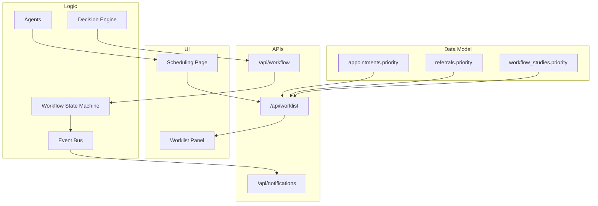
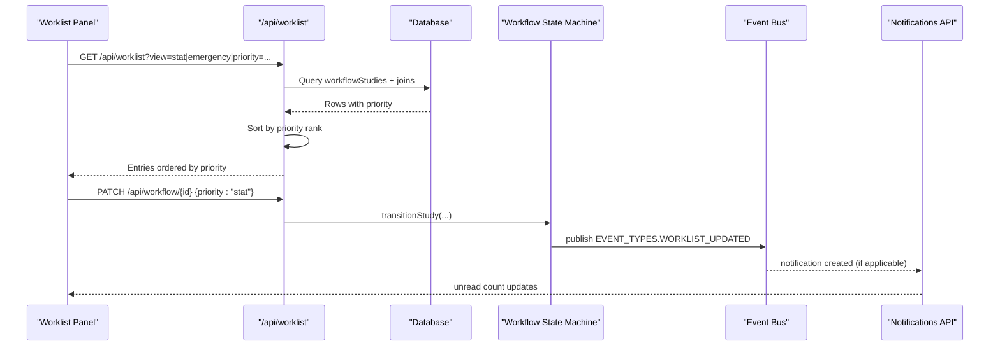
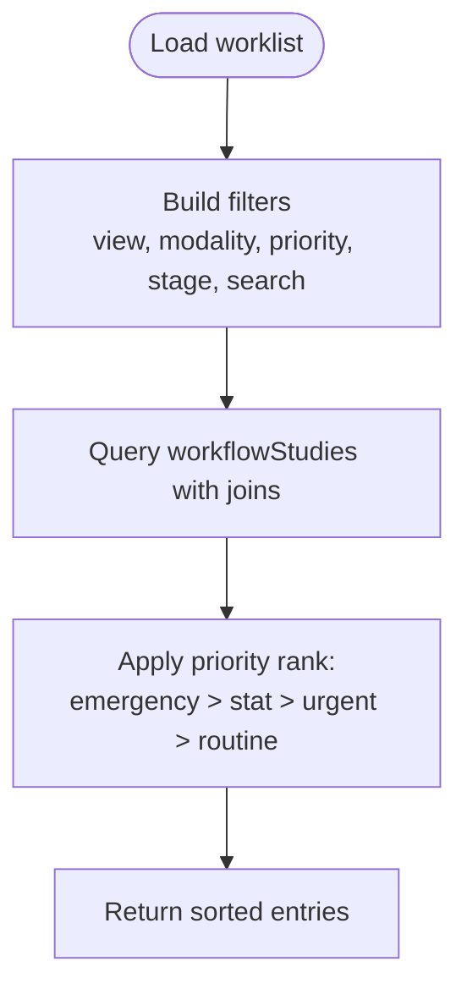
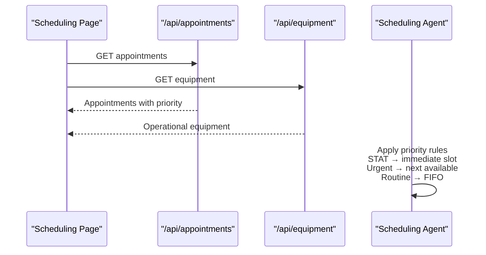
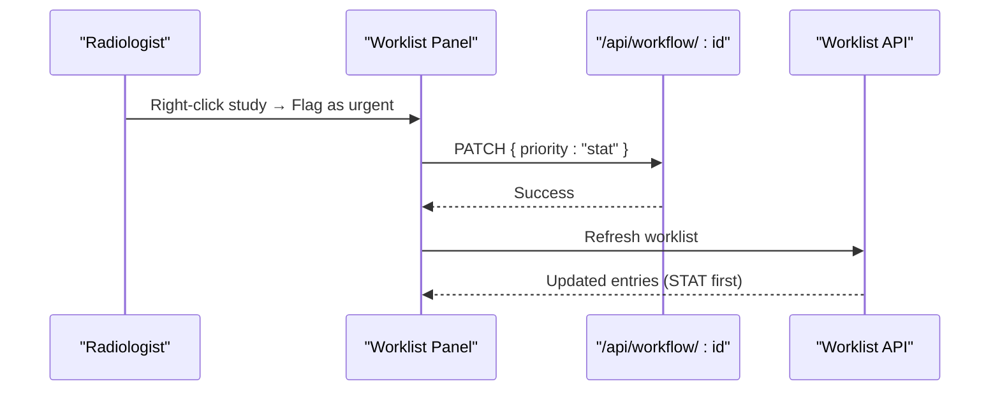
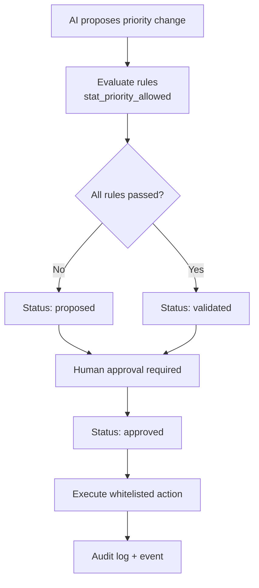
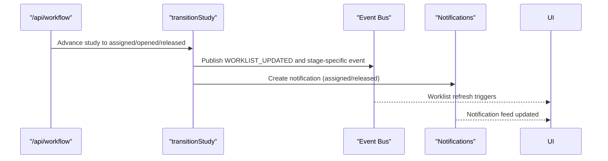
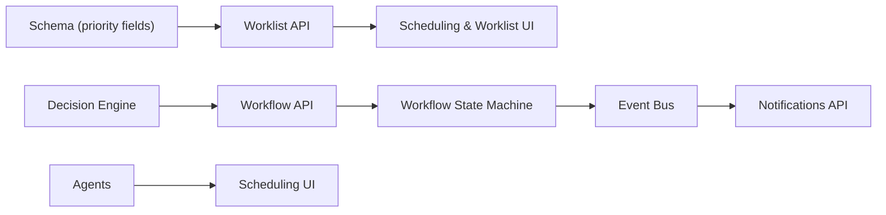

# Priority Handling

<cite>
**Referenced Files in This Document**
- [schema.ts](file://src/db/schema.ts)
- [route.ts (worklist)](file://src/app/api/worklist/route.ts)
- [route.ts (workflow)](file://src/app/api/workflow/route.ts)
- [page.tsx (scheduling)](file://src/app/scheduling/page.tsx)
- [worklist-panel.tsx](file://src/components/workstation/worklist-panel.tsx)
- [decision-engine.ts](file://src/lib/decision-engine.ts)
- [workflow.ts](file://src/lib/workflow.ts)
- [events.ts](file://src/lib/events.ts)
- [route.ts (notifications)](file://src/app/api/notifications/route.ts)
- [agents.ts](file://src/lib/agents.ts)
</cite>

## Table of Contents
1. Introduction
2. Project Structure
3. Core Components
4. Architecture Overview
5. Detailed Component Analysis
6. Dependency Analysis
7. Performance Considerations
8. Troubleshooting Guide
9. Conclusion

## Introduction
This document explains how priority handling works across the scheduling and radiology workflow system. It covers:
- Priority levels supported and their meaning
- How priorities influence appointment ordering, resource allocation, and worklist display
- Automated re-prioritization and escalation via the decision engine and agents
- Manual adjustments from the workstation UI
- Integration with clinical decision support and notifications for high-priority cases

The goal is to make clear how routine, urgent, STAT, and emergency priorities flow through the system and what actions they trigger.

## Project Structure
Priority handling spans several layers:
- Data model defines priority fields on appointments, referrals, and workflow studies
- Worklist API applies a fixed priority ranking when returning entries
- Scheduling UI surfaces priority badges and highlights
- Workstation panel supports manual escalation and filtering by priority
- Decision engine enforces rules around when STAT can be used and routes approved decisions to whitelisted executors
- Workflow state machine emits events and notifications on key transitions
- Agents describe responsibilities including applying priority rules and reallocating slots

**Diagram sources**
- [schema.ts:82-119](file://src/db/schema.ts#L82-L119)
- [route.ts (worklist):26-110](file://src/app/api/worklist/route.ts#L26-L110)
- [route.ts (workflow):12-107](file://src/app/api/workflow/route.ts#L12-L107)
- [route.ts (notifications):9-57](file://src/app/api/notifications/route.ts#L9-L57)
- [page.tsx (scheduling):56-123](file://src/app/scheduling/page.tsx#L56-L123)
- [worklist-panel.tsx:35-50](file://src/components/workstation/worklist-panel.tsx#L35-L50)
- [decision-engine.ts:45-84](file://src/lib/decision-engine.ts#L45-L84)
- [workflow.ts:102-234](file://src/lib/workflow.ts#L102-L234)
- [events.ts:19-60](file://src/lib/events.ts#L19-L60)
- [agents.ts:57-69](file://src/lib/agents.ts#L57-L69)

**Section sources**
- [schema.ts:82-119](file://src/db/schema.ts#L82-L119)
- [route.ts (worklist):26-110](file://src/app/api/worklist/route.ts#L26-L110)
- [route.ts (workflow):12-107](file://src/app/api/workflow/route.ts#L12-L107)
- [page.tsx (scheduling):56-123](file://src/app/scheduling/page.tsx#L56-L123)
- [worklist-panel.tsx:35-50](file://src/components/workstation/worklist-panel.tsx#L35-L50)
- [decision-engine.ts:45-84](file://src/lib/decision-engine.ts#L45-L84)
- [workflow.ts:102-234](file://src/lib/workflow.ts#L102-L234)
- [events.ts:19-60](file://src/lib/events.ts#L19-L60)
- [agents.ts:57-69](file://src/lib/agents.ts#L57-L69)

## Core Components
- Priority levels: routine, urgent, STAT, emergency
- Appointment and referral records store priority at creation time
- Worklist API returns entries sorted by a fixed priority rank: emergency > STAT > urgent > routine
- Scheduling page displays priority badges and counts for priority cases
- Worklist panel allows filtering by priority and manual escalation to STAT
- Decision engine validates that STAT is only allowed in scheduling or workflow contexts
- Workflow transitions emit events and create notifications for important handoffs
- Agents define responsibilities including applying priority rules and reallocating slots

**Section sources**
- [schema.ts:38-50](file://src/db/schema.ts#L38-L50)
- [schema.ts:82-119](file://src/db/schema.ts#L82-L119)
- [route.ts (worklist):107-110](file://src/app/api/worklist/route.ts#L107-L110)
- [page.tsx (scheduling):56-123](file://src/app/scheduling/page.tsx#L56-L123)
- [worklist-panel.tsx:116-195](file://src/components/workstation/worklist-panel.tsx#L116-L195)
- [decision-engine.ts:63-70](file://src/lib/decision-engine.ts#L63-L70)
- [workflow.ts:206-231](file://src/lib/workflow.ts#L206-L231)
- [agents.ts:57-69](file://src/lib/agents.ts#L57-L69)

## Architecture Overview
The priority pipeline integrates data, APIs, UI, decision logic, and eventing:

**Diagram sources**
- [route.ts (worklist):26-110](file://src/app/api/worklist/route.ts#L26-L110)
- [route.ts (workflow):12-107](file://src/app/api/workflow/route.ts#L12-L107)
- [workflow.ts:102-234](file://src/lib/workflow.ts#L102-L234)
- [events.ts:19-60](file://src/lib/events.ts#L19-L60)
- [route.ts (notifications):9-57](file://src/app/api/notifications/route.ts#L9-L57)

## Detailed Component Analysis

### Priority Levels and Data Model
- Appointments, referrals, and workflow studies each carry a priority field with default "routine"
- The system recognizes four levels: routine, urgent, STAT, emergency
- Referrals may set initial priority; appointments inherit or adjust based on scheduling rules; workflow studies propagate priority into the reporting pipeline

**Section sources**
- [schema.ts:38-50](file://src/db/schema.ts#L38-L50)
- [schema.ts:82-119](file://src/db/schema.ts#L82-L119)

### Worklist Sorting Algorithm
- The worklist endpoint builds query conditions and then sorts results using a fixed priority rank:
  - emergency = 0
  - stat = 1
  - urgent = 2
  - routine = 3
  - undefined = 4
- This ensures high-priority items surface first regardless of creation time

**Diagram sources**
- [route.ts (worklist):26-110](file://src/app/api/worklist/route.ts#L26-L110)

**Section sources**
- [route.ts (worklist):107-110](file://src/app/api/worklist/route.ts#L107-L110)

### Scheduling Impact: Appointment Ordering and Resource Allocation
- The scheduling page fetches appointments and equipment, then renders a daily grid
- Priority influences visual emphasis: STAT highlighted in red, urgent in amber, routine in brand tones
- The scheduling agent’s responsibilities include applying STAT → urgent → routine priority allocation and reallocating slots when machines go offline
- Local fallback worklist queries for scheduled appointments order by scheduled time; priority is surfaced but not enforced in this specific query

**Diagram sources**
- [page.tsx (scheduling):38-123](file://src/app/scheduling/page.tsx#L38-L123)
- [agents.ts:57-69](file://src/lib/agents.ts#L57-L69)

**Section sources**
- [page.tsx (scheduling):56-123](file://src/app/scheduling/page.tsx#L56-L123)
- [agents.ts:57-69](file://src/lib/agents.ts#L57-L69)

### Worklist Display and Manual Adjustments
- The workstation panel provides views for Today, Unread, STAT, Emergency, Assigned, Completed, All
- Priority badges are shown per entry; users can filter by priority
- Manual escalation: context menu action “Flag as urgent” sends a PATCH request setting priority to "stat", then refreshes the worklist
- Disabled states prevent redundant escalation if already STAT or emergency

**Diagram sources**
- [worklist-panel.tsx:116-195](file://src/components/workstation/worklist-panel.tsx#L116-L195)
- [route.ts (workflow):12-107](file://src/app/api/workflow/route.ts#L12-L107)
- [route.ts (worklist):26-110](file://src/app/api/worklist/route.ts#L26-L110)

**Section sources**
- [worklist-panel.tsx:35-50](file://src/components/workstation/worklist-panel.tsx#L35-L50)
- [worklist-panel.tsx:116-195](file://src/components/workstation/worklist-panel.tsx#L116-L195)

### Automated Re-Prioritization and Escalation via Decision Engine
- The decision engine evaluates business rules before any AI-driven action proceeds
- Rule: STAT priority is only permitted in scheduling or workflow modules
- When an AI recommendation proposes a priority change, it is stored as a decision with status proposed/validated/approved/rejected/executed
- Approved decisions execute via whitelisted actions such as advancing workflow stages or sending notifications

**Diagram sources**
- [decision-engine.ts:45-84](file://src/lib/decision-engine.ts#L45-L84)
- [decision-engine.ts:91-130](file://src/lib/decision-engine.ts#L91-L130)
- [decision-engine.ts:171-235](file://src/lib/decision-engine.ts#L171-L235)

**Section sources**
- [decision-engine.ts:63-70](file://src/lib/decision-engine.ts#L63-L70)
- [decision-engine.ts:91-130](file://src/lib/decision-engine.ts#L91-L130)
- [decision-engine.ts:171-235](file://src/lib/decision-engine.ts#L171-L235)

### Workflow Transitions and Notifications for High-Priority Cases
- Workflow transitions enforce forward-only movement and guardrails (e.g., assignment requires radiologist)
- On certain transitions (assigned, released), notifications are created automatically
- Events are published for worklist updates and stage milestones, enabling real-time UI refresh and command centre visibility

**Diagram sources**
- [route.ts (workflow):12-107](file://src/app/api/workflow/route.ts#L12-L107)
- [workflow.ts:102-234](file://src/lib/workflow.ts#L102-L234)
- [events.ts:19-60](file://src/lib/events.ts#L19-L60)
- [route.ts (notifications):9-57](file://src/app/api/notifications/route.ts#L9-L57)

**Section sources**
- [workflow.ts:206-231](file://src/lib/workflow.ts#L206-L231)
- [events.ts:19-60](file://src/lib/events.ts#L19-L60)

### Clinical Decision Support Integration
- Agents define responsibilities including applying priority rules and reallocating slots
- The decision engine ensures safety: no autonomous diagnosis, no auto-signing reports, and STAT restricted to scheduling/workflow contexts
- Recommendations flow through propose → validate → approve → execute, with audit and events recorded

**Section sources**
- [agents.ts:57-69](file://src/lib/agents.ts#L57-L69)
- [decision-engine.ts:45-84](file://src/lib/decision-engine.ts#L45-L84)
- [decision-engine.ts:91-130](file://src/lib/decision-engine.ts#L91-L130)

## Dependency Analysis
Priority handling depends on:
- Database schema fields for priority across entities
- Worklist API sorting logic
- Workflow state machine for transitions and notifications
- Decision engine rules constraining automated changes
- Event bus for decoupled updates and notifications
- UI components for display and manual actions

**Diagram sources**
- [schema.ts:38-50](file://src/db/schema.ts#L38-L50)
- [schema.ts:82-119](file://src/db/schema.ts#L82-L119)
- [route.ts (worklist):26-110](file://src/app/api/worklist/route.ts#L26-L110)
- [route.ts (workflow):12-107](file://src/app/api/workflow/route.ts#L12-L107)
- [workflow.ts:102-234](file://src/lib/workflow.ts#L102-L234)
- [events.ts:19-60](file://src/lib/events.ts#L19-L60)
- [route.ts (notifications):9-57](file://src/app/api/notifications/route.ts#L9-L57)
- [agents.ts:57-69](file://src/lib/agents.ts#L57-L69)

**Section sources**
- [schema.ts:38-50](file://src/db/schema.ts#L38-L50)
- [schema.ts:82-119](file://src/db/schema.ts#L82-L119)
- [route.ts (worklist):26-110](file://src/app/api/worklist/route.ts#L26-L110)
- [route.ts (workflow):12-107](file://src/app/api/workflow/route.ts#L12-L107)
- [workflow.ts:102-234](file://src/lib/workflow.ts#L102-L234)
- [events.ts:19-60](file://src/lib/events.ts#L19-L60)
- [route.ts (notifications):9-57](file://src/app/api/notifications/route.ts#L9-L57)
- [agents.ts:57-69](file://src/lib/agents.ts#L57-L69)

## Performance Considerations
- Worklist sorting uses a small constant-time rank map; performance impact is minimal even with large datasets
- Filtering by priority reduces result sets early in the query, improving responsiveness
- Event-driven updates avoid tight polling loops; clients refresh on demand or via events where configured
- Avoid excessive manual escalations; prefer batch operations when adjusting multiple studies

[No sources needed since this section provides general guidance]

## Troubleshooting Guide
- If STAT appears blocked in non-scheduling/workflow contexts, verify the target module and action; the decision engine enforces this rule
- If worklist does not reflect priority changes, ensure the workflow PATCH succeeded and the worklist was refreshed
- If notifications do not appear, check that workflow transitions reached stages that generate notifications (assigned, released) and that the notifications API is reachable
- For unexpected ordering, confirm the view and filters applied; the worklist sorts by priority after applying filters

**Section sources**
- [decision-engine.ts:63-70](file://src/lib/decision-engine.ts#L63-L70)
- [route.ts (workflow):12-107](file://src/app/api/workflow/route.ts#L12-L107)
- [route.ts (worklist):26-110](file://src/app/api/worklist/route.ts#L26-L110)
- [workflow.ts:206-231](file://src/lib/workflow.ts#L206-L231)
- [route.ts (notifications):9-57](file://src/app/api/notifications/route.ts#L9-L57)

## Conclusion
Priority handling in this system is designed to be explicit, auditable, and safe:
- Four priority levels guide both manual and automated workflows
- Worklist sorting ensures high-priority cases surface immediately
- Scheduling integrates priority into resource allocation and visual planning
- Decision engine prevents unsafe automation while enabling controlled escalation
- Workflow transitions and events keep the system consistent and notify stakeholders promptly

[No sources needed since this section summarizes without analyzing specific files]