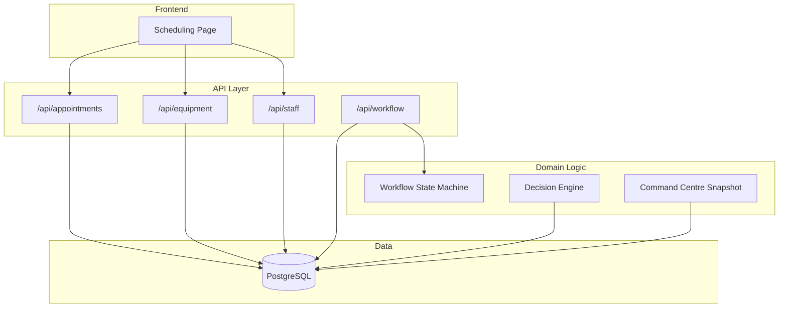
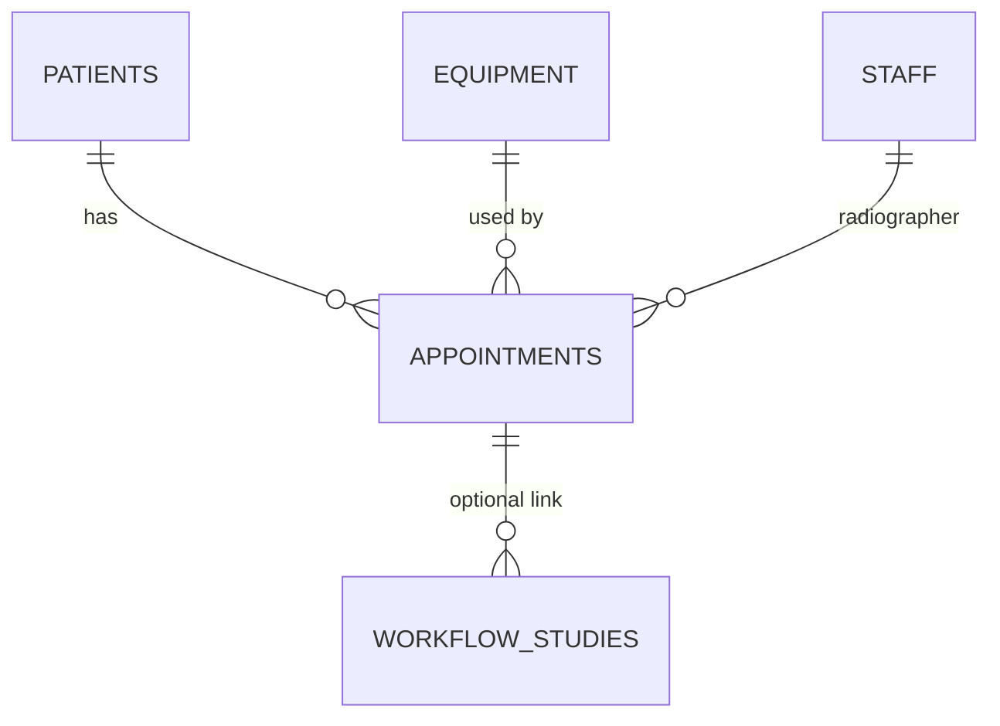
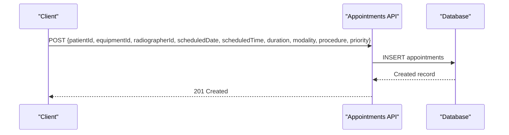
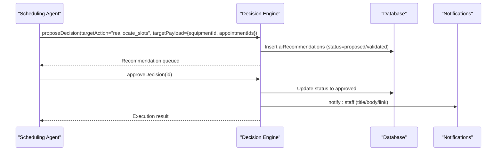
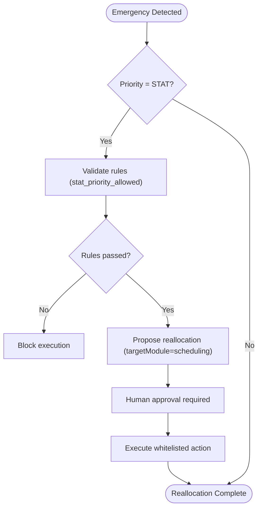
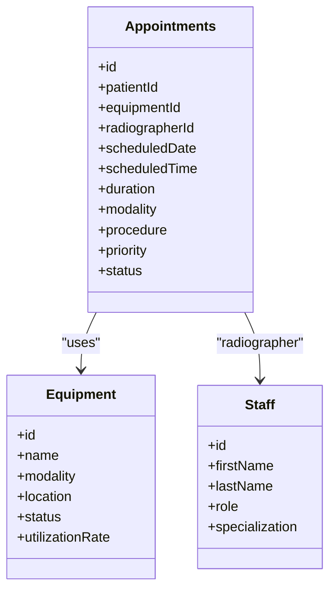
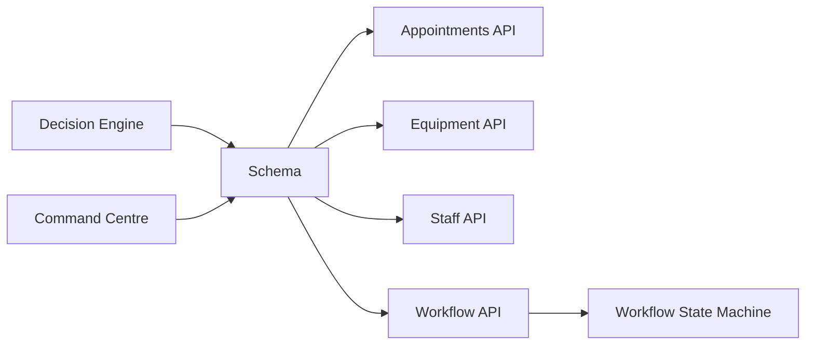

# Resource Allocation

<cite>
**Referenced Files in This Document**
- [schema.ts](file://src/db/schema.ts)
- [appointments route](file://src/app/api/appointments/route.ts)
- [equipment route](file://src/app/api/equipment/route.ts)
- [staff route](file://src/app/api/staff/route.ts)
- [workflow route](file://src/app/api/workflow/route.ts)
- [workflow state machine](file://src/lib/workflow.ts)
- [decision engine](file://src/lib/decision-engine.ts)
- [command centre snapshot](file://src/lib/command-centre.ts)
- [agents definitions](file://src/lib/agents.ts)
- [orchestration agents](file://backend/app/agents/orchestration.py)
- [scheduling page](file://src/app/scheduling/page.tsx)
</cite>

## Table of Contents
1. [Introduction](#introduction)
2. [Project Structure](#project-structure)
3. [Core Components](#core-components)
4. [Architecture Overview](#architecture-overview)
5. [Detailed Component Analysis](#detailed-component-analysis)
6. [Dependency Analysis](#dependency-analysis)
7. [Performance Considerations](#performance-considerations)
8. [Troubleshooting Guide](#troubleshooting-guide)
9. [Conclusion](#conclusion)
10. [Appendices](#appendices)

## Introduction
This document explains how the platform allocates equipment and staff to appointments, how availability is checked, how conflicts are resolved, and how optimization and reallocation strategies operate across modalities and procedures. It also covers capacity planning and utilization tracking, and addresses scenarios such as equipment maintenance conflicts, staff unavailability, and emergency resource reallocation.

The system models scheduling through:
- Appointments linked to patients, equipment, and radiographers (staff).
- A workflow state machine that governs study progression and enforces clinical constraints.
- A decision engine that validates and executes safe actions (including reallocation).
- Operational dashboards that aggregate queue, utilization, delays, and risks.

## Project Structure
Scheduling-related code spans API routes, database schema, a workflow state machine, a decision engine, and operational dashboards. The frontend displays daily schedules and appointment lists.



**Diagram sources**
- [scheduling page](file://src/app/scheduling/page.tsx)
- [appointments route](file://src/app/api/appointments/route.ts)
- [equipment route](file://src/app/api/equipment/route.ts)
- [staff route](file://src/app/api/staff/route.ts)
- [workflow route](file://src/app/api/workflow/route.ts)
- [workflow state machine](file://src/lib/workflow.ts)
- [decision engine](file://src/lib/decision-engine.ts)
- [command centre snapshot](file://src/lib/command-centre.ts)

**Section sources**
- [scheduling page](file://src/app/scheduling/page.tsx)
- [appointments route](file://src/app/api/appointments/route.ts)
- [equipment route](file://src/app/api/equipment/route.ts)
- [staff route](file://src/app/api/staff/route.ts)
- [workflow route](file://src/app/api/workflow/route.ts)
- [workflow state machine](file://src/lib/workflow.ts)
- [decision engine](file://src/lib/decision-engine.ts)
- [command centre snapshot](file://src/lib/command-centre.ts)

## Core Components
- Appointments: Store scheduled date/time, duration, modality, procedure, priority, status, and links to patient, equipment, and radiographer.
- Equipment: Tracks name, modality, location, status (operational/maintenance/offline), calibration dates, and utilization rate.
- Staff: Stores personnel details including role and specialization; radiographers are assigned to appointments.
- Workflow Studies: Clinical pipeline stages from referral to archive, with guards for transitions and audit/event publishing.
- Decision Engine: Validates AI/system recommendations against business rules, requires human approval, and executes whitelisted actions safely.
- Command Centre: Aggregates KPIs, queues, utilization, delays, inventory alerts, maintenance alerts, and operational risks.

**Section sources**
- [schema.ts](file://src/db/schema.ts)
- [appointments route](file://src/app/api/appointments/route.ts)
- [equipment route](file://src/app/api/equipment/route.ts)
- [staff route](file://src/app/api/staff/route.ts)
- [workflow state machine](file://src/lib/workflow.ts)
- [decision engine](file://src/lib/decision-engine.ts)
- [command centre snapshot](file://src/lib/command-centre.ts)

## Architecture Overview
Resource allocation flows through these layers:
- Frontend scheduling UI fetches appointments and equipment to visualize slots and availability.
- API endpoints read/write appointments, equipment, and staff records.
- Workflow state machine ensures studies advance only under valid conditions and publishes events.
- Decision engine mediates automated or agent-driven reallocations after rule checks and human approval.
- Command centre provides real-time visibility into queues, utilization, and risks to support manual decisions.

```mermaid
sequenceDiagram
participant FE as "Scheduling UI"
participant AP as "Appointments API"
participant DB as "Database"
participant WM as "Workflow State Machine"
participant DE as "Decision Engine"
participant CC as "Command Centre"
FE->>AP : Create/Update Appointment
AP->>DB : Persist appointment (patientId, equipmentId, radiographerId)
AP-->>FE : 201 Created
FE->>CC : Load Dashboard
CC->>DB : Query appointments, equipment, staff, workflow
CC-->>FE : KPIs, queues, utilization, risks
Note over FE,DE : If conflict detected (e.g., equipment offline),
FE or Agent proposes reallocation via Decision Engine
FE->>DE : proposeDecision(reallocate_slots, payload)
DE->>DB : Insert recommendation (validated/proposed)
DE-->>FE : Recommendation queued for approval
FE->>DE : approveDecision(id)
DE->>DB : Update recommendation status
DE->>DB : Execute whitelisted action (e.g., notify staff)
DE-->>FE : Execution result
```

**Diagram sources**
- [appointments route](file://src/app/api/appointments/route.ts)
- [workflow state machine](file://src/lib/workflow.ts)
- [decision engine](file://src/lib/decision-engine.ts)
- [command centre snapshot](file://src/lib/command-centre.ts)

## Detailed Component Analysis

### Data Model: Appointments, Equipment, Staff
The data model defines the core entities and relationships used for allocation:
- Appointments link to a patient, optional referral, an equipment instance, and a radiographer. They include scheduling fields (date, time, duration), modality, procedure, priority, and status.
- Equipment includes modality, location, status, calibration windows, and utilization rate.
- Staff includes role and specialization; radiographers are assigned to appointments.



**Diagram sources**
- [schema.ts](file://src/db/schema.ts)

**Section sources**
- [schema.ts](file://src/db/schema.ts)

### Availability Checking and Conflict Detection
- Daily schedule view filters today’s appointments and maps them to operational equipment columns, showing assignments per time slot.
- Command centre computes waiting and in-progress counts per equipment and identifies delayed appointments by comparing scheduled time to current time.
- Equipment status (operational/maintenance/offline) influences availability; offline or maintenance equipment is flagged as operational risk.

Operational implications:
- When equipment goes offline or enters maintenance, command centre surfaces risks and queue impacts.
- Delays are surfaced to prompt rescheduling or reallocation.

**Section sources**
- [scheduling page](file://src/app/scheduling/page.tsx)
- [command centre snapshot](file://src/lib/command-centre.ts)

### Allocation Strategies by Modality and Procedure
- Appointments carry modality and procedure fields, enabling filtering and grouping by imaging type.
- The workflow state machine ties studies to modality and procedure, ensuring downstream processes respect these attributes.
- Agents define responsibilities including detecting double-booking and modality conflicts and applying STAT → urgent → routine priority allocation.

Practical usage:
- Use modality to constrain equipment selection (e.g., CT vs X-Ray).
- Use procedure to tailor templates and workflows downstream.
- Prioritize STAT cases in scheduling and reallocation logic.

**Section sources**
- [schema.ts](file://src/db/schema.ts)
- [workflow route](file://src/app/api/workflow/route.ts)
- [agents definitions](file://src/lib/agents.ts)

### Conflict Resolution and Optimization Algorithms
- The decision engine evaluates business rules before any automated action. For reallocation, it requires equipment context or affected appointment IDs.
- Whitelisted executors allow safe operations like setting equipment status or notifying staff; workflow stage advancement is routed through the state machine.
- Orchestration agents demonstrate example behavior: evaluating equipment availability, detecting conflicts, and proposing conflict-free slots.

Optimization patterns:
- Rule-based validation prevents unsafe actions (e.g., no autonomous diagnosis, STAT restrictions).
- Human-in-the-loop approval ensures safety and accountability.
- Event-driven updates propagate changes to worklists and notifications.

**Section sources**
- [decision engine](file://src/lib/decision-engine.ts)
- [orchestration agents](file://backend/app/agents/orchestration.py)

### Capacity Planning and Utilization Tracking
- Equipment tracks utilization rate and status; command centre aggregates utilization and queue metrics per equipment.
- KPIs include equipment operational count, total equipment, and maintenance open items.
- Radiologist workload is computed by counting assigned active studies and signed reports per day.

Capacity insights:
- Identify bottlenecks by examining waiting/in-progress counts per equipment.
- Monitor utilization trends to plan staffing and maintenance windows.
- Track delays to adjust scheduling buffers or redistribute load.

**Section sources**
- [schema.ts](file://src/db/schema.ts)
- [command centre snapshot](file://src/lib/command-centre.ts)

### Example Workflows

#### New Appointment Creation


**Diagram sources**
- [appointments route](file://src/app/api/appointments/route.ts)

**Section sources**
- [appointments route](file://src/app/api/appointments/route.ts)

#### Reallocation Due to Equipment Maintenance


**Diagram sources**
- [decision engine](file://src/lib/decision-engine.ts)

**Section sources**
- [decision engine](file://src/lib/decision-engine.ts)

#### Emergency Reallocation (STAT Case)


**Diagram sources**
- [decision engine](file://src/lib/decision-engine.ts)

**Section sources**
- [decision engine](file://src/lib/decision-engine.ts)

### Relationship Between Appointments, Equipment, and Staff
- Appointments reference equipment and radiographer IDs, enabling direct assignment.
- The workflow can optionally link to an appointment, bridging scheduling with clinical processing.
- Command centre queries combine appointments, equipment, and staff to compute queues and workload.



**Diagram sources**
- [schema.ts](file://src/db/schema.ts)

**Section sources**
- [schema.ts](file://src/db/schema.ts)

## Dependency Analysis
Key dependencies:
- API routes depend on the database schema for entity definitions and relationships.
- Workflow state machine depends on schema tables and publishes events upon transitions.
- Decision engine depends on schema and integrates with workflow and notification modules.
- Command centre depends on multiple tables to aggregate operational metrics.



**Diagram sources**
- [schema.ts](file://src/db/schema.ts)
- [appointments route](file://src/app/api/appointments/route.ts)
- [equipment route](file://src/app/api/equipment/route.ts)
- [staff route](file://src/app/api/staff/route.ts)
- [workflow route](file://src/app/api/workflow/route.ts)
- [workflow state machine](file://src/lib/workflow.ts)
- [decision engine](file://src/lib/decision-engine.ts)
- [command centre snapshot](file://src/lib/command-centre.ts)

**Section sources**
- [schema.ts](file://src/db/schema.ts)
- [appointments route](file://src/app/api/appointments/route.ts)
- [equipment route](file://src/app/api/equipment/route.ts)
- [staff route](file://src/app/api/staff/route.ts)
- [workflow route](file://src/app/api/workflow/route.ts)
- [workflow state machine](file://src/lib/workflow.ts)
- [decision engine](file://src/lib/decision-engine.ts)
- [command centre snapshot](file://src/lib/command-centre.ts)

## Performance Considerations
- Prefer server-side aggregation for dashboards to minimize client computation.
- Use indexed queries on frequently filtered fields (e.g., scheduledDate, status, equipmentId).
- Batch reads for command centre snapshots to reduce round trips.
- Avoid heavy client-side filtering; leverage API parameters where possible.

[No sources needed since this section provides general guidance]

## Troubleshooting Guide
Common issues and resolutions:
- Equipment offline or in maintenance: Command centre flags operational risks; use decision engine to update equipment status and notify staff.
- Appointment delays: Command centre calculates delay minutes; consider rescheduling or reallocating to available equipment.
- Conflicts during reallocation: Decision engine rules require equipment context; ensure payload includes equipmentId or appointmentIds.
- Workflow transition errors: Ensure required fields (e.g., radiologistId for assignment/opened) are present; follow forward-only transitions.

**Section sources**
- [command centre snapshot](file://src/lib/command-centre.ts)
- [decision engine](file://src/lib/decision-engine.ts)
- [workflow state machine](file://src/lib/workflow.ts)

## Conclusion
The platform provides a robust foundation for resource allocation in scheduling through clear data models, guarded workflow transitions, rule-based decision making, and comprehensive operational visibility. By leveraging modality and procedure attributes, prioritizing STAT cases, and using the decision engine for safe reallocations, the system supports efficient capacity planning and utilization tracking while handling maintenance conflicts, staff unavailability, and emergencies.

[No sources needed since this section summarizes without analyzing specific files]

## Appendices

### Scheduling UI Behavior
- Displays today’s appointments mapped to operational equipment columns.
- Shows priority badges and status indicators for quick triage.
- Provides a full list view for detailed inspection and management.

**Section sources**
- [scheduling page](file://src/app/scheduling/page.tsx)

### Agent Responsibilities in Scheduling
- Detect double-booking and modality conflicts.
- Apply priority allocation (STAT → urgent → routine).
- Reallocate slots when machines go offline.
- Balance radiographer workload across sessions.

**Section sources**
- [agents definitions](file://src/lib/agents.ts)
- [orchestration agents](file://backend/app/agents/orchestration.py)