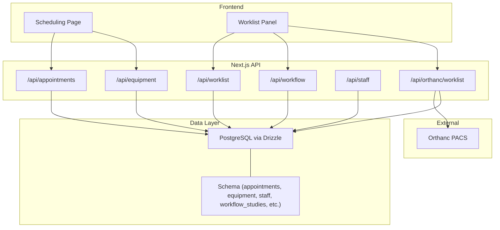
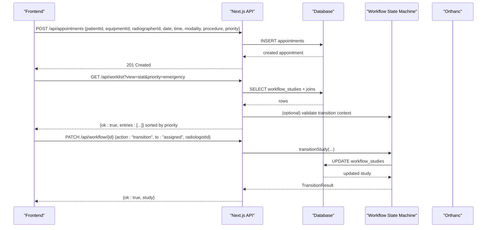
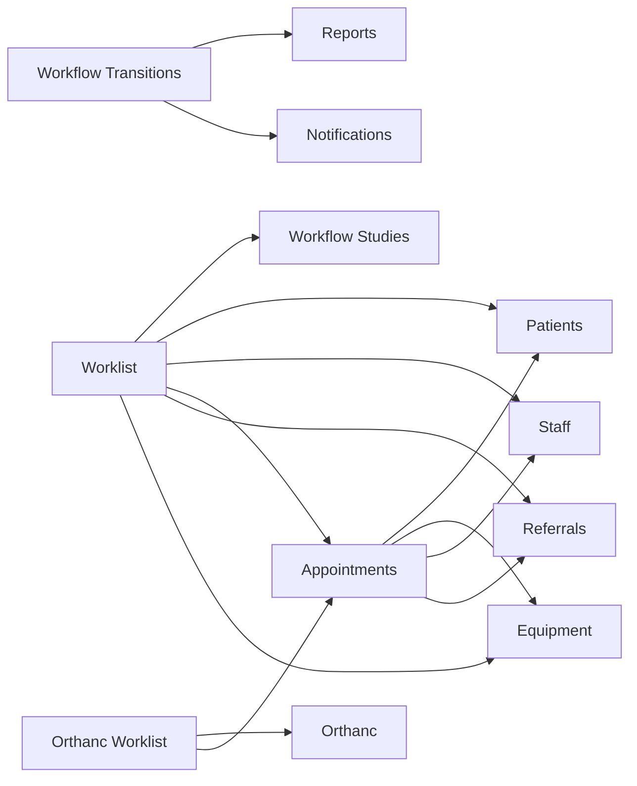

# Scheduling & Worklist

<cite>
**Referenced Files in This Document**
- [route.ts](file://src/app/api/appointments/route.ts)
- [route.ts](file://src/app/api/worklist/route.ts)
- [route.ts](file://src/app/api/worklist/facets/route.ts)
- [route.ts](file://src/app/api/equipment/route.ts)
- [route.ts](file://src/app/api/staff/route.ts)
- [route.ts](file://src/app/api/workflow/route.ts)
- [route.ts](file://src/app/api/orthanc/worklist/route.ts)
- [schema.ts](file://src/db/schema.ts)
- [workflow.ts](file://src/lib/workflow.ts)
- [utils.ts](file://src/lib/utils.ts)
- [page.tsx](file://src/app/scheduling/page.tsx)
- [worklist-panel.tsx](file://src/components/workstation/worklist-panel.tsx)
- [orchestration.py](file://backend/app/agents/orchestration.py)
- [main.py](file://backend/app/main.py)
</cite>

## Table of Contents
1. Introduction
2. Project Structure
3. Core Components
4. Architecture Overview
5. Detailed Component Analysis
6. Dependency Analysis
7. Performance Considerations
8. Troubleshooting Guide
9. Conclusion
10. Appendices

## Introduction
This document explains how the platform schedules appointments, allocates equipment and staff, manages worklists, and handles priorities and conflicts. It covers the data model, API endpoints, scheduling algorithms, conflict resolution strategies, and integration with PACS (Orthanc). Concrete examples from the codebase illustrate appointment creation, modification, cancellation workflows, and common scenarios such as emergency scheduling, equipment conflicts, and staff availability management.

## Project Structure
The scheduling and worklist features are implemented across:
- Next.js API routes for appointments, worklist, workflow transitions, equipment, staff, and Orthanc worklist proxy
- A Drizzle ORM schema defining patients, referrals, appointments, equipment, staff, and workflow studies
- A server-side state machine that governs study lifecycle transitions
- Frontend pages and panels that visualize daily schedules and worklist entries
- Optional backend agents for intelligent scheduling and equipment checks

**Diagram sources**
- [route.ts:1-51](file://src/app/api/appointments/route.ts#L1-L51)
- [route.ts:1-120](file://src/app/api/worklist/route.ts#L1-L120)
- [route.ts:1-107](file://src/app/api/workflow/route.ts#L1-L107)
- [route.ts:1-24](file://src/app/api/equipment/route.ts#L1-L24)
- [route.ts:1-23](file://src/app/api/staff/route.ts#L1-L23)
- [route.ts:1-80](file://src/app/api/orthanc/worklist/route.ts#L1-L80)
- [schema.ts:1-468](file://src/db/schema.ts#L1-L468)

**Section sources**
- [route.ts:1-51](file://src/app/api/appointments/route.ts#L1-L51)
- [route.ts:1-120](file://src/app/api/worklist/route.ts#L1-L120)
- [schema.ts:1-468](file://src/db/schema.ts#L1-L468)

## Core Components
- Appointments: CRUD over scheduled slots linking patient, referral, equipment, and radiographer.
- Worklist: Aggregated view of workflow studies with filters, facets, and priority sorting.
- Workflow State Machine: Enforces forward-only stage transitions with guards and audit events.
- Equipment and Staff: Reference data used for allocation and filtering.
- Orthanc Worklist Proxy: Returns DICOM Modality Worklist entries from Orthanc or falls back to local appointments.

Key responsibilities:
- Appointment creation ties a patient and procedure to an equipment slot and optional radiographer.
- Worklist queries combine multiple tables and apply dynamic filters and priority ranking.
- Workflow transitions ensure clinical integrity (e.g., report must be signed before release).
- Agents provide guidance for conflict detection and resource optimization.

**Section sources**
- [route.ts:1-51](file://src/app/api/appointments/route.ts#L1-L51)
- [route.ts:1-120](file://src/app/api/worklist/route.ts#L1-L120)
- [workflow.ts:1-246](file://src/lib/workflow.ts#L1-L246)
- [route.ts:1-24](file://src/app/api/equipment/route.ts#L1-L24)
- [route.ts:1-23](file://src/app/api/staff/route.ts#L1-L23)
- [route.ts:1-80](file://src/app/api/orthanc/worklist/route.ts#L1-L80)

## Architecture Overview
The system combines a relational data layer with a strict workflow state machine and flexible query APIs. The frontend consumes these APIs to render a daily schedule grid and a rich worklist panel. External PACS integration is proxied through a dedicated route.

**Diagram sources**
- [route.ts:42-51](file://src/app/api/appointments/route.ts#L42-L51)
- [route.ts:26-118](file://src/app/api/worklist/route.ts#L26-L118)
- [workflow.ts:102-234](file://src/lib/workflow.ts#L102-L234)
- [route.ts:1-107](file://src/app/api/workflow/route.ts#L1-L107)

## Detailed Component Analysis

### Appointments API
- GET /api/appointments: Returns all appointments with patient, equipment, and radiographer details; supports optional date filter; orders by date/time.
- POST /api/appointments: Creates an appointment from request body; returns the created record.

Conflict handling:
- No explicit conflict check at create time; conflict detection is delegated to scheduling logic elsewhere (agents or future validation).

Priority and status:
- Stores priority and status fields; UI surfaces badges for STAT/urgent/routine and statuses like scheduled, checked_in, in_progress, completed.

Example usage paths:
- Create appointment: [POST implementation:42-51](file://src/app/api/appointments/route.ts#L42-L51)
- List appointments: [GET implementation:6-40](file://src/app/api/appointments/route.ts#L6-L40)

**Section sources**
- [route.ts:1-51](file://src/app/api/appointments/route.ts#L1-L51)
- [schema.ts:82-100](file://src/db/schema.ts#L82-L100)

### Worklist API
- GET /api/worklist: Builds a comprehensive query with filters (view, q, modality, radiologist, machine, physician, location, priority, stage), joins multiple tables, and sorts results by a defined priority order (emergency > stat > urgent > routine).
- GET /api/worklist/facets: Provides distinct values for machines, radiologists, physicians, and locations to power UI filters.

Key behaviors:
- Supports views: today, unread, stat, emergency, assigned, completed, all.
- Free-text search across patient name, MRN, accession number.
- Joins workflow_studies with patients, staff, appointments, referrals, and equipment.

Example usage paths:
- Query worklist: [GET implementation:26-118](file://src/app/api/worklist/route.ts#L26-L118)
- Load facets: [GET implementation:8-30](file://src/app/api/worklist/facets/route.ts#L8-L30)

**Section sources**
- [route.ts:1-120](file://src/app/api/worklist/route.ts#L1-L120)
- [route.ts:1-31](file://src/app/api/worklist/facets/route.ts#L1-L31)
- [schema.ts:102-119](file://src/db/schema.ts#L102-L119)

### Workflow State Machine
- Centralizes study lifecycle transitions with strict rules:
  - Forward-only progression
  - Guards for required context (e.g., radiologist assignment, Orthanc studyInstanceUid)
  - Report signing requirement before release
  - Audit logging and event publishing on every transition
- Provides utilities for stage metadata, next stages, and counts.

Common transitions:
- Assign radiologist: action "assign" with radiologistId
- Open study: action "transition" to "opened"
- Release study: action "transition" to "released" (requires signed report)

Example usage paths:
- Transition logic: [transitionStudy:102-234](file://src/lib/workflow.ts#L102-L234)
- Stage definitions: [WORKFLOW_STAGES:38-51](file://src/lib/workflow.ts#L38-L51)

**Section sources**
- [workflow.ts:1-246](file://src/lib/workflow.ts#L1-L246)

### Orthanc Worklist Proxy
- GET /api/orthanc/worklist: Proxies to Orthanc when configured; otherwise falls back to local appointments filtered by date and modality.
- Returns items suitable for DICOM Modality Worklist consumers.

Example usage paths:
- Proxy and fallback: [GET implementation:16-79](file://src/app/api/orthanc/worklist/route.ts#L16-L79)

**Section sources**
- [route.ts:1-80](file://src/app/api/orthanc/worklist/route.ts#L1-L80)

### Equipment and Staff APIs
- GET /api/equipment: Lists all equipment records.
- POST /api/equipment: Creates equipment.
- GET /api/staff: Lists all staff records.
- POST /api/staff: Creates staff.

These endpoints supply reference data for scheduling and filtering.

**Section sources**
- [route.ts:1-24](file://src/app/api/equipment/route.ts#L1-L24)
- [route.ts:1-23](file://src/app/api/staff/route.ts#L1-L23)
- [schema.ts:53-80](file://src/db/schema.ts#L53-L80)

### Frontend Scheduling and Worklist Panels
- Scheduling page: Displays today’s appointments, operational equipment count, pending and priority cases, and a daily grid mapping time slots to equipment columns.
- Worklist panel: Provides views (today, unread, stat, emergency, assigned, completed, all), advanced filters, bookmarks, upload flow to Orthanc, and context actions (flag as urgent, assign radiologist, release study).

Example usage paths:
- Daily schedule grid: [SchedulingPage:38-236](file://src/app/scheduling/page.tsx#L38-L236)
- Worklist panel interactions: [WorklistPanel:82-504](file://src/components/workstation/worklist-panel.tsx#L82-L504)

**Section sources**
- [page.tsx:1-236](file://src/app/scheduling/page.tsx#L1-L236)
- [worklist-panel.tsx:1-559](file://src/components/workstation/worklist-panel.tsx#L1-L559)

## Dependency Analysis
- Appointments depend on patients, equipment, staff, and referrals references.
- Worklist depends on workflow_studies, patients, staff, appointments, referrals, and equipment.
- Workflow transitions depend on reports and notifications for guard checks and side effects.
- Orthanc worklist depends on integration configuration and optionally on local appointments.

**Diagram sources**
- [schema.ts:18-119](file://src/db/schema.ts#L18-L119)
- [route.ts:66-105](file://src/app/api/worklist/route.ts#L66-L105)
- [workflow.ts:150-172](file://src/lib/workflow.ts#L150-L172)
- [route.ts:22-71](file://src/app/api/orthanc/worklist/route.ts#L22-L71)

**Section sources**
- [schema.ts:1-468](file://src/db/schema.ts#L1-L468)
- [route.ts:1-120](file://src/app/api/worklist/route.ts#L1-L120)
- [workflow.ts:1-246](file://src/lib/workflow.ts#L1-L246)
- [route.ts:1-80](file://src/app/api/orthanc/worklist/route.ts#L1-L80)

## Performance Considerations
- Worklist queries use selective joins and dynamic conditions to minimize payload size.
- Priority sorting is performed client-side after fetching; consider server-side ordering for large datasets.
- Facets endpoint reduces repeated computation by returning distinct lists for UI filters.
- Orthanc proxy includes timeouts and fallback behavior to avoid blocking the UI.

[No sources needed since this section provides general guidance]

## Troubleshooting Guide
Common issues and resolutions:
- Appointment creation fails: Validate required fields (patientId, equipmentId, radiographerId, date/time, modality, procedure, priority). Check database constraints and unique keys.
- Worklist empty or incomplete: Verify filters and views; ensure workflow studies exist and are linked to appointments/patients/staff; confirm Orthanc connectivity if using remote worklist.
- Workflow transition blocked: Ensure required context is present (radiologistId for assignment/opened; studyInstanceUid for sent_to_orthanc; signed report for released).
- Orthanc worklist unavailable: Confirm integration URL and authentication headers; fallback will return local appointments if available.

Operational tips:
- Use /api/worklist/facets to verify available machines, radiologists, physicians, and locations.
- Use /api/workflow to inspect current stage and labels for troubleshooting.
- Leverage audit logs and events for tracing transitions.

**Section sources**
- [route.ts:26-118](file://src/app/api/worklist/route.ts#L26-L118)
- [workflow.ts:102-234](file://src/lib/workflow.ts#L102-L234)
- [route.ts:16-79](file://src/app/api/orthanc/worklist/route.ts#L16-L79)

## Conclusion
The platform provides a robust foundation for scheduling and worklist management:
- Clear separation between scheduling (appointments) and clinical workflow (studies)
- Strict state machine ensuring clinical integrity and auditability
- Flexible worklist querying with powerful filters and priority handling
- Integration with PACS via Orthanc with graceful fallback
- Frontend tools for visualization and operations

Future enhancements could include:
- Server-side conflict detection during appointment creation
- Advanced resource optimization using agent-driven reallocation
- Expanded scheduling policies (breaks, training, maintenance windows)

[No sources needed since this section summarizes without analyzing specific files]

## Appendices

### Data Model Highlights
- Patients: identity, demographics, insurance, consent, status
- Referrals: referring physician/facility, indication, requested procedure, priority
- Appointments: links patient/referral to equipment and radiographer; tracks date/time, duration, modality, procedure, priority, status, check-in
- Equipment: identity, modality, manufacturer/model, location, status, calibration
- Staff: identity, role, specialization, contact, status
- Workflow Studies: links to appointment/patient; accession and study UIDs; modality/procedure/body part; stage; radiologist; timestamps; priority

**Section sources**
- [schema.ts:18-119](file://src/db/schema.ts#L18-L119)

### Scheduling Algorithms and Conflict Resolution
- Priority-based allocation:
  - Emergency and STAT cases are surfaced prominently in worklist and prioritized in sorting.
  - The worklist applies a fixed rank order: emergency > stat > urgent > routine.
- Conflict detection:
  - Current appointment creation does not enforce conflict checks; rely on agents or future validations to detect double-bookings and modality conflicts.
  - Agents define responsibilities for detecting conflicts and reallocating slots when equipment goes offline.
- Resource optimization:
  - Equipment and staff reference data enable filtering and assignment.
  - Agents propose reallocations based on equipment status and utilization.

**Section sources**
- [route.ts:107-110](file://src/app/api/worklist/route.ts#L107-L110)
- [orchestration.py:41-67](file://backend/app/agents/orchestration.py#L41-L67)
- [utils.ts:52-63](file://src/lib/utils.ts#L52-L63)

### API Endpoints Summary
- Appointments
  - GET /api/appointments: list with optional date filter
  - POST /api/appointments: create appointment
- Worklist
  - GET /api/worklist: filtered query with view, q, modality, radiologist, machine, physician, location, priority, stage
  - GET /api/worklist/facets: distinct values for filters
- Workflow
  - GET /api/workflow: list studies with stage labels
  - POST /api/workflow: create study at referral stage
  - PATCH /api/workflow/{id}: transition study (assign, open, release, etc.)
- Equipment
  - GET /api/equipment: list equipment
  - POST /api/equipment: create equipment
- Staff
  - GET /api/staff: list staff
  - POST /api/staff: create staff
- Orthanc Worklist
  - GET /api/orthanc/worklist: proxy to Orthanc or fallback to local appointments

**Section sources**
- [route.ts:1-51](file://src/app/api/appointments/route.ts#L1-L51)
- [route.ts:1-120](file://src/app/api/worklist/route.ts#L1-L120)
- [route.ts:1-31](file://src/app/api/worklist/facets/route.ts#L1-L31)
- [route.ts:1-107](file://src/app/api/workflow/route.ts#L1-L107)
- [route.ts:1-24](file://src/app/api/equipment/route.ts#L1-L24)
- [route.ts:1-23](file://src/app/api/staff/route.ts#L1-L23)
- [route.ts:1-80](file://src/app/api/orthanc/worklist/route.ts#L1-L80)

### Example Workflows

#### Appointment Creation
- Client sends POST /api/appointments with required fields.
- Server inserts into appointments and returns the created record.
- Frontend updates schedule grid and stats.

**Section sources**
- [route.ts:42-51](file://src/app/api/appointments/route.ts#L42-L51)
- [page.tsx:42-47](file://src/app/scheduling/page.tsx#L42-L47)

#### Worklist Filtering and Priority Sorting
- Client calls GET /api/worklist with filters.
- Server builds conditions, joins tables, and sorts by priority rank.
- Frontend renders entries with badges and context menu actions.

**Section sources**
- [route.ts:26-118](file://src/app/api/worklist/route.ts#L26-L118)
- [worklist-panel.tsx:317-439](file://src/components/workstation/worklist-panel.tsx#L317-L439)

#### Study Assignment and Release
- Client calls PATCH /api/workflow/{id} with action "assign" and radiologistId.
- State machine validates and updates study stage; publishes events and notifications.
- Later, client calls PATCH with action "transition" to "released" after report is signed.

**Section sources**
- [worklist-panel.tsx:164-192](file://src/components/workstation/worklist-panel.tsx#L164-L192)
- [workflow.ts:142-172](file://src/lib/workflow.ts#L142-L172)

#### Emergency Scheduling
- Mark study as emergency/stat via worklist context menu.
- Worklist prioritizes these entries at the top.
- Optionally reassign equipment or radiographer using facets and workflow transitions.

**Section sources**
- [worklist-panel.tsx:151-163](file://src/components/workstation/worklist-panel.tsx#L151-L163)
- [route.ts:107-110](file://src/app/api/worklist/route.ts#L107-L110)

#### Equipment Conflicts and Reallocation
- If equipment goes offline, agents can propose reallocation.
- Update appointment equipmentId to an available machine; refresh worklist.
- Use facets to identify alternative machines and locations.

**Section sources**
- [orchestration.py:41-67](file://backend/app/agents/orchestration.py#L41-L67)
- [route.ts:11-19](file://src/app/api/worklist/facets/route.ts#L11-L19)

#### Staff Availability Management
- Use staff list to identify available radiographers.
- Assign radiologistId to workflow study via PATCH /api/workflow/{id}.
- Notifications are issued upon assignment.

**Section sources**
- [route.ts:5-12](file://src/app/api/staff/route.ts#L5-L12)
- [workflow.ts:206-218](file://src/lib/workflow.ts#L206-L218)