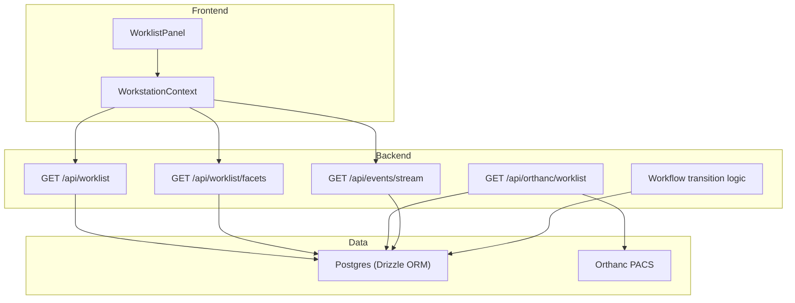
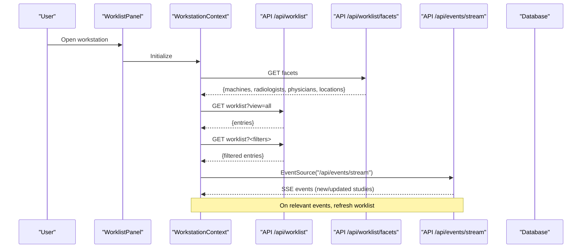
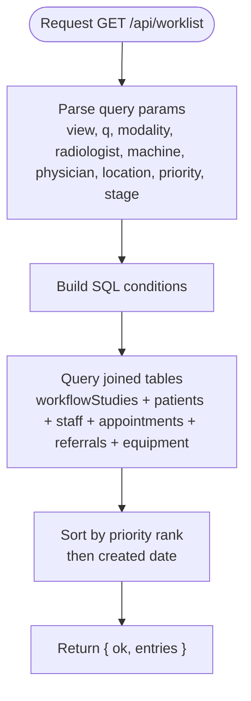
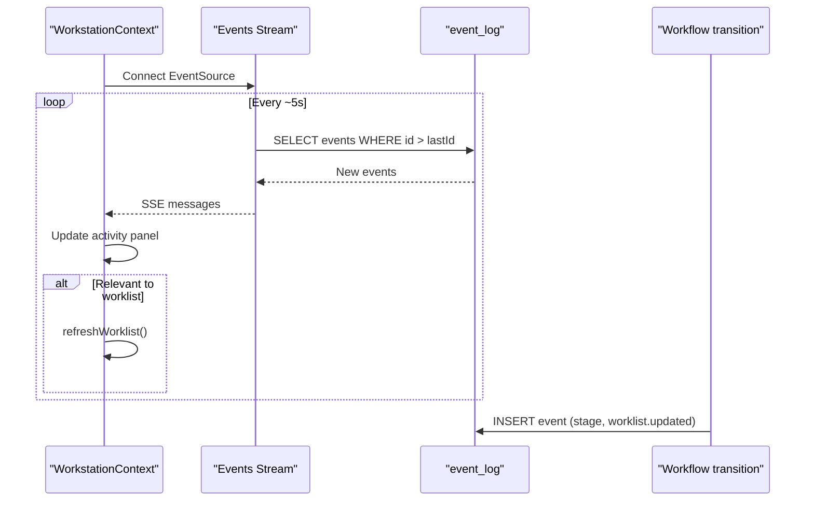
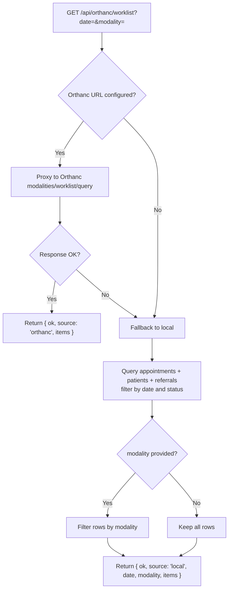
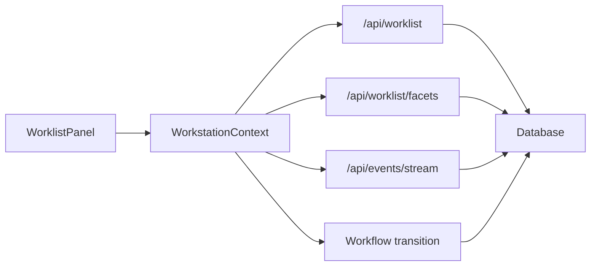

# Worklist Management

<cite>
**Referenced Files in This Document**
- [worklist-panel.tsx](file://src/components/workstation/worklist-panel.tsx)
- [workstation-context.tsx](file://src/components/workstation/workstation-context.tsx)
- [worklist route](file://src/app/api/worklist/route.ts)
- [worklist facets route](file://src/app/api/worklist/facets/route.ts)
- [orthanc worklist route](file://src/app/api/orthanc/worklist/route.ts)
- [events stream route](file://src/app/api/events/stream/route.ts)
- [workflow library](file://src/lib/workflow.ts)
- [database schema](file://src/db/schema.ts)
</cite>

## Table of Contents
1. [Introduction](#introduction)
2. [Project Structure](#project-structure)
3. [Core Components](#core-components)
4. [Architecture Overview](#architecture-overview)
5. [Detailed Component Analysis](#detailed-component-analysis)
6. [Dependency Analysis](#dependency-analysis)
7. [Performance Considerations](#performance-considerations)
8. [Troubleshooting Guide](#troubleshooting-guide)
9. [Conclusion](#conclusion)
10. [Appendices](#appendices)

## Introduction
This document explains the end-to-end worklist management functionality: how worklists are generated from scheduled appointments and workflow studies, filtered by modality, priority, radiologist assignment, machine, physician, and location; how they are displayed in the Radiology Workstation UI; and how real-time updates keep multiple users synchronized. It also covers customization options, export considerations, integration with the PACS (Orthanc), and performance strategies for large worklists.

## Project Structure
The worklist spans three layers:
- Frontend components and state: a panel component renders the list, search, filters, views, and actions; a context provider orchestrates data fetching, filtering, selection, and real-time events.
- Backend API routes: endpoints serve filtered worklist entries, facet values for dropdowns, DICOM MWL-compatible worklist queries, and an SSE stream for live updates.
- Data layer: relational schemas model patients, referrals, equipment, staff, appointments, and workflow studies; transitions are enforced server-side.

**Diagram sources**
- [worklist-panel.tsx:82-494](file://src/components/workstation/worklist-panel.tsx#L82-L494)
- [workstation-context.tsx:392-420](file://src/components/workstation/workstation-context.tsx#L392-L420)
- [worklist route:26-111](file://src/app/api/worklist/route.ts#L26-L111)
- [worklist facets route:9-26](file://src/app/api/worklist/facets/route.ts#L9-L26)
- [orthanc worklist route:16-79](file://src/app/api/orthanc/worklist/route.ts#L16-L79)
- [events stream route:20-92](file://src/app/api/events/stream/route.ts#L20-L92)
- [workflow library:102-233](file://src/lib/workflow.ts#L102-L233)

**Section sources**
- [worklist-panel.tsx:82-494](file://src/components/workstation/worklist-panel.tsx#L82-L494)
- [workstation-context.tsx:392-420](file://src/components/workstation/workstation-context.tsx#L392-L420)
- [worklist route:26-111](file://src/app/api/worklist/route.ts#L26-L111)
- [worklist facets route:9-26](file://src/app/api/worklist/facets/route.ts#L9-L26)
- [orthanc worklist route:16-79](file://src/app/api/orthanc/worklist/route.ts#L16-L79)
- [events stream route:20-92](file://src/app/api/events/stream/route.ts#L20-L92)
- [workflow library:102-233](file://src/lib/workflow.ts#L102-L233)

## Core Components
- Worklist data structure: A unified entry type carries patient, procedure, modality, body part, stage, priority, timestamps, radiologist, equipment, referring physician, and scheduling details.
- Filtering and views: The UI supports preset views (today, unread, stat, emergency, assigned, completed, all) plus free-text search and advanced filters (modality, machine, radiologist, physician, location, priority).
- Real-time updates: An SSE stream pushes new events to clients; on significant changes (e.g., transitions), the client refreshes the worklist.
- Integration points: Orthanc MWL endpoint provides DICOM-compliant worklist items when configured; otherwise local appointments act as a fallback.

Key responsibilities:
- WorklistPanel: Renders lists, handles user interactions, bookmarks, uploads, and invokes context actions.
- WorkstationContext: Manages state, fetches data, applies filters, opens studies, publishes events, and maintains SSE connection.
- API routes: Query and filter database tables, compute facets, proxy or fallback to Orthanc, and stream events.
- Workflow library: Enforces forward-only transitions, records audit logs, emits events, and raises notifications.

**Section sources**
- [workstation-context.tsx:25-62](file://src/components/workstation/workstation-context.tsx#L25-L62)
- [worklist route:26-111](file://src/app/api/worklist/route.ts#L26-L111)
- [worklist facets route:9-26](file://src/app/api/worklist/facets/route.ts#L9-L26)
- [orthanc worklist route:16-79](file://src/app/api/orthanc/worklist/route.ts#L16-L79)
- [events stream route:20-92](file://src/app/api/events/stream/route.ts#L20-L92)
- [workflow library:102-233](file://src/lib/workflow.ts#L102-L233)

## Architecture Overview
The system uses a layered architecture with clear separation between UI, API, and data. The frontend requests filtered worklist data and facets, then renders them. When users perform actions (open study, assign, release), the backend validates transitions and emits events that propagate via SSE to other clients.

**Diagram sources**
- [workstation-context.tsx:372-420](file://src/components/workstation/workstation-context.tsx#L372-L420)
- [worklist route:26-111](file://src/app/api/worklist/route.ts#L26-L111)
- [worklist facets route:9-26](file://src/app/api/worklist/facets/route.ts#L9-L26)
- [events stream route:20-92](file://src/app/api/events/stream/route.ts#L20-L92)

## Detailed Component Analysis

### Worklist Panel Component
Responsibilities:
- Displays view tabs with counts and highlights active view.
- Provides search input and advanced filter panel toggling.
- Renders entries with patient name, procedure, modality, body part, priority badge, stage label, and accession number.
- Supports context menu actions: open study, open in new tab, bookmark, copy accession, flag as urgent, assign to radiologist, release study.
- Includes upload dropzone for DICOM files and bookmarks list.

Filtering capabilities:
- Free-text search across patient name, MRN, and accession number.
- Advanced filters: modality, machine, radiologist, physician, location, priority.
- View presets: today, unread, stat, emergency, assigned, completed, all.

Bulk operations:
- Context menu allows per-item actions; bulk operations can be implemented by iterating selected entries and invoking the same PATCH calls used by single-item actions.

Customization:
- Views and labels are defined locally and can be extended.
- Filter dropdowns derive from facets for dynamic values.

Integration:
- Bookmarks integrate with /api/bookmarks.
- Assign/release actions call workflow transitions via /api/workflow/{id}.
- Upload integrates with /api/orthanc/upload.

**Section sources**
- [worklist-panel.tsx:35-80](file://src/components/workstation/worklist-panel.tsx#L35-L80)
- [worklist-panel.tsx:82-494](file://src/components/workstation/worklist-panel.tsx#L82-L494)
- [worklist-panel.tsx:116-195](file://src/components/workstation/worklist-panel.tsx#L116-L195)
- [worklist-panel.tsx:197-221](file://src/components/workstation/worklist-panel.tsx#L197-L221)
- [worklist-panel.tsx:316-439](file://src/components/workstation/worklist-panel.tsx#L316-L439)
- [worklist-panel.tsx:442-494](file://src/components/workstation/worklist-panel.tsx#L442-L494)
- [worklist-panel.tsx:517-558](file://src/components/workstation/worklist-panel.tsx#L517-L558)

### Worklist Data Model and Filtering Logic
Data model:
- WorklistEntry includes identifiers (id, accessionNumber, studyInstanceUid), clinical metadata (modality, procedure, bodyPart), lifecycle fields (stage, priority, startedAt, completedAt, createdAt), patient info, radiologist assignment, equipment details, referral info, and scheduling slots.

Filtering logic:
- Server-side query composes conditions based on view, q, modality, radiologist, machine, physician, location, priority, and stage.
- Results are sorted by priority rank (emergency > stat > urgent > routine) and created date.

Facets:
- Distinct machines, radiologists, physicians, and locations are fetched to populate filter dropdowns.

**Diagram sources**
- [worklist route:26-111](file://src/app/api/worklist/route.ts#L26-L111)
- [worklist facets route:9-26](file://src/app/api/worklist/facets/route.ts#L9-L26)

**Section sources**
- [workstation-context.tsx:25-62](file://src/components/workstation/workstation-context.tsx#L25-L62)
- [worklist route:26-111](file://src/app/api/worklist/route.ts#L26-L111)
- [worklist facets route:9-26](file://src/app/api/worklist/facets/route.ts#L9-L26)

### Real-Time Updates and Synchronization
Mechanism:
- Clients open an SSE connection to /api/events/stream.
- The server polls the event_log table every ~5 seconds, pushing new events since the last ID.
- On relevant events (e.g., workflow transitions), the context triggers refreshWorklist to update the UI.

Event publishing:
- Workflow transitions publish stage-specific events and a generic worklist.updated event.
- These events are persisted and streamed to connected clients.

**Diagram sources**
- [events stream route:20-92](file://src/app/api/events/stream/route.ts#L20-L92)
- [workflow library:180-204](file://src/lib/workflow.ts#L180-L204)
- [workstation-context.tsx:775-800](file://src/components/workstation/workstation-context.tsx#L775-L800)

**Section sources**
- [events stream route:20-92](file://src/app/api/events/stream/route.ts#L20-L92)
- [workflow library:180-204](file://src/lib/workflow.ts#L180-L204)
- [workstation-context.tsx:775-800](file://src/components/workstation/workstation-context.tsx#L775-L800)

### Generation from Scheduled Appointments
Sources:
- Orthanc MWL: If configured, proxies to Orthanc’s modalities/worklist/query with date and optional modality filters.
- Local fallback: Queries appointments for the given date excluding completed/cancelled statuses, joins patients and referrals, and returns structured items.

Use cases:
- Standalone mode without PACS: Uses local appointments as the worklist source.
- Integrated mode: Leverages Orthanc for DICOM-compliant worklist items.

**Diagram sources**
- [orthanc worklist route:16-79](file://src/app/api/orthanc/worklist/route.ts#L16-L79)

**Section sources**
- [orthanc worklist route:16-79](file://src/app/api/orthanc/worklist/route.ts#L16-L79)

### User Interface and Actions
- Views: Today’s Studies, Unread Studies, STAT Cases, Emergency, Assigned to Me, Completed, All Studies.
- Search: Free-text across patient name, MRN, accession.
- Filters: Modality, Machine, Radiologist, Physician, Location, Priority.
- Context menu: Open study, open in new tab, bookmark, copy accession, flag as urgent, assign to radiologist, release study.
- Upload: Drag-and-drop DICOM files to /api/orthanc/upload.

**Section sources**
- [worklist-panel.tsx:35-80](file://src/components/workstation/worklist-panel.tsx#L35-L80)
- [worklist-panel.tsx:316-439](file://src/components/workstation/worklist-panel.tsx#L316-L439)
- [worklist-panel.tsx:442-494](file://src/components/workstation/worklist-panel.tsx#L442-L494)
- [worklist-panel.tsx:116-195](file://src/components/workstation/worklist-panel.tsx#L116-L195)
- [worklist-panel.tsx:197-221](file://src/components/workstation/worklist-panel.tsx#L197-L221)

### Workflow Transitions and State Machine
Rules:
- Forward-only transitions; backward moves rejected.
- sent_to_orthanc requires a valid studyInstanceUid.
- assigned/opened require a radiologist.
- Each transition records audit log, publishes events, and may raise notifications.

Actions from UI:
- Assign to radiologist: PATCH workflow with action=assign.
- Release study: PATCH workflow with action=transition to released (requires signed report).
- Opening an assigned study transitions it to opened.

**Section sources**
- [workflow library:102-233](file://src/lib/workflow.ts#L102-L233)
- [workstation-context.tsx:446-481](file://src/components/workstation/workstation-context.tsx#L446-L481)
- [worklist-panel.tsx:151-192](file://src/components/workstation/worklist-panel.tsx#L151-L192)

## Dependency Analysis
Component relationships:
- WorklistPanel depends on WorkstationContext for state and actions.
- WorkstationContext depends on API routes for data and events.
- API routes depend on database schemas and external integrations (Orthanc).
- Workflow library enforces business rules and emits events consumed by the SSE stream.

**Diagram sources**
- [worklist-panel.tsx:82-494](file://src/components/workstation/worklist-panel.tsx#L82-L494)
- [workstation-context.tsx:392-420](file://src/components/workstation/workstation-context.tsx#L392-L420)
- [worklist route:26-111](file://src/app/api/worklist/route.ts#L26-L111)
- [worklist facets route:9-26](file://src/app/api/worklist/facets/route.ts#L9-L26)
- [events stream route:20-92](file://src/app/api/events/stream/route.ts#L20-L92)
- [workflow library:102-233](file://src/lib/workflow.ts#L102-L233)

**Section sources**
- [worklist route:26-111](file://src/app/api/worklist/route.ts#L26-L111)
- [worklist facets route:9-26](file://src/app/api/worklist/facets/route.ts#L9-L26)
- [events stream route:20-92](file://src/app/api/events/stream/route.ts#L20-L92)
- [workflow library:102-233](file://src/lib/workflow.ts#L102-L233)

## Performance Considerations
- Query efficiency:
  - Use server-side filtering and sorting to minimize payload size.
  - Index columns used in WHERE clauses (e.g., workflowStudies.stage, priority, createdAt; appointments.scheduledDate, status; equipment.name/location; staff.role).
- Pagination:
  - For very large worklists, add pagination parameters (limit, offset) to reduce memory usage and improve rendering speed.
- Facet caching:
  - Cache distinct facet results for short periods to avoid repeated expensive aggregations.
- SSE polling interval:
  - Tune POLL_INTERVAL_MS based on expected event volume and network constraints.
- Debouncing search:
  - Debounce free-text search inputs to reduce request frequency during typing.
- Batch operations:
  - Implement server-side batch transitions for bulk assignments or releases to reduce round trips.
- Offline resilience:
  - Graceful handling of network errors and fallback to local data where applicable.

[No sources needed since this section provides general guidance]

## Troubleshooting Guide
Common issues and resolutions:
- Empty worklist:
  - Verify filters and view selection; ensure data exists in workflow_studies or appointments.
  - Check facets availability and correct radiologist roles.
- No real-time updates:
  - Confirm SSE connection is established and Last-Event-ID tracking works.
  - Validate event_log entries are being inserted on transitions.
- Orthanc worklist unavailable:
  - Check integration configuration and authentication headers.
  - Ensure Orthanc service is reachable; fall back to local appointments if configured.
- Transition failures:
  - Review workflow rules (forward-only, required radiologist, studyInstanceUid).
  - Inspect error responses and audit logs for details.

**Section sources**
- [events stream route:20-92](file://src/app/api/events/stream/route.ts#L20-L92)
- [workflow library:102-233](file://src/lib/workflow.ts#L102-L233)
- [orthanc worklist route:16-79](file://src/app/api/orthanc/worklist/route.ts#L16-L79)

## Conclusion
The worklist management system provides a robust, filterable, and real-time capable interface for radiology workflows. It integrates seamlessly with both local scheduling and PACS systems, enforces strict workflow rules, and keeps multiple users synchronized through SSE events. With careful attention to indexing, pagination, and caching, it scales effectively for large datasets and high-throughput environments.

[No sources needed since this section summarizes without analyzing specific files]

## Appendices

### Database Schema Highlights
Key tables involved in worklist generation and display:
- workflow_studies: Central entity for clinical workflow stages, priorities, and timestamps.
- appointments: Scheduled imaging sessions linked to patients, equipment, and referrals.
- patients, referrals, staff, equipment: Supporting entities providing clinical and operational context.
- event_log: Powers real-time updates via SSE.

**Section sources**
- [database schema:102-119](file://src/db/schema.ts#L102-L119)
- [database schema:82-100](file://src/db/schema.ts#L82-L100)
- [database schema:18-50](file://src/db/schema.ts#L18-L50)
- [database schema:53-80](file://src/db/schema.ts#L53-L80)
- [database schema:447-455](file://src/db/schema.ts#L447-L455)