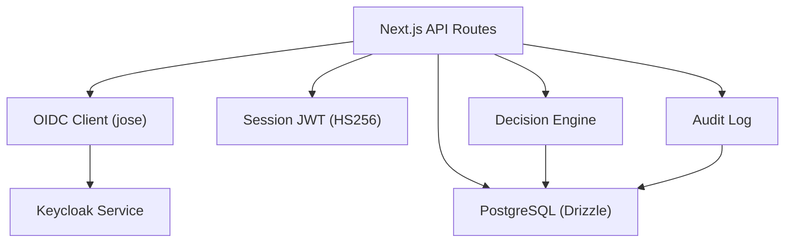
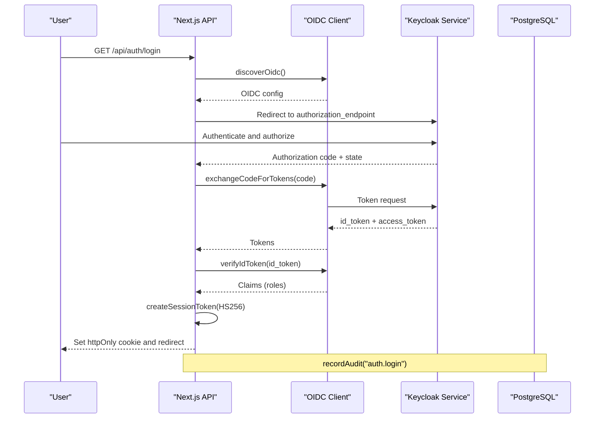
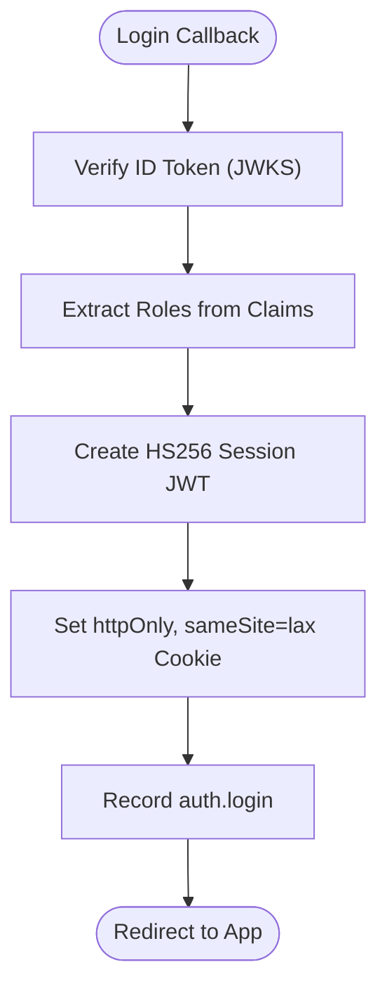
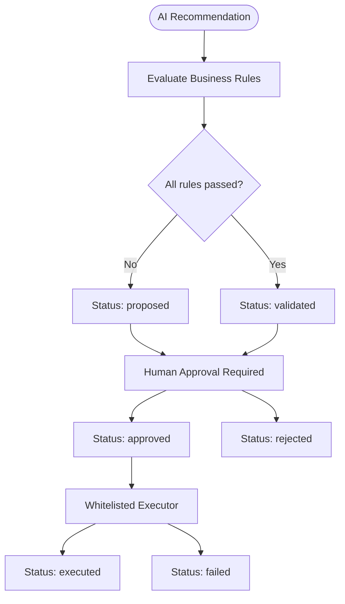
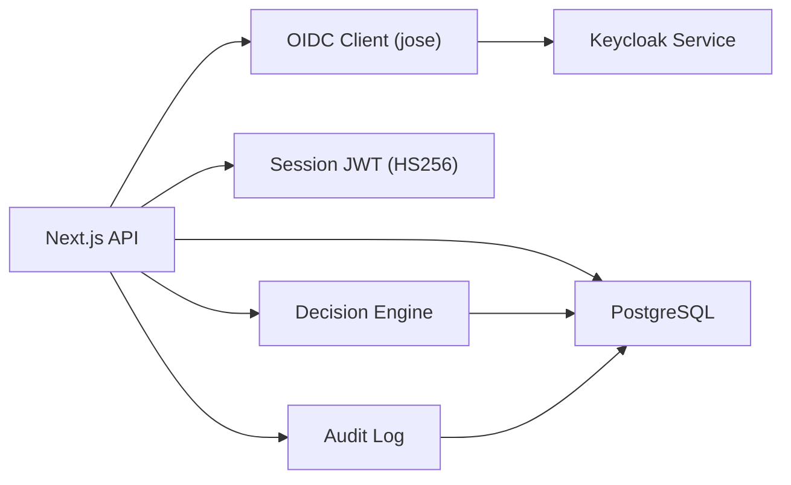

# Security & Compliance

<cite>
**Referenced Files in This Document**
- [src/lib/auth/session.ts](file://src/lib/auth/session.ts)
- [src/lib/auth/oidc.ts](file://src/lib/auth/oidc.ts)
- [src/app/api/auth/login/route.ts](file://src/app/api/auth/login/route.ts)
- [src/app/api/auth/callback/route.ts](file://src/app/api/auth/callback/route.ts)
- [src/app/api/auth/logout/route.ts](file://src/app/api/auth/logout/route.ts)
- [src/app/api/auth/me/route.ts](file://src/app/api/auth/me/route.ts)
- [services/keycloak.mjs](file://services/keycloak.mjs)
- [src/lib/audit.ts](file://src/lib/audit.ts)
- [src/db/schema.ts](file://src/db/schema.ts)
- [src/lib/decision-engine.ts](file://src/lib/decision-engine.ts)
- [backend/app/core/config.py](file://backend/app/core/config.py)
- [README.md](file://README.md)
</cite>

## Table of Contents
1. Introduction
2. Project Structure
3. Core Components
4. Architecture Overview
5. Detailed Component Analysis
6. Dependency Analysis
7. Performance Considerations
8. Troubleshooting Guide
9. Conclusion
10. Appendices

## Introduction
This document provides comprehensive security and compliance guidance for the GeraldOS platform. It covers:
- Identity and access management using Keycloak OIDC authentication
- Secure session management with HS256 JWT tokens
- Role-based access control (RBAC) foundations
- Audit logging, data privacy, and HIPAA-aligned controls
- Decision engine safety mechanisms ensuring human oversight and preventing unauthorized autonomous actions
- Security best practices, vulnerability assessment procedures, and penetration testing guidelines
- Compliance requirements for healthcare data protection, audit trails, and regulatory reporting
- Security incident response procedures and data breach protocols

## Project Structure
GeraldOS implements a layered security model:
- Frontend Next.js API routes handle OIDC flows and session lifecycle
- A Keycloak-compatible service provides discovery, authorization, token issuance, and logout endpoints
- Session tokens are signed HS256 JWTs stored in httpOnly cookies
- Audit logs and event records persist to PostgreSQL via Drizzle ORM
- The decision engine enforces business rules and requires explicit human approval before any action execution

**Diagram sources**
- [src/app/api/auth/login/route.ts:7-30](file://src/app/api/auth/login/route.ts#L7-L30)
- [src/app/api/auth/callback/route.ts:13-59](file://src/app/api/auth/callback/route.ts#L13-L59)
- [src/lib/auth/oidc.ts:18-95](file://src/lib/auth/oidc.ts#L18-L95)
- [src/lib/auth/session.ts:13-45](file://src/lib/auth/session.ts#L13-L45)
- [src/lib/audit.ts:4-24](file://src/lib/audit.ts#L4-L24)
- [src/lib/decision-engine.ts:91-245](file://src/lib/decision-engine.ts#L91-L245)
- [services/keycloak.mjs:46-119](file://services/keycloak.mjs#L46-L119)
- [src/db/schema.ts:182-193](file://src/db/schema.ts#L182-L193)

**Section sources**
- [src/app/api/auth/login/route.ts:7-30](file://src/app/api/auth/login/route.ts#L7-L30)
- [src/app/api/auth/callback/route.ts:13-59](file://src/app/api/auth/callback/route.ts#L13-L59)
- [src/lib/auth/oidc.ts:18-95](file://src/lib/auth/oidc.ts#L18-L95)
- [src/lib/auth/session.ts:13-45](file://src/lib/auth/session.ts#L13-L45)
- [src/lib/audit.ts:4-24](file://src/lib/audit.ts#L4-L24)
- [src/lib/decision-engine.ts:91-245](file://src/lib/decision-engine.ts#L91-L245)
- [services/keycloak.mjs:46-119](file://services/keycloak.mjs#L46-L119)
- [src/db/schema.ts:182-193](file://src/db/schema.ts#L182-L193)

## Core Components
- OIDC Authentication: Discovery, authorization URL generation, code exchange, ID token verification, and role extraction from Keycloak
- Session Management: Creation and verification of HS256-signed session JWTs; secure cookie configuration
- RBAC Foundations: Roles table with permissions; roles extracted from Keycloak claims and persisted as part of session context
- Audit Logging: Centralized recording of user actions, decisions, and system events to an immutable log table
- Decision Engine: Business rule evaluation, state machine for proposals/approvals/executions, whitelisted executors, and mandatory human approval

**Section sources**
- [src/lib/auth/oidc.ts:18-95](file://src/lib/auth/oidc.ts#L18-L95)
- [src/lib/auth/session.ts:13-45](file://src/lib/auth/session.ts#L13-L45)
- [src/db/schema.ts:314-321](file://src/db/schema.ts#L314-L321)
- [src/lib/audit.ts:4-24](file://src/lib/audit.ts#L4-L24)
- [src/lib/decision-engine.ts:45-245](file://src/lib/decision-engine.ts#L45-L245)

## Architecture Overview
The security architecture integrates OIDC identity federation with local session enforcement and strict governance over automated actions.

**Diagram sources**
- [src/app/api/auth/login/route.ts:7-30](file://src/app/api/auth/login/route.ts#L7-L30)
- [src/app/api/auth/callback/route.ts:13-59](file://src/app/api/auth/callback/route.ts#L13-L59)
- [src/lib/auth/oidc.ts:18-95](file://src/lib/auth/oidc.ts#L18-L95)
- [services/keycloak.mjs:46-119](file://services/keycloak.mjs#L46-L119)
- [src/lib/audit.ts:4-24](file://src/lib/audit.ts#L4-L24)

## Detailed Component Analysis

### Keycloak OIDC Authentication
- Discovery: Retrieves OIDC configuration from the issuer with a timeout and caches it per issuer
- Authorization: Builds an authorization URL with client_id, response_type=code, scope, redirect_uri, and state
- Token Exchange: Exchanges the authorization code for id_token and access_token at the token endpoint
- Verification: Verifies the id_token against the remote JWKS set, enforcing issuer and audience
- Role Extraction: Combines realm roles and client roles into a unified list used for session context

Security notes:
- Uses jose for cryptographic operations and remote JWKS verification
- Enforces timeouts on network calls to mitigate DoS risks
- State parameter is validated server-side during callback to prevent CSRF

**Section sources**
- [src/lib/auth/oidc.ts:18-95](file://src/lib/auth/oidc.ts#L18-L95)
- [src/app/api/auth/login/route.ts:7-30](file://src/app/api/auth/login/route.ts#L7-L30)
- [src/app/api/auth/callback/route.ts:13-59](file://src/app/api/auth/callback/route.ts#L13-L59)
- [services/keycloak.mjs:46-119](file://services/keycloak.mjs#L46-L119)

### Session Management with HS256 JWT
- Session token creation: Signs a JWT with HS256 using a secret key sourced from environment variables
- Cookie configuration: Sets httpOnly, sameSite=lax, path=/, and maxAge to limit exposure and duration
- Session verification: Validates signature and extracts minimal user context (sub, name, email, roles, iss)
- Me endpoint: Returns authenticated status and user info based on the presence of a valid session cookie

Security notes:
- Secret rotation should be supported by application logic to avoid reissuing sessions with compromised keys
- Ensure AUTH_SECRET is strong and managed securely in production environments

**Diagram sources**
- [src/app/api/auth/callback/route.ts:13-59](file://src/app/api/auth/callback/route.ts#L13-L59)
- [src/lib/auth/session.ts:13-45](file://src/lib/auth/session.ts#L13-L45)
- [src/lib/audit.ts:4-24](file://src/lib/audit.ts#L4-L24)

**Section sources**
- [src/lib/auth/session.ts:13-45](file://src/lib/auth/session.ts#L13-L45)
- [src/app/api/auth/me/route.ts:7-14](file://src/app/api/auth/me/route.ts#L7-L14)
- [README.md:115-121](file://README.md#L115-L121)

### Role-Based Access Control (RBAC) Foundations
- Roles schema: Stores role names, descriptions, and JSONB permissions; supports system roles and timestamps
- Role normalization: Ensures permissions are consistently represented as arrays for UI consumption
- Integration with OIDC: Roles derived from Keycloak claims populate session context for downstream authorization checks

Compliance note:
- Maintain least privilege by assigning only necessary roles and permissions to users
- Periodically review roles and permissions for alignment with job functions

**Section sources**
- [src/db/schema.ts:314-321](file://src/db/schema.ts#L314-L321)
- [src/app\api\roles\route.ts:5-57](file://src/app/api/roles/route.ts#L5-L57)
- [src/lib/auth/oidc.ts:90-95](file://src/lib/auth/oidc.ts#L90-L95)

### Audit Logging Capabilities
- Centralized audit function: Inserts structured entries including userId, action, module, entityType, entityId, details, and timestamp
- Schema: Immutable log table with fields for IP address and JSONB details for rich context
- Usage: Integrated across authentication and decision engine workflows to ensure traceability

HIPAA alignment:
- Captures who did what, when, and where (IP), supporting accountability and non-repudiation
- Protects sensitive PHI by avoiding inclusion of patient identifiers unless required and authorized

**Section sources**
- [src/lib/audit.ts:4-24](file://src/lib/audit.ts#L4-L24)
- [src/db/schema.ts:182-193](file://src/db/schema.ts#L182-L193)

### Decision Engine Safety Mechanisms
- Business rules: Prevent unauthorized or unsafe autonomous actions (e.g., no auto-finalization of reports, no autonomous diagnosis, constraints on STAT priority)
- State machine: Proposals transition through proposed → validated → approved → executed/rejected/failed
- Human approval: Explicit approval required before execution; rejection reasons recorded
- Whitelisted executors: Only predefined safe actions can execute (e.g., workflow stage transitions, equipment status updates, notifications)
- Audit and events: Every step writes audit records and publishes events for observability

**Diagram sources**
- [src/lib/decision-engine.ts:45-245](file://src/lib/decision-engine.ts#L45-L245)
- [src/db/schema.ts:382-404](file://src/db/schema.ts#L382-L404)

**Section sources**
- [src/lib/decision-engine.ts:45-245](file://src/lib/decision-engine.ts#L45-L245)
- [src/db/schema.ts:382-404](file://src/db/schema.ts#L382-L404)

### Data Privacy Measures
- Minimal data in sessions: Only essential user attributes included in session JWT
- Secure cookies: httpOnly and sameSite=lax reduce XSS and CSRF risks
- Audit granularity: Record actions without embedding unnecessary PHI; use entity references instead of full records
- External integrations: Secrets and credentials remain server-side; only non-secret configuration exposed to clients

**Section sources**
- [src/lib/auth/session.ts:13-45](file://src/lib/auth/session.ts#L13-L45)
- [README.md:115-121](file://README.md#L115-L121)

### HIPAA Compliance Features
- Audit trails: Comprehensive logging of access and actions with timestamps and actor identification
- Access controls: OIDC-based authentication and RBAC foundations support minimum necessary access
- Integrity: Signed tokens and database schemas with timestamps ensure data integrity and change tracking
- Transmission security: Use HTTPS for all endpoints; enforce timeouts and validation on external calls

**Section sources**
- [src/lib/audit.ts:4-24](file://src/lib/audit.ts#L4-L24)
- [src/lib/auth/oidc.ts:18-95](file://src/lib/auth/oidc.ts#L18-L95)
- [src/db/schema.ts:182-193](file://src/db/schema.ts#L182-L193)

### Security Best Practices
- Strong secrets: Rotate AUTH_SECRET regularly; manage Keycloak client secrets securely
- Least privilege: Assign minimal roles and permissions; review periodically
- Input validation: Validate all inputs server-side; reject unknown or dangerous actions
- Timeouts and retries: Configure timeouts for external calls; implement retry policies with backoff
- Logging hygiene: Avoid logging sensitive data; sanitize logs for PHI and PII

[No sources needed since this section provides general guidance]

### Vulnerability Assessment Procedures
- Static analysis: Integrate linting and type checking; scan dependencies for known vulnerabilities
- Dynamic scanning: Perform runtime scans against staging environments mirroring production
- Configuration audits: Verify OIDC settings, cookie flags, and database connection parameters
- Secrets management: Ensure no secrets in code; validate environment variable usage

[No sources needed since this section provides general guidance]

### Penetration Testing Guidelines
- Authentication flows: Test OIDC login, callback, logout, and session handling for bypasses
- Authorization: Attempt horizontal and vertical privilege escalation using roles and permissions
- Decision engine: Validate that AI recommendations cannot bypass business rules or human approval
- Data exposure: Check for excessive information disclosure in responses and logs
- External integrations: Validate Keycloak endpoints, JWKS retrieval, and token exchange robustness

[No sources needed since this section provides general guidance]

### Compliance Requirements
- Healthcare data protection: Enforce access controls, encryption in transit, and auditability
- Audit trails: Maintain tamper-evident logs with sufficient detail for investigations
- Regulatory reporting: Generate reports from audit and event logs for compliance submissions

**Section sources**
- [src/lib/audit.ts:4-24](file://src/lib/audit.ts#L4-L24)
- [src/db/schema.ts:446-455](file://src/db/schema.ts#L446-L455)

### Security Incident Response Procedures
- Detection: Monitor audit logs and events for anomalies; alert on suspicious patterns
- Containment: Disable compromised accounts; rotate secrets; isolate affected services
- Eradication: Patch vulnerabilities; remove malicious configurations; update policies
- Recovery: Restore from backups if needed; validate integrity; re-enable services
- Post-incident: Review root cause; update controls; conduct lessons learned

[No sources needed since this section provides general guidance]

### Data Breach Protocols
- Notification: Follow legal obligations for notifying regulators and affected individuals
- Forensics: Preserve evidence; analyze logs and artifacts to determine scope
- Remediation: Implement additional safeguards; enhance monitoring and detection
- Documentation: Maintain detailed records of breach timeline and actions taken

[No sources needed since this section provides general guidance]

## Dependency Analysis
GeraldOS relies on several critical components for security and compliance:

**Diagram sources**
- [src/lib/auth/oidc.ts:18-95](file://src/lib/auth/oidc.ts#L18-L95)
- [src/lib/auth/session.ts:13-45](file://src/lib/auth/session.ts#L13-L45)
- [src/lib/audit.ts:4-24](file://src/lib/audit.ts#L4-L24)
- [src/lib/decision-engine.ts:91-245](file://src/lib/decision-engine.ts#L91-L245)
- [services/keycloak.mjs:46-119](file://services/keycloak.mjs#L46-L119)
- [src/db/schema.ts:182-193](file://src/db/schema.ts#L182-L193)

**Section sources**
- [src/lib/auth/oidc.ts:18-95](file://src/lib/auth/oidc.ts#L18-L95)
- [src/lib/auth/session.ts:13-45](file://src/lib/auth/session.ts#L13-L45)
- [src/lib/audit.ts:4-24](file://src/lib/audit.ts#L4-L24)
- [src/lib/decision-engine.ts:91-245](file://src/lib/decision-engine.ts#L91-L245)
- [services/keycloak.mjs:46-119](file://services/keycloak.mjs#L46-L119)
- [src/db/schema.ts:182-193](file://src/db/schema.ts#L182-L193)

## Performance Considerations
- OIDC discovery caching reduces repeated network calls
- Timeout configuration prevents hanging requests to external services
- Database queries in decision engine and audit logging should be optimized with appropriate indexes
- Minimize payload sizes in session tokens and audit logs to reduce storage and transmission overhead

[No sources needed since this section provides general guidance]

## Troubleshooting Guide
Common issues and resolutions:
- OIDC discovery failures: Verify KEYCLOAK_URL and network connectivity; check timeouts
- Token exchange errors: Ensure correct client_id, redirect_uri, and client_secret; inspect HTTP status codes
- Session verification failures: Confirm AUTH_SECRET consistency across deployments; check cookie flags
- Decision engine blocks: Review business rule results; ensure target actions are whitelisted and payloads are valid
- Audit write failures: Inspect database connectivity and permissions; log error details for investigation

**Section sources**
- [src/lib/auth/oidc.ts:18-95](file://src/lib/auth/oidc.ts#L18-L95)
- [src/app/api/auth/callback/route.ts:13-59](file://src/app/api/auth/callback/route.ts#L13-L59)
- [src/lib/auth/session.ts:13-45](file://src/lib/auth/session.ts#L13-L45)
- [src/lib/decision-engine.ts:91-245](file://src/lib/decision-engine.ts#L91-L245)
- [src/lib/audit.ts:4-24](file://src/lib/audit.ts#L4-L24)

## Conclusion
GeraldOS implements a robust security posture centered on OIDC authentication, secure session management, and strict governance over automated actions. The decision engine ensures human oversight for critical operations, while comprehensive audit logging supports compliance and forensic capabilities. Adhering to the recommended best practices, vulnerability assessments, and incident response procedures will strengthen the platform’s resilience and alignment with healthcare regulations.

[No sources needed since this section summarizes without analyzing specific files]

## Appendices

### Configuration Reference
- Backend service configuration includes database, Redis, MinIO, Keycloak, Orthanc, FHIR, and AI API keys
- Environment-driven settings enable secure deployment and separation of concerns

**Section sources**
- [backend/app/core/config.py:4-19](file://backend/app/core/config.py#L4-L19)