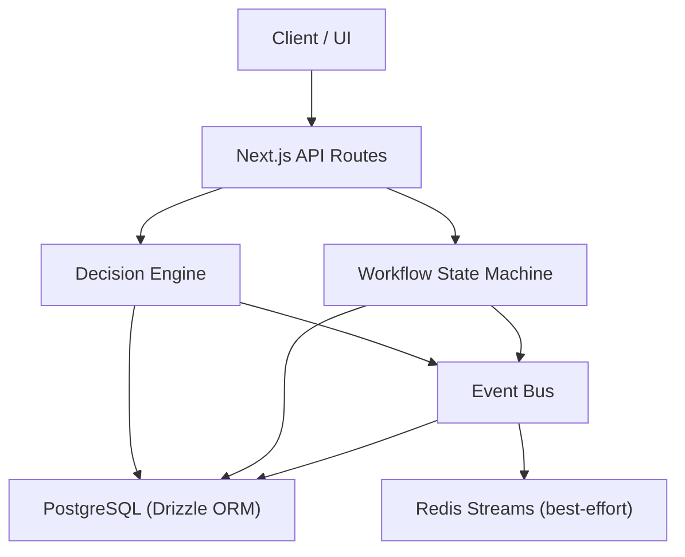
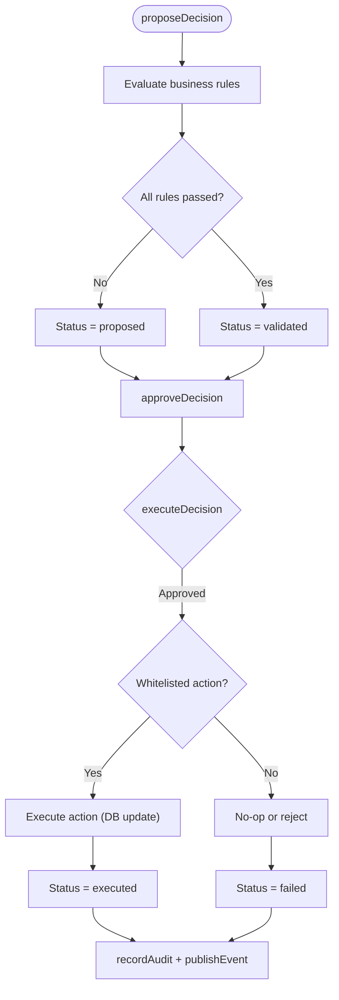
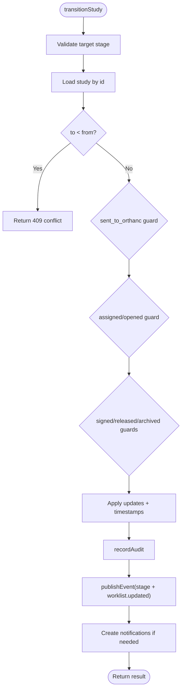
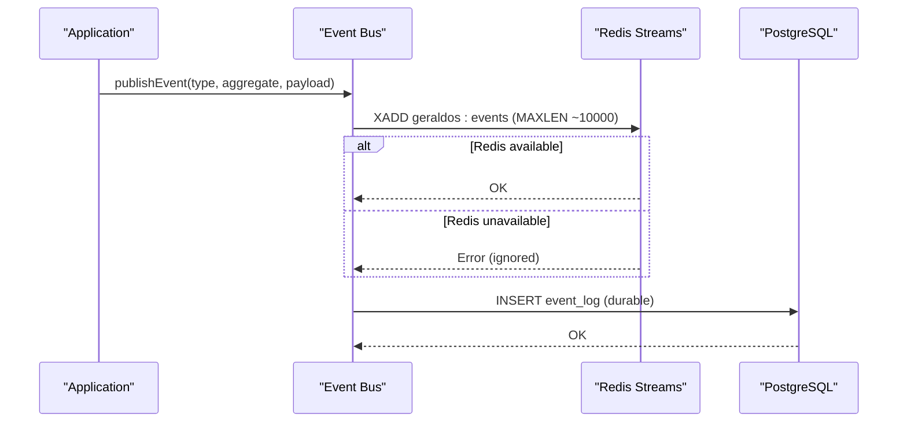
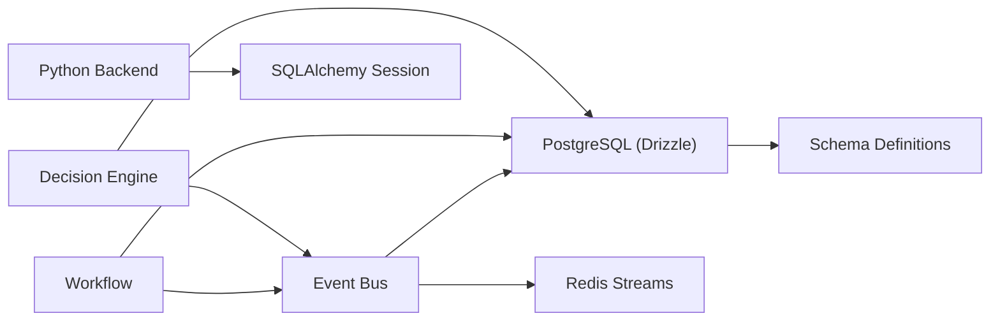

# Data Consistency & Synchronization

<cite>
**Referenced Files in This Document**
- [decision-engine.ts](file://src/lib/decision-engine.ts)
- [events.ts](file://src/lib/events.ts)
- [audit.ts](file://src/lib/audit.ts)
- [workflow.ts](file://src/lib/workflow.ts)
- [schema.ts](file://src/db/schema.ts)
- [index.ts](file://src/db/index.ts)
- [session.py](file://backend/app/db/session.py)
- [config.py](file://backend/app/core/config.py)
- [0000_redundant_the_twelve.sql](file://drizzle/0000_redundant_the_twelve.sql)
- [docker-compose.yml](file://docker-compose.yml)
</cite>

## Table of Contents
1. [Introduction](#introduction)
2. [Project Structure](#project-structure)
3. [Core Components](#core-components)
4. [Architecture Overview](#architecture-overview)
5. [Detailed Component Analysis](#detailed-component-analysis)
6. [Dependency Analysis](#dependency-analysis)
7. [Performance Considerations](#performance-considerations)
8. [Troubleshooting Guide](#troubleshooting-guide)
9. [Conclusion](#conclusion)

## Introduction
This document explains how GeraldOS maintains data consistency and synchronizes state across distributed components. It focuses on:
- Database transactions and atomicity for critical operations
- Event-driven eventual consistency between Redis Streams and PostgreSQL
- Decision engine governance, validation rules, and audit trails
- Conflict handling strategies for concurrent modifications
- Reconciliation approaches and monitoring to detect consistency issues

## Project Structure
GeraldOS uses a layered architecture:
- Next.js API routes orchestrate business logic via domain libraries
- Domain libraries enforce rules, manage workflows, emit events, and persist state
- PostgreSQL is the durable source of truth; Redis Streams provide high-throughput event distribution
- A Python backend service provides SQLAlchemy sessions for additional integrations



**Diagram sources**
- [events.ts:102-131](file://src/lib/events.ts#L102-L131)
- [decision-engine.ts:92-130](file://src/lib/decision-engine.ts#L92-L130)
- [workflow.ts:102-234](file://src/lib/workflow.ts#L102-L234)
- [index.ts:14-24](file://src/db/index.ts#L14-L24)

**Section sources**
- [events.ts:1-158](file://src/lib/events.ts#L1-L158)
- [decision-engine.ts:1-245](file://src/lib/decision-engine.ts#L1-L245)
- [workflow.ts:1-246](file://src/lib/workflow.ts#L1-L246)
- [index.ts:1-25](file://src/db/index.ts#L1-L25)

## Core Components
- Decision Engine: Enforces business rules, requires human approval before execution, records audits, and publishes events.
- Workflow State Machine: Governs forward-only transitions with guards, emits events, and updates notifications.
- Event Bus: Publishes to Redis Streams (capped) and persists durable events to PostgreSQL.
- Audit Logger: Writes immutable audit entries for compliance and traceability.
- Database Layer: Drizzle ORM over PostgreSQL with connection pooling; Python backend uses SQLAlchemy sessions.

**Section sources**
- [decision-engine.ts:19-130](file://src/lib/decision-engine.ts#L19-L130)
- [workflow.ts:37-234](file://src/lib/workflow.ts#L37-L234)
- [events.ts:18-131](file://src/lib/events.ts#L18-L131)
- [audit.ts:1-25](file://src/lib/audit.ts#L1-L25)
- [index.ts:1-25](file://src/db/index.ts#L1-L25)
- [session.py:1-17](file://backend/app/db/session.py#L1-L17)

## Architecture Overview
The system ensures strong consistency at the database layer while providing scalable, eventually consistent side effects through events.

```mermaid
sequenceDiagram
participant C as "Client"
participant API as "API Route"
participant DE as "Decision Engine"
participant DB as "PostgreSQL"
participant EB as "Event Bus"
participant R as "Redis Streams"
C->>API : Request action
API->>DE : proposeDecision(...)
DE->>DB : Insert ai_recommendation (transactional)
DB-->>DE : Row id
DE->>EB : publishEvent("decision.proposed")
EB->>R : XADD (best-effort, capped)
EB->>DB : INSERT event_log (durable)
Note over EB,R : Redis may be down; event_log remains authoritative
API->>DE : approveDecision(...)
DE->>DB : Update status=approved (transactional)
DE->>EB : publishEvent("decision.approved")
API->>DE : executeDecision(...)
DE->>DB : Execute whitelisted action(s) (transactional)
DE->>DB : Update status=executed/failed
DE->>EB : publishEvent("decision.executed")
```

**Diagram sources**
- [decision-engine.ts:92-235](file://src/lib/decision-engine.ts#L92-L235)
- [events.ts:102-131](file://src/lib/events.ts#L102-L131)

## Detailed Component Analysis

### Decision Engine: Rules, Approval, Execution, Audit
- Business rules are evaluated server-side before any action proceeds. Failing rules keep decisions in proposed state.
- Human approval is mandatory before execution. Only whitelisted actions can run.
- Every step writes an audit record and publishes an event.



**Diagram sources**
- [decision-engine.ts:46-130](file://src/lib/decision-engine.ts#L46-L130)
- [decision-engine.ts:142-235](file://src/lib/decision-engine.ts#L142-L235)

**Section sources**
- [decision-engine.ts:19-245](file://src/lib/decision-engine.ts#L19-L245)
- [audit.ts:1-25](file://src/lib/audit.ts#L1-L25)

### Workflow State Machine: Forward-Only Transitions and Guards
- Studies move forward only; backward moves return conflict errors.
- Stage-specific guards enforce clinical requirements (e.g., radiologist assignment, Orthanc presence).
- Each transition updates timestamps, emits stage and worklist events, and creates notifications where appropriate.



**Diagram sources**
- [workflow.ts:102-234](file://src/lib/workflow.ts#L102-L234)

**Section sources**
- [workflow.ts:1-246](file://src/lib/workflow.ts#L1-L246)

### Event Bus: Redis Streams and PostgreSQL Durability
- Events are published to Redis Streams with a capped length for performance.
- Events are always persisted to PostgreSQL’s event_log table for durability and auditing.
- If Redis is unavailable, publishing continues without blocking; consumers read from PostgreSQL when needed.



**Diagram sources**
- [events.ts:72-131](file://src/lib/events.ts#L72-L131)

**Section sources**
- [events.ts:1-158](file://src/lib/events.ts#L1-L158)

### Database Transactions and Atomicity
- The decision engine and workflow transitions perform single-statement updates within Drizzle queries that map to database transactions per operation.
- The Python backend uses SQLAlchemy sessions with autocommit disabled and explicit session lifecycle management.

Key points:
- Each decision state change is a discrete transactional update.
- Workflow transitions apply multiple fields atomically in one update statement.
- Audit and event persistence are best-effort side effects that do not block core state changes.

**Section sources**
- [decision-engine.ts:92-130](file://src/lib/decision-engine.ts#L92-L130)
- [workflow.ts:174-178](file://src/lib/workflow.ts#L174-L178)
- [session.py:1-17](file://backend/app/db/session.py#L1-L17)

### Validation Rules Enforcement and Audit Trail Generation
- Decision engine enforces strict rules (e.g., no autonomous diagnosis, STAT restrictions) and records rule results.
- Every significant action writes to audit_log with module, entity type, and details.
- Events capture lifecycle milestones for downstream consumers and dashboards.

**Section sources**
- [decision-engine.ts:46-130](file://src/lib/decision-engine.ts#L46-L130)
- [audit.ts:1-25](file://src/lib/audit.ts#L1-L25)
- [events.ts:18-60](file://src/lib/events.ts#L18-L60)

### Handling Concurrent Modifications and Conflict Resolution
- Backward workflow transitions are rejected with a conflict response to prevent inconsistent states.
- Decision engine requires actionable states before approval/execution, preventing race conditions on stale decisions.
- Eventual consistency is achieved via events; readers should handle duplicates and order using aggregateId and occurredAt.

Recommended patterns:
- Use idempotent handlers keyed by aggregateId to avoid duplicate processing.
- For write conflicts, implement retry with backoff and re-read current state before applying updates.
- Prefer optimistic checks (e.g., stage index comparisons) followed by atomic updates.

**Section sources**
- [workflow.ts:118-132](file://src/lib/workflow.ts#L118-L132)
- [decision-engine.ts:132-169](file://src/lib/decision-engine.ts#L132-L169)
- [events.ts:102-131](file://src/lib/events.ts#L102-L131)

### Data Reconciliation Processes
- Durable event_log serves as the reconciliation source when Redis is down or out-of-sync.
- Consumers can replay events from PostgreSQL to rebuild caches or reconcile state.
- Health endpoints for external systems (e.g., Orthanc) help verify integration status during reconciliation.

Reconciliation approach:
- Periodically compare Redis stream head with last event_log entry.
- On drift, replay missing events from event_log to Redis or target consumers.
- Monitor health endpoints to ensure downstream systems are reachable.

**Section sources**
- [events.ts:102-158](file://src/lib/events.ts#L102-L158)
- [docker-compose.yml:41-55](file://docker-compose.yml#L41-L55)

### Monitoring Approaches for Detecting Consistency Issues
- Use event counts and recent events to monitor activity and detect stalls.
- Track decision statuses to identify stuck approvals or failures.
- Observe workflow stage counts to spot bottlenecks or invalid transitions.

Operational tips:
- Alert on sudden drops in event throughput.
- Alert on decisions remaining in proposed/validated beyond SLA thresholds.
- Alert on repeated workflow transition conflicts.

**Section sources**
- [events.ts:133-158](file://src/lib/events.ts#L133-L158)
- [decision-engine.ts:237-245](file://src/lib/decision-engine.ts#L237-L245)
- [workflow.ts:236-243](file://src/lib/workflow.ts#L236-L243)

## Dependency Analysis


**Diagram sources**
- [decision-engine.ts:13-18](file://src/lib/decision-engine.ts#L13-L18)
- [workflow.ts:23-27](file://src/lib/workflow.ts#L23-L27)
- [events.ts:10-13](file://src/lib/events.ts#L10-L13)
- [index.ts:14-24](file://src/db/index.ts#L14-L24)
- [session.py:1-17](file://backend/app/db/session.py#L1-L17)

**Section sources**
- [decision-engine.ts:1-245](file://src/lib/decision-engine.ts#L1-L245)
- [workflow.ts:1-246](file://src/lib/workflow.ts#L1-L246)
- [events.ts:1-158](file://src/lib/events.ts#L1-L158)
- [index.ts:1-25](file://src/db/index.ts#L1-L25)
- [session.py:1-17](file://backend/app/db/session.py#L1-L17)

## Performance Considerations
- Redis Streams are capped to limit memory usage; use PostgreSQL for durable reads when Redis is unavailable.
- Event publishing is non-blocking; failures in Redis do not impact core state changes.
- Connection pooling reduces overhead for database operations.
- Avoid synchronous coupling between modules; rely on events for scalability.

[No sources needed since this section provides general guidance]

## Troubleshooting Guide
Common issues and resolutions:
- Redis unavailability: Events still persist to PostgreSQL; consumers should fall back to reading event_log.
- Stuck decisions: Check decision status and rule results; ensure approval occurs within policy constraints.
- Workflow conflicts: Verify current stage and required context (e.g., radiologist assignment, Orthanc presence).
- Audit gaps: Confirm audit logging is enabled and storage is healthy.

Actionable steps:
- Inspect recent events and counts to validate flow.
- Review decision logs for rule failures and approval delays.
- Validate workflow transitions against stage guards.

**Section sources**
- [events.ts:102-158](file://src/lib/events.ts#L102-L158)
- [decision-engine.ts:92-245](file://src/lib/decision-engine.ts#L92-L245)
- [workflow.ts:102-234](file://src/lib/workflow.ts#L102-L234)

## Conclusion
GeraldOS achieves strong consistency at the database layer while enabling scalable, eventually consistent side effects through an event-driven architecture. The decision engine enforces safety and compliance via rules, approvals, and audits. The workflow state machine prevents invalid transitions and ensures clinical integrity. Redis Streams provide high-throughput event distribution, with PostgreSQL serving as the durable source of truth for reconciliation and monitoring. Together, these patterns support robust multi-agent scenarios with clear conflict resolution and observability.

[No sources needed since this section summarizes without analyzing specific files]