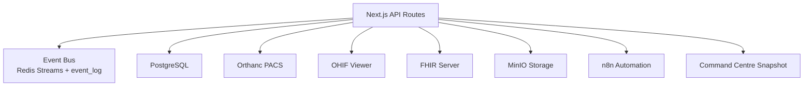
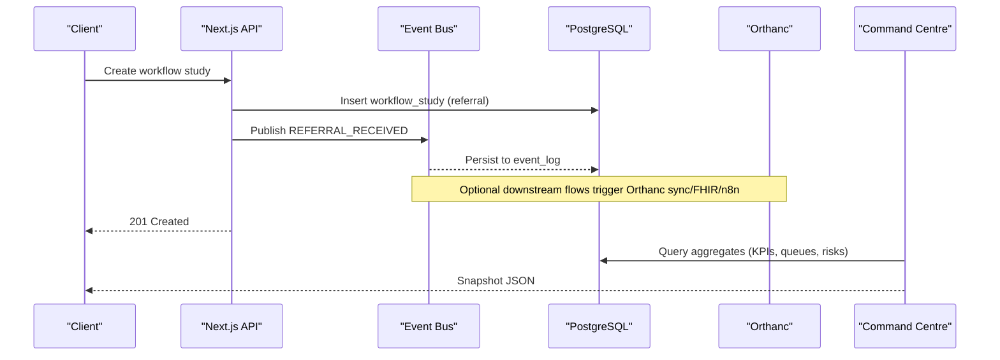
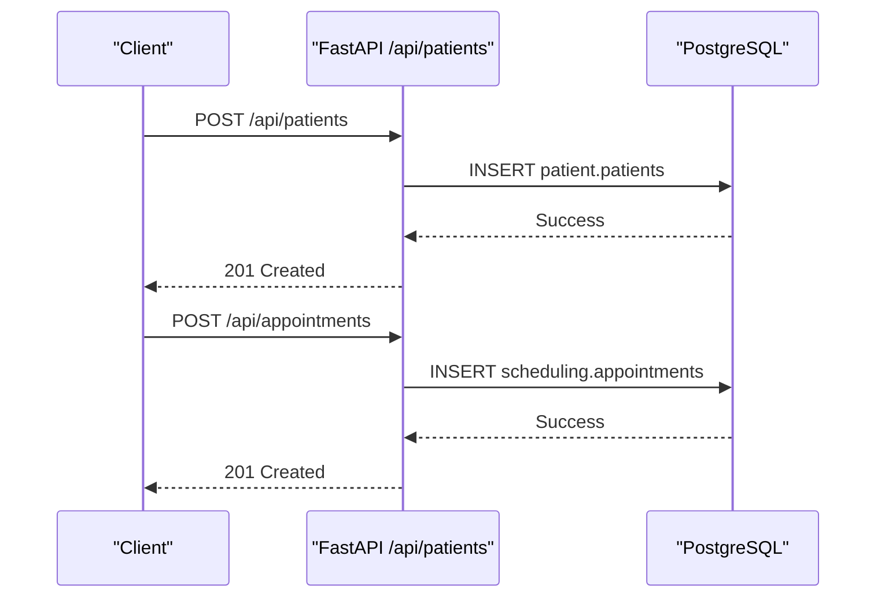
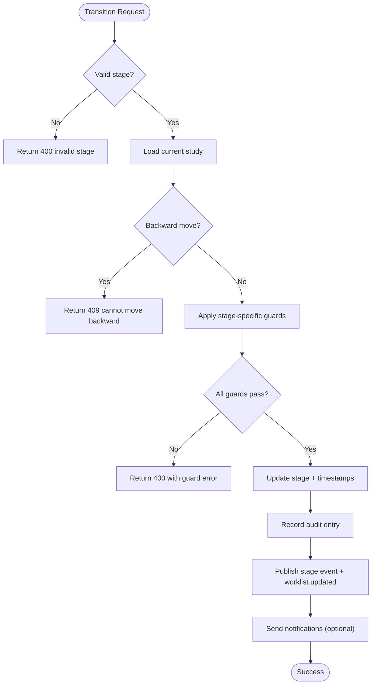
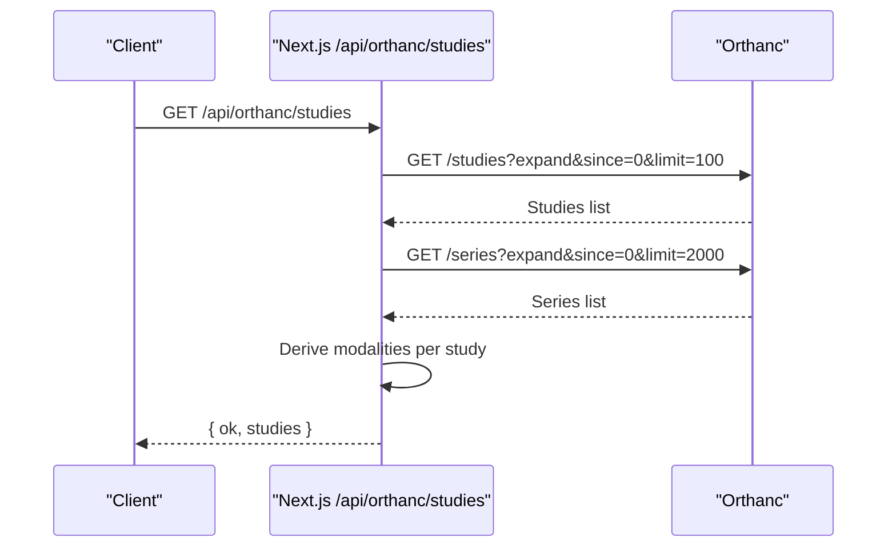
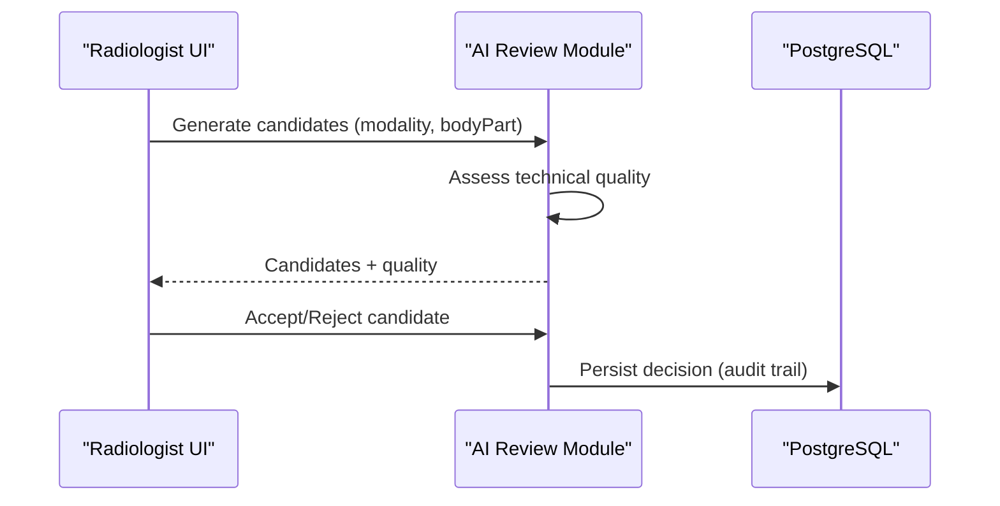
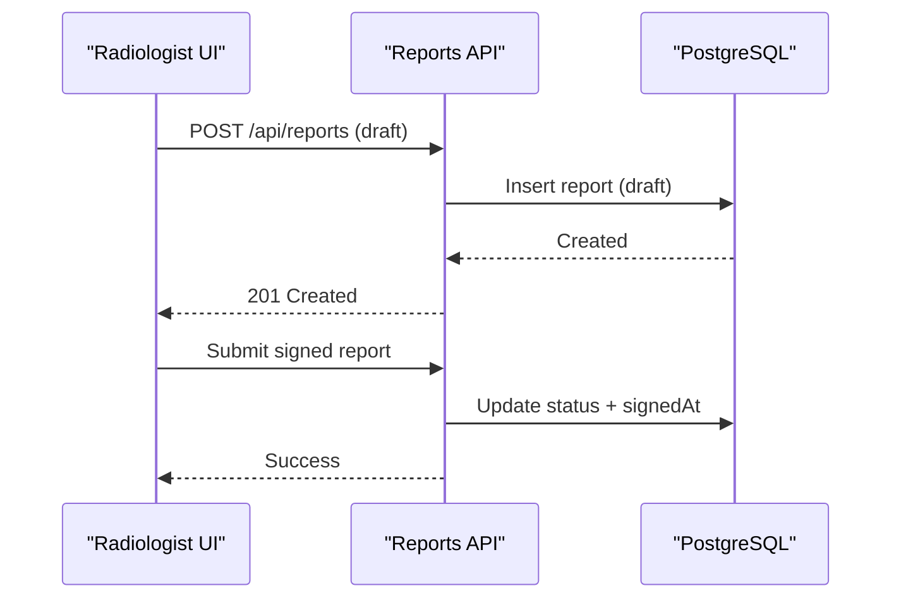
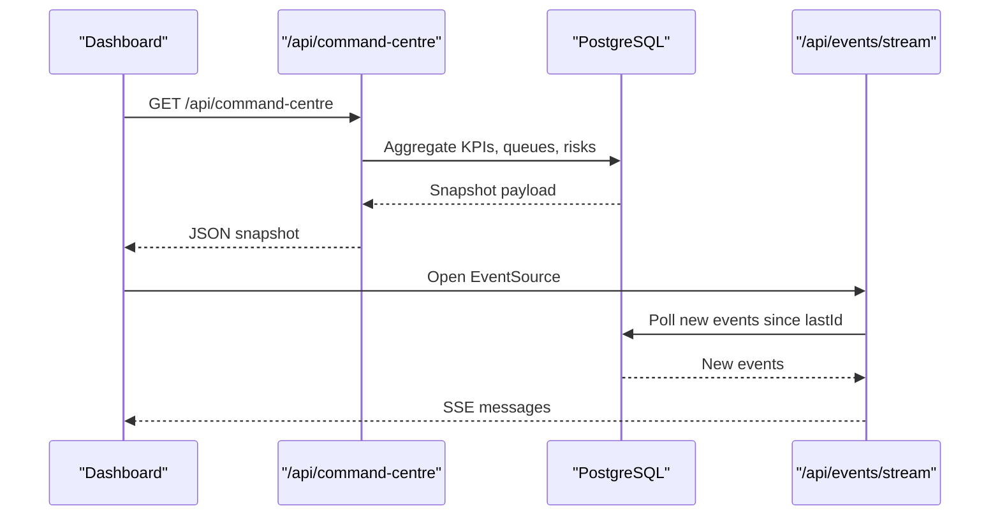
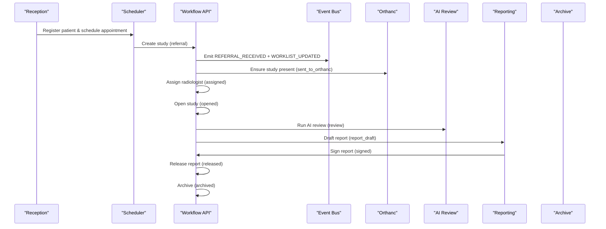
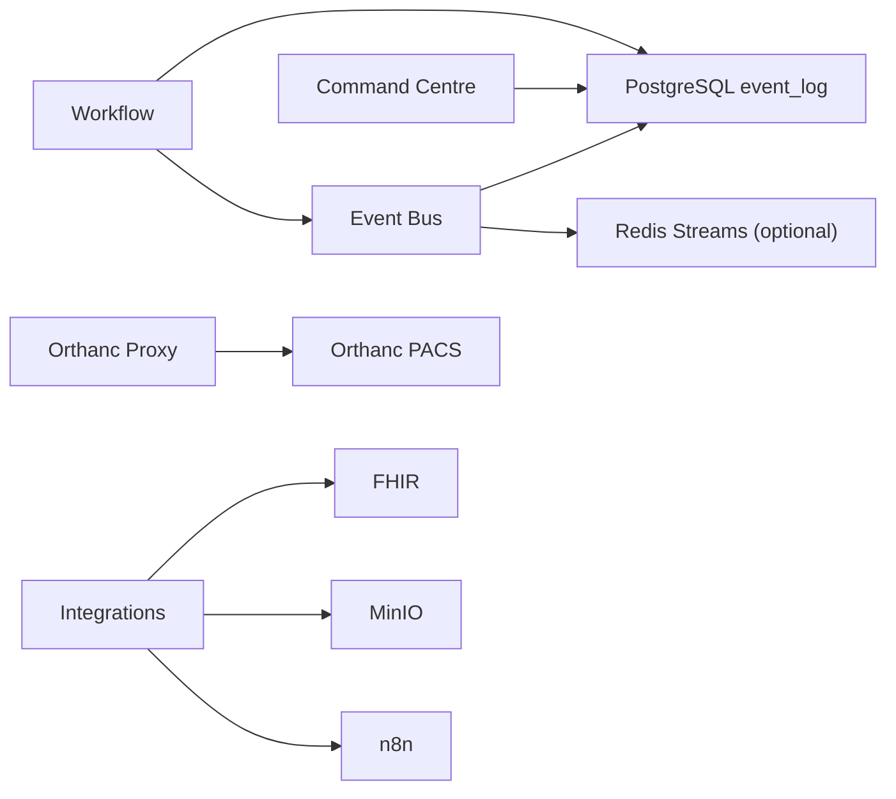

# Data Flow Patterns

<cite>
**Referenced Files in This Document**
- [events.ts](file://src/lib/events.ts)
- [route.ts (events)](file://src/app/api/events/route.ts)
- [route.ts (events stream)](file://src/app/api/events/stream/route.ts)
- [schema.ts](file://src/db/schema.ts)
- [workflow.ts](file://src/lib/workflow.ts)
- [route.ts (workflow)](file://src/app/api/workflow/route.ts)
- [route.ts (orthanc studies)](file://src/app/api/orthanc/studies/route.ts)
- [route.ts (reports)](file://src/app/api/reports/route.ts)
- [command-centre.ts](file://src/lib/command-centre.ts)
- [route.ts (command centre)](file://src/app/api/command-centre/route.ts)
- [ai-review.ts](file://src/lib/ai-review.ts)
- [reporting.ts](file://src/lib/reporting.ts)
- [main.py](file://backend/app/main.py)
- [config.py](file://backend/app/core/config.py)
- [integrations.py](file://backend/app/core/integrations.py)
</cite>

## Table of Contents
1. Introduction
2. Project Structure
3. Core Components
4. Architecture Overview
5. Detailed Component Analysis
6. Dependency Analysis
7. Performance Considerations
8. Troubleshooting Guide
9. Conclusion

## Introduction
This document describes the data flow patterns that power GeraldOS, focusing on an event-driven architecture built around Redis Streams and a durable PostgreSQL event log. It maps the primary pathways from patient registration through appointment scheduling, study creation, image acquisition, AI review, report generation, and final archiving. It also explains how real-time events feed the operations command centre dashboard, how data is transformed and validated across distributed components, and how consistency, retries, and performance are handled for high-throughput scenarios.

## Project Structure
GeraldOS exposes a Next.js API layer that coordinates domain workflows, persists state to PostgreSQL, and publishes events to Redis Streams when available. A separate FastAPI backend provides additional services (e.g., legacy endpoints, integrations). The core event bus lives in a shared library used by multiple routes and modules.

**Diagram sources**
- [events.ts:101-131](file://src/lib/events.ts#L101-L131)
- [route.ts (orthanc studies):20-86](file://src/app/api/orthanc/studies/route.ts#L20-L86)
- [integrations.py:60-119](file://backend/app/core/integrations.py#L60-L119)
- [command-centre.ts:54-206](file://src/lib/command-centre.ts#L54-L206)

**Section sources**
- [events.ts:1-158](file://src/lib/events.ts#L1-L158)
- [schema.ts:446-455](file://src/db/schema.ts#L446-L455)
- [main.py:32-103](file://backend/app/main.py#L32-L103)

## Core Components
- Event Bus: Centralized publish/subscribe over Redis Streams with a durable fallback to PostgreSQL’s event_log table. Provides typed event constants, best-effort Redis writes, and guaranteed persistence to the audit/event log.
- Workflow State Machine: Enforces forward-only transitions for clinical studies, validates preconditions (e.g., Orthanc presence, radiologist assignment), records audits, emits stage events, and refreshes worklists.
- Command Centre: Aggregates KPIs, queues, machine utilization, workload, alerts, and risks into a single snapshot payload consumed by dashboards.
- Integrations: Orthanc/PACS retrieval, FHIR synchronization, MinIO storage, n8n automation triggers.
- Reporting and AI Review: Structured templates, quality scoring, terminology checks, and candidate observation generation to assist radiologists without making diagnoses.

**Section sources**
- [events.ts:18-62](file://src/lib/events.ts#L18-L62)
- [workflow.ts:37-51](file://src/lib/workflow.ts#L37-L51)
- [command-centre.ts:27-52](file://src/lib/command-centre.ts#L27-L52)
- [integrations.py:9-19](file://backend/app/core/integrations.py#L9-L19)
- [reporting.ts:24-175](file://src/lib/reporting.ts#L24-L175)
- [ai-review.ts:168-220](file://src/lib/ai-review.ts#L168-L220)

## Architecture Overview
The system uses an event-driven backbone:
- Every significant action publishes an event via the event bus.
- Events are written to Redis Streams (capped) for low-latency consumers and always persisted to PostgreSQL event_log for durability.
- Consumers include the command centre, worklist updates, notifications, and external automations.
- External systems (Orthanc, FHIR, MinIO, n8n) are integrated via HTTP clients and SDKs.

**Diagram sources**
- [route.ts (workflow):55-101](file://src/app/api/workflow/route.ts#L55-L101)
- [events.ts:101-131](file://src/lib/events.ts#L101-L131)
- [command-centre.ts:54-206](file://src/lib/command-centre.ts#L54-L206)

## Detailed Component Analysis

### Patient Registration and Appointment Scheduling
- Backend registers patients and creates appointments using raw SQL against PostgreSQL schemas. These endpoints provide foundational entities for later workflow steps.
- While these endpoints do not directly emit platform events, they establish the patient and scheduling context required by the workflow state machine and reporting.

**Diagram sources**
- [main.py:32-60](file://backend/app/main.py#L32-L60)
- [main.py:75-103](file://backend/app/main.py#L75-L103)

**Section sources**
- [main.py:32-103](file://backend/app/main.py#L32-L103)
- [schema.ts:17-50](file://src/db/schema.ts#L17-L50)
- [schema.ts:82-100](file://src/db/schema.ts#L82-L100)

### Study Creation and Workflow Transitions
- Studies enter at referral and advance through a strict pipeline. Each transition validates preconditions, updates timestamps, records an audit entry, publishes stage-specific events, and emits a worklist update event.
- Critical guards ensure Orthanc presence before marking sent_to_orthanc, require radiologist assignment for assigned/opened, enforce signed-before-released, and allow archive only from released.

**Diagram sources**
- [workflow.ts:102-234](file://src/lib/workflow.ts#L102-L234)

**Section sources**
- [workflow.ts:37-51](file://src/lib/workflow.ts#L37-L51)
- [workflow.ts:102-234](file://src/lib/workflow.ts#L102-L234)
- [route.ts (workflow):55-101](file://src/app/api/workflow/route.ts#L55-L101)

### Image Acquisition and Orthanc Integration
- The Orthanc proxy retrieves studies and series metadata, enriching modalities from series when missing and filtering out unknown patients.
- Timed fetches protect against upstream latency; errors return structured reasons without crashing the caller.

**Diagram sources**
- [route.ts (orthanc studies):20-86](file://src/app/api/orthanc/studies/route.ts#L20-L86)

**Section sources**
- [route.ts (orthanc studies):20-86](file://src/app/api/orthanc/studies/route.ts#L20-L86)

### AI Review and Candidate Observations
- The AI review assistant generates candidate observations with confidence scores, suggested differentials, literature references, and technical quality assessments. All outputs are advisory; radiologists accept or reject candidates.
- Technical quality checks are modality-specific and produce pass/fail per check plus an overall score.

**Diagram sources**
- [ai-review.ts:91-103](file://src/lib/ai-review.ts#L91-L103)
- [ai-review.ts:168-220](file://src/lib/ai-review.ts#L168-L220)
- [schema.ts:358-380](file://src/db/schema.ts#L358-L380)

**Section sources**
- [ai-review.ts:91-103](file://src/lib/ai-review.ts#L91-L103)
- [ai-review.ts:168-220](file://src/lib/ai-review.ts#L168-L220)
- [schema.ts:358-380](file://src/db/schema.ts#L358-L380)

### Report Generation and Quality Gates
- Reporting provides structured templates, checklist reminders, terminology normalization, and quality scoring. Reports are created and listed via API endpoints; status transitions are enforced by the workflow state machine.
- Quality scoring evaluates content length, non-generic impressions, recommendation presence, placeholder detection, terminology consistency, and premature signing.

**Diagram sources**
- [route.ts (reports):6-45](file://src/app/api/reports/route.ts#L6-L45)
- [reporting.ts:232-290](file://src/lib/reporting.ts#L232-L290)
- [schema.ts:166-180](file://src/db/schema.ts#L166-L180)

**Section sources**
- [route.ts (reports):6-45](file://src/app/api/reports/route.ts#L6-L45)
- [reporting.ts:232-290](file://src/lib/reporting.ts#L232-L290)
- [schema.ts:166-180](file://src/db/schema.ts#L166-L180)

### Real-Time Command Centre Dashboard
- The command centre endpoint builds a comprehensive snapshot by querying multiple tables for KPIs, queues, machine utilization, radiologist workload, delays, inventory alerts, maintenance alerts, live AI recommendations, and operational risks.
- SSE streaming of events enables near-real-time updates to dashboards and workstations.

**Diagram sources**
- [route.ts (command centre):6-14](file://src/app/api/command-centre/route.ts#L6-L14)
- [command-centre.ts:54-206](file://src/lib/command-centre.ts#L54-L206)
- [route.ts (events stream):20-94](file://src/app/api/events/stream/route.ts#L20-L94)

**Section sources**
- [route.ts (command centre):6-14](file://src/app/api/command-centre/route.ts#L6-L14)
- [command-centre.ts:54-206](file://src/lib/command-centre.ts#L54-L206)
- [route.ts (events stream):20-94](file://src/app/api/events/stream/route.ts#L20-L94)

### End-to-End Workflow Sequence

**Diagram sources**
- [route.ts (workflow):55-101](file://src/app/api/workflow/route.ts#L55-L101)
- [workflow.ts:37-51](file://src/lib/workflow.ts#L37-L51)
- [events.ts:18-62](file://src/lib/events.ts#L18-L62)

## Dependency Analysis
- Event Bus depends on PostgreSQL (event_log) and optionally Redis Streams for real-time distribution.
- Workflow module depends on database schema for workflow studies, reports, staff, and notifications; it also depends on the event bus and audit logging.
- Command centre depends on multiple domain tables to compute snapshots.
- Orthanc integration depends on network connectivity and authentication headers; failures are surfaced gracefully.
- Backend integrations manage Keycloak token verification, FHIR synchronization, n8n triggers, and MinIO uploads.

**Diagram sources**
- [events.ts:101-131](file://src/lib/events.ts#L101-L131)
- [workflow.ts:102-234](file://src/lib/workflow.ts#L102-L234)
- [command-centre.ts:54-206](file://src/lib/command-centre.ts#L54-L206)
- [route.ts (orthanc studies):20-86](file://src/app/api/orthanc/studies/route.ts#L20-L86)
- [integrations.py:37-119](file://backend/app/core/integrations.py#L37-L119)

**Section sources**
- [events.ts:101-131](file://src/lib/events.ts#L101-L131)
- [workflow.ts:102-234](file://src/lib/workflow.ts#L102-L234)
- [command-centre.ts:54-206](file://src/lib/command-centre.ts#L54-L206)
- [route.ts (orthanc studies):20-86](file://src/app/api/orthanc/studies/route.ts#L20-L86)
- [integrations.py:37-119](file://backend/app/core/integrations.py#L37-L119)

## Performance Considerations
- Event publishing uses Redis Streams with a capped maxlen to prevent unbounded growth; if Redis is unavailable, events still persist to PostgreSQL for durability.
- Command centre queries aggregate across many tables; consider indexing frequently filtered columns (e.g., stage, priority, dates) and caching hot KPIs where appropriate.
- Orthanc calls use timed fetches to avoid long waits; batch series queries to derive modalities efficiently.
- SSE polling interval balances freshness and load; tune POLL_INTERVAL_MS based on expected event volume.
- For high-throughput scenarios, consider:
  - Horizontal scaling of API instances behind a load balancer.
  - Read replicas for heavy aggregation queries.
  - Caching command centre snapshots with short TTLs for dashboards.
  - Backpressure handling in Redis consumers and idempotent event processing.

[No sources needed since this section provides general guidance]

## Troubleshooting Guide
- Event Bus Failures: If Redis is down, events continue to be persisted to event_log; verify connectivity and backoff behavior.
- Workflow Transition Errors:
  - 400: Invalid stage or missing prerequisites (e.g., no studyInstanceUid for sent_to_orthanc, no radiologist for assigned/opened).
  - 409: Attempted backward transition.
- Orthanc Connectivity: Upstream HTTP errors return structured reasons; check timeouts and authentication headers.
- Command Centre Build Failures: Aggregation errors return a generic failure response; inspect individual queries and indexes.
- Reporting Issues: Quality gates may block signing due to incomplete content or terminology drift; use scoring and terminology checks to guide corrections.

**Section sources**
- [events.ts:72-99](file://src/lib/events.ts#L72-L99)
- [events.ts:101-131](file://src/lib/events.ts#L101-L131)
- [workflow.ts:111-165](file://src/lib/workflow.ts#L111-L165)
- [route.ts (orthanc studies):20-86](file://src/app/api/orthanc/studies/route.ts#L20-L86)
- [reporting.ts:273-325](file://src/lib/reporting.ts#L273-L325)

## Conclusion
GeraldOS implements a robust, event-driven data flow that decouples components while ensuring durability and real-time visibility. The workflow state machine enforces clinical safety and compliance, the event bus powers live dashboards and cross-system coordination, and integrations connect imaging, interoperability, storage, and automation layers. With careful indexing, caching, and resilient event handling, the platform scales to support high-throughput radiology operations.