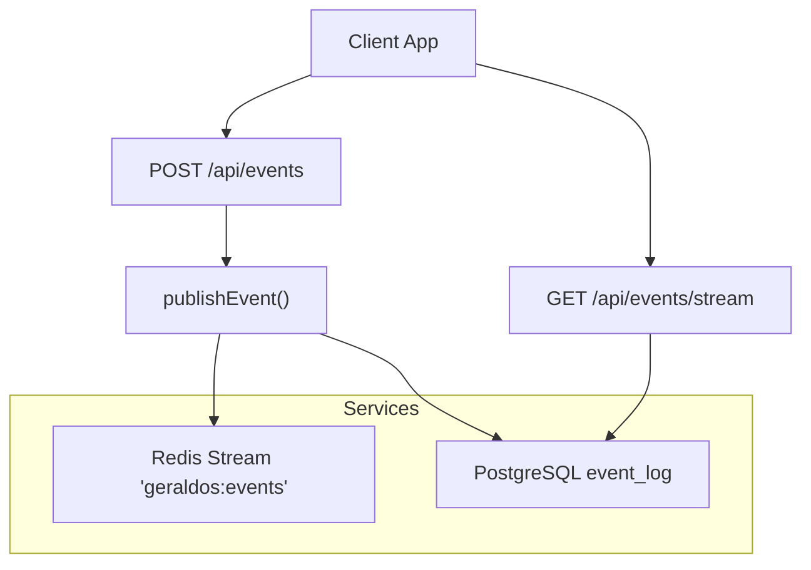
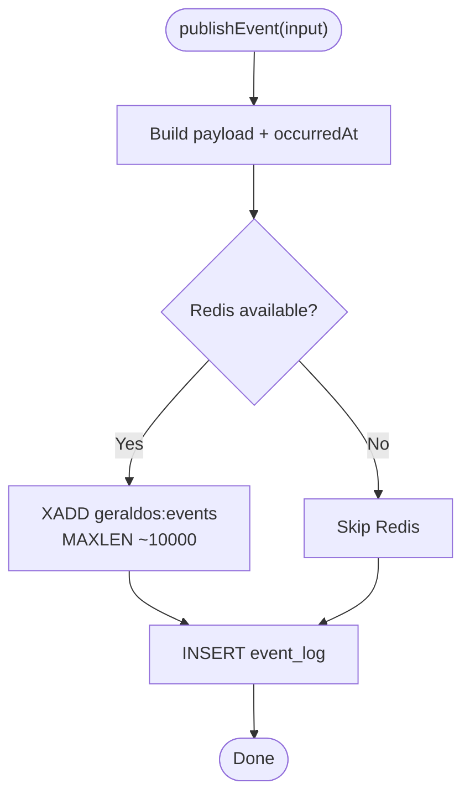
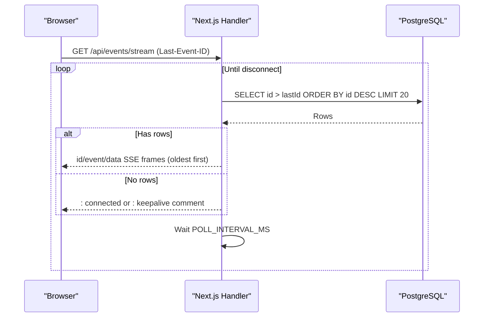
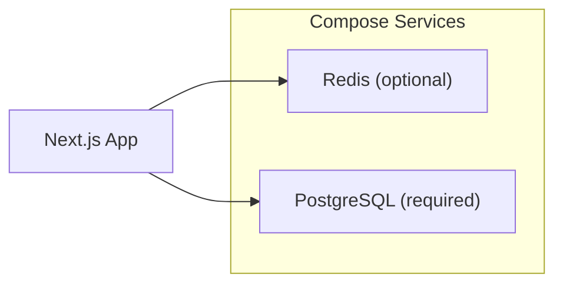

# Event Streaming Architecture

<cite>
**Referenced Files in This Document**
- [events.ts](file://src/lib/events.ts)
- [route.ts (events)](file://src/app/api/events/route.ts)
- [route.ts (events/stream)](file://src/app/api/events/stream/route.ts)
- [schema.ts](file://src/db/schema.ts)
- [docker-compose.yml](file://docker-compose.yml)
- [config.py](file://backend/app/core/config.py)
- [route.ts (orthanc/upload)](file://src/app/api/orthanc/upload/route.ts)
- [route.ts (ai-review)](file://src/app/api/ai-review/route.ts)
- [route.ts (reports/[id])]](file://src/app/api/reports/[id]/route.ts)
</cite>

## Table of Contents
1. Introduction
2. Project Structure
3. Core Components
4. Architecture Overview
5. Detailed Component Analysis
6. Dependency Analysis
7. Performance Considerations
8. Troubleshooting Guide
9. Conclusion

## Introduction
This document explains GeraldOS event streaming architecture that uses a dual-layer approach:
- Redis Streams for real-time, high-throughput communication with capped memory usage.
- PostgreSQL event_log table for durable persistence and fallback when Redis is unavailable.

The system publishes domain events from multiple modules, persists them reliably to PostgreSQL, and optionally fans out to Redis Streams for low-latency consumers. A Server-Sent Events (SSE) endpoint streams recent events to clients using the durable log as the source of truth.

## Project Structure
Key files implementing the event bus and streaming endpoints:
- Event publishing and utilities: src/lib/events.ts
- REST API for listing/publishing events: src/app/api/events/route.ts
- SSE stream for real-time updates: src/app/api/events/stream/route.ts
- Database schema including event_log: src/db/schema.ts
- Infrastructure services (Postgres, Redis): docker-compose.yml
- Backend configuration defaults: backend/app/core/config.py
- Example producers emitting events: orthanc upload, AI review, reports



**Diagram sources**
- [events.ts:101-131](file://src/lib/events.ts#L101-L131)
- [route.ts (events/stream):20-93](file://src/app/api/events/stream/route.ts#L20-L93)
- [route.ts (events):18-37](file://src/app/api/events/route.ts#L18-L37)
- [schema.ts:446-455](file://src/db/schema.ts#L446-L455)

**Section sources**
- [events.ts:1-158](file://src/lib/events.ts#L1-L158)
- [route.ts (events):1-38](file://src/app/api/events/route.ts#L1-L38)
- [route.ts (events/stream):1-94](file://src/app/api/events/stream/route.ts#L1-L94)
- [schema.ts:446-455](file://src/db/schema.ts#L446-L455)
- [docker-compose.yml:4-25](file://docker-compose.yml#L4-L25)

## Core Components
- Event types registry and constants: centralized list of domain events and shared names used across modules.
- publishEvent(): writes to Redis Streams (best-effort, capped) and always attempts to persist to PostgreSQL event_log.
- listEvents()/eventCounts(): read from PostgreSQL for history and analytics.
- SSE endpoint (/api/events/stream): polls PostgreSQL every ~5 seconds and pushes new events to clients via SSE.

Key responsibilities:
- Decouple producers from consumers by emitting events rather than calling downstream logic directly.
- Ensure durability through PostgreSQL even if Redis is down.
- Provide real-time UI updates via SSE without blocking request/response cycles.

**Section sources**
- [events.ts:18-70](file://src/lib/events.ts#L18-L70)
- [events.ts:101-158](file://src/lib/events.ts#L101-L158)
- [route.ts (events/stream):20-93](file://src/app/api/events/stream/route.ts#L20-L93)

## Architecture Overview
GeraldOS implements a dual-layer event pipeline:
- Producer calls publishEvent(), which:
  - Attempts to append an entry to Redis Stream geraldos:events with MAXLEN cap.
  - Persists the same event to PostgreSQL event_log.
- Consumers:
  - Real-time UI: GET /api/events/stream reads from PostgreSQL and streams via SSE.
  - Optional background consumers: can read from Redis Stream using consumer groups for fan-out processing.

```mermaid
sequenceDiagram
participant P as "Producer"
participant E as "publishEvent()"
participant R as "Redis Stream"
participant D as "PostgreSQL event_log"
participant S as "SSE Client"
P->>E : publishEvent({type, aggregate, payload})
E->>R : XADD (MAXLEN ~10000)
Note over E,R : Best-effort; failures are ignored
E->>D : INSERT event_log
S->>S : Open GET /api/events/stream
loop Every ~5s
S->>D : SELECT id > lastId ORDER BY id DESC LIMIT 20
D-->>S : Rows
S-->>S : Encode SSE frames and send
end
```

**Diagram sources**
- [events.ts:101-131](file://src/lib/events.ts#L101-L131)
- [route.ts (events/stream):20-93](file://src/app/api/events/stream/route.ts#L20-L93)

## Detailed Component Analysis

### Event Publishing Mechanism
- Centralized function publishEvent() constructs a normalized payload including occurredAt timestamp.
- Redis write:
  - Uses XADD with MAXLEN ~10000 to cap stream size and avoid unbounded growth.
  - Non-fatal on failure; includes backoff to avoid reconnect storms.
- PostgreSQL write:
  - Inserts into event_log with eventType, aggregate, aggregateId, payload, source, occurredAt.
  - Ensures durable audit trail regardless of Redis availability.



**Diagram sources**
- [events.ts:72-99](file://src/lib/events.ts#L72-L99)
- [events.ts:101-131](file://src/lib/events.ts#L101-L131)

**Section sources**
- [events.ts:72-131](file://src/lib/events.ts#L72-L131)

### Consumer Groups and Stream Management Patterns
- Stream name: geraldos:events
- Group name: geraldos-consumers
- Memory management: MAXLEN ~10000 caps the stream to approximate entries, preventing unbounded memory growth while retaining recent history for replay or catch-up.
- Typical consumer pattern (conceptual):
  - Use XREADGROUP with group geraldos-consumers and consumer name per process.
  - Acknowledge messages after successful processing.
  - Handle errors and retry with backoff; use pending entries lists for dead-letter handling.

Note: The repository defines the stream and group constants and enforces MAXLEN at publish time. Actual consumer implementations would use these constants and standard Redis Streams semantics.

**Section sources**
- [events.ts:15-16](file://src/lib/events.ts#L15-L16)
- [events.ts:101-131](file://src/lib/events.ts#L101-L131)

### SSE Real-Time Updates
- Endpoint GET /api/events/stream maintains a long-lived connection.
- Polls PostgreSQL every ~5 seconds for new rows since lastId.
- Sends SSE frames with id, event type, and JSON data; reverses order to ensure oldest-first delivery.
- Emits keepalive comments when database is temporarily unavailable.



**Diagram sources**
- [route.ts (events/stream):20-93](file://src/app/api/events/stream/route.ts#L20-L93)

**Section sources**
- [route.ts (events/stream):1-94](file://src/app/api/events/stream/route.ts#L1-L94)

### Event Types and Payload Structures
- Event types are centrally defined and include patient, appointment, study, report, AI review, inventory, equipment, knowledge, and notification domains.
- Common payload fields added by the bus:
  - occurredAt: ISO timestamp injected at publish time.
  - Additional fields depend on domain context (e.g., modality, counts, IDs).

Examples of emitted events in the codebase:
- ai.observation_suggested with aggregate ai-review and payload describing modality and candidate count.
- study.uploaded with aggregate orthanc and payload summarizing success/failure counts.
- report.versioned and report.signed with aggregate report and version/approval details.

**Section sources**
- [events.ts:18-62](file://src/lib/events.ts#L18-L62)
- [route.ts (ai-review):100-105](file://src/app/api/ai-review/route.ts#L100-L105)
- [route.ts (orthanc/upload):66-70](file://src/app/api/orthanc/upload/route.ts#L66-L70)
- [route.ts (reports/[id]):95-121](file://src/app/api/reports/[id]/route.ts#L95-L121)

### Fallback Strategy When Redis Is Unavailable
- Redis access is best-effort; failures do not block or fail the overall operation.
- A short backoff period prevents reconnect storms after failures.
- PostgreSQL event_log remains the durable record, ensuring no loss of audit/activity information.
- SSE relies on PostgreSQL, so real-time UI continues working even if Redis is down.

**Section sources**
- [events.ts:72-99](file://src/lib/events.ts#L72-L99)
- [events.ts:101-131](file://src/lib/events.ts#L101-L131)
- [route.ts (events/stream):20-93](file://src/app/api/events/stream/route.ts#L20-L93)

### Stream Configuration and Memory Management
- Stream name: geraldos:events
- Group name: gerdalos-consumers (as defined in constants)
- Cap strategy: MAXLEN ~10000 applied on XADD to approximate cap and prevent unbounded growth.
- Recommended consumer behavior:
  - Use consumer groups to partition workloads across multiple workers.
  - Acknowledge only after successful processing.
  - Monitor stream length and adjust MAXLEN based on throughput and retention needs.

**Section sources**
- [events.ts:15-16](file://src/lib/events.ts#L15-L16)
- [events.ts:101-131](file://src/lib/events.ts#L101-L131)

### Performance Considerations for High Throughput
- Redis Streams:
  - Use MAXLEN to bound memory and maintain performance under load.
  - Prefer consumer groups to parallelize processing and scale horizontally.
- PostgreSQL:
  - SSE polling interval (~5s) balances freshness and DB load. Tune based on latency requirements.
  - Indexing: consider indexing event_log.eventType and event_log.id for faster queries and ordering.
- Network and client:
  - SSE keeps connections open; ensure reverse proxy settings allow long-lived connections and disable buffering where applicable.
- Backpressure:
  - If consumers lag, rely on Redis stream backlog (capped) and PostgreSQL as the authoritative source for replay.

[No sources needed since this section provides general guidance]

## Dependency Analysis
External services and configuration:
- Redis: optional for real-time; configured via integration config; health-checked in compose.
- PostgreSQL: required for persistence and SSE; configured via environment and compose.
- Backend service configuration includes default URLs for Redis and Postgres.



**Diagram sources**
- [docker-compose.yml:4-25](file://docker-compose.yml#L4-L25)
- [config.py:4-19](file://backend/app/core/config.py#L4-L19)

**Section sources**
- [docker-compose.yml:4-25](file://docker-compose.yml#L4-L25)
- [config.py:4-19](file://backend/app/core/config.py#L4-L19)

## Performance Considerations
- Tune SSE poll interval based on workload and acceptable latency.
- Monitor Redis stream length and adjust MAXLEN to balance retention vs. memory.
- Scale consumers by adding more processes sharing the same consumer group.
- Ensure database indexes support frequent queries on event_log (eventType, id).
- Avoid large payloads; keep event payloads concise to reduce network and storage overhead.

[No sources needed since this section provides general guidance]

## Troubleshooting Guide
Common issues and mitigations:
- Redis unavailable:
  - Events still persisted to PostgreSQL; SSE continues to work.
  - Check Redis connectivity and logs; application will back off retries briefly.
- SSE not receiving updates:
  - Verify Last-Event-ID handling and that PostgreSQL is reachable.
  - Confirm server headers for SSE and that proxies do not buffer responses.
- Excessive DB load:
  - Increase poll interval or batch size; add appropriate indexes on event_log.
- Stream overflow:
  - Adjust MAXLEN if older events must be retained longer; monitor memory usage.

**Section sources**
- [events.ts:72-99](file://src/lib/events.ts#L72-L99)
- [route.ts (events/stream):20-93](file://src/app/api/events/stream/route.ts#L20-L93)

## Conclusion
GeraldOS event streaming combines Redis Streams for fast, scalable fan-out with PostgreSQL for durable, reliable persistence. The dual-layer design ensures resilience: real-time features benefit from Redis when available, but critical audit trails and UI updates remain functional via PostgreSQL. With sensible stream capping, consumer groups, and tuned SSE polling, the system supports high-throughput scenarios while maintaining operational simplicity and reliability.

[No sources needed since this section summarizes without analyzing specific files]