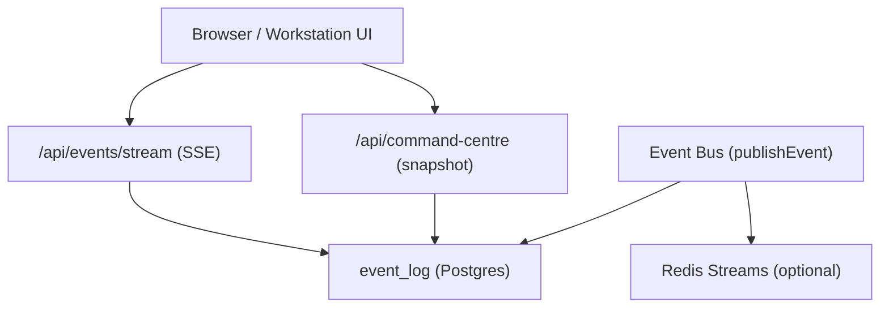
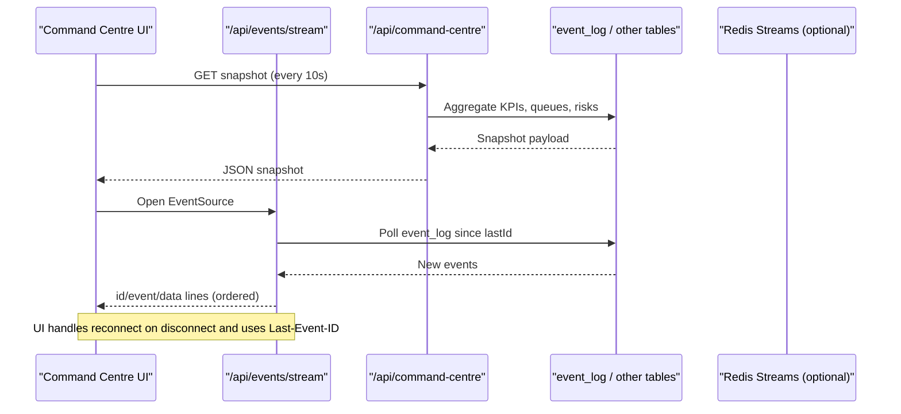
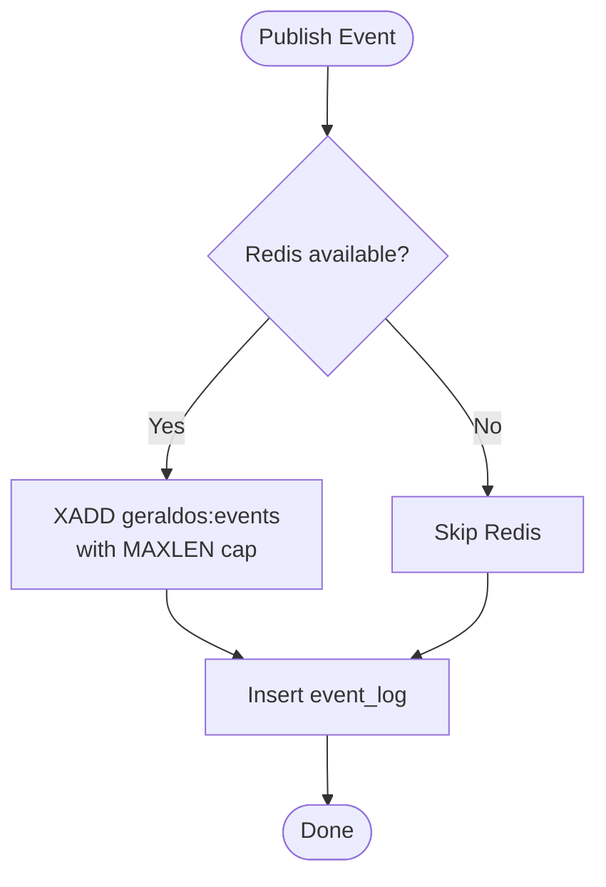
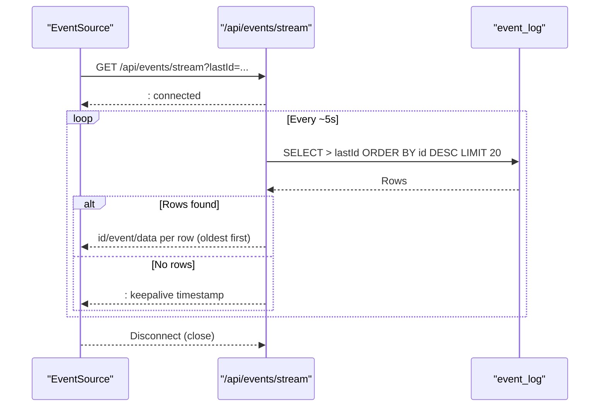
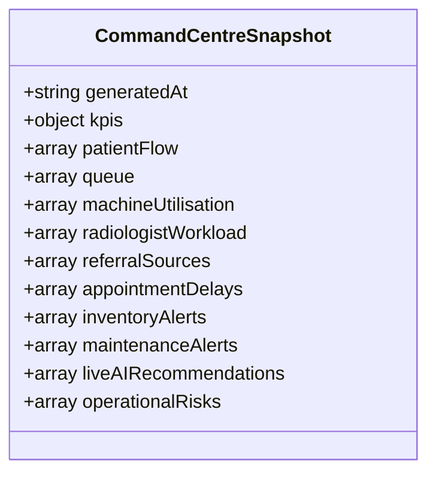
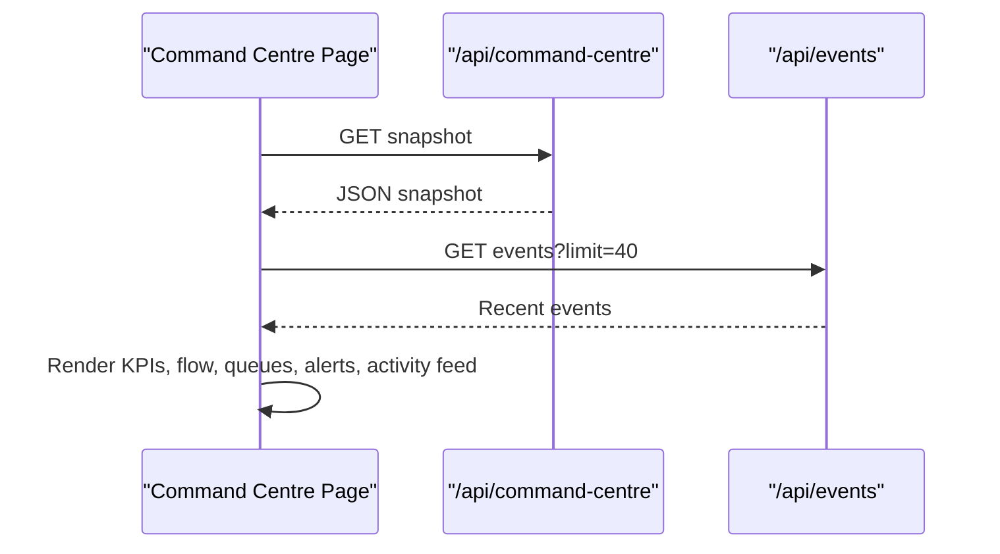
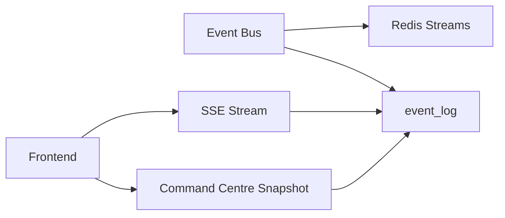

# Real-time Updates & Live Dashboard

<cite>
**Referenced Files in This Document**
- [events.ts](file://src/lib/events.ts)
- [route.ts](file://src/app/api/events/stream/route.ts)
- [command-centre.ts](file://src/lib/command-centre.ts)
- [route.ts](file://src/app/api/command-centre/route.ts)
- [page.tsx](file://src/app/page.tsx)
- [activity-panel.tsx](file://src/components/workstation/activity-panel.tsx)
- [session.ts](file://src/lib/auth/session.ts)
- [route.ts](file://src/app/api/auth/me/route.ts)
- [proxy.ts](file://src/proxy.ts)
- [keycloak.mjs](file://services/keycloak.mjs)
- [README.md](file://README.md)
</cite>

## Table of Contents
1. Introduction
2. Project Structure
3. Core Components
4. Architecture Overview
5. Detailed Component Analysis
6. Dependency Analysis
7. Performance Considerations
8. Troubleshooting Guide
9. Conclusion

## Introduction
This document explains the real-time update mechanisms that power the Operations Command Centre and live dashboards. It covers how events are published, streamed to clients, aggregated into KPIs, and rendered in activity feeds and status panels. It also documents connection management, reconnection strategies, performance considerations for many concurrent clients, and security measures for authentication and secure data transmission.

## Project Structure
The real-time system is built around:
- An event bus that publishes domain events to Redis Streams (best-effort) and persists them to a durable event_log table.
- A Server-Sent Events (SSE) endpoint that streams recent events to connected clients with backoff and keepalive.
- A command centre snapshot API that aggregates multiple operational metrics into a single payload.
- Frontend pages and components that poll or subscribe to these endpoints to render live dashboards and activity feeds.

**Diagram sources**
- [route.ts:20-93](file://src/app/api/events/stream/route.ts#L20-L93)
- [route.ts:7-14](file://src/app/api/command-centre/route.ts#L7-L14)
- [events.ts:102-131](file://src/lib/events.ts#L102-L131)
- [command-centre.ts:54-206](file://src/lib/command-centre.ts#L54-L206)

**Section sources**
- [events.ts:1-158](file://src/lib/events.ts#L1-L158)
- [route.ts:1-94](file://src/app/api/events/stream/route.ts#L1-L94)
- [command-centre.ts:1-208](file://src/lib/command-centre.ts#L1-L208)
- [route.ts:1-15](file://src/app/api/command-centre/route.ts#L1-L15)

## Core Components
- Event Bus: Centralized publisher that writes to Redis Streams and event_log; provides list and count utilities.
- SSE Stream: Long-lived server-sent events endpoint that polls event_log and pushes new events to clients.
- Command Centre Snapshot: Aggregates KPIs, queues, utilisation, workload, alerts, AI recommendations, and risks from multiple tables.
- Frontend Integration: Command centre page polls snapshot and events; workstation activity panel consumes events and displays timelines and audit trails.

Key responsibilities:
- publishEvent: Publishes events to Redis (if configured) and persists to event_log.
- GET /api/events/stream: Maintains an open stream, polls every ~5 seconds, sends events in order, and keeps connections alive.
- GET /api/command-centre: Builds a comprehensive snapshot by querying multiple tables and returning a structured payload.
- UI components: Render KPIs, flow charts, queues, alerts, and activity feeds using the latest data.

**Section sources**
- [events.ts:18-60](file://src/lib/events.ts#L18-L60)
- [events.ts:102-158](file://src/lib/events.ts#L102-L158)
- [route.ts:20-93](file://src/app/api/events/stream/route.ts#L20-L93)
- [command-centre.ts:27-52](file://src/lib/command-centre.ts#L27-L52)
- [command-centre.ts:54-206](file://src/lib/command-centre.ts#L54-L206)
- [page.tsx:114-140](file://src/app/page.tsx#L114-L140)
- [activity-panel.tsx:180-202](file://src/components/workstation/activity-panel.tsx#L180-L202)

## Architecture Overview
The system uses an event-driven architecture with optional Redis acceleration and a durable database fallback. Clients consume updates via two primary channels:
- SSE for event streaming (workstation and activity feed).
- Periodic polling for the full command centre snapshot (KPIs, queues, risks).

**Diagram sources**
- [page.tsx:122-140](file://src/app/page.tsx#L122-L140)
- [route.ts:20-93](file://src/app/api/events/stream/route.ts#L20-L93)
- [command-centre.ts:54-206](file://src/lib/command-centre.ts#L54-L206)

## Detailed Component Analysis

### Event Bus and Publishing
- Defines a central registry of event types and a publish function that:
  - Attempts to write to Redis Streams with a capped length for high-throughput, best-effort delivery.
  - Always attempts to persist to event_log for durability and auditing.
- Provides list and count helpers for querying recent events and aggregating counts by type.

**Diagram sources**
- [events.ts:102-131](file://src/lib/events.ts#L102-L131)

**Section sources**
- [events.ts:18-60](file://src/lib/events.ts#L18-L60)
- [events.ts:72-99](file://src/lib/events.ts#L72-L99)
- [events.ts:102-158](file://src/lib/events.ts#L102-L158)

### SSE Streaming Endpoint
- Opens a long-lived response stream and:
  - Sends an initial comment to confirm connection.
  - Polls event_log every ~5 seconds for new rows after lastId.
  - Reverses results to ensure oldest-first ordering for correct UI rendering.
  - Emits SSE frames with id, event, and data fields per row.
  - Handles errors by sending keepalive comments to maintain the connection.
  - Respects client abort signals to close streams cleanly.

**Diagram sources**
- [route.ts:20-93](file://src/app/api/events/stream/route.ts#L20-L93)

**Section sources**
- [route.ts:1-94](file://src/app/api/events/stream/route.ts#L1-L94)

### Command Centre Snapshot
- Aggregates multiple operational dimensions into a single payload:
  - KPIs: patients today, appointments, checked-in, active studies, pending reports, emergency cases, revenue, equipment stats.
  - Patient flow: counts per workflow stage.
  - Queue status: waiting and in-progress per equipment/modality.
  - Machine utilisation: utilization rate and status per equipment.
  - Radiologist workload: assigned studies and signed reports today.
  - Referral sources: top referring physicians.
  - Appointment delays: late scheduled appointments with delay minutes.
  - Inventory and maintenance alerts: low stock and ongoing maintenance.
  - Live AI recommendations: proposed/validated/approved items.
  - Operational risks: derived from offline/maintenance equipment, low stock, delays, claims, and pending reports.

**Diagram sources**
- [command-centre.ts:27-52](file://src/lib/command-centre.ts#L27-L52)

**Section sources**
- [command-centre.ts:54-206](file://src/lib/command-centre.ts#L54-L206)
- [route.ts:7-14](file://src/app/api/command-centre/route.ts#L7-L14)

### Frontend Consumption and Rendering
- Command Centre Page:
  - Polls /api/command-centre every 10 seconds to refresh KPIs, flows, queues, and alerts.
  - Also fetches recent events to populate the activity feed.
  - Displays a live indicator and last updated time.
- Workstation Activity Panel:
  - Renders timeline, workflow stages, events, notifications, AI activity, and audit trail tabs.
  - Filters events by selected study aggregate when applicable.
  - Uses event tone mapping to visually distinguish event types.

**Diagram sources**
- [page.tsx:122-140](file://src/app/page.tsx#L122-L140)
- [page.tsx:152-210](file://src/app/page.tsx#L152-L210)
- [activity-panel.tsx:180-202](file://src/components/workstation/activity-panel.tsx#L180-L202)

**Section sources**
- [page.tsx:114-140](file://src/app/page.tsx#L114-L140)
- [page.tsx:152-210](file://src/app/page.tsx#L152-L210)
- [activity-panel.tsx:21-48](file://src/components/workstation/activity-panel.tsx#L21-L48)
- [activity-panel.tsx:180-202](file://src/components/workstation/activity-panel.tsx#L180-L202)

## Dependency Analysis
- Event publishing depends on:
  - Optional Redis integration for fast, capped streaming.
  - Database persistence for durability and auditability.
- SSE streaming depends on:
  - Database availability; falls back to keepalive comments on transient failures.
- Command centre snapshot depends on:
  - Multiple tables (patients, appointments, workflowStudies, equipment, staff, inventoryItems, maintenanceRecords, reports, invoices, referrals, insuranceClaims, aiRecommendations).
- Frontend depends on:
  - Stable APIs and consistent event schemas for reliable rendering.

**Diagram sources**
- [events.ts:102-131](file://src/lib/events.ts#L102-L131)
- [route.ts:20-93](file://src/app/api/events/stream/route.ts#L20-L93)
- [command-centre.ts:54-206](file://src/lib/command-centre.ts#L54-L206)

**Section sources**
- [events.ts:102-158](file://src/lib/events.ts#L102-L158)
- [route.ts:20-93](file://src/app/api/events/stream/route.ts#L20-L93)
- [command-centre.ts:54-206](file://src/lib/command-centre.ts#L54-L206)

## Performance Considerations
- Event publishing:
  - Redis Streams used with a capped length to prevent unbounded growth and reduce memory pressure.
  - Best-effort approach ensures system resilience if Redis is down; event_log remains authoritative.
- SSE streaming:
  - Polling interval set to ~5 seconds to balance freshness and load.
  - Batches up to 20 rows per poll to avoid large payloads.
  - Keepalive comments sent on DB errors to maintain connection liveness.
- Command centre snapshot:
  - Aggregations run against multiple tables; consider indexing columns used in filters and joins (e.g., dates, statuses, IDs).
  - Use limits and grouping to constrain result sizes.
- Frontend:
  - Polling interval set to 10 seconds for snapshot; sufficient for operational visibility without excessive requests.
  - EventSource handles reconnect automatically; use lastId to resume from the last known event.

[No sources needed since this section provides general guidance]

## Troubleshooting Guide
- No events appearing in activity feed:
  - Verify that events are being published via the event bus and persisted to event_log.
  - Check SSE endpoint logs for DB errors and ensure keepalive messages are being sent.
- Stale dashboard data:
  - Confirm the command centre polling is running and not blocked by network issues.
  - Validate snapshot queries and indexes on frequently filtered columns.
- Connection drops:
  - Ensure clients handle EventSource reconnection and pass lastId correctly.
  - Review proxy and middleware configurations to avoid dropping long-lived connections.

**Section sources**
- [events.ts:102-131](file://src/lib/events.ts#L102-L131)
- [route.ts:74-81](file://src/app/api/events/stream/route.ts#L74-L81)
- [page.tsx:122-140](file://src/app/page.tsx#L122-L140)

## Security Considerations
- Authentication:
  - Sessions are managed via httpOnly, sameSite cookies containing HS256 JWTs.
  - The /api/auth/me endpoint verifies session tokens and returns user context.
  - Proxy middleware validates tokens for protected routes when Keycloak is configured; otherwise allows degraded mode.
- Data protection:
  - All service credentials remain server-side; only whitelisted non-secret configuration is exposed to clients.
  - Webhooks accept JSON only and validate event names before processing.
- Real-time channels:
  - SSE and snapshot endpoints rely on cookie-based session validation at the application layer; ensure proxies do not bypass authentication.
  - For production, consider enforcing HTTPS and restricting SSE access to authenticated users.

**Section sources**
- [session.ts:13-45](file://src/lib/auth/session.ts#L13-L45)
- [route.ts:7-14](file://src/app/api/auth/me/route.ts#L7-L14)
- [proxy.ts:11-44](file://src/proxy.ts#L11-L44)
- [keycloak.mjs:28-40](file://services/keycloak.mjs#L28-L40)
- [README.md:115-121](file://README.md#L115-L121)

## Conclusion
The platform’s real-time capabilities combine an event bus with durable logging and optional Redis acceleration, an SSE endpoint for live event streaming, and a comprehensive command centre snapshot for operational KPIs. The frontend renders live dashboards and activity feeds using these sources. With careful attention to connection management, performance tuning, and security, the system supports large numbers of concurrent clients while maintaining reliability and clarity for operations teams.