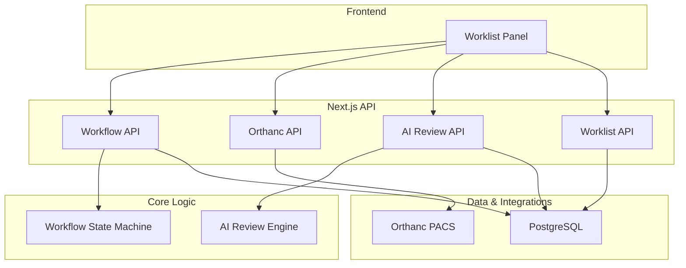
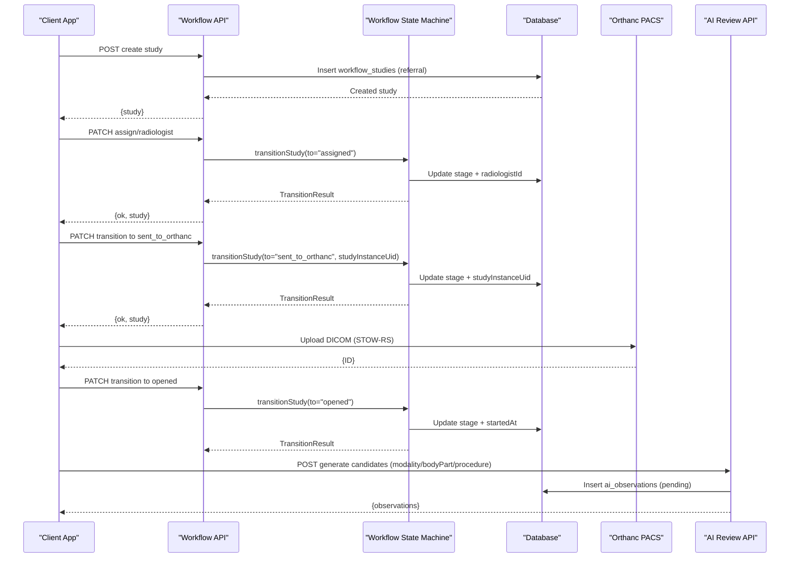
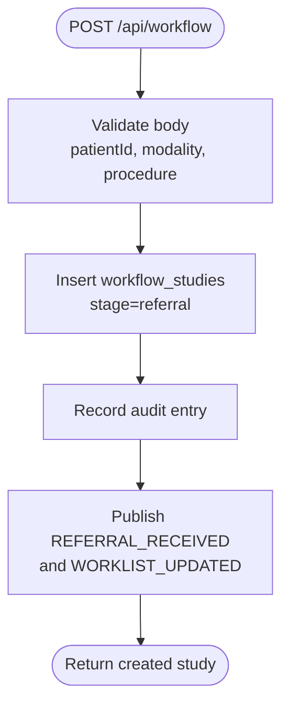
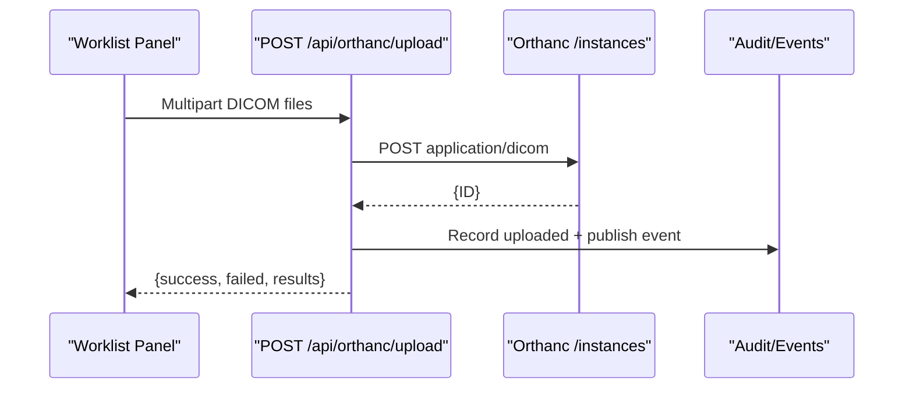
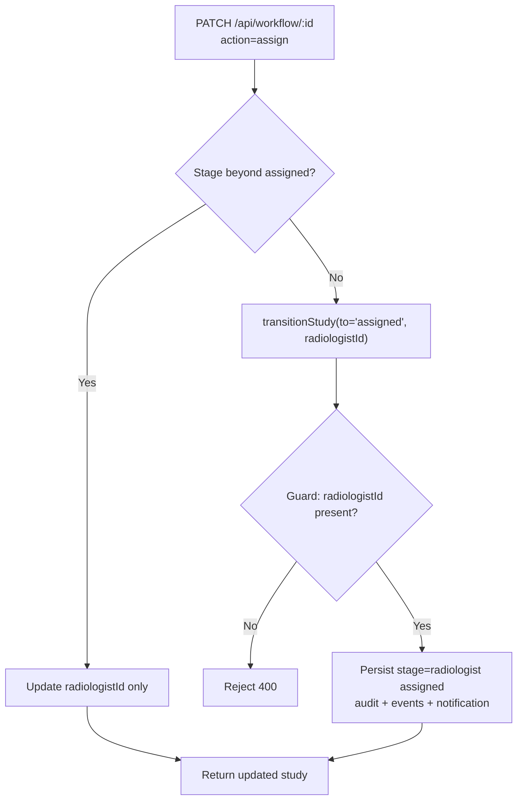
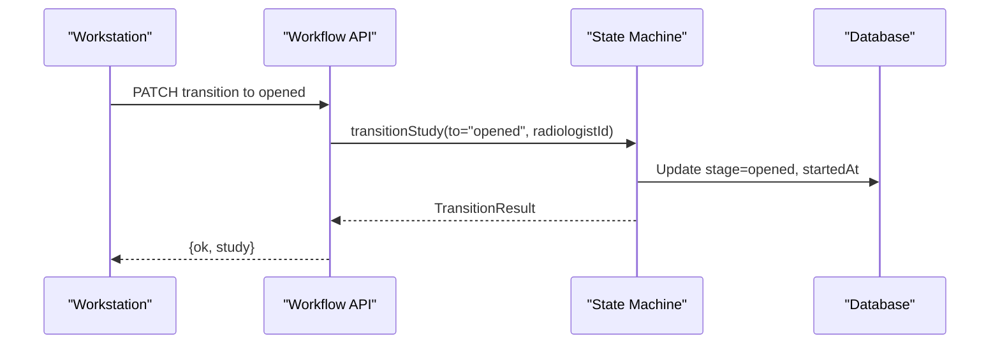
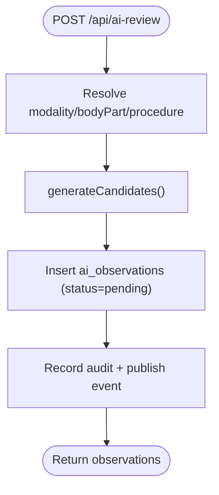
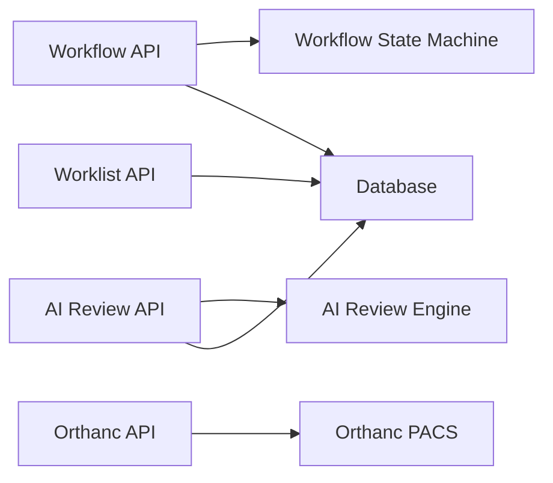

# Imaging Workflow

<cite>
**Referenced Files in This Document**
- [workflow.ts](file://src/lib/workflow.ts)
- [route.ts (workflow)](file://src/app\api\workflow\route.ts)
- [route.ts (workflow by id)](file://src/app\api\workflow\[id]\route.ts)
- [route.ts (ai-review)](file://src/app\api\ai-review\route.ts)
- [ai-review.ts](file://src/lib/ai-review.ts)
- [route.ts (orthanc studies)](file://src/app\api\orthanc\studies\route.ts)
- [route.ts (orthanc worklist)](file://src/app\api\orthanc\worklist\route.ts)
- [route.ts (orthanc upload)](file://src/app\api\orthanc\upload\route.ts)
- [schema.ts](file://src\db\schema.ts)
- [orthanc.json](file://docker\orthanc\orthanc.json)
- [worklist-panel.tsx](file://src\components\workstation\worklist-panel.tsx)
- [route.ts (worklist)](file://src\app\api\worklist\route.ts)
</cite>

## Table of Contents
1. Introduction
2. Project Structure
3. Core Components
4. Architecture Overview
5. Detailed Component Analysis
6. Dependency Analysis
7. Performance Considerations
8. Troubleshooting Guide
9. Conclusion

## Introduction
This document describes the imaging workflow phase in GeraldOS, covering the patient journey from study creation through AI review completion. It explains how studies are created, submitted to Orthanc (PACS), assigned to radiologists, opened for review, and processed by the AI assistant. It also documents DICOM/PACS integration requirements, validation rules, modality-specific processing, confidence scoring, and error handling for PACS connectivity, radiologist availability, and AI service failures.

## Project Structure
The imaging workflow spans server-side API routes, a state machine library, database schemas, and UI components:
- State machine and transitions live in a dedicated library module.
- API routes handle study creation, assignment, stage transitions, Orthanc integration, and AI review triggers.
- The database schema defines entities for studies, appointments, staff, reports, and AI observations.
- The workstation UI provides worklist views, context menus, and actions that drive workflow transitions.

**Diagram sources**
- [route.ts (workflow):12-47](file://src/app\api\workflow\route.ts#L12-L47)
- [route.ts (workflow by id):20-109](file://src/app\api\workflow\[id]\route.ts#L20-L109)
- [route.ts (orthanc studies):20-86](file://src/app\api\orthanc\studies\route.ts#L20-L86)
- [route.ts (orthanc worklist):16-80](file://src/app\api\orthanc\worklist\route.ts#L16-L80)
- [route.ts (ai-review):12-109](file://src/app\api\ai-review\route.ts#L12-L109)
- [workflow.ts:37-234](file://src/lib/workflow.ts#L37-L234)
- [ai-review.ts:21-221](file://src/lib/ai-review.ts#L21-L221)
- [schema.ts:102-119](file://src\db\schema.ts#L102-L119)
- [schema.ts:358-380](file://src\db\schema.ts#L358-L380)

**Section sources**
- [route.ts (workflow):12-47](file://src/app\api\workflow\route.ts#L12-L47)
- [route.ts (workflow by id):20-109](file://src/app\api\workflow\[id]\route.ts#L20-L109)
- [route.ts (orthanc studies):20-86](file://src/app\api\orthanc\studies\route.ts#L20-L86)
- [route.ts (orthanc worklist):16-80](file://src/app\api\orthanc\worklist\route.ts#L16-L80)
- [route.ts (ai-review):12-109](file://src/app\api\ai-review\route.ts#L12-L109)
- [workflow.ts:37-234](file://src/lib/workflow.ts#L37-L234)
- [ai-review.ts:21-221](file://src/lib/ai-review.ts#L21-L221)
- [schema.ts:102-119](file://src\db\schema.ts#L102-L119)
- [schema.ts:358-380](file://src\db\schema.ts#L358-L380)

## Core Components
- Workflow state machine: Defines canonical stages, validates forward-only transitions, enforces hard guards (e.g., requires studyInstanceUid for Orthanc submission; requires radiologistId for assignment/opening), records audit events, publishes lifecycle events, and emits notifications.
- Orthanc integration: Proxies queries to Orthanc for studies and worklist, uploads DICOM instances via STOW-RS, and derives modalities when missing at study level.
- AI review engine: Generates candidate observations per modality with confidence scores, technical quality checks, suggested differentials, literature references, and similar case IDs. Observations persist as pending until radiologist acceptance or rejection.
- Worklist and UI: Aggregates studies with clinical context, supports filtering/sorting, and exposes actions to assign, open, flag priority, and release studies.

**Section sources**
- [workflow.ts:37-234](file://src/lib/workflow.ts#L37-L234)
- [route.ts (orthanc studies):20-86](file://src/app\api\orthanc\studies\route.ts#L20-L86)
- [route.ts (orthanc worklist):16-80](file://src/app\api\orthanc\worklist\route.ts#L16-L80)
- [route.ts (orthanc upload):16-79](file://src/app\api\orthanc\upload\route.ts#L16-L79)
- [route.ts (ai-review):12-109](file://src/app\api\ai-review\route.ts#L12-L109)
- [ai-review.ts:21-221](file://src/lib/ai-review.ts#L21-L221)
- [route.ts (worklist):26-118](file://src\app\api\worklist\route.ts#L26-L118)
- [worklist-panel.tsx:116-195](file://src\components\workstation\worklist-panel.tsx#L116-L195)

## Architecture Overview
The imaging workflow is event-driven and state-machine enforced. Studies progress through defined stages with server-side validation. Orthanc serves as the PACS for storage and retrieval. AI review runs after opening and produces advisory candidates for radiologist decision-making.

**Diagram sources**
- [route.ts (workflow):55-101](file://src/app\api\workflow\route.ts#L55-L101)
- [route.ts (workflow by id):33-79](file://src/app\api\workflow\[id]\route.ts#L33-L79)
- [workflow.ts:102-234](file://src/lib/workflow.ts#L102-L234)
- [route.ts (orthanc upload):16-79](file://src/app\api\orthanc\upload\route.ts#L16-L79)
- [route.ts (ai-review):52-109](file://src/app\api\ai-review\route.ts#L52-L109)

## Detailed Component Analysis

### Study Creation and Entry into the Pipeline
- A new study is created at the referral stage with required fields (patient, modality, procedure). An accession number is generated, and events are published for downstream systems.
- The worklist aggregates studies with patient, equipment, referring physician, and scheduling context, supporting filters and priority sorting.

**Diagram sources**
- [route.ts (workflow):55-101](file://src/app\api\workflow\route.ts#L55-L101)
- [schema.ts:102-119](file://src\db\schema.ts#L102-L119)

**Section sources**
- [route.ts (workflow):55-101](file://src/app\api\workflow\route.ts#L55-L101)
- [route.ts (worklist):26-118](file://src\app\api\worklist\route.ts#L26-L118)
- [schema.ts:102-119](file://src\db\schema.ts#L102-L119)

### Orthanc Submission and DICOM/PACS Integration
- DICOM upload: Accepts multipart form data with .dcm files, forwards each to Orthanc’s instance endpoint, and returns Orthanc IDs. Errors are captured per file.
- Studies listing: Queries Orthanc for studies and series to derive modalities when missing at study level; filters out unknown patients.
- Worklist fallback: If Orthanc is unavailable, falls back to local scheduled appointments as a worklist source.

**Diagram sources**
- [route.ts (orthanc upload):16-79](file://src/app\api\orthanc\upload\route.ts#L16-L79)
- [route.ts (orthanc studies):20-86](file://src/app\api\orthanc\studies\route.ts#L20-L86)
- [route.ts (orthanc worklist):16-80](file://src/app\api\orthanc\worklist\route.ts#L16-L80)

**Section sources**
- [route.ts (orthanc upload):16-79](file://src/app\api\orthanc\upload\route.ts#L16-L79)
- [route.ts (orthanc studies):20-86](file://src/app\api\orthanc\studies\route.ts#L20-L86)
- [route.ts (orthanc worklist):16-80](file://src/app\api\orthanc\worklist\route.ts#L16-L80)
- [orthanc.json:1-21](file://docker\orthanc\orthanc.json#L1-L21)

### Radiologist Assignment and Workload Balancing
- Assignment action: Assigns a radiologist and advances the study to the assigned stage if not already past it. Reassignment updates the radiologist without rolling back the stage.
- Hard guard: Assignment requires a radiologistId; the state machine enforces this before marking a study as assigned.
- Workload balancing and expertise matching: The current implementation assigns based on provided radiologistId. Advanced algorithms (capacity-based balancing, specialization matching) can be layered atop the existing assignment flow using staff metadata (role, specialization) and workload metrics derived from worklist counts and timestamps.

**Diagram sources**
- [route.ts (workflow by id):33-79](file://src/app\api\workflow\[id]\route.ts#L33-L79)
- [workflow.ts:134-147](file://src/lib/workflow.ts#L134-L147)
- [schema.ts:70-80](file://src\db\schema.ts#L70-L80)

**Section sources**
- [route.ts (workflow by id):33-79](file://src/app\api\workflow\[id]\route.ts#L33-L79)
- [workflow.ts:134-147](file://src/lib/workflow.ts#L134-L147)
- [schema.ts:70-80](file://src\db\schema.ts#L70-L80)

### Study Opening and Preparation for AI Analysis
- Opening: Transition to opened sets startedAt and marks the study as being reviewed. Requires a radiologistId.
- Preparation: Once opened, the UI can trigger AI review generation for the study’s modality, body part, and procedure.

**Diagram sources**
- [route.ts (workflow by id):62-79](file://src/app\api\workflow\[id]\route.ts#L62-L79)
- [workflow.ts:145-172](file://src/lib/workflow.ts#L145-L172)

**Section sources**
- [route.ts (workflow by id):62-79](file://src/app\api\workflow\[id]\route.ts#L62-L79)
- [workflow.ts:145-172](file://src/lib/workflow.ts#L145-L172)

### AI Review Initiation, Modality Pipelines, and Confidence Scoring
- Trigger: POST to AI review with modality, optional bodyPart/procedure/studyId. If studyId is provided, modality/bodyPart/procedure are resolved from the study record.
- Generation: Produces candidate observations including findings, normal confirmations, and technical quality assessments. Each candidate includes a confidence score (0–100), suggested differentials, literature references, and similar case IDs.
- Persistence: Candidates are stored as pending observations awaiting radiologist accept/reject.
- Modality pipelines: Technical quality checklists vary by modality (X-Ray, CT, MRI, Ultrasound, Mammography, DEXA, Dental, Nuclear Medicine, PET-CT, Fluoroscopy). Default checks apply for unknown modalities.

**Diagram sources**
- [route.ts (ai-review):52-109](file://src/app\api\ai-review\route.ts#L52-L109)
- [ai-review.ts:168-221](file://src/lib/ai-review.ts#L168-L221)

**Section sources**
- [route.ts (ai-review):52-109](file://src/app\api\ai-review\route.ts#L52-L109)
- [ai-review.ts:21-221](file://src/lib/ai-review.ts#L21-L221)
- [schema.ts:358-380](file://src\db\schema.ts#L358-L380)

### DICOM/PACS Validation and Communication Protocols
- studyInstanceUid validation: Transition to sent_to_orthanc requires a valid DICOM studyInstanceUid. This ensures PACS linkage before proceeding.
- Orthanc communication: Uses HTTP REST endpoints for studies, series, and instance upload. Authentication headers are applied via integration utilities. Timeouts are enforced for upstream calls.
- Configuration: Orthanc Docker configuration enables DICOMweb and sets ports for HTTP and DICOM.

**Section sources**
- [workflow.ts:135-141](file://src/lib/workflow.ts#L135-L141)
- [route.ts (orthanc studies):20-86](file://src/app\api\orthanc\studies\route.ts#L20-L86)
- [route.ts (orthanc upload):16-79](file://src/app\api\orthanc\upload\route.ts#L16-L79)
- [orthanc.json:1-21](file://docker\orthanc\orthanc.json#L1-L21)

### Error Handling
- PACS connectivity issues: Orthanc endpoints return structured errors (e.g., not configured, upstream HTTP status codes). Uploads capture per-file errors and report success/failure counts.
- Radiologist availability problems: Assignment requires a radiologistId; attempts without one are rejected. Reassignment logic allows updating assignment without rolling back stages.
- AI service failures: Observation generation persists candidates; if generation fails, appropriate HTTP errors are returned. Auditing and events are used to track outcomes.

**Section sources**
- [route.ts (orthanc studies):20-86](file://src/app\api\orthanc\studies\route.ts#L20-L86)
- [route.ts (orthanc upload):16-79](file://src/app\api\orthanc\upload\route.ts#L16-L79)
- [route.ts (ai-review):12-44](file://src/app\api\ai-review\route.ts#L12-L44)
- [workflow.ts:134-147](file://src/lib/workflow.ts#L134-L147)

### Examples by Modality
- CT: Coverage includes region of interest; contrast phase appropriateness; reconstruction kernels/slice thickness; motion/streak artifacts.
- MRI: All requested sequences acquired; motion artifacts; fat suppression homogeneity; coverage completeness.
- X-Ray: Anatomical positioning; collimation; exposure index; motion blur/rotation artifacts.
- Ultrasound: Depth/gain optimization; transducer frequency; Doppler settings; measurements captured.
- Mammography: Compression/positioning (MLO+CC); skin folds/artifacts; exposure adequacy; labeling correctness.
- DEXA: Patient positioning; artifacts over ROI; T-score validity.
- Dental: Field of view; exposure; movement; projection technique.
- Nuclear Medicine: Uptake timing; motion; count statistics; SPECT/CT registration.
- PET-CT: Hypermetabolic focus interpretation considerations.
- Fluoroscopy: Filling defects; diverticulum evaluation.

**Section sources**
- [ai-review.ts:35-89](file://src/lib/ai-review.ts#L35-L89)

## Dependency Analysis
The imaging workflow depends on several modules and external services:
- Workflow state machine governs transitions and enforces business rules.
- API routes depend on the state machine and database schema.
- Orthanc integration relies on configuration and network reachability.
- AI review depends on modality-specific heuristics and persists results.

**Diagram sources**
- [route.ts (workflow):12-47](file://src/app\api\workflow\route.ts#L12-L47)
- [route.ts (workflow by id):20-109](file://src/app\api\workflow\[id]\route.ts#L20-L109)
- [route.ts (orthanc studies):20-86](file://src/app\api\orthanc\studies\route.ts#L20-L86)
- [route.ts (ai-review):12-109](file://src/app\api\ai-review\route.ts#L12-L109)
- [route.ts (worklist):26-118](file://src\app\api\worklist\route.ts#L26-L118)

**Section sources**
- [route.ts (workflow):12-47](file://src/app\api\workflow\route.ts#L12-L47)
- [route.ts (workflow by id):20-109](file://src/app\api\workflow\[id]\route.ts#L20-L109)
- [route.ts (orthanc studies):20-86](file://src/app\api\orthanc\studies\route.ts#L20-L86)
- [route.ts (ai-review):12-109](file://src/app\api\ai-review\route.ts#L12-L109)
- [route.ts (worklist):26-118](file://src\app\api\worklist\route.ts#L26-L118)

## Performance Considerations
- Use timeouts for upstream Orthanc calls to avoid blocking requests.
- Batch operations where possible (e.g., multiple DICOM uploads).
- Cache frequently accessed worklist facets to reduce database load.
- Index database columns used in common filters (stage, priority, modality, radiologistId).
- Defer heavy AI processing to background jobs if needed to keep UI responsive.

[No sources needed since this section provides general guidance]

## Troubleshooting Guide
- PACS unreachable: Check Orthanc configuration and network; verify HTTP endpoints respond; inspect upstream HTTP status codes returned by the Orthanc API.
- Missing studyInstanceUid: Ensure DICOM upload succeeded and the study has a valid studyInstanceUid before transitioning to sent_to_orthanc.
- Assignment failures: Confirm radiologistId exists and is active; reassignment is supported without rolling back stages.
- AI observation generation: Verify modality is set; ensure study context resolves correctly; check persisted observations for pending status.

**Section sources**
- [route.ts (orthanc studies):20-86](file://src/app\api\orthanc\studies\route.ts#L20-L86)
- [route.ts (orthanc upload):16-79](file://src/app\api\orthanc\upload\route.ts#L16-L79)
- [workflow.ts:135-147](file://src/lib/workflow.ts#L135-L147)
- [route.ts (ai-review):12-44](file://src/app\api\ai-review\route.ts#L12-L44)

## Conclusion
GeraldOS implements a robust, auditable imaging workflow with strict state transitions, PACS integration via Orthanc, and an AI-assisted review system that provides modality-specific candidate observations with confidence scoring. The design separates concerns across API routes, state machine logic, and data persistence, enabling scalable extension for advanced workload balancing and expertise matching while maintaining safety and compliance through server-side validation and comprehensive auditing.

[No sources needed since this section summarizes without analyzing specific files]