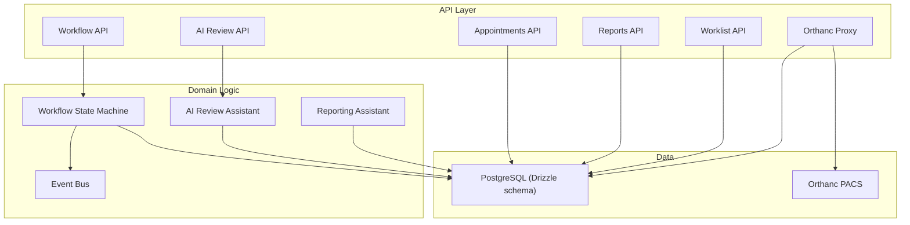
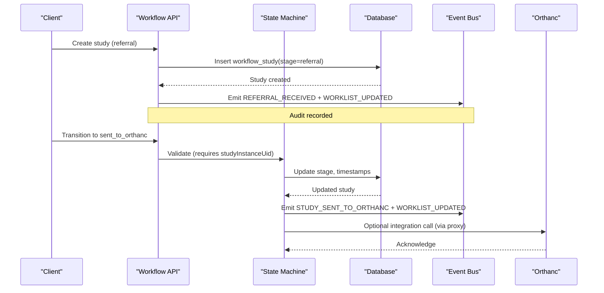
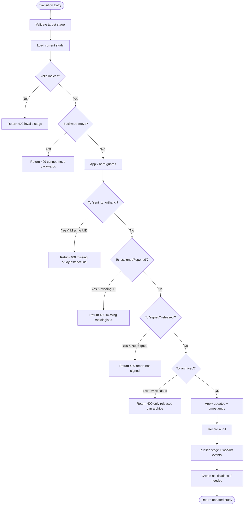
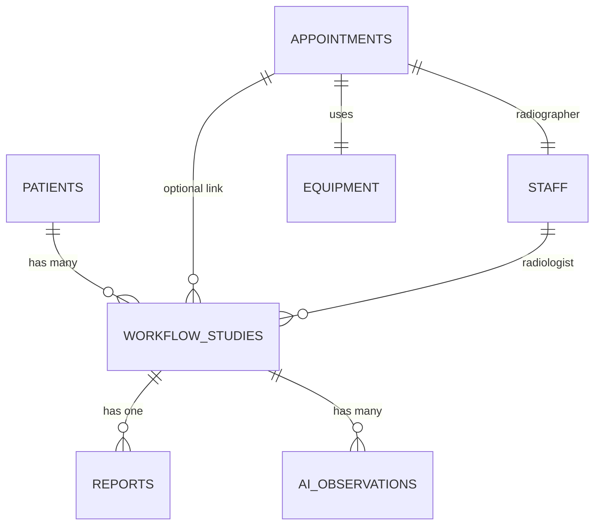
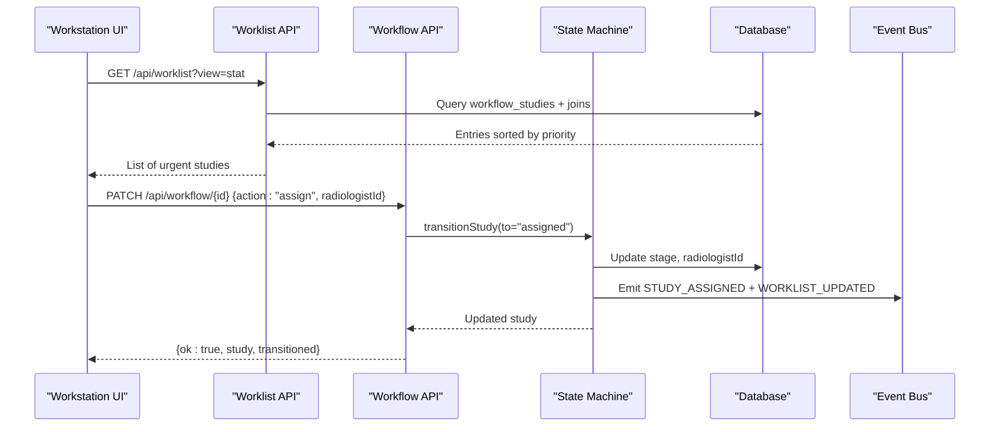
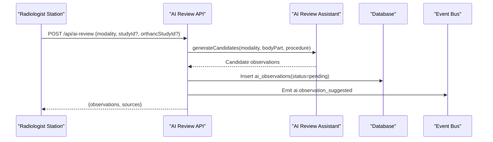
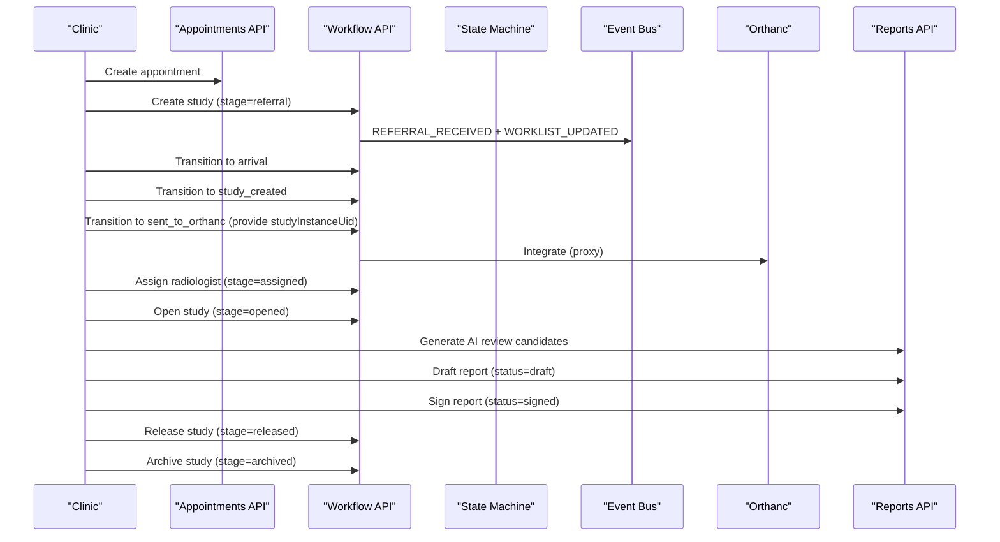
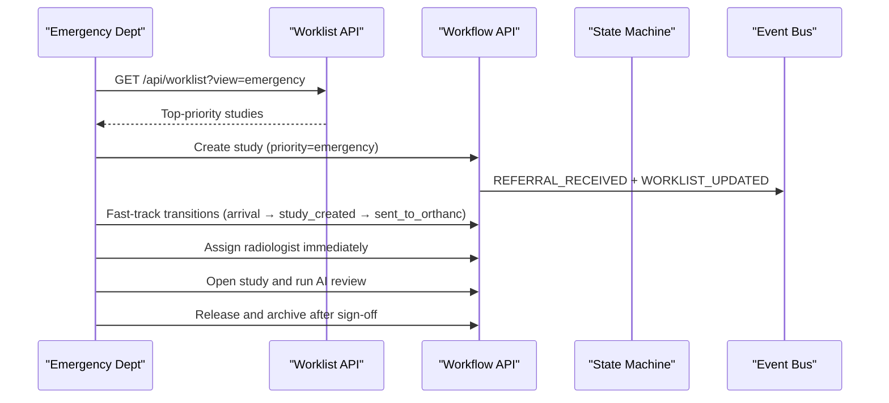
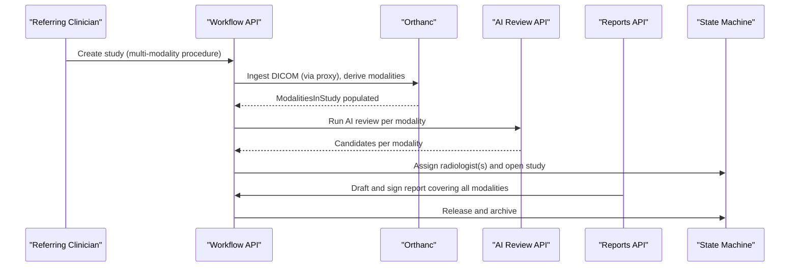
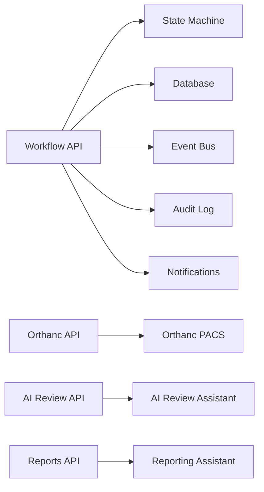

# Patient Journey Workflow

<cite>
**Referenced Files in This Document**
- [workflow.ts](file://src/lib/workflow.ts)
- [events.ts](file://src/lib/events.ts)
- [ai-review.ts](file://src/lib/ai-review.ts)
- [reporting.ts](file://src/lib/reporting.ts)
- [schema.ts](file://src/db/schema.ts)
- [route.ts (workflow)](file://src/app/api/workflow/route.ts)
- [route.ts (workflow id)](file://src/app/api/workflow/[id]/route.ts)
- [route.ts (appointments)](file://src/app/api/appointments/route.ts)
- [route.ts (reports)](file://src/app/api/reports/route.ts)
- [route.ts (reports id)](file://src/app/api/reports/[id]/route.ts)
- [route.ts (orthanc studies)](file://src/app/api/orthanc/studies/route.ts)
- [route.ts (worklist)](file://src/app/api/worklist/route.ts)
- [route.ts (ai-review)](file://src/app/api/ai-review/route.ts)
</cite>

## Table of Contents
1. [Introduction](#introduction)
2. [Project Structure](#project-structure)
3. [Core Components](#core-components)
4. [Architecture Overview](#architecture-overview)
5. [Detailed Component Analysis](#detailed-component-analysis)
6. [Dependency Analysis](#dependency-analysis)
7. [Performance Considerations](#performance-considerations)
8. [Troubleshooting Guide](#troubleshooting-guide)
9. [Conclusion](#conclusion)

## Introduction
This document describes the end-to-end patient journey workflow in GeraldOS, from referral through study completion and archiving. It explains each stage, state transitions, validation rules, data flows between components, permissions, and error handling. It also provides sequence diagrams for routine, emergency, and complex multi-modality cases to help both technical and non-technical readers understand how the system orchestrates work across scheduling, imaging, AI review, reporting, release, and archival.

## Project Structure
GeraldOS implements a server-side state machine that governs all study lifecycle changes. The core pipeline is defined centrally and enforced on every transition. Supporting modules provide event publishing, AI-assisted review, structured reporting templates, and integrations with Orthanc (PACS).

**Diagram sources**
- [workflow.ts:37-51](file://src/lib/workflow.ts#L37-L51)
- [events.ts:18-60](file://src/lib/events.ts#L18-L60)
- [ai-review.ts:21-32](file://src/lib/ai-review.ts#L21-L32)
- [reporting.ts:24-173](file://src/lib/reporting.ts#L24-L173)
- [schema.ts:102-119](file://src/db/schema.ts#L102-L119)
- [route.ts (workflow):55-101](file://src/app/api/workflow/route.ts#L55-L101)
- [route.ts (orthanc studies):20-85](file://src/app/api/orthanc/studies/route.ts#L20-L85)

**Section sources**
- [workflow.ts:37-51](file://src/lib/workflow.ts#L37-L51)
- [schema.ts:102-119](file://src/db/schema.ts#L102-L119)

## Core Components
- Workflow State Machine: Defines canonical stages and enforces forward-only transitions with strict validation.
- Event Bus: Publishes domain events to Redis Streams and persists them to an event log table for auditability.
- AI Review Assistant: Generates candidate observations per modality; radiologist accepts or rejects each.
- Reporting Assistant: Provides structured templates, quality scoring, terminology checks, and critical finding detection.
- Integrations: Orthanc proxy retrieves studies and modalities; worklist aggregates clinical context for the workstation.

Key responsibilities:
- Centralize state transitions and guardrails in one module.
- Ensure every change is audited and observable via events.
- Keep AI outputs advisory; final decisions remain with the radiologist.
- Provide consistent worklist views filtered by priority, stage, and filters.

**Section sources**
- [workflow.ts:93-234](file://src/lib/workflow.ts#L93-L234)
- [events.ts:101-131](file://src/lib/events.ts#L101-L131)
- [ai-review.ts:168-220](file://src/lib/ai-review.ts#L168-L220)
- [reporting.ts:232-256](file://src/lib/reporting.ts#L232-L256)
- [route.ts (worklist):26-111](file://src/app/api/worklist/route.ts#L26-L111)

## Architecture Overview
The patient journey is modeled as a linear pipeline with explicit guards at clinically significant steps. Transitions are initiated by API calls and validated server-side. Events propagate updates to worklists, notifications, and dashboards.

**Diagram sources**
- [route.ts (workflow):55-101](file://src/app/api/workflow/route.ts#L55-L101)
- [workflow.ts:102-178](file://src/lib/workflow.ts#L102-L178)
- [events.ts:101-131](file://src/lib/events.ts#L101-L131)
- [route.ts (orthanc studies):20-85](file://src/app/api/orthanc/studies/route.ts#L20-L85)

## Detailed Component Analysis

### Pipeline Stages and State Machine
The canonical pipeline order defines the only valid progression. Each stage has a label, event type, and visual tone used in boards.

Stages:
- Referral → Appointment → Patient Arrival → Study Created → Sent to Orthanc → Radiologist Assigned → Study Opened → AI Review → Report Draft → Report Signed → Report Released → Archive

Validation highlights:
- Forward-only transitions; backward moves return conflict errors.
- “Sent to Orthanc” requires a DICOM studyInstanceUid.
- “Assigned” and “Opened” require a radiologistId.
- “Signed” requires report status signed.
- “Released” requires report signed.
- “Archived” reachable only from “released”.

Side effects:
- Every transition records an audit entry.
- Emits stage-specific event plus a worklist refresh event.
- Creates notifications for assignment and release.

**Diagram sources**
- [workflow.ts:102-178](file://src/lib/workflow.ts#L102-L178)
- [workflow.ts:189-233](file://src/lib/workflow.ts#L189-L233)

**Section sources**
- [workflow.ts:37-51](file://src/lib/workflow.ts#L37-L51)
- [workflow.ts:102-178](file://src/lib/workflow.ts#L102-L178)
- [workflow.ts:189-233](file://src/lib/workflow.ts#L189-L233)

### Data Model for Workflow
The database schema captures the full lifecycle context:
- workflow_studies: links to patient, optional appointment, accession number, studyInstanceUid, modality, procedure, bodyPart, stage, radiologistId, priority, timestamps.
- appointments: links patient, equipment, radiographer, schedule, check-in flags.
- reports: linked to study and radiologist, with status and signing timestamp.
- ai_observations: per-study AI candidates with category, confidence, and acceptance state.
- event_log: durable record of all emitted events.

**Diagram sources**
- [schema.ts:18-50](file://src/db/schema.ts#L18-L50)
- [schema.ts:82-119](file://src/db/schema.ts#L82-L119)
- [schema.ts:167-180](file://src/db/schema.ts#L167-L180)
- [schema.ts:361-380](file://src/db/schema.ts#L361-L380)
- [schema.ts:447-468](file://src/db/schema.ts#L447-L468)

**Section sources**
- [schema.ts:18-50](file://src/db/schema.ts#L18-L50)
- [schema.ts:82-119](file://src/db/schema.ts#L82-L119)
- [schema.ts:167-180](file://src/db/schema.ts#L167-L180)
- [schema.ts:361-380](file://src/db/schema.ts#L361-L380)
- [schema.ts:447-468](file://src/db/schema.ts#L447-L468)

### API Endpoints and Control Flow
- Workflow creation: POST /api/workflow creates a study at “referral”, generates accession number, emits events, and returns the new study.
- Workflow transitions: PATCH /api/workflow/[id] supports:
  - action: "transition" with target stage
  - legacy alias { stage: "...", studyInstanceUid }
  - action: "assign" with radiologistId
  - plain field updates (priority, radiologistId, etc.)
- Appointments: GET/POST /api/appointments manage scheduling and check-in state.
- Reports: GET/POST /api/reports list/create; PATCH /api/reports/[id] drafts/signs with version snapshots and role checks.
- Orthanc: GET /api/orthanc/studies lists studies with derived modalities from series.
- Worklist: GET /api/worklist aggregates clinical context and supports filtering by view, priority, stage, and search terms.
- AI Review: GET/POST /api/ai-review queries and generates candidate observations.

**Diagram sources**
- [route.ts (worklist):26-111](file://src/app/api/worklist/route.ts#L26-L111)
- [route.ts (workflow id):20-79](file://src/app/api/workflow/[id]/route.ts#L20-L79)
- [workflow.ts:102-178](file://src/lib/workflow.ts#L102-L178)
- [events.ts:101-131](file://src/lib/events.ts#L101-L131)

**Section sources**
- [route.ts (workflow):55-101](file://src/app/api/workflow/route.ts#L55-L101)
- [route.ts (workflow id):20-109](file://src/app/api/workflow/[id]/route.ts#L20-L109)
- [route.ts (appointments):6-51](file://src/app/api/appointments/route.ts#L6-L51)
- [route.ts (reports):6-46](file://src/app/api/reports/route.ts#L6-L46)
- [route.ts (reports id):10-125](file://src/app/api/reports/[id]/route.ts#L10-L125)
- [route.ts (orthanc studies):20-85](file://src/app/api/orthanc/studies/route.ts#L20-L85)
- [route.ts (worklist):26-111](file://src/app/api/worklist/route.ts#L26-L111)
- [route.ts (ai-review):12-109](file://src/app/api/ai-review/route.ts#L12-L109)

### AI Review and Reporting
- AI Review:
  - Generates candidate observations per modality with confidence scores, suggested differentials, literature references, and similar case IDs.
  - Persists candidates as “pending”; radiologist accepts or rejects each.
  - Emits events for observation suggestions and tracks model version.
- Reporting:
  - Structured templates per modality guide radiologists.
  - Quality scoring evaluates completeness and consistency.
  - Terminology drift detection suggests canonical terms.
  - Critical findings detection highlights urgent terms in draft text.

**Diagram sources**
- [route.ts (ai-review):52-109](file://src/app/api/ai-review/route.ts#L52-L109)
- [ai-review.ts:168-220](file://src/lib/ai-review.ts#L168-L220)
- [events.ts:101-131](file://src/lib/events.ts#L101-L131)

**Section sources**
- [ai-review.ts:21-32](file://src/lib/ai-review.ts#L21-L32)
- [ai-review.ts:91-103](file://src/lib/ai-review.ts#L91-L103)
- [ai-review.ts:168-220](file://src/lib/ai-review.ts#L168-L220)
- [reporting.ts:232-256](file://src/lib/reporting.ts#L232-L256)
- [reporting.ts:273-290](file://src/lib/reporting.ts#L273-L290)
- [reporting.ts:308-325](file://src/lib/reporting.ts#L308-L325)

### Typical Patient Journeys

#### Routine Case Sequence

**Diagram sources**
- [route.ts (appointments):42-51](file://src/app/api/appointments/route.ts#L42-L51)
- [route.ts (workflow):55-101](file://src/app/api/workflow/route.ts#L55-L101)
- [workflow.ts:102-178](file://src/lib/workflow.ts#L102-L178)
- [route.ts (reports id):47-125](file://src/app/api/reports/[id]/route.ts#L47-L125)
- [route.ts (ai-review):52-109](file://src/app/api/ai-review/route.ts#L52-L109)

#### Emergency Case Sequence

**Diagram sources**
- [route.ts (worklist):26-111](file://src/app/api/worklist/route.ts#L26-L111)
- [route.ts (workflow):55-101](file://src/app/api/workflow/route.ts#L55-L101)
- [workflow.ts:102-178](file://src/lib/workflow.ts#L102-L178)

#### Complex Multi-Modality Case Sequence

**Diagram sources**
- [route.ts (orthanc studies):20-85](file://src/app/api/orthanc/studies/route.ts#L20-L85)
- [route.ts (ai-review):52-109](file://src/app/api/ai-review/route.ts#L52-L109)
- [route.ts (workflow id):20-79](file://src/app/api/workflow/[id]/route.ts#L20-L79)

## Dependency Analysis
- Workflow depends on:
  - Database schema for entities and relationships.
  - Event bus for side effects and observability.
  - Audit logging for compliance.
  - Notifications for handoffs.
- APIs depend on:
  - Workflow state machine for transitions.
  - Orthanc proxy for PACS integration.
  - AI review assistant for candidate generation.
  - Reporting assistant for templates and quality checks.

**Diagram sources**
- [workflow.ts:189-233](file://src/lib/workflow.ts#L189-L233)
- [events.ts:101-131](file://src/lib/events.ts#L101-L131)
- [route.ts (orthanc studies):20-85](file://src/app/api/orthanc/studies/route.ts#L20-L85)
- [route.ts (ai-review):52-109](file://src/app/api/ai-review/route.ts#L52-L109)
- [route.ts (reports id):47-125](file://src/app/api/reports/[id]/route.ts#L47-L125)

**Section sources**
- [workflow.ts:189-233](file://src/lib/workflow.ts#L189-L233)
- [events.ts:101-131](file://src/lib/events.ts#L101-L131)
- [route.ts (orthanc studies):20-85](file://src/app/api/orthanc/studies/route.ts#L20-L85)
- [route.ts (ai-review):52-109](file://src/app/api/ai-review/route.ts#L52-L109)
- [route.ts (reports id):47-125](file://src/app/api/reports/[id]/route.ts#L47-L125)

## Performance Considerations
- Use the worklist API filters to minimize payload size and improve responsiveness.
- Prefer batch operations where possible (e.g., assigning multiple studies).
- Avoid redundant transitions; the state machine prevents no-op updates beyond initial checks.
- Orthanc proxy calls include timeouts; handle upstream failures gracefully.
- Event bus writes are best-effort to Redis; persistence to event_log ensures durability even when Redis is down.

[No sources needed since this section provides general guidance]

## Troubleshooting Guide
Common issues and resolutions:
- Invalid stage transition:
  - Symptom: 400 error indicating unknown or invalid stage.
  - Resolution: Ensure target stage is one of the defined pipeline stages and conditions are met (e.g., studyInstanceUid for “sent_to_orthanc”).
- Backward transition attempt:
  - Symptom: 409 conflict.
  - Resolution: Move forward only; reassign radiologist without changing stage if needed.
- Missing radiologist:
  - Symptom: 400 error when assigning or opening.
  - Resolution: Provide radiologistId before transitioning to “assigned” or “opened”.
- Report signing permission:
  - Symptom: 403 when attempting to sign without radiologist role.
  - Resolution: Ensure user has appropriate role; platform enforces role checks during sign.
- Orthanc unreachable:
  - Symptom: Upstream HTTP error or unreachable reason.
  - Resolution: Check configuration and network; retries handled with timeouts.

**Section sources**
- [workflow.ts:111-165](file://src/lib/workflow.ts#L111-L165)
- [route.ts (reports id):55-72](file://src/app/api/reports/[id]/route.ts#L55-L72)
- [route.ts (orthanc studies):20-85](file://src/app/api/orthanc/studies/route.ts#L20-L85)

## Conclusion
GeraldOS implements a robust, auditable patient journey workflow centered on a server-side state machine. The pipeline enforces forward-only transitions with strict validation at critical points, integrates with Orthanc for imaging, leverages AI assistance for decision support, and ensures reports are drafted, signed, released, and archived with full audit trails. The event-driven architecture keeps worklists, notifications, and dashboards synchronized, while clear APIs enable flexible client interactions for routine, emergency, and complex multi-modality cases.

[No sources needed since this section summarizes without analyzing specific files]