# Post-Imaging Workflow

<cite>
**Referenced Files in This Document**
- [reporting.ts](file://src/lib/reporting.ts)
- [ai-review.ts](file://src/lib/ai-review.ts)
- [workflow.ts](file://src/lib/workflow.ts)
- [events.ts](file://src/lib/events.ts)
- [audit.ts](file://src/lib/audit.ts)
- [schema.ts](file://src/db/schema.ts)
- [reports route](file://src/app/api/reports/route.ts)
- [report detail route](file://src/app/api/reports/[id]/route.ts)
- [report versions route](file://src/app/api/reports/[id]/versions/route.ts)
- [templates route](file://src/app/api/reports/templates/route.ts)
- [AI review route](file://src/app/api/ai-review/route.ts)
- [report editor component](file://src/components/workstation/report-editor.tsx)
- [storage commitment route](file://src/app/api/orthanc/storage-commitment/route.ts)
</cite>

## Table of Contents
1. Introduction
2. Project Structure
3. Core Components
4. Architecture Overview
5. Detailed Component Analysis
6. Dependency Analysis
7. Performance Considerations
8. Troubleshooting Guide
9. Conclusion
10. Appendices

## Introduction
This document describes the post-imaging workflow in GeraldOS from AI review completion through final archiving. It covers the complete reporting lifecycle: report drafting, quality review, signing, release, and archival. It explains the report template system, version control mechanisms, quality scoring algorithms, radiologist signing workflow (including digital signature controls and compliance considerations), report release and distribution, archival procedures, data retention policies, audit trail requirements, compliance and governance practices, error handling, and examples of different report types with their specific workflow requirements.

## Project Structure
The post-imaging workflow spans several modules:
- Reporting assistant and templates for structured reporting and quality scoring
- AI review assistant that generates candidate observations per modality
- Workflow state machine enforcing forward-only transitions and handoff rules
- API endpoints for reports, templates, AI review, and storage commitment
- Database schema defining entities for studies, reports, versions, templates, AI observations, audit logs, events, and notifications
- Frontend workstation editor enabling drafting, signing, releasing, version history, and audit views

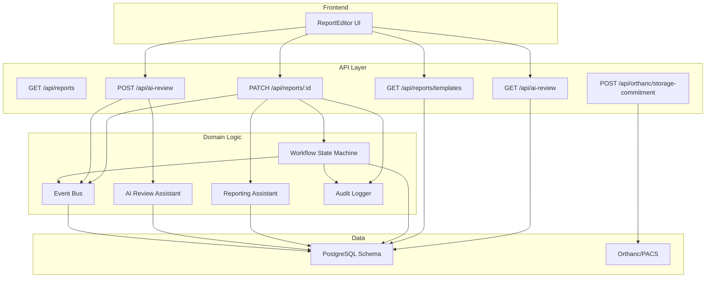

**Diagram sources**
- [reports route:6-45](file://src/app/api/reports/route.ts#L6-L45)
- [report detail route:10-124](file://src/app/api/reports/[id]/route.ts#L10-L124)
- [templates route:9-29](file://src/app/api/reports/templates/route.ts#L9-L29)
- [AI review route:11-108](file://src/app/api/ai-review/route.ts#L11-L108)
- [workflow.ts:37-233](file://src/lib/workflow.ts#L37-L233)
- [reporting.ts:233-325](file://src/lib/reporting.ts#L233-L325)
- [ai-review.ts:91-220](file://src/lib/ai-review.ts#L91-L220)
- [events.ts:101-131](file://src/lib/events.ts#L101-L131)
- [audit.ts:4-24](file://src/lib/audit.ts#L4-L24)
- [storage commitment route:13-39](file://src/app/api/orthanc/storage-commitment/route.ts#L13-L39)

**Section sources**
- [schema.ts:102-180](file://src/db/schema.ts#L102-L180)
- [schema.ts:330-468](file://src/db/schema.ts#L330-L468)

## Core Components
- Reporting assistant: Provides structured templates, draft assistance, terminology checks, critical finding detection, measurement extraction, and quality scoring.
- AI review assistant: Generates candidate observations per modality with confidence, suggested differentials, literature references, and technical quality checks.
- Workflow state machine: Enforces forward-only stage transitions, required guards (e.g., signed before released, released before archived), audit logging, event publishing, and notifications.
- Report APIs: CRUD for reports, versioned snapshots on updates, template listing merging built-in and custom templates, and AI observation retrieval/generation.
- Storage commitment: DICOM Storage Commitment integration to verify safe storage in PACS for compliance.
- Audit and events: Immutable audit log entries and durable event persistence to support traceability and activity feeds.

**Section sources**
- [reporting.ts:233-325](file://src/lib/reporting.ts#L233-L325)
- [ai-review.ts:91-220](file://src/lib/ai-review.ts#L91-L220)
- [workflow.ts:93-233](file://src/lib/workflow.ts#L93-L233)
- [reports route:6-45](file://src/app/api/reports/route.ts#L6-L45)
- [report detail route:10-124](file://src/app/api/reports/[id]/route.ts#L10-L124)
- [templates route:9-29](file://src/app/api/reports/templates/route.ts#L9-L29)
- [AI review route:11-108](file://src/app/api/ai-review/route.ts#L11-L108)
- [storage commitment route:13-39](file://src/app/api/orthanc/storage-commitment/route.ts#L13-L39)
- [events.ts:101-131](file://src/lib/events.ts#L101-L131)
- [audit.ts:4-24](file://src/lib/audit.ts#L4-L24)

## Architecture Overview
The post-imaging workflow is event-driven and state-gated:
- Radiologists draft reports using structured templates and AI assistance.
- Quality scoring and terminology checks guide completeness and consistency.
- Signing requires explicit radiologist confirmation; only radiologists can sign.
- Release requires a signed report; only released studies can be archived.
- Every transition and status change emits events and records audits.
- Storage commitment verifies PACS integrity for regulatory compliance.

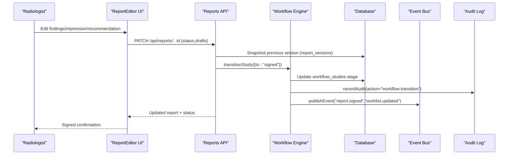

**Diagram sources**
- [report detail route:47-124](file://src/app/api/reports/[id]/route.ts#L47-L124)
- [workflow.ts:102-233](file://src/lib/workflow.ts#L102-L233)
- [events.ts:101-131](file://src/lib/events.ts#L101-L131)
- [audit.ts:4-24](file://src/lib/audit.ts#L4-L24)

## Detailed Component Analysis

### Report Template System
- Built-in templates cover common modalities (X-Ray, CT, MRI, Ultrasound, Mammography).
- Custom templates are merged with built-ins via the templates endpoint.
- Templates define sections, checklists, and hints to guide structured reporting.
- The editor auto-selects a template based on modality and displays section tags.

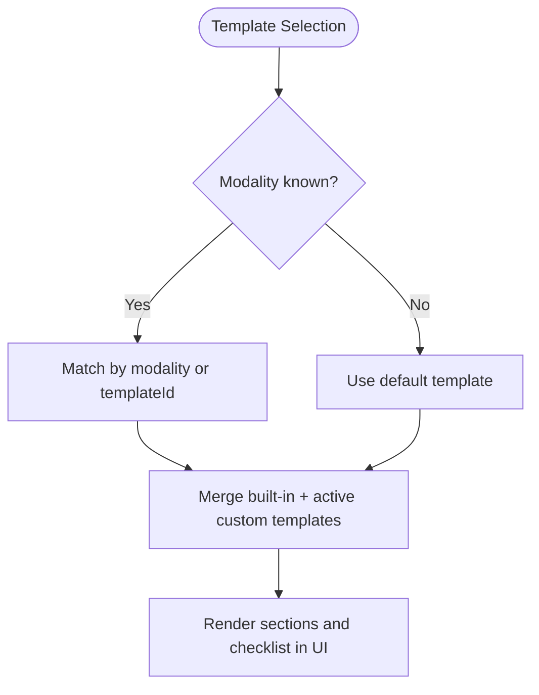

**Diagram sources**
- [templates route:9-29](file://src/app/api/reports/templates/route.ts#L9-L29)
- [reporting.ts:24-175](file://src/lib/reporting.ts#L24-L175)
- [report editor component:112-122](file://src/components/workstation/report-editor.tsx#L112-L122)

**Section sources**
- [templates route:9-29](file://src/app/api/reports/templates/route.ts#L9-L29)
- [reporting.ts:24-175](file://src/lib/reporting.ts#L24-L175)
- [schema.ts:330-342](file://src/db/schema.ts#L330-L342)

### Version Control Mechanisms
- On any update to a report’s content fields, the previous version is snapshotted into report_versions with an incremented version number.
- Versions include findings, impression, recommendation, status, quality score, AI-assisted flag, and changedBy.
- The frontend provides version history view with restore and compare capabilities.

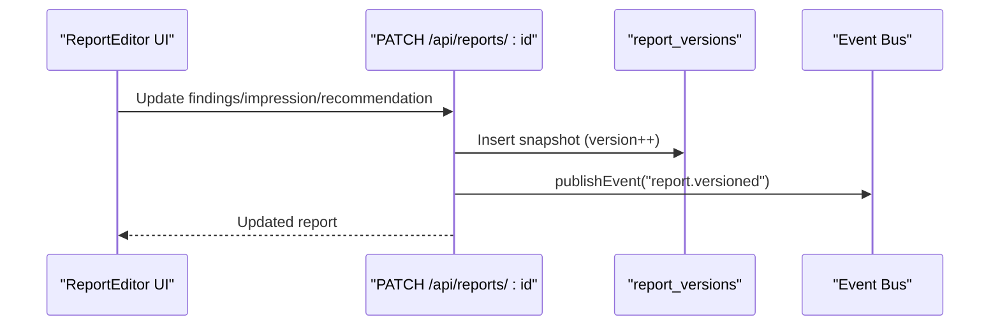

**Diagram sources**
- [report detail route:74-96](file://src/app/api/reports/[id]/route.ts#L74-L96)
- [report versions route:8-21](file://src/app/api/reports/[id]/versions/route.ts#L8-L21)
- [events.ts:101-131](file://src/lib/events.ts#L101-L131)

**Section sources**
- [report detail route:74-96](file://src/app/api/reports/[id]/route.ts#L74-L96)
- [report versions route:8-21](file://src/app/api/reports/[id]/versions/route.ts#L8-L21)
- [schema.ts:344-356](file://src/db/schema.ts#L344-L356)

### Quality Scoring Algorithms
- Quality scoring evaluates findings length, impression presence and non-generic nature, distinction from findings, recommendation when required, absence of placeholders, terminology consistency, and premature signing prevention.
- Incomplete report detection lists failed checks for user remediation.
- Terminology drift detection suggests canonical terms; critical finding detection highlights urgent terms.

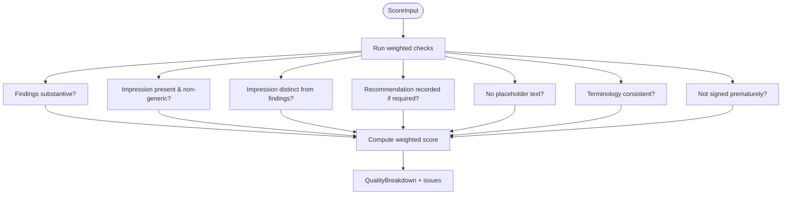

**Diagram sources**
- [reporting.ts:273-325](file://src/lib/reporting.ts#L273-L325)

**Section sources**
- [reporting.ts:273-325](file://src/lib/reporting.ts#L273-L325)

### Radiologist Signing Workflow and Compliance
- Signing requires explicit radiologist confirmation (approvedBy) and role validation; automatic finalization is prohibited.
- Only users with the radiologist role can sign; session verification is enforced at the API layer.
- Signing timestamps are recorded; audit entries capture signed actions; events are published for downstream systems.

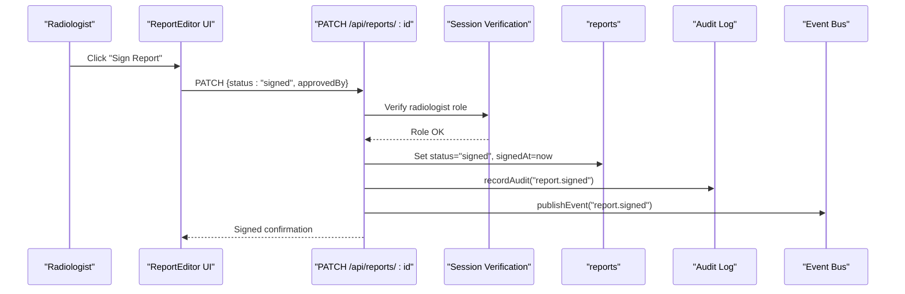

**Diagram sources**
- [report detail route:55-72](file://src/app/api/reports/[id]/route.ts#L55-L72)
- [report detail route:98-121](file://src/app/api/reports/[id]/route.ts#L98-L121)
- [events.ts:101-131](file://src/lib/events.ts#L101-L131)
- [audit.ts:4-24](file://src/lib/audit.ts#L4-L24)

**Section sources**
- [report detail route:55-72](file://src/app/api/reports/[id]/route.ts#L55-L72)
- [report detail route:98-121](file://src/app/api/reports/[id]/route.ts#L98-L121)

### Report Release Process and Distribution
- Release requires a signed report; the workflow engine enforces this guard.
- Releasing advances the study to “released” and triggers worklist updates and notifications.
- External distribution is not implemented in the provided code; however, events are emitted which can be consumed by downstream systems for distribution workflows.

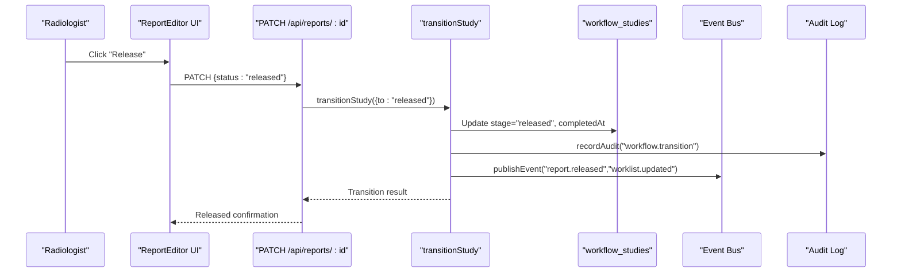

**Diagram sources**
- [workflow.ts:156-165](file://src/lib/workflow.ts#L156-L165)
- [workflow.ts:167-204](file://src/lib/workflow.ts#L167-L204)
- [events.ts:101-131](file://src/lib/events.ts#L101-L131)

**Section sources**
- [workflow.ts:156-204](file://src/lib/workflow.ts#L156-L204)

### Archival Procedures, Data Retention, and Long-Term Storage
- Archival is gated: only released studies can be archived; the workflow enforces forward-only transitions.
- Storage commitment integration verifies that instances are safely stored in Orthanc/PACS for compliance.
- Event persistence ensures durable records even if Redis is unavailable; audit logs provide immutable trails.

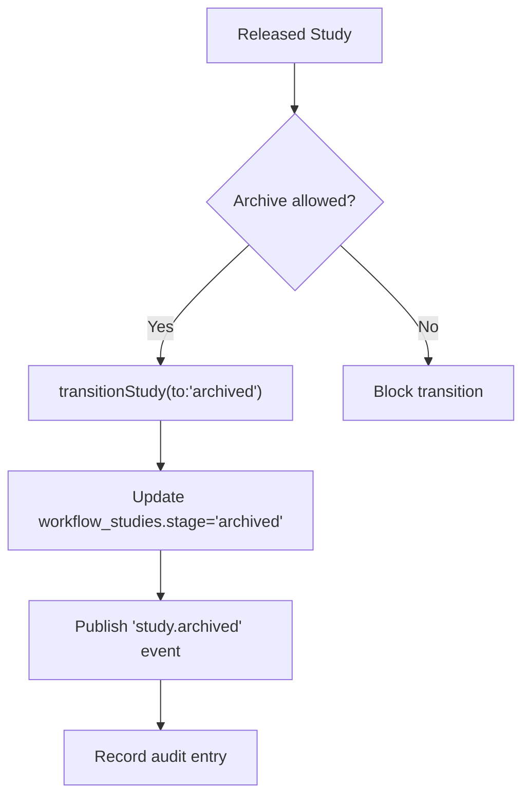

**Diagram sources**
- [workflow.ts:163-165](file://src/lib/workflow.ts#L163-L165)
- [workflow.ts:167-204](file://src/lib/workflow.ts#L167-L204)
- [storage commitment route:13-39](file://src/app/api/orthanc/storage-commitment/route.ts#L13-L39)

**Section sources**
- [workflow.ts:163-204](file://src/lib/workflow.ts#L163-L204)
- [storage commitment route:13-39](file://src/app/api/orthanc/storage-commitment/route.ts#L13-L39)

### AI Review Completion and Integration with Reporting
- AI review generates candidate observations per modality with confidence scores, suggested differentials, literature references, and technical quality checks.
- Observations are persisted as pending until accepted or rejected by the radiologist.
- The editor integrates AI findings insertion and displays quality metrics and reminders.

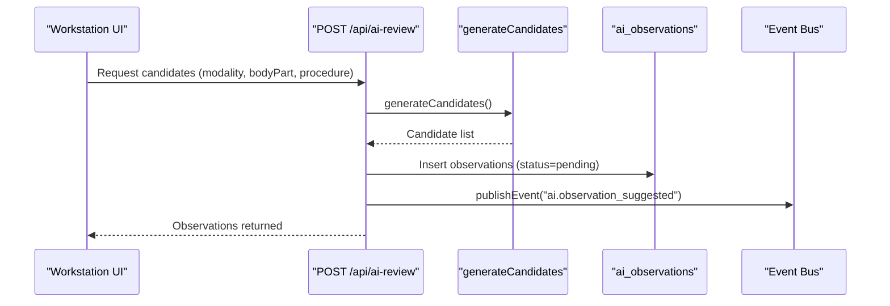

**Diagram sources**
- [AI review route:52-108](file://src/app/api/ai-review/route.ts#L52-L108)
- [ai-review.ts:168-220](file://src/lib/ai-review.ts#L168-L220)
- [events.ts:101-131](file://src/lib/events.ts#L101-L131)

**Section sources**
- [AI review route:52-108](file://src/app/api/ai-review/route.ts#L52-L108)
- [ai-review.ts:168-220](file://src/lib/ai-review.ts#L168-L220)
- [report editor component:175-186](file://src/components/workstation/report-editor.tsx#L175-L186)

### Examples of Report Types and Specific Workflow Requirements
- Chest X-Ray Standard: Structured sections include clinical history, comparison, technique, findings, impression; checklist emphasizes prior comparisons, lines/tubes, apices/costophrenic angles, acute vs chronic.
- CT Brain Standard: Sections include clinical history, comparison, technique, findings, impression, recommendation; checklist includes hemorrhage assessment, midline shift, ventricles, grey-white differentiation.
- CT Chest/Abdomen/Pelvis: Sections split by region; checklist includes lung nodules, lymph nodes, solid organs, bone lesions.
- MRI Brain Standard: Sections include sequences and findings; checklist includes DWI/ADC, demyelination, vessels, enhancement patterns.
- MRI Knee Standard: Sections include menisci, ligaments, cartilage, bone; checklist includes meniscus zones, ACL integrity, chondral grading, bone bruising.
- Ultrasound Abdomen: Sections include liver, gallbladder, kidneys, spleen, pancreas, aorta; checklist includes organ measurements, focal lesions, hydronephrosis, aortic diameter.
- Mammography Screening: Sections include breast composition, findings, BI-RADS, recommendation; checklist includes density categorization, mass description, BI-RADS category.

These templates drive structured drafting and checklist reminders in the editor, ensuring modality-specific completeness and consistency.

**Section sources**
- [reporting.ts:24-175](file://src/lib/reporting.ts#L24-L175)
- [report editor component:295-325](file://src/components/workstation/report-editor.tsx#L295-L325)

## Dependency Analysis
Key dependencies and relationships:
- Reports API depends on database schema for reports, patients, staff, and report versions.
- Workflow engine depends on database schema for workflow studies and reports, and uses audit and event modules.
- Reporting assistant provides templates and quality logic used by the editor and assist endpoint.
- AI review module supplies candidate generation and technical quality checks integrated via the AI review API.
- Storage commitment integrates with Orthanc/PACS for compliance verification.

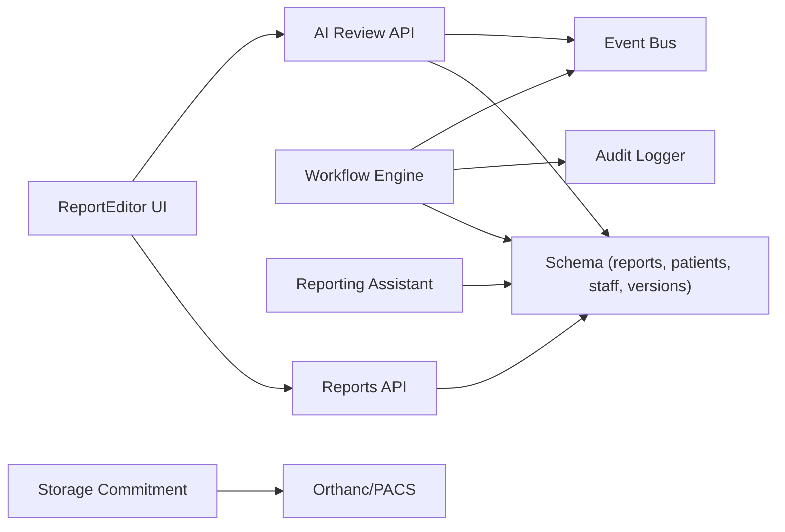

**Diagram sources**
- [reports route:6-45](file://src/app/api/reports/route.ts#L6-L45)
- [report detail route:10-124](file://src/app/api/reports/[id]/route.ts#L10-L124)
- [workflow.ts:23-28](file://src/lib/workflow.ts#L23-L28)
- [ai-review route:1-108](file://src/app/api/ai-review/route.ts#L1-L108)
- [storage commitment route:1-39](file://src/app/api/orthanc/storage-commitment/route.ts#L1-L39)
- [schema.ts:166-180](file://src/db/schema.ts#L166-L180)
- [schema.ts:330-468](file://src/db/schema.ts#L330-L468)

**Section sources**
- [schema.ts:166-180](file://src/db/schema.ts#L166-L180)
- [schema.ts:330-468](file://src/db/schema.ts#L330-L468)

## Performance Considerations
- Event bus writes to Redis Streams are best-effort; durable persistence to event_log ensures availability without Redis.
- Version snapshots occur on each content update; consider batching or debouncing heavy operations if needed.
- Quality scoring runs client-side in the editor; server-side assists compute lightweight checks to avoid blocking.
- Workflow transitions perform minimal DB updates and emit events asynchronously where possible.

[No sources needed since this section provides general guidance]

## Troubleshooting Guide
Common issues and handling:
- Invalid workflow stage or backward transitions: The workflow engine returns errors for unknown stages and rejects backward moves.
- Missing required context: Transitions like sent_to_orthanc require a studyInstanceUid; assigned/opened require a radiologistId.
- Signing restrictions: Auto-finalization is blocked; signing requires explicit approvedBy and radiologist role verification.
- Report creation/fetch failures: API endpoints return standardized error responses on exceptions.
- Storage commitment failures: Endpoint returns reasons such as not configured or study not found.

Recommended diagnostics:
- Check audit logs for action traces and details.
- Inspect event logs for published events and payloads.
- Validate database constraints and foreign keys for reports, versions, and workflow studies.
- Confirm session roles and cookies for signing operations.

**Section sources**
- [workflow.ts:111-165](file://src/lib/workflow.ts#L111-L165)
- [report detail route:55-72](file://src/app/api/reports/[id]/route.ts#L55-L72)
- [reports route:31-45](file://src/app/api/reports/route.ts#L31-L45)
- [storage commitment route:13-39](file://src/app/api/orthanc/storage-commitment/route.ts#L13-L39)
- [events.ts:101-131](file://src/lib/events.ts#L101-L131)
- [audit.ts:4-24](file://src/lib/audit.ts#L4-L24)

## Conclusion
GeraldOS implements a robust post-imaging workflow with strong safeguards: structured reporting via templates, AI-assisted drafting, rigorous quality scoring, explicit radiologist signing with role enforcement, controlled release and archival transitions, comprehensive audit trails, and durable event persistence. The system supports multiple modalities with tailored templates and checklists, integrates with PACS for storage commitment, and provides extensibility via events for downstream distribution and automation.

[No sources needed since this section summarizes without analyzing specific files]

## Appendices

### Data Models Relevant to Post-Imaging Workflow
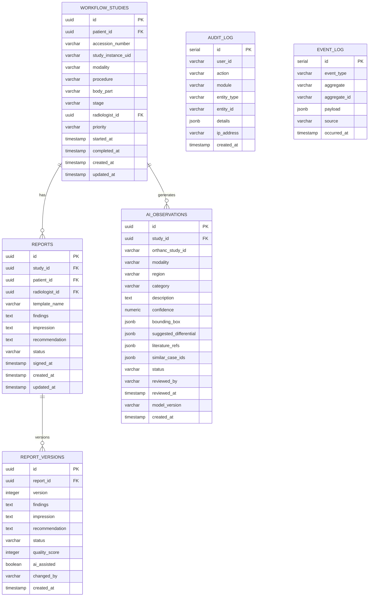

**Diagram sources**
- [schema.ts:102-180](file://src/db/schema.ts#L102-L180)
- [schema.ts:330-468](file://src/db/schema.ts#L330-L468)