# Pre-Imaging Workflow

<cite>
**Referenced Files in This Document**
- [src/app/api/workflow/route.ts](file://src/app/api/workflow/route.ts)
- [src/lib/workflow.ts](file://src/lib/workflow.ts)
- [src/app/api/appointments/route.ts](file://src/app/api/appointments/route.ts)
- [src/app/api/worklist/route.ts](file://src/app/api/worklist/route.ts)
- [src/app/api/fhir/route.ts](file://src/app/api/fhir/route.ts)
- [services/fhir.mjs](file://services/fhir.mjs)
- [src/lib/events.ts](file://src/lib/events.ts)
- [src/lib/audit.ts](file://src/lib/audit.ts)
- [src/db/schema.ts](file://src/db/schema.ts)
- [docker/postgres/init-schemas.sql](file://docker/postgres/init-schemas.sql)
- [src/app/api/seed/route.ts](file://src/app/api/seed/route.ts)
</cite>

## Table of Contents
1. Introduction
2. Project Structure
3. Core Components
4. Architecture Overview
5. Detailed Component Analysis
6. Dependency Analysis
7. Performance Considerations
8. Troubleshooting Guide
9. Conclusion

## Introduction
This document describes the pre-imaging workflow phase in GeraldOS, covering the patient journey from referral receipt through study creation. It explains each stage transition, business rules and validation requirements, required data fields, permission considerations, system integrations (including FHIR), error handling, audit logging, and event publishing patterns. It also provides typical workflows for routine and emergency cases and highlights integration points with external systems such as HAPI FHIR.

## Project Structure
The pre-imaging workflow spans several modules:
- Referral intake and scheduling are modeled via database tables and APIs.
- The clinical pipeline is enforced by a server-side state machine that governs transitions from referral to appointment, arrival, and study creation.
- Worklist queries aggregate context across patients, referrals, appointments, equipment, and staff.
- Events and audit logs record every significant action and support real-time updates.
- FHIR proxying enables interoperability with external systems for patient and coverage lookups.

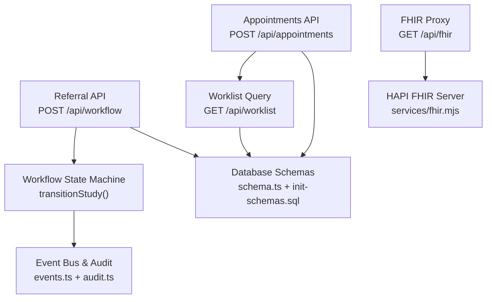

**Diagram sources**
- [src/app/api/workflow/route.ts:55-106](file://src/app/api/workflow/route.ts#L55-L106)
- [src/lib/workflow.ts:93-233](file://src/lib/workflow.ts#L93-L233)
- [src/app/api/appointments/route.ts:42-50](file://src/app/api/appointments/route.ts#L42-L50)
- [src/app/api/worklist/route.ts:26-118](file://src/app/api/worklist/route.ts#L26-L118)
- [src/app/api/fhir/route.ts:10-38](file://src/app/api/fhir/route.ts#L10-L38)
- [services/fhir.mjs:23-54](file://services/fhir.mjs#L23-L54)
- [src/lib/events.ts:101-131](file://src/lib/events.ts#L101-L131)
- [src/lib/audit.ts:4-24](file://src/lib/audit.ts#L4-L24)
- [src/db/schema.ts:38-119](file://src/db/schema.ts#L38-L119)
- [docker/postgres/init-schemas.sql:39-64](file://docker/postgres/init-schemas.sql#L39-L64)

**Section sources**
- [src/app/api/workflow/route.ts:12-47](file://src/app/api/workflow/route.ts#L12-L47)
- [src/app/api/appointments/route.ts:6-40](file://src/app/api/appointments/route.ts#L6-L40)
- [src/app/api/worklist/route.ts:8-25](file://src/app/api/worklist/route.ts#L8-L25)
- [src/app/api/fhir/route.ts:6-38](file://src/app/api/fhir/route.ts#L6-L38)
- [src/lib/workflow.ts:1-21](file://src/lib/workflow.ts#L1-L21)
- [src/db/schema.ts:38-119](file://src/db/schema.ts#L38-L119)
- [docker/postgres/init-schemas.sql:39-64](file://docker/postgres/init-schemas.sql#L39-L64)

## Core Components
- Referral and Study Creation: POST /api/workflow creates a workflow study at the “referral” stage, validates required fields, generates an accession number, records audit entries, and publishes events.
- Appointment Scheduling: POST /api/appointments creates scheduled slots linking patient, equipment, radiographer, modality, procedure, priority, and status.
- Patient Arrival/Check-in: Appointments track checkedIn and checkedInAt; worklist surfaces these flags for reception and imaging teams.
- Workflow State Machine: transitionStudy enforces forward-only transitions, guards for Orthanc UID and radiologist assignment, timestamps milestones, emits events, and writes audit logs.
- Worklist Aggregation: GET /api/worklist joins workflow studies with patients, referrals, appointments, equipment, and staff to present actionable context.
- FHIR Integration: GET /api/fhir proxies requests to HAPI FHIR for patient and coverage resources used during registration and eligibility checks.
- Event Bus and Audit: publishEvent persists events to both Redis Streams (best-effort) and the durable event_log table; recordAudit writes immutable audit entries.

**Section sources**
- [src/app/api/workflow/route.ts:55-106](file://src/app/api/workflow/route.ts#L55-L106)
- [src/app/api/appointments/route.ts:42-50](file://src/app/api/appointments/route.ts#L42-L50)
- [src/lib/workflow.ts:93-233](file://src/lib/workflow.ts#L93-L233)
- [src/app/api/worklist/route.ts:26-118](file://src/app/api/worklist/route.ts#L26-L118)
- [src/app/api/fhir/route.ts:10-38](file://src/app/api/fhir/route.ts#L10-L38)
- [src/lib/events.ts:101-131](file://src/lib/events.ts#L101-L131)
- [src/lib/audit.ts:4-24](file://src/lib/audit.ts#L4-L24)

## Architecture Overview
The pre-imaging workflow is event-driven and state-machine governed. Studies enter at “referral,” advance through “appointment,” “arrival,” and “study_created,” then continue into post-acquisition stages. Each transition is validated, audited, and published as an event.

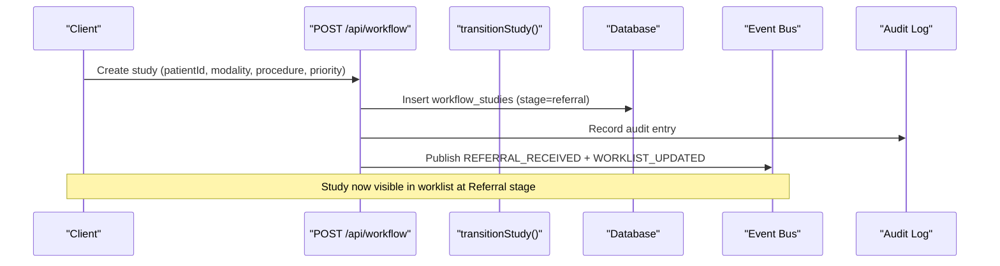

**Diagram sources**
- [src/app/api/workflow/route.ts:55-106](file://src/app/api/workflow/route.ts#L55-L106)
- [src/lib/workflow.ts:93-233](file://src/lib/workflow.ts#L93-L233)
- [src/lib/events.ts:101-131](file://src/lib/events.ts#L101-L131)
- [src/lib/audit.ts:4-24](file://src/lib/audit.ts#L4-L24)

## Detailed Component Analysis

### Stage 1: Referral Receipt
- Entry point: POST /api/workflow creates a workflow study at stage “referral.”
- Required fields: patientId, modality, procedure. Optional: appointmentId, bodyPart, priority, changedBy.
- Business rules:
  - Generates a unique accessionNumber.
  - Sets initial stage to “referral” and default priority to “routine” if not provided.
  - Records an audit entry for “workflow.created.”
  - Publishes REFERRAL_RECEIVED and WORKLIST_UPDATED events.
- Integrations:
  - Worklist consumers react to WORKLIST_UPDATED to surface new referrals.
  - Reception agents can use FHIR proxy to verify patient identity and coverage before acceptance.

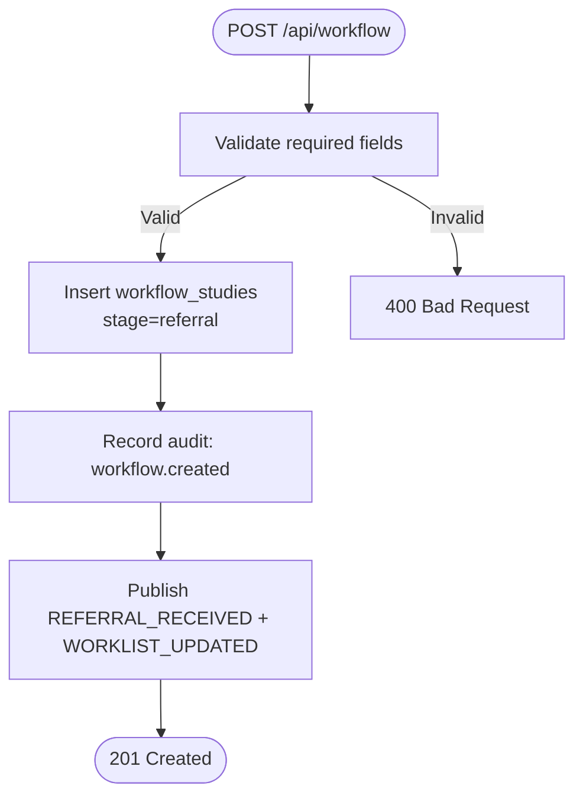

**Diagram sources**
- [src/app/api/workflow/route.ts:55-106](file://src/app/api/workflow/route.ts#L55-L106)
- [src/lib/events.ts:101-131](file://src/lib/events.ts#L101-L131)
- [src/lib/audit.ts:4-24](file://src/lib/audit.ts#L4-L24)

**Section sources**
- [src/app/api/workflow/route.ts:55-106](file://src/app/api/workflow/route.ts#L55-L106)
- [src/lib/events.ts:18-60](file://src/lib/events.ts#L18-L60)
- [src/lib/audit.ts:4-24](file://src/lib/audit.ts#L4-L24)
- [src/db/schema.ts:102-119](file://src/db/schema.ts#L102-L119)

### Stage 2: Appointment Scheduling
- Entry point: POST /api/appointments creates a scheduled slot.
- Required fields include patientId, equipmentId, radiographerId, scheduledDate, scheduledTime, duration, modality, procedure, priority, status.
- Business rules:
  - Links appointment to a referral when available via referralId.
  - Supports filtering and sorting by date/time/modality/priority/status.
  - Enables reception/scheduling agents to detect conflicts and apply priority allocation.
- Integrations:
  - Worklist query joins appointments with patients, equipment, staff, and referrals to provide full context.

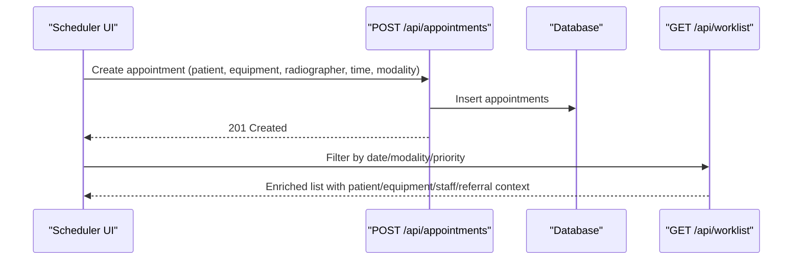

**Diagram sources**
- [src/app/api/appointments/route.ts:42-50](file://src/app/api/appointments/route.ts#L42-L50)
- [src/app/api/worklist/route.ts:26-118](file://src/app/api/worklist/route.ts#L26-L118)
- [src/db/schema.ts:82-100](file://src/db/schema.ts#L82-L100)

**Section sources**
- [src/app/api/appointments/route.ts:6-50](file://src/app/api/appointments/route.ts#L6-L50)
- [src/app/api/worklist/route.ts:8-25](file://src/app/api/worklist/route.ts#L8-L25)
- [src/db/schema.ts:82-100](file://src/db/schema.ts#L82-L100)

### Stage 3: Patient Arrival/Check-in
- Check-in state is tracked on appointments via checkedIn and checkedInAt.
- Worklist surfaces check-in status alongside patient and scheduling details to support reception and imaging teams.
- Typical flow:
  - Reception marks appointment as checked_in and sets checkedInAt.
  - Worklist reflects updated status for queue management.

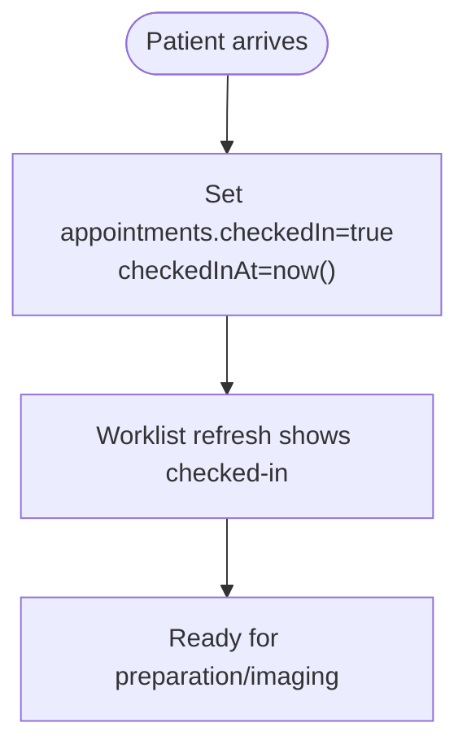

**Section sources**
- [src/app/api/worklist/route.ts:26-118](file://src/app/api/worklist/route.ts#L26-L118)
- [src/db/schema.ts:82-100](file://src/db/schema.ts#L82-L100)

### Stage 4: Study Creation
- A study is created at “referral” via POST /api/workflow and can be advanced through the state machine.
- Advancing to later stages uses transitionStudy, which enforces:
  - Forward-only transitions.
  - Guards for sent_to_orthanc requiring a DICOM studyInstanceUid.
  - Guards for assigned/opened requiring a radiologistId.
  - Timestamps for startedAt and completedAt at appropriate milestones.
  - Audit logging and event publishing for each transition.

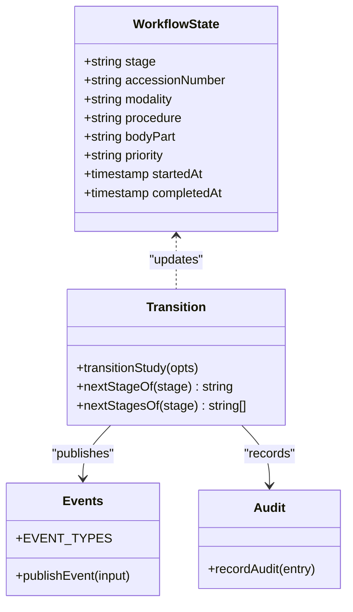

**Diagram sources**
- [src/lib/workflow.ts:29-81](file://src/lib/workflow.ts#L29-L81)
- [src/lib/workflow.ts:93-233](file://src/lib/workflow.ts#L93-L233)
- [src/lib/events.ts:18-60](file://src/lib/events.ts#L18-L60)
- [src/lib/audit.ts:4-24](file://src/lib/audit.ts#L4-L24)
- [src/db/schema.ts:102-119](file://src/db/schema.ts#L102-L119)

**Section sources**
- [src/lib/workflow.ts:37-51](file://src/lib/workflow.ts#L37-L51)
- [src/lib/workflow.ts:93-233](file://src/lib/workflow.ts#L93-L233)
- [src/app/api/workflow/route.ts:55-106](file://src/app/api/workflow/route.ts#L55-L106)

### Data Models and Relationships
Key entities involved in pre-imaging:
- Patients: MRN, name, DOB, gender, contact, insurance, consent status.
- Referrals: linked to patients, includes referring physician/facility, clinical indication, requested procedure, priority, status.
- Appointments: link patient, referral, equipment, radiographer; schedule date/time/duration; modality/procedure/priority/status; check-in flags.
- Workflow Studies: link appointment/patient; generate accession numbers; track stage, radiologist assignment, timestamps.

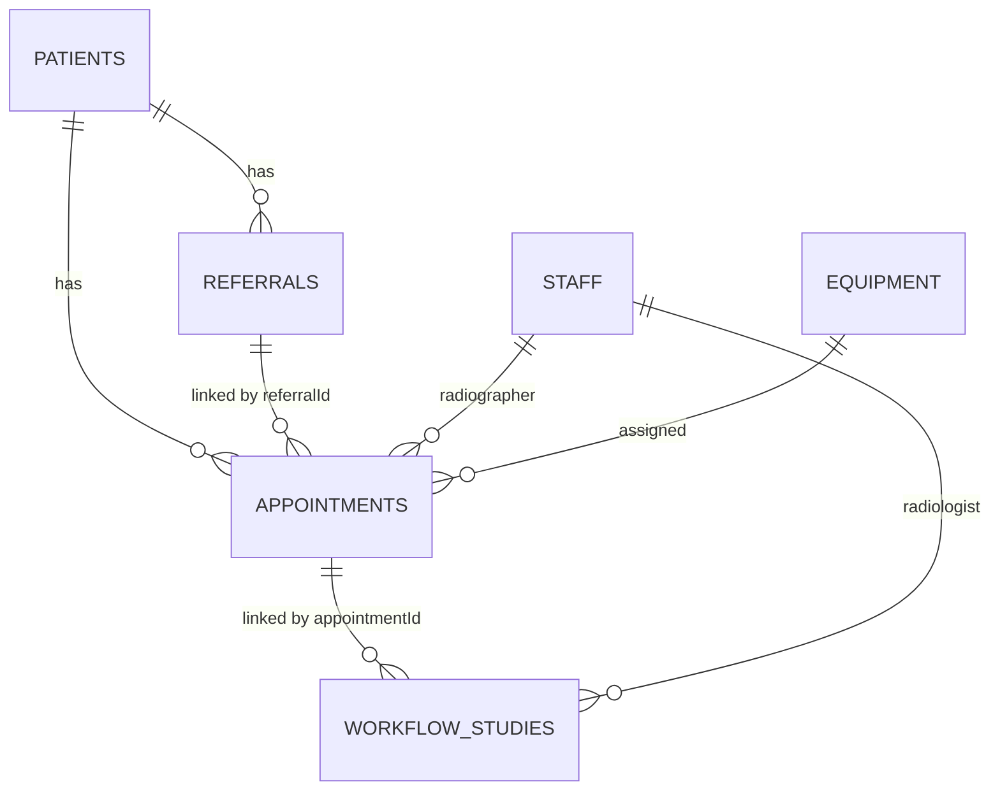

**Diagram sources**
- [src/db/schema.ts:18-119](file://src/db/schema.ts#L18-L119)
- [docker/postgres/init-schemas.sql:39-64](file://docker/postgres/init-schemas.sql#L39-L64)

**Section sources**
- [src/db/schema.ts:18-119](file://src/db/schema.ts#L18-L119)
- [docker/postgres/init-schemas.sql:39-64](file://docker/postgres/init-schemas.sql#L39-L64)

### FHIR Integration Points
- GET /api/fhir proxies requests to HAPI FHIR for resources like Patient and Coverage.
- Use cases:
  - Verify patient identity and insurance eligibility during registration/check-in.
  - Retrieve coverage details to inform scheduling and billing readiness.
- Error handling:
  - Returns 503 if FHIR URL is not configured.
  - Returns 502 if upstream is unreachable.
  - Validates resource paths to prevent injection.

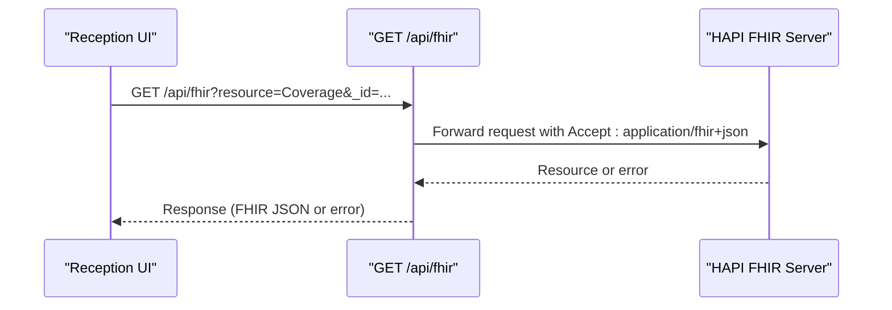

**Diagram sources**
- [src/app/api/fhir/route.ts:10-38](file://src/app/api/fhir/route.ts#L10-L38)
- [services/fhir.mjs:23-54](file://services/fhir.mjs#L23-L54)

**Section sources**
- [src/app/api/fhir/route.ts:6-38](file://src/app/api/fhir/route.ts#L6-L38)
- [services/fhir.mjs:1-55](file://services/fhir.mjs#L1-L55)

### Event Publishing and Audit Logging
- Every major action publishes events via publishEvent:
  - Best-effort write to Redis Streams for real-time consumption.
  - Durable persistence to event_log table ensures auditability even if Redis is down.
- Audit entries are recorded for critical actions (e.g., workflow creation, transitions).
- Event types relevant to pre-imaging include REFERRAL_RECEIVED, APPOINTMENT_CREATED, APPOINTMENT_CHECKED_IN, STUDY_CREATED, WORKLIST_UPDATED.

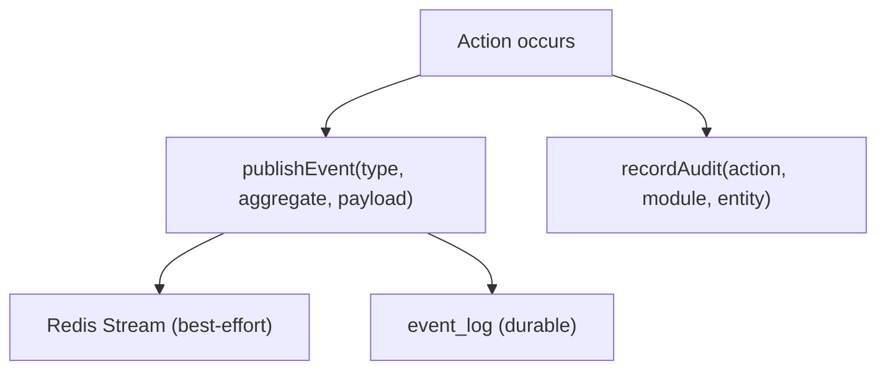

**Diagram sources**
- [src/lib/events.ts:101-131](file://src/lib/events.ts#L101-L131)
- [src/lib/audit.ts:4-24](file://src/lib/audit.ts#L4-L24)

**Section sources**
- [src/lib/events.ts:18-60](file://src/lib/events.ts#L18-L60)
- [src/lib/events.ts:101-131](file://src/lib/events.ts#L101-L131)
- [src/lib/audit.ts:4-24](file://src/lib/audit.ts#L4-L24)

### Typical Workflows and Emergency Handling
- Routine referral:
  - Create study at “referral,” schedule appointment with equipment/radiographer, mark arrival when patient checks in, create study metadata, proceed to acquisition.
- STAT/Emergency referral:
  - Priority “stat” or “emergency” influences scheduling and worklist sorting.
  - Scheduling agent responsibilities include applying priority allocation and reallocating slots when machines go offline.
  - Seed data demonstrates STAT studies appearing in the pipeline without delays.

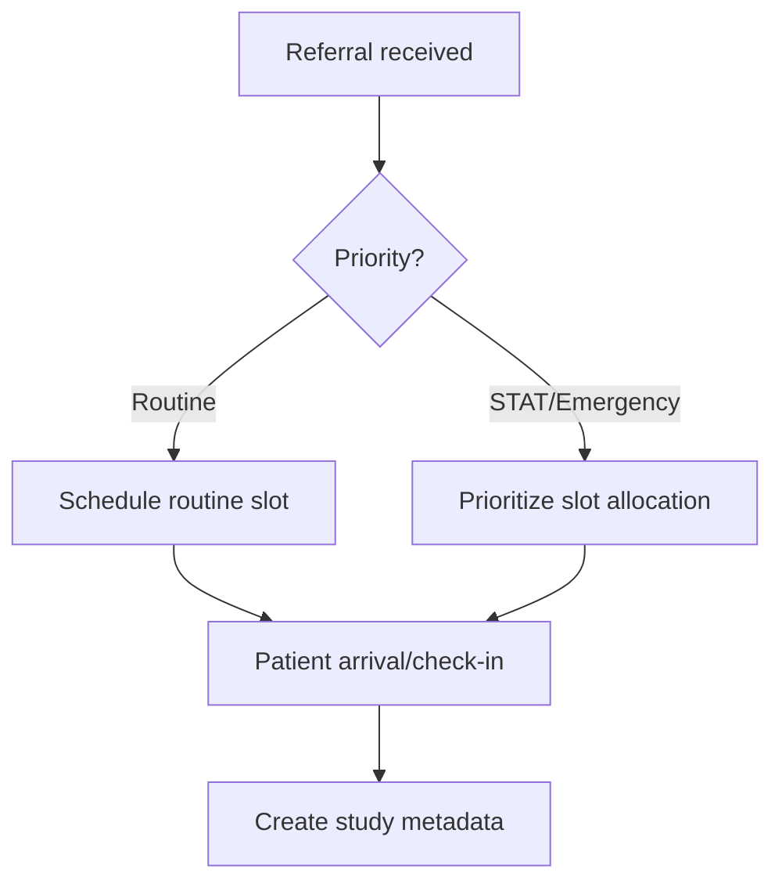

**Section sources**
- [src/app/api/worklist/route.ts:107-110](file://src/app/api/worklist/route.ts#L107-L110)
- [src/lib/agents.ts:41-69](file://src/lib/agents.ts#L41-L69)
- [src/app/api/seed/route.ts:116-126](file://src/app/api/seed/route.ts#L116-L126)
- [src/app/api/seed/route.ts:194-203](file://src/app/api/seed/route.ts#L194-L203)

## Dependency Analysis
- Workflow API depends on:
  - Database schema for workflow_studies, patients, staff.
  - Event bus for REFERRAL_RECEIVED and WORKLIST_UPDATED.
  - Audit logger for immutable records.
- Appointments API depends on:
  - Database schema for appointments, patients, equipment, staff.
  - Worklist aggregation for contextual display.
- Worklist depends on:
  - Joins across workflow_studies, patients, referrals, appointments, equipment, staff.
  - Sorting by priority (emergency > stat > urgent > routine).
- FHIR proxy depends on:
  - Configuration for upstream HAPI FHIR URL.
  - Timed fetch with strict timeouts and content-type handling.

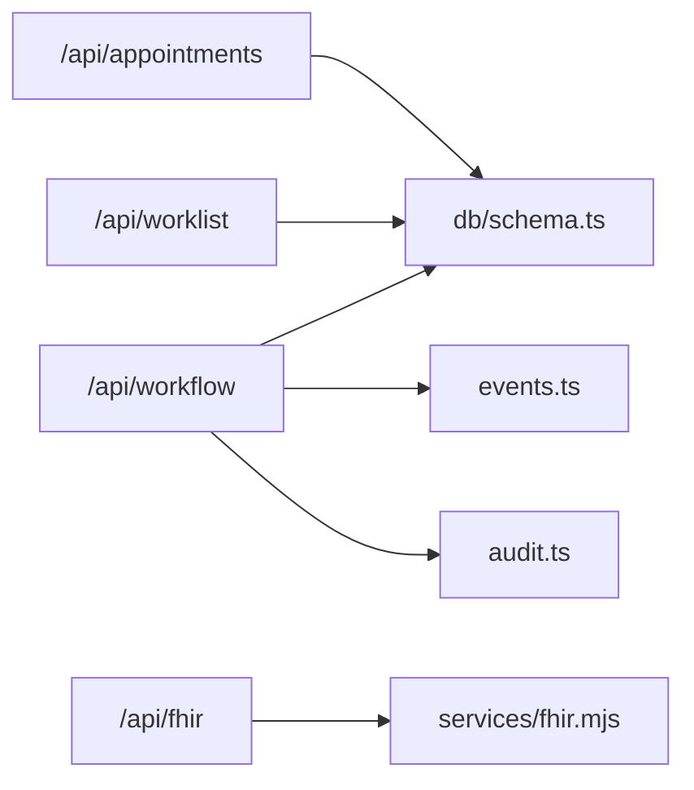

**Diagram sources**
- [src/app/api/workflow/route.ts:1-107](file://src/app/api/workflow/route.ts#L1-L107)
- [src/app/api/appointments/route.ts:1-51](file://src/app/api/appointments/route.ts#L1-L51)
- [src/app/api/worklist/route.ts:1-120](file://src/app/api/worklist/route.ts#L1-L120)
- [src/app/api/fhir/route.ts:1-39](file://src/app/api/fhir/route.ts#L1-L39)
- [services/fhir.mjs:1-55](file://services/fhir.mjs#L1-L55)
- [src/db/schema.ts:1-468](file://src/db/schema.ts#L1-L468)

**Section sources**
- [src/app/api/workflow/route.ts:1-107](file://src/app/api/workflow/route.ts#L1-L107)
- [src/app/api/appointments/route.ts:1-51](file://src/app/api/appointments/route.ts#L1-L51)
- [src/app/api/worklist/route.ts:1-120](file://src/app/api/worklist/route.ts#L1-L120)
- [src/app/api/fhir/route.ts:1-39](file://src/app/api/fhir/route.ts#L1-L39)
- [services/fhir.mjs:1-55](file://services/fhir.mjs#L1-L55)
- [src/db/schema.ts:1-468](file://src/db/schema.ts#L1-L468)

## Performance Considerations
- Worklist queries join multiple tables; ensure indexes on frequently filtered columns (e.g., scheduled_date, modality, priority, stage).
- Event publishing to Redis is best-effort; rely on event_log for durability under load.
- FHIR proxy uses timedFetch with timeouts to avoid blocking requests.
- Avoid excessive client-side filtering; leverage server-side filters and sorting in worklist endpoints.

[No sources needed since this section provides general guidance]

## Troubleshooting Guide
- Referral creation fails:
  - Validate required fields (patientId, modality, procedure).
  - Check database constraints and foreign keys.
  - Review audit log for failed attempts.
- Appointment scheduling issues:
  - Confirm equipment availability and radiographer assignments.
  - Inspect worklist filters for date/modality/priority mismatches.
- FHIR integration errors:
  - Ensure FHIR_URL is configured; otherwise expect 503.
  - If upstream unreachable, expect 502; verify network and service health.
- Workflow transitions blocked:
  - Backward transitions return 409; ensure forward progression.
  - sent_to_orthanc requires studyInstanceUid; assigned/opened require radiologistId.
  - Report signing/release requires signed report status per transition guards.

**Section sources**
- [src/app/api/workflow/route.ts:55-106](file://src/app/api/workflow/route.ts#L55-L106)
- [src/lib/workflow.ts:111-165](file://src/lib/workflow.ts#L111-L165)
- [src/app/api/fhir/route.ts:10-38](file://src/app/api/fhir/route.ts#L10-L38)
- [src/lib/audit.ts:4-24](file://src/lib/audit.ts#L4-L24)

## Conclusion
GeraldOS models the pre-imaging workflow as a robust, event-driven pipeline with strong validation and auditability. Referrals initiate studies, appointments allocate resources, patient arrival triggers readiness, and study creation establishes the foundation for downstream imaging and reporting. The state machine enforces clinically meaningful transitions, while events and audits ensure traceability and real-time responsiveness. FHIR integration supports interoperability for patient and coverage data, enabling seamless registration and eligibility checks.

[No sources needed since this section summarizes without analyzing specific files]