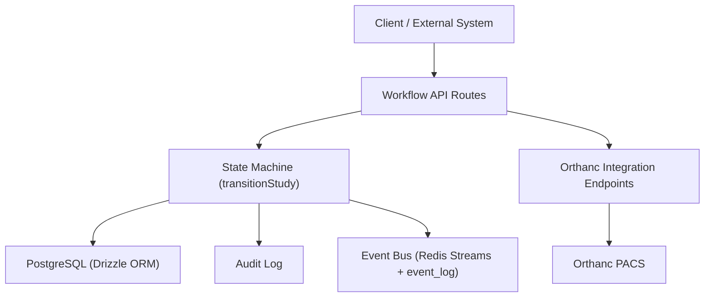
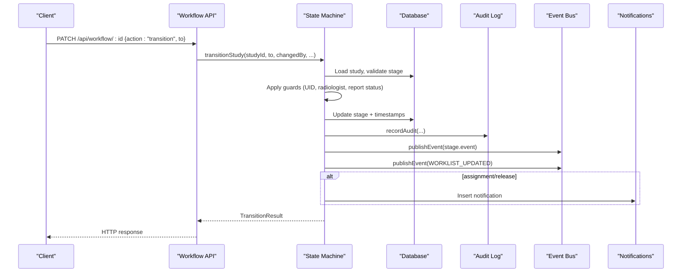
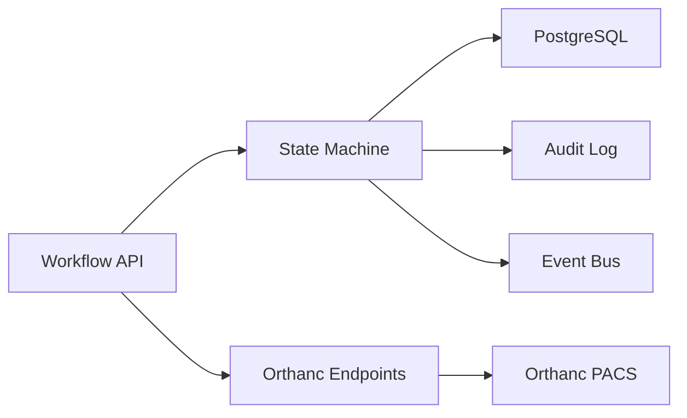

# Study Lifecycle Management

<cite>
**Referenced Files in This Document**
- [workflow.ts](file://src/lib/workflow.ts)
- [schema.ts](file://src/db/schema.ts)
- [events.ts](file://src/lib/events.ts)
- [audit.ts](file://src/lib/audit.ts)
- [route.ts (workflow list/create)](file://src/app/api/workflow/route.ts)
- [route.ts (workflow update by id)](file://src/app/api/workflow/[id]/route.ts)
- [route.ts (orthanc studies)](file://src/app/api/orthanc/studies/route.ts)
- [route.ts (orthanc study detail)](file://src/app/api/orthanc/studies/[id]/route.ts)
- [route.ts (orthanc storage commitment)](file://src/app\api\orthanc\storage-commitment/route.ts)
- [route.ts (orthanc routing)](file://src/app/api/orthanc/routing/route.ts)
- [integrations index.ts](file://src/lib/integrations/index.ts)
</cite>

## Table of Contents
1. Introduction
2. Project Structure
3. Core Components
4. Architecture Overview
5. Detailed Component Analysis
6. Dependency Analysis
7. Performance Considerations
8. Troubleshooting Guide
9. Conclusion
10. Appendices

## Introduction
This document explains how GeraldOS manages the lifecycle of radiology studies through a server-side state machine. It covers stage definitions, transition validation, data consistency, audit trails, event publishing, and integration with Orthanc PACS. It also documents programmatic progression via REST endpoints and highlights performance-related timestamps and metrics.

## Project Structure
Study lifecycle management is implemented across:
- A state machine library that defines stages and enforces transitions
- API routes for creating studies and advancing their state
- Persistence schema for workflow entities and related artifacts
- Event bus and audit logging for compliance and observability
- Orthanc integration endpoints to coordinate DICOM operations

**Diagram sources**
- [route.ts (workflow list/create):1-107](file://src/app/api/workflow/route.ts#L1-L107)
- [route.ts (workflow update by id):1-109](file://src/app/api/workflow/[id]/route.ts#L1-L109)
- [workflow.ts:1-246](file://src/lib/workflow.ts#L1-L246)
- [events.ts:1-158](file://src/lib/events.ts#L1-L158)
- [audit.ts:1-25](file://src/lib/audit.ts#L1-L25)
- [route.ts (orthanc studies):1-35](file://src/app/api/orthanc/studies/route.ts#L1-L35)

**Section sources**
- [workflow.ts:1-246](file://src/lib/workflow.ts#L1-L246)
- [route.ts (workflow list/create):1-107](file://src/app/api/workflow/route.ts#L1-L107)
- [route.ts (workflow update by id):1-109](file://src/app/api/workflow/[id]/route.ts#L1-L109)
- [events.ts:1-158](file://src/lib/events.ts#L1-L158)
- [audit.ts:1-25](file://src/lib/audit.ts#L1-L25)

## Core Components
- Workflow state machine: Defines canonical pipeline stages and validates all transitions.
- Transition function: Central entry point to advance a study, enforcing guards, updating metadata/timestamps, auditing, emitting events, and creating notifications.
- API layer: Exposes endpoints to create studies and perform transitions or field updates.
- Data model: Stores workflow studies, reports, audit logs, and events.
- Integrations: Communicates with Orthanc PACS for DICOM operations and provides health/status endpoints.

Key responsibilities:
- Stage definitions and ordering are the single source of truth for allowed transitions.
- All changes go through the state machine; client cannot arbitrarily set stage values.
- Every transition is audited and published as an event for downstream consumers.
- Timestamps capture key milestones for performance measurement.

**Section sources**
- [workflow.ts:29-81](file://src/lib/workflow.ts#L29-L81)
- [workflow.ts:93-234](file://src/lib/workflow.ts#L93-L234)
- [schema.ts:102-119](file://src/db/schema.ts#L102-L119)
- [schema.ts:167-180](file://src/db/schema.ts#L167-L180)
- [schema.ts:183-193](file://src/db/schema.ts#L183-L193)
- [schema.ts:447-467](file://src/db/schema.ts#L447-L467)

## Architecture Overview
The system uses an event-driven architecture with durable persistence. Transitions trigger:
- Database updates for study metadata and timestamps
- Audit log entries for compliance
- Event bus messages for real-time worklist updates and notifications
- Optional side effects like notifications for assignments and releases

**Diagram sources**
- [route.ts (workflow update by id):20-80](file://src/app/api/workflow/[id]/route.ts#L20-L80)
- [workflow.ts:102-234](file://src/lib/workflow.ts#L102-L234)
- [events.ts:101-131](file://src/lib/events.ts#L101-L131)
- [audit.ts:4-24](file://src/lib/audit.ts#L4-L24)

## Detailed Component Analysis

### Workflow State Machine and Stages
- Canonical pipeline order defines allowed forward-only transitions.
- Stage metadata includes labels, emitted events, and UI tone hints.
- Utility functions provide stage lookup, labeling, and next-stage computation.

Stages include: referral, appointment, patient arrival, study created, sent to Orthanc, radiologist assigned, study opened, AI review, report draft, report signed, report released, archive.

**Section sources**
- [workflow.ts:29-81](file://src/lib/workflow.ts#L29-L81)

### transitionStudy Function: Validation Rules and Error Handling
Core behavior:
- Validates target stage against known stages.
- Loads current study and computes indices to enforce forward-only movement.
- Applies hard guards:
  - sent_to_orthanc requires a valid DICOM studyInstanceUid.
  - assigned/opened require a radiologist.
  - signed/released require report status checks.
  - archived only reachable from released.
- Updates metadata and timestamps:
  - stage and updatedAt always updated on transition.
  - studyInstanceUid when moving to sent_to_orthanc.
  - radiologistId when assigning.
  - startedAt when opening if not already set.
  - completedAt when releasing if not already set.
- Persists changes atomically.
- Records immutable audit entry.
- Publishes stage-specific event and a worklist refresh event.
- Creates notifications for clinically significant handoffs (assignment/release).
- Returns a structured result indicating success/failure, previous/current stages, and whether a transition occurred.

Error handling:
- Invalid stage returns 400.
- Backward moves return 409.
- Missing required context (e.g., UID or radiologist) returns 400.
- Report signing/release constraints return 400.
- Notification failures do not block transitions.

**Section sources**
- [workflow.ts:93-234](file://src/lib/workflow.ts#L93-L234)

### API Layer: Creating and Managing Studies
- Create endpoint:
  - Accepts patient, modality, procedure, optional appointment and priority.
  - Generates accession number and sets initial stage to referral.
  - Audits creation and emits referral received and worklist updated events.
- Update endpoint:
  - Supports action-based transitions and plain field updates.
  - Assignment can reassign without rolling back stage if already past assigned.
  - Validates target stages using the state machine utilities.
  - Audits updates and returns transition results.

**Section sources**
- [route.ts (workflow list/create):12-107](file://src/app/api/workflow/route.ts#L12-L107)
- [route.ts (workflow update by id):20-109](file://src/app/api/workflow/[id]/route.ts#L20-L109)

### Data Model and Consistency
- workflow_studies stores core lifecycle fields including stage, timestamps, and associations.
- reports tracks report status used by transition guards.
- audit_log records every transition and important actions for compliance.
- event_log persists events even if Redis is unavailable, ensuring durability.
- notifications store user-facing alerts for assignments and releases.

Consistency mechanisms:
- Server-side validation ensures no client bypass of state rules.
- Forward-only transitions prevent regression.
- Hard guards enforce clinical prerequisites before allowing sensitive transitions.
- Atomic updates plus audit/event emission ensure traceability.

**Section sources**
- [schema.ts:102-119](file://src/db/schema.ts#L102-L119)
- [schema.ts:167-180](file://src/db/schema.ts#L167-L180)
- [schema.ts:183-193](file://src/db/schema.ts#L183-L193)
- [schema.ts:447-467](file://src/db/schema.ts#L447-L467)

### Eventing and Audit Trails
- Each transition publishes:
  - A stage-specific event (e.g., study.opened, report.signed).
  - A worklist.updated event to refresh lists and dashboards.
- Events are written to Redis Streams when available and always persisted to event_log.
- Audit entries capture actor, action, module, entity type/id, and details for compliance.

**Section sources**
- [events.ts:18-60](file://src/lib/events.ts#L18-L60)
- [events.ts:101-131](file://src/lib/events.ts#L101-L131)
- [audit.ts:4-24](file://src/lib/audit.ts#L4-L24)
- [workflow.ts:189-204](file://src/lib/workflow.ts#L189-L204)

### Orthanc PACS Integration Patterns
- List and fetch studies/series/instances from Orthanc with authentication headers.
- Routing: Send a study to a target modality or peer via Orthanc’s modalities/peers store endpoints.
- Storage Commitment: Trigger N-ACTION to verify safe storage of instances for compliance.
- Health endpoint: Aggregate Orthanc system, jobs, metrics, plugins, modalities, peers for monitoring.

Integration notes:
- Uses timedFetch with timeouts to avoid hanging calls.
- Fails gracefully when Orthanc is not configured or unreachable.
- Authentication header is generated from configured credentials.

**Section sources**
- [route.ts (orthanc studies):20-35](file://src/app/api/orthanc/studies/route.ts#L20-L35)
- [route.ts (orthanc study detail):19-25](file://src/app/api/orthanc/studies/[id]/route.ts#L19-L25)
- [route.ts (orthanc routing):15-37](file://src/app/api/orthanc/routing/route.ts#L15-L37)
- [route.ts (orthanc storage commitment):13-39](file://src/app/api/orthanc/storage-commitment/route.ts#L13-L39)
- [integrations index.ts:125-132](file://src/lib/integrations/index.ts#L125-L132)

### Programmatic Study Progression Examples
- Create a new study at referral:
  - POST /api/workflow with patientId, modality, procedure, optional appointmentId and priority.
  - The system generates an accession number and emits referral.received and worklist.updated events.
- Assign a radiologist and move to assigned:
  - PATCH /api/workflow/:id with action "assign" and radiologistId.
  - If already past assigned, this updates the radiologist without changing stage.
- Move to sent_to_orthanc:
  - PATCH /api/workflow/:id with action "transition" and to "sent_to_orthanc".
  - Requires a valid studyInstanceUid; otherwise returns 400.
- Open study and start review:
  - Transition to "opened" to record startedAt if not set.
  - Subsequent transitions proceed through AI review, report draft, signed, released, and archive.
- Release and archive:
  - Transition to "released" requires a signed report.
  - Transition to "archived" requires the study to be released.

These flows are enforced by the state machine and recorded in audit and event streams.

**Section sources**
- [route.ts (workflow list/create):55-107](file://src/app/api/workflow/route.ts#L55-L107)
- [route.ts (workflow update by id):33-80](file://src/app/api/workflow/[id]/route.ts#L33-L80)
- [workflow.ts:134-172](file://src/lib/workflow.ts#L134-L172)

## Dependency Analysis

- The workflow API depends on the state machine for all transitions.
- The state machine depends on database, audit, and event bus.
- Orthanc endpoints depend on configuration and authentication helpers.

**Diagram sources**
- [route.ts (workflow update by id):1-109](file://src/app/api/workflow/[id]/route.ts#L1-L109)
- [workflow.ts:1-246](file://src/lib/workflow.ts#L1-L246)
- [events.ts:1-158](file://src/lib/events.ts#L1-L158)
- [audit.ts:1-25](file://src/lib/audit.ts#L1-L25)
- [route.ts (orthanc studies):1-35](file://src/app/api/orthanc/studies/route.ts#L1-L35)

**Section sources**
- [route.ts (workflow update by id):1-109](file://src/app/api/workflow/[id]/route.ts#L1-L109)
- [workflow.ts:1-246](file://src/lib/workflow.ts#L1-L246)
- [events.ts:1-158](file://src/lib/events.ts#L1-L158)
- [audit.ts:1-25](file://src/lib/audit.ts#L1-L25)
- [route.ts (orthanc studies):1-35](file://src/app/api/orthanc/studies/route.ts#L1-L35)

## Performance Considerations
- Timestamps:
  - startedAt captures when a study is opened.
  - completedAt captures when a study is released.
  - updatedAt is updated on every transition.
- These timestamps enable calculation of turnaround times and throughput metrics.
- Event bus writes are best-effort to Redis but always persisted to event_log for durability.
- Orthanc calls use timeouts to prevent blocking requests.

[No sources needed since this section provides general guidance]

## Troubleshooting Guide
Common issues and resolutions:
- Invalid stage provided:
  - Ensure the target stage is one of the defined pipeline stages.
- Backward transition attempted:
  - Only forward moves are allowed; correct the requested stage.
- Missing studyInstanceUid when sending to Orthanc:
  - Provide a valid DICOM studyInstanceUid before transitioning to sent_to_orthanc.
- Missing radiologist for assignment/open:
  - Assign a radiologist before marking the study as assigned or opened.
- Report not signed before release/archive:
  - Ensure the report status is signed before attempting to release or archive.
- Orthanc not configured:
  - Configure Orthanc URL and credentials; endpoints will return not_configured until configured.
- Redis unavailable:
  - Events still persist to event_log; check the event_log table for activity.

**Section sources**
- [workflow.ts:111-165](file://src/lib/workflow.ts#L111-L165)
- [route.ts (orthanc studies):20-35](file://src/app/api/orthanc/studies/route.ts#L20-L35)
- [events.ts:101-131](file://src/lib/events.ts#L101-L131)

## Conclusion
GeraldOS implements a robust, auditable study lifecycle managed by a server-side state machine. All transitions are validated, timestamped, and recorded in both audit logs and event streams. Integration with Orthanc PACS supports DICOM operations while maintaining resilience and compliance. The API surface enables programmatic progression and flexible field updates, ensuring consistent and traceable workflows across the platform.

[No sources needed since this section summarizes without analyzing specific files]

## Appendices

### Stage Definitions and Emitters
- Referral → Appointment → Patient Arrival → Study Created → Sent to Orthanc → Radiologist Assigned → Study Opened → AI Review → Report Draft → Report Signed → Report Released → Archive
- Each stage maps to a domain event for downstream processing.

**Section sources**
- [workflow.ts:37-51](file://src/lib/workflow.ts#L37-L51)
- [events.ts:18-60](file://src/lib/events.ts#L18-L60)

### Key Data Entities
- workflow_studies: Core lifecycle tracking with stage and timestamps.
- reports: Report status used by transition guards.
- audit_log: Immutable record of transitions and actions.
- event_log: Durable event history independent of Redis availability.
- notifications: User alerts for assignments and releases.

**Section sources**
- [schema.ts:102-119](file://src/db/schema.ts#L102-L119)
- [schema.ts:167-180](file://src/db/schema.ts#L167-L180)
- [schema.ts:183-193](file://src/db/schema.ts#L183-L193)
- [schema.ts:447-467](file://src/db/schema.ts#L447-L467)