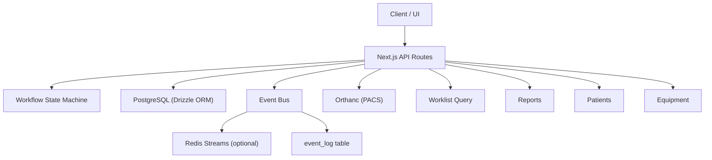
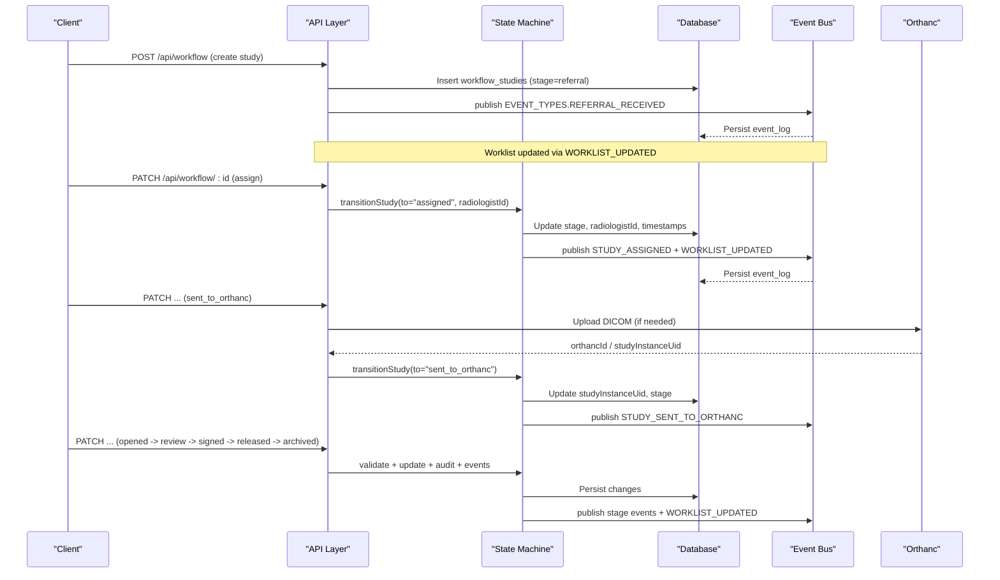
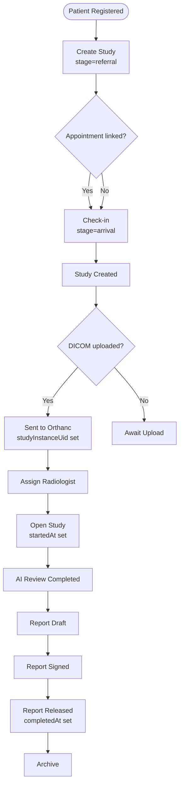
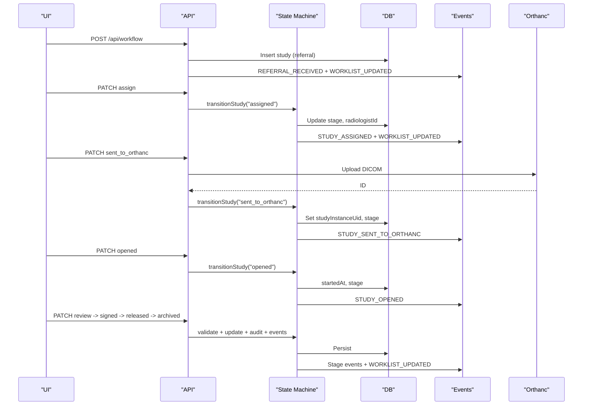
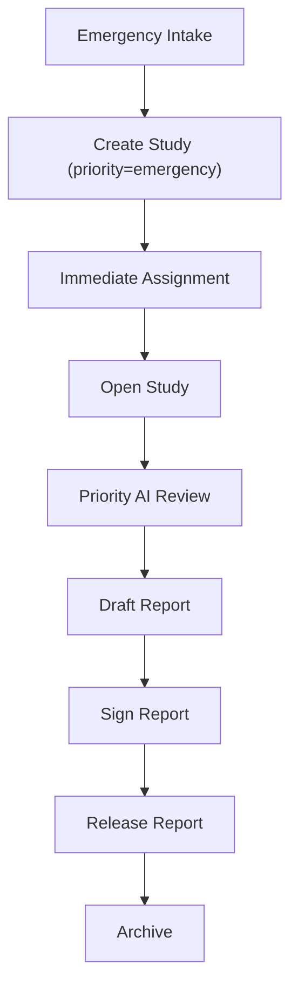
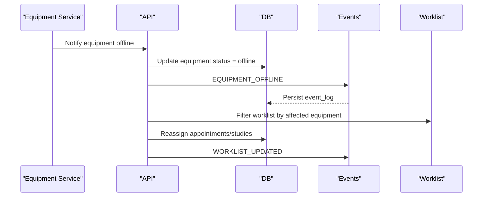
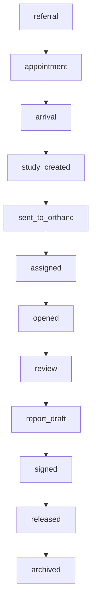
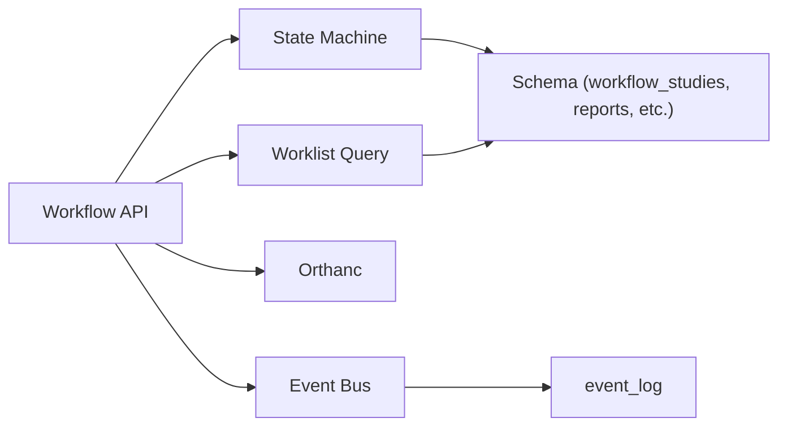

# Workflow Data Flows

<cite>
**Referenced Files in This Document**
- [workflow.ts](file://src/lib/workflow.ts)
- [route.ts (workflow)](file://src/app/api/workflow/route.ts)
- [route.ts (workflow id)](file://src/app/api/workflow/[id]/route.ts)
- [events.ts](file://src/lib/events.ts)
- [audit.ts](file://src/lib/audit.ts)
- [schema.ts](file://src/db/schema.ts)
- [route.ts (worklist)](file://src/app/api/worklist/route.ts)
- [route.ts (patients)](file://src/app/api/patients/route.ts)
- [route.ts (reports)](file://src/app/api/reports/route.ts)
- [route.ts (equipment)](file://src/app/api/equipment/route.ts)
- [route.ts (orthanc upload)](file://src/app/api/orthanc/upload/route.ts)
- [route.ts (orthanc studies)](file://src/app/api/orthanc/studies/route.ts)
- [route.ts (workstation context)](file://src/app/api/workstation/context/route.ts)
- [utils.ts](file://src/lib/utils.ts)
</cite>

## Table of Contents
1. Introduction
2. Project Structure
3. Core Components
4. Architecture Overview
5. Detailed Component Analysis
6. Dependency Analysis
7. Performance Considerations
8. Troubleshooting Guide
9. Conclusion

## Introduction
This document explains the end-to-end patient journey in GeraldOS from registration through study completion, focusing on workflow data flows, state transitions, validation rules, and cross-component consistency. It covers how studies move through a server-enforced pipeline, how events drive downstream systems, and how errors are handled with durable persistence and best-effort real-time delivery.

## Project Structure
The workflow spans several layers:
- API routes for creating, updating, and querying studies, worklist, reports, patients, equipment, and PACS integrations.
- A server-side state machine that enforces forward-only transitions and clinical guards.
- An event bus that persists all events to a durable log and optionally streams them via Redis.
- Database schemas defining entities such as patients, appointments, workflow studies, reports, audit logs, and notifications.

**Diagram sources**
- [route.ts (workflow):1-107](file://src/app/api/workflow/route.ts#L1-L107)
- [route.ts (workflow id):1-109](file://src/app/api/workflow/[id]/route.ts#L1-L109)
- [workflow.ts:1-246](file://src/lib/workflow.ts#L1-L246)
- [events.ts:1-158](file://src/lib/events.ts#L1-L158)
- [schema.ts:102-119](file://src/db/schema.ts#L102-L119)
- [route.ts (worklist):1-120](file://src/app/api/worklist/route.ts#L1-L120)
- [route.ts (orthanc upload):1-78](file://src/app/api/orthanc/upload/route.ts#L1-L78)
- [route.ts (orthanc studies):1-86](file://src/app/api/orthanc/studies/route.ts#L1-L86)

**Section sources**
- [route.ts (workflow):1-107](file://src/app/api/workflow/route.ts#L1-L107)
- [route.ts (workflow id):1-109](file://src/app/api/workflow/[id]/route.ts#L1-L109)
- [workflow.ts:1-246](file://src/lib/workflow.ts#L1-L246)
- [events.ts:1-158](file://src/lib/events.ts#L1-L158)
- [schema.ts:102-119](file://src/db/schema.ts#L102-L119)

## Core Components
- Workflow state machine: Defines canonical stages, validates transitions, applies clinical guards, updates timestamps, records audit, publishes events, and emits notifications.
- API layer: Creates studies at referral, advances stages, assigns radiologists, and exposes read endpoints for worklist and reports.
- Event bus: Publishes domain events to Redis Streams (best-effort) and always persists to event_log for durability.
- Data models: Drizzle schema defines patients, appointments, workflow studies, reports, audit_log, event_log, and notifications.

Key responsibilities:
- Enforce forward-only progression and stage-specific preconditions.
- Maintain consistent timestamps for lifecycle milestones.
- Ensure every transition is audited and observable via events.
- Provide robust integration points for PACS (Orthanc) and workstation context.

**Section sources**
- [workflow.ts:29-81](file://src/lib/workflow.ts#L29-L81)
- [workflow.ts:93-234](file://src/lib/workflow.ts#L93-L234)
- [events.ts:18-60](file://src/lib/events.ts#L18-L60)
- [events.ts:101-131](file://src/lib/events.ts#L101-L131)
- [schema.ts:102-119](file://src/db/schema.ts#L102-L119)
- [schema.ts:167-180](file://src/db/schema.ts#L167-L180)
- [schema.ts:447-467](file://src/db/schema.ts#L447-L467)

## Architecture Overview
The system uses an event-driven architecture with a strict server-side state machine. Studies enter at referral and advance through defined stages. Each transition triggers audit logging, event publishing, and optional notifications. PACS integration occurs when studies are sent to Orthanc; workstation context aggregates patient history, prior studies, and knowledge artifacts.

**Diagram sources**
- [route.ts (workflow):55-101](file://src/app/api/workflow/route.ts#L55-L101)
- [route.ts (workflow id):20-80](file://src/app/api/workflow/[id]/route.ts#L20-L80)
- [workflow.ts:102-234](file://src/lib/workflow.ts#L102-L234)
- [events.ts:101-131](file://src/lib/events.ts#L101-L131)
- [route.ts (orthanc upload):16-78](file://src/app/api/orthanc/upload/route.ts#L16-L78)

## Detailed Component Analysis

### End-to-End Patient Journey
- Registration: Create or retrieve patient record.
- Referral creation: Create workflow study at referral stage; generate accession number; emit REFERRAL_RECEIVED and WORKLIST_UPDATED.
- Appointment and arrival: Optional appointment linkage; check-in triggers arrival stage.
- Study created and sent to Orthanc: DICOM upload to Orthanc; set studyInstanceUid; transition to sent_to_orthanc.
- Radiologist assignment and opening: Assign radiologist; open study; start timestamp recorded.
- AI review and reporting: AI review completed; report draft; sign report; release report; archive study.

Validation and transformation highlights:
- Forward-only transitions enforced by index comparison.
- Stage-specific guards require Orthanc UID before sent_to_orthanc, radiologist before assigned/opened, signed report before released, and released before archived.
- Timestamps capture startedAt and completedAt at appropriate milestones.
- Every transition writes audit entries and publishes stage events plus worklist refresh signals.

**Diagram sources**
- [route.ts (workflow):55-101](file://src/app/api/workflow/route.ts#L55-L101)
- [workflow.ts:37-51](file://src/lib/workflow.ts#L37-L51)
- [workflow.ts:134-172](file://src/lib/workflow.ts#L134-L172)
- [route.ts (orthanc upload):16-78](file://src/app/api/orthanc/upload/route.ts#L16-L78)

**Section sources**
- [route.ts (patients):28-36](file://src/app/api/patients/route.ts#L28-L36)
- [route.ts (workflow):55-101](file://src/app/api/workflow/route.ts#L55-L101)
- [workflow.ts:102-234](file://src/lib/workflow.ts#L102-L234)
- [route.ts (orthanc upload):16-78](file://src/app/api/orthanc/upload/route.ts#L16-L78)

### Typical Workflow Sequences

#### Routine Imaging
- Steps: Create study at referral → optional appointment → arrival → send to Orthanc → assign radiologist → open → AI review → draft → sign → release → archive.
- Key validations: Orthanc UID required before sent_to_orthanc; radiologist required for assigned/opened; signed report required before released.

**Diagram sources**
- [route.ts (workflow):55-101](file://src/app/api/workflow/route.ts#L55-L101)
- [route.ts (workflow id):20-80](file://src/app/api/workflow/[id]/route.ts#L20-L80)
- [workflow.ts:102-234](file://src/lib/workflow.ts#L102-L234)
- [route.ts (orthanc upload):16-78](file://src/app/api/orthanc/upload/route.ts#L16-L78)

#### Emergency Cases
- Priority handling: Worklist supports emergency and stat filters; priority sorting ensures urgent items surface first.
- Fast-tracking: Assign radiologist immediately; open study; prioritize AI review and reporting; expedite release and archive.

**Diagram sources**
- [route.ts (worklist):26-111](file://src/app/api/worklist/route.ts#L26-L111)
- [route.ts (workflow id):33-59](file://src/app/api/workflow/[id]/route.ts#L33-L59)
- [workflow.ts:102-234](file://src/lib/workflow.ts#L102-L234)

#### Equipment Failure Scenario
- Detection: Equipment status tracked; offline events can be emitted; maintenance records maintained.
- Response: Reassign affected appointments/studies; notify staff; schedule maintenance; adjust worklist filters.

**Diagram sources**
- [schema.ts:53-68](file://src/db/schema.ts#L53-L68)
- [schema.ts:122-134](file://src/db/schema.ts#L122-L134)
- [events.ts:18-60](file://src/lib/events.ts#L18-L60)
- [route.ts (worklist):26-111](file://src/app/api/worklist/route.ts#L26-L111)

### State Transitions and Validation Rules
- Canonical stages define order; backward moves rejected with conflict response.
- Hard handoff guards:
  - sent_to_orthanc requires a valid DICOM studyInstanceUid.
  - assigned/opened require a radiologist.
  - signed requires report status signed.
  - released requires signed report.
  - archived only reachable from released.
- Timestamps:
  - startedAt set on opened if not present.
  - completedAt set on released if not present.

**Diagram sources**
- [workflow.ts:37-51](file://src/lib/workflow.ts#L37-L51)
- [workflow.ts:118-172](file://src/lib/workflow.ts#L118-L172)

**Section sources**
- [workflow.ts:55-81](file://src/lib/workflow.ts#L55-L81)
- [workflow.ts:118-172](file://src/lib/workflow.ts#L118-L172)

### Data Movement Between Components
- Creation: POST /api/workflow inserts workflow_studies and emits events.
- Updates: PATCH /api/workflow/:id validates transitions, updates DB, audits, and publishes events.
- Worklist: Aggregates patient, staff, appointment, referral, and equipment data; sorts by priority.
- Reports: CRUD operations for reports; linked to studies and patients.
- PACS: Orthanc upload returns IDs; studies endpoint lists studies with modalities derived from series.
- Workstation Context: Assembles patient demographics, history, referrals, previous studies, reports, protocols, teaching files, similar cases, and FHIR lab summaries.

**Section sources**
- [route.ts (workflow):12-47](file://src/app/api/workflow/route.ts#L12-L47)
- [route.ts (workflow id):20-109](file://src/app/api/workflow/[id]/route.ts#L20-L109)
- [route.ts (worklist):26-111](file://src/app/api/worklist/route.ts#L26-L111)
- [route.ts (reports):6-46](file://src/app/api/reports/route.ts#L6-L46)
- [route.ts (orthanc upload):16-78](file://src/app/api/orthanc/upload/route.ts#L16-L78)
- [route.ts (orthanc studies):20-86](file://src/app/api/orthanc/studies/route.ts#L20-L86)
- [route.ts (workstation context):35-309](file://src/app/api/workstation/context/route.ts#L35-L309)

### Consistency Across Distributed Operations
- Durable event persistence: All events written to event_log regardless of Redis availability.
- Best-effort streaming: Redis Streams used for real-time distribution; failures do not block transitions.
- Audit trail: Every transition logged with user, action, module, entity type, and details.
- Idempotency considerations: Transition checks prevent duplicate stage advancement; reassignment after advanced stages updates radiologist without rolling back.

**Section sources**
- [events.ts:72-131](file://src/lib/events.ts#L72-L131)
- [audit.ts:4-24](file://src/lib/audit.ts#L4-L24)
- [route.ts (workflow id):33-59](file://src/app/api/workflow/[id]/route.ts#L33-L59)

## Dependency Analysis
The workflow depends on:
- Database schema for core entities and audit/event storage.
- Event bus for decoupled communication and observability.
- PACS integration for DICOM uploads and study metadata.
- Worklist aggregation across multiple tables for rich context.

**Diagram sources**
- [route.ts (workflow):1-107](file://src/app/api/workflow/route.ts#L1-L107)
- [route.ts (workflow id):1-109](file://src/app/api/workflow/[id]/route.ts#L1-L109)
- [workflow.ts:1-246](file://src/lib/workflow.ts#L1-L246)
- [events.ts:1-158](file://src/lib/events.ts#L1-L158)
- [schema.ts:102-180](file://src/db/schema.ts#L102-L180)

**Section sources**
- [schema.ts:102-180](file://src/db/schema.ts#L102-L180)
- [events.ts:1-158](file://src/lib/events.ts#L1-L158)

## Performance Considerations
- Batch operations: Orthanc upload processes multiple files; results aggregated and audited.
- Query optimization: Worklist uses indexed joins and conditional filters; priority ranking applied post-fetch.
- Event bus resilience: Redis connection attempts are rate-limited; failures fall back to durable event_log.
- Timeouts: PACS calls use timed fetch to avoid blocking requests.

[No sources needed since this section provides general guidance]

## Troubleshooting Guide
Common issues and resolutions:
- Invalid stage transition: Ensure target stage is known and forward-only; provide required fields (e.g., studyInstanceUid, radiologistId).
- Missing Orthanc UID: Upload DICOM to Orthanc before marking sent_to_orthanc.
- Report signing constraints: Only authenticated radiologists can sign; ensure report status is signed before releasing.
- Event bus unavailability: Events still persist to event_log; verify event_log entries for audit.
- Orthanc connectivity: Check configuration and timeouts; inspect upstream HTTP status codes in responses.

Error handling patterns:
- API routes return structured error objects with status codes.
- State machine returns detailed errors for invalid transitions and missing prerequisites.
- Audit and events are attempted even on partial failures; non-fatal errors do not block core transitions.

**Section sources**
- [route.ts (workflow id):20-109](file://src/app/api/workflow/[id]/route.ts#L20-L109)
- [workflow.ts:111-165](file://src/lib/workflow.ts#L111-L165)
- [events.ts:101-131](file://src/lib/events.ts#L101-L131)
- [route.ts (orthanc upload):16-78](file://src/app/api/orthanc/upload/route.ts#L16-L78)

## Conclusion
GeraldOS implements a robust, server-enforced workflow with clear state transitions, strong validation, and comprehensive auditing. The event-driven design ensures decoupling and observability while maintaining consistency through durable persistence. Integrations with PACS and workstation context provide rich clinical workflows suitable for routine, emergency, and failure scenarios.

[No sources needed since this section summarizes without analyzing specific files]