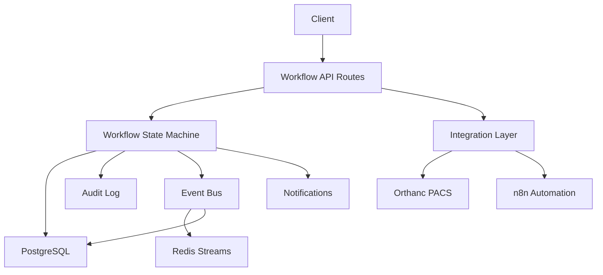
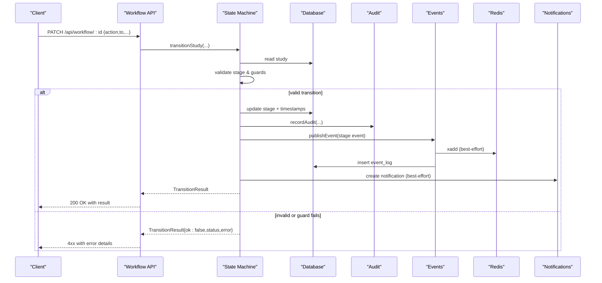
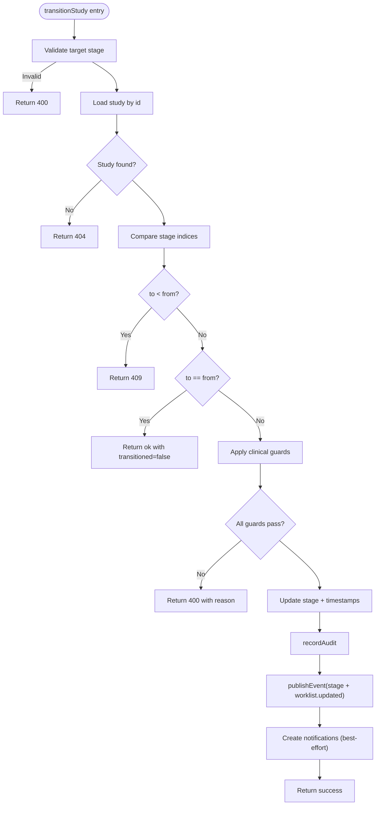
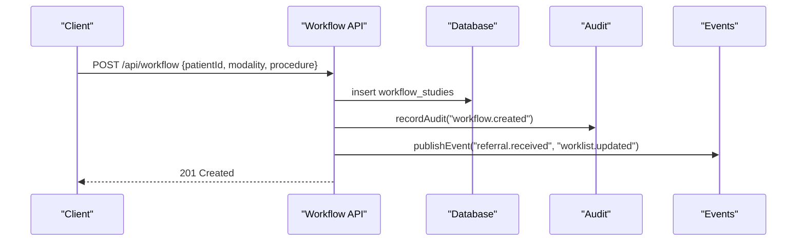
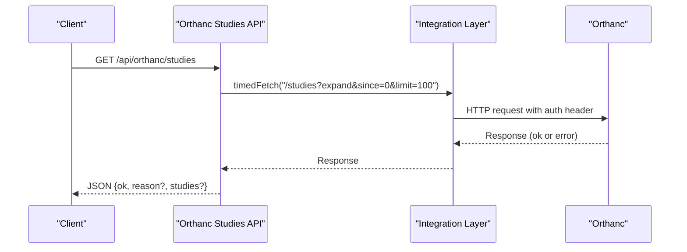
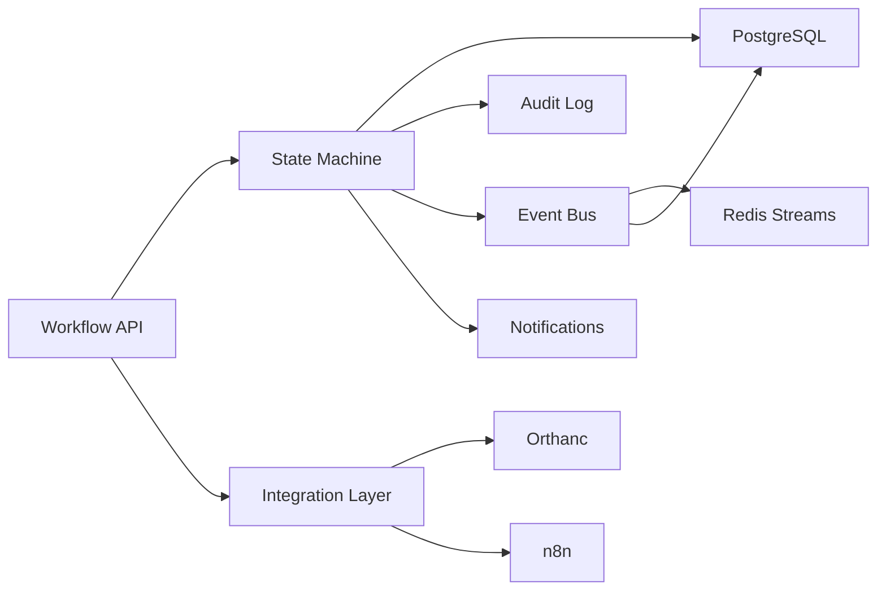

# Workflow Exception Handling

<cite>
**Referenced Files in This Document**
- [workflow.ts](file://src/lib/workflow.ts)
- [audit.ts](file://src/lib/audit.ts)
- [events.ts](file://src/lib/events.ts)
- [integrations/index.ts](file://src/lib/integrations/index.ts)
- [workflow route (POST)](file://src/app/api/workflow/route.ts)
- [workflow route (PATCH)](file://src/app/api/workflow/[id]/route.ts)
- [orthanc studies route](file://src/app/api/orthanc/studies/route.ts)
- [orthanc health route](file://src/app/orthanc/health/route.ts)
- [n8n trigger route](file://src/app/api/n8n/trigger/route.ts)
- [notifications route](file://src/app/api/notifications/route.ts)
- [schema.ts](file://src/db/schema.ts)
- [decision-engine.ts](file://src/lib/decision-engine.ts)
</cite>

## Table of Contents
1. Introduction
2. Project Structure
3. Core Components
4. Architecture Overview
5. Detailed Component Analysis
6. Dependency Analysis
7. Performance Considerations
8. Troubleshooting Guide
9. Conclusion

## Introduction
This document explains how the platform handles exceptions and recovers from failures during workflow operations. It covers failed transitions, invalid states, external service failures, retry behavior, rollback semantics, compensation actions, error propagation, notifications for critical failures, monitoring approaches, and audit logging strategies. It also includes concrete examples for common failure scenarios such as Orthanc connectivity issues, database constraint violations, and permission errors.

## Project Structure
The workflow exception handling spans several layers:
- API routes validate inputs, enforce state machine rules, and propagate errors with appropriate HTTP status codes.
- The workflow state machine enforces forward-only transitions and business invariants.
- External integrations use timeouts and health checks to fail fast and report status.
- Events and audit logs provide durable records even when side effects (Redis, notifications) fail.
- Notifications are created for clinically significant handoffs and operational risks.

**Diagram sources**
- [workflow route (POST):55-106](file://src/app/api/workflow/route.ts#L55-L106)
- [workflow route (PATCH):20-108](file://src/app/api/workflow/[id]/route.ts#L20-L108)
- [workflow.ts:102-234](file://src/lib/workflow.ts#L102-L234)
- [events.ts:101-131](file://src/lib/events.ts#L101-L131)
- [integrations/index.ts:72-78](file://src/lib/integrations/index.ts#L72-L78)
- [integrations/index.ts:134-266](file://src/lib/integrations/index.ts#L134-L266)

**Section sources**
- [workflow route (POST):55-106](file://src/app/api/workflow/route.ts#L55-L106)
- [workflow route (PATCH):20-108](file://src/app/api/workflow/[id]/route.ts#L20-L108)
- [workflow.ts:102-234](file://src/lib/workflow.ts#L102-L234)
- [events.ts:101-131](file://src/lib/events.ts#L101-L131)
- [integrations/index.ts:72-78](file://src/lib/integrations/index.ts#L72-L78)
- [integrations/index.ts:134-266](file://src/lib/integrations/index.ts#L134-L266)

## Core Components
- Workflow state machine: validates transitions, enforces forward-only movement, and applies clinical guards before updating state.
- Integration layer: provides timed HTTP calls and health checks for external services like Orthanc, n8n, Keycloak, FHIR, MinIO, Redis.
- Event bus: publishes domain events to Redis Streams and persists them to a durable event_log table; best-effort on Redis.
- Audit logging: records every transition and important action to an immutable audit_log table; non-fatal if write fails.
- Notifications: create in-app notifications for assignment and release milestones; failures do not block transitions.
- Decision engine: orchestrates AI-driven actions through approval gates and whitelisted executors, with audit and events.

**Section sources**
- [workflow.ts:102-234](file://src/lib/workflow.ts#L102-L234)
- [integrations/index.ts:72-78](file://src/lib/integrations/index.ts#L72-L78)
- [integrations/index.ts:134-266](file://src/lib/integrations/index.ts#L134-L266)
- [events.ts:101-131](file://src/lib/events.ts#L101-L131)
- [audit.ts:4-24](file://src/lib/audit.ts#L4-L24)
- [decision-engine.ts:212-235](file://src/lib/decision-engine.ts#L212-L235)

## Architecture Overview
The system uses a layered approach to resilience:
- Input validation and state enforcement at the API boundary.
- Business rule checks inside the state machine.
- Timeouts and structured error responses for external dependencies.
- Best-effort side effects (events, notifications) that never block core state changes.
- Durable persistence of audit and events for recovery and compliance.

**Diagram sources**
- [workflow route (PATCH):20-108](file://src/app/api/workflow/[id]/route.ts#L20-L108)
- [workflow.ts:102-234](file://src/lib/workflow.ts#L102-L234)
- [events.ts:101-131](file://src/lib/events.ts#L101-L131)

## Detailed Component Analysis

### Workflow State Machine Exception Handling
- Invalid target stage returns 400 with a descriptive message.
- Backward transitions return 409 Conflict.
- Missing required context (e.g., radiologistId for assigned/opened, studyInstanceUid for sent_to_orthanc) returns 400.
- Report signing/release/archiving requires prior signed state; otherwise returns 400.
- Successful transitions update timestamps, persist audit, publish events, and optionally create notifications. Notification failures are caught and ignored so they do not block state changes.

**Diagram sources**
- [workflow.ts:102-234](file://src/lib/workflow.ts#L102-L234)

**Section sources**
- [workflow.ts:102-234](file://src/lib/workflow.ts#L102-L234)

### API Error Propagation and Validation
- POST /api/workflow creates a study at referral; validates required fields and emits events and audit entries. Errors return 400 or 500.
- PATCH /api/workflow/:id supports:
  - Assignment flow with reassignment logic without rolling back stages.
  - Stage transitions via action/to or legacy stage field.
  - Plain field updates for allowed fields only.
  - All errors mapped to 400/404/500 with concise messages.

**Diagram sources**
- [workflow route (POST):55-106](file://src/app/api/workflow/route.ts#L55-L106)
- [events.ts:101-131](file://src/lib/events.ts#L101-L131)
- [audit.ts:4-24](file://src/lib/audit.ts#L4-L24)

**Section sources**
- [workflow route (POST):55-106](file://src/app/api/workflow/route.ts#L55-L106)
- [workflow route (PATCH):20-108](file://src/app/api/workflow/[id]/route.ts#L20-L108)

### External Service Failures and Recovery
- Orthanc integration uses timedFetch with configurable timeouts and returns structured responses indicating upstream HTTP status when unavailable. Health endpoint aggregates multiple Orthanc endpoints to provide a detailed snapshot.
- n8n trigger route forwards payloads with timeout and records upstream status in audit; unreachable returns 502.
- Integration health checks probe Keycloak, Orthanc, OHIF, Dicoogle, FHIR, n8n, LangGraph, MinIO, Redis and report connected/unreachable/not_configured with latency and detail.

**Diagram sources**
- [orthanc studies route:20-35](file://src/app/api/orthanc/studies/route.ts#L20-L35)
- [integrations/index.ts:72-78](file://src/lib/integrations/index.ts#L72-L78)
- [integrations/index.ts:125-132](file://src/lib/integrations/index.ts#L125-L132)

**Section sources**
- [orthanc studies route:20-35](file://src/app/api/orthanc/studies/route.ts#L20-L35)
- [orthanc health route:7-30](file://src/app/api/orthanc/health/route.ts#L7-L30)
- [n8n trigger route:8-46](file://src/app/api/n8n/trigger/route.ts#L8-L46)
- [integrations/index.ts:134-266](file://src/lib/integrations/index.ts#L134-L266)

### Retry Mechanisms and Timeouts
- HTTP requests use timedFetch with AbortSignal.timeout to prevent hanging calls.
- Redis client is lazy and back-offs after failures to avoid reconnect storms; event publishing falls back to durable event_log when Redis is down.
- No explicit exponential backoff or circuit breaker is implemented in the codebase; retries rely on application-level patterns or external systems.

**Section sources**
- [integrations/index.ts:72-78](file://src/lib/integrations/index.ts#L72-L78)
- [events.ts:72-99](file://src/lib/events.ts#L72-L99)
- [events.ts:101-131](file://src/lib/events.ts#L101-L131)

### Rollback Procedures and Compensation Actions
- Database transactions are not explicitly used around multi-step transitions; each step is a single statement. If a later step fails (e.g., audit or event), the state change already persisted remains committed.
- Compensation is achieved via:
  - Idempotent transitions: repeating the same transition is safe and returns transitioned=false when no change occurs.
  - Forward-only state machine prevents accidental backward moves.
  - Best-effort side effects (events, notifications) do not block core state changes.
  - Audit and event_log provide durable records for reconciliation.

**Section sources**
- [workflow.ts:102-234](file://src/lib/workflow.ts#L102-L234)
- [events.ts:101-131](file://src/lib/events.ts#L101-L131)
- [audit.ts:4-24](file://src/lib/audit.ts#L4-L24)

### Error Propagation Patterns
- API routes return standardized JSON with error messages and HTTP status codes:
  - 400 for invalid input or guard failures.
  - 404 for missing entities.
  - 409 for invalid state transitions.
  - 500 for unexpected server errors.
  - 502 for upstream service unreachability (e.g., n8n).
- Upstream HTTP statuses are preserved in responses where applicable (e.g., Orthanc).

**Section sources**
- [workflow route (PATCH):20-108](file://src/app/api/workflow/[id]/route.ts#L20-L108)
- [workflow route (POST):55-106](file://src/app/api/workflow/route.ts#L55-L106)
- [n8n trigger route:8-46](file://src/app/api/n8n/trigger/route.ts#L8-L46)
- [orthanc studies route:20-35](file://src/app/api/orthanc/studies/route.ts#L20-L35)

### Notification Systems for Critical Failures
- Notifications are created for assignment and release milestones; failures are caught and ignored to avoid blocking workflows.
- Operational risks are surfaced via command centre snapshots (e.g., offline equipment, low stock, pending reports).
- A dedicated notifications API allows creating alerts with severity and type.

**Section sources**
- [workflow.ts:206-231](file://src/lib/workflow.ts#L206-L231)
- [command-centre.ts:154-165](file://src/lib/command-centre.ts#L154-L165)
- [notifications route:35-56](file://src/app/api/notifications/route.ts#L35-L56)

### Monitoring Approaches for Bottlenecks
- Integration health checks measure latency and status for all configured services.
- Orthanc health endpoint aggregates system, jobs, metrics, plugins, modalities, peers for detailed diagnostics.
- Event counts and recent events can be queried to identify spikes or stalls.
- Command centre aggregates operational risks and bottlenecks across modules.

**Section sources**
- [integrations/index.ts:134-266](file://src/lib/integrations/index.ts#L134-L266)
- [orthanc health route:7-30](file://src/app/api/orthanc/health/route.ts#L7-L30)
- [events.ts:149-157](file://src/lib/events.ts#L149-L157)
- [command-centre.ts:154-165](file://src/lib/command-centre.ts#L154-L165)

### Common Failure Scenarios

#### Orthanc Connectivity Issues
- Symptoms: orthanc studies endpoint returns ok=false with reason indicating upstream HTTP status; health check shows unreachable with latency and detail.
- Behavior: timedFetch times out or receives non-OK response; API returns structured error; health endpoint aggregates multiple endpoints to pinpoint issues.
- Mitigation: configure correct URL and credentials; monitor health endpoint; use fallbacks and retries at higher layers.

**Section sources**
- [orthanc studies route:20-35](file://src/app/api/orthanc/studies/route.ts#L20-L35)
- [integrations/index.ts:152-164](file://src/lib/integrations/index.ts#L152-L164)
- [orthanc health route:7-30](file://src/app/api/orthanc/health/route.ts#L7-L30)

#### Database Constraint Violations
- Symptoms: API returns 500 when inserts/updates violate constraints (e.g., unique accession_number).
- Behavior: catch blocks log errors and return generic 500; audit/event writes are best-effort and do not mask DB errors.
- Mitigation: validate inputs before submission; handle 500 responses gracefully; inspect audit/event logs for context.

**Section sources**
- [workflow route (POST):55-106](file://src/app/api/workflow/route.ts#L55-L106)
- [workflow route (PATCH):20-108](file://src/app/api/workflow/[id]/route.ts#L20-L108)
- [schema.ts:103-119](file://src/db/schema.ts#L103-L119)

#### Permission Errors
- Symptoms: unauthorized access to protected endpoints; dev sign-in disabled when Keycloak is configured.
- Behavior: dev login redirects when Keycloak is configured; roles and permissions are stored and enforced elsewhere; audit entries capture auth events.
- Mitigation: ensure Keycloak is configured correctly; use proper authentication flows; verify role assignments.

**Section sources**
- [auth dev route:12-41](file://src/app/api/auth/dev/route.ts#L12-L41)
- [roles route:22-57](file://src/app/api/roles/route.ts#L22-L57)
- [audit.ts:4-24](file://src/lib/audit.ts#L4-L24)

### Audit Logging Strategy
- Every workflow transition and creation is recorded in audit_log with user, action, module, entity type/id, and details.
- Audit writes are best-effort; failures are logged but do not block the operation.
- Event_log captures domain events with payload and source for activity feeds and troubleshooting.

**Section sources**
- [workflow.ts:189-204](file://src/lib/workflow.ts#L189-L204)
- [audit.ts:4-24](file://src/lib/audit.ts#L4-L24)
- [events.ts:101-131](file://src/lib/events.ts#L101-L131)
- [schema.ts:182-193](file://src/db/schema.ts#L182-L193)
- [schema.ts:446-455](file://src/db/schema.ts#L446-L455)

## Dependency Analysis
The workflow depends on:
- Database for state persistence and constraints.
- Integration layer for external services with timeouts and health checks.
- Event bus for decoupled side effects and durable recording.
- Audit logging for compliance and troubleshooting.
- Notifications for user awareness.

**Diagram sources**
- [workflow route (POST):55-106](file://src/app/api/workflow/route.ts#L55-L106)
- [workflow route (PATCH):20-108](file://src/app/api/workflow/[id]/route.ts#L20-L108)
- [workflow.ts:102-234](file://src/lib/workflow.ts#L102-L234)
- [events.ts:101-131](file://src/lib/events.ts#L101-L131)
- [integrations/index.ts:134-266](file://src/lib/integrations/index.ts#L134-L266)

**Section sources**
- [workflow.ts:102-234](file://src/lib/workflow.ts#L102-L234)
- [events.ts:101-131](file://src/lib/events.ts#L101-L131)
- [integrations/index.ts:134-266](file://src/lib/integrations/index.ts#L134-L266)

## Performance Considerations
- Use timeouts to avoid long-running requests to external services.
- Prefer best-effort side effects (events, notifications) to keep core paths fast and resilient.
- Monitor integration latencies via health checks to detect degradation early.
- Avoid unnecessary retries; rely on idempotency and forward-only transitions.

[No sources needed since this section provides general guidance]

## Troubleshooting Guide
- Check integration health endpoints to determine service status and latency.
- Review audit_log for exact actions taken and context around failures.
- Inspect event_log for domain events and payloads to reconstruct sequences.
- For Orthanc issues, examine the health endpoint’s aggregated data to isolate problematic subsystems.
- For workflow transitions, verify current stage and required context (radiologistId, studyInstanceUid) before attempting moves.

**Section sources**
- [integrations/index.ts:134-266](file://src/lib/integrations/index.ts#L134-L266)
- [orthanc health route:7-30](file://src/app/api/orthanc/health/route.ts#L7-L30)
- [events.ts:133-157](file://src/lib/events.ts#L133-L157)
- [audit.ts:4-24](file://src/lib/audit.ts#L4-L24)

## Conclusion
The platform implements robust exception handling for workflow operations through strict state validation, clear error propagation, best-effort side effects, and durable audit/event records. External service failures are handled with timeouts and structured responses, while operational risks are surfaced via notifications and command centre insights. This design ensures resilience, observability, and compliance without compromising core workflow integrity.

[No sources needed since this section summarizes without analyzing specific files]