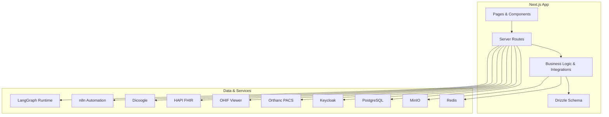
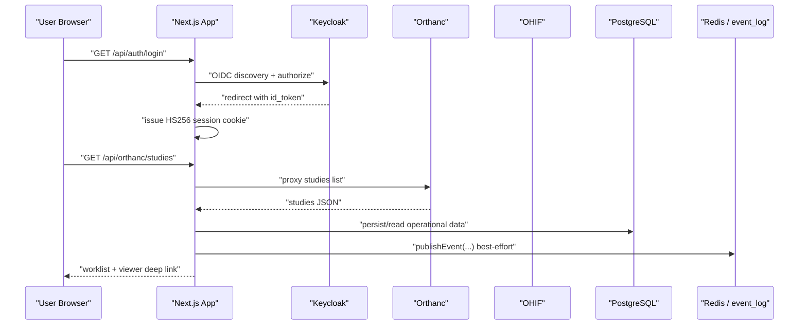
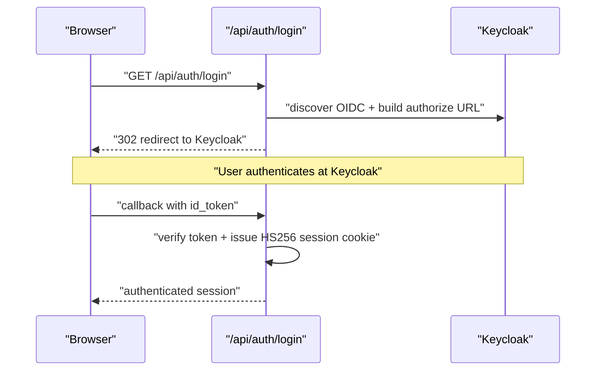
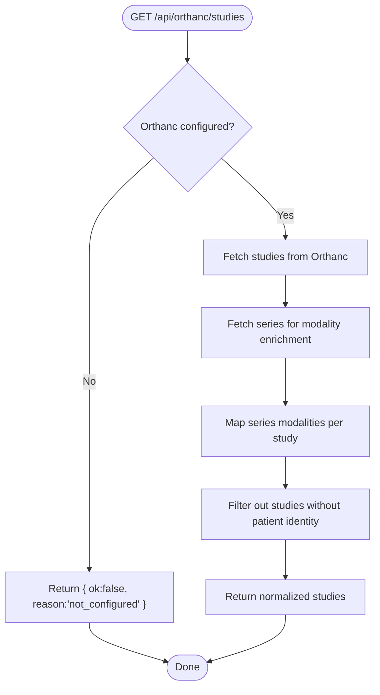
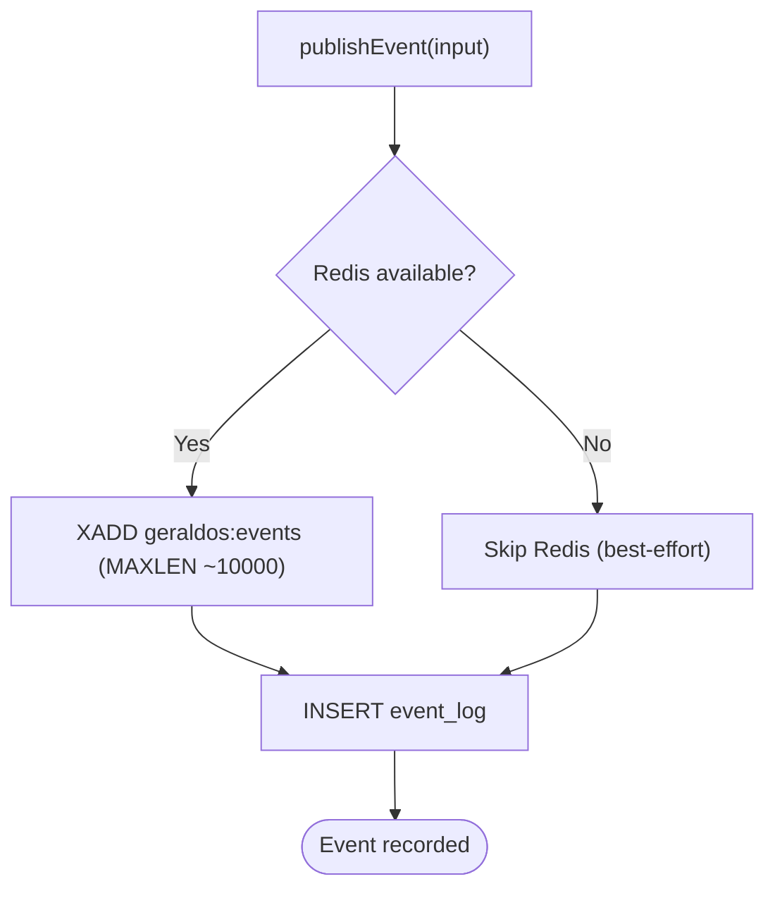
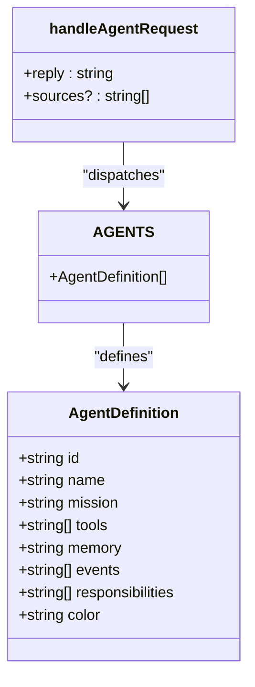
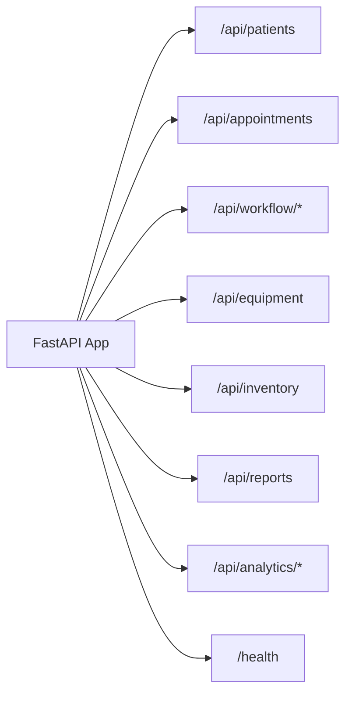
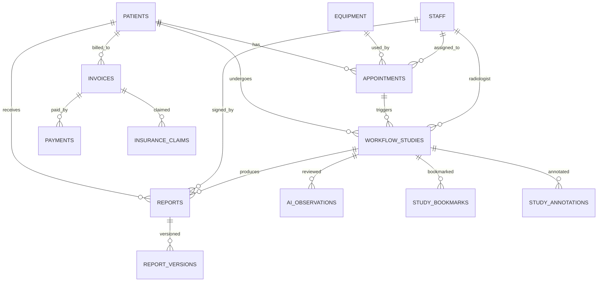
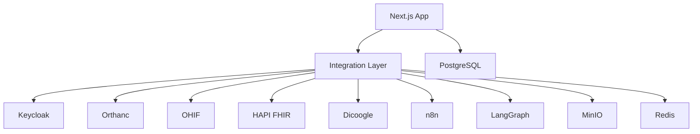

# Overall Architecture

<cite>
**Referenced Files in This Document**
- [README.md](file://README.md)
- [docker-compose.yml](file://docker-compose.yml)
- [package.json](file://package.json)
- [next.config.ts](file://next.config.ts)
- [src/app/layout.tsx](file://src/app/layout.tsx)
- [src/db/schema.ts](file://src/db/schema.ts)
- [src/lib/integrations/index.ts](file://src/lib/integrations/index.ts)
- [src/lib/events.ts](file://src/lib/events.ts)
- [src/lib/agents.ts](file://src/lib/agents.ts)
- [src/app/api/auth/login/route.ts](file://src/app/api/auth/login/route.ts)
- [src/app/api/orthanc/studies/route.ts](file://src/app/api/orthanc/studies/route.ts)
- [src/app/api/events/route.ts](file://src/app/api/events/route.ts)
- [backend/app/main.py](file://backend/app/main.py)
- [backend/app/core/config.py](file://backend/app/core/config.py)
- [services/langgraph_agent.py](file://services/langgraph_agent.py)
</cite>

## Table of Contents
1. Introduction
2. Project Structure
3. Core Components
4. Architecture Overview
5. Detailed Component Analysis
6. Dependency Analysis
7. Performance Considerations
8. Troubleshooting Guide
9. Conclusion

## Introduction
GeraldOS is an AI-native diagnostic imaging operations platform that orchestrates healthcare workflows above the imaging stack. It centralizes patient management, scheduling, clinical workflow, equipment and inventory, reporting, finance, knowledge, and AI-assisted review while delegating specialized tasks to external services: Orthanc for DICOM storage, OHIF/Weasis for viewers, Keycloak for identity, HAPI FHIR for interoperability, n8n for automation, LangGraph for agent orchestration, MinIO for object storage, and Redis for event streaming and caching. The system is a modular monolith built on Next.js with server-side API routes, shared business logic libraries, and a PostgreSQL database defined via Drizzle ORM.

## Project Structure
The repository organizes code into clear layers:
- Frontend UI pages and components under src/app and src/components
- Server-side API routes under src/app/api
- Shared business logic and integrations under src/lib
- Database schema definitions under src/db
- A secondary FastAPI backend module under backend/app
- Infrastructure configuration via docker-compose.yml and environment-driven settings
- External service contracts documented in README.md

**Diagram sources**
- [docker-compose.yml:4-110](file://docker-compose.yml#L4-L110)
- [src/app/layout.tsx:13-22](file://src/app/layout.tsx#L13-L22)
- [src/lib/integrations/index.ts:8-52](file://src/lib/integrations/index.ts#L8-L52)

**Section sources**
- [README.md:9-23](file://README.md#L9-L23)
- [docker-compose.yml:4-110](file://docker-compose.yml#L4-L110)
- [package.json:14-46](file://package.json#L14-L46)
- [next.config.ts:1-6](file://next.config.ts#L1-L6)
- [src/app/layout.tsx:13-22](file://src/app/layout.tsx#L13-L22)

## Core Components
- Identity and session management via Keycloak OIDC with HS256 session cookies and degraded local dev mode when Keycloak is unavailable.
- Imaging integration layer proxying Orthanc (PACS/DICOMweb), OHIF viewer deep links, Dicoogle search, and HAPI FHIR read/search.
- Event-driven architecture using Redis Streams with durable fallback to PostgreSQL event_log for audit and activity feed.
- Specialized agents (reception, scheduling, workflow, reporting, equipment, inventory, quality, executive, knowledge) with mission, tools, memory, events, and responsibilities; all outputs are decision support only.
- Reporting assistant and multi-modal AI review surfaces candidate observations and recommendations without auto-finalizing reports or issuing diagnoses.
- Finance and administration modules including tariffs, invoices, payments, insurance claims, expenses, branches, staff, roles, and system settings.

**Section sources**
- [README.md:66-121](file://README.md#L66-L121)
- [src/lib/agents.ts:1-177](file://src/lib/agents.ts#L1-L177)
- [src/lib/events.ts:1-158](file://src/lib/events.ts#L1-L158)
- [src/db/schema.ts:167-468](file://src/db/schema.ts#L167-L468)

## Architecture Overview
GeraldOS sits above the imaging stack and coordinates cross-functional operations through a Next.js application. The frontend renders pages and invokes server routes. Server routes enforce authentication, call business logic, and integrate with external services. Data persists to PostgreSQL, with optional Redis-backed event streams and MinIO for object storage.

**Diagram sources**
- [src/app/api/auth/login/route.ts:7-30](file://src/app/api/auth/login/route.ts#L7-L30)
- [src/app/api/orthanc/studies/route.ts:20-85](file://src/app/api/orthanc/studies/route.ts#L20-L85)
- [src/lib/events.ts:101-131](file://src/lib/events.ts#L101-L131)
- [docker-compose.yml:57-110](file://docker-compose.yml#L57-L110)

## Detailed Component Analysis

### Authentication and Session Flow
- Login initiates OIDC flow to Keycloak, sets a secure state cookie, and redirects to the authorization endpoint.
- On callback, the platform verifies tokens and issues an HS256 session cookie with realm roles.
- When Keycloak is not configured, a degraded mode allows local admin sessions for development.

**Diagram sources**
- [src/app/api/auth/login/route.ts:7-30](file://src/app/api/auth/login/route.ts#L7-L30)
- [README.md:66-72](file://README.md#L66-L72)

**Section sources**
- [src/app/api/auth/login/route.ts:1-31](file://src/app/api/auth/login/route.ts#L1-L31)
- [README.md:66-72](file://README.md#L66-L72)

### Imaging Worklist and PACS Proxy
- The worklist route proxies Orthanc to fetch studies and series, enriches modalities from series metadata, filters unknown patients, and returns a normalized payload.
- Integration health checks validate connectivity and latency for Orthanc and other services.

**Diagram sources**
- [src/app/api/orthanc/studies/route.ts:20-85](file://src/app/api/orthanc/studies/route.ts#L20-L85)
- [src/lib/integrations/index.ts:125-164](file://src/lib/integrations/index.ts#L125-L164)

**Section sources**
- [src/app/api/orthanc/studies/route.ts:1-86](file://src/app/api/orthanc/studies/route.ts#L1-L86)
- [src/lib/integrations/index.ts:8-52](file://src/lib/integrations/index.ts#L8-L52)

### Event Bus and Activity Feed
- publishEvent writes to Redis Streams (capped) and always persists to PostgreSQL event_log for durability.
- Consumers can query recent events or counts by type for the command centre activity feed.

**Diagram sources**
- [src/lib/events.ts:101-131](file://src/lib/events.ts#L101-L131)

**Section sources**
- [src/lib/events.ts:1-158](file://src/lib/events.ts#L1-L158)
- [src/app/api/events/route.ts:1-38](file://src/app/api/events/route.ts#L1-L38)

### Specialized Agents and Decision Engine
- Nine agents define missions, tools, memory, events, and responsibilities; they provide decision support only.
- Agent requests dispatch to the appropriate agent brain; when LangGraph is unreachable, a live-data simulation reads PostgreSQL state.
- Every AI action flows recommendation → business rules → validation → approval → execution → audit.

**Diagram sources**
- [src/lib/agents.ts:30-177](file://src/lib/agents.ts#L30-L177)
- [src/lib/agents.ts:216-374](file://src/lib/agents.ts#L216-L374)

**Section sources**
- [src/lib/agents.ts:1-374](file://src/lib/agents.ts#L1-L374)
- [services/langgraph_agent.py:1-35](file://services/langgraph_agent.py#L1-L35)
- [README.md:91-109](file://README.md#L91-L109)

### Backend Module (FastAPI)
- A separate FastAPI module exposes endpoints for reception, scheduling, workflow, equipment, inventory, reporting, and analytics.
- Configuration is loaded from environment variables; CORS middleware is enabled; health check provided.

**Diagram sources**
- [backend/app/main.py:11-325](file://backend/app/main.py#L11-L325)
- [backend/app/core/config.py:1-20](file://backend/app/core/config.py#L1-L20)

**Section sources**
- [backend/app/main.py:1-325](file://backend/app/main.py#L1-L325)
- [backend/app/core/config.py:1-20](file://backend/app/core/config.py#L1-L20)

### Data Model and Persistence
- Drizzle schema defines entities across patient, referral, scheduling, workflow, equipment, inventory, reporting, finance, administration, AI review, knowledge, bookmarks, annotations, events, and notifications.
- Relationships include foreign keys between appointments, studies, reports, invoices, and related entities.

**Diagram sources**
- [src/db/schema.ts:17-468](file://src/db/schema.ts#L17-L468)

**Section sources**
- [src/db/schema.ts:1-468](file://src/db/schema.ts#L1-L468)

## Dependency Analysis
- Next.js app depends on environment-configured integrations (Keycloak, Orthanc, OHIF, Dicoogle, FHIR, n8n, LangGraph, MinIO, Redis).
- API routes depend on business logic libraries for events, agents, and integrations.
- Docker Compose defines service dependencies and health checks ensuring proper startup order.

**Diagram sources**
- [src/lib/integrations/index.ts:8-52](file://src/lib/integrations/index.ts#L8-L52)
- [docker-compose.yml:4-110](file://docker-compose.yml#L4-L110)

**Section sources**
- [src/lib/integrations/index.ts:8-267](file://src/lib/integrations/index.ts#L8-L267)
- [docker-compose.yml:4-110](file://docker-compose.yml#L4-L110)

## Performance Considerations
- Use Redis Streams for high-throughput event publishing with capped length to prevent unbounded growth; fall back to PostgreSQL event_log for durability.
- Apply timeouts to outbound HTTP calls to avoid blocking request cycles during upstream latency spikes.
- Prefer server-side proxies for sensitive integrations (e.g., Orthanc) to keep credentials off the browser and reduce client-side overhead.
- Leverage PostgreSQL indexes on frequently queried columns (e.g., status, timestamps) to optimize worklist and analytics queries.
- Scale horizontally by running multiple Next.js instances behind a load balancer; ensure shared state (Redis, PostgreSQL, MinIO) is externally managed.

[No sources needed since this section provides general guidance]

## Troubleshooting Guide
- Health checks:
  - Platform health: GET /api/health
  - Integration health: GET /api/integrations/status
- Common issues:
  - Keycloak not configured: login redirects to error page; use dev mode for local sessions.
  - Orthanc unreachable: worklist returns not_configured or upstream errors; verify credentials and network.
  - Redis down: events still persist to event_log; activity feed remains functional.
  - LangGraph unreachable: agent chat falls back to live-data simulation reading PostgreSQL state.
- Diagnostics:
  - Review event_log entries for failed operations and timestamps.
  - Inspect integration health details for latency and error messages.

**Section sources**
- [README.md:64-89](file://README.md#L64-L89)
- [src/lib/events.ts:101-131](file://src/lib/events.ts#L101-L131)
- [src/lib/integrations/index.ts:134-267](file://src/lib/integrations/index.ts#L134-L267)

## Conclusion
GeraldOS provides a comprehensive, modular monolith architecture that orchestrates healthcare operations above the imaging stack. It separates concerns across frontend UI, server routes, business logic, and external integrations while maintaining robust data persistence and event-driven communication. The design supports scalability through horizontal scaling of the Next.js layer and resilient integration patterns with health checks and fallbacks. Deployment is containerized with Docker Compose, enabling consistent environments and clear infrastructure requirements for production readiness.

[No sources needed since this section summarizes without analyzing specific files]