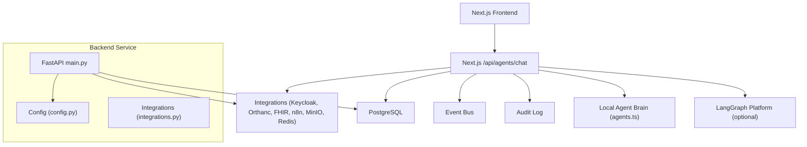
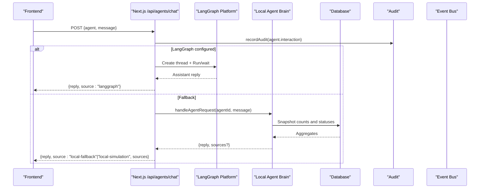
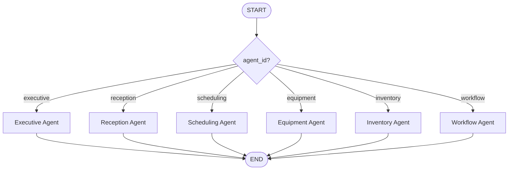
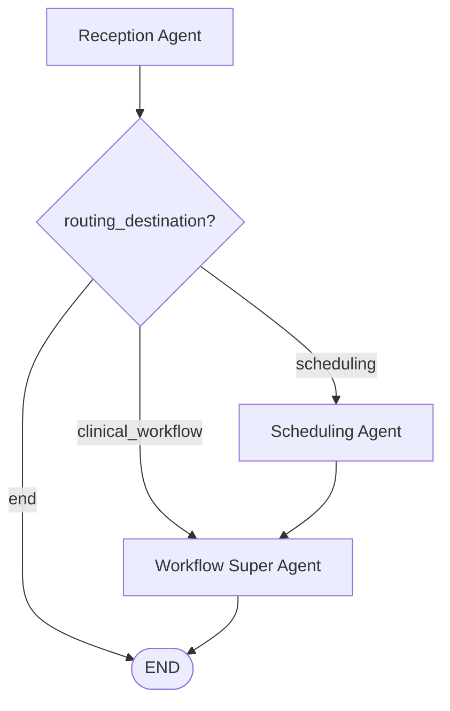
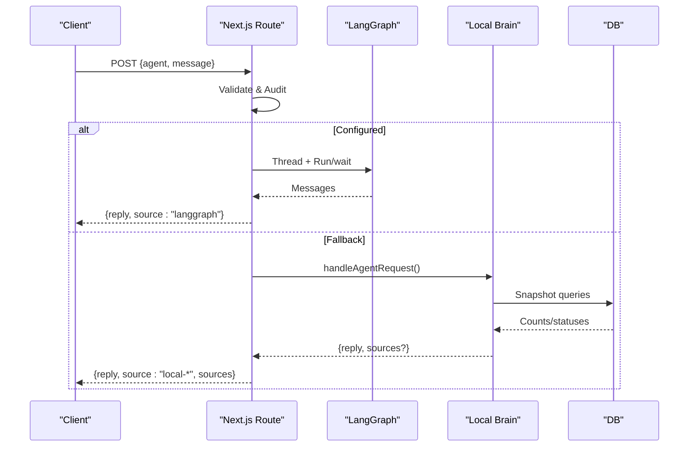
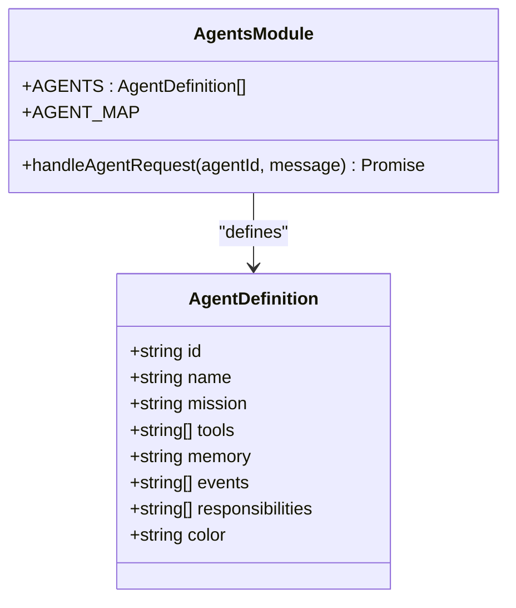
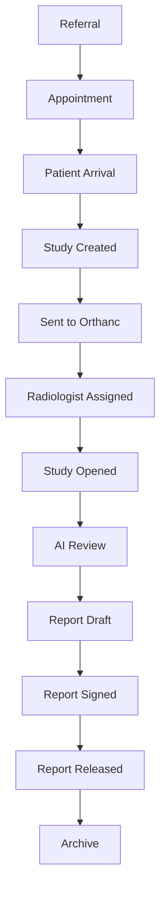
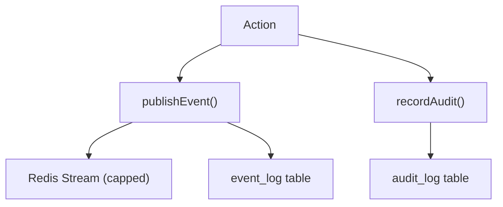
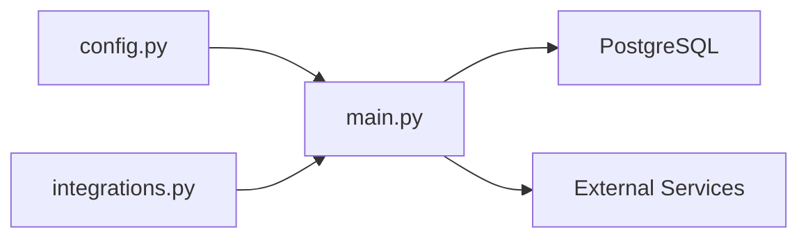
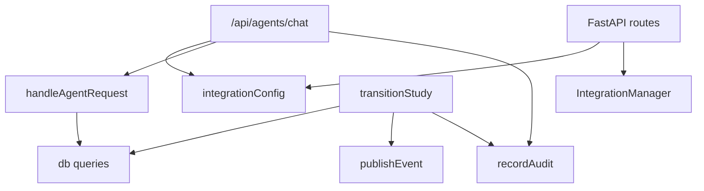

# AI Runtime Integration (LangGraph)

<cite>
**Referenced Files in This Document**
- [langgraph_agent.py](file://services/langgraph_agent.py)
- [orchestration.py](file://backend/app/agents/orchestration.py)
- [main.py](file://backend/app/main.py)
- [config.py](file://backend/app/core/config.py)
- [integrations.py](file://backend/app/core/integrations.py)
- [route.ts](file://src/app/api/agents/chat/route.ts)
- [agents.ts](file://src/lib/agents.ts)
- [index.ts](file://src/lib/integrations/index.ts)
- [workflow.ts](file://src/lib/workflow.ts)
- [events.ts](file://src/lib/events.ts)
- [audit.ts](file://src/lib/audit.ts)
- [ai-review.ts](file://src/lib/ai-review.ts)
</cite>

## Table of Contents
1. [Introduction](#introduction)
2. [Project Structure](#project-structure)
3. [Core Components](#core-components)
4. [Architecture Overview](#architecture-overview)
5. [Detailed Component Analysis](#detailed-component-analysis)
6. [Dependency Analysis](#dependency-analysis)
7. [Performance Considerations](#performance-considerations)
8. [Troubleshooting Guide](#troubleshooting-guide)
9. [Conclusion](#conclusion)
10. [Appendices](#appendices)

## Introduction
This document explains the LangGraph-based multi-agent runtime integration for GeraldOS, covering agent roles, communication patterns, state management, decision orchestration, and the Python backend service that manages agent lifecycles. It also documents the Next.js frontend integration, including how agents are invoked, how conversations flow, and how results are processed. Scalability, error handling, and monitoring considerations are included to support production operations.

## Project Structure
The system is composed of:
- A FastAPI backend exposing operational APIs and a health endpoint.
- A LangGraph graph definition for routing messages to specialized agents.
- A Next.js API route that orchestrates calls to an external LangGraph runtime with a local fallback brain.
- Shared libraries for workflow state transitions, event publishing, audit logging, and integration health checks.

**Diagram sources**
- [route.ts:1-85](file://src/app/api/agents/chat/route.ts#L1-L85)
- [agents.ts:1-374](file://src/lib/agents.ts#L1-L374)
- [main.py:1-325](file://backend/app/main.py#L1-L325)
- [config.py:1-20](file://backend/app/core/config.py#L1-L20)
- [integrations.py:1-119](file://backend/app/core/integrations.py#L1-L119)

**Section sources**
- [main.py:1-325](file://backend/app/main.py#L1-L325)
- [config.py:1-20](file://backend/app/core/config.py#L1-L20)
- [integrations.py:1-119](file://backend/app/core/integrations.py#L1-L119)
- [route.ts:1-85](file://src/app/api/agents/chat/route.ts#L1-L85)
- [agents.ts:1-374](file://src/lib/agents.ts#L1-L374)

## Core Components
- Multi-agent graph definitions:
  - Lightweight LangGraph graph for message routing to named agents.
  - Orchestration graph modeling reception → scheduling → clinical workflow handoff.
- Next.js chat API:
  - Attempts live LangGraph execution when configured; falls back to a local simulation brain.
  - Audits interactions and returns structured responses with source metadata.
- Local agent brain:
  - Defines nine specialized agents (reception, scheduling, workflow, reporting, equipment, inventory, quality, executive, knowledge).
  - Provides rich context snapshots from the database and deterministic responses.
- Workflow state machine:
  - Enforces forward-only stage transitions, audits changes, publishes events, and triggers notifications.
- Event bus and audit:
  - Publishes domain events to Redis Streams and persists durable records.
  - Records immutable audit entries for compliance and traceability.
- Integrations:
  - Centralized configuration and health checks for Keycloak, Orthanc, OHIF, Dicoogle, FHIR, n8n, MinIO, Redis, and LangGraph.

**Section sources**
- [langgraph_agent.py:1-35](file://services/langgraph_agent.py#L1-L35)
- [orchestration.py:1-134](file://backend/app/agents/orchestration.py#L1-L134)
- [route.ts:1-85](file://src/app/api/agents/chat/route.ts#L1-L85)
- [agents.ts:1-374](file://src/lib/agents.ts#L1-L374)
- [workflow.ts:1-246](file://src/lib/workflow.ts#L1-L246)
- [events.ts:1-158](file://src/lib/events.ts#L1-L158)
- [audit.ts:1-25](file://src/lib/audit.ts#L1-L25)
- [index.ts:1-267](file://src/lib/integrations/index.ts#L1-L267)

## Architecture Overview
The runtime supports two modes:
- Live mode: The Next.js API creates a thread on the LangGraph Platform and waits for a run result. If successful, the response is returned with source “langgraph”.
- Fallback mode: If LangGraph is not configured or fails, the request is handled by the local agent brain, which queries the database and returns decision-support text with optional sources.

**Diagram sources**
- [route.ts:8-84](file://src/app/api/agents/chat/route.ts#L8-L84)
- [agents.ts:181-374](file://src/lib/agents.ts#L181-L374)
- [index.ts:37-52](file://src/lib/integrations/index.ts#L37-L52)

## Detailed Component Analysis

### LangGraph Graphs
- Message router graph:
  - State includes messages and agent_id.
  - Routes to one of six agents based on agent_id; defaults to executive if unknown.
  - Each agent replies with a standardized assistant message.
- Orchestration workflow:
  - Entry point is reception; extracts entities and sets routing_destination.
  - Conditional edges route to scheduling or end; scheduling proceeds to workflow_super then END.
  - Each node appends logs and returns updated state fragments.

**Diagram sources**
- [langgraph_agent.py:7-34](file://services/langgraph_agent.py#L7-L34)

**Diagram sources**
- [orchestration.py:19-133](file://backend/app/agents/orchestration.py#L19-L133)

**Section sources**
- [langgraph_agent.py:1-35](file://services/langgraph_agent.py#L1-L35)
- [orchestration.py:1-134](file://backend/app/agents/orchestration.py#L1-L134)

### Next.js Chat API and Agent Invocation
- Validates input and agent identity.
- Audits the interaction.
- Tries live LangGraph execution with timeouts; on failure, falls back to local brain.
- Returns structured JSON with agent name, mission, reply, sources, and source indicator.

**Diagram sources**
- [route.ts:8-84](file://src/app/api/agents/chat/route.ts#L8-L84)
- [agents.ts:181-374](file://src/lib/agents.ts#L181-L374)

**Section sources**
- [route.ts:1-85](file://src/app/api/agents/chat/route.ts#L1-L85)
- [agents.ts:1-374](file://src/lib/agents.ts#L1-L374)

### Agent Definitions and Decision Support
- Nine agents define missions, tools, memory scope, events, responsibilities, and color coding.
- The local brain provides rich context via snapshot queries and returns decision-support text only; no direct writes are executed by agents.
- Knowledge agent performs tokenized search over approved documents and returns matching references.

**Diagram sources**
- [agents.ts:25-179](file://src/lib/agents.ts#L25-L179)
- [agents.ts:181-374](file://src/lib/agents.ts#L181-L374)

**Section sources**
- [agents.ts:1-374](file://src/lib/agents.ts#L1-L374)

### Workflow State Machine
- Enforces forward-only transitions with guards for critical stages (Orthanc submission, radiologist assignment, report signing/release/archiving).
- Updates timestamps at milestones, persists transitions, publishes events, and emits notifications.

**Diagram sources**
- [workflow.ts:38-51](file://src/lib/workflow.ts#L38-L51)

**Section sources**
- [workflow.ts:1-246](file://src/lib/workflow.ts#L1-L246)

### Event Bus and Audit
- Events are published to Redis Streams (best-effort) and persisted to the event_log table.
- Audit entries are recorded for agent interactions and workflow transitions.

**Diagram sources**
- [events.ts:101-131](file://src/lib/events.ts#L101-L131)
- [audit.ts:4-24](file://src/lib/audit.ts#L4-L24)

**Section sources**
- [events.ts:1-158](file://src/lib/events.ts#L1-L158)
- [audit.ts:1-25](file://src/lib/audit.ts#L1-L25)

### Backend Service and Integrations
- FastAPI exposes endpoints for patients, appointments, workflow runs, equipment, inventory, reports, analytics summary, and health.
- Configuration centralizes environment variables for databases, storage, and third-party services.
- Integration manager handles token verification, PACS-to-FHIR sync, n8n webhooks, and MinIO uploads.

**Diagram sources**
- [config.py:1-20](file://backend/app/core/config.py#L1-L20)
- [main.py:1-325](file://backend/app/main.py#L1-L325)
- [integrations.py:1-119](file://backend/app/core/integrations.py#L1-L119)

**Section sources**
- [main.py:1-325](file://backend/app/main.py#L1-L325)
- [config.py:1-20](file://backend/app/core/config.py#L1-L20)
- [integrations.py:1-119](file://backend/app/core/integrations.py#L1-L119)

### AI Review Assistant
- Provides modality-specific technical checklists and candidate observation generation for decision support.
- Observations include confidence scores, suggested differentials, literature references, and similar case IDs.
- All outputs are advisory; radiologists accept/reject candidates and maintain full control.

**Section sources**
- [ai-review.ts:1-221](file://src/lib/ai-review.ts#L1-L221)

## Dependency Analysis
- Next.js chat route depends on:
  - Integration configuration to determine LangGraph availability.
  - Local agent brain for fallback logic and rich context.
  - Audit module for compliance logging.
- Local agent brain depends on:
  - Database schema for counts and status queries.
  - Optional knowledge base search for approved documents.
- Workflow transitions depend on:
  - Database schema for studies and reports.
  - Event bus for downstream reactions.
  - Audit module for transition records.
- Backend service depends on:
  - Configuration for service URLs and credentials.
  - Integration manager for external service interactions.

**Diagram sources**
- [route.ts:1-85](file://src/app/api/agents/chat/route.ts#L1-L85)
- [agents.ts:181-374](file://src/lib/agents.ts#L181-L374)
- [workflow.ts:102-234](file://src/lib/workflow.ts#L102-L234)
- [events.ts:101-131](file://src/lib/events.ts#L101-L131)
- [main.py:1-325](file://backend/app/main.py#L1-L325)
- [integrations.py:1-119](file://backend/app/core/integrations.py#L1-L119)

**Section sources**
- [route.ts:1-85](file://src/app/api/agents/chat/route.ts#L1-L85)
- [agents.ts:181-374](file://src/lib/agents.ts#L181-L374)
- [workflow.ts:102-234](file://src/lib/workflow.ts#L102-L234)
- [events.ts:101-131](file://src/lib/events.ts#L101-L131)
- [main.py:1-325](file://backend/app/main.py#L1-L325)
- [integrations.py:1-119](file://backend/app/core/integrations.py#L1-L119)

## Performance Considerations
- Timeouts and retries:
  - LangGraph thread creation and run/wait use explicit timeouts to avoid hanging requests.
  - Integration health checks use timed fetches to measure latency and detect unreachable services.
- Database efficiency:
  - Local agent brain aggregates counts and low-stock/equipment status in minimal queries to reduce load.
- Event bus resilience:
  - Redis Streams writes are best-effort; durable persistence ensures no loss of events even if Redis is down.
- Concurrency:
  - Next.js dynamic API routes allow concurrent requests; ensure upstream services (LangGraph, DB, integrations) scale horizontally.
- Caching:
  - Consider caching frequent read-only snapshots (e.g., dashboard summaries) using Redis where appropriate.

[No sources needed since this section provides general guidance]

## Troubleshooting Guide
- Agent chat returns errors:
  - Validate payload fields (agent, message).
  - Check LangGraph configuration; if unavailable, verify fallback behavior and local brain responses.
  - Inspect audit logs for recorded interactions.
- Workflow transitions fail:
  - Ensure required prerequisites (e.g., studyInstanceUid for Orthanc submission, radiologist assignment for assigned/opened).
  - Confirm report status before releasing or archiving.
  - Review event log and audit entries for transition attempts.
- Integration health:
  - Use integration health checks to identify unreachable services (Keycloak, Orthanc, FHIR, n8n, MinIO, Redis, LangGraph).
  - Verify environment variables and network connectivity.

**Section sources**
- [route.ts:40-84](file://src/app/api/agents/chat/route.ts#L40-L84)
- [workflow.ts:102-165](file://src/lib/workflow.ts#L102-L165)
- [events.ts:101-131](file://src/lib/events.ts#L101-L131)
- [index.ts:134-267](file://src/lib/integrations/index.ts#L134-L267)

## Conclusion
The LangGraph-based multi-agent runtime integrates seamlessly with GeraldOS’s operational modules. The design emphasizes decision support, strict workflow governance, robust auditing, and resilient integrations. When LangGraph is available, it orchestrates specialized agents; otherwise, the platform gracefully falls back to a local brain that provides actionable insights grounded in live data. This architecture supports scalability through modular components, event-driven decoupling, and clear separation of concerns across frontend, backend, and external services.

[No sources needed since this section summarizes without analyzing specific files]

## Appendices

### Example: Invoking an Agent
- Send a POST to /api/agents/chat with agent identifier and message.
- The API will attempt live LangGraph execution if configured; otherwise, it uses the local brain.
- Responses include agent name, mission, reply text, optional sources, and source indicator.

**Section sources**
- [route.ts:39-84](file://src/app/api/agents/chat/route.ts#L39-L84)
- [agents.ts:216-374](file://src/lib/agents.ts#L216-L374)

### Example: Conversation Flow
- User selects an agent and sends a message.
- The API records an audit entry, tries LangGraph, and returns either live or simulated output.
- The frontend displays messages with source badges indicating runtime mode.

**Section sources**
- [route.ts:8-84](file://src/app/api/agents/chat/route.ts#L8-L84)
- [index.ts:54-69](file://src/lib/integrations/index.ts#L54-L69)

### Example: Result Processing
- For knowledge queries, sources list matching approved documents with versions.
- For other agents, replies summarize current operational state and propose decisions for human approval.

**Section sources**
- [agents.ts:321-363](file://src/lib/agents.ts#L321-L363)