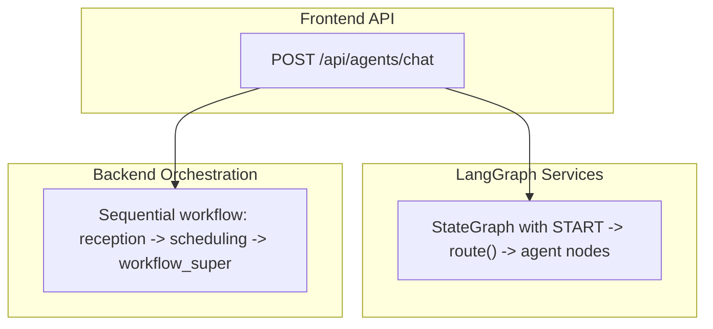
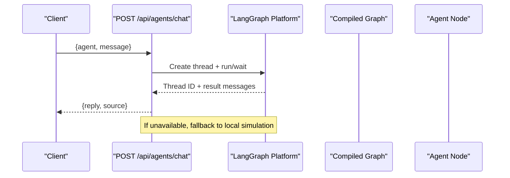
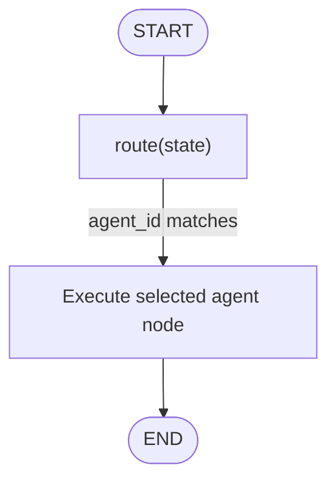
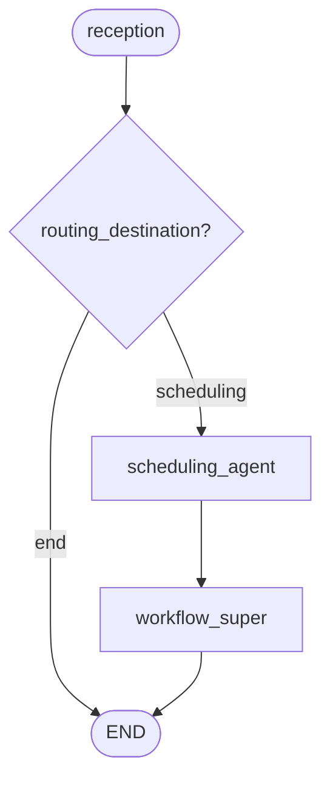
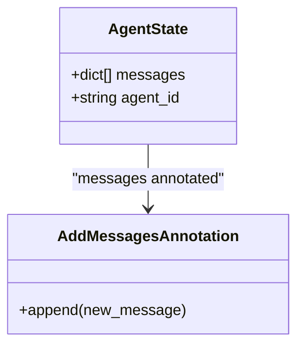
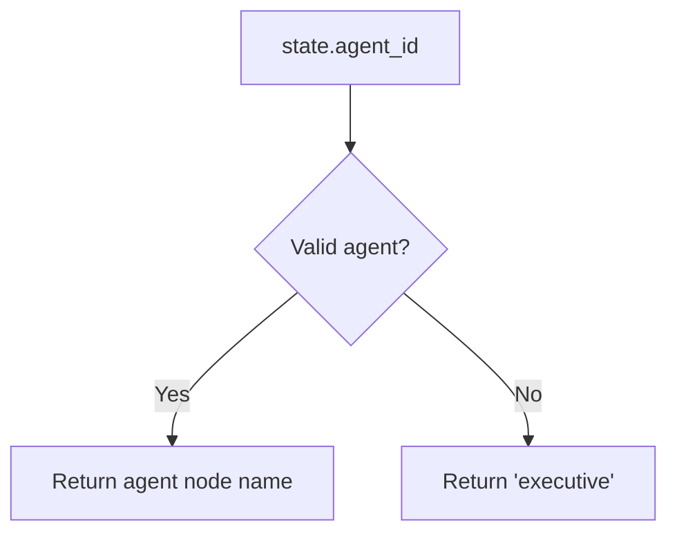
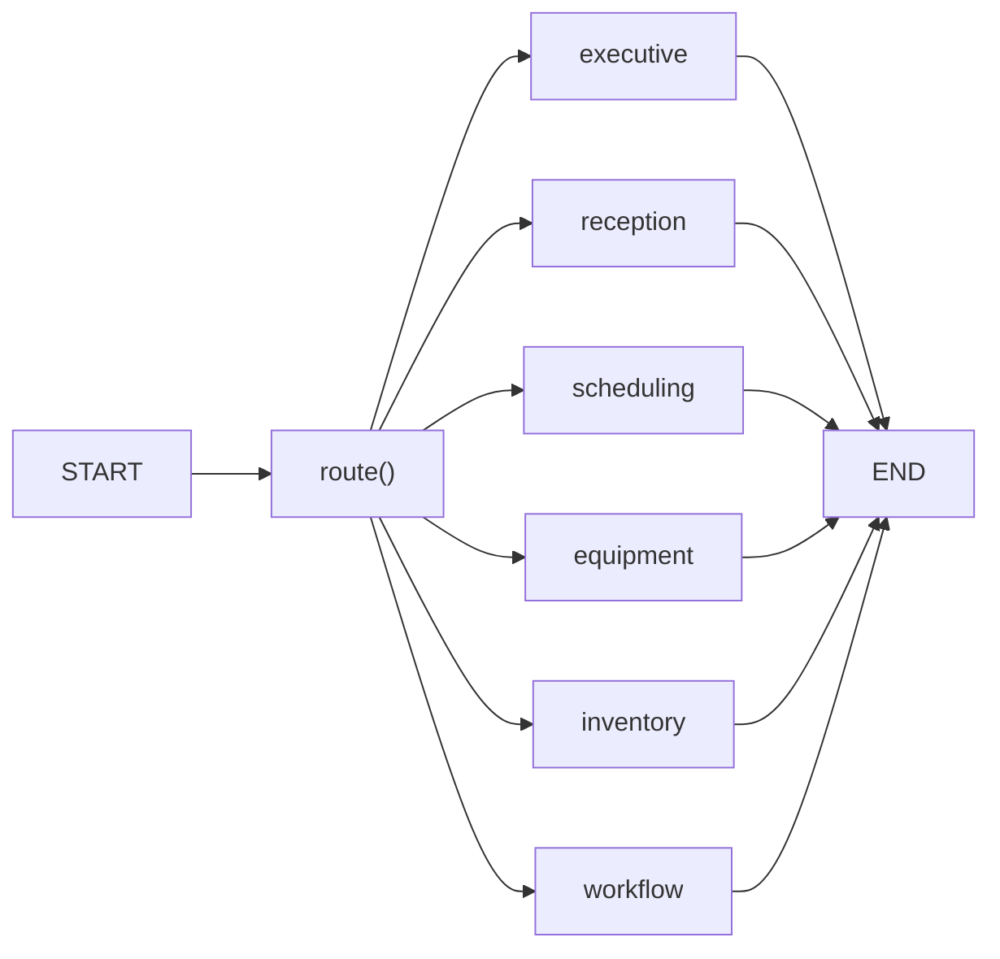
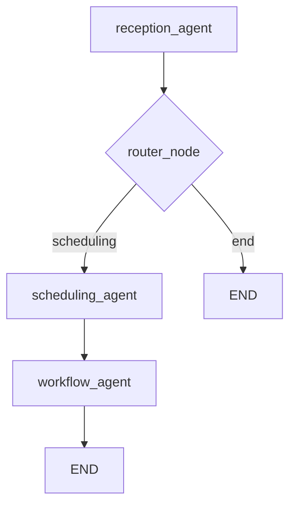
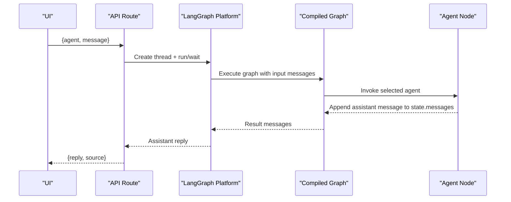
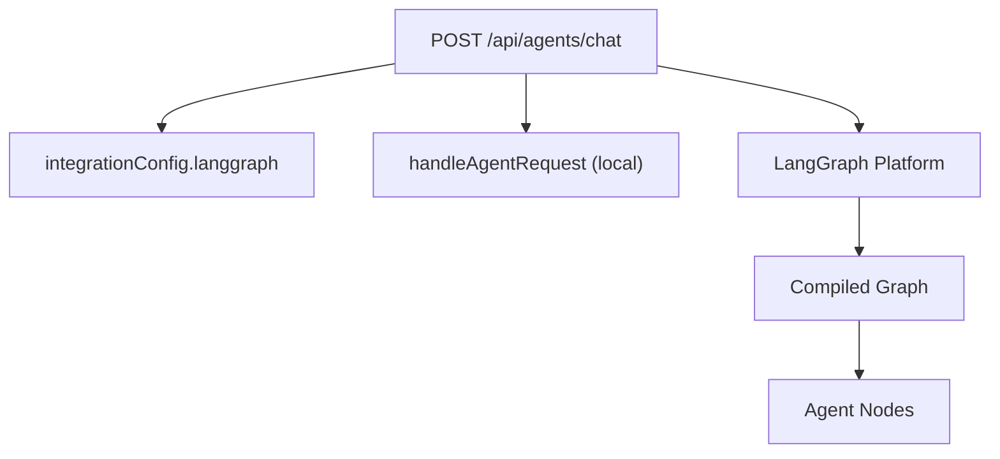

# Agent Architecture & State Management

<cite>
**Referenced Files in This Document**
- [orchestration.py](file://backend/app/agents/orchestration.py)
- [langgraph_agent.py](file://services/langgraph_agent.py)
- [route.ts](file://src/app/api/agents/chat/route.ts)
- [agents.ts](file://src/lib/agents.ts)
</cite>

## Table of Contents
1. [Introduction](#introduction)
2. [Project Structure](#project-structure)
3. [Core Components](#core-components)
4. [Architecture Overview](#architecture-overview)
5. [Detailed Component Analysis](#detailed-component-analysis)
6. [Dependency Analysis](#dependency-analysis)
7. [Performance Considerations](#performance-considerations)
8. [Troubleshooting Guide](#troubleshooting-guide)
9. [Conclusion](#conclusion)

## Introduction
This document explains the LangGraph-based multi-agent architecture and state management used by the system. It covers:
- The AgentState TypedDict structure and how messages are managed with add_messages annotation
- Routing logic that directs queries to the appropriate agent based on agent_id
- Graph construction, conditional edges from START, and compiled graph execution
- Message flow between agents and example state transitions
- Scalability considerations for concurrent processing and memory management for large conversation histories

## Project Structure
The LangGraph implementation spans three layers:
- Backend orchestration workflow (Python): a sequential pipeline of specialized agents
- Services-level LangGraph graph (Python): a START-based routing graph that selects an agent per request
- Frontend API route (TypeScript): dispatches requests to LangGraph Platform or falls back to local simulation

**Diagram sources**
- [route.ts:8-84](file://src/app/api/agents/chat/route.ts#L8-L84)
- [langgraph_agent.py:27-34](file://services/langgraph_agent.py#L27-L34)
- [orchestration.py:106-133](file://backend/app/agents/orchestration.py#L106-L133)

**Section sources**
- [route.ts:8-84](file://src/app/api/agents/chat/route.ts#L8-L84)
- [langgraph_agent.py:27-34](file://services/langgraph_agent.py#L27-L34)
- [orchestration.py:106-133](file://backend/app/agents/orchestration.py#L106-L133)

## Core Components
- AgentState TypedDict defines the shared state shape across graphs
- Message handling uses add_messages annotation to append assistant responses into a message list
- Routing function selects the target agent node based on agent_id
- Compiled graph executes the selected agent and returns updated state

Key elements:
- AgentState includes a messages field annotated with add_messages and an agent_id selector
- Route reads agent_id and maps it to one of the registered agent nodes
- Each agent node appends an assistant message and preserves agent_id for context
- Graph is built with StateGraph, adds nodes, sets conditional edges from START, and compiles

**Section sources**
- [langgraph_agent.py:7-14](file://services/langgraph_agent.py#L7-L14)
- [langgraph_agent.py:16-25](file://services/langgraph_agent.py#L16-L25)
- [langgraph_agent.py:27-34](file://services/langgraph_agent.py#L27-L34)

## Architecture Overview
Two complementary LangGraph patterns coexist:
- Request-time routing graph: starts at START, routes to exactly one agent based on agent_id, then ends
- Sequential workflow graph: starts at reception, conditionally proceeds to scheduling and workflow supervision

**Diagram sources**
- [route.ts:8-37](file://src/app/api/agents/chat/route.ts#L8-L37)
- [route.ts:66-83](file://src/app/api/agents/chat/route.ts#L66-L83)

**Diagram sources**
- [langgraph_agent.py:27-34](file://services/langgraph_agent.py#L27-L34)

**Diagram sources**
- [orchestration.py:100-133](file://backend/app/agents/orchestration.py#L100-L133)

## Detailed Component Analysis

### AgentState and Message Handling
- AgentState contains:
  - messages: Annotated with add_messages to accumulate conversation turns
  - agent_id: Selector for which agent should handle the request
- Each agent node appends an assistant message reflecting its role and summarizes the last user content
- The add_messages annotation ensures new messages are appended rather than replaced, preserving conversation history within the state

**Diagram sources**
- [langgraph_agent.py:7-9](file://services/langgraph_agent.py#L7-L9)
- [langgraph_agent.py:16-18](file://services/langgraph_agent.py#L16-L18)

**Section sources**
- [langgraph_agent.py:7-9](file://services/langgraph_agent.py#L7-L9)
- [langgraph_agent.py:16-18](file://services/langgraph_agent.py#L16-L18)

### Routing Mechanism Based on agent_id
- The route function reads agent_id from state and returns the matching node name if valid; otherwise defaults to executive
- This enables dynamic selection of the agent per request without branching inside each node

**Diagram sources**
- [langgraph_agent.py:12-14](file://services/langgraph_agent.py#L12-L14)

**Section sources**
- [langgraph_agent.py:12-14](file://services/langgraph_agent.py#L12-L14)

### Graph Construction and Execution Model
- Nodes: One per agent (executive, reception, scheduling, equipment, inventory, workflow)
- Edges: Conditional edges from START to the selected agent; each agent has a direct edge to END
- Compilation: builder.compile() produces a runnable graph instance

**Diagram sources**
- [langgraph_agent.py:27-34](file://services/langgraph_agent.py#L27-L34)

**Section sources**
- [langgraph_agent.py:27-34](file://services/langgraph_agent.py#L27-L34)

### Sequential Workflow Orchestration
- Entry point: reception
- Conditional routing after reception based on routing_destination
- Follow-up edges: scheduling -> workflow_super -> END

**Diagram sources**
- [orchestration.py:100-133](file://backend/app/agents/orchestration.py#L100-L133)

**Section sources**
- [orchestration.py:100-133](file://backend/app/agents/orchestration.py#L100-L133)

### Message Flow Between Agents and State Transitions
- User message arrives via POST /api/agents/chat
- If LangGraph Platform is configured, a thread is created and run/wait is invoked with assistant_id derived from agent_id
- The compiled graph executes the selected agent node, appending an assistant message to state.messages
- Response is returned to the client with source metadata indicating runtime path

**Diagram sources**
- [route.ts:8-37](file://src/app/api/agents/chat/route.ts#L8-L37)
- [langgraph_agent.py:16-18](file://services/langgraph_agent.py#L16-L18)

**Section sources**
- [route.ts:8-37](file://src/app/api/agents/chat/route.ts#L8-L37)
- [langgraph_agent.py:16-18](file://services/langgraph_agent.py#L16-L18)

### Example State Transitions
- Initial state: messages=[], agent_id="reception"
- After reception node: messages appended with assistant response, agent_id preserved
- For sequential workflow: reception may route to scheduling, then to workflow_super, updating logs and entities along the way

Note: These transitions reflect the behavior defined in the service graph and backend workflow.

**Section sources**
- [langgraph_agent.py:16-18](file://services/langgraph_agent.py#L16-L18)
- [orchestration.py:19-94](file://backend/app/agents/orchestration.py#L19-L94)

## Dependency Analysis
- API route depends on integration configuration to decide whether to call LangGraph Platform or fall back to local simulation
- Local simulation uses a snapshot of live data to generate agent replies
- Service graph depends on agent_id to select the correct node
- Backend workflow depends on routing_destination to determine next step

**Diagram sources**
- [route.ts:66-83](file://src/app/api/agents/chat/route.ts#L66-L83)
- [agents.ts:216-373](file://src/lib/agents.ts#L216-L373)
- [langgraph_agent.py:27-34](file://services/langgraph_agent.py#L27-L34)

**Section sources**
- [route.ts:66-83](file://src/app/api/agents/chat/route.ts#L66-L83)
- [agents.ts:216-373](file://src/lib/agents.ts#L216-L373)
- [langgraph_agent.py:27-34](file://services/langgraph_agent.py#L27-L34)

## Performance Considerations
- Concurrency:
  - Each request creates a separate thread when using LangGraph Platform; ensure platform scaling and rate limits are considered
  - Timeouts are applied for thread creation and run/wait calls to avoid hanging requests
- Memory management:
  - Messages accumulate via add_messages; for long conversations, consider truncation policies or periodic summarization to control memory usage
  - Large conversation histories can increase payload size and latency; implement pagination or rolling windows at the application layer
- Throughput:
  - Prefer lightweight agent nodes that return concise responses
  - Use asynchronous I/O in the API route to handle concurrent requests efficiently
- Reliability:
  - Fallback to local simulation ensures availability when LangGraph Platform is unreachable
  - Audit logging captures interactions for observability and debugging

[No sources needed since this section provides general guidance]

## Troubleshooting Guide
- Unknown agent_id:
  - The API validates agent_id against AGENT_MAP; unknown values return a 400 error listing available agents
- Empty or invalid message:
  - Missing or empty message results in a 400 error
- LangGraph Platform errors:
  - Thread creation or run/wait failures raise errors; the API falls back to local simulation
- No assistant response:
  - If no assistant message is present in the result, an error is raised; verify agent node output format
- Local simulation issues:
  - Ensure database connectivity and schema integrity for snapshot queries

**Section sources**
- [route.ts:40-55](file://src/app/api/agents/chat/route.ts#L40-L55)
- [route.ts:66-83](file://src/app/api/agents/chat/route.ts#L66-L83)
- [agents.ts:216-373](file://src/lib/agents.ts#L216-L373)

## Conclusion
The system implements two complementary LangGraph patterns:
- A request-time routing graph that selects an agent based on agent_id and appends assistant messages using add_messages
- A sequential workflow graph that orchestrates reception, scheduling, and workflow supervision with conditional routing

The API layer integrates with LangGraph Platform when configured and gracefully falls back to a local simulation. For scalability, manage concurrency via threads/timeouts and control memory usage by curating conversation history. The design keeps agents independent, composable, and auditable, ensuring robust operation under varying load conditions.