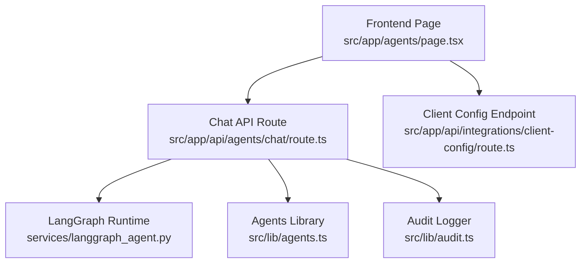
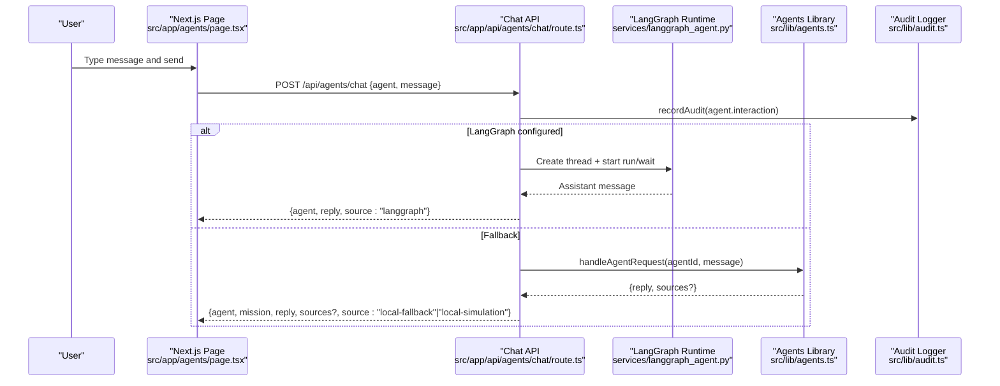
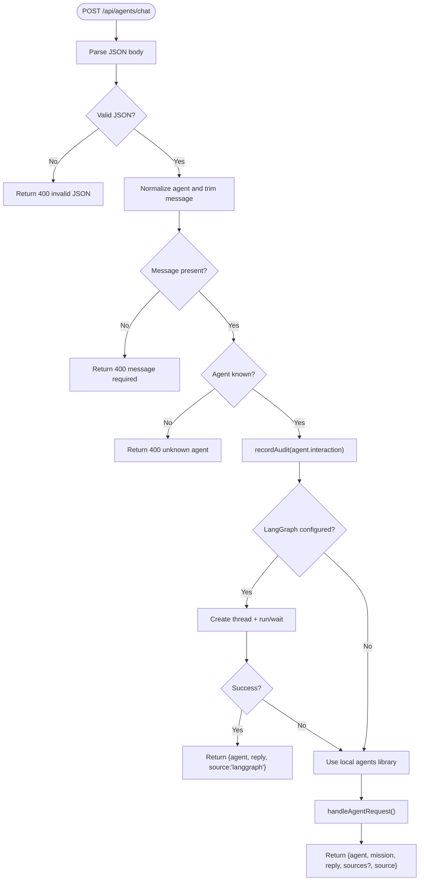
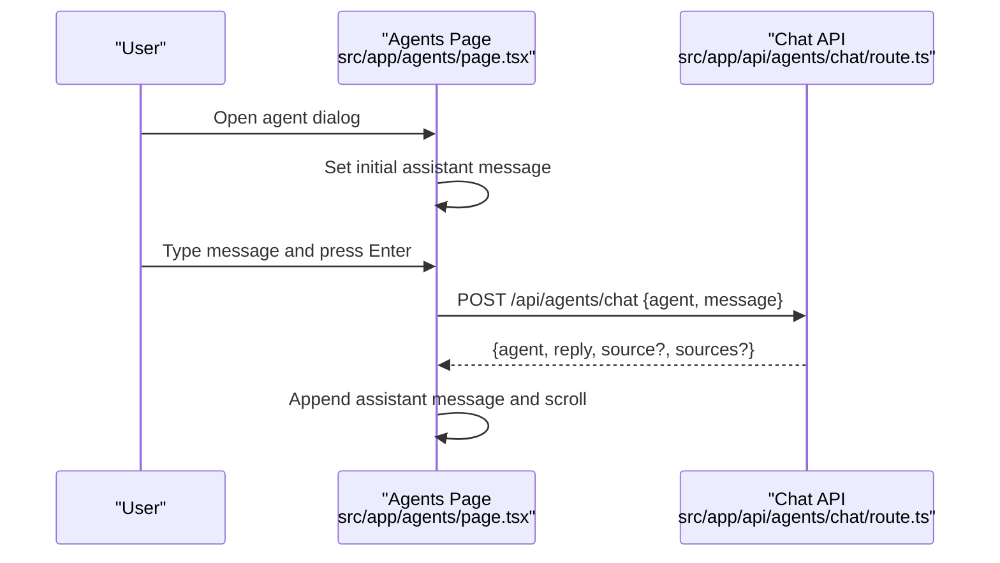
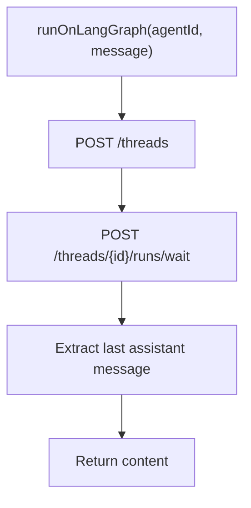
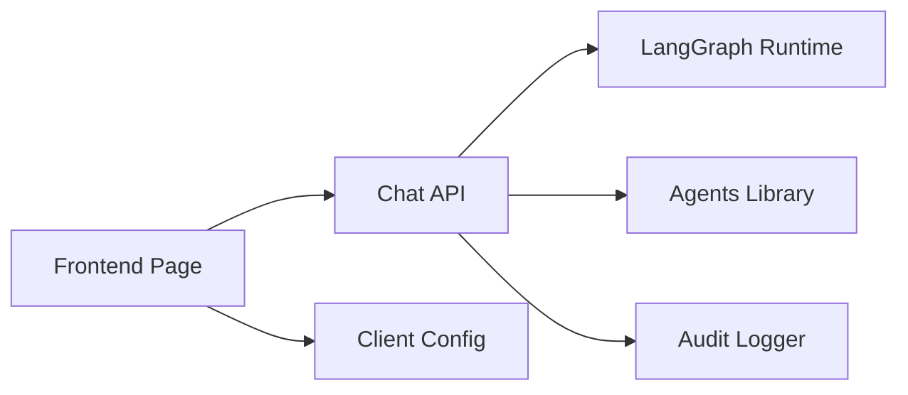

# Frontend Integration & API Layer

<cite>
**Referenced Files in This Document**
- [route.ts](file://src/app/api/agents/chat/route.ts)
- [agents.ts](file://src/lib/agents.ts)
- [page.tsx](file://src/app/agents/page.tsx)
- [langgraph_agent.py](file://services/langgraph_agent.py)
- [client-config route.ts](file://src/app/api/integrations/client-config/route.ts)
- [session.ts](file://src/lib/auth/session.ts)
- [audit.ts](file://src/lib/audit.ts)
</cite>

## Table of Contents
1. Introduction
2. Project Structure
3. Core Components
4. Architecture Overview
5. Detailed Component Analysis
6. Dependency Analysis
7. Performance Considerations
8. Troubleshooting Guide
9. Conclusion
10. Appendices

## Introduction
This document explains the Next.js frontend integration with the LangGraph AI runtime for agent communication. It covers the chat API endpoint, request and response schemas, error handling patterns, the agents library functions that invoke different agents, conversation state management, and real-time UI interaction. It also documents authentication, rate limiting considerations, connection management, and the TypeScript interfaces used for agent communication.

## Project Structure
The integration spans three layers:
- Frontend page that renders an agent catalog and a chat dialog to interact with agents.
- Next.js API route that validates requests, optionally calls the LangGraph runtime, and falls back to a local simulation brain.
- Agents library that implements per-agent logic and queries live data from the database.



**Diagram sources**
- [page.tsx:209-231](file://src/app/agents/page.tsx#L209-L231)
- [route.ts:40-84](file://src/app/api/agents/chat/route.ts#L40-L84)
- [agents.ts:216-373](file://src/lib/agents.ts#L216-L373)
- [client-config route.ts:6-8](file://src/app/api/integrations/client-config/route.ts#L6-L8)

**Section sources**
- [page.tsx:1-388](file://src/app/agents/page.tsx#L1-L388)
- [route.ts:1-85](file://src/app/api/agents/chat/route.ts#L1-L85)
- [agents.ts:1-374](file://src/lib/agents.ts#L1-L374)
- [client-config route.ts:1-9](file://src/app/api/integrations/client-config/route.ts#L1-L9)

## Core Components
- Chat API endpoint: Validates input, dispatches to LangGraph if configured, otherwise uses the local agents library, records audit events, and returns a structured response.
- Agents library: Defines agent metadata, snapshots live data, and generates decision-support replies per agent.
- Frontend chat UI: Sends messages to the API, displays assistant responses, and shows source indicators (LangGraph vs fallback/simulation).
- Client configuration endpoint: Exposes whether LangGraph is enabled to the client.

Key responsibilities:
- Input validation and safe defaults.
- Fallback behavior when LangGraph is unavailable.
- Audit logging for every agent interaction.
- Clear separation between read-only decision support and any state-changing actions.

**Section sources**
- [route.ts:40-84](file://src/app/api/agents/chat/route.ts#L40-L84)
- [agents.ts:216-373](file://src/lib/agents.ts#L216-L373)
- [page.tsx:209-231](file://src/app/agents/page.tsx#L209-L231)
- [client-config route.ts:6-8](file://src/app/api/integrations/client-config/route.ts#L6-L8)

## Architecture Overview
The chat flow supports two execution paths:
- Live path: When LangGraph is configured, the API creates a thread, starts a run with wait semantics, and returns the last assistant message.
- Fallback path: If LangGraph is not configured or fails, the API uses the local agents library to generate a reply based on live data.



**Diagram sources**
- [route.ts:9-37](file://src/app/api/agents/chat/route.ts#L9-L37)
- [route.ts:40-84](file://src/app/api/agents/chat/route.ts#L40-L84)
- [agents.ts:216-373](file://src/lib/agents.ts#L216-L373)
- [langgraph_agent.py:7-34](file://services/langgraph_agent.py#L7-L34)

## Detailed Component Analysis

### Chat API Endpoint (/api/agents/chat)
- Request schema:
  - agent: string (optional; defaults to "executive")
  - message: string (required)
- Response schema:
  - agent: string (human-readable name)
  - reply: string (assistant text)
  - mission: string (agent mission; present in fallback path)
  - sources: string[] (optional; present in fallback path)
  - source: enum ("langgraph", "local-fallback", "local-simulation")
- Error handling:
  - Invalid JSON returns 400 with error field.
  - Missing message returns 400 with error field.
  - Unknown agent returns 400 with error and list of valid agents.
  - LangGraph errors are caught and fall through to local fallback.
- Auditing:
  - Every interaction is recorded via audit logger before processing.



**Diagram sources**
- [route.ts:40-84](file://src/app/api/agents/chat/route.ts#L40-L84)

**Section sources**
- [route.ts:40-84](file://src/app/api/agents/chat/route.ts#L40-L84)
- [audit.ts:4-24](file://src/lib/audit.ts#L4-L24)

### Agents Library Functions
- Agent definitions:
  - Each agent has id, name, mission, tools, memory, events, responsibilities, and color.
- Snapshot utility:
  - Aggregates counts and statuses across patients, appointments, studies, equipment, reports, inventory, invoices, claims, and knowledge documents.
- Dispatch function:
  - handleAgentRequest routes by agentId and composes replies using snapshot data.
  - Returns decision-support text only; no direct state mutations.
- Knowledge agent:
  - Performs tokenized search over approved documents and returns matching sources.

```mermaid
classDiagram
class AgentDefinition {
+string id
+string name
+string mission
+string[] tools
+string memory
+string[] events
+string[] responsibilities
+string color
}
class AgentsLibrary {
+snapshot() Promise<object>
+handleAgentRequest(agentId, message, ctx) Promise<{reply, sources?}>
}
class AuditLogger {
+recordAudit(entry) Promise<void>
}
AgentsLibrary --> AuditLogger : "uses indirectly via API"
```

**Diagram sources**
- [agents.ts:25-39](file://src/lib/agents.ts#L25-L39)
- [agents.ts:187-210](file://src/lib/agents.ts#L187-L210)
- [agents.ts:216-373](file://src/lib/agents.ts#L216-L373)
- [audit.ts:4-24](file://src/lib/audit.ts#L4-L24)

**Section sources**
- [agents.ts:25-39](file://src/lib/agents.ts#L25-L39)
- [agents.ts:187-210](file://src/lib/agents.ts#L187-L210)
- [agents.ts:216-373](file://src/lib/agents.ts#L216-L373)

### Frontend Chat UI
- User interactions:
  - Opens a dialog for a selected agent and initializes a welcome message.
  - Sends user messages to /api/agents/chat and appends assistant responses.
- State management:
  - Tracks sending state to disable inputs during requests.
  - Displays source badges indicating runtime source.
  - Auto-scrolls to latest message.
- Real-time handling:
  - Uses synchronous fetch for simplicity; can be adapted to streaming if needed.



**Diagram sources**
- [page.tsx:204-231](file://src/app/agents/page.tsx#L204-L231)
- [route.ts:40-84](file://src/app/api/agents/chat/route.ts#L40-L84)

**Section sources**
- [page.tsx:204-231](file://src/app/agents/page.tsx#L204-L231)

### LangGraph Integration
- Thread lifecycle:
  - Creates a new thread, then starts a run with wait semantics for the selected assistant.
- Message format:
  - Wraps user message with agent context and expects assistant messages in response.
- Timeout and resilience:
  - Uses timeouts for thread creation and run calls.
  - Catches errors and falls back to local simulation.



**Diagram sources**
- [route.ts:9-37](file://src/app/api/agents/chat/route.ts#L9-L37)
- [langgraph_agent.py:7-34](file://services/langgraph_agent.py#L7-L34)

**Section sources**
- [route.ts:9-37](file://src/app/api/agents/chat/route.ts#L9-L37)
- [langgraph_agent.py:7-34](file://services/langgraph_agent.py#L7-L34)

### Authentication and Session Management
- Session tokens:
  - Server-side session tokens are created and verified using JWT utilities.
- Usage in agent flows:
  - The chat endpoint currently does not enforce authentication; it records audits without requiring a user identity.
- Recommendations:
  - Add middleware to verify session tokens on sensitive endpoints.
  - Propagate userId into audit logs for traceability.

**Section sources**
- [session.ts:1-45](file://src/lib/auth/session.ts#L1-L45)
- [route.ts:58-64](file://src/app/api/agents/chat/route.ts#L58-L64)

### Rate Limiting and Connection Management
- Current implementation:
  - No explicit rate limiting at the chat endpoint.
  - Timeouts are applied to LangGraph calls to prevent hanging requests.
- Recommendations:
  - Implement per-user or global rate limiting at the API layer.
  - Add retry with exponential backoff for transient network failures.
  - Consider streaming responses for long-running runs to improve UX.

[No sources needed since this section provides general guidance]

## Dependency Analysis
- The chat API depends on:
  - Integrations configuration for LangGraph settings.
  - Audit logger for compliance.
  - Agents library for fallback logic.
- The frontend depends on:
  - Chat API for messaging.
  - Client config endpoint to detect runtime capabilities.



**Diagram sources**
- [page.tsx:209-231](file://src/app/agents/page.tsx#L209-L231)
- [route.ts:40-84](file://src/app/api/agents/chat/route.ts#L40-L84)
- [client-config route.ts:6-8](file://src/app/api/integrations/client-config/route.ts#L6-L8)

**Section sources**
- [route.ts:40-84](file://src/app/api/agents/chat/route.ts#L40-L84)
- [agents.ts:216-373](file://src/lib/agents.ts#L216-L373)
- [page.tsx:209-231](file://src/app/agents/page.tsx#L209-L231)
- [client-config route.ts:6-8](file://src/app/api/integrations/client-config/route.ts#L6-L8)

## Performance Considerations
- Use timeouts to avoid blocking requests during external calls.
- Prefer streaming for long-running operations to keep UI responsive.
- Cache frequent read-only snapshots where appropriate to reduce DB load.
- Batch or limit query results in the agents library to minimize payload size.

[No sources needed since this section provides general guidance]

## Troubleshooting Guide
Common issues and resolutions:
- Invalid JSON in request: Ensure Content-Type is application/json and body matches expected schema.
- Missing message: Provide a non-empty message field.
- Unknown agent: Use one of the supported agent ids returned by the API.
- LangGraph unreachable: The API automatically falls back to local simulation; check runtime configuration.
- Empty agent response: Verify LangGraph assistant returns assistant messages; inspect logs.

**Section sources**
- [route.ts:40-84](file://src/app/api/agents/chat/route.ts#L40-L84)

## Conclusion
The Next.js frontend integrates with the LangGraph AI runtime through a robust chat API that validates inputs, orchestrates agent runs, and provides resilient fallback behavior. The agents library delivers decision-support replies grounded in live data, while the UI offers an intuitive chat experience with clear source indicators. Security and performance can be strengthened by adding authentication enforcement, rate limiting, and streaming responses.

[No sources needed since this section summarizes without analyzing specific files]

## Appendices

### TypeScript Interfaces and Types
- Agent definition fields:
  - id, name, mission, tools, memory, events, responsibilities, color
- Chat message interface:
  - role: "user" | "assistant"
  - content: string
  - source?: string
  - sources?: string[]
- Session user:
  - sub, name, email?, roles[], iss

**Section sources**
- [agents.ts:25-39](file://src/lib/agents.ts#L25-L39)
- [page.tsx:172-177](file://src/app/agents/page.tsx#L172-L177)
- [session.ts:5-11](file://src/lib/auth/session.ts#L5-L11)