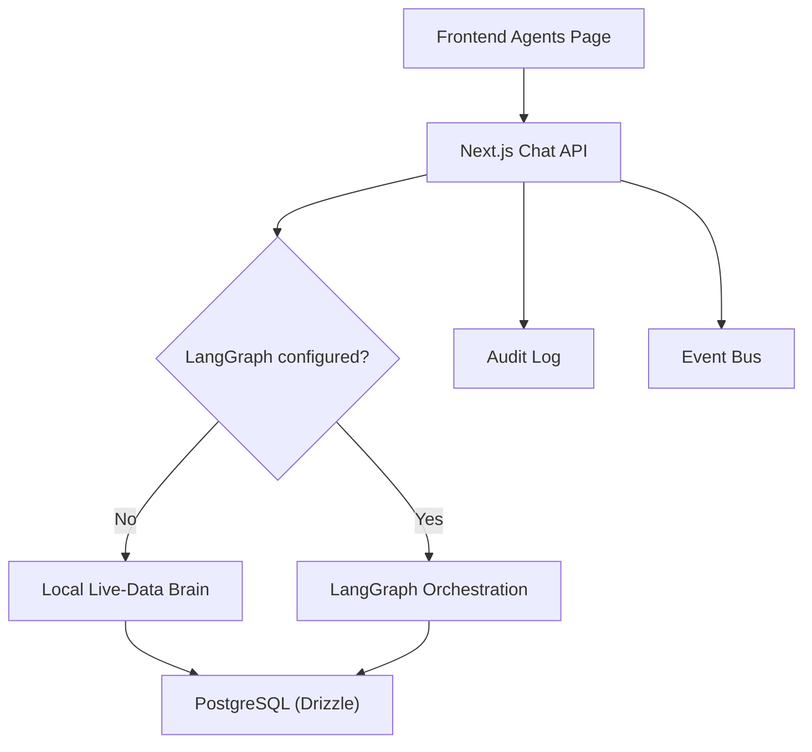
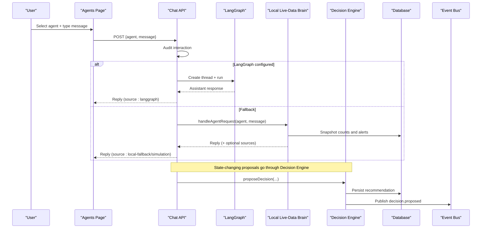
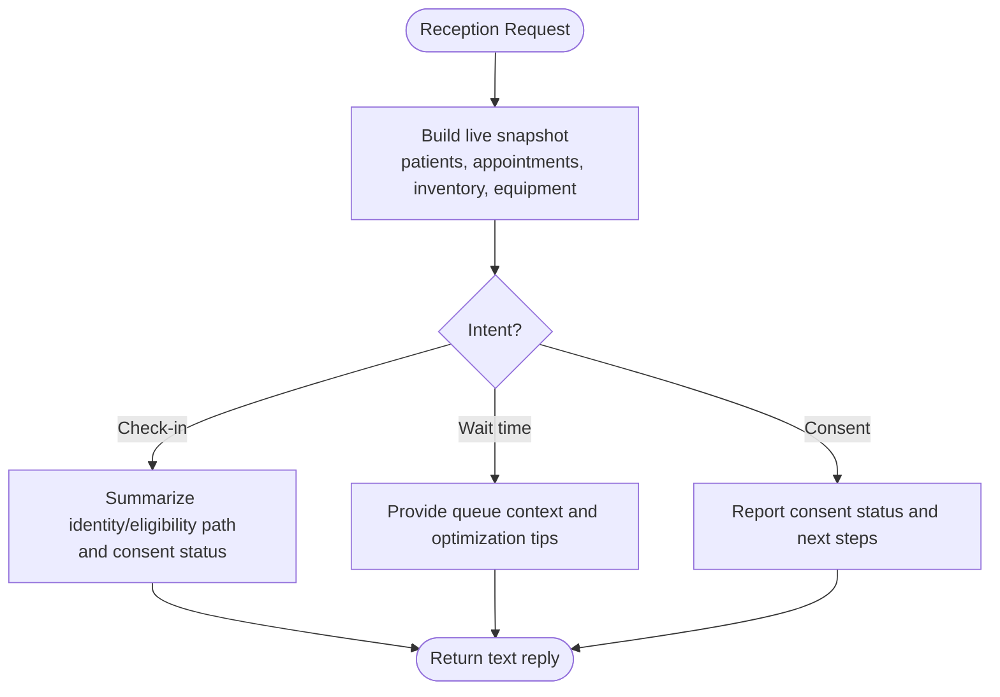
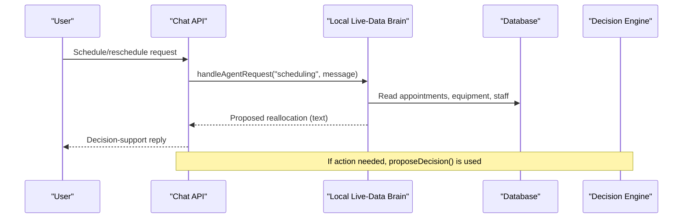
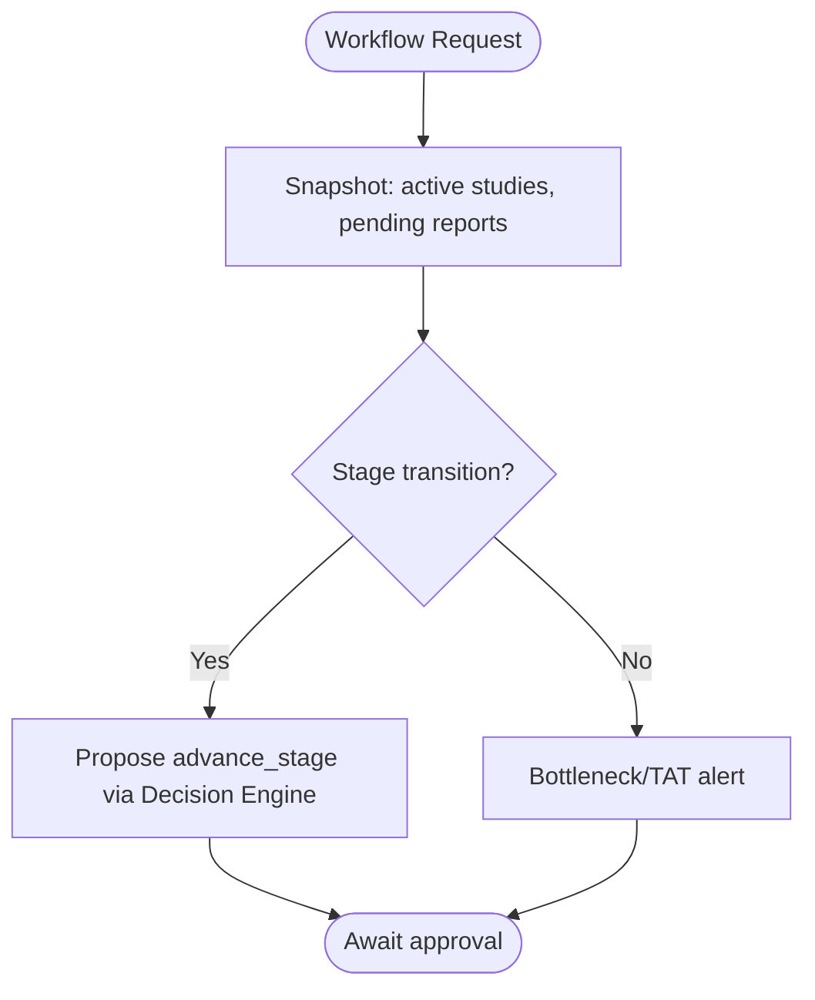
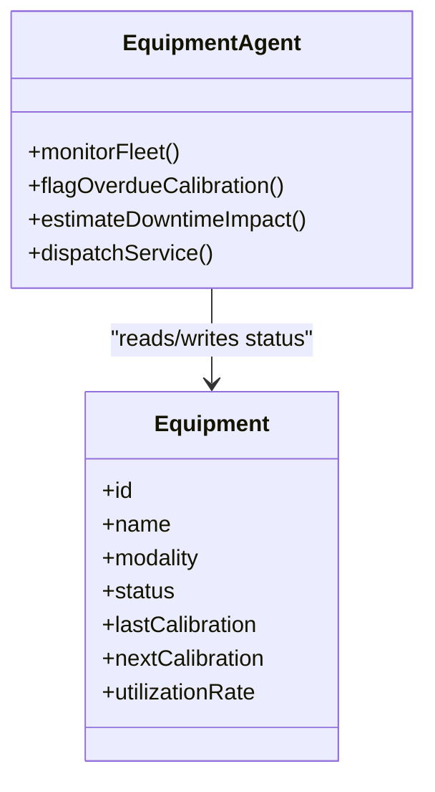
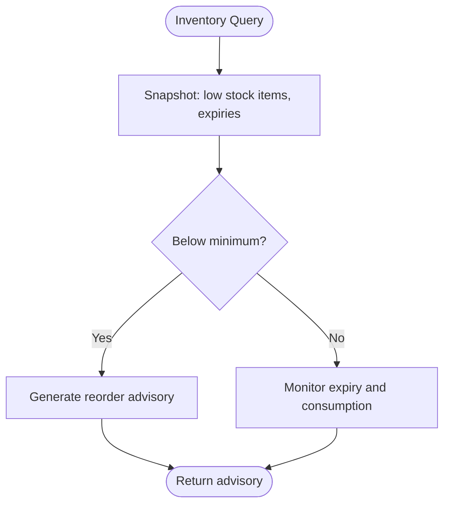
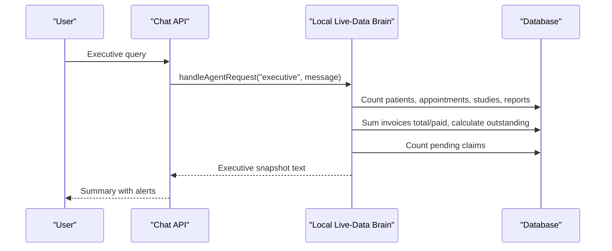
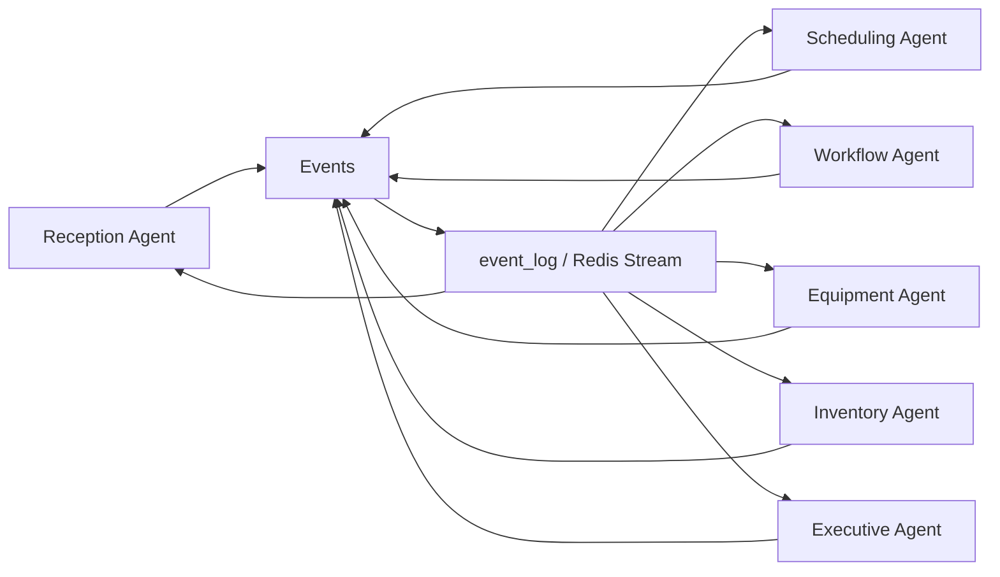
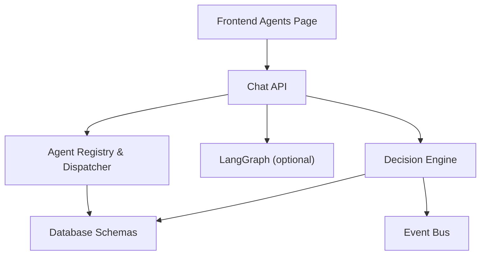

# Individual Agent Functions

<cite>
**Referenced Files in This Document**
- [agents.ts](file://src/lib/agents.ts)
- [route.ts](file://src/app/api/agents/chat/route.ts)
- [orchestration.py](file://backend/app/agents/orchestration.py)
- [schema.ts](file://src/db/schema.ts)
- [events.ts](file://src/lib/events.ts)
- [decision-engine.ts](file://src/lib/decision-engine.ts)
- [page.tsx](file://src/app/agents/page.tsx)
</cite>

## Table of Contents
1. [Introduction](#introduction)
2. [Project Structure](#project-structure)
3. [Core Components](#core-components)
4. [Architecture Overview](#architecture-overview)
5. [Detailed Component Analysis](#detailed-component-analysis)
6. [Dependency Analysis](#dependency-analysis)
7. [Performance Considerations](#performance-considerations)
8. [Troubleshooting Guide](#troubleshooting-guide)
9. [Conclusion](#conclusion)

## Introduction
This document explains each specialized agent in the GeraldOS multi-agent system and how they collaborate to support patient intake, scheduling, study workflow, equipment monitoring, inventory management, and executive intelligence. Agents are independent, mission-driven components that:
- Receive user or system messages via a chat API
- Build operational context from live data
- Provide decision-support responses (they do not execute state changes directly)
- Propose actions through a Decision Engine for human approval before execution
- Share information through events and shared database tables

The system supports two runtimes:
- LangGraph orchestration when configured
- A local “live-data brain” fallback that queries the database snapshot and returns structured replies

## Project Structure
Agents are defined centrally and exposed through a Next.js API route. The frontend provides an interactive UI to select an agent and send messages. A Python-based LangGraph graph defines an optional orchestrated flow across agents. All persistent state is modeled in Drizzle schemas.

**Diagram sources**
- [route.ts:1-85](file://src/app/api/agents/chat/route.ts#L1-L85)
- [agents.ts:181-240](file://src/lib/agents.ts#L181-L240)
- [orchestration.py:100-133](file://backend/app/agents/orchestration.py#L100-L133)
- [events.ts:101-131](file://src/lib/events.ts#L101-L131)

**Section sources**
- [route.ts:1-85](file://src/app/api/agents/chat/route.ts#L1-L85)
- [agents.ts:1-177](file://src/lib/agents.ts#L1-L177)
- [orchestration.py:1-133](file://backend/app/agents/orchestration.py#L1-L133)
- [schema.ts:1-468](file://src/db/schema.ts#L1-L468)
- [events.ts:1-158](file://src/lib/events.ts#L1-L158)

## Core Components
- Agent registry and dispatch: central definitions of each agent’s mission, tools, memory scope, events, and responsibilities; a dispatcher builds a live-data snapshot and routes requests per agent.
- Chat API: validates input, audits interactions, optionally calls LangGraph, otherwise falls back to the local live-data brain.
- LangGraph orchestration: optional graph with nodes for reception, scheduling, workflow, equipment, inventory, and executive agents.
- Shared state: database schemas for patients, appointments, studies, equipment, inventory, reports, invoices, claims, knowledge documents, AI observations, decisions, and events.
- Event bus: publishes domain events to Redis Streams (optional) and persists durable records to the event log table.
- Decision Engine: all proposed actions pass through rules, validation, human approval, and whitelisted executors.

**Section sources**
- [agents.ts:25-177](file://src/lib/agents.ts#L25-L177)
- [route.ts:39-84](file://src/app/api/agents/chat/route.ts#L39-L84)
- [orchestration.py:6-133](file://backend/app/agents/orchestration.py#L6-L133)
- [schema.ts:17-468](file://src/db/schema.ts#L17-L468)
- [events.ts:18-60](file://src/lib/events.ts#L18-L60)
- [decision-engine.ts:86-235](file://src/lib/decision-engine.ts#L86-L235)

## Architecture Overview
The request lifecycle:
1. Frontend sends a message to the chat API specifying the agent and query.
2. API audits the interaction and checks if LangGraph is configured.
3. If LangGraph is available, it creates a thread, runs the assistant, and returns the last assistant message.
4. If not, the local live-data brain builds a snapshot and returns a tailored reply per agent.
5. Any action that changes state is proposed via the Decision Engine; only after human approval can whitelisted executors perform safe operations.

**Diagram sources**
- [route.ts:8-37](file://src/app/api/agents/chat/route.ts#L8-L37)
- [route.ts:39-84](file://src/app/api/agents/chat/route.ts#L39-L84)
- [agents.ts:181-240](file://src/lib/agents.ts#L181-L240)
- [decision-engine.ts:91-130](file://src/lib/decision-engine.ts#L91-L130)
- [events.ts:101-131](file://src/lib/events.ts#L101-L131)

## Detailed Component Analysis

### Reception Agent
- Mission: Frictionless patient journey from registration to first appointment.
- Responsibilities: Verify identity and insurance eligibility, manage consent forms and capture history, estimate wait times and optimize queue position, surface registration blockers.
- Tools: Patient registry, HAPI FHIR Coverage lookup, Consent tracker, Queue board.
- Memory: Patient contact/insurance history, consent status, wait-time records.
- Events: patient.registered, appointment.checked_in, referral.received.
- Inputs: Natural language or structured message describing patient check-in, eligibility verification, or consent status.
- Outputs: Text summary including patient/appointment counts, low-stock advisory, and guidance on next steps; may include sources when referencing knowledge documents.
- Integration points:
  - Reads patients and appointments from the database snapshot.
  - References inventory alerts and equipment status in its overview.
  - Can propose decisions for reallocation or escalation via the Decision Engine.
- Typical queries and response patterns:
  - “Check in John Doe for CT abdomen.” → Returns overview, confirms identity/eligibility path, and indicates front-desk confirmation is required before recording.
  - “What is the current wait time?” → Provides queue context and suggests optimization based on availability.
  - “Is consent signed for MRN 12345?” → Summarizes consent status and next steps.

**Diagram sources**
- [agents.ts:181-240](file://src/lib/agents.ts#L181-L240)
- [schema.ts:17-100](file://src/db/schema.ts#L17-L100)

**Section sources**
- [agents.ts:41-56](file://src/lib/agents.ts#L41-L56)
- [agents.ts:181-240](file://src/lib/agents.ts#L181-L240)
- [schema.ts:17-100](file://src/db/schema.ts#L17-L100)

### Scheduling Agent
- Mission: Optimize machine and radiographer allocation so no slot is wasted.
- Responsibilities: Detect double-booking and modality conflicts, apply STAT → urgent → routine priority allocation, reallocate slots when machines go offline, balance radiographer workload.
- Tools: Appointment ledger, Equipment calendar, Radiographer roster, Priority rules.
- Memory: Slot utilisation history, conflict records, no-show patterns.
- Events: appointment.created, appointment.delayed, equipment.offline, equipment.online.
- Inputs: Requests to schedule, reschedule, or resolve conflicts; includes patient, modality, priority, and constraints.
- Outputs: Conflict scan results, priority rule application, proposed reallocations; always decision-support.
- Integration points:
  - Uses appointments, equipment, and staff schemas to assess availability and conflicts.
  - Coordinates with Equipment Agent insights (offline units) and Workflow Agent (study stages).
  - Proposes slot reallocations through the Decision Engine.
- Typical queries and response patterns:
  - “Schedule CT chest STAT for Jane Doe.” → Confirms priority rule, checks equipment availability, proposes slot and radiographer assignment for approval.
  - “Resolve conflict for Fluoroscopy at 11:30.” → Identifies conflict, suggests alternative room/time, and prepares a decision proposal.

**Diagram sources**
- [agents.ts:57-71](file://src/lib/agents.ts#L57-L71)
- [agents.ts:242-250](file://src/lib/agents.ts#L242-L250)
- [schema.ts:52-119](file://src/db/schema.ts#L52-L119)
- [decision-engine.ts:91-130](file://src/lib/decision-engine.ts#L91-L130)

**Section sources**
- [agents.ts:57-71](file://src/lib/agents.ts#L57-L71)
- [agents.ts:242-250](file://src/lib/agents.ts#L242-L250)
- [schema.ts:52-119](file://src/db/schema.ts#L52-L119)

### Workflow Agent
- Mission: Keep every study moving through the pipeline and flag anything that stalls.
- Responsibilities: Monitor progression referral → archive, detect bottlenecks and TAT breaches, suggest radiologist assignment for unallocated studies, escalate urgent studies.
- Tools: Stage tracker, TAT thresholds, n8n escalation, Assignment board.
- Memory: Per-study stage history and turnaround times.
- Events: study.uploaded, study.started, study.completed, report.approved.
- Inputs: Study IDs, stage transitions, bottleneck reports, assignment requests.
- Outputs: Pipeline status, bottleneck alerts, suggested assignments, escalation notices.
- Integration points:
  - Reads workflow_studies and reports to compute active pipeline and pending reports.
  - Integrates with Equipment Agent for downtime impact and Scheduling Agent for reassignments.
  - Executes stage transitions only via Decision Engine whitelisted executor.
- Typical queries and response patterns:
  - “Advance study 123 to imaging.” → Validates stage, proposes transition via Decision Engine, awaits approval.
  - “Why is this study stalled?” → Reports stage, elapsed time, and suggests corrective action.

**Diagram sources**
- [agents.ts:72-86](file://src/lib/agents.ts#L72-L86)
- [agents.ts:252-259](file://src/lib/agents.ts#L252-L259)
- [decision-engine.ts:174-191](file://src/lib/decision-engine.ts#L174-L191)
- [schema.ts:102-119](file://src/db/schema.ts#L102-L119)

**Section sources**
- [agents.ts:72-86](file://src/lib/agents.ts#L72-L86)
- [agents.ts:252-259](file://src/lib/agents.ts#L252-L259)
- [decision-engine.ts:174-191](file://src/lib/decision-engine.ts#L174-L191)
- [schema.ts:102-119](file://src/db/schema.ts#L102-L119)

### Equipment Agent
- Mission: Maximize fleet uptime through proactive health monitoring.
- Responsibilities: Flag overdue calibration/maintenance, estimate downtime impact on schedule, dispatch service requests via n8n, track lifecycle and utilization.
- Tools: Equipment registry, Calibration tracker, Service dispatcher (n8n), Downtime impact model.
- Memory: Calibration/maintenance history, utilization rates.
- Events: equipment.online, equipment.offline, maintenance.scheduled.
- Inputs: Equipment status updates, calibration due dates, maintenance scheduling, downtime reports.
- Outputs: Fleet status, calibration alerts, service dispatch suggestions, schedule impact estimates.
- Integration points:
  - Reads equipment schema for status and calibration fields.
  - Shares downtime info with Scheduling Agent to trigger reallocation proposals.
  - May propose equipment status changes via Decision Engine.
- Typical queries and response patterns:
  - “Show non-operational units.” → Lists affected equipment and modality.
  - “Schedule maintenance for CT Scanner A.” → Prepares a maintenance plan and proposes a service request.

**Diagram sources**
- [schema.ts:52-68](file://src/db/schema.ts#L52-L68)
- [agents.ts:103-116](file://src/lib/agents.ts#L103-L116)
- [agents.ts:271-278](file://src/lib/agents.ts#L271-L278)

**Section sources**
- [agents.ts:103-116](file://src/lib/agents.ts#L103-L116)
- [agents.ts:271-278](file://src/lib/agents.ts#L271-L278)
- [schema.ts:52-68](file://src/db/schema.ts#L52-L68)

### Inventory Agent
- Mission: Guarantee critical consumables are never out of stock at scan time.
- Responsibilities: Trigger reorder advisories below minimum stock, monitor expiry dates for contrast and consumables, forecast monthly consumption per modality, track supplier performance.
- Tools: Stock ledger, Reorder thresholds, MinIO manifests, Expiry monitor.
- Memory: Consumption rates, supplier lead times, expiry records.
- Events: inventory.updated, inventory.low_stock.
- Inputs: Stock level updates, consumption logs, expiry alerts, supplier lead times.
- Outputs: Low-stock advisories, expiry warnings, consumption forecasts, reorder proposals.
- Integration points:
  - Queries inventory_items for current vs minimum stock and expiry dates.
  - Feeds forecasts into purchasing workflows and notifies stakeholders.
  - Proposes purchase orders via Decision Engine.
- Typical queries and response patterns:
  - “Are we running low on IV Cannulas 20G?” → Returns current stock vs minimum and advises reorder.
  - “Forecast next month’s contrast usage.” → Provides projected consumption and suggests order quantities.

**Diagram sources**
- [agents.ts:117-131](file://src/lib/agents.ts#L117-L131)
- [agents.ts:280-283](file://src/lib/agents.ts#L280-L283)
- [schema.ts:136-164](file://src/db/schema.ts#L136-L164)

**Section sources**
- [agents.ts:117-131](file://src/lib/agents.ts#L117-L131)
- [agents.ts:280-283](file://src/lib/agents.ts#L280-L283)
- [schema.ts:136-164](file://src/db/schema.ts#L136-L164)

### Executive Agent
- Mission: Turn operational data into concise, decision-ready intelligence.
- Responsibilities: Produce daily executive summaries, detect operational bottlenecks and revenue-at-risk, compare modality performance and utilization, propose decisions for human approval.
- Tools: Analytics engine, Finance analytics, Integration health, Trend models.
- Memory: Historical KPIs, revenue trends, incident records.
- Events: decision.proposed, decision.executed, report.signed, equipment.offline.
- Inputs: Requests for summaries, KPIs, financial snapshots, risk indicators.
- Outputs: Executive snapshots combining patients, appointments, studies, reports, finance totals, outstanding amounts, inventory alerts, and equipment incidents.
- Integration points:
  - Aggregates counts from patients, appointments, studies, reports.
  - Computes invoice totals, paid amounts, and outstanding balances.
  - Surfaces inventory and equipment alerts to highlight risks.
  - Proposes strategic decisions via Decision Engine.
- Typical queries and response patterns:
  - “Executive snapshot now.” → Returns counts and financial summary with alerts.
  - “What is outstanding receivables?” → Calculates outstanding amounts and lists pending claims.

**Diagram sources**
- [agents.ts:147-161](file://src/lib/agents.ts#L147-L161)
- [agents.ts:299-318](file://src/lib/agents.ts#L299-L318)
- [schema.ts:195-271](file://src/db/schema.ts#L195-L271)

**Section sources**
- [agents.ts:147-161](file://src/lib/agents.ts#L147-L161)
- [agents.ts:299-318](file://src/lib/agents.ts#L299-L318)
- [schema.ts:195-271](file://src/db/schema.ts#L195-L271)

### Context Sharing and Shared State Mechanism
- Live snapshot: Each agent call builds a snapshot of key metrics (patient/appointment/study/equipment/report counts, low-stock items, offline equipment, pending reports, active pipeline).
- Database schemas: All agents read/write through Drizzle ORM against Postgres tables for patients, appointments, workflow studies, equipment, inventory, reports, invoices, claims, knowledge documents, AI observations, decisions, and events.
- Event bus: Domain events are published to Redis Streams (when configured) and persisted to the event_log table; agents react to these events to update their context.
- Decision Engine: All state-changing proposals are recorded with rule evaluation, validation, and human approval; only whitelisted executors perform safe actions.

**Diagram sources**
- [events.ts:18-60](file://src/lib/events.ts#L18-L60)
- [events.ts:101-131](file://src/lib/events.ts#L101-L131)
- [schema.ts:446-468](file://src/db/schema.ts#L446-L468)

**Section sources**
- [agents.ts:181-240](file://src/lib/agents.ts#L181-L240)
- [events.ts:18-60](file://src/lib/events.ts#L18-L60)
- [events.ts:101-131](file://src/lib/events.ts#L101-L131)
- [schema.ts:446-468](file://src/db/schema.ts#L446-L468)
- [decision-engine.ts:91-130](file://src/lib/decision-engine.ts#L91-L130)

## Dependency Analysis
- API depends on agent registry and live-data brain; optionally on LangGraph runtime.
- Agents depend on database schemas for context and outputs.
- Decision Engine depends on schemas for recommendations and audit; publishes events.
- Frontend displays agent cards and chat interface, sourcing agent metadata from both backend definitions and page constants.

**Diagram sources**
- [page.tsx:52-170](file://src/app/agents/page.tsx#L52-L170)
- [route.ts:1-85](file://src/app/api/agents/chat/route.ts#L1-L85)
- [agents.ts:1-177](file://src/lib/agents.ts#L1-L177)
- [decision-engine.ts:86-235](file://src/lib/decision-engine.ts#L86-L235)
- [events.ts:101-131](file://src/lib/events.ts#L101-L131)

**Section sources**
- [page.tsx:52-170](file://src/app/agents/page.tsx#L52-L170)
- [route.ts:1-85](file://src/app/api/agents/chat/route.ts#L1-L85)
- [agents.ts:1-177](file://src/lib/agents.ts#L1-L177)
- [decision-engine.ts:86-235](file://src/lib/decision-engine.ts#L86-L235)
- [events.ts:101-131](file://src/lib/events.ts#L101-L131)

## Performance Considerations
- Snapshot efficiency: The live-data brain performs multiple lightweight queries; consider batching or caching hot metrics if latency increases under load.
- LangGraph fallback: When LangGraph is unreachable, the local simulation ensures responsiveness; ensure timeouts are tuned to avoid long waits.
- Event bus resilience: Redis Streams are best-effort; event_log guarantees durability. Monitor Redis connectivity and backoff behavior.
- Decision Engine throughput: Rule evaluation and approvals introduce latency; batch proposals where possible and prioritize high-impact decisions.

[No sources needed since this section provides general guidance]

## Troubleshooting Guide
- Unknown agent error: Ensure the agent ID matches one in the registry; the API returns a list of valid agents on error.
- Empty response: If LangGraph returns no assistant message, the API throws an error; verify configuration and credentials.
- Decision not executing: Check decision status; only approved decisions can be executed by whitelisted executors.
- Event visibility: If events are not appearing in real-time feeds, confirm Redis connectivity and event_log persistence.

**Section sources**
- [route.ts:47-54](file://src/app/api/agents/chat/route.ts#L47-L54)
- [route.ts:23-36](file://src/app/api/agents/chat/route.ts#L23-L36)
- [decision-engine.ts:132-169](file://src/lib/decision-engine.ts#L132-L169)
- [events.ts:76-99](file://src/lib/events.ts#L76-L99)

## Conclusion
GeraldOS agents provide modular, mission-specific decision support across patient intake, scheduling, workflow, equipment, inventory, and executive functions. They share context through a robust event-driven architecture and a centralized database, while ensuring safety via a Decision Engine that requires human approval before any state change. The system gracefully falls back to a local live-data brain when external orchestration is unavailable, maintaining reliability and usability.

[No sources needed since this section summarizes without analyzing specific files]