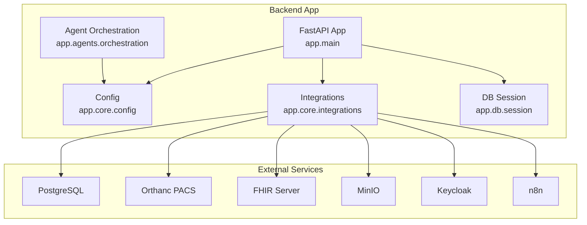
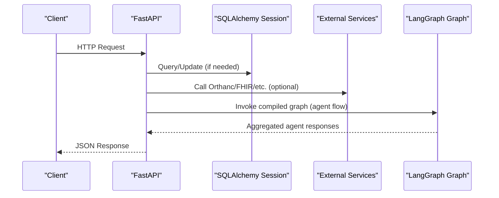
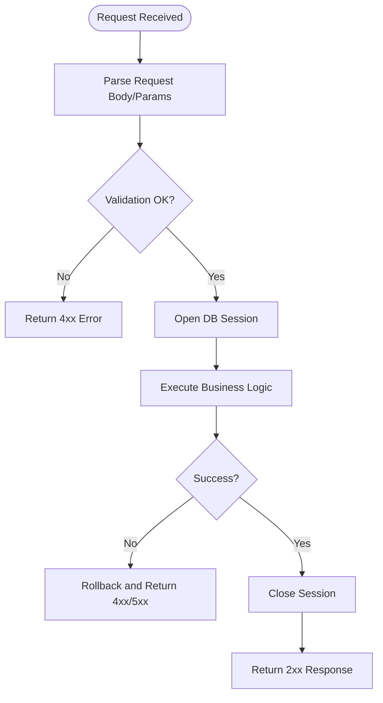
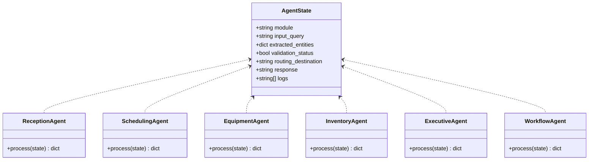
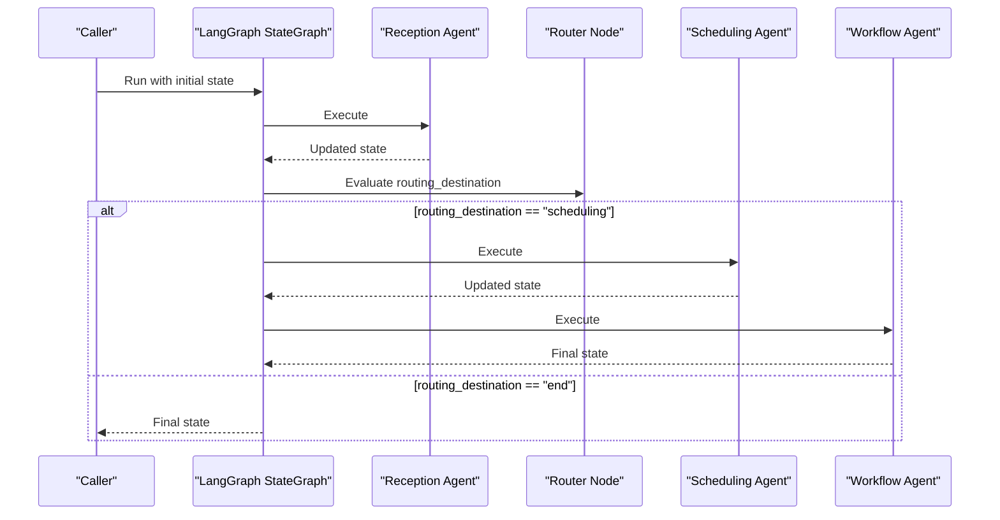
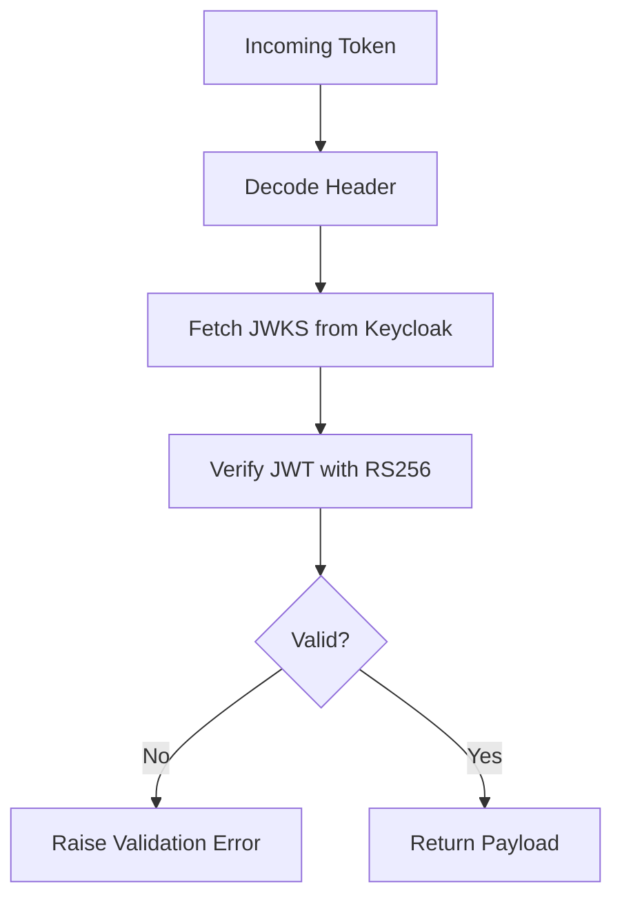
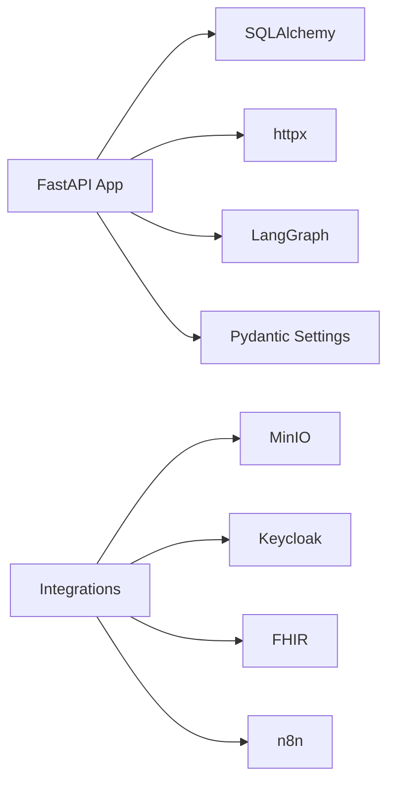

# Python Backend Service

<cite>
**Referenced Files in This Document**
- [main.py](file://backend/app/main.py)
- [orchestration.py](file://backend/app/agents/orchestration.py)
- [config.py](file://backend/app/core/config.py)
- [integrations.py](file://backend/app/core/integrations.py)
- [session.py](file://backend/app/db/session.py)
- [langgraph_agent.py](file://services/langgraph_agent.py)
- [requirements.txt](file://backend/requirements.txt)
- [Dockerfile](file://backend/Dockerfile)
</cite>

## Table of Contents
1. [Introduction](#introduction)
2. [Project Structure](#project-structure)
3. [Core Components](#core-components)
4. [Architecture Overview](#architecture-overview)
5. [Detailed Component Analysis](#detailed-component-analysis)
6. [Dependency Analysis](#dependency-analysis)
7. [Performance Considerations](#performance-considerations)
8. [Troubleshooting Guide](#troubleshooting-guide)
9. [Conclusion](#conclusion)
10. [Appendices](#appendices)

## Introduction
This document describes the Python FastAPI backend service that orchestrates LangGraph-based agents for GeraldOS operations. It covers application setup, agent orchestration logic, service endpoints, lifecycle management, concurrency handling, response processing, configuration options, performance tuning, monitoring, error handling, logging, health checks, deployment considerations, resource requirements, and scaling strategies for production environments.

## Project Structure
The backend is organized into modular components:
- Application entrypoint and API routes
- Agent orchestration using LangGraph
- Configuration via environment-driven settings
- External integrations (Keycloak, Orthanc, FHIR, n8n, MinIO)
- Database session management with SQLAlchemy
- Dockerized runtime with Uvicorn

**Diagram sources**
- [main.py:11-27](file://backend/app/main.py#L11-L27)
- [orchestration.py:107-133](file://backend/app/agents/orchestration.py#L107-L133)
- [config.py:4-19](file://backend/app/core/config.py#L4-L19)
- [integrations.py:9-35](file://backend/app/core/integrations.py#L9-L35)
- [session.py:7-16](file://backend/app/db/session.py#L7-L16)

**Section sources**
- [main.py:1-325](file://backend/app/main.py#L1-L325)
- [requirements.txt:1-17](file://backend/requirements.txt#L1-L17)
- [Dockerfile:1-20](file://backend/Dockerfile#L1-L20)

## Core Components
- FastAPI application with CORS middleware and a health endpoint
- LangGraph multi-agent workflow for reception, scheduling, equipment, inventory, executive, and clinical workflow supervision
- Environment-driven configuration for database, storage, and external services
- Integration manager for authentication, PACS/FHIR sync, notifications, and object storage
- SQLAlchemy session provider for request-scoped database access

**Section sources**
- [main.py:11-27](file://backend/app/main.py#L11-L27)
- [orchestration.py:6-133](file://backend/app/agents/orchestration.py#L6-L133)
- [config.py:4-19](file://backend/app/core/config.py#L4-L19)
- [integrations.py:9-119](file://backend/app/core/integrations.py#L9-L119)
- [session.py:7-16](file://backend/app/db/session.py#L7-L16)

## Architecture Overview
The backend exposes REST endpoints to manage patients, appointments, workflows, equipment, inventory, reports, analytics, and integrates with Orthanc for imaging data. The LangGraph orchestration defines a stateful graph where specialized agents process requests and route execution based on context.

**Diagram sources**
- [main.py:32-325](file://backend/app/main.py#L32-L325)
- [orchestration.py:107-133](file://backend/app/agents/orchestration.py#L107-L133)
- [integrations.py:60-119](file://backend/app/core/integrations.py#L60-L119)

## Detailed Component Analysis

### FastAPI Application and Endpoints
- Initializes the FastAPI app with metadata and adds CORS middleware
- Provides a health check endpoint for readiness/liveness probes
- Implements domain endpoints for:
  - Patients: registration and search
  - Appointments: creation and listing
  - Clinical Workflow: run initiation, listing, and state transitions with audit logging
  - Orthanc integration: study listing via HTTP client
  - Equipment: create and list assets
  - Inventory: list items and adjust quantities
  - Reports: create and list reports
  - Analytics: summary dashboard metrics

Concurrency and request handling:
- Each request uses a dependency-injected SQLAlchemy session scoped per request
- Exceptions are caught and converted to HTTP errors with appropriate status codes
- Successful mutations commit transactions; failures trigger rollbacks

**Diagram sources**
- [main.py:32-325](file://backend/app/main.py#L32-L325)
- [session.py:11-16](file://backend/app/db/session.py#L11-L16)

**Section sources**
- [main.py:11-325](file://backend/app/main.py#L11-L325)
- [session.py:7-16](file://backend/app/db/session.py#L7-L16)

### LangGraph Multi-Agent Orchestration
- Defines an AgentState with fields for module, input query, extracted entities, validation status, routing destination, response, and logs
- Implements independent agent nodes:
  - Reception: extracts demographics and validates insurance
  - Scheduling: allocates machine, detects conflicts, sets time slots
  - Equipment: checks calibration profiles and service history
  - Inventory: forecasts consumption and thresholds
  - Executive: synthesizes KPIs and utilization metrics
  - Workflow: supervises state transitions and audits integrity
- Builds a StateGraph with conditional routing from reception to scheduling or end, then to workflow super node, and finally END
- Compiles the graph into a reusable LangGraph app

**Diagram sources**
- [orchestration.py:6-133](file://backend/app/agents/orchestration.py#L6-L133)

**Diagram sources**
- [orchestration.py:100-133](file://backend/app/agents/orchestration.py#L100-L133)

**Section sources**
- [orchestration.py:1-134](file://backend/app/agents/orchestration.py#L1-L134)

### Configuration Management
- Uses Pydantic Settings to load environment variables for:
  - Database URL (PostgreSQL)
  - Redis URL
  - MinIO endpoint and credentials
  - Keycloak URL and realm
  - Orthanc URL
  - FHIR URL
  - Gemini API key
- Defaults are provided for development; production should supply secrets via environment or secret managers

**Section sources**
- [config.py:1-20](file://backend/app/core/config.py#L1-L20)

### Integrations Manager
- Manages connections and health across Keycloak, Orthanc, OHIF, Dicoogle, FHIR, n8n, and MinIO
- JWT verification against Keycloak JWKS
- Syncs DICOM studies to FHIR resources
- Triggers n8n webhooks for automation and notifications
- Uploads reports to MinIO buckets

**Diagram sources**
- [integrations.py:37-58](file://backend/app/core/integrations.py#L37-L58)

**Section sources**
- [integrations.py:1-119](file://backend/app/core/integrations.py#L1-L119)

### Database Session Management
- Creates a SQLAlchemy engine with connection pre-ping enabled
- Configures a sessionmaker for transactional sessions
- Provides a dependency function to yield a session per request and ensure closure

**Section sources**
- [session.py:1-17](file://backend/app/db/session.py#L1-L17)

### Standalone LangGraph Agent Module
- A separate LangGraph module defines a message-centric state and a simple routing mechanism to dispatch to specific agents
- Useful for lightweight agent invocation or testing outside the main FastAPI app

**Section sources**
- [langgraph_agent.py:1-35](file://services/langgraph_agent.py#L1-L35)

## Dependency Analysis
- FastAPI depends on SQLAlchemy for ORM, httpx for HTTP calls, and optional integrations like MinIO and jose for JWT
- LangGraph orchestrates agent nodes and manages state transitions
- Configuration is decoupled via environment variables
- Docker image bundles dependencies and runs Uvicorn server

**Diagram sources**
- [requirements.txt:1-17](file://backend/requirements.txt#L1-L17)
- [main.py:1-325](file://backend/app/main.py#L1-L325)
- [integrations.py:1-119](file://backend/app/core/integrations.py#L1-L119)

**Section sources**
- [requirements.txt:1-17](file://backend/requirements.txt#L1-L17)
- [main.py:1-325](file://backend/app/main.py#L1-L325)
- [integrations.py:1-119](file://backend/app/core/integrations.py#L1-L119)

## Performance Considerations
- Connection pooling: SQLAlchemy engine created with pool_pre_ping to detect stale connections; consider tuning pool size and timeout based on workload
- Concurrency: Uvicorn handles ASGI concurrency; scale horizontally by running multiple workers behind a reverse proxy or container orchestrator
- External calls: Use async HTTP clients (httpx) for non-blocking calls to Orthanc, FHIR, Keycloak, and n8n
- Caching: Introduce Redis caching for frequently accessed data (e.g., patient lookups, equipment status) using REDIS_URL
- Database queries: Ensure indexes on frequently filtered columns (e.g., national_id, first_name, last_name) to optimize search
- Agent orchestration: Keep agent nodes lightweight; offload heavy computations to background tasks if necessary

[No sources needed since this section provides general guidance]

## Troubleshooting Guide
- Health checks: Use /health to verify service liveness and readiness
- Database connectivity: Validate DATABASE_URL and network reachability to PostgreSQL; check connection errors and timeouts
- External service availability: Verify ORTHANC_URL, FHIR_URL, KEYCLOAK_URL, and N8N_URL; handle HTTP errors gracefully
- JWT validation: Ensure Keycloak JWKS endpoint is reachable and algorithms match; inspect token issuer and audience
- Storage issues: Confirm MinIO bucket existence and credentials; handle upload errors and retries
- Logging: Add structured logging around endpoints and agent nodes to capture request IDs, inputs, outputs, and exceptions

**Section sources**
- [main.py:25-27](file://backend/app/main.py#L25-L27)
- [integrations.py:37-58](file://backend/app/core/integrations.py#L37-L58)
- [integrations.py:60-119](file://backend/app/core/integrations.py#L60-L119)

## Conclusion
The backend provides a robust FastAPI service with clear separation of concerns: API endpoints, agent orchestration via LangGraph, environment-driven configuration, and integration management. It supports concurrent requests through ASGI, offers health checks for monitoring, and integrates with essential healthcare systems. For production, focus on scaling workers, securing secrets, optimizing database queries, and implementing comprehensive logging and observability.

[No sources needed since this section summarizes without analyzing specific files]

## Appendices

### Deployment and Runtime
- Containerization: Dockerfile builds a slim Python image, installs dependencies, and runs Uvicorn on port 8000
- Environment variables: Supply secrets and service URLs via environment or secret managers
- Reverse proxy: Place behind Nginx/Traefik for TLS termination and routing

**Section sources**
- [Dockerfile:1-20](file://backend/Dockerfile#L1-L20)
- [config.py:4-19](file://backend/app/core/config.py#L4-L19)

### Monitoring and Observability
- Health endpoint: /health returns platform status and version
- Metrics: Integrate Prometheus metrics for request latency, error rates, and agent execution times
- Tracing: Add distributed tracing to track requests across FastAPI, LangGraph, and external services

[No sources needed since this section provides general guidance]

### Scaling Strategies
- Horizontal scaling: Run multiple Uvicorn workers and scale replicas in Kubernetes or Docker Swarm
- Load balancing: Use ingress controllers to distribute traffic across instances
- Resource limits: Set CPU/memory limits based on observed usage; tune worker count accordingly

[No sources needed since this section provides general guidance]