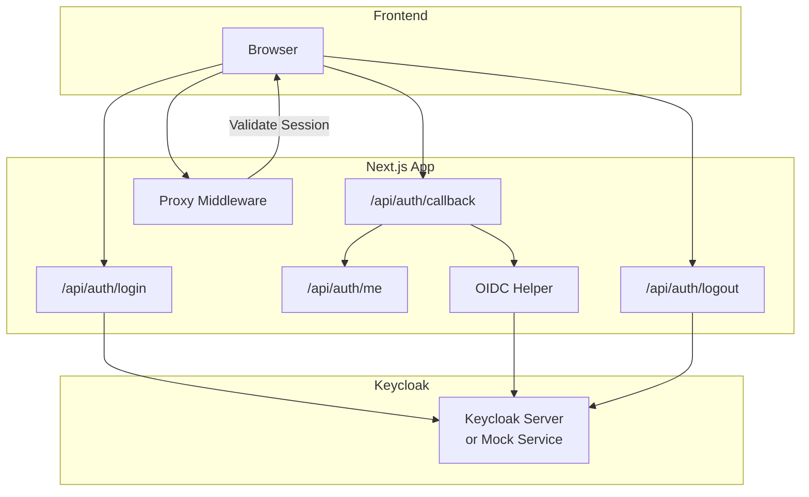
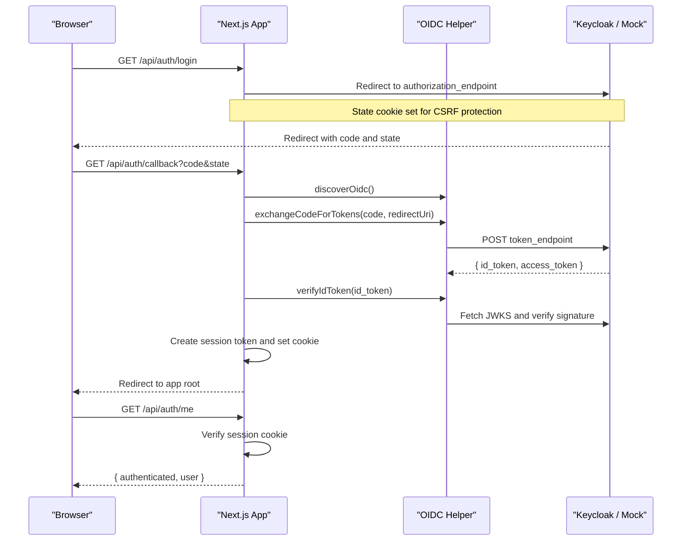
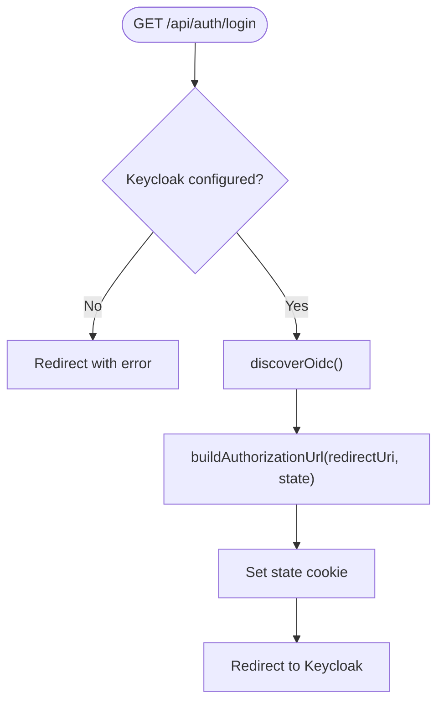
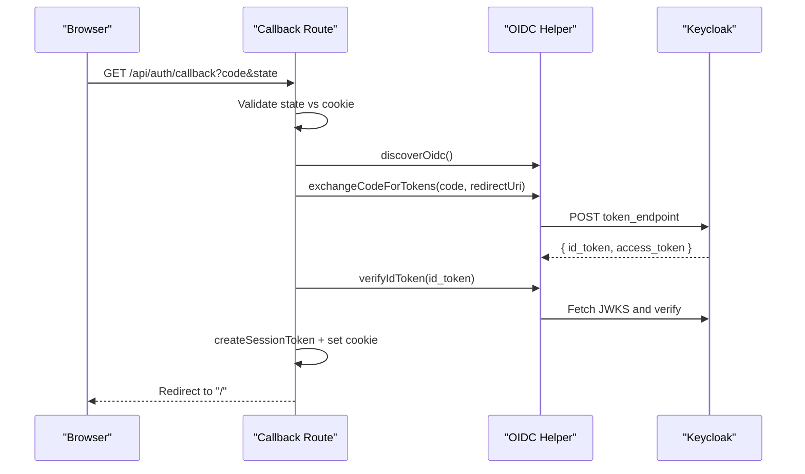
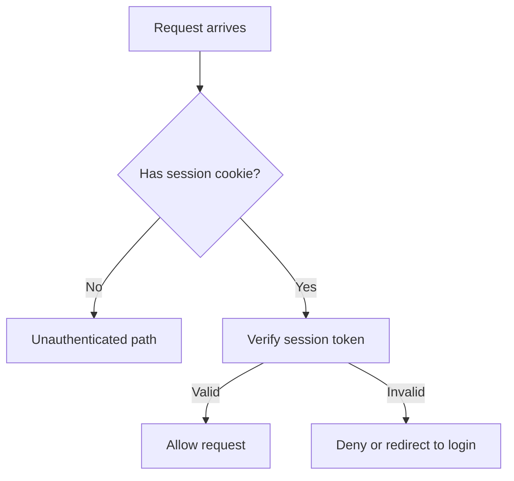
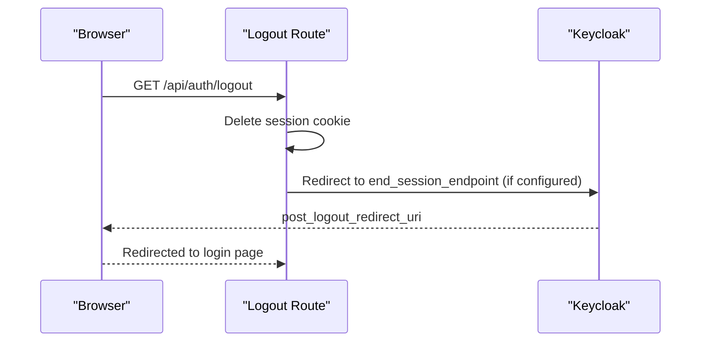
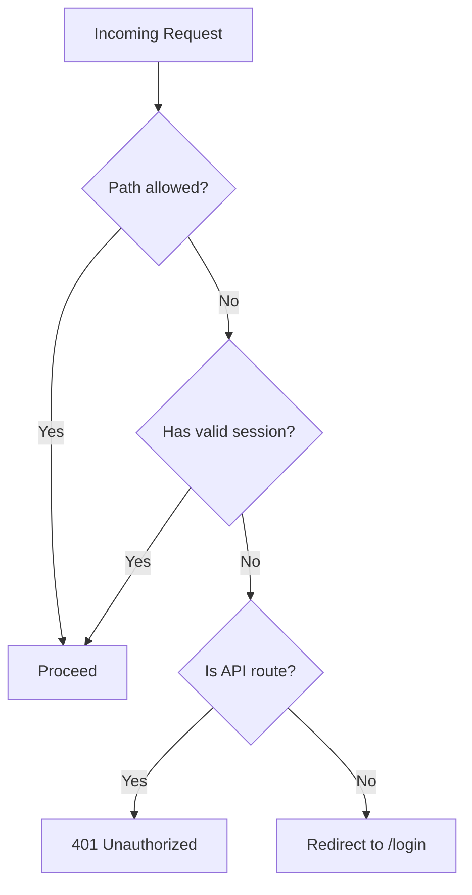
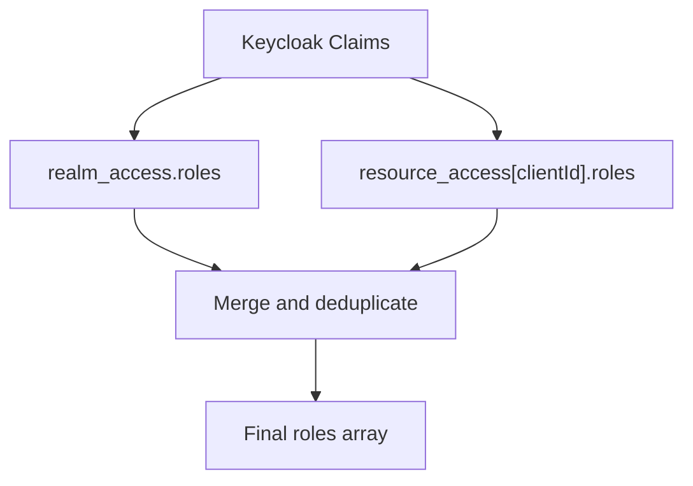
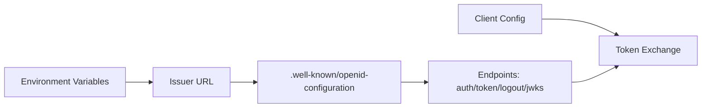
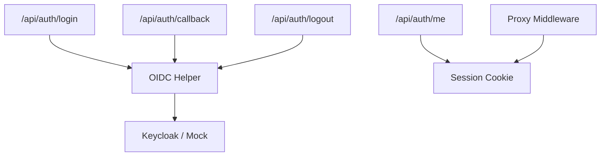

# Authentication Integration (Keycloak)

<cite>
**Referenced Files in This Document**
- [route.ts](file://src/app/api/auth/callback/route.ts)
- [route.ts](file://src/app/api/auth/login/route.ts)
- [route.ts](file://src/app/api/auth/logout/route.ts)
- [route.ts](file://src/app/api/auth/me/route.ts)
- [oidc.ts](file://src/lib/auth/oidc.ts)
- [proxy.ts](file://src/proxy.ts)
- [keycloak.mjs](file://services/keycloak.mjs)
- [config.py](file://backend/app/core/config.py)
</cite>

## Table of Contents
1. Introduction
2. Project Structure
3. Core Components
4. Architecture Overview
5. Detailed Component Analysis
6. Dependency Analysis
7. Performance Considerations
8. Troubleshooting Guide
9. Conclusion

## Introduction
This document explains how GeraldOS integrates Keycloak OpenID Connect (OIDC) for authentication and authorization. It covers the end-to-end flow: login, callback handling, session management, logout, and a proxy layer that validates sessions and enforces access policies. It also documents configuration options for connecting to Keycloak, client setup, role mapping, protected routes, user context access, error handling, and security considerations such as token validation, session storage, and CSRF protection.

## Project Structure
GeraldOS implements OIDC via Next.js API routes under src/app/api/auth, an OIDC helper library under src/lib/auth, a middleware-like proxy at src/proxy.ts, and a local Keycloak mock service under services/keycloak.mjs used during development. The backend service configuration is defined in backend/app/core/config.py.

**Diagram sources**
- [route.ts:7-30](file://src/app/api/auth/login/route.ts#L7-L30)
- [route.ts:13-58](file://src/app/api/auth/callback/route.ts#L13-L58)
- [route.ts:7-14](file://src/app/api/auth/me/route.ts#L7-L14)
- [route.ts:8-30](file://src/app/api/auth/logout/route.ts#L8-L30)
- [oidc.ts:14-95](file://src/lib/auth/oidc.ts#L14-L95)
- [proxy.ts:11-44](file://src/proxy.ts#L11-L44)
- [keycloak.mjs:46-119](file://services/keycloak.mjs#L46-L119)

**Section sources**
- [route.ts:7-30](file://src/app/api/auth/login/route.ts#L7-L30)
- [route.ts:13-58](file://src/app/api/auth/callback/route.ts#L13-L58)
- [route.ts:7-14](file://src/app/api/auth/me/route.ts#L7-L14)
- [route.ts:8-30](file://src/app/api/auth/logout/route.ts#L8-L30)
- [oidc.ts:14-95](file://src/lib/auth/oidc.ts#L14-L95)
- [proxy.ts:11-44](file://src/proxy.ts#L11-L44)
- [keycloak.mjs:46-119](file://services/keycloak.mjs#L46-L119)

## Core Components
- OIDC Helper: Discovers Keycloak endpoints, builds authorization URLs, exchanges authorization codes for tokens, verifies ID tokens using JWKS, and extracts roles from claims.
- Auth API Routes: Handle login initiation, callback processing, current user retrieval, and logout.
- Proxy Middleware: Validates session cookies on requests and enforces authentication for protected routes.
- Local Keycloak Mock: Provides a development-only OIDC server with discovery, token issuance, and logout endpoints.

**Section sources**
- [oidc.ts:14-95](file://src/lib/auth/oidc.ts#L14-L95)
- [route.ts:7-30](file://src/app/api/auth/login/route.ts#L7-L30)
- [route.ts:13-58](file://src/app/api/auth/callback/route.ts#L13-L58)
- [route.ts:7-14](file://src/app/api/auth/me/route.ts#L7-L14)
- [route.ts:8-30](file://src/app/api/auth/logout/route.ts#L8-L30)
- [proxy.ts:11-44](file://src/proxy.ts#L11-L44)
- [keycloak.mjs:46-119](file://services/keycloak.mjs#L46-L119)

## Architecture Overview
The authentication architecture follows the OIDC Authorization Code Flow with PKCE-like state validation and server-side session management.

**Diagram sources**
- [route.ts:7-30](file://src/app/api/auth/login/route.ts#L7-L30)
- [route.ts:13-58](file://src/app/api/auth/callback/route.ts#L13-L58)
- [oidc.ts:18-88](file://src/lib/auth/oidc.ts#L18-L88)
- [keycloak.mjs:46-119](file://services/keycloak.mjs#L46-L119)

## Detailed Component Analysis

### Login Flow
- Initiates OIDC login by building an authorization URL with client_id, response_type=code, scope, redirect_uri, and state.
- Stores a short-lived state cookie to prevent CSRF attacks during callback validation.
- Redirects the browser to Keycloak’s authorization endpoint.

**Diagram sources**
- [route.ts:7-30](file://src/app/api/auth/login/route.ts#L7-L30)
- [oidc.ts:18-46](file://src/lib/auth/oidc.ts#L18-L46)

**Section sources**
- [route.ts:7-30](file://src/app/api/auth/login/route.ts#L7-L30)
- [oidc.ts:18-46](file://src/lib/auth/oidc.ts#L18-L46)

### Callback Handling
- Validates incoming code and state against the stored state cookie.
- Discovers OIDC endpoints, exchanges the code for tokens, verifies the ID token using JWKS, and extracts roles.
- Creates a signed session token, sets it as an httpOnly cookie, records an audit event, and redirects to the application root.

**Diagram sources**
- [route.ts:13-58](file://src/app/api/auth/callback/route.ts#L13-L58)
- [oidc.ts:48-88](file://src/lib/auth/oidc.ts#L48-L88)
- [keycloak.mjs:101-113](file://services/keycloak.mjs#L101-L113)

**Section sources**
- [route.ts:13-58](file://src/app/api/auth/callback/route.ts#L13-L58)
- [oidc.ts:48-88](file://src/lib/auth/oidc.ts#L48-L88)

### Session Management
- The callback route creates a session token containing user identity and roles, then stores it in an httpOnly cookie.
- The proxy middleware validates this session cookie on subsequent requests to enforce authentication.
- The /api/auth/me endpoint reads and verifies the session cookie to return the current user context.

**Diagram sources**
- [route.ts:31-53](file://src/app/api/auth/callback/route.ts#L31-L53)
- [proxy.ts:11-44](file://src/proxy.ts#L11-L44)
- [route.ts:7-14](file://src/app/api/auth/me/route.ts#L7-L14)

**Section sources**
- [route.ts:31-53](file://src/app/api/auth/callback/route.ts#L31-L53)
- [proxy.ts:11-44](file://src/proxy.ts#L11-L44)
- [route.ts:7-14](file://src/app/api/auth/me/route.ts#L7-L14)

### Logout Flow
- Clears the local session cookie and optionally redirects to Keycloak’s end_session_endpoint for single sign-out.
- Falls back gracefully if Keycloak is not configured or the endpoint is unavailable.

**Diagram sources**
- [route.ts:8-30](file://src/app/api/auth/logout/route.ts#L8-L30)
- [keycloak.mjs:114-117](file://services/keycloak.mjs#L114-L117)

**Section sources**
- [route.ts:8-30](file://src/app/api/auth/logout/route.ts#L8-L30)
- [keycloak.mjs:114-117](file://services/keycloak.mjs#L114-L117)

### Protected Routes and User Context
- The proxy middleware protects all routes except explicitly allowed paths (login, auth APIs, health, webhooks, static assets).
- For API routes without a valid session, it returns a 401 unauthorized response; for other routes, it redirects to login.
- The /api/auth/me endpoint provides the current user context when a valid session exists.

**Diagram sources**
- [proxy.ts:11-44](file://src/proxy.ts#L11-L44)
- [route.ts:7-14](file://src/app/api/auth/me/route.ts#L7-L14)

**Section sources**
- [proxy.ts:11-44](file://src/proxy.ts#L11-L44)
- [route.ts:7-14](file://src/app/api/auth/me/route.ts#L7-L14)

### Role Mapping and Access Control
- Roles are extracted from Keycloak claims, combining realm-level and client-level roles.
- Applications can use these roles to gate features or data access after verifying the session.

**Diagram sources**
- [oidc.ts:90-95](file://src/lib/auth/oidc.ts#L90-L95)

**Section sources**
- [oidc.ts:90-95](file://src/lib/auth/oidc.ts#L90-L95)

### Configuration Options
- OIDC discovery uses the issuer URL to fetch endpoints like authorization_endpoint, token_endpoint, jwks_uri, and end_session_endpoint.
- Client credentials (client_id and optional client_secret) are used during token exchange.
- Backend service configuration includes KEYCLOAK_URL and KEYCLOAK_REALM for integration settings.

**Diagram sources**
- [oidc.ts:18-29](file://src/lib/auth/oidc.ts#L18-L29)
- [oidc.ts:48-70](file://src/lib/auth/oidc.ts#L48-L70)
- [config.py:4-19](file://backend/app/core/config.py#L4-L19)

**Section sources**
- [oidc.ts:18-29](file://src/lib/auth/oidc.ts#L18-L29)
- [oidc.ts:48-70](file://src/lib/auth/oidc.ts#L48-L70)
- [config.py:4-19](file://backend/app/core/config.py#L4-L19)

## Dependency Analysis
The following diagram shows how components depend on each other during authentication.

**Diagram sources**
- [route.ts:7-30](file://src/app/api/auth/login/route.ts#L7-L30)
- [route.ts:13-58](file://src/app/api/auth/callback/route.ts#L13-L58)
- [route.ts:7-14](file://src/app/api/auth/me/route.ts#L7-L14)
- [route.ts:8-30](file://src/app/api/auth/logout/route.ts#L8-L30)
- [proxy.ts:11-44](file://src/proxy.ts#L11-L44)
- [oidc.ts:18-95](file://src/lib/auth/oidc.ts#L18-L95)
- [keycloak.mjs:46-119](file://services/keycloak.mjs#L46-L119)

**Section sources**
- [route.ts:7-30](file://src/app/api/auth/login/route.ts#L7-L30)
- [route.ts:13-58](file://src/app/api/auth/callback/route.ts#L13-L58)
- [route.ts:7-14](file://src/app/api/auth/me/route.ts#L7-L14)
- [route.ts:8-30](file://src/app/api/auth/logout/route.ts#L8-L30)
- [proxy.ts:11-44](file://src/proxy.ts#L11-L44)
- [oidc.ts:18-95](file://src/lib/auth/oidc.ts#L18-L95)
- [keycloak.mjs:46-119](file://services/keycloak.mjs#L46-L119)

## Performance Considerations
- OIDC discovery results are cached per issuer to avoid repeated network calls.
- Network timeouts are applied to discovery and token exchange to fail fast.
- Session verification in the proxy is lightweight, relying on cryptographic verification of the session token.
- Use secure cookie flags (httpOnly, sameSite) to reduce overhead and improve security posture.

[No sources needed since this section provides general guidance]

## Troubleshooting Guide
Common issues and resolutions:
- Invalid OAuth state: Ensure the state cookie matches the callback state parameter; check CORS and cookie domain/path settings.
- Token exchange failed: Verify Keycloak client configuration (client_id, client_secret), redirect_uri, and network connectivity.
- Unauthenticated API responses: Confirm the session cookie is present and valid; ensure the proxy is enabled and not bypassing required paths.
- Logout not signing out globally: If Keycloak is configured, ensure end_session_endpoint is reachable and post_logout_redirect_uri is correct.

**Section sources**
- [route.ts:13-58](file://src/app/api/auth/callback/route.ts#L13-L58)
- [route.ts:7-30](file://src/app/api/auth/login/route.ts#L7-L30)
- [proxy.ts:11-44](file://src/proxy.ts#L11-L44)
- [route.ts:8-30](file://src/app/api/auth/logout/route.ts#L8-L30)

## Conclusion
GeraldOS implements a robust OIDC-based authentication system with Keycloak, featuring secure login flows, server-side session management, role extraction, and a middleware-driven proxy for protecting routes. The design emphasizes security through state validation, JWT verification via JWKS, and careful cookie handling. With clear configuration points and comprehensive error handling, the system supports both production Keycloak deployments and local development via a mock service.

[No sources needed since this section summarizes without analyzing specific files]