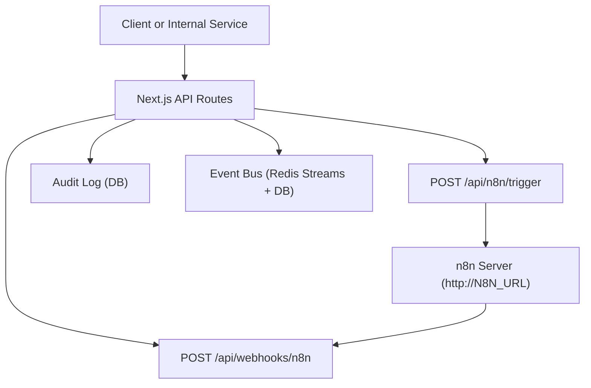
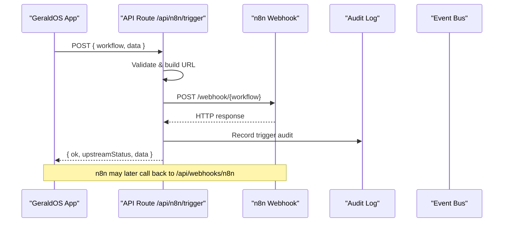
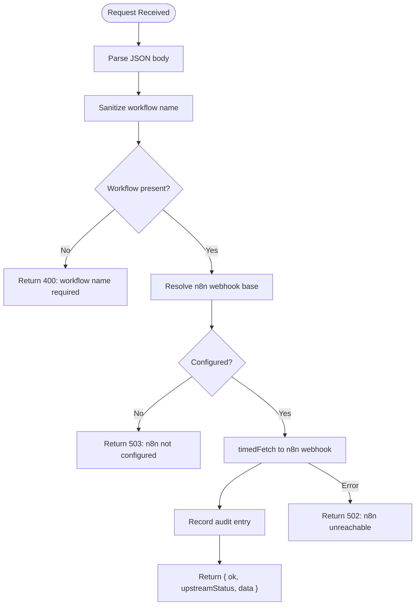
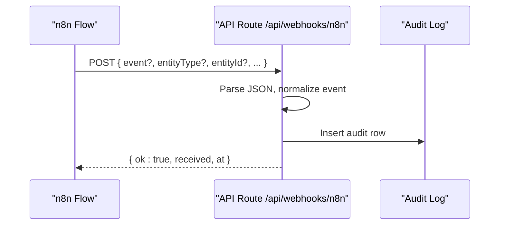
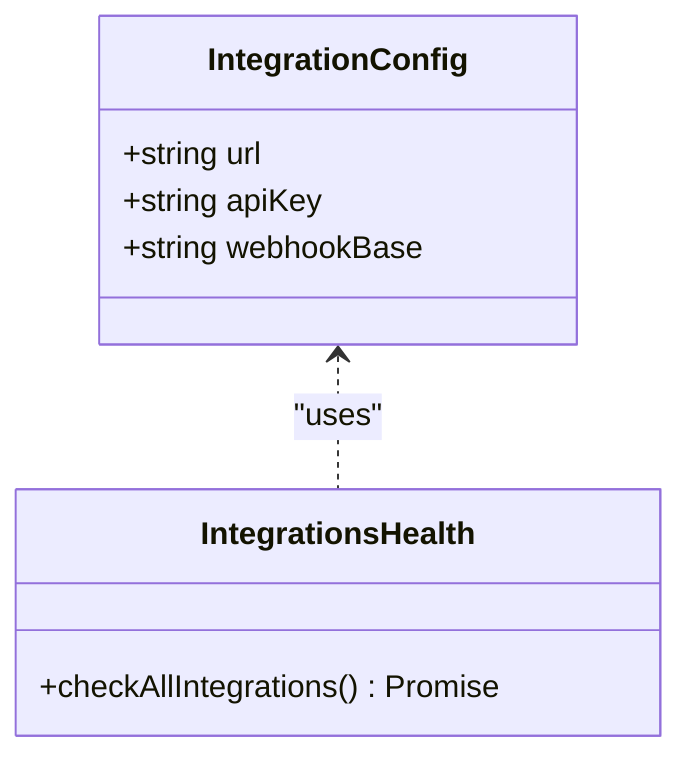
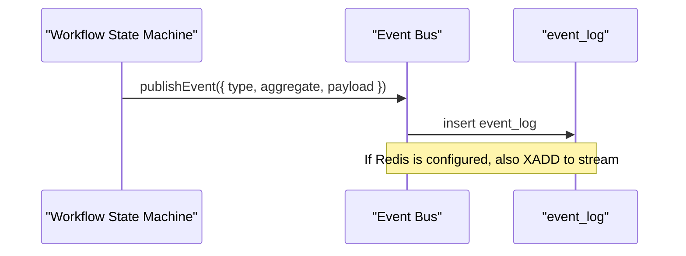
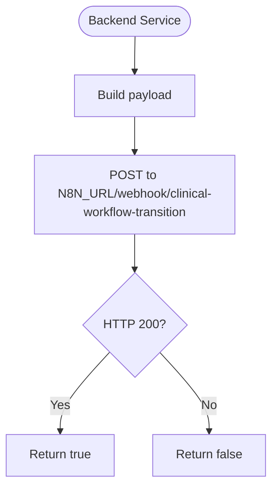
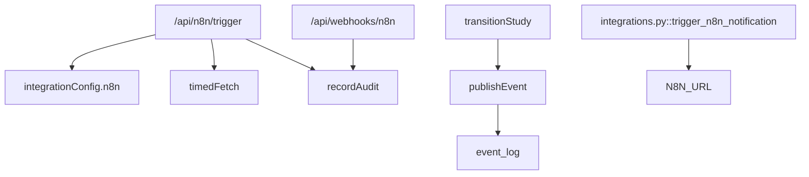

# Automation Integration (n8n)

<cite>
**Referenced Files in This Document**
- [README.md](file://README.md)
- [services/n8n.mjs](file://services/n8n.mjs)
- [src/app/api/n8n/trigger/route.ts](file://src/app/api/n8n/trigger/route.ts)
- [src/app/api/webhooks/n8n/route.ts](file://src/app/api/webhooks/n8n/route.ts)
- [src/lib/integrations/index.ts](file://src/lib/integrations/index.ts)
- [src/lib/events.ts](file://src/lib/events.ts)
- [src/lib/workflow.ts](file://src/lib/workflow.ts)
- [backend/app/core/integrations.py](file://backend/app/core/integrations.py)
- [src/db/schema.ts](file://src/db/schema.ts)
</cite>

## Table of Contents
1. Introduction
2. Project Structure
3. Core Components
4. Architecture Overview
5. Detailed Component Analysis
6. Dependency Analysis
7. Performance Considerations
8. Troubleshooting Guide
9. Security Considerations
10. Conclusion

## Introduction
This document explains how GeraldOS integrates with n8n for event-driven automation. It covers:
- Webhook triggers that start n8n workflows from the platform
- How workflow results and events flow back into GeraldOS
- Common automation scenarios such as appointment reminders, report notifications, and inventory alerts
- Error handling, retry strategies, and monitoring
- Security considerations for webhook endpoints and credential management

The integration is designed to be resilient, auditable, and observable through the platform’s event bus and audit log.

## Project Structure
GeraldOS exposes two primary integration points for n8n:
- Outbound trigger endpoint: POST /api/n8n/trigger — starts a named workflow on n8n
- Inbound webhook endpoint: POST /api/webhooks/n8n — receives events from n8n and records them in the audit log

Configuration for n8n lives in the server-side integration configuration, and health checks are included in the integrations status tooling. A lightweight local n8n mock service is provided for development.



**Diagram sources**
- [src/app/api/n8n/trigger/route.ts:7-46](file://src/app/api/n8n/trigger/route.ts#L7-L46)
- [src/app/api/webhooks/n8n/route.ts:6-27](file://src/app/api/webhooks/n8n/route.ts#L6-L27)
- [src/lib/integrations/index.ts:32-36](file://src/lib/integrations/index.ts#L32-L36)
- [src/lib/events.ts:101-131](file://src/lib/events.ts#L101-L131)
- [src/db/schema.ts:183-193](file://src/db/schema.ts#L183-L193)

**Section sources**
- [README.md:66-89](file://README.md#L66-L89)
- [src/lib/integrations/index.ts:32-36](file://src/lib/integrations/index.ts#L32-L36)

## Core Components
- Outbound trigger route: Validates input, builds the n8n webhook URL from configuration, forwards the payload, audits the call, and returns upstream status.
- Inbound webhook route: Accepts JSON payloads from n8n, normalizes an event name, and persists an audit record.
- Integration configuration: Centralized environment-based settings for n8n (URL, optional webhook base, API key).
- Event bus: Publishes domain events to Redis Streams (when configured) and always persists to the event_log table; used by workflow transitions and other modules.
- Workflow state machine: Enforces forward-only stage transitions and publishes events for each milestone.
- Backend integration helper: Python utility to trigger n8n webhooks from backend services.
- Local n8n mock: Development service exposing health, workflow list, webhook execution capture, and executions history.

**Section sources**
- [src/app/api/n8n/trigger/route.ts:7-46](file://src/app/api/n8n/trigger/route.ts#L7-L46)
- [src/app/api/webhooks/n8n/route.ts:6-27](file://src/app/api/webhooks/n8n/route.ts#L6-L27)
- [src/lib/integrations/index.ts:32-36](file://src/lib/integrations/index.ts#L32-L36)
- [src/lib/events.ts:101-131](file://src/lib/events.ts#L101-L131)
- [src/lib/workflow.ts:102-234](file://src/lib/workflow.ts#L102-L234)
- [backend/app/core/integrations.py:85-101](file://backend/app/core/integrations.py#L85-L101)
- [services/n8n.mjs:20-41](file://services/n8n.mjs#L20-L41)

## Architecture Overview
The automation architecture uses an event-driven pattern:
- Platform events (e.g., study transitions, inventory updates) can trigger n8n workflows via the outbound trigger endpoint.
- n8n workflows perform external actions (notifications, emails, vendor calls) and post results back to the inbound webhook endpoint for auditing and visibility.
- The event bus provides durable, queryable history of all automation-related events.



**Diagram sources**
- [src/app/api/n8n/trigger/route.ts:7-46](file://src/app/api/n8n/trigger/route.ts#L7-L46)
- [src/app/api/webhooks/n8n/route.ts:6-27](file://src/app/api/webhooks/n8n/route.ts#L6-L27)
- [src/lib/integrations/index.ts:71-78](file://src/lib/integrations/index.ts#L71-L78)

## Detailed Component Analysis

### Outbound Trigger Endpoint (/api/n8n/trigger)
Responsibilities:
- Parse and sanitize the workflow name
- Resolve n8n webhook base from configuration
- Forward the request to n8n with a standardized envelope
- Audit the trigger attempt and upstream status
- Return a concise result to the caller

Error handling:
- Missing workflow name returns 400
- Unconfigured n8n returns 503
- Network errors return 502 with details



**Diagram sources**
- [src/app/api/n8n/trigger/route.ts:7-46](file://src/app/api/n8n/trigger/route.ts#L7-L46)
- [src/lib/integrations/index.ts:71-78](file://src/lib/integrations/index.ts#L71-L78)

**Section sources**
- [src/app/api/n8n/trigger/route.ts:7-46](file://src/app/api/n8n/trigger/route.ts#L7-L46)
- [src/lib/integrations/index.ts:71-78](file://src/lib/integrations/index.ts#L71-L78)

### Inbound Webhook Endpoint (/api/webhooks/n8n)
Responsibilities:
- Accept JSON payloads from n8n
- Normalize the event name if missing
- Persist an audit record with module “n8n”
- Acknowledge receipt with a minimal JSON response

Security notes:
- Only accepts JSON
- Normalizes event names to prevent arbitrary action values
- All inbound events are audit-logged



**Diagram sources**
- [src/app/api/webhooks/n8n/route.ts:6-27](file://src/app/api/webhooks/n8n/route.ts#L6-L27)
- [src/db/schema.ts:183-193](file://src/db/schema.ts#L183-L193)

**Section sources**
- [src/app/api/webhooks/n8n/route.ts:6-27](file://src/app/api/webhooks/n8n/route.ts#L6-L27)

### Configuration and Health
- n8n configuration is read from environment variables and exposed via a public client config flag indicating whether n8n is enabled.
- Health checks probe the n8n /healthz endpoint and surface status and latency in the integrations dashboard.



**Diagram sources**
- [src/lib/integrations/index.ts:32-36](file://src/lib/integrations/index.ts#L32-L36)
- [src/lib/integrations/index.ts:134-216](file://src/lib/integrations/index.ts#L134-L216)

**Section sources**
- [src/lib/integrations/index.ts:32-36](file://src/lib/integrations/index.ts#L32-L36)
- [src/lib/integrations/index.ts:134-216](file://src/lib/integrations/index.ts#L134-L216)

### Event Bus and Workflow Triggers
- Workflow transitions publish events (e.g., study assigned, report released) which downstream systems or n8n flows can consume.
- Events are published to Redis Streams when available and always persisted to the event_log table for durability.



**Diagram sources**
- [src/lib/workflow.ts:180-204](file://src/lib/workflow.ts#L180-L204)
- [src/lib/events.ts:101-131](file://src/lib/events.ts#L101-L131)

**Section sources**
- [src/lib/workflow.ts:180-204](file://src/lib/workflow.ts#L180-L204)
- [src/lib/events.ts:101-131](file://src/lib/events.ts#L101-L131)

### Backend Integration Helper (Python)
- Provides a method to trigger n8n notification webhooks from backend services using the configured n8n URL.
- Returns success based on HTTP status code.



**Diagram sources**
- [backend/app/core/integrations.py:85-101](file://backend/app/core/integrations.py#L85-L101)

**Section sources**
- [backend/app/core/integrations.py:85-101](file://backend/app/core/integrations.py#L85-L101)

### Development Mock n8n Service
- Exposes /healthz, lists pre-seeded workflows, captures webhook executions, and returns recent executions.
- Useful for local testing without a full n8n instance.

```mermaid
graph LR
Dev["Local Dev Client"] --> Mock["Mock n8n Server (:5678)"]
Mock --> |GET /api/v1/workflows| List["List seeded workflows"]
Mock --> |POST /webhook/{name}| Capture["Capture execution"]
Mock --> |GET /api/v1/executions| History["Recent executions"]
```

**Diagram sources**
- [services/n8n.mjs:10-41](file://services/n8n.mjs#L10-L41)

**Section sources**
- [services/n8n.mjs:10-41](file://services/n8n.mjs#L10-L41)

## Dependency Analysis
- The trigger route depends on integration configuration and a timed fetch helper.
- The inbound webhook depends on the audit logging subsystem.
- Workflow transitions depend on the event bus and database schema for studies and reports.
- Backend integration helper depends on environment-configured n8n URL.



**Diagram sources**
- [src/app/api/n8n/trigger/route.ts:7-46](file://src/app/api/n8n/trigger/route.ts#L7-L46)
- [src/app/api/webhooks/n8n/route.ts:6-27](file://src/app/api/webhooks/n8n/route.ts#L6-L27)
- [src/lib/workflow.ts:180-204](file://src/lib/workflow.ts#L180-L204)
- [src/lib/events.ts:101-131](file://src/lib/events.ts#L101-L131)
- [backend/app/core/integrations.py:85-101](file://backend/app/core/integrations.py#L85-L101)

**Section sources**
- [src/app/api/n8n/trigger/route.ts:7-46](file://src/app/api/n8n/trigger/route.ts#L7-L46)
- [src/app/api/webhooks/n8n/route.ts:6-27](file://src/app/api/webhooks/n8n/route.ts#L6-L27)
- [src/lib/workflow.ts:180-204](file://src/lib/workflow.ts#L180-L204)
- [src/lib/events.ts:101-131](file://src/lib/events.ts#L101-L131)
- [backend/app/core/integrations.py:85-101](file://backend/app/core/integrations.py#L85-L101)

## Performance Considerations
- Use the provided timedFetch helper to avoid long-running requests to n8n; default timeouts protect the platform from slow upstreams.
- Prefer asynchronous event publishing to the event bus for non-blocking side effects.
- Keep webhook payloads small and structured to reduce network overhead and parsing costs.
- Monitor integration health endpoints to detect degraded connectivity early.

[No sources needed since this section provides general guidance]

## Troubleshooting Guide
Common issues and resolutions:
- 400 Bad Request on trigger: Ensure the workflow name is present and sanitized.
- 503 Service Unavailable: Configure N8N_URL or N8N_WEBHOOK_BASE so the trigger route can resolve the n8n webhook base.
- 502 Bad Gateway: n8n is unreachable; check network, DNS, and the n8n service health endpoint.
- Inbound webhook not recorded: Verify JSON content-type and that the event field is present or defaults to a generic event.
- Monitoring: Use the integrations status endpoint to see connected/unreachable/not_configured states and latencies for n8n.

**Section sources**
- [src/app/api/n8n/trigger/route.ts:7-46](file://src/app/api/n8n/trigger/route.ts#L7-L46)
- [src/app/api/webhooks/n8n/route.ts:6-27](file://src/app/api/webhooks/n8n/route.ts#L6-L27)
- [src/lib/integrations/index.ts:134-216](file://src/lib/integrations/index.ts#L134-L216)

## Security Considerations
- Credential storage: All service credentials remain server-side; only non-secret configuration is exposed to clients.
- Webhook validation: Inbound webhook enforces JSON-only input and normalizes event names before auditing.
- Access control: Restrict access to webhook endpoints at the reverse proxy or gateway layer (e.g., IP allowlist, mTLS) in production.
- Secrets management: Store N8N_URL, N8N_API_KEY, and other secrets in environment variables or a secrets manager; never commit to source control.
- Auditability: All inbound and outbound automation events are recorded in the audit log for traceability.

**Section sources**
- [README.md:115-121](file://README.md#L115-L121)
- [src/app/api/webhooks/n8n/route.ts:6-27](file://src/app/api/webhooks/n8n/route.ts#L6-L27)
- [src/lib/integrations/index.ts:32-36](file://src/lib/integrations/index.ts#L32-L36)

## Conclusion
GeraldOS integrates with n8n through a clean, auditable, and resilient design:
- Outbound triggers initiate workflows with validated inputs and robust error handling
- Inbound webhooks capture automation outcomes into the audit log
- The event bus ensures durable, queryable histories of automation activity
- Health checks and configuration enable operational visibility and safe deployments

Use the documented endpoints and patterns to implement reliable automations such as appointment reminders, report notifications, and inventory alerts while maintaining security and observability.