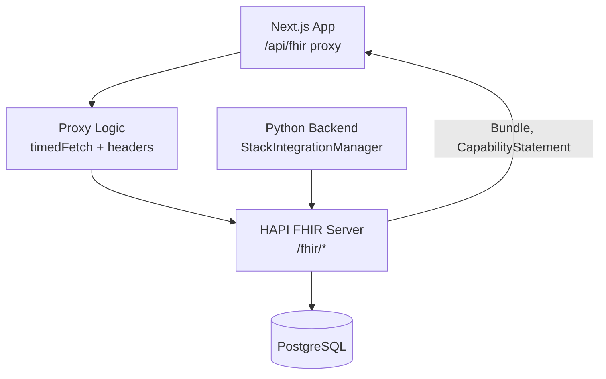
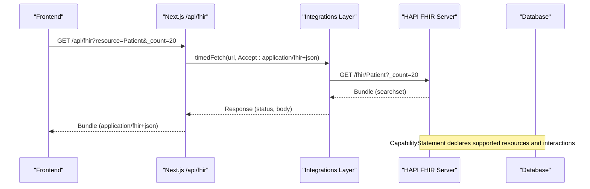
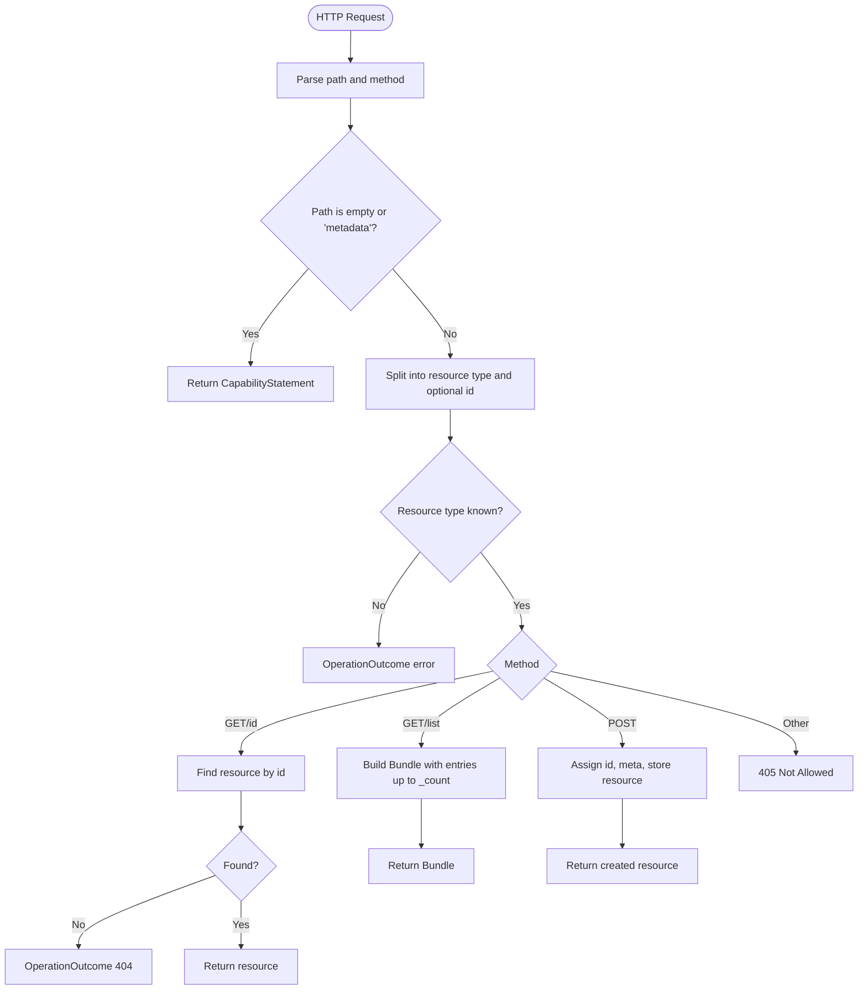
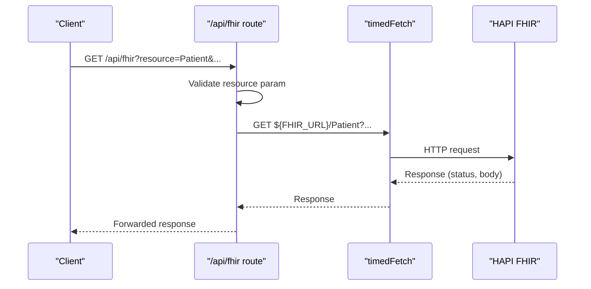
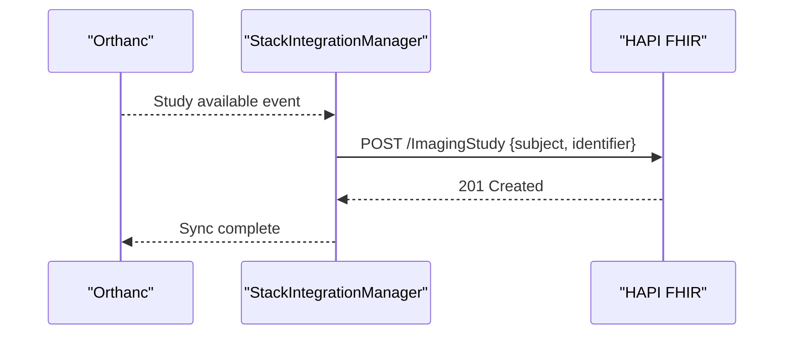
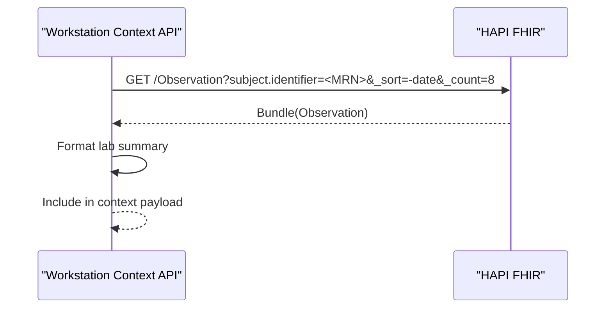
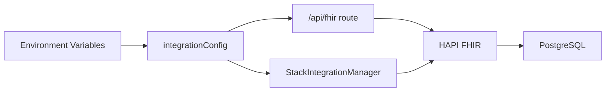

# Healthcare Data Integration (FHIR)

<cite>
**Referenced Files in This Document**
- [services/fhir.mjs](file://services/fhir.mjs)
- [src/app/api/fhir/route.ts](file://src/app/api/fhir/route.ts)
- [src/lib/integrations/index.ts](file://src/lib/integrations/index.ts)
- [backend/app/core/integrations.py](file://backend/app/core/integrations.py)
- [backend/app/core/config.py](file://backend/app/core/config.py)
- [docker-compose.yml](file://docker-compose.yml)
- [src/app/api/workstation/context/route.ts](file://src/app/api/workstation/context/route.ts)
</cite>

## Table of Contents
1. Introduction
2. Project Structure
3. Core Components
4. Architecture Overview
5. Detailed Component Analysis
6. Dependency Analysis
7. Performance Considerations
8. Troubleshooting Guide
9. Conclusion
10. Appendices

## Introduction
This document explains how the platform integrates healthcare data using FHIR with a HAPI FHIR server. It covers supported resource types, search capabilities, data exchange patterns, and practical workflows for patient registration, observation updates, and care coordination. It also addresses bundle handling, version compatibility, validation considerations, terminology services, and compliance notes relevant to healthcare standards.

## Project Structure
The FHIR integration spans several layers:
- A lightweight FHIR R4 server implementation for development and demos
- A Next.js API proxy that forwards FHIR requests to a configured HAPI FHIR endpoint
- Backend Python services that create FHIR resources from imaging events
- Configuration and health checks across the stack

**Diagram sources**
- [src/app/api/fhir/route.ts:10-38](file://src/app/api/fhir/route.ts#L10-L38)
- [src/lib/integrations/index.ts:71-78](file://src/lib/integrations/index.ts#L71-L78)
- [backend/app/core/integrations.py:60-83](file://backend/app/core/integrations.py#L60-L83)
- [docker-compose.yml:67-77](file://docker-compose.yml#L67-L77)

**Section sources**
- [services/fhir.mjs:1-54](file://services/fhir.mjs#L1-L54)
- [src/app/api/fhir/route.ts:1-39](file://src/app/api/fhir/route.ts#L1-L39)
- [src/lib/integrations/index.ts:1-267](file://src/lib/integrations/index.ts#L1-L267)
- [backend/app/core/integrations.py:1-119](file://backend/app/core/integrations.py#L1-L119)
- [backend/app/core/config.py:1-20](file://backend/app/core/config.py#L1-L20)
- [docker-compose.yml:67-77](file://docker-compose.yml#L67-L77)

## Core Components
- FHIR R4 server (development/demo): Implements metadata, read, search-type, and create interactions for a small set of resources.
- Next.js FHIR proxy: Validates and forwards GET requests to the configured HAPI FHIR URL, preserving query parameters and setting Accept headers.
- Backend integrations: Creates FHIR ImagingStudy resources when DICOM studies are available from Orthanc.
- Health checks: Probes HAPI FHIR /metadata to confirm connectivity and version.

Key responsibilities:
- Resource exposure and basic CRUD via FHIR R4 endpoints
- Secure, validated forwarding of client requests
- Cross-service synchronization between PACS and clinical records
- Operational visibility through health checks

**Section sources**
- [services/fhir.mjs:11-15](file://services/fhir.mjs#L11-L15)
- [src/app/api/fhir/route.ts:10-38](file://src/app/api/fhir/route.ts#L10-L38)
- [backend/app/core/integrations.py:60-83](file://backend/app/core/integrations.py#L60-L83)
- [src/lib/integrations/index.ts:192-204](file://src/lib/integrations/index.ts#L192-L204)

## Architecture Overview
The system uses a layered approach:
- Frontend calls Next.js API routes which act as a secure proxy to HAPI FHIR
- Backend services directly call HAPI FHIR to write clinical resources derived from imaging workflows
- The FHIR server exposes a CapabilityStatement describing supported resources and interactions
- Health checks validate FHIR availability and version

**Diagram sources**
- [src/app/api/fhir/route.ts:10-38](file://src/app/api/fhir/route.ts#L10-L38)
- [src/lib/integrations/index.ts:71-78](file://src/lib/integrations/index.ts#L71-L78)
- [services/fhir.mjs:11-15](file://services/fhir.mjs#L11-L15)

## Detailed Component Analysis

### FHIR Server (Development/Demo)
- Declares FHIR version R4 and supported formats
- Exposes CapabilityStatement listing resources and allowed interactions: read, search-type, create
- Pre-seeds Patient resources with identifiers and metadata
- Handles GET by ID or search with pagination via _count
- Handles POST to create new resources, assigning IDs and timestamps

**Diagram sources**
- [services/fhir.mjs:23-54](file://services/fhir.mjs#L23-L54)

**Section sources**
- [services/fhir.mjs:1-54](file://services/fhir.mjs#L1-L54)

### Next.js FHIR Proxy
- Reads configuration for FHIR URL
- Sanitizes resource parameter to prevent path traversal
- Forwards all other query parameters unchanged
- Sets Accept header to application/fhir+json
- Returns upstream status and content-type, or a 502 on failure

**Diagram sources**
- [src/app/api/fhir/route.ts:10-38](file://src/app/api/fhir/route.ts#L10-L38)
- [src/lib/integrations/index.ts:71-78](file://src/lib/integrations/index.ts#L71-L78)

**Section sources**
- [src/app/api/fhir/route.ts:1-39](file://src/app/api/fhir/route.ts#L1-L39)
- [src/lib/integrations/index.ts:71-78](file://src/lib/integrations/index.ts#L71-L78)

### Backend Synchronization (PACS to FHIR)
- On successful retrieval of a DICOM study from Orthanc, creates an ImagingStudy FHIR resource referencing the patient
- Posts to HAPI FHIR with appropriate Content-Type
- Returns success if status is 200 or 201

**Diagram sources**
- [backend/app/core/integrations.py:60-83](file://backend/app/core/integrations.py#L60-L83)

**Section sources**
- [backend/app/core/integrations.py:60-83](file://backend/app/core/integrations.py#L60-L83)

### Workstation Context: Laboratory Summary from FHIR
- Best-effort fetch of recent Observations for a patient by MRN
- Sorts by date descending and limits results
- Formats a concise summary for display

**Diagram sources**
- [src/app/api/workstation/context/route.ts:284-305](file://src/app/api/workstation/context/route.ts#L284-L305)

**Section sources**
- [src/app/api/workstation/context/route.ts:284-305](file://src/app/api/workstation/context/route.ts#L284-L305)

## Dependency Analysis
- Next.js proxy depends on environment-configured FHIR URL and a shared timedFetch utility
- Backend integrations depend on environment variables for service URLs
- Docker Compose defines HAPI FHIR container and its dependency on PostgreSQL
- Health checks rely on /metadata to determine FHIR version and connectivity

**Diagram sources**
- [src/lib/integrations/index.ts:8-52](file://src/lib/integrations/index.ts#L8-L52)
- [backend/app/core/config.py:4-19](file://backend/app/core/config.py#L4-L19)
- [docker-compose.yml:67-77](file://docker-compose.yml#L67-L77)

**Section sources**
- [src/lib/integrations/index.ts:8-52](file://src/lib/integrations/index.ts#L8-L52)
- [backend/app/core/config.py:4-19](file://backend/app/core/config.py#L4-L19)
- [docker-compose.yml:67-77](file://docker-compose.yml#L67-L77)

## Performance Considerations
- Use _count to limit result sets in searches to reduce payload size
- Prefer targeted queries (e.g., by subject.identifier) to minimize scan scope
- Keep timeouts reasonable; the proxy uses a default timeout for upstream calls
- Cache frequently accessed summaries at the application layer where appropriate
- Ensure HAPI FHIR database indexes align with common search patterns (e.g., subject, code, date)

## Troubleshooting Guide
Common issues and resolutions:
- FHIR not configured: The proxy returns a 503 when FHIR_URL is missing. Verify environment configuration.
- Unreachable FHIR: The proxy returns a 502 on network errors. Check network connectivity and service health.
- Unknown resource: The demo server returns OperationOutcome for unsupported resource types. Confirm resource name casing and server capability.
- Empty results: Ensure correct query parameters (e.g., subject.identifier) and that data exists in the FHIR server.
- Version mismatch: Health check reads /metadata to detect FHIR version. Align client expectations with server version.

Operational checks:
- Use /metadata to verify server readiness and version
- Validate responses include proper content-type and status codes
- Inspect logs for timeouts or malformed payloads

**Section sources**
- [src/app/api/fhir/route.ts:10-38](file://src/app/api/fhir/route.ts#L10-L38)
- [services/fhir.mjs:30-33](file://services/fhir.mjs#L30-L33)
- [src/lib/integrations/index.ts:192-204](file://src/lib/integrations/index.ts#L192-L204)

## Conclusion
The platform integrates FHIR through a robust proxy and backend synchronization layer, enabling seamless access to clinical data alongside imaging workflows. Supported resources include Patient, ImagingStudy, Coverage, DiagnosticReport, ServiceRequest, and Observation queries for laboratory summaries. The design emphasizes security, configurability, and operational visibility while maintaining alignment with FHIR R4 standards.

## Appendices

### Supported Resources and Interactions
- Resources: Patient, ImagingStudy, Coverage, DiagnosticReport, ServiceRequest
- Interactions: read, search-type, create
- Bundles: searchset responses for list operations
- Metadata: CapabilityStatement indicates supported features and format

**Section sources**
- [services/fhir.mjs:11-15](file://services/fhir.mjs#L11-L15)

### FHIR REST API Usage Examples
- Retrieve patients: GET /api/fhir?resource=Patient&_count=20
- Read a specific patient: GET /api/fhir?resource=Patient/{id}
- Create a patient: POST /api/fhir with Patient payload (via backend or direct FHIR client)
- Query observations: GET /api/fhir?resource=Observation&subject.identifier=<MRN>&_sort=-date&_count=8

Note: The Next.js proxy forwards GET requests; for writes, use backend services or a FHIR client configured with the same base URL.

**Section sources**
- [src/app/api/fhir/route.ts:10-38](file://src/app/api/fhir/route.ts#L10-L38)
- [src/app/api/workstation/context/route.ts:284-305](file://src/app/api/workstation/context/route.ts#L284-L305)

### Data Exchange Patterns
- Patient registration: Create Patient via FHIR create interaction; ensure identifiers are consistent across systems
- Observation updates: Create or update Observation resources tied to a patient; use subject references and effective dates
- Care plan synchronization: Leverage ServiceRequest and related resources to coordinate care activities; maintain references to subjects and performers

**Section sources**
- [services/fhir.mjs:46-51](file://services/fhir.mjs#L46-L51)
- [backend/app/core/integrations.py:60-83](file://backend/app/core/integrations.py#L60-L83)

### Version Compatibility
- FHIR version: R4 (4.0.1)
- Health checks read /metadata to report version
- Clients should handle standard FHIR responses and bundles per R4

**Section sources**
- [services/fhir.mjs:3](file://services/fhir.mjs#L3)
- [src/lib/integrations/index.ts:192-204](file://src/lib/integrations/index.ts#L192-L204)

### Data Validation and Terminology Services
- Validation: Implement server-side validation rules aligned with FHIR profiles and constraints; leverage HAPI FHIR validators in production deployments
- Terminology: Integrate with external terminology services (e.g., SNOMED CT, LOINC, RxNorm) for coding and normalization; ensure consistent code systems across resources
- Compliance: Follow FHIR R4 specifications, HIPAA privacy/security requirements, and organizational policies for data handling and access control

[No sources needed since this section provides general guidance]