# Imaging Integrations (Orthanc & OHIF)

<cite>
**Referenced Files in This Document**
- [orthanc.json](file://services/orthanc.json)
- [orthanc.json](file://docker/orthanc/orthanc.json)
- [app-config.js](file://ohif-config/app-config.js)
- [route.ts](file://src/app/api/orthanc/dicom-web/[...path]/route.ts)
- [route.ts](file://src/app/api/orthanc/worklist/route.ts)
- [route.ts](file://src/app/api/orthanc/studies/route.ts)
- [route.ts](file://src/app\api\orthanc\series\[id]\route.ts)
- [route.ts](file://src/app/api/orthanc/proxy/route.ts)
- [route.ts](file://src/app/api/orthanc/upload/route.ts)
- [route.ts](file://src/app/api/orthanc/storage-commitment/route.ts)
- [viewer-panel.tsx](file://src/components/workstation/viewer-panel.tsx)
- [worklist-panel.tsx](file://src/components/workstation/worklist-panel.tsx)
- [page.tsx](file://src/app/workstation/page.tsx)
- [docker-compose.yml](file://docker-compose.yml)
- [start-all.sh](file://services/start-all.sh)
</cite>

## Table of Contents
1. [Introduction](#introduction)
2. [Project Structure](#project-structure)
3. [Core Components](#core-components)
4. [Architecture Overview](#architecture-overview)
5. [Detailed Component Analysis](#detailed-component-analysis)
6. [Dependency Analysis](#dependency-analysis)
7. [Performance Considerations](#performance-considerations)
8. [Troubleshooting Guide](#troubleshooting-guide)
9. [Conclusion](#conclusion)
10. [Appendices](#appendices)

## Introduction
This document explains the medical imaging integration between Orthanc PACS and the OHIF viewer as implemented in this project. It covers:
- DICOMweb proxy implementation for QIDO-RS, WADO-RS, and STOW-RS
- Worklist management with fallback to local appointments when Orthanc is unavailable
- Study and series retrieval APIs that enrich metadata for UI workflows
- Image streaming via embedded OHIF viewer and DICOMweb endpoints
- Orthanc configuration and plugin setup
- OHIF viewer integration, viewport configuration, and study loading workflows
- Examples of query/retrieve operations and worklist synchronization
- Performance considerations for large datasets and network optimization strategies

## Project Structure
The integration spans backend API routes, frontend components, and service configurations:
- Backend Next.js API routes under src/app/api/orthanc provide a secure, same-origin proxy to Orthanc and additional orchestration for worklist, studies, series, uploads, and storage commitment
- Frontend components embed OHIF and manage viewer state, protocols, and comparison modes
- Service definitions in docker-compose.yml and scripts start Orthanc and OHIF locally
- Configuration files define Orthanc plugins and OHIF data sources

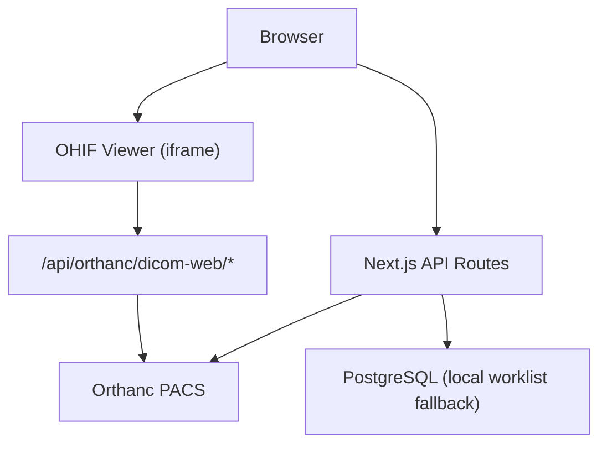

**Diagram sources**
- [route.ts:7-14](file://src/app/api/orthanc/dicom-web/[...path]/route.ts#L7-L14)
- [route.ts:16-42](file://src/app/api/orthanc/worklist/route.ts#L16-L42)
- [route.ts:20-35](file://src/app/api/orthanc/studies/route.ts#L20-L35)
- [docker-compose.yml:41-55](file://docker-compose.yml#L41-L55)
- [docker-compose.yml:95-98](file://docker-compose.yml#L95-L98)

**Section sources**
- [docker-compose.yml:41-55](file://docker-compose.yml#L41-L55)
- [docker-compose.yml:95-98](file://docker-compose.yml#L95-L98)
- [start-all.sh:18-27](file://services/start-all.sh#L18-L27)

## Core Components
- DICOMweb Proxy: A secure pass-through for QIDO-RS/WADO-RS/STOW-RS requests from OHIF to Orthanc, with path sanitization and authentication headers
- Worklist API: Returns Orthanc modality worklist entries or falls back to local scheduled appointments
- Studies API: Lists recent studies and enriches modalities by aggregating series-level metadata
- Series API: Returns expanded series detail including instances for thumbnail generation and navigation
- Upload API: Accepts DICOM files and forwards them to Orthanc via STOW-RS
- Storage Commitment API: Triggers Orthanc storage commitment job for regulatory compliance
- OHIF Integration: Embeds OHIF viewer, manages study loading, prior comparison, and protocol selection

**Section sources**
- [route.ts:7-14](file://src/app/api/orthanc/dicom-web/[...path]/route.ts#L7-L14)
- [route.ts:16-42](file://src/app/api/orthanc/worklist/route.ts#L16-L42)
- [route.ts:20-35](file://src/app/api/orthanc/studies/route.ts#L20-L35)
- [route.ts:16-33](file://src/app/api/orthanc/series/[id]/route.ts#L16-L33)
- [route.ts:8-15](file://src/app/api/orthanc/upload/route.ts#L8-L15)
- [route.ts:6-12](file://src/app/api/orthanc/storage-commitment/route.ts#L6-L12)
- [viewer-panel.tsx:6-20](file://src/components/workstation/viewer-panel.tsx#L6-L20)

## Architecture Overview
The system uses a layered architecture:
- Frontend: Next.js app hosts the radiologist workstation UI and embeds OHIF via iframe
- API Layer: Next.js routes proxy and orchestrate requests to Orthanc and local databases
- PACS Layer: Orthanc provides DICOM storage, indexing, and DICOMweb services
- Viewer Layer: OHIF renders images using WADO-RS and queries via QIDO-RS

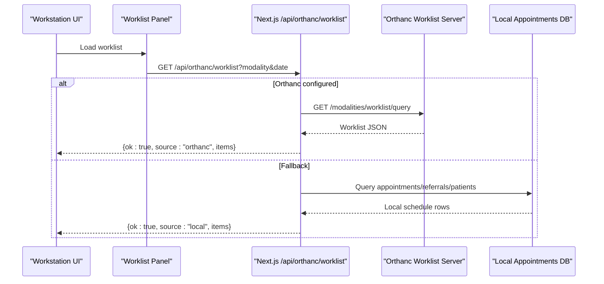

**Diagram sources**
- [route.ts:16-42](file://src/app/api/orthanc/worklist/route.ts#L16-L42)
- [route.ts:44-71](file://src/app/api/orthanc/worklist/route.ts#L44-L71)

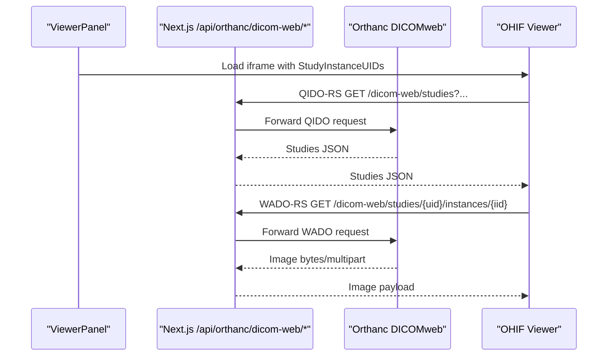

**Diagram sources**
- [route.ts:7-14](file://src/app/api/orthanc/dicom-web/[...path]/route.ts#L7-L14)
- [route.ts:15-71](file://src/app/api/orthanc/dicom-web/[...path]/route.ts#L15-L71)
- [viewer-panel.tsx:123-133](file://src/components/workstation/viewer-panel.tsx#L123-L133)

**Section sources**
- [route.ts:7-14](file://src/app/api/orthanc/dicom-web/[...path]/route.ts#L7-L14)
- [route.ts:15-71](file://src/app/api/orthanc/dicom-web/[...path]/route.ts#L15-L71)
- [viewer-panel.tsx:123-133](file://src/components/workstation/viewer-panel.tsx#L123-L133)

## Detailed Component Analysis

### DICOMweb Proxy Implementation
- Purpose: Provide a secure, same-origin endpoint for OHIF to access Orthanc DICOMweb without exposing credentials to the browser
- Behavior:
  - Sanitizes path segments to prevent traversal attacks
  - Forwards method, headers (including accept/content-type), and body for non-GET/HEAD
  - Adds authentication headers derived from environment configuration
  - Enforces timeouts and returns structured error responses on upstream failures
- Supported operations:
  - QIDO-RS: GET studies/series/instances
  - WADO-RS: GET instances/frames, multipart/related
  - STOW-RS: POST upload of DICOM instances

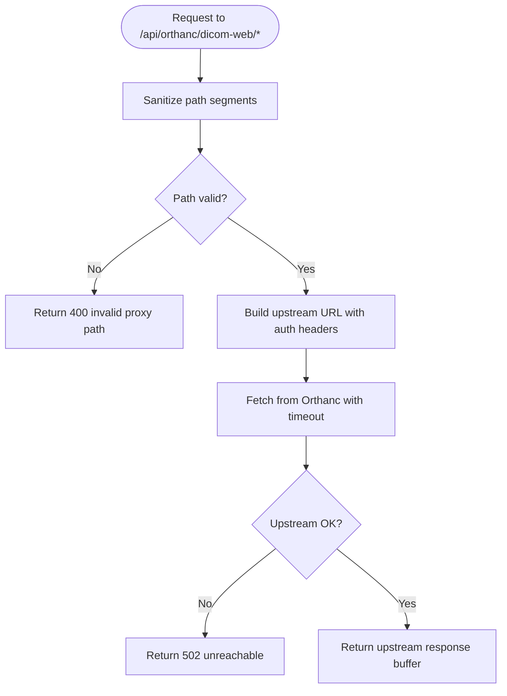

**Diagram sources**
- [route.ts:24-36](file://src/app/api/orthanc/dicom-web/[...path]/route.ts#L24-L36)
- [route.ts:49-71](file://src/app/api/orthanc/dicom-web/[...path]/route.ts#L49-L71)

**Section sources**
- [route.ts:7-14](file://src/app/api/orthanc/dicom-web/[...path]/route.ts#L7-L14)
- [route.ts:24-36](file://src/app/api/orthanc/dicom-web/[...path]/route.ts#L24-L36)
- [route.ts:49-71](file://src/app/api/orthanc/dicom-web/[...path]/route.ts#L49-L71)

### Worklist Management
- Primary flow: Query Orthanc modality worklist server with optional modality and date filters
- Fallback: If Orthanc is not configured or unreachable, query local appointments joined with patients and referrals
- Output: Normalized JSON with source indicator ("orthanc" or "local") and items list

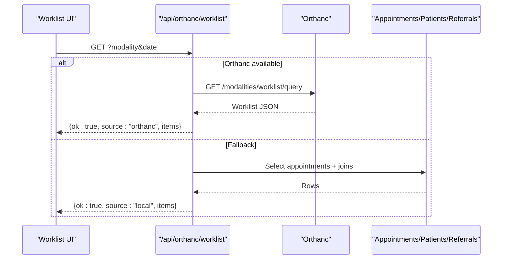

**Diagram sources**
- [route.ts:16-42](file://src/app/api/orthanc/worklist/route.ts#L16-L42)
- [route.ts:44-71](file://src/app/api/orthanc/worklist/route.ts#L44-L71)

**Section sources**
- [route.ts:16-42](file://src/app/api/orthanc/worklist/route.ts#L16-L42)
- [route.ts:44-71](file://src/app/api/orthanc/worklist/route.ts#L44-L71)

### Study Retrieval and Metadata Enrichment
- Retrieves recent studies from Orthanc with expand flags
- Aggregates series-level modalities per study to ensure consistent labels even when study-level tags are missing
- Filters out studies without patient identity to avoid unknown patients in worklist views

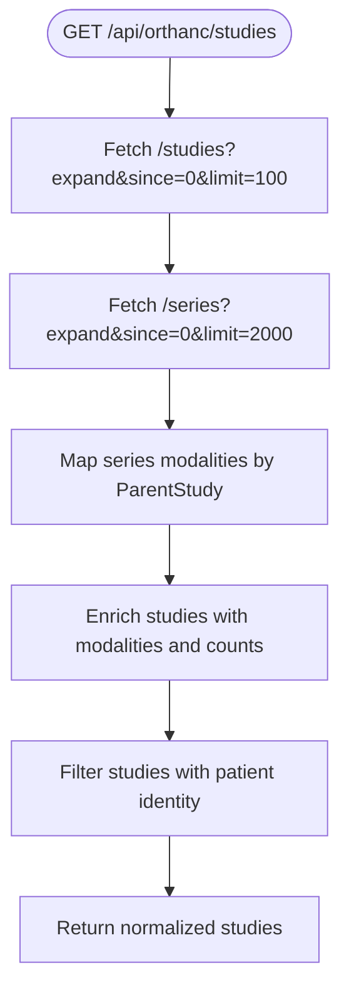

**Diagram sources**
- [route.ts:20-35](file://src/app/api/orthanc/studies/route.ts#L20-L35)
- [route.ts:40-58](file://src/app/api/orthanc/studies/route.ts#L40-L58)
- [route.ts:60-77](file://src/app/api/orthanc/studies/route.ts#L60-L77)

**Section sources**
- [route.ts:20-35](file://src/app/api/orthanc/studies/route.ts#L20-L35)
- [route.ts:40-58](file://src/app/api/orthanc/studies/route.ts#L40-L58)
- [route.ts:60-77](file://src/app/api/orthanc/studies/route.ts#L60-L77)

### Series Detail and Instance Listing
- Expands series resource to include instances and expected instance count
- Maps instance metadata (SOPInstanceUID, InstanceNumber, IndexInSeries) for thumbnails and ordering
- Provides stability flag to indicate if series is fully ingested

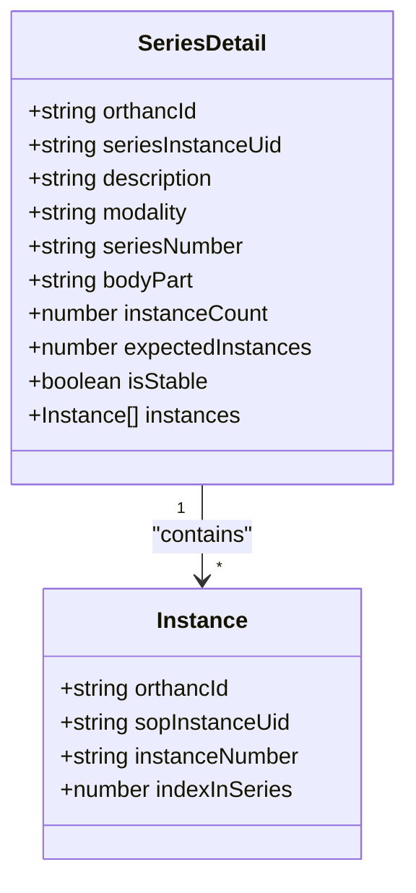

**Diagram sources**
- [route.ts:16-33](file://src/app/api/orthanc/series/[id]/route.ts#L16-L33)
- [route.ts:48-69](file://src/app/api/orthanc/series/[id]/route.ts#L48-L69)

**Section sources**
- [route.ts:16-33](file://src/app/api/orthanc/series/[id]/route.ts#L16-L33)
- [route.ts:48-69](file://src/app/api/orthanc/series/[id]/route.ts#L48-L69)

### Image Streaming and OHIF Integration
- OHIF viewer is embedded via iframe and communicates through postMessage events
- Viewer constructs stable URLs with StudyInstanceUIDs and optional prior study UIDs for comparison
- Status tracking handles loading, ready, and error states; includes timeout fallbacks
- Thumbnail generation uses Orthanc preview endpoints via a sanitized proxy route

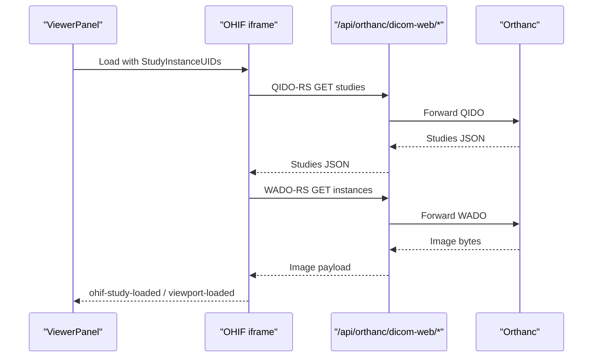

**Diagram sources**
- [viewer-panel.tsx:123-133](file://src/components/workstation/viewer-panel.tsx#L123-L133)
- [viewer-panel.tsx:136-172](file://src/components/workstation/viewer-panel.tsx#L136-L172)
- [route.ts:7-14](file://src/app/api/orthanc/dicom-web/[...path]/route.ts#L7-L14)

**Section sources**
- [viewer-panel.tsx:123-133](file://src/components/workstation/viewer-panel.tsx#L123-L133)
- [viewer-panel.tsx:136-172](file://src/components/workstation/viewer-panel.tsx#L136-L172)
- [route.ts:7-14](file://src/app/api/orthanc/dicom-web/[...path]/route.ts#L7-L14)

### Upload and Storage Commitment
- Upload: Accepts multipart form with .dcm files, validates content type, forwards to Orthanc instances endpoint, records audit and publishes event
- Storage Commitment: Retrieves study instances and triggers Orthanc storage commitment job; returns job ID and status

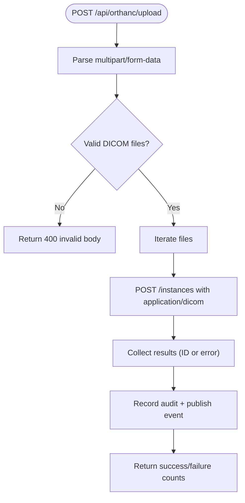

**Diagram sources**
- [route.ts:8-15](file://src/app/api/orthanc/upload/route.ts#L8-L15)
- [route.ts:20-57](file://src/app/api/orthanc/upload/route.ts#L20-L57)
- [route.ts:59-77](file://src/app/api/orthanc/upload/route.ts#L59-L77)

**Section sources**
- [route.ts:8-15](file://src/app/api/orthanc/upload/route.ts#L8-L15)
- [route.ts:20-57](file://src/app/api/orthanc/upload/route.ts#L20-L57)
- [route.ts:59-77](file://src/app/api/orthanc/upload/route.ts#L59-L77)

### Orthanc Configuration and Plugins
- Docker configuration enables DICOMweb with WADO root and sets storage/index directories
- Services configuration includes plugins for DICOMweb, folder serving, and modality worklists
- Authentication can be enabled/disabled; remote access allowed for development

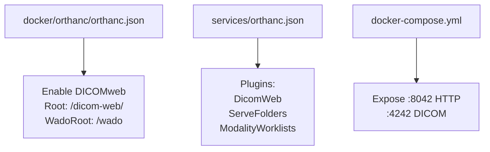

**Diagram sources**
- [orthanc.json:12-17](file://docker/orthanc/orthanc.json#L12-L17)
- [orthanc.json:10-14](file://services/orthanc.json#L10-L14)
- [docker-compose.yml:41-55](file://docker-compose.yml#L41-L55)

**Section sources**
- [orthanc.json:12-17](file://docker/orthanc/orthanc.json#L12-L17)
- [orthanc.json:10-14](file://services/orthanc.json#L10-L14)
- [docker-compose.yml:41-55](file://docker-compose.yml#L41-L55)

### OHIF Viewer Configuration
- Data sources point to the Next.js proxy at /api/orthanc/dicom-web for QIDO/WADO/STOW roots
- Enables study list and lazy loading; sets image/thumbnail rendering to wadors
- Uses worker limits and strict z-spacing for volume viewports

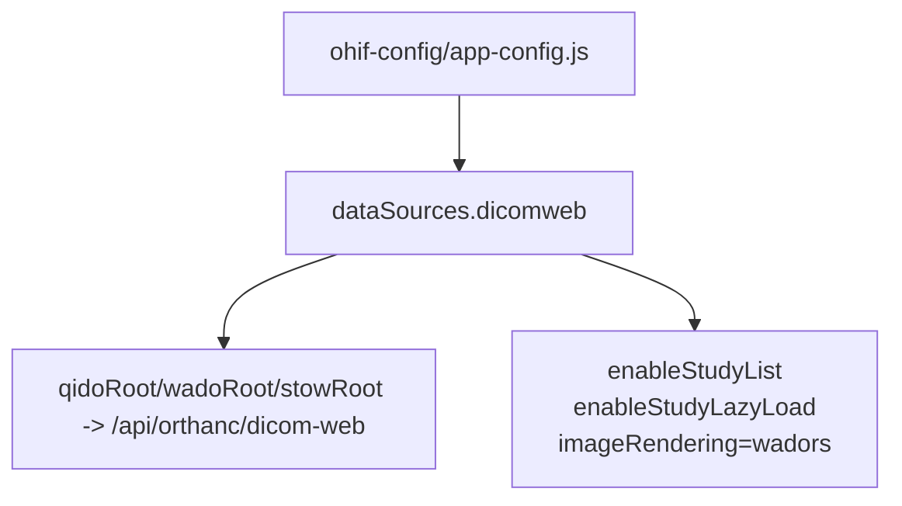

**Diagram sources**
- [app-config.js:24-45](file://ohif-config/app-config.js#L24-L45)

**Section sources**
- [app-config.js:24-45](file://ohif-config/app-config.js#L24-L45)

## Dependency Analysis
- Next.js API routes depend on environment-derived integration configuration for Orthanc URL and authentication headers
- Worklist panel depends on workstation context for selected study and open actions
- Viewer panel depends on OHIF URL configuration and emits/observes postMessage events
- Docker compose defines service dependencies and ports for Orthanc and OHIF

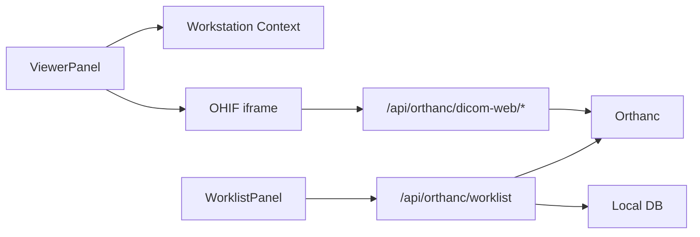

**Diagram sources**
- [viewer-panel.tsx:123-133](file://src/components/workstation/viewer-panel.tsx#L123-L133)
- [route.ts:7-14](file://src/app/api/orthanc/dicom-web/[...path]/route.ts#L7-L14)
- [route.ts:16-42](file://src/app/api/orthanc/worklist/route.ts#L16-L42)
- [docker-compose.yml:41-55](file://docker-compose.yml#L41-L55)

**Section sources**
- [viewer-panel.tsx:123-133](file://src/components/workstation/viewer-panel.tsx#L123-L133)
- [route.ts:7-14](file://src/app/api/orthanc/dicom-web/[...path]/route.ts#L7-L14)
- [route.ts:16-42](file://src/app/api/orthanc/worklist/route.ts#L16-L42)
- [docker-compose.yml:41-55](file://docker-compose.yml#L41-L55)

## Performance Considerations
- Network Optimization:
  - Use same-origin proxy to avoid CORS overhead and keep credentials server-side
  - Apply timeouts to upstream calls to prevent hanging requests
  - Prefer WADO-RS for streaming images; leverage Orthanc’s WADO endpoints for efficient delivery
- Large Dataset Handling:
  - Limit study/series fetch sizes (e.g., limit=100/2000) to reduce payload size
  - Aggregate modalities from series to avoid repeated lookups
  - Enable lazy loading in OHIF to defer heavy computations until needed
- Rendering Efficiency:
  - Configure maxNumberOfWebWorkers appropriately for client performance
  - Use strictZSpacingForVolumeViewport to improve volume rendering accuracy
  - Use thumbnails via preview endpoints for series navigation
- Caching Strategy:
  - Disable caching on proxy responses to ensure fresh metadata
  - Rely on browser cache for static assets; avoid caching dynamic DICOM payloads

[No sources needed since this section provides general guidance]

## Troubleshooting Guide
- Orthanc Unreachable:
  - Symptom: 502 errors from DICOMweb proxy
  - Check: Orthanc health endpoint and port exposure in docker-compose
  - Action: Verify ORTHANC_URL and authentication headers configuration
- Worklist Empty:
  - Symptom: No entries in worklist panel
  - Check: Orthanc worklist server availability or local appointments data
  - Action: Confirm modality/date filters and database schema integrity
- OHIF Not Loading:
  - Symptom: Viewer shows error or placeholder
  - Check: OHIF_URL configuration and iframe origin validation
  - Action: Ensure DICOMweb endpoints are reachable via proxy and study UIDs are valid
- Upload Failures:
  - Symptom: Invalid multipart body or upstream HTTP errors
  - Check: File extensions and content types; Orthanc instances endpoint
  - Action: Validate DICOM files and retry upload

**Section sources**
- [route.ts:49-71](file://src/app/api/orthanc/dicom-web/[...path]/route.ts#L49-L71)
- [route.ts:16-42](file://src/app/api/orthanc/worklist/route.ts#L16-L42)
- [viewer-panel.tsx:543-592](file://src/components/workstation/viewer-panel.tsx#L543-L592)
- [route.ts:20-57](file://src/app/api/orthanc/upload/route.ts#L20-L57)

## Conclusion
This integration provides a robust bridge between Orthanc PACS and the OHIF viewer through a secure Next.js API layer. It supports full DICOMweb workflows, flexible worklist sourcing, enriched study metadata, and efficient image streaming. The design emphasizes security (same-origin proxy), resilience (fallbacks and timeouts), and performance (lazy loading and limited payloads). With clear configuration points and comprehensive error handling, it offers a solid foundation for radiology workflows.

[No sources needed since this section summarizes without analyzing specific files]

## Appendices

### Example Operations

- QIDO-RS Query Studies:
  - Endpoint: GET /api/orthanc/dicom-web/studies?PatientName=&ModalityInStudy=CT
  - Behavior: Proxies to Orthanc QIDO endpoint; returns studies JSON
  - Source: [route.ts:7-14](file://src/app/api/orthanc/dicom-web/[...path]/route.ts#L7-L14)

- WADO-RS Retrieve Instance:
  - Endpoint: GET /api/orthanc/dicom-web/studies/{studyUID}/series/{seriesUID}/instances/{instanceUID}
  - Behavior: Streams image bytes from Orthanc WADO endpoint
  - Source: [route.ts:49-71](file://src/app/api/orthanc/dicom-web/[...path]/route.ts#L49-L71)

- STOW-RS Upload:
  - Endpoint: POST /api/orthanc/upload with multipart/form-data field "files"
  - Behavior: Validates DICOM files and forwards to Orthanc instances endpoint
  - Source: [route.ts:8-15](file://src/app/api/orthanc/upload/route.ts#L8-L15)

- Worklist Synchronization:
  - Endpoint: GET /api/orthanc/worklist?modality=CT&date=YYYY-MM-DD
  - Behavior: Queries Orthanc worklist or falls back to local appointments
  - Source: [route.ts:16-42](file://src/app/api/orthanc/worklist/route.ts#L16-L42)

- Storage Commitment:
  - Endpoint: POST /api/orthanc/storage-commitment with { studyId }
  - Behavior: Retrieves instances and triggers Orthanc storage commitment job
  - Source: [route.ts:6-12](file://src/app/api/orthanc/storage-commitment/route.ts#L6-L12)

**Section sources**
- [route.ts:7-14](file://src/app/api/orthanc/dicom-web/[...path]/route.ts#L7-L14)
- [route.ts:49-71](file://src/app/api/orthanc/dicom-web/[...path]/route.ts#L49-L71)
- [route.ts:8-15](file://src/app/api/orthanc/upload/route.ts#L8-L15)
- [route.ts:16-42](file://src/app/api/orthanc/worklist/route.ts#L16-L42)
- [route.ts:6-12](file://src/app/api/orthanc/storage-commitment/route.ts#L6-L12)