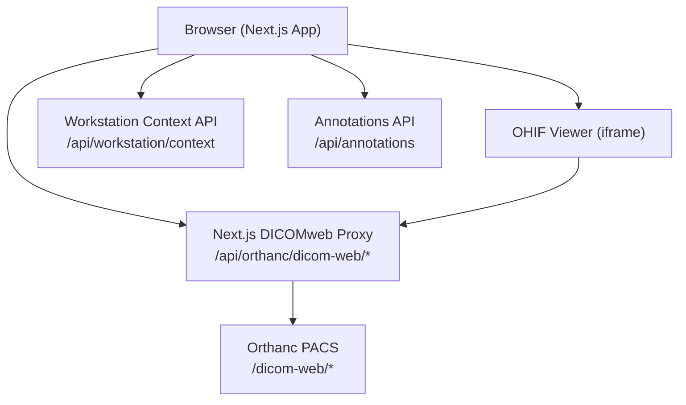
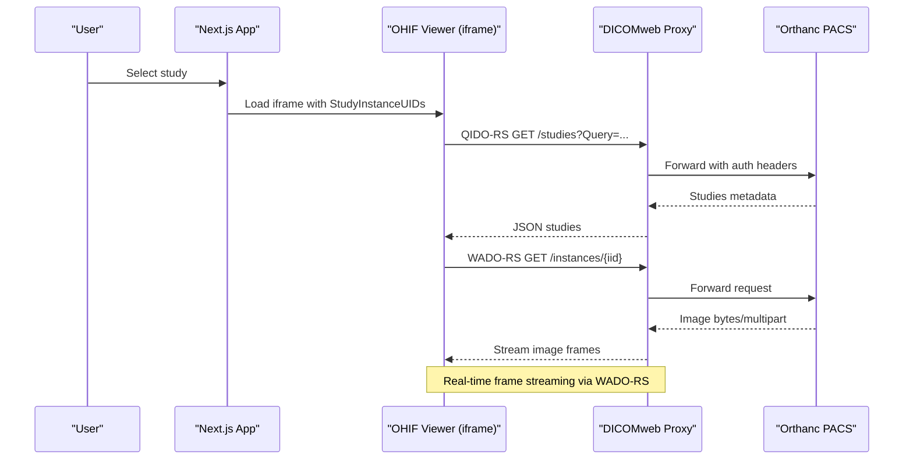
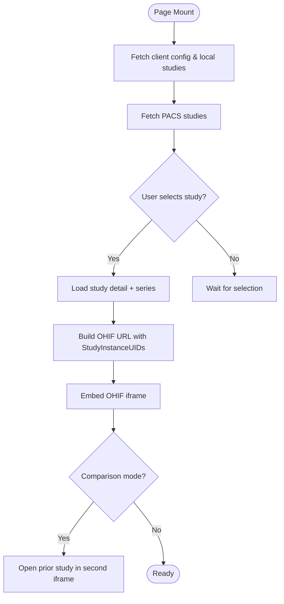
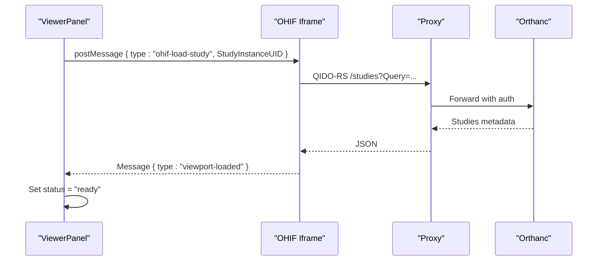
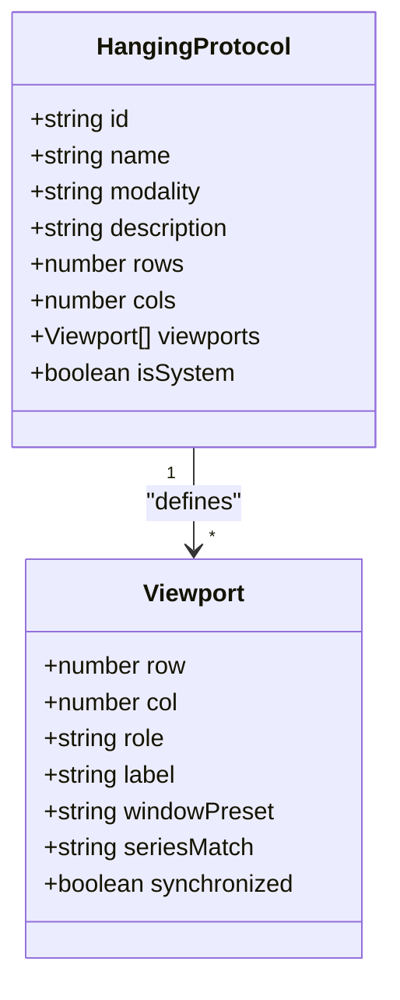
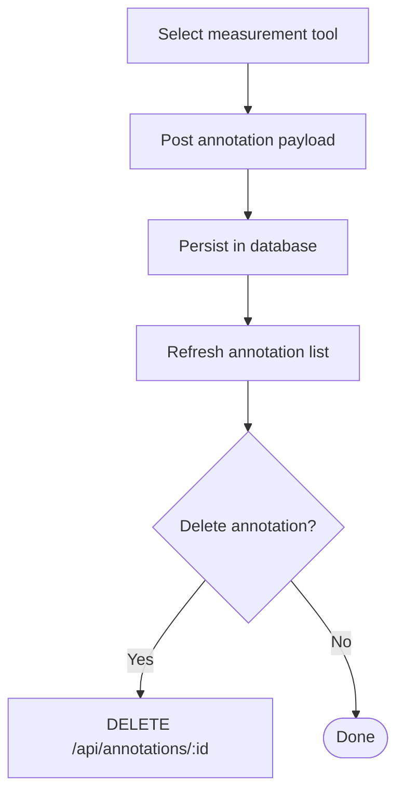
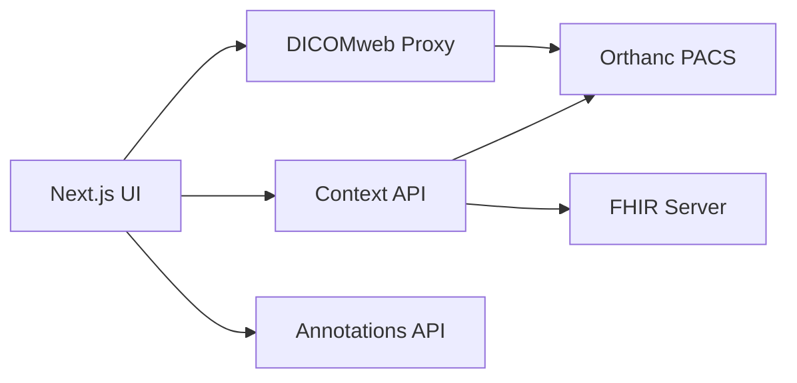

# OHIF Viewer Integration

<cite>
**Referenced Files in This Document**
- [app-config.js](file://ohif-config/app-config.js)
- [route.ts (DICOMweb proxy)](file://src/app/api/orthanc/dicom-web/[...path]/route.ts)
- [page.tsx (Imaging page)](file://src/app/imaging/page.tsx)
- [viewer-panel.tsx](file://src/components/workstation/viewer-panel.tsx)
- [hanging-protocols.ts](file://src/lib/hanging-protocols.ts)
- [route.ts (Workstation context)](file://src/app/api/workstation/context/route.ts)
- [route.ts (Annotations)](file://src/app/api/annotations/route.ts)
- [docker-compose.yml](file://docker-compose.yml)
- [orthanc.json](file://services/orthanc.json)
</cite>

## Table of Contents
1. Introduction
2. Project Structure
3. Core Components
4. Architecture Overview
5. Detailed Component Analysis
6. Dependency Analysis
7. Performance Considerations
8. Troubleshooting Guide
9. Conclusion

## Introduction
This document explains how the application integrates the OHIF medical imaging viewer to load, display, and interact with DICOM studies from Orthanc via DICOMweb. It covers viewer configuration, viewport setup, study loading workflows, WADO-RS/QIDO-RS integration, real-time streaming considerations, measurement and annotation handling, multi-modality support through hanging protocols, and performance and compatibility guidance for large datasets and modern browsers.

## Project Structure
The integration spans a Next.js frontend, an embedded OHIF viewer instance, and a secure server-side DICOMweb proxy to Orthanc:
- OHIF configuration defines data sources and rendering modes pointing at the same-origin proxy.
- The Next.js app embeds OHIF via iframe(s), manages study selection, prior comparison, and UI state.
- A server-side route proxies all DICOMweb traffic (QIDO-RS/WADO-RS/STOW-RS) to Orthanc with authentication headers and CORS-safe responses.
- Hanging protocols define modality-specific layouts and viewport roles (current/prior).
- Worklist and context APIs enrich the radiologist workspace with patient history, previous studies, and AI observations.

**Diagram sources**
- [route.ts (DICOMweb proxy):1-104](file://src/app/api/orthanc/dicom-web/[...path]/route.ts#L1-L104)
- [page.tsx (Imaging page):150-235](file://src/app/imaging/page.tsx#L150-L235)
- [viewer-panel.tsx:123-202](file://src/components/workstation/viewer-panel.tsx#L123-L202)
- [route.ts (Workstation context):35-309](file://src/app/api/workstation/context/route.ts#L35-L309)
- [route.ts (Annotations):1-58](file://src/app/api/annotations/route.ts#L1-L58)

**Section sources**
- [app-config.js:13-48](file://ohif-config/app-config.js#L13-L48)
- [route.ts (DICOMweb proxy):15-71](file://src/app/api/orthanc/dicom-web/[...path]/route.ts#L15-L71)
- [page.tsx (Imaging page):132-235](file://src/app/imaging/page.tsx#L132-L235)
- [viewer-panel.tsx:123-202](file://src/components/workstation/viewer-panel.tsx#L123-L202)

## Core Components
- OHIF Configuration: Defines default data source name, DICOMweb roots, rendering mode, and feature flags such as lazy loading and study list visibility.
- DICOMweb Proxy: Same-origin pass-through that forwards QIDO-RS/WADO-RS/STOW-RS requests to Orthanc with authentication headers and safe path handling.
- Imaging Page: Loads client config, fetches PACS studies, selects a study, builds OHIF URLs, and embeds the viewer in an iframe; supports comparison mode.
- Viewer Panel: Production-grade embedding with postMessage communication, status tracking, protocol-driven layout, series navigation, and AI overlay toggles.
- Hanging Protocols: Built-in and custom protocols per modality, defining grid rows/columns, viewport roles (current/prior), window presets, and synchronization hints.
- Workstation Context API: Aggregates patient demographics, referral info, previous studies (from Orthanc and RIS), previous reports, teaching files, similar cases, and FHIR lab summaries.
- Annotations API: Persists measurements and annotations linked to studies or series.

**Section sources**
- [app-config.js:13-48](file://ohif-config/app-config.js#L13-L48)
- [route.ts (DICOMweb proxy):15-71](file://src/app/api/orthanc/dicom-web/[...path]/route.ts#L15-L71)
- [page.tsx (Imaging page):132-235](file://src/app/imaging/page.tsx#L132-L235)
- [viewer-panel.tsx:62-202](file://src/components/workstation/viewer-panel.tsx#L62-L202)
- [hanging-protocols.ts:47-147](file://src/lib/hanging-protocols.ts#L47-L147)
- [route.ts (Workstation context):35-309](file://src/app/api/workstation/context/route.ts#L35-L309)
- [route.ts (Annotations):1-58](file://src/app/api/annotations/route.ts#L1-L58)

## Architecture Overview
The system uses a secure, same-origin proxy pattern to keep DICOMweb credentials server-side while enabling the browser-based OHIF viewer to retrieve images efficiently.

**Diagram sources**
- [route.ts (DICOMweb proxy):15-71](file://src/app/api/orthanc/dicom-web/[...path]/route.ts#L15-L71)
- [viewer-panel.tsx:123-202](file://src/components/workstation/viewer-panel.tsx#L123-L202)
- [page.tsx (Imaging page):150-235](file://src/app/imaging/page.tsx#L150-L235)

## Detailed Component Analysis

### OHIF Viewer Configuration
- Data source is set to a named DICOMweb source with friendly and internal names.
- All DICOMweb roots (WADO, QIDO, STOW) point to the Next.js proxy to avoid CORS and protect credentials.
- Rendering is configured to use WADO-RS for both images and thumbnails.
- Lazy loading and study list are enabled to optimize initial load and browsing.

**Section sources**
- [app-config.js:13-48](file://ohif-config/app-config.js#L13-L48)

### DICOMweb Proxy Implementation
- Validates environment configuration and rejects unsafe paths.
- Forwards method, headers, and body to Orthanc’s /dicom-web endpoint.
- Returns binary responses for image streams and sets CORS headers for cross-origin iframe access.
- Handles errors with descriptive messages and appropriate HTTP status codes.

**Section sources**
- [route.ts (DICOMweb proxy):15-71](file://src/app/api/orthanc/dicom-web/[...path]/route.ts#L15-L71)

### Study Loading Workflow (Imaging Page)
- Fetches client configuration and local workflow studies on mount.
- Retrieves PACS studies via a dedicated endpoint and updates connection status.
- On study selection, loads study detail and populates series information.
- Builds OHIF viewer URL using StudyInstanceUIDs and optional comparison UID.
- Embeds the viewer in an iframe and provides comparison mode by opening a second viewer instance.

**Diagram sources**
- [page.tsx (Imaging page):132-235](file://src/app/imaging/page.tsx#L132-L235)

**Section sources**
- [page.tsx (Imaging page):132-235](file://src/app/imaging/page.tsx#L132-L235)

### Embedded Viewer Panel and PostMessage Communication
- Maintains OHIF status states: idle, loading, ready, error.
- Listens for OHIF messages indicating study loaded, viewport changed, or errors occurred.
- Sends postMessage commands to trigger study loading in the OHIF iframe when the selected study changes.
- Supports single-study and comparison modes with synchronized scrolling and linked window/level controls.
- Provides toolbar buttons for tools like window/level, zoom, pan, crosshair, cine playback, MPR, and 2D/3D modes.

**Diagram sources**
- [viewer-panel.tsx:123-202](file://src/components/workstation/viewer-panel.tsx#L123-L202)
- [route.ts (DICOMweb proxy):15-71](file://src/app/api/orthanc/dicom-web/[...path]/route.ts#L15-L71)

**Section sources**
- [viewer-panel.tsx:62-202](file://src/components/workstation/viewer-panel.tsx#L62-L202)

### Hanging Protocols and Multi-Modality Support
- Built-in protocols cover CT chest, CT brain, mammography, ultrasound, and X-ray with current/prior viewport roles.
- Window presets include Lung, Mediastinum, Bone, Brain, Soft Tissue, Abdomen, Pelvis, Angio, Auto.
- Custom protocols can be created and persisted in localStorage, merged with built-ins at runtime.
- Protocol selection drives grid layout and viewport labels; prior viewports can be linked for side-by-side comparison.

**Diagram sources**
- [hanging-protocols.ts:13-32](file://src/lib/hanging-protocols.ts#L13-L32)
- [hanging-protocols.ts:47-147](file://src/lib/hanging-protocols.ts#L47-L147)

**Section sources**
- [hanging-protocols.ts:47-147](file://src/lib/hanging-protocols.ts#L47-L147)
- [viewer-panel.tsx:245-456](file://src/components/workstation/viewer-panel.tsx#L245-L456)

### Measurement Tools and Annotation Handling
- The UI exposes tool selection for length, angle, area, arrow, and text measurements.
- Saved annotations are posted to the backend with tool, label, and structured data.
- Annotations are stored per study or series and can be retrieved, updated, or deleted.
- Audit logging records creation events for traceability.

**Diagram sources**
- [page.tsx (Imaging page):255-277](file://src/app/imaging/page.tsx#L255-L277)
- [route.ts (Annotations):1-58](file://src/app/api/annotations/route.ts#L1-L58)

**Section sources**
- [page.tsx (Imaging page):255-277](file://src/app/imaging/page.tsx#L255-L277)
- [route.ts (Annotations):1-58](file://src/app/api/annotations/route.ts#L1-L58)

### Worklist and Context Enrichment
- The workstation context API aggregates patient demographics, referral details, previous studies from Orthanc and RIS, previous reports, knowledge documents, similar cases, and FHIR lab summaries.
- Graceful degradation ensures the UI remains functional even if some services are unavailable.

**Section sources**
- [route.ts (Workstation context):35-309](file://src/app/api/workstation/context/route.ts#L35-L309)

### DICOM Web Services Integration (QIDO-RS, WADO-RS, STOW-RS)
- QIDO-RS: Used to query studies and series metadata for listing and filtering.
- WADO-RS: Used to retrieve image instances and stream frames for real-time viewing.
- STOW-RS: Supported for uploads via the proxy (POST to /instances).
- The proxy enforces safe path handling, forwards authentication headers, and returns binary payloads for image streams.

**Section sources**
- [route.ts (DICOMweb proxy):15-71](file://src/app/api/orthanc/dicom-web/[...path]/route.ts#L15-L71)

## Dependency Analysis
- Frontend components depend on the DICOMweb proxy for all image retrieval and metadata queries.
- OHIF viewer depends on the configured data source roots to communicate with the proxy.
- Hanging protocols influence viewer layout and prior study linkage.
- Worklist and context APIs depend on Orthanc and RIS/FHIR integrations to enrich the radiologist workspace.

**Diagram sources**
- [route.ts (DICOMweb proxy):15-71](file://src/app/api/orthanc/dicom-web/[...path]/route.ts#L15-L71)
- [route.ts (Workstation context):35-309](file://src/app/api/workstation/context/route.ts#L35-L309)

**Section sources**
- [route.ts (DICOMweb proxy):15-71](file://src/app/api/orthanc/dicom-web/[...path]/route.ts#L15-L71)
- [route.ts (Workstation context):35-309](file://src/app/api/workstation/context/route.ts#L35-L309)

## Performance Considerations
- Use WADO-RS streaming for efficient frame delivery and reduce memory pressure by avoiding full downloads.
- Enable study lazy loading in OHIF configuration to defer heavy operations until needed.
- Limit concurrent web workers to balance CPU usage and responsiveness.
- Prefer thumbnail rendering via WADO-RS previews to speed up series lists.
- Cache metadata where appropriate and avoid redundant queries by leveraging stable UIDs.
- Monitor network timeouts and implement retry logic for transient failures.
- Optimize large dataset navigation by paginating series and limiting initial loads.

[No sources needed since this section provides general guidance]

## Troubleshooting Guide
- No OHIF configured: Ensure OHIF_URL is set and accessible; the UI will show placeholder mode otherwise.
- DICOMweb proxy unreachable: Check ORTHANC_URL and network connectivity; the proxy returns detailed error messages on failure.
- Authentication issues: Verify Orthanc credentials and ensure the proxy injects correct headers.
- CORS errors: Confirm the proxy sets appropriate CORS headers and that the OHIF origin matches the configured base.
- Viewer not loading: Inspect postMessage communication and OHIF status; use the retry action to reload the iframe.
- Annotations save failures: Validate required fields (tool and data) and check database connectivity.

**Section sources**
- [viewer-panel.tsx:527-592](file://src/components/workstation/viewer-panel.tsx#L527-L592)
- [route.ts (DICOMweb proxy):15-71](file://src/app/api/orthanc/dicom-web/[...path]/route.ts#L15-L71)
- [route.ts (Annotations):1-58](file://src/app/api/annotations/route.ts#L1-L58)

## Conclusion
The integration combines a secure DICOMweb proxy, a configurable OHIF viewer, and rich workstation features to deliver a robust medical imaging experience. By leveraging WADO-RS streaming, hanging protocols, and context enrichment, the system supports efficient navigation, multi-modality workflows, and collaborative review. Proper configuration, performance tuning, and troubleshooting practices ensure reliable operation across diverse environments and large datasets.