# Orthanc PACS Integration

<cite>
**Referenced Files in This Document**
- [docker-compose.yml](file://docker-compose.yml)
- [services/orthanc.json](file://services/orthanc.json)
- [docker/orthanc/orthanc.json](file://docker/orthanc/orthanc.json)
- [src/app/api/orthanc/dicom-web/[...path]/route.ts](file://src/app/api/orthanc/dicom-web/[...path]/route.ts)
- [src/app/api/orthanc/worklist/route.ts](file://src/app/api/orthanc/worklist/route.ts)
- [src/app/api/orthanc/studies/route.ts](file://src/app/api/orthanc/studies/route.ts)
- [src/app/api/orthanc/series/[id]/route.ts](file://src/app/api/orthanc/series/[id]/route.ts)
- [src/app/api/orthanc/patients/[id]/route.ts](file://src/app/api/orthanc/patients/[id]/route.ts)
- [src/app/api/orthanc/proxy/route.ts](file://src/app/api/orthanc/proxy/route.ts)
- [src/app/api/orthanc/upload/route.ts](file://src/app/api/orthanc/upload/route.ts)
- [src/app/api/orthanc/storage-commitment/route.ts](file://src/app/api/orthanc/storage-commitment/route.ts)
- [src/app/api/orthanc/routing/route.ts](file://src/app/api/orthanc/routing/route.ts)
- [src/app/api/worklist/route.ts](file://src/app/api/worklist/route.ts)
- [src/app/api/worklist/facets/route.ts](file://src/app/api/worklist/facets/route.ts)
- [README.md](file://README.md)
</cite>

## Table of Contents
1. Introduction
2. Project Structure
3. Core Components
4. Architecture Overview
5. Detailed Component Analysis
6. Dependency Analysis
7. Performance Considerations
8. Troubleshooting Guide
9. Conclusion

## Introduction
This document explains the Orthanc PACS integration within the platform. It covers configuration, DICOM web services proxying, worklist management, and study/series retrieval APIs. It also outlines how C-STORE, C-FIND, and C-MOVE are supported via Orthanc’s REST and DICOMweb endpoints, how metadata is handled, and how image streaming is optimized through a secure server-side proxy. Examples include worklist synchronization, patient data queries, and study browsing workflows. Finally, it addresses performance considerations for large datasets, network timeouts, and error recovery strategies.

## Project Structure
The integration spans three layers:
- Deployment and configuration: Docker Compose defines the Orthanc service; Orthanc JSON files configure storage, ports, plugins, and DICOMweb roots.
- Next.js API routes: Provide secure server-side proxies to Orthanc REST and DICOMweb endpoints, plus specialized endpoints for worklist, studies, series, patients, uploads, routing, and storage commitment.
- Worklist and facets: A local enterprise worklist endpoint aggregates scheduling data and can fall back to Orthanc’s Modality Worklist when configured.

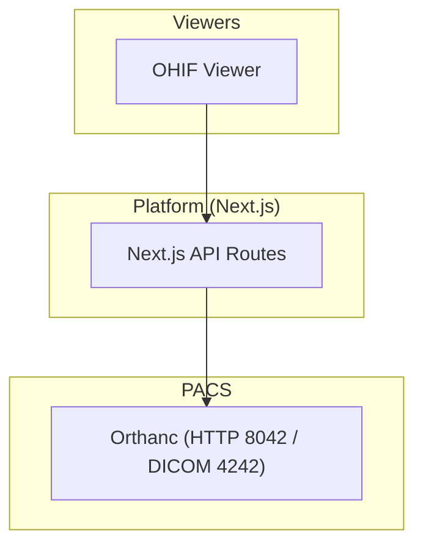

**Diagram sources**
- [docker-compose.yml:41-55](file://docker-compose.yml#L41-L55)
- [src/app/api/orthanc/dicom-web/[...path]/route.ts:15-70](file://src/app/api/orthanc/dicom-web/[...path]/route.ts#L15-L70)

**Section sources**
- [docker-compose.yml:41-55](file://docker-compose.yml#L41-L55)
- [services/orthanc.json:1-16](file://services/orthanc.json#L1-L16)
- [docker/orthanc/orthanc.json:1-21](file://docker/orthanc/orthanc.json#L1-L21)
- [README.md:66-89](file://README.md#L66-L89)

## Core Components
- DICOMweb proxy: A catch-all route forwards QIDO-RS, WADO-RS, and STOW-RS requests to Orthanc with sanitized paths and server-side authentication headers.
- Worklist: Proxies Orthanc’s Modality Worklist query or falls back to local scheduled appointments if Orthanc is unavailable.
- Studies and Series APIs: Aggregate expanded study and series metadata from Orthanc, enriching modalities and instance counts for UI consumption.
- Patient API: Returns patient metadata and study summary by fetching Orthanc patient and patient-studies endpoints concurrently.
- Upload: Accepts multipart DICOM files and forwards them to Orthanc instances endpoint, auditing and publishing events on success.
- Routing: Sends a study to a target modality or peer via Orthanc’s modalities/peers store endpoints (C-STORE).
- Storage Commitment: Initiates a storage commitment job for a study’s instances via Orthanc’s storage-commitment endpoint.
- Generic Proxy: A sanitized pass-through for arbitrary Orthanc REST resources.

**Section sources**
- [src/app/api/orthanc/dicom-web/[...path]/route.ts:15-70](file://src/app/api/orthanc/dicom-web/[...path]/route.ts#L15-L70)
- [src/app/api/orthanc/worklist/route.ts:16-79](file://src/app/api/orthanc/worklist/route.ts#L16-L79)
- [src/app/api/orthanc/studies/route.ts:20-85](file://src/app/api/orthanc/studies/route.ts#L20-L85)
- [src/app/api/orthanc/series/[id]/route.ts:17-76](file://src/app/api/orthanc/series/[id]/route.ts#L17-L76)
- [src/app/api/orthanc/patients/[id]/route.ts:7-63](file://src/app/api/orthanc/patients/[id]/route.ts#L7-L63)
- [src/app/api/orthanc/upload/route.ts:16-78](file://src/app/api/orthanc/upload/route.ts#L16-L78)
- [src/app/api/orthanc/routing/route.ts:15-68](file://src/app/api/orthanc/routing/route.ts#L15-L68)
- [src/app/api/orthanc/storage-commitment/route.ts:13-79](file://src/app/api/orthanc/storage-commitment/route.ts#L13-L79)
- [src/app/api/orthanc/proxy/route.ts:7-33](file://src/app/api/orthanc/proxy/route.ts#L7-L33)

## Architecture Overview
The platform acts as a secure gateway between browsers/viewers and Orthanc. All PACS credentials remain server-side. The DICOMweb proxy ensures same-origin access for viewers, while specialized endpoints provide curated views over Orthanc’s REST API.

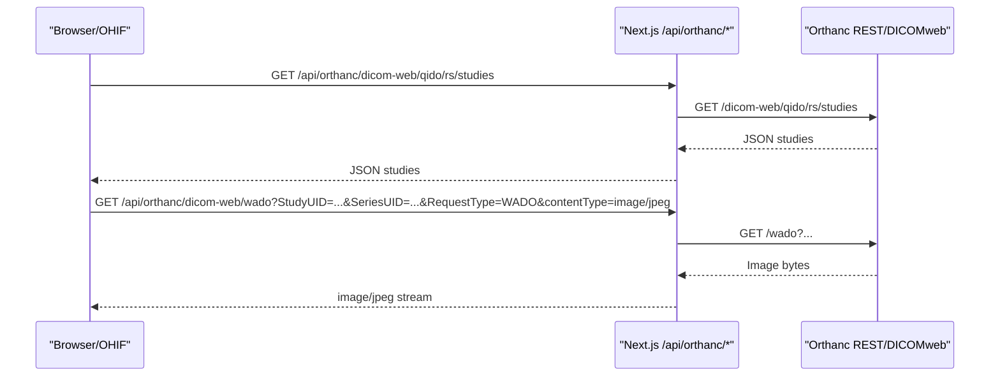

**Diagram sources**
- [src/app/api/orthanc/dicom-web/[...path]/route.ts:15-70](file://src/app/api/orthanc/dicom-web/[...path]/route.ts#L15-L70)

**Section sources**
- [README.md:66-89](file://README.md#L66-L89)
- [docker-compose.yml:41-55](file://docker-compose.yml#L41-L55)

## Detailed Component Analysis

### DICOMweb Proxy (/api/orthanc/dicom-web/[...path])
- Purpose: Same-origin proxy for QIDO-RS, WADO-RS, and STOW-RS so that viewers like OHIF can communicate without CORS issues and without exposing PACS credentials to the browser.
- Security: Sanitizes path segments, rejects traversal attempts, and injects server-side auth headers.
- Timeouts and errors: Uses an abort signal timeout for upstream fetches and returns structured error responses when Orthanc is unreachable.

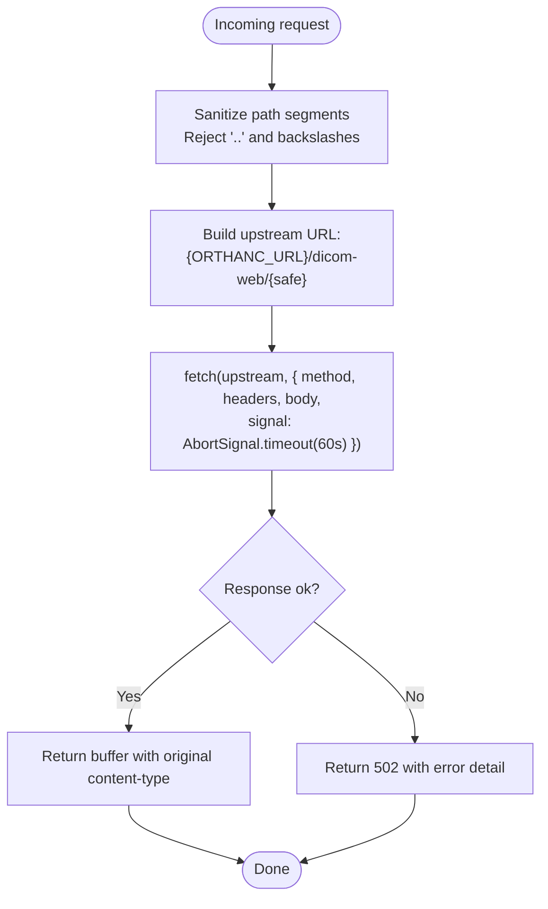

**Diagram sources**
- [src/app/api/orthanc/dicom-web/[...path]/route.ts:15-70](file://src/app/api/orthanc/dicom-web/[...path]/route.ts#L15-L70)

**Section sources**
- [src/app/api/orthanc/dicom-web/[...path]/route.ts:15-70](file://src/app/api/orthanc/dicom-web/[...path]/route.ts#L15-L70)

### Worklist Management
- Orthanc worklist proxy: Queries Orthanc’s Modality Worklist with optional modality and date filters. On failure, falls back to local scheduled appointments.
- Local fallback: Joins appointments, patients, referrals, and equipment tables to build a rich worklist entry set, filtered by modality and status.
- Enterprise worklist: A separate endpoint provides advanced filtering, faceted search, and priority sorting across workflow stages.

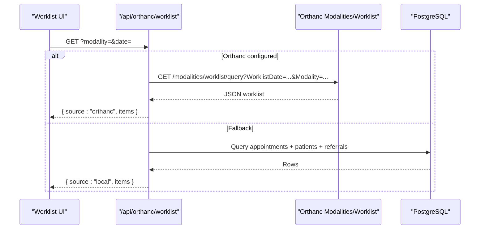

**Diagram sources**
- [src/app/api/orthanc/worklist/route.ts:16-79](file://src/app/api/orthanc/worklist/route.ts#L16-L79)
- [src/app/api/worklist/route.ts:26-118](file://src/app/api/worklist/route.ts#L26-L118)

**Section sources**
- [src/app/api/orthanc/worklist/route.ts:16-79](file://src/app/api/orthanc/worklist/route.ts#L16-L79)
- [src/app/api/worklist/route.ts:26-118](file://src/app/api/worklist/route.ts#L26-L118)
- [src/app/api/worklist/facets/route.ts:9-30](file://src/app/api/worklist/facets/route.ts#L9-L30)

### Study Retrieval (/api/orthanc/studies)
- Aggregates Orthanc studies with expand flags and enriches modalities by scanning series to ensure consistent labels even when study-level modalities are missing.
- Filters out studies without identifiable patients to keep the worklist meaningful.

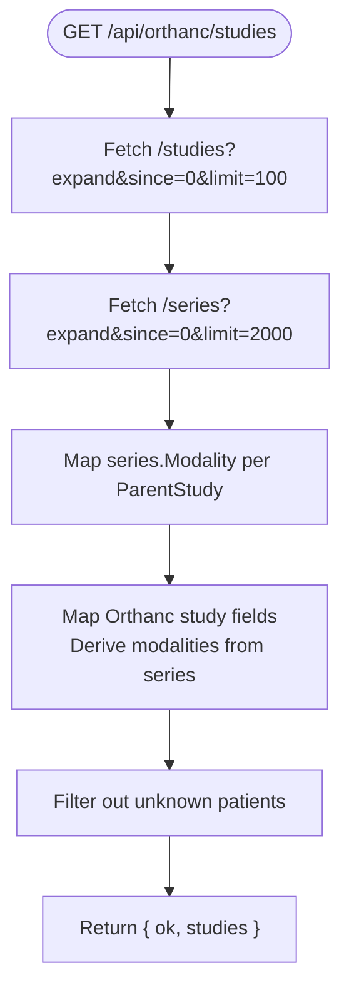

**Diagram sources**
- [src/app/api/orthanc/studies/route.ts:20-85](file://src/app/api/orthanc/studies/route.ts#L20-L85)

**Section sources**
- [src/app/api/orthanc/studies/route.ts:20-85](file://src/app/api/orthanc/studies/route.ts#L20-L85)

### Series Detail (/api/orthanc/series/[id])
- Retrieves a series with its instances and expected instance count, mapping key DICOM tags into a client-friendly structure.

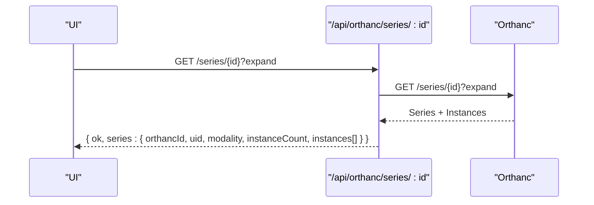

**Diagram sources**
- [src/app/api/orthanc/series/[id]/route.ts:17-76](file://src/app/api/orthanc/series/[id]/route.ts#L17-L76)

**Section sources**
- [src/app/api/orthanc/series/[id]/route.ts:17-76](file://src/app/api/orthanc/series/[id]/route.ts#L17-L76)

### Patient Metadata (/api/orthanc/patients/[id])
- Concurrently fetches patient details and associated studies to return a compact summary including stability and last update timestamps.

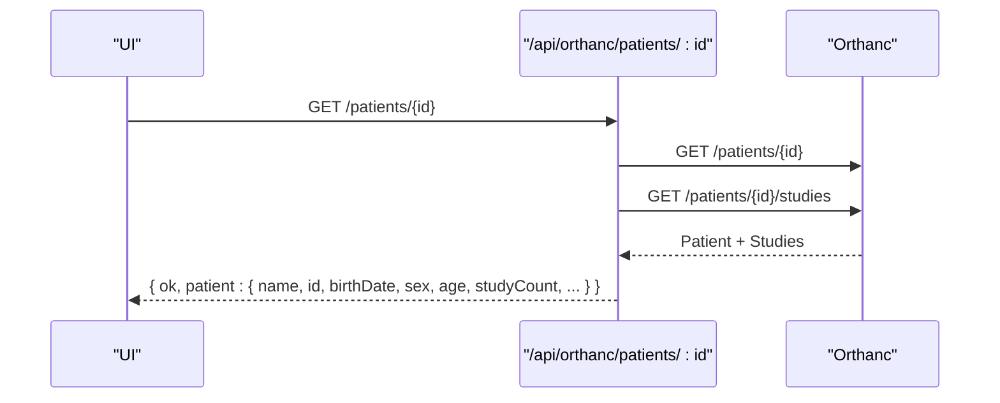

**Diagram sources**
- [src/app/api/orthanc/patients/[id]/route.ts:7-63](file://src/app/api/orthanc/patients/[id]/route.ts#L7-L63)

**Section sources**
- [src/app/api/orthanc/patients/[id]/route.ts:7-63](file://src/app/api/orthanc/patients/[id]/route.ts#L7-L63)

### Upload and STOW-RS (/api/orthanc/upload)
- Accepts multipart form data with DICOM files and forwards each to Orthanc’s instances endpoint using application/dicom content type.
- Audits uploads and publishes events for observability.

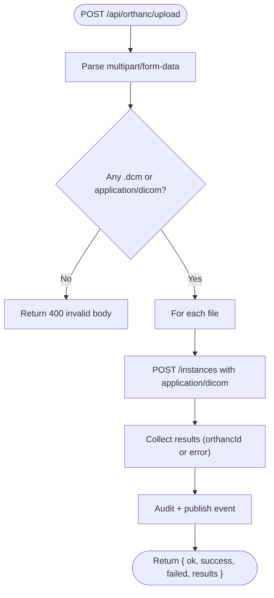

**Diagram sources**
- [src/app/api/orthanc/upload/route.ts:16-78](file://src/app/api/orthanc/upload/route.ts#L16-L78)

**Section sources**
- [src/app/api/orthanc/upload/route.ts:16-78](file://src/app/api/orthanc/upload/route.ts#L16-L78)

### Routing via C-STORE (/api/orthanc/routing)
- Routes a study to a target modality or peer using Orthanc’s modalities/peers store endpoints.
- Audits actions and publishes events with job identifiers.

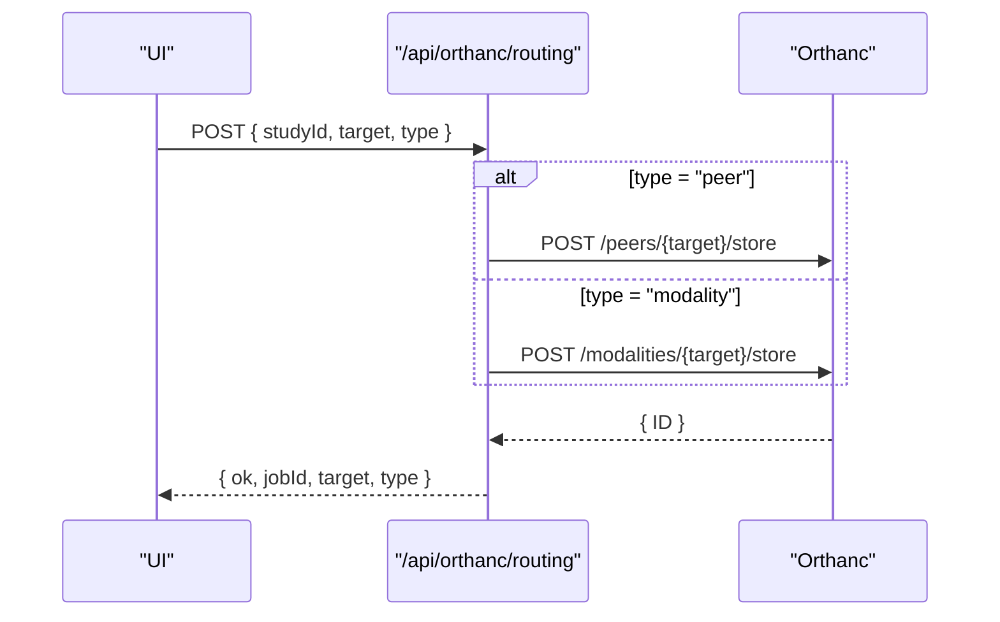

**Diagram sources**
- [src/app/api/orthanc/routing/route.ts:15-68](file://src/app/api/orthanc/routing/route.ts#L15-L68)

**Section sources**
- [src/app/api/orthanc/routing/route.ts:15-68](file://src/app/api/orthanc/routing/route.ts#L15-L68)

### Storage Commitment (/api/orthanc/storage-commitment)
- Triggers a storage commitment job for all instances in a study by first expanding the study to collect instance IDs, then posting to Orthanc’s storage-commitment endpoint.

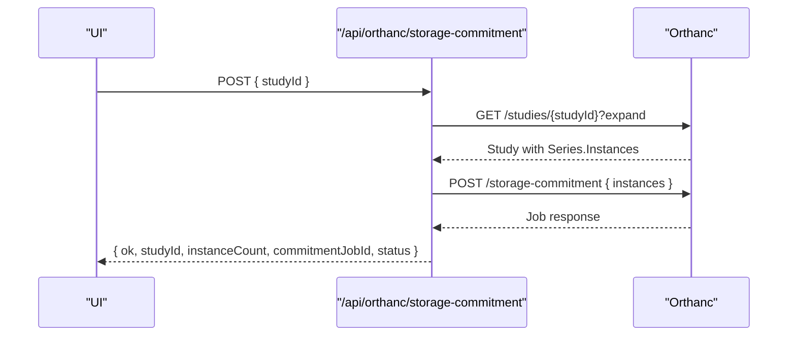

**Diagram sources**
- [src/app/api/orthanc/storage-commitment/route.ts:13-79](file://src/app/api/orthanc/storage-commitment/route.ts#L13-L79)

**Section sources**
- [src/app/api/orthanc/storage-commitment/route.ts:13-79](file://src/app/api/orthanc/storage-commitment/route.ts#L13-L79)

### Generic Proxy (/api/orthanc/proxy)
- Provides a sanitized pass-through for arbitrary Orthanc REST resources with strict validation of the path parameter.

**Section sources**
- [src/app/api/orthanc/proxy/route.ts:7-33](file://src/app/api/orthanc/proxy/route.ts#L7-L33)

## Dependency Analysis
- Configuration dependencies:
  - Docker Compose exposes Orthanc on HTTP port 8042 and configures environment variables for name, DICOMweb enablement, and authentication.
  - Orthanc JSON files define storage directories, plugin loading (DICOMweb, PostgreSQL index/storage), and DICOMweb roots.
- Runtime dependencies:
  - API routes depend on environment-driven Orthanc base URL and shared helpers for timed fetches and auth headers.
  - Worklist may depend on PostgreSQL schema for local fallback.

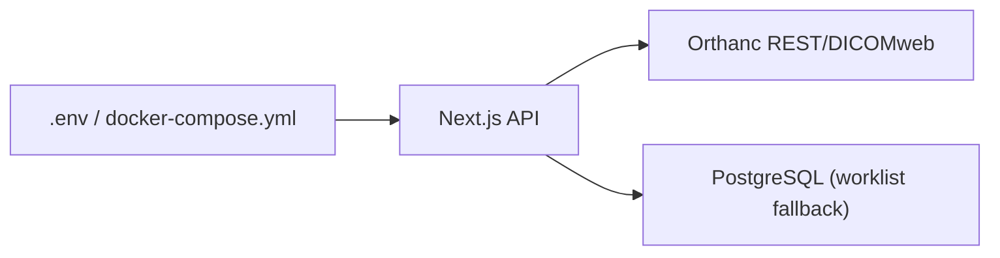

**Diagram sources**
- [docker-compose.yml:41-55](file://docker-compose.yml#L41-L55)
- [services/orthanc.json:1-16](file://services/orthanc.json#L1-L16)
- [docker/orthanc/orthanc.json:1-21](file://docker/orthanc/orthanc.json#L1-L21)

**Section sources**
- [docker-compose.yml:41-55](file://docker-compose.yml#L41-L55)
- [services/orthanc.json:1-16](file://services/orthanc.json#L1-L16)
- [docker/orthanc/orthanc.json:1-21](file://docker/orthanc/orthanc.json#L1-L21)

## Performance Considerations
- Large dataset handling:
  - Studies endpoint paginates with limits and expands series to derive modalities; consider tuning limits based on PACS size.
  - Series expansion uses reasonable limits; avoid unbounded queries in production.
- Network timeouts:
  - DICOMweb proxy uses a 60-second abort timeout for upstream fetches.
  - Timed fetch wrappers enforce specific timeouts per operation (e.g., 8–30 seconds depending on endpoint).
- Streaming optimization:
  - WADO-RS images are streamed as buffers directly to clients, minimizing memory overhead.
  - Use appropriate WADO parameters (e.g., RequestType=WADO&contentType=image/jpeg) to reduce payload size.
- Concurrency:
  - Patient metadata endpoint performs concurrent reads for patient and studies to reduce latency.
- Caching:
  - DICOMweb proxy disables caching to ensure fresh data; consider adding cache-control at the viewer level where appropriate.

[No sources needed since this section provides general guidance]

## Troubleshooting Guide
- Orthanc not configured:
  - Many endpoints return a “not_configured” reason when the Orthanc base URL is missing. Verify environment configuration and health checks.
- Upstream HTTP errors:
  - Endpoints propagate upstream status codes prefixed with “upstream_http_” to aid diagnostics. Check Orthanc logs and connectivity.
- Unreachable Orthanc:
  - Timeouts or network failures result in 502 responses with detailed messages. Inspect container health and networking.
- Invalid proxy paths:
  - Path sanitization rejects traversal and malformed inputs. Ensure correct segment encoding and no query injection.
- Worklist fallback:
  - If Orthanc worklist fails, the system falls back to local appointments. Confirm database connectivity and schema integrity.

**Section sources**
- [src/app/api/orthanc/dicom-web/[...path]/route.ts:15-70](file://src/app/api/orthanc/dicom-web/[...path]/route.ts#L15-L70)
- [src/app/api/orthanc/proxy/route.ts:7-33](file://src/app/api/orthanc/proxy/route.ts#L7-L33)
- [src/app/api/orthanc/worklist/route.ts:16-79](file://src/app/api/orthanc/worklist/route.ts#L16-L79)
- [src/app/api/orthanc/studies/route.ts:20-85](file://src/app/api/orthanc/studies/route.ts#L20-L85)
- [src/app/api/orthanc/series/[id]/route.ts:17-76](file://src/app/api/orthanc/series/[id]/route.ts#L17-L76)
- [src/app/api/orthanc/patients/[id]/route.ts:7-63](file://src/app/api/orthanc/patients/[id]/route.ts#L7-L63)

## Conclusion
The platform integrates Orthanc PACS through a secure, server-side proxy layer that centralizes authentication, sanitizes requests, and optimizes data flows for viewers and applications. Specialized endpoints simplify common tasks such as worklist retrieval, study and series browsing, patient lookups, uploads, routing via C-STORE, and storage commitment. Robust error handling, timeouts, and fallback mechanisms ensure resilience. With careful tuning of limits and timeouts, the system scales to handle large datasets while maintaining responsive user experiences.